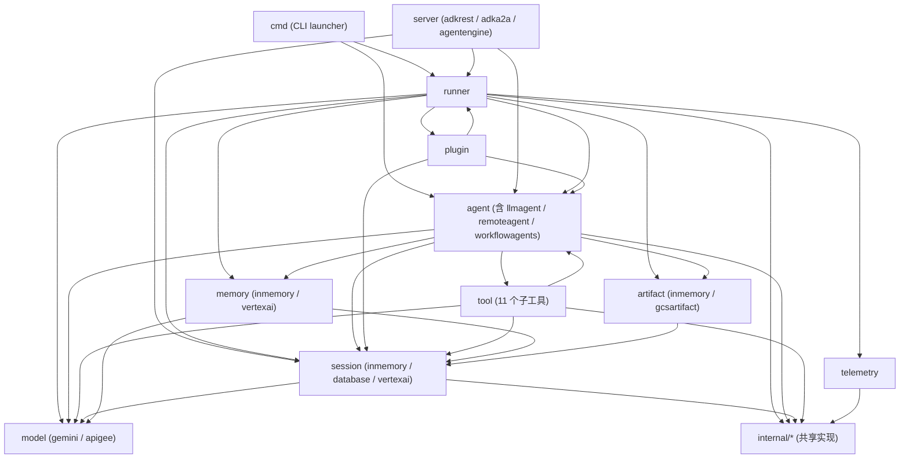
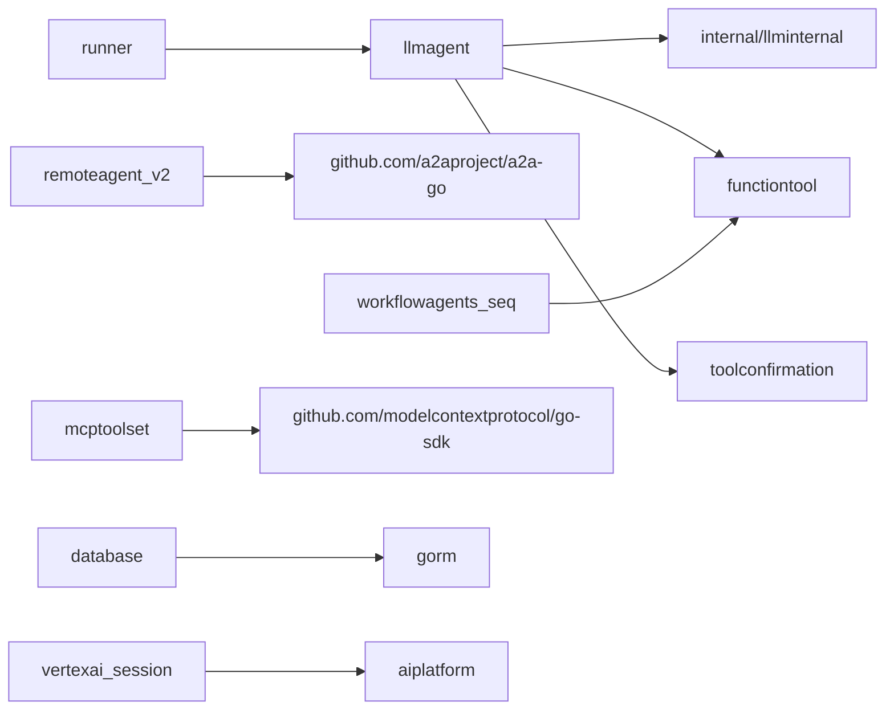
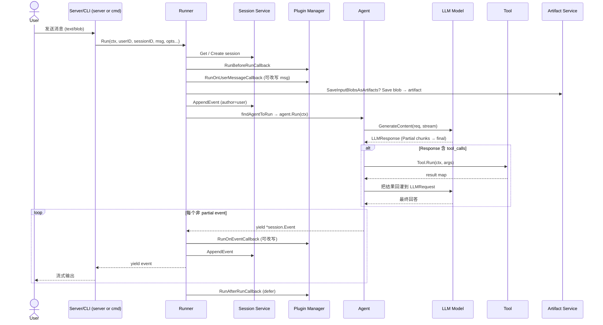
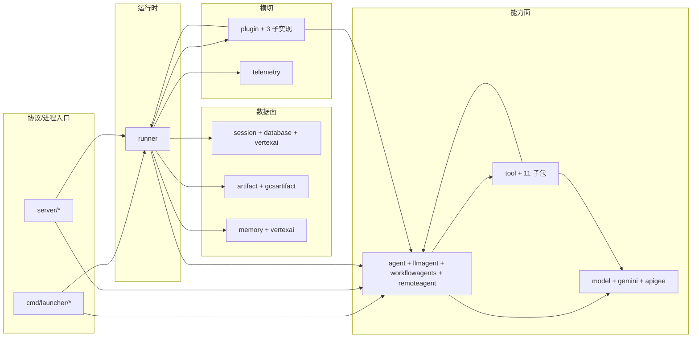

# 顶层架构

> **锁定 commit**：`d06992e2b1ec2c9b95c6070e0fd12d50a43e4c99`
> **面向读者**：架构师 / 二次开发工程师 / 新贡献者
> **作用**：用一张图 + 一段代码 + 一节文字带读者建立 ADK 的"心智模型"。

---

## 1. 项目目标与非目标

### 目标

- **以最小成本构建可生产化的 AI Agent**：把"接 LLM、加工具、跑对话、落会话、暴露成服务"这条链路打通，让用户用 ~30 行代码就能跑起一个真实 Agent（参见 §5 的 `examples/quickstart/main.go`）。
- **解耦的策略后端**：模型（Gemini / Apigee / 自研）、会话存储（InMemory / GORM / Vertex AI Agent Engine）、Artifact 后端、Memory 后端都能以接口替换（`model.LLM` / `session.Service` / `artifact.Service` / `memory.Service`）。
- **多 Agent 协作原生支持**：父子 Agent 树、`workflowagents` 编排器（Sequential / Parallel / Loop）、`agenttool` 把 Agent 当 Tool 调用都是一等公民（`agent/agent.go:43`、`agent/workflowagents/...`）。
- **可观测与可扩展**：Plugin 钩子覆盖 `BeforeRun` / `AfterRun` / `OnEvent` / `OnUserMessage`（`plugin/plugin.go`），OpenTelemetry 集成（`telemetry/setup_otel.go`），不强行绑定任何 vendor。

### 非目标

- **不内置 Web UI / 聊天前端**：`server/adkrest` 只暴露 REST + SSE；`server/adka2a` 只实现 A2A 协议；具体前端由用户在 `examples/web` 或自己项目中编写。
- **不替代传统 Agent 框架**：ADK 强调"Go 原生、类型安全、显式接口"，与 LangChain / AutoGen 的"Python 动态拼接"风格不同。两者可共存，但本项目不试图兼容 Python 生态。
- **不强制使用 Google Cloud**：Vertex AI / GCS 是可选 backend；纯本地用 InMemory 也能跑全部功能。
- **不实现完整 A2A Server 协议栈**：`server/adka2a` 是 A2A 协议的薄封装层（`server/adka2a/v2/executor.go`），完整协议由 `github.com/a2aproject/a2a-go` 提供。

---

## 2. 模块全景图

ADK 共有 11 个顶层模块 + 1 个 `internal/` 子包集合。下图展示它们的"主被依赖"关系（基于 `grep` 验证）。



**看图指引**：箭头方向 = "依赖谁"。核心调度入口是 `runner`；数据面是 `session` + `artifact` + `memory`；能力面是 `agent` + `tool` + `model`；横切关注是 `plugin` + `telemetry`；协议/进程入口是 `server` + `cmd`。`internal/` 不是顶层模块，是各模块共用的私有实现（不可被外部 import）。

关键子模块依赖图（仅展示高频被引用的子包）：



**看图指引**：`llmagent` 是 99% 实际 agent 的实现入口；`llminternal` 提供 LLM-tool 循环（`internal/llminternal/base_flow.go`）；`workflowagents/sequentialagent` 会注入 `task_completed` 工具；`mcptoolset` 通过 MCP SDK 把外部工具桥接到 ADK；`session/database` 走 GORM、`session/vertexai` 走 Vertex AI。

---

## 3. 核心抽象一览

四个最关键的接口 / 类型，是阅读所有其他文档的"锚点"。

### `agent.Agent`

- **位置**：`agent/agent.go:43`
- **签名**：`Name() / Description() / Run(InvocationContext) iter.Seq2[*session.Event, error] / SubAgents() / FindAgent / FindSubAgent`
- **设计意图**：所有 ADK Agent 的最薄抽象。`Run` 返回 `iter.Seq2`（Go 1.23 拉序列），调用方消费到 `yield` 返回 `false` 时立即终止（`agent/agent.go:46`）。**当前推荐用 `agent.New(cfg)` 或各子包构造函数（`llmagent.New`、`remoteagent.NewA2A`、`workflowagents/...`）**；接口直接实现预留了未来扩展空间（`agent/agent.go:42` 注释明确说明）。

### `runner.Runner`

- **位置**：`runner/runner.go:116`
- **关键方法**：`Run(ctx, userID, sessionID, msg, opts...) iter.Seq2[*session.Event, error]`（`runner/runner.go:131`）与 `RunLive(ctx, userID, sessionID, ...) (agent.LiveSession, iter.Seq2[...])`（`runner/runner.go:328`）
- **设计意图**：ADK 的"会话级运行时门面"——把"用户输入 → 找到目标 Agent → 调用 → 落库 → 串联 Plugin 钩子"封装成两个统一入口。`Run` 适合一次性请求-响应；`RunLive` 适合实时双向流（bidi）。两者共享 plugin 派发与 session 落库逻辑。

### `tool.Tool`

- **位置**：`tool/tool.go:38`
- **签名**：`Name() / Description() / IsLongRunning() bool`（**仅 3 个方法**）
- **设计意图**：所有"可被 LLM 调用的能力"的最薄契约。可执行工具需额外实现 internal 包内的 `FunctionTool` / `StreamingFunctionTool` / `RequestProcessor`（`internal/toolinternal/tool.go:28-42`），公共接口刻意保持极小，避免污染下游 11 个子工具的实现。HITL 装饰器 `WithConfirmation`（`tool/tool.go:143`）与白名单 `FilterToolset`（`tool/tool.go:89`）是公共接口仅有的两个"组合子"。

### `session.Session` / `session.Service`

- **位置**：`session/session.go:32` / `session/service.go:25`
- **核心方法**：`Service` 五方法（`Create / Get / List / Delete / AppendEvent`），`Session` 暴露 `ID / AppName / UserID / State() / Events()`
- **设计意图**：会话 = 一次用户对话的所有可观测数据（状态 + 事件流）。`Service` 是统一的存储抽象，三种开箱即用的后端：`InMemoryService()`（`session/service.go:35`，测试 / 单进程）、`session/database`（GORM，支持 Postgres / MySQL / Spanner / SQLite）、`session/vertexai`（Vertex AI Agent Engine 远程）。`Event` 内嵌 `model.LLMResponse` + `EventActions`，后者承载状态 delta、artifact delta、`TransferToAgent`、`Escalate`、`SkipSummarization` 等控制动作（`session/session.go:143`）。

---

## 4. 端到端数据流（高层版）

下图覆盖了 ADK 一次"用户输入 → Agent 回应"的完整路径。详细 5 个流程（单轮对话 / 工具调用 / 多 Agent 协作 / 长会话 / Live 双向流）见 `01-core-flows.md`。



**看图指引**：核心节点是 `Runner`，它做了 4 件事：路由（`findAgentToRun`）、落库（`Session.AppendEvent`）、串联（`Plugin Manager` 钩子）、转发（yield 给调用方）。`LLM` 与 `Tool` 都由 `Agent` 持有（不是 Runner 直接持有）；Runner 只在它们产出的 event 上做后置处理。

---

## 5. 一段代码看完所有抽象

下面这段代码来自 `examples/quickstart/main.go`，60 行，浓缩了 ADK 全部核心抽象。逐行注释标注每个抽象的角色。

```go
package main

import (
    "context"
    "log"
    "os"

    "google.golang.org/genai"

    "google.golang.org/adk/agent"
    "google.golang.org/adk/agent/llmagent"             // [agent] LLM Agent 实现
    "google.golang.org/adk/cmd/launcher"
    "google.golang.org/adk/cmd/launcher/full"
    "google.golang.org/adk/model/gemini"                // [model] Gemini 后端
    "google.golang.org/adk/tool"
    "google.golang.org/adk/tool/geminitool"             // [tool]  Gemini 原生工具
)

func main() {
    ctx := context.Background()

    // —— 抽象 1：model.LLM ——
    model, err := gemini.NewModel(ctx, "gemini-3.1-flash-lite", &genai.ClientConfig{
        APIKey: os.Getenv("GOOGLE_API_KEY"),
    })
    if err != nil { log.Fatalf("Failed to create model: %v", err) }

    // —— 抽象 2：tool.Tool (Toolset 中的成员) ——
    // —— 抽象 3：agent.Agent ——
    a, err := llmagent.New(llmagent.Config{
        Name:        "weather_time_agent",
        Model:       model,                            // LLM 后端
        Description: "Agent to answer questions about the time and weather in a city.",
        Instruction: "Your SOLE purpose is to answer questions about the current time and weather ...",
        Tools: []tool.Tool{
            geminitool.GoogleSearch{},                  // 一个 Tool
        },
    })
    if err != nil { log.Fatalf("Failed to create agent: %v", err) }

    // —— 抽象 4：Loader（agent.NewSingleLoader） + Launcher ——
    config := &launcher.Config{
        AgentLoader: agent.NewSingleLoader(a),          // 把 Agent 包成可被 runner 查找的 loader
    }

    l := full.NewLauncher()
    if err = l.Execute(ctx, config, os.Args[1:]); err != nil {
        log.Fatalf("Run failed: %v\n\n%s", err, l.CommandLineSyntax())
    }
}
```

**逐行解读**：

| 行号区域 | 引用的抽象 | 角色 |
|---|---|---|
| `examples/quickstart/main.go:35` | `gemini.NewModel` | 实现 `model.LLM`（`model/llm.go:26`）的具体后端，构造后可直接 yield 流式响应 |
| `examples/quickstart/main.go:43-49` | `llmagent.New` | 构造一个 `agent.Agent`（`agent/agent.go:55` 的 `agent.New` 是其内部基类），把 Model/Tools/Instruction 组装在一起 |
| `examples/quickstart/main.go:46` | `geminitool.GoogleSearch` | 实现 `tool.Tool` + 内部 `FunctionTool`，由 LLM 主动触发；展示"Gemini 原生工具也能用" |
| `examples/quickstart/main.go:53` | `agent.NewSingleLoader`（`agent/loader.go:43`） | 把单个 Agent 注册为可查找的入口 |
| `examples/quickstart/main.go:55-58` | `full.NewLauncher().Execute` | 内部会创建 `InMemoryService`（`session.Service`）+ `runner.New` + 启动 console/web/a2a server（`cmd/launcher/full`） |

**隐藏的抽象**：例子没有显式构造 `session.Service`，因为 `cmd/launcher/full` 会默认装配 `session.InMemoryService()`（`session/service.go:35`）。真正生产化时，调用方需自行提供 `Runner.Config.SessionService`（`runner/runner.go:44-58`）。

---

## 6. 依赖与包边界

顶层包导入关系（取自 `grep "google.golang.org/adk/"`）：



**包边界规矩**（基于实际 import + 设计意图）：

- **`internal/` 是私有禁地**：外部包严禁 `import google.golang.org/adk/internal/...`；Go 工具链会直接拒绝。`internal/context`、`internal/llminternal`、`internal/plugininternal`、`internal/sessionutils`、`internal/telemetry`、`internal/agent/{parentmap,runconfig}`、`internal/toolinternal` 等都是共享实现，可被多个顶层模块使用但不应作为公共 API。
- **`runner` 是唯一允许同时持有 Agent + Session + Artifact + Memory 的模块**：这是它作为"调度门面"的特权；其他模块若需要多 Service 协作应通过 `agent.InvocationContext`（`agent/context.go:62`）间接获取，而不是直接 import 各 Service 包。
- **`session` 不允许 import `runner` / `agent`**：反过来可以，但 session 是被 agent/runner 调用的"被调方"，避免循环依赖。`session.Event` 内嵌 `model.LLMResponse` 是已知的紧耦合（`session/session.go:24`），但 session 不依赖 `model.LLM` 接口本身。
- **`tool` 与 `agent` 互引**：`tool.Toolset.Tools(ctx agent.ReadonlyContext)` 需要 agent 的上下文类型（`tool/tool.go:63`），所以 tool 依赖 agent；同时 agent 通过 `tool.Tool` 注入能力（`agent/llmagent/llmagent.go`）。这是有意为之的"两个核心抽象互相可见"，但具体实现（如 `tool/functiontool`）不应反向被 agent 强依赖。
- **`model` 是最底层之一**：只依赖 `google.golang.org/genai` + `internal/llminternal`，**不依赖** `agent` / `tool` / `session`。这是为了保证 LLM 后端可独立测试和替换。

---

## 7. 并发模型

ADK 自身**几乎不主动创建 goroutine**；并发模型以"调用方驱动 + 局部并行优化"为主。

- **`Runner.Run` / `Runner.RunLive` 是同步函数**：返回 `iter.Seq2` 拉序列（`runner/runner.go:131`、`runner/runner.go:328`），调用方在 `for ... range` 中按需 `yield`；调用方停止消费即终止生成。这意味着一个 Runner 实例**不**跨协程安全——`agent.ReadonlyContext` / `agent.CallbackContext` 的状态都假设在单 invocation 单协程内。
- **少数模块有内部并行**：`session/vertexai.Get` 用 `errgroup` 并发拉 session 详情 + events（`session/vertexai/vertexai.go:75-103`）；`tool/loadartifactstool` 用 `errgroup` 并发加载多个 artifact（`tool/loadartifactstool/load_artifacts_tool.go:185-198`）；`agent/workflowagents/parallelagent` 用 `errgroup` + `resultChan` 并行跑子 agent 但**事件序列化仍单线程**（`agent/workflowagents/parallelagent/agent.go:67-100`）。
- **锁的分布**：`session/inmemory.go` 顶层有 `sync.RWMutex`（`session/inmemory.go:40`），每个 session 内还有独立锁（`session/inmemory.go:309`）实现"不同 session 的写并发"；`tool/mcptoolset/connectionRefresher` 用 `sync.Mutex` 保护 MCP 长连接重连（`tool/mcptoolset/client.go:43`）；`tool/skilltoolset/skill/*preload*.go` 用 `sync.RWMutex` 保护技能元数据缓存。
- **无全局可变状态**：除 `log.Printf` 两处（`runner/runner.go:598`、`runner/runner.go:612`）外，ADK 不维护任何全局可写状态——这使得多 Runner / 多 Agent 实例可以在同一进程共存。

---

## 8. 错误处理与可观测性总览

**错误处理**：

- **没有自定义错误类型分层**。ADK 普遍使用 `fmt.Errorf("...: %w", err)` 包装底层错误，少数 sentinel 错误：`session.ErrStateKeyNotExist`（`session/session.go:179`）、`tool.ErrConfirmationRequired` / `tool.ErrConfirmationRejected`（`tool/tool.go:32-35`）、`tool/skilltoolset/skill/source.go:24-31` 的一组 skill 错误。
- **业务级 vs 协议级错误的"双通道"**：`model.LLMResponse.ErrorCode` / `ErrorMessage` 承载业务级失败（如 `SAFETY`、`RECITATION`、prompt block，`model/llm.go:64-65`），调用方可在不中断流程的情况下处理；真正的协议错误通过 `iter.Seq2` 的 `error` 返回值传递。
- **典型失败模式**：`agent.New` 检测 sub-agent 重复（`agent/agent.go:59`）、`runner.New` 校验 `Agent / SessionService` 非空（`runner/runner.go:80-86`）、`session.AppendEvent` 拒绝 `Partial == true`（`session/inmemory.go:204` 等）、`functiontool.Run` 用 `recover()` 把用户函数 panic 包成错误（`tool/functiontool/function.go:187-191`）。

**可观测性**：

- **`telemetry` 模块**：封装 OpenTelemetry trace + span；`agent.Run` 启动 `invoke agent` span（`agent/agent.go:164`），`model.GenerateContent` 创建 `generate_content <model>` span（`internal/telemetry/telemetry.go:99-137`）。Gemini 后端自动带 `x-goog-api-client: google-adk/<version>` 遥测头（`model/gemini/gemini.go:112-115`）。
- **`plugin` 模块**：13 个钩子覆盖 agent / model / tool / event / user message 全链路（详见 `03-modules/08-plugin.md`）。`loggingplugin` 是开箱即用的日志实现（`plugin/loggingplugin/`）。
- **不强制绑定 OTLP 后端**：`telemetry/setup_otel.go` 是初始化入口，业务方可注入任意 `trace.TracerProvider` / `metric.MeterProvider`，ADK 不硬编码。

---

## 9. 设计模式与架构风格

| 模式 | 在 ADK 中的体现 |
|---|---|
| **组合优于继承** | `agent` 是私有 struct（`agent/agent.go:139`），子类型（LLM / Remote / Workflow / Loop / Parallel / Sequential）通过**嵌入**或**包装**实现，不走 Go 继承；`llmagent.LLMAgent` 通过 `agentinternal.Reveal` 改写 `AgentType` 字段而非建子类。 |
| **接口隔离** | `tool.Tool` 只有 3 个方法（`tool/tool.go:38`），可执行工具 / 流式工具 / schema 注入工具的接口（`internal/toolinternal/tool.go:28-42`）单独放在 internal 包，避免公共 API 被撑大。 |
| **依赖注入** | `Runner.Config`（`runner/runner.go:44-58`）接受所有 Service 与 Agent；`functiontool.New` 用泛型 + schema 反射注入用户函数；`apigee.NewModel` 用 Functional Options 注入 HTTP 配置（`model/apigee/apigee.go:59-80`）。 |
| **回调链** | `agent.BeforeAgentCallbacks` / `AfterAgentCallbacks`（`agent/agent.go:97, 106`）、`llmagent.BeforeModelCallbacks` / `AfterModelCallbacks` / `BeforeToolCallbacks` / `AfterToolCallbacks`（`agent/llmagent/llmagent.go:176-275`）、plugin 的 13 个钩子。返回非 nil 即短路后续 callback。 |
| **策略模式** | `model.LLM`（`model/llm.go:26`）可替换 Gemini / Apigee / 自研；`session.Service`（`session/service.go:25`）可替换 InMemory / GORM / Vertex AI；`artifact.Service` 可替换 InMemory / GCS；`memory.Service` 可替换 InMemory / Vertex AI。 |
| **观察者** | `plugin.PluginManager`（`internal/plugininternal/plugin_manager.go`）监听 runner 事件流；`session.Event` 上报后自动派发给所有 plugin 的 `OnEventCallback`。 |
| **装饰器** | `tool.FilterToolset`（`tool/tool.go:89`）给任何 Toolset 加白名单过滤；`tool.WithConfirmation`（`tool/tool.go:143`）给任何 Toolset 加 HITL；`agent.trackedArtifacts`（`agent/callback_context.go:243`）把"保存 artifact + 写 ArtifactDelta"两步合成一步。 |
| **拉序列（iter.Seq2）替代 channel** | Go 1.23 引入的 `iter.Seq2[*session.Event, error]`（`runner/runner.go:131`）统一了同步 / 流式 / Live 的返回类型；消费方用 `for ... range` 即可，无需 channel / callback 样板。 |

---

## 10. 延伸阅读

跨章节链接：

- **核心流程详解**：[`01-core-flows.md`](./01-core-flows.md) —— F1 单轮对话、F2 工具调用、F3 多 Agent 协作、F4 长会话与 Session 持久化、F5 Live 双向流。
- **扩展点指南**：[`02-extension-points.md`](./02-extension-points.md) —— 自定义 agent / tool / model / session / artifact / memory / plugin / server 的接口与代码骨架。
- **模块详情**：
  - [`03-modules/01-agent.md`](./03-modules/01-agent.md)
  - [`03-modules/02-model.md`](./03-modules/02-model.md)
  - [`03-modules/03-tool.md`](./03-modules/03-tool.md)
  - [`03-modules/04-runner.md`](./03-modules/04-runner.md)
  - [`03-modules/05-session.md`](./03-modules/05-session.md)
  - [`03-modules/06-artifact.md`](./03-modules/06-artifact.md)
  - [`03-modules/07-memory.md`](./03-modules/07-memory.md)
  - [`03-modules/08-plugin.md`](./03-modules/08-plugin.md)
  - [`03-modules/09-telemetry.md`](./03-modules/09-telemetry.md)
  - [`03-modules/10-server.md`](./03-modules/10-server.md)
  - [`03-modules/11-internal.md`](./03-modules/11-internal.md)
- **术语表与文件索引**：[`04-appendix.md`](./04-appendix.md)