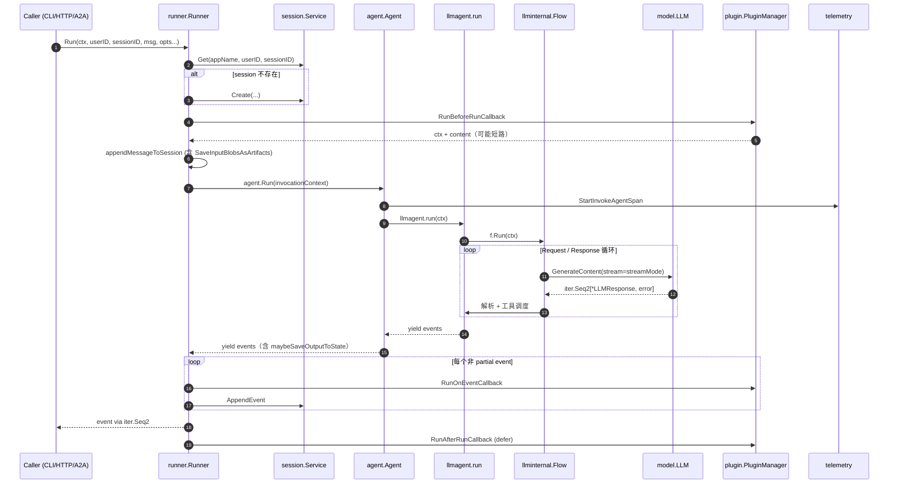
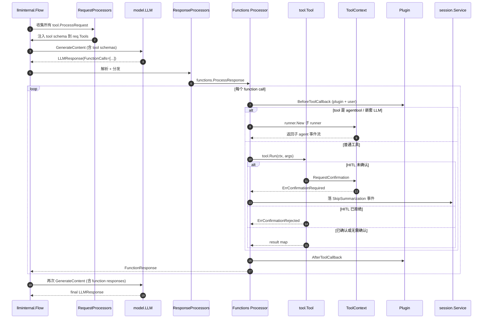
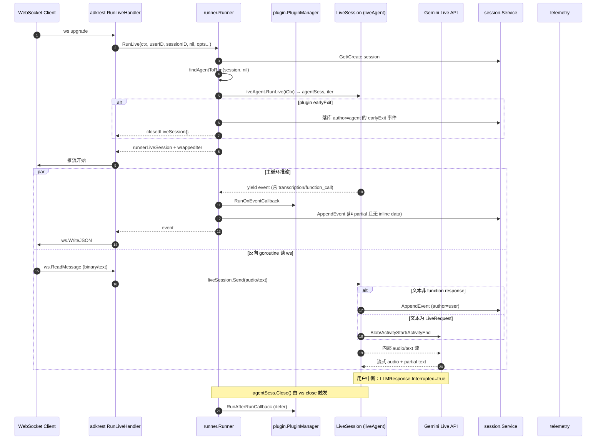

# 端到端核心流程

本文档覆盖 ADK 的 5 个最关键端到端流程。每个流程以"场景 → 时序图 → 步骤详解 → 状态变化 → 错误路径 → 延伸阅读"六段式结构组织。所有图表为 Mermaid 时序图，引用代码行号均基于锁定 commit `d06992e2b1ec2c9b95c6070e0fd12d50a43e4c99`。

| 编号 | 流程 | 入口 | 涉及的核心模块 |
|---|---|---|---|
| F1 | 单轮对话 | `runner.Runner.Run` | runner / agent / llmagent / model / session / plugin / telemetry |
| F2 | 工具调用 | F1 中 Model 返回 `tool_calls` | tool / llmagent / runner |
| F3 | 多 Agent 协作 | 父 Agent 配置 `sub_agents` 或 `agenttool` | agent / workflowagents / tool/agenttool |
| F4 | 长会话与 Session 持久化 | 多轮输入 / 从 SessionID 恢复 | session / runner / database / vertexai |
| F5 | Live 双向流 | `agent.RunLive` 系列 | runner / llmagent / server/adkrest / server/adka2a |

---

## F1. 单轮对话

### 场景与触发

用户发送一条文本消息（不含上一轮的 tool response），期望得到一次完整的"输入 → 模型推理 → 落库"端到端结果。入口位于 `runner.Runner.Run`，签名见 `runner/runner.go:131`。它是 `runner.Runner` 唯一公开的非 Live 方法，调用方（CLI / REST handler / A2A executor 等）通过 `for event, err := range runner.Run(ctx, userID, sessionID, msg, opts...)` 消费事件流。

### 时序图



看图指引：横跨"会话准备 → 插件前置 → agent 委派 → LLM 循环 → 事件回流 → 插件后置"六个阶段。注意 `plugin.RunBeforeRunCallback` 可能让 runner 合成一个 `author=user` 的 earlyExit 事件后立即退出（`runner/runner.go:218-232`），整条主循环就不再走。

### 关键步骤详解

1. **应用 RunOption 与构造 iCtx** —— `(*Runner).Run` 先把 `RunOption` 应用到 `runOptions`（`runner/runner.go:136-139`），再 `sessionService.Get` 拿到 `storedSession`，必要时按 `AutoCreateSession` 创建（`runner/runner.go:142-164`）。
2. **注入 ctx 与构造服务装饰器** —— `parentmap`、`runconfig`、`pluginManager` 注入 ctx（`runner/runner.go:172-176`）；`artifactinternal`/`imemory` 把可选的 `ArtifactService` / `MemoryService` 包装成 `agent.Artifacts` / `agent.Memory`（`runner/runner.go:178-196`）；最后 `icontext.NewInvocationContext` 构造 `InvocationContext`（`runner/runner.go:198-205`）。
3. **appendMessageToSession** —— `pluginManager.RunOnUserMessageCallback` 可改写 msg；若 `SaveInputBlobsAsArtifacts` 开启则把 `InlineData` 存为 `artifact_<invocationID>_<i>` 并替换为文本占位（`runner/runner.go:557-572`）；最后构造 author=user 的事件 `AppendEvent`（`runner/runner.go:574-587`）。
4. **plugin earlyExit 分支** —— 若 `RunBeforeRunCallback` 返回非空 content，runner 合成一个 author=user 的 event 并 yield 一次即返回（`runner/runner.go:218-232`）。
5. **agent.Run 主循环** —— `agent.Run`（`agent/agent.go:162`）启动 invoke span，包装 yield 让每个事件自动写 `TraceAgentResult`，构造新的 `invocationContext`，先后跑 `runBeforeAgentCallbacks` → `a.run(ctx)` → `runAfterAgentCallbacks`（`agent/agent.go:247`, `:306`）。
6. **LLM step** —— `(*llmAgent).run`（`llmagent/llmagent.go:361`）构造 `llminternal.Flow` 并执行 `f.Run(ctx)`；flow 内部 request processor → LLM → response processor → tool 执行 → 状态更新，直到 final response 或 `EndInvocation`。
7. **event 回流与落库** —— runner 对每个非 partial event 先 `pluginManager.RunOnEventCallback` 再 `AppendEvent`（`runner/runner.go:243-260`）；`yield` 返回 false 或 `AppendEvent` 失败立即停止（`runner/runner.go:255-266`）。
8. **defer 钩子** —— `defer pluginManager.RunAfterRunCallback`（`runner/runner.go:212-216`）只在调用方消费完迭代器后才触发，语义为"一次 Run 的收尾"。

### 状态变化

- **session**：每个非 partial event 经 `Service.AppendEvent` 落库；event 的 `Actions.StateDelta` 在 `AppendEvent` 中由 `updateSessionState` 合并到 `session.state`，随后 `trimTempDeltaState` 过滤掉 `temp:` 前缀键（`session/inmemory.go:204`、`session/database/service.go:327`）。
- **artifact**：`SaveInputBlobsAsArtifacts=true` 时 `InlineData` 被 `artifactinternal.Save` 写入 artifact 后端（`runner/runner.go:557-572`）；回调里用 `trackedArtifacts.Save` 写入的 artifact 会自动登记 `ArtifactDelta`（`agent/callback_context.go:243`）。
- **memory**：本流程不主动写 memory；`preloadmemorytool` 之类的工具可能读取，但写入由 `memory.Service.AddSession` 单独触发。
- **telemetry**：`agent.Run` 启动 "invoke agent" span（`agent/agent.go:164`）；每次 yield 触发 `TraceAgentResult`；LLM 端由 `internal/telemetry` 创建 `generate_content <modelName>` span 并写入 `FinishReason`/token 计数。

### 错误路径

| 场景 | 触发点 | 现象 |
|---|---|---|
| session 缺失且未开 `AutoCreateSession` | `runner/runner.go:147-151` | yield `(nil, err)`；error = `failed to get session: %w` |
| plugin 早退 | `runner/runner.go:218-232` | 仅 yield 一个 earlyExit 事件，主循环不再执行 |
| `BeforeAgentCallback` 短路 | `agent/agent.go:247-275` | 构造 author=本 agent 的事件并 `EndInvocation` |
| `AppendEvent` 失败 | `runner/runner.go:257-260` | 包成 `failed to add event to session: %w`，yield error 后退出 |
| LLM 返回 `ErrorCode != ""` | `internal/llminternal/converters/converters.go:23-73` | `LLMResponse.ErrorCode/ErrorMessage` 承载业务错误（`SAFETY`/`RECITATION`），agent 据此决定是否 `EndInvocation` |
| genai 调用失败 | `model/gemini/gemini.go:130-132` | 包成 `failed to call model: %w`，flow 终止 |

### 延伸阅读

- [00-overview.md §4 端到端数据流（高层版）](./00-overview.md#4-端到端数据流高层版)
- [02-extension-points.md §2 自定义 Agent](./02-extension-points.md#2-写一个自定义-agent)
- [03-modules/01-agent.md](./03-modules/01-agent.md)
- [03-modules/04-runner.md](./03-modules/04-runner.md)
- [03-modules/02-model.md](./03-modules/02-model.md)

---

## F2. 工具调用

### 场景与触发

F1 主循环中，LLM 返回的 `LLMResponse` 包含 `function_calls`，flow 据此进入工具执行阶段。这是 F1 的子流程，调用栈与 F1 共享；F2 单独成段是因为它涉及 tool 模块的契约、HITL 流和结果回灌三个独立关注点。入口在 `llmagent.run` 内部的 response processor 链（`llmagent/llmagent.go:361`）。

### 时序图



看图指引：关注"schema 注入（ProcessRequest）→ 函数调度（ProcessResponse）→ HITL 三态分支（Required/Rejected/Confirmed）→ 结果回灌"四段。`Functions Processor` 是 `llmagent.New` 装载的默认 processor 之一，详见 `llmagent/llmagent.go:176-187`。

### 关键步骤详解

1. **Schema 注入** —— 每个实现了 `ProcessRequest(ctx, req)` 的 tool 在 LLM 请求前被调用，通过 `toolutils.PackTool`（`internal/toolinternal/toolutils/toolutils.go:42`）把自己的 `Declaration()` 追加到 `req.Config.Tools[*].FunctionDeclarations`。
2. **解析 function call** —— `llmagent` 的 `Functions Processor` 把 `LLMResponse.FunctionCalls` 解析成结构化字段，然后顺序执行每个调用；并发版本见 `llminternal` 的 parallel function call 路径。
3. **BeforeToolCallback** —— `OnToolCallbacks` 与 plugin 的 `RunBeforeToolCallback` 先跑；返回非 nil 时短路本次调用（`llmagent/llmagent.go:264-275`）。
4. **HITL 检查** —— `functionTool.Run`（`tool/functiontool/function.go:185`）和 `WithConfirmation` 装饰的 tool 在 `tool/tool.go:203` 共享一套判断：
   - `ctx.ToolConfirmation().Confirmed == false` → 返回 `ErrConfirmationRejected`
   - `ctx.ToolConfirmation() == nil` → 计算 `requireConfirmation`；需要确认则 `ctx.RequestConfirmation(...)` 并设 `Actions().SkipSummarization = true`，返回 `ErrConfirmationRequired`（`function.go:202-225`）
5. **执行** —— 普通工具调用户函数；`agenttool` 通过 `runner.New` 启动子会话（`tool/agenttool/agent_tool.go:170-198`）；`mcptool` 走 `mcpClient.CallTool`（`tool/mcptoolset/tool.go:94`）。
6. **结果组装** —— 每个 tool 的输出被包装成 `genai.FunctionResponse`，连同 `ID` 拼到下一个 LLM 请求的 `Contents`；`FunctionResponse` 同时被 `AfterToolCallback` 拦截以做改写或观测。
7. **回灌与终态** —— flow 把所有 `FunctionResponse` 合成一条 LLM 请求再次调用；得到 `TurnComplete=true` 且非 tool call 时结束循环；过程中 `Event.LongRunningToolIDs` 可标记长任务，让 `Event.IsFinalResponse()` 不再触发 summarization。

### 状态变化

- **session**：每次 tool 调度会产生一个 `author=本 agent` 的事件，`Actions.ArtifactDelta` 记录 `trackedArtifacts.Save` 的版本号（`agent/callback_context.go:243`）；HITL 待确认时 `actions.RequestedToolConfirmations` 列表被写入并配合 `SkipSummarization=true`（`agent/callback_context.go:196`）。
- **artifact**：tool 可读可写 artifact；`loadartifactstool` 通过 `errgroup` 并发加载（`tool/loadartifactstool/load_artifacts_tool.go:184-198`）。
- **memory**：`loadmemorytool` 触发 `ctx.SearchMemory`；`preloadmemorytool` 在请求前自动注入 memory 上下文（`tool/preloadmemorytool/tool.go:74-98`）。
- **telemetry**：tool call 包成 span，由 `internal/telemetry` 写入 `execute_tool` op；可在 `/debug/trace/{event_id}` 查看（`server/adkrest/controllers/debug.go:33`）。

### 错误路径

| 场景 | 触发点 | 现象 |
|---|---|---|
| Tool 重名 | `internal/toolinternal/toolutils/toolutils.go:42` | `duplicate tool` |
| HITL 取消 | `function.go:202-225` | `ErrConfirmationRequired`，事件落库后 agent 循环暂停 |
| Handler panic | `function.go:187-191` | `recover()` 捕获并附带 stack 返回 |
| Schema 转换失败 | `function.go:197`（`typeutil.ConvertToWithJSONSchema`） | `unexpected args type` |
| 子 agent tool 异常 | `tool/agenttool/agent_tool.go:210-211` | `ErrorCode/ErrorMessage` 转 error 抛出 |
| MCP 连接断开 | `tool/mcptoolset/client.go:114` | `connectionRefresher` 静默重连（`mcp.ErrConnectionClosed` 等） |

### 延伸阅读

- [00-overview.md §3 核心抽象一览](./00-overview.md#3-核心抽象一览)
- [02-extension-points.md §3 自定义 Tool](./02-extension-points.md#3-写一个自定义-tool)
- [03-modules/03-tool.md](./03-modules/03-tool.md)
- [03-modules/01-agent.md §5 扩展点](./03-modules/01-agent.md#5-扩展点)

---

## F3. 多 Agent 协作

### 场景与触发

父 Agent 通过两种方式把控制权委托给子 Agent：

- **`SubAgents` 委派**：父 Agent 是 `llmagent`/`workflowagents/sequentialagent` 等，子 Agent 是 `llmagent` 或 remote agent。LLM 决定切换时通过 `EventActions.TransferToAgent` 表达目标 agent 名字，`FindAgent` 解析路径。
- **`agenttool` 委派**：父 Agent 把子 Agent 包装为 tool（`tool/agenttool/agent_tool.go:40`），子 Agent 通过 LLM 的 `tool_calls` 触发，每次调用都是一次"子 Run"。

入口包括 `agent/workflowagents/loopagent/agent.go:71`、`parallelagent/agent.go:67`、`sequentialagent/agent.go:76` 与 `tool/agenttool/agent_tool.go:170`。

### 时序图

```mermaid
sequenceDiagram
    autonumber
    participant U as User / Runner
    participant P as Parent Agent
    participant LLMP as LLM (parent)
    participant FlowP as llminternal.Flow (parent)
    participant Tree as agent.FindAgent
    participant Seq as SequentialAgent
    participant Loop as LoopAgent
    participant Para as ParallelAgent
    participant Sub as Sub-Agent (LLM/Remote)
    participant AT as agenttool

    Note over U,P: === 路径 A：SubAgents 委派 ===
    U->>P: Run(ctx)
    P->>FlowP: 构造并运行
    FlowP->>LLMP: 决策
    LLMP-->>FlowP: actions.TransferToAgent=name
    FlowP->>P: 构造 event (TransferToAgent=name)
    P->>Tree: FindAgent(name)
    Tree-->>P: subAgent
    P-->>U: 委派结束（runner.findAgentToRun 接管）
    Note right of P: 实际委派由 runner.findAgentToRun 完成（runner/runner.go:592-623）

    Note over U,P: === 路径 B：SequentialAgent ===
    U->>Seq: Run(ctx)
    loop 每个子 agent（顺序）
        Seq->>Sub: sub.Run(ctx)
        Sub-->>Seq: events
    end
    Seq-->>U: 所有子 agent 事件按序

    Note over U,P: === 路径 C：ParallelAgent ===
    U->>Para: Run(ctx)
    Para->>Para: errgroup + resultsChan + ackChan
    par 每个子 agent
        Para->>Sub: sub.Run(ctx)（独立 goroutine）
    end
    Para->>Para: 串行回推 event（ack backpressure）

    Note over U,P: === 路径 D：LoopAgent ===
    U->>Loop: Run(ctx)
    loop 直到 actions.Escalate 或 max_iterations
        Loop->>Sub: sub.Run(ctx)
        Sub-->>Loop: events（包含 exitlooptool 触发的 Escalate）
    end

    Note over U,P: === 路径 E：agenttool ===
    U->>P: Run(ctx) （父 LLM 决定调 agenttool）
    FlowP->>AT: agentTool.Run(ctx, args)
    AT->>AT: runner.New (子会话)
    AT->>Sub: sub.Run (子 ctx)
    Sub-->>AT: events
    AT-->>FlowP: 把子 agent 输出包成 FunctionResponse
```

看图指引：五段对应五种编排方式。**路径 A 是横向切换**（runner 重新委派），其余四种是**纵向嵌套**（在当前 invocation 内递归）。SequentialAgent 在 `RunLive` 模式会**就地修改** LLM 子 agent 的 `Tools` 和 `Instruction`，追加 `task_completed` 工具（`sequentialagent/agent.go:147-163`），是一个有副作用的扩展点。

### 关键步骤详解

1. **横向委派（`SubAgents`）**
   - LLM 输出 `actions.TransferToAgent=name`（实际为 `EventActions.TransferToAgent`，见 `session/session.go:143-160`）。
   - 当前 agent 循环通过 `EndInvocation` 收尾；runner 在下一轮 `Run`/`handleUserFunctionCallResponse` 中调 `findAgentToRun`（`runner/runner.go:592`）：从 session 倒序扫 events，用 `rootAgent.FindAgent(event.Author)` 找到 sub-agent，再用 `isTransferableAcrossAgentTree` 检查父链上无 `DisallowTransferToParent`（`runner/runner.go:653-666`）。
   - 兜底为 `rootAgent`（`runner/runner.go:622`）。
2. **SequentialAgent** —— `(*sequentialAgent).run`（`sequentialagent/agent.go:76`）依次 `for _, sub := range a.subAgents { sub.Run(ctx) }`，把每个 sub-agent 的事件透传。`RunLive` 模式下额外持有 `sequentialLiveSession`（`agent.go:91`）管理当前活跃子 session 的 `Send/Close`。
3. **ParallelAgent** —— `(*parallelAgent).run`（`parallelagent/agent.go:67`）用 `errgroup.WithContext` + 每个 sub-agent 独立 goroutine 跑 `sub.Run`，通过 `resultsChan + ackChan` 串行回推 event（`agent.go:71-100`）。`yield` 返回 false 时 `defer close(doneChan)` 通知 sub-agent 退出（`agent.go:112-127`），但错误仍传给 `errgroup`。
4. **LoopAgent** —— `(*loopAgent).run`（`loopagent/agent.go:71`）反复执行 `sub.Run`，遇到任何事件的 `actions.Escalate=true` 时提前终止；`exitlooptool` 是惯用退出手段（`tool/exitlooptool/tool.go:26`）。
5. **agenttool** —— `agentTool.Run`（`agent_tool.go:170`）调用 `runner.New(cfg)` 创建子 runner 与子 session，把 `_adk` 前缀之外的状态字段浅拷贝给子；用 `agentTool.SkipSummarization` 决定是否跳过 summarization（`agent_tool.go:40`）。
6. **A2A 远端委派** —— `remoteagent/v2.a2aAgent.run`（`remoteagent/v2/a2a_agent.go:199`）通过 `a2a-go` 客户端把消息发到对端；`a2aAgentRunProcessor` 聚合 partial 事件（`a2a_agent_run_processor.go:133-148`），仅在 terminal/snapshot 处输出非 partial 聚合。

### 状态变化

- **session**：横向委派不会自动开新 session，所有 agent 共享同一 `Session.ID`；纵向嵌套（workflowagents + agenttool）默认共享父 session，agenttool 显式启动子 session 时父子事件落在两个独立 `Session`。
- **artifact**：所有 agent 共享同一 `artifact.Service`（按 `appName/userID/sessionID/filename` 寻址）；`callbackContext.trackedArtifacts.Save` 写入的版本号会被记入 `EventActions.ArtifactDelta`。
- **memory**：在 `CallbackContext` 上调用 `SearchMemory` 等同于在父 session 的 memory 上查询；agenttool 子 session 不继承 memory 上下文。
- **telemetry**：`agent.Run` 启动的 span 通过 `telemetry.WrapYield`（`agent/agent.go:165-170`）在每个 event 上报 `TraceAgentResult`；子 agent 的 span 是父的 child span，可还原调用树。

### 错误路径

| 场景 | 触发点 | 现象 |
|---|---|---|
| 委派目标不可达 | `runner/runner.go:612-619` | `log.Printf` 打印 "Event from an unknown agent"，兜底 rootAgent |
| `DisallowTransferToParent` 阻断 | `runner/runner.go:653-666` | `isTransferableAcrossAgentTree` 返回 false，回退到前一个可转移 agent |
| 子 agent 缺失 `RunLive` | `sequentialagent/agent.go:173` | yield error 并终止 sequential live 流 |
| ParallelAgent 子 agent error | `parallelagent/agent.go:95` | 包成 `failed to run sub-agent %q: %w`；其他 goroutine 收到 ctx cancel 后退出 |
| agenttool 子会话异常 | `agent_tool.go:210-211` | `ErrorCode/ErrorMessage` 转 error 抛出，LLM 收到失败响应 |
| 远程 A2A 取消 | `remoteagent/v2/a2a_agent.go:314-316` | `cleanupRemoteTask`（5 秒超时）调 `CancelTask`；非 task 类型 Message 不触发 |

### 延伸阅读

- [03-modules/01-agent.md §4 关键流程](./03-modules/01-agent.md#4-关键流程)
- [03-modules/04-runner.md §5.2 findAgentToRun](./03-modules/04-runner.md)
- [02-extension-points.md §2 自定义 Agent](./02-extension-points.md#2-写一个自定义-agent)
- [03-modules/10-server.md §3 adka2a 子包](./03-modules/10-server.md)

---

## F4. 长会话与 Session 持久化

### 场景与触发

Session 是 ADK 的"记忆与状态"层。本流程覆盖三类触发：

1. **多轮输入** —— 用户连续多次 `Runner.Run` 共享同一 `SessionID`，上一轮的 events/state 被作为下一轮的上下文。
2. **冷启动恢复** —— 客户端只持有 `SessionID`，从持久化后端（in-memory / GORM / Vertex AI）取回完整 session。
3. **跨进程恢复** —— 把 `SessionID` 交给另一个进程（例如 A2A 远端）的 `Runner`，通过 `session.Service.Get` 拉取历史。

入口在 `session.Service` 的 `Create/Get/List/Delete/AppendEvent`（`session/service.go:25`）；runner 通过 `sessionService.Get/AppendEvent` 串联会话。

### 时序图

```mermaid
sequenceDiagram
    autonumber
    participant R as runner.Runner
    participant S as session.Service
    participant IM as inMemoryService
    participant DB as database.service
    participant VA as vertexai.service
    participant M as model.LLM
    participant A as agent.Agent

    R->>S: Get(appName, userID, sessionID)
    alt in-memory
        S->>IM: omap.Map.Scan by id
        IM-->>S: *session
    else database
        S->>DB: SELECT * WHERE composite key
        DB-->>S: storageSession → localSession
    else vertexai
        S->>VA: errgroup(GetSession, ListEvents)
        VA-->>S: 还原后的 Session
    end
    R->>A: Run(ctx) with storedSession
    A->>M: GenerateContent (last N events)
    M-->>A: 响应
    loop 每个非 partial event
        R->>S: AppendEvent(event)
        S->>S: updateSessionState (merge StateDelta)
        S->>S: trimTempDeltaState (drop temp:)
        alt database
            S->>DB: BEGIN; INSERT event; UPDATE state; COMMIT
        else vertexai
            S->>VA: AppendEvent RPC + LRO wait
        end
    end
```

看图指引：三套后端在 Get 阶段差异最大：in-memory 走 `omap.Map`（O(log n + k)，`session/inmemory.go:160`），database 走单 SQL，vertexai 走 gRPC + `errgroup` 并发（`session/vertexai/vertexai.go:75-103`）。AppendEvent 阶段则统一遵循"拒绝 `Partial==true` → merge StateDelta → trim temp: → 持久化"的合同。

### 关键步骤详解

1. **Create** —— `inMemoryService.Create`（`session/inmemory.go:46`）校验三键非空、`SessionID` 为空时填 `uuid.NewString()`；`sessionutils.ExtractStateDeltas`（`internal/sessionutils/utils.go:26`）按 `app:`/`user:`/其它拆三份写入二级表。`database.Create` 走单事务写 4 张表（`session/database/service.go:97`）；`vertexai.Create` 不允许用户给定 `SessionID`（`session/vertexai/vertexai.go:60`）。
2. **Get** —— 三种实现各做"深拷贝外壳 → 合并 app/user/session 三层状态 → 应用 `NumRecentEvents`/`After` 过滤 → 复制 events 切片"的近似动作。in-memory 用 `sort.Search` 二分定位 `After` 时间戳（`session/inmemory.go:115`）；database 用 `ORDER BY timestamp DESC LIMIT N` 倒着取再翻序；vertexai 把 GetSession 与 ListEvents 放到 `errgroup` 里并发（`session/vertexai/vertexai.go:75-103`）。
3. **AppendEvent 合同** —— in-memory 与 database 两种后端先 `Partial==true` 短路（`inmemory.go:204`、`database/service.go:327`）；vertexai 后端走 `AppendEvent`（`session/vertexai/vertexai.go:129`）直接调 client 写入远程仓库，不在 service 层做 partial 判断。内部 `appendEvent` 调用 `updateSessionState` 把 `StateDelta` 合并到 session.state，再 `trimTempDeltaState` 丢掉 `temp:` 前缀键，最后追加 events。database 还会用 `storageSess.UpdateTime.UnixMicro()` 做乐观锁（`database/service.go:374-382`），冲突时返回 `stale session error`。
4. **EventActions 的合同** —— `Actions.StateDelta` 写入 session.state（同名 key 覆盖），`ArtifactDelta` 记 artifact 版本号，`TransferToAgent/Escalate` 控制 agent 流程，`RequestedToolConfirmations` 触发 HITL，`SkipSummarization` 让 runner 不再生成 final summary（`session/session.go:143-160`）。
5. **多轮上下文窗口管理** —— `Agent.Run` 把 `Session.Events`（可被 `NumRecentEvents` 截断）作为 `LLMRequest.Contents` 喂给 LLM；`llmagent` 还通过 `IncludeContents`（`llmagent/llmagent.go:333-338`）控制是否注入。
6. **跨进程迁移** —— 客户端只需 `SessionID`；`Get` 后把 session 拷贝到新进程内 runner 的 `storedSession`，后续 `Run` 写入仍落在原 backend。

### 状态变化

- **session**：
  - `Create` 后 `State` 包含 app/user/session 三层并集；`Events` 为空。
  - `AppendEvent` 后 `LastUpdateTime` 更新；`state` 合并 `StateDelta` 后再裁剪 `temp:`。
  - `NumRecentEvents` 过滤在 `Get` 出口对 events 切片裁尾，不动底层存储。
- **artifact**：与 session 同一 `appName/userID/sessionID` 命名空间，但由独立 `artifact.Service` 管理；`EventActions.ArtifactDelta` 仅是元数据记录。
- **memory**：独立服务；session 不存 memory 内容，只在 `CallbackContext` 暴露 `Memory()` 用于查询。
- **telemetry**：session 模块不打 span；`Event` 作为数据载体被 `internal/telemetry/telemetry.go:81,160` 引用为 span 属性。

### 错误路径

| 场景 | 触发点 | 现象 |
|---|---|---|
| 重复 Create | `session/inmemory.go:52` | `session X already exists`；database 抛 GORM 唯一约束错误 |
| Session 不存在 | `session/inmemory.go:104` | `session %+v not found`；database 统一包成 `database error while fetching session`（**不区分业务不存在 vs 系统错误**） |
| 数据库 stale 写 | `session/database/service.go:374` | `stale session error: ...` |
| Vertex AI LRO 超时 | `session/vertexai/vertexai_client.go:116` | `LRO '%s' timed out after %d retries`（最多 10 次） |
| Vertex AI 自定义 SessionID | `session/vertexai/vertexai.go:60` | 直接拒绝 |
| `Partial==true` 写库 | 三个后端统一 | 静默丢弃 |
| 状态键缺失 | `session.State.Get` | `ErrStateKeyNotExist`（`session/session.go:179`） |

### 延伸阅读

- [03-modules/05-session.md](./03-modules/05-session.md)
- [02-extension-points.md §5 自定义 Session Backend](./02-extension-points.md#5-接入自定义-session-backend)
- [00-overview.md §6 依赖与包边界](./00-overview.md#6-依赖与包边界)
- [04-appendix.md §A.1 术语表](./04-appendix.md#a1-术语表)

---

## F5. Live 双向流

### 场景与触发

Live 模式用于"语音/视频/低延迟文本"双向交互：客户端既发送音频流（实时语音）也接收模型流式输出（含 function call、transcription、interrupted 标记）。与 F1 的请求-响应模式不同，Live 是长连接 + 用户可中断 + 多模态。

入口位于 `runner.Runner.RunLive`（`runner/runner.go:328`）；agent 端由 `llmagent.RunLive`（`llmagent/llmagent.go:396`）和 `sequentialagent.RunLive`（`sequentialagent/agent.go:125`）实现 `liveAgent` 接口。Server 层把 Live 暴露为 WebSocket（`server/adkrest/controllers/runtime.go:247`）和 A2A 流（`server/adka2a/v2/executor.go:161`）。

### 时序图



看图指引：F5 与 F1 的本质差异是"长连接 + 反向 goroutine + 可中断 + 多模态"。`runLive` 内部 `iCtx` 重新声明覆盖了外层 `ctx`（`runner/runner.go:395`），是两段不同生命周期。Chronological buffering（`runner/runner.go:430-523`）会把 transcription 进行期间的 function call 暂存，等 transcription 收尾后再按时间顺序补发。

### 关键步骤详解

1. **RunLive 主入口** —— `(*Runner).RunLive`（`runner/runner.go:328`）解析 options、Get/Create session、`findAgentToRun(storedSession, nil)`（`runner/runner.go:358`）；类型断言 `agentToRun.(liveAgent)` 失败返回 `agent does not support Live Run`（`runner/runner.go:363-366`）。
2. **强制 Live 模式** —— 把 `RunConfig.StreamingMode` 强制为 `StreamingModeBidi`、注入 `Live` 配置与 `pluginManager`（`runner/runner.go:368-373`）。
3. **plugin earlyExit** —— 若 `RunBeforeRunCallback` 返回内容，runner 合成 author=agent 的 earlyExit 事件并返回 `closedLiveSession{}`（`runner/runner.go:403-423`）；后续 `Send` 一律返回 `session is closed`（`runner/runner.go:320-322`）。
4. **wrappedIter 包装** —— `wrappedIter`（`runner/runner.go:430-523`）完成三件事：
   - `defer RunAfterRunCallback`
   - `RunOnEventCallback` 改写
   - **Chronological buffering**：当 `isTranscribing && isToolCallOrResp` 时把事件压入 `bufferedEvents`（`runner/runner.go:461-478`），等 transcription 收尾后再按时间顺序 flush（`runner/runner.go:480-507`）。
5. **Send 副作用** —— `runnerLiveSession.Send` 收到非 function response 的客户端文本时，直接写一个 author=user 的 event 到 session（`runner/runner.go:289-309`），是 Live 特有的"客户端直写会话"语义。
6. **agent LiveSession** —— `llmagent.RunLive`（`llmagent/llmagent.go:396`）建立 Live API 连接并维护反向 goroutine；`sequentialagent.RunLive` 用 `sequentialLiveSession`（`sequentialagent/agent.go:91`）管理当前活跃子 session。
7. **Server 暴露** —— `adkrest.RuntimeAPIController.RunLiveHandler`（`server/adkrest/controllers/runtime.go:247`）升级到 WebSocket，主循环 `eventIter → ws.WriteJSON`，反向 goroutine `ws.ReadMessage` 把 binary 当 `audio/pcm;rate=16000` 推给 `liveSession.Send`，text 解码为 `LiveRequest`（含 `Blob` / `ActivityStart` / `ActivityEnd`）；任一关闭都触发 `liveSession.Close()`。默认 `MaxLLMCalls=100`、`ResponseModalities=[ModalityAudio]`、transcription 开启。
8. **A2A Live** —— `adka2a/v2.Executor.Execute`（`server/adka2a/v2/executor.go:161`）按 `OutputMode`（`OutputArtifactPerRun` / `OutputArtifactPerEvent`）选 `artifactMaker` / `legacyArtifactMaker`（`task_artifact.go:26`, `:70`），把 streaming 事件翻译为 `TaskArtifactUpdateEvent` / `TaskStatusUpdateEvent`。

### 状态变化

- **session**：与 F1 同样经 `AppendEvent` 落库；`SaveInputBlobsAsArtifacts` 仍生效；Live 特有的"用户文本 → 事件"直写路径（`runner/runner.go:289-309`）会让客户端文本在到达 agent 之前先持久化。
- **artifact**：Live 模式下 audio/pcm 数据走 inline blob 路径，按需落 artifact；`adka2a` 输出模式决定 artifact id 分配（每次 run 一个 vs 每个 event 一个）。
- **memory**：本流程不主动写 memory；transcription 文本只在 session 里，不入 memory。
- **telemetry**：`generate_content` span 仍由 `llminternal.Flow` 写入；Live 特有的 `SessionResumptionHandle`（`model/llm.go:42-68`）允许断线后恢复。`Interrupted=true` 由 Gemini 主动写入 `LLMResponse.Interrupted`。

### 错误路径

| 场景 | 触发点 | 现象 |
|---|---|---|
| agent 未实现 `RunLive` | `runner/runner.go:363-366` | `agent does not support Live Run` |
| Live agent `Send` 错 | `runner/runner.go:305-307` | `failed to add user event to session: %w` |
| WebSocket 反向 read 失败 | `server/adkrest/controllers/runtime.go:247` | 主循环退出 + `liveSession.Close()` |
| plugin earlyExit | `runner/runner.go:403-423` | 后续 Send 一律返回 `session is closed` |
| A2A 长 function call 无响应 | `server/adka2a/v2/input_required.go:245` | `no input provided for function call ID %q` |
| subagent 取消失败 | `server/adka2a/v2/executor.go:266` | `errors.Join(failures...)` 聚合 + `log.Warn` |
| A2A Cleanup 串行 | `server/adka2a/v2/executor.go:311` | 注释 `TODO(yarolegovich): run in parallel` |

### 延伸阅读

- [03-modules/04-runner.md §5.3 RunLive](./03-modules/04-runner.md)
- [03-modules/10-server.md §3 adkrest](./03-modules/10-server.md)
- [02-extension-points.md §8 自定义 Server](./02-extension-points.md#8-暴露为自定义-server)
- [04-appendix.md §A.1 术语表 - Live](./04-appendix.md#a1-术语表)

---

## 跨流程注意事项

- **F1 + F2** 是"请求-响应"主链路；F2 是 F1 的子流程，仅在 `LLMResponse.FunctionCalls` 非空时被触发。
- **F3** 在两个层次上叠加于 F1：纵向嵌套（workflowagents / agenttool）递归走 F1；横向委派（TransferToAgent）会让 runner 切换到不同 root 后重新跑 F1。
- **F4** 不是独立流程，而是 F1/F2/F3/F5 的"持久化底座"。Session 状态由所有流程共享。
- **F5** 与 F1 的关键差异：长连接、可中断、多模态、`Send` 副作用、chronological buffering、`StreamingModeBidi` 强制设置。
- **plugin 钩子** 贯穿 F1/F5：`BeforeRunCallback` / `OnUserMessageCallback` / `BeforeAgentCallback` 在 Run 入口按序执行；`OnEventCallback` 在每个非 partial event 落库前执行；`AfterRunCallback` 仅在迭代器消费完后触发。详见 [03-modules/08-plugin.md](./03-modules/08-plugin.md)。

## 进一步阅读

- [00-overview.md](./00-overview.md) — 顶层架构
- [02-extension-points.md](./02-extension-points.md) — 8 个扩展面
- [03-modules/](./03-modules/) — 11 个模块详情
- [04-appendix.md](./04-appendix.md) — 术语表与文件索引