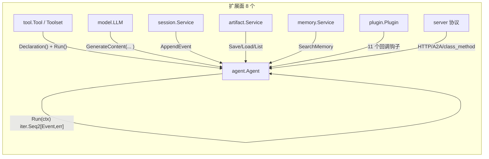
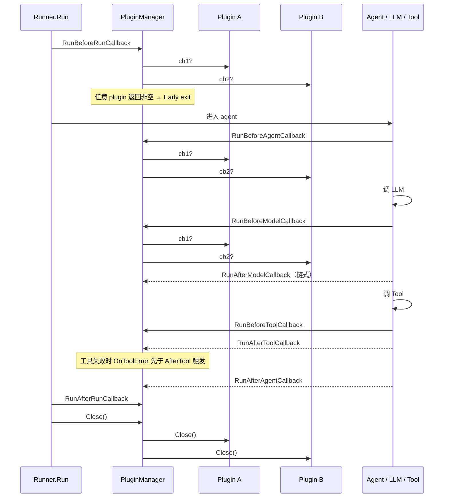

# 扩展点

> 本章面向"想在 ADK 之上做二次开发 / 替换默认实现 / 接入新协议"的工程师，回答"我应该改哪里、实现哪个接口"。
> 基于 commit `d06992e2b1ec2c9b95c6070e0fd12d50a43e4c99`。

## 1. 总览：可扩展面

ADK 把"业务无关的基础设施"与"业务相关的具体实现"分得很干净：基础接口稳定放在 `agent`、`tool`、`model`、`session`、`artifact`、`memory`、`plugin`、`server` 八个顶层包中；每个顶层包都至少有一个**最小契约** + 一组**参考实现** + 一组**官方可选装饰器**。下图把这 8 个面放在一张图上。



> **看图指引**：箭头方向表示"被 A1 消费"——ADK 把 `agent.Agent` 视为组合根，运行时调起 tool、请求 model、写入 session、读 artifact、查 memory，并在每个关键切面触发 plugin 钩子；server 则是把 agent 暴露成对外协议的壳。下一节按图中的 8 个面逐一拆解"要扩展这个面应该改什么"。

| 面 | 扩展什么 | 为什么 |
|---|---|---|
| agent | 实现 `agent.Agent` 接口或基于 `agent.New(cfg)` 注入自定义 `Run` 闭包 | 把"决策逻辑"从 LLM 循环换成你自己的状态机 / 规则引擎 / DSL |
| tool | 实现 `tool.Tool`（最小）或 `tool.Toolset`（多工具），或用 `functiontool` / `agenttool` 包一层已有 Go 函数 / 子 agent | 把"LLM 可调用的能力"按需注入；几乎所有业务定制都集中在此 |
| model | 实现 `model.LLM` 接口 | 接入新模型供应商（Anthropic、OpenAI、自研），统一走 LLM 工具调用协议 |
| session | 实现 `session.Service` 五方法 | 换持久化后端（公司内数据库、Redis 集群、自托管文件） |
| artifact | 实现 `artifact.Service` 六方法 | 换 blob 存储后端（S3、OSS、本地文件、加密层） |
| memory | 实现 `memory.Service` 两方法 | 换长期记忆后端（向量库、知识图谱、LLM 提炼后的 fact store） |
| plugin | 实现 `plugin.Plugin` 11 个回调 | 插入可观察性、安全审计、限流、参数注入、错误重试等横切关注点 |
| server | 实现 `a2asrv.AgentExecutor`（A2A）或 `http.Handler`（REST）或 `method.MethodHandler`（Agent Engine） | 把 ADK agent 暴露为新协议 / 新传输 |

下文 7 节（第 2-8 节）逐一展开每个面；第 9 节讲"哪些不该碰、升级兼容策略"。

## 2. 写一个自定义 Agent

ADK 中所有"可被 runner 调起来跑一段对话"的对象都是 `agent.Agent`：

```go
// agent/agent.go:43
type Agent interface {
    Name() string
    Description() string
    Run(InvocationContext) iter.Seq2[*session.Event, error]
    SubAgents() []Agent
    FindAgent(string) Agent
    FindSubAgent(string) Agent
    internal() *agent
}
```

接口的最后一项 `internal()` 是私有方法，源码注释明确说当前推荐**不要**直接实现接口，而是用 `agent.New(cfg Config)`（`agent/agent.go:55`）包装一个自定义 `Run` 闭包：

```go
// 最小骨架：把"决策逻辑"换成你自己的状态机
myAgent, _ := agent.New(agent.Config{
    Name:        "policy-agent",
    Description: "依据策略文档回答问题",
    Run: func(ctx agent.InvocationContext) iter.Seq2[*session.Event, error] {
        return func(yield func(*session.Event, error) bool) {
            // 这里你可以：
            //   yield 任意 session.Event
            //   yield(nil, err) 终止迭代
            //   主动 ctx.EndInvocation()
        }
    },
    BeforeAgentCallbacks: []agent.BeforeAgentCallback{ /* ... */ },
    AfterAgentCallbacks:  []agent.AfterAgentCallback{ /* ... */ },
})
```

典型场景与"为什么不直接实现接口"：

- **场景 A：纯规则 / 状态机** —— 不需要 LLM，但希望走 runner 的事件流、callback、plugin。`agent.New` 的 `Run` 闭包足够。
- **场景 B：远程规则引擎 / DSL** —— 把请求转发给外部服务，事件通过 `yield` 流式回传。
- **场景 C：把多 agent 编排搬出 `workflowagents`** —— 自己写一个 `Agent` 用 `SubAgents()` 树形结构组合子 agent。

`internal()` 限制：未来版本会放开自定义实现（`agent/agent.go:43` 处注释有 TODO 标记）；在那之前请用 `agent.New`，否则 `agentinternal.Reveal`（`agent/llmagent/llmagent.go:113-126`）那套"暴露内部 state"的黑魔法不会被应用到你的类型上。

`llmagent` 子包是另一种官方"自定义 agent"路径：在 `llmagent.New(...)`（`agent/llmagent/llmagent.go:340`）里通过 `InstructionProvider`（`agent/llmagent/llmagent.go:490`）、`IncludeContents`（`agent/llmagent/llmagent.go:333-338`）、`BeforeModelCallbacks`（`agent/llmagent/llmagent.go:176-187`）等组合，在不离开 LLM 循环的前提下做最大幅度的个性化。

## 3. 写一个自定义 Tool

最薄接口 `tool.Tool` 只要求三件事：可命名、可说明、是否长时运行。

```go
// tool/tool.go:38
type Tool interface {
    Name() string
    Description() string
    IsLongRunning() bool
}
```

但要让 LLM 真能调用它，还需要补两个方法。ADK 把这两个"附加接口"故意放在 internal 包里，避免污染公共 `Tool` 表面：

```go
// internal/toolinternal/tool.go:28-42（公共用户不需要 import 这行，但要知道存在）
type FunctionTool interface {
    tool.Tool
    Declaration() *genai.FunctionDeclaration
    Run(ctx agent.ToolContext, args any) (map[string]any, error)
}
type StreamingFunctionTool interface {
    tool.Tool
    Declaration() *genai.FunctionDeclaration
    RunStream(ctx agent.ToolContext, args any) iter.Seq2[string, error]
}
type RequestProcessor interface {
    ProcessRequest(ctx agent.ToolContext, req *model.LLMRequest) error
}
```

官方提供 3 条"免手写"路径，按工作量从小到大：

| 路径 | 适用 | 入口 |
|---|---|---|
| **`functiontool.New(cfg, fn)`** | 任何 `(ctx, args) -> (result, error)` 的 Go 函数；入参必须是 struct/map（`tool/functiontool/function.go:88`） | `tool/functiontool/function.go:37` 的 `Config` + `functionTool`（`:123`） |
| **`agenttool.New(agent, ...)`** | 把另一个 agent 当成可调用工具；内部启动子 session（`tool/agenttool/agent_tool.go:170-198`） | `tool/agenttool/agent_tool.go:40` 的 `agentTool` |
| **手写 `Tool` + `FunctionTool`** | 任何上述不适用的能力（如流式、双向协议、MCP 等） | 直接实现 `tool.Tool` + `Declaration() + Run()` |

**第 1 路径（最常用）**：

```go
// 反射 + JSON-Schema 自动推断 schema
greetTool, err := functiontool.New(functiontool.Config{
    Name:        "greet",
    Description: "向用户问好",
}, func(ctx agent.ToolContext, args struct{ Name string }) (struct{ Greeting string }, error) {
    return struct{ Greeting string }{Greeting: "hi " + args.Name}, nil
})
```

**第 2 路径（多 agent 组合）**：把 `subAgent` 包成可调用工具，LLM 决定何时调用它。

**第 3 路径**（需要 `Declaration() + Run()` 同时实现）典型代表：`mcptoolset`（`tool/mcptoolset/tool.go:59`）、`geminitool`（`tool/geminitool/tool.go:43`）等。一个骨架：

```go
type myTool struct{ name, desc string }
func (t *myTool) Name() string                 { return t.name }
func (t *myTool) Description() string          { return t.desc }
func (t *myTool) IsLongRunning() bool          { return false }
func (t *myTool) Declaration() *genai.FunctionDeclaration { /* 写死或动态 */ }
func (t *myTool) Run(ctx agent.ToolContext, args any) (map[string]any, error) {
    // 通过 ctx.Artifacts() / ctx.SearchMemory() / ctx.RequestConfirmation() 走 ADK 能力
}
```

> **看图指引**：tool 扩展的关键不是"怎么实现 Run"，而是"如何选路径"——能用 `functiontool` 就别手写；需要 LLM 不可见地预处理请求（如 `preloadmemorytool`）才需要 `ProcessRequest`；需要 LLM 可见的工具 schema 注入才走 `Declaration() + Run()`。

**Tool 集合与过滤**：多个 Tool 聚合成 `Toolset`（`tool/tool.go:57`）；`Predicate`（`tool/tool.go:67`）+ `FilterToolset`（`tool/tool.go:89`）+ `WithConfirmation`（`tool/tool.go:143`）是三个"零业务量"的装饰器，可在不写新 Tool 的情况下做白名单、过滤、HITL 注入。

**HITL 装饰器**：`WithConfirmation(ts, require, provider)`（`tool/tool.go:143`）会包出 `confirmationToolset`（`tool/tool.go:151`）→ `confirmationTool`（`tool/tool.go:183`）；只有当原 tool 实现了 `runnableTool`（`tool/tool.go:189`）才会被装饰；HITL 协议细节由 `toolconfirmation.FunctionCallName = "adk_request_confirmation"`（`tool/toolconfirmation/tool_confirmation.go:46`）与 `OriginalCallFrom`（`tool/toolconfirmation/tool_confirmation.go:86`）共同维护。

**Skill 扩展**：`tool/skilltoolset/skill/source.go:41` 的 `Source` 接口是 skill 系统的"物理来源"扩展点，官方提供 `fileSystemSource`（`tool/skilltoolset/skill/filesystem_source.go`）、`mergedSource`（`tool/skilltoolset/skill/merged_source.go`），可接入网络 / GCS / 数据库 / git 等任意 backend。

## 4. 接入自定义 Model

`model.LLM` 是整个 ADK 中最小的"生产端"接口（4 个方法、1 个返回类型）：

```go
// model/llm.go:26
type LLM interface {
    Name() string
    GenerateContent(ctx context.Context, req *LLMRequest, stream bool) iter.Seq2[*LLMResponse, error]
}
```

设计取舍是**用 `iter.Seq2` 统一"流式"与"非流式"**：把 `stream` 折叠成一个 bool 参数，消费方用同一个 `for ... range` 即可；中途 `return` 等同于"消费者放弃"，上游会按 context 取消关闭流。LLM 协议的两层错误模型：

- `error`（迭代器的第二个返回值）—— 协议级 / 网络级失败，整条迭代终止
- `LLMResponse.ErrorCode` / `ErrorMessage`（`model/llm.go:42-68`）—— 业务级失败（`SAFETY` / `RECITATION` / prompt block），与正常响应共享同一通道

官方实现可作为参考：

| 实现 | 入口 | 适用 |
|---|---|---|
| `gemini.NewModel(ctx, name, cfg)` | `model/gemini/gemini.go:49` | Gemini Developer API + Vertex AI，**ADK 主线** |
| `apigee.NewModel(ctx, name, opts...)` | `model/apigee/apigee.go:84` | 通过 Apigee 代理调用 Gemini；支持 5 种模型名 DSL（`apigee.go:134-175`） |

实现自定义 LLM 的最小骨架（伪代码）：

```go
type myLLM struct{ name string }
func (m *myLLM) Name() string { return m.name }
func (m *myLLM) GenerateContent(ctx context.Context, req *model.LLMRequest, stream bool) iter.Seq2[*model.LLMResponse, error] {
    return func(yield func(*model.LLMResponse, error) bool) {
        // 1. 把 req.Contents 翻译成你的 API 入参
        // 2. 流式时：每个 chunk 一个 yield(&LLMResponse{Partial: true, ...}, nil)
        // 3. 终止时：yield(&LLMResponse{Partial: false, TurnComplete: true, Content: ...}, nil)
        // 4. 业务错误用 ErrorCode/ErrorMessage；网络错误 yield(nil, err)
    }
}
```

**Tool calling 协议**：tool 列表的注入由"tool 端"通过 `ProcessRequest` 调用 `internal/toolinternal/toolutils.PackTool` 完成，**模型端不需要理解 `req.Tools` 的内部结构**——只要把 `req.Config` 透传给底层 SDK 即可。

**结构化输出**：`geminiModel` 会检测内部接口 `googlellm.GoogleLLM`（`internal/llminternal/googlellm/variant.go:39-41`）→ `GetGoogleLLMVariant()` 决定是否需要走 `NeedsOutputSchemaProcessor`（`variant.go:71-76`）；非 Google 系 LLM 可以忽略这条特殊路径。

**版本头装饰**：`mergeHeadersInterceptor`（`model/gemini/gemini.go:175-190`）演示了如何在不动 SDK 的前提下合并重复的 HTTP 头；自定义 LLM 若使用 `http.RoundTripper`，可以照搬这一招。

## 5. 接入自定义 Session Backend

`session.Service` 接口是 5 个方法的最小契约：

```go
// session/service.go:25
type Service interface {
    Create(ctx, *CreateRequest) (*CreateResponse, error)
    Get(ctx, *GetRequest) (*GetResponse, error)
    List(ctx, *ListRequest) (*ListResponse, error)
    Delete(ctx, *DeleteRequest) error
    AppendEvent(ctx, *AppendEventRequest) (*AppendEventResponse, error)
}
```

注意：每个方法都显式接收 `*XxxRequest` —— 这是为了将来加字段不破坏调用方签名。

官方实现：

| 后端 | 入口 | 定位 |
|---|---|---|
| `session/inmemory` | `inMemoryService`（`session/inmemory.go:39`） | 测试 / 单进程 / 演示用；进程内 `sync.RWMutex` + 有序 map `omap` |
| `session/database` | `database.NewSessionService`（`session/database/service.go`） | 关系型 DB（GORM dialect），支持 Postgres / MySQL / Spanner / SQLite |
| `session/vertexai` | `vertexAiService`（`session/vertexai/vertexai.go:28`） | Vertex AI Agent Engine 远程实现；含 LRO 等待（`vertexai_client.go:116`） |

**关键约束**（写自定义后端时必须遵守）：

1. **事件顺序**：`Events`（`session/session.go:79`）按时间升序排列，所有后端读出时必须保持 `Timestamp` 单调非降序。`session/inmemory.go:160` 用 `omap.Scan(lo, hi)` 保证。
2. **`AppendEvent` 原子性**：必须 `Partial==true` 拒绝（`session/inmemory.go:204`、`session/database/service.go:327`、`session/vertexai/vertexai.go:130` 三处都有断言）；同时必须**先 merge StateDelta → 再 trim temp: 前缀 → 再 append**（`session/inmemory.go:204-230`）。
3. **State 三层命名空间**：`app:` / `user:` / 其它 / `temp:`（`session/session.go:163-176`），拆分由 `sessionutils.ExtractStateDeltas`（`internal/sessionutils/utils.go:26`）负责。`temp:` 不持久化。
4. **并发安全**：in-memory 用 `sync.RWMutex` 守护 `sessions` / `appState` / `userState`（`session/inmemory.go:40`），每个 session 内部还有自己的锁（`session/inmemory.go:309`），让不同 session 的事件写入可并行。
5. **乐观锁（可选）**：database 实现用 `UpdateTime.UnixMicro()` 做 stale 检测（`session/database/service.go:374-382`），写自定义后端时建议照搬。

**复用测试**：所有后端都跑 `session_test.RunServiceTests`（`session/session_test/service_suite.go:76`）+ `SuiteOptions`，自定义后端可直接接这套 conformance 测试。

```go
// 骨架：自定义后端最小可用实现
type myService struct{ /* 连接池等 */ }
func (s *myService) Create(...) (...)  { /* 见 session/inmemory.go:46 */ }
func (s *myService) Get(...)    (...)  { /* 见 session/inmemory.go:95 */ }
func (s *myService) List(...)   (...)  { /* 见 session/inmemory.go:141 */ }
func (s *myService) Delete(...)        { /* 直接删 */ }
func (s *myService) AppendEvent(...) (...) {
    if req.Event.Partial { return nil, fmt.Errorf("partial events are not allowed") }
    // 1. merge StateDelta
    // 2. trim temp: 前缀
    // 3. append 到 events
    // 4. 持久化（事务化）
}
```

## 6. 接入自定义 Artifact / Memory Backend

这两个后端的接口契约比 `session.Service` 更小，扩展方式高度对称。

### 6.1 Artifact

```go
// artifact/service.go:31
type Service interface {
    Save(ctx, *SaveRequest) (*SaveResponse, error)
    Load(ctx, *LoadRequest) (*LoadResponse, error)
    Delete(ctx, *DeleteRequest) error
    List(ctx, *ListRequest) (*ListResponse, error)
    Versions(ctx, *VersionsRequest) (*VersionsResponse, error)
    GetArtifactVersion(ctx, *GetArtifactVersionRequest) (*GetArtifactVersionResponse, error)
}
```

`SaveRequest.Part`（`artifact/service.go:56-66`）是 `*genai.Part`（文本或 `InlineData`）；`Version=0` 在 `Load` / `Delete` 里分别代表"最新版本" / "所有版本"（`artifact/service.go:127-132, 167-172`）；`GetArtifactVersion` 是元数据通道，与 `Load`（拉内容）解耦。

**官方实现**：`inMemoryService`（`artifact/inmemory.go:36-40`，`sync.RWMutex` + `omap`）、`gcsService`（`artifact/gcsartifact/service.go:43-47`，对象布局 `{appName}/{userID}/{sessionID | user}/{fileName}/{version}`）。

**两个不变量**：

- `user:` 前缀的 `FileName` 会把 `SessionID` 强制改写为常量 `userScopedArtifactKey = "user"`（`artifact/inmemory.go:54`），实现"跨 session 共享"语义；新后端必须保留这个重写。
- 找不到时统一返回 `fmt.Errorf("...: %w", fs.ErrNotExist)`，调用方用 `errors.Is(err, fs.ErrNotExist)` 判断；不要字符串匹配。

**装饰层**：`agent/callback_context.go:243` 的 `trackedArtifacts` 把 `Save` 产生的 `Version` 写入 `EventActions.ArtifactDelta`，让事件回放能"追到"artifact 变化；这是写在 `agent` 包里、不在 `artifact` 包里的"上层装饰"，写自定义后端时不要试图重做这个逻辑。

### 6.2 Memory

```go
// memory/service.go:31
type Service interface {
    AddSessionToMemory(ctx, *AddSessionToMemoryRequest) error
    SearchMemory(ctx, *SearchRequest) (*SearchResponse, error)
}
```

**官方实现**：

- `InMemoryService()`（`memory/inmemory.go:30-34`）—— 关键词集合交集（`memory/inmemory.go:143-160`），无词干化、无排序
- `vertexai.NewService(ctx, cfg)`（`memory/vertexai/vertexai.go:46-58`）—— Vertex AI MemoryBank 远端实现；`ServiceConfig.StateKeySessionLastUpdateTime`（`memory/vertexai/vertexai.go:35-43`）支持增量同步

**三个非显而易见的事实**：

1. `InMemoryService` 的 `AddSessionToMemory` 是**覆盖式**（`memory/inmemory.go:90-106`）—— 同一 session 多次摄入只保留最后一次
2. `InMemoryService.SearchMemory` 对 ctx 取消无反应，长查询无法抢占（`memory/inmemory.go:109-141`）
3. 远端实现里 `Entry.ID` 字段不填（`memory/vertexai/vertexai_client.go:127-131`），`Content.Role` 固定为 `genai.RoleUser`（`memory/vertexai/vertexai_client.go:107-134`）—— 上层若依赖 ID 做去重需注意

**检索算法**对调用方**不可定制**（`extractWords` / `checkMapsIntersect` 都是 unexported）；要向量检索 / BM25 / 重排就需要换整个 `Service` 实现，不要试图"打补丁"。

## 7. 写一个 Plugin

Plugin 是 ADK 的"横切关注点"机制。所有回调通过一个 struct 表达，必须经 `plugin.New(cfg)` 构造（`plugin/plugin.go:50`）：

```go
// plugin/plugin.go:78
type Plugin struct {
    name string
    OnUserMessageCallback  OnUserMessageCallback   // 用户消息进入 runner 时
    BeforeRunCallback      BeforeRunCallback       // Run 启动
    AfterRunCallback       AfterRunCallback        // Run 结束
    OnEventCallback        OnEventCallback         // 任意 event 产出
    BeforeAgentCallback    agent.BeforeAgentCallback   // 复用 agent 包
    AfterAgentCallback     agent.AfterAgentCallback
    BeforeModelCallback    agent.BeforeModelCallback
    AfterModelCallback     agent.AfterModelCallback
    OnModelErrorCallback   agent.OnModelErrorCallback
    BeforeToolCallback     agent.BeforeToolCallback
    AfterToolCallback      agent.AfterToolCallback
    OnToolErrorCallback    agent.OnToolErrorCallback
    closeFunc              func() error
}
```

**生命周期**：



> **看图指引**：`PluginManager`（`internal/plugininternal/plugin_manager.go:38`）按注册顺序遍历 plugin，对每个 callback 依次调用；**首个非空结果短路**（`plugin_manager.go:84-86` 等多处 `// Early exit` 注释），整个回调链立即返回。这是稳定契约，可被用于"用 plugin 替换默认行为"。

**3 个官方参考实现**（位于 `plugin/` 下，生产代码未直接 import，定位为"参考 + 测试用例 + 调试模板"）：

| 实现 | 入口 | 用途 |
|---|---|---|
| `loggingplugin.New(name)` | `plugin/loggingplugin/logging_plugin.go:75` | 把 user/run/agent/LLM/tool 五层事件用 ANSI 灰色打印到 stdout |
| `functioncallmodifier.NewPlugin(cfg)` | `plugin/functioncallmodifier/plugin.go:29` | 在 `BeforeModel` 阶段往指定工具的 schema 注入额外参数；`AfterModel` 阶段把这些参数从 `FunctionCall.Args` 抽取到 session state |
| `retryandreflect.New(opts...)` | `plugin/retryandreflect/plugin.go:61` | 工具错误自愈：超过最大重试次数后把工具错误"反射"成结构化 LLM 提示；支持 `Invocation` / `Global` 两种 scope（`retryandreflect/plugin.go:54-59`） |

**关键约束**：

- **plugin 不可在 `Register` 之后再修改**：所有字段都是 unexported，构造后即冻结（`plugin/plugin.go:50`）
- **`closeFunc` nil-safe**：`plugin.New` 会自动填上 no-op（`plugin/plugin.go:69-72`），不会 panic
- **plugin 错误 = 整个 run 失败**：`PluginManager` 透传 error（`plugin_manager.go:81-83, 97-99, ...`），与 Python 端"忽略 plugin 错误"的行为不同
- **`BeforeModelCallback` 短路**必须返回 `nil, nil` 而不是空 `*model.LLMResponse{}`（`functioncallmodifier/plugin.go:87, 118`），否则 runner 误以为"模型已被处理过"
- **`OnToolError` 先于 `AfterTool` 触发**（`runner/runner.go`），`retryandreflect` 借 `AfterTool` 里检查 `response_type` 来避免误清计数（`retryandreflect/plugin.go:128-141`）

**注册入口**：runner 在 `runner.New` 阶段把所有 plugin 喂给 `plugininternal.NewPluginManager`（`runner/runner.go:93`），`registerPlugin` 按 `Name()` 去重（`plugin_manager.go:62-72`）。

## 8. 暴露为自定义 Server

ADK 已经在三个协议面给了"开箱即用"的 server：

| 协议 | 包 | 入口 | 适用 |
|---|---|---|---|
| A2A | `server/adka2a/v2` | `v2.NewExecutor(cfg)` （`server/adka2a/v2/executor.go:149`） | 让 ADK agent 接入 A2A 协议；`adka2a`（根目录）已 deprecated，**只用 v2** |
| REST + WebSocket | `server/adkrest` | `NewServer(ServerConfig)`（`server/adkrest/handler.go:81`） | HTTP REST + SSE + WebSocket，6 大子路由（sessions / runtime / apps / debug / artifacts / eval） |
| Agent Engine | `server/agentengine` | `NewHandler(launcher.Config)`（`server/agentengine/handler.go:39`） | 部署到 Vertex AI Agent Engine 时的 a2a-style `class_method` 调度协议 |

### 8.1 A2A（推荐做法）

`adka2a/v2.Executor`（`server/adka2a/v2/executor.go:149`）实现 `a2asrv.AgentExecutor`，把 `a2a.Message` ↔ `*session.Event` ↔ `*genai.Content` 双向转换。`ExecutorConfig`（`executor.go:95`）暴露 4 个生命周期回调 + 2 个 part 转换器：

```go
v2.NewExecutor(v2.ExecutorConfig{
    RunnerConfig: runner.Config{ /* ... */ },
    RunnerProvider: myProvider,                          // 可选：替换 runner 工厂
    BeforeExecuteCallback: func(...) {},                 // 进入 Execute 之前
    AfterEventCallback:    func(...) {},                 // 每个 event 转换后
    AfterExecuteCallback:  func(...) {},                 // Execute 完成
    A2APartConverter:      customA2AtoGenAI,             // 自定义 part 序列化
    GenAIPartConverter:    customGenAItoA2A,             // 返回 nil 表示丢弃
    OutputMode:            v2.OutputArtifactPerEvent,    // vs OutputArtifactPerRun
    A2AExecutionCleanupCallback: func(...) {},           // task 清理
})
```

`OutputMode`（`executor.go:60-70`）通过 `eventToArtifactTransform`（`server/adka2a/v2/task_artifact.go:30`）决定 artifact id 分配策略；两种实现 `artifactMaker`（`task_artifact.go:26`）和 `legacyArtifactMaker`（`task_artifact.go:70`）对应不同行为。

### 8.2 REST

`adkrest.NewServer(ServerConfig)`（`server/adkrest/handler.go:81`）接收 6 类 service + Debug telemetry 配置；公开 `ServeHTTP` / `SpanProcessor` / `LogProcessor` 三个方法（`handler.go:81`）。`controllers.NewErrorHandler`（`controllers/handlers.go:43`）是错误统一出口，任何 `func(http.ResponseWriter, *http.Request) error` 都可被包成标准错误返回。

**注意**：`controllers/` 子包顶部有 `// TODO: Move to an internal package`（`controllers/handlers.go:23`），未来可能改路径，引用时尽量走 `adkrest` 顶层入口。

### 8.3 Agent Engine

`server/agentengine` 是 Vertex AI Agent Engine 部署形态的 `http.Handler` 工厂；每个 `class_method`（`async_create_session` / `async_get_session` / `async_list_sessions` / `async_delete_session` / `async_stream_query`）对应一个 `MethodHandler`（`server/agentengine/controllers/method/method.go:27`），三方法接口：

```go
type MethodHandler interface {
    Name() string
    Handle(ctx, rw, payload) error
    Metadata() *structpb.Struct
}
```

新增一个 method 只需实现 `MethodHandler` 并加入 `listNonStreamHandlers` / `listStreamHandlers`（`server/agentengine/handler.go:100`）。`ListClassMethods` 是部署前的能力发现入口（`handler.go:100`）。

### 8.4 新增协议

要新增"第四种"协议，最薄做法是绕开这三套 server，直接拿 `runner.Runner` 自己做 `http.Handler` / `grpc.Handler` / 其他协议适配——所有"执行"逻辑都通过 `runner.Run(ctx, userID, sessionID, msg, runner.RunConfig{...})` 走公共入口。

## 9. 扩展的"边界"与禁忌

### 9.1 不应被覆盖 / 不应直接依赖的代码

- **`internal/` 子包**（约 30+ 个文件）：包括 `internal/agent/`、`internal/llminternal/`、`internal/context/`、`internal/toolinternal/`、`internal/plugininternal/`、`internal/converters/`、`internal/sessionutils/`、`internal/telemetry/` 等。这些是 ADK 内部协作协议，没有 API 稳定承诺；Go 的 `internal/` 路径机制已经阻止外部 import，**但同一 module 内的扩展代码不应直接 import 它们**——一旦你绕开 public 接口直接调 internal，升级时几乎一定 break。
- **私有方法（下划线开头）**：例如 `Agent.internal() *agent`（`agent/agent.go:43`）—— 这是接口为了未来放开自定义实现而保留的"门闩"，不是给外部用的。
- **私有 struct / 字段**：例如 `a2aAgent`（`agent/remoteagent/v2/a2a_agent.go:195`）、`apigeeModel`（`model/apigee/apigee.go:45-48`）的字段不导出；你无法在外部"包一层"它们，只能用它们暴露的公共方法。
- **Deprecated 入口**：`remoteagent`（v1 A2A 兼容层，`agent/remoteagent/a2a_agent.go`）、`adka2a`（`server/adka2a/executor.go:139` deprecated）、`tool.Context`（`tool/tool.go:48-53` deprecated，指向 `agent.ToolContext`）—— 升级会移除，使用前先确认替代品。

### 9.2 升级兼容性策略

ADK 公共 API 升级走以下"软路径"（基于阅读笔记中的源码注释与 `Deprecated` 标记规律）：

1. **加字段而非改字段**：所有 `*XxxRequest` / `*XxxResponse` / `Config` struct 都在前向加新字段而不是修改既有字段；新代码使用新字段，老代码不受影响。
2. **Deprecated → 替代品并存一个 release**：例如 `tool.Context` 在 `tool/tool.go:48-53` 标注 Deprecated，指向 `agent.ToolContext`；新代码必须用后者，老代码仍能编译。
3. **callback 类型复用**：`plugin.Plugin` 的 4 个 plugin 私有回调（`plugin/plugin.go:161-167`）是"plugin 专用"；4 个 agent/model/tool 回调（`plugin/plugin.go:36-45`）直接复用 `agent` / `llmagent` 包的同名类型——这意味着你传给 `llmagent.New` 的回调也能挂到 plugin，签名 100% 对齐；不要在外部再"复刻"一份等价类型。
4. **`agent.New` 是 stable contract**（`agent/agent.go:55`）—— `Config` 字段会加，不会改语义；内部 `agent{}` 私有 struct 可变（已被 `llmagent/llmagent.go:113-126` 的 `agentinternal.Reveal` "改写过"），不要在外面假设它。
5. **`PluginManager` 的 early-exit 语义是稳定契约**（`plugin_manager.go:84-86` 等）—— 用 plugin 替换默认行为是允许的，签名变更要走 deprecation。

### 9.3 升级前后必做

- 跑 `session_test.RunServiceTests`（`session/session_test/service_suite.go:76`）—— 任何 session 后端改动都该过这套 conformance。
- 跑 `internal/artifact/tests.TestArtifactService`（`internal/artifact/tests/service_suite.go:28`）—— artifact 后端改动同上。
- 看 `agent/llmagent/llmagent_test.go` 与 `plugin/functioncallmodifier/integration_test.go` 的 `httprr` 回放测试——LLM 端 schema / 协议变更会被这两个最厚的端到端测试捕捉到。

## 延伸阅读

- 顶层鸟瞰与抽象清单：[00-overview.md](./00-overview.md)
- 端到端流程（F1-F5）：[01-core-flows.md](./01-core-flows.md)
- agent / tool / model / session 内部细节：[03-modules/01-agent.md](./03-modules/01-agent.md)、[03-modules/03-tool.md](./03-modules/03-tool.md)、[03-modules/02-model.md](./03-modules/02-model.md)、[03-modules/05-session.md](./03-modules/05-session.md)
- plugin 11 个钩子的执行顺序与 3 个参考实现：[03-modules/08-plugin.md](./03-modules/08-plugin.md)
- server 三个协议面的差异：[03-modules/10-server.md](./03-modules/10-server.md)
- 术语表与文件索引：[04-appendix.md](./04-appendix.md)
