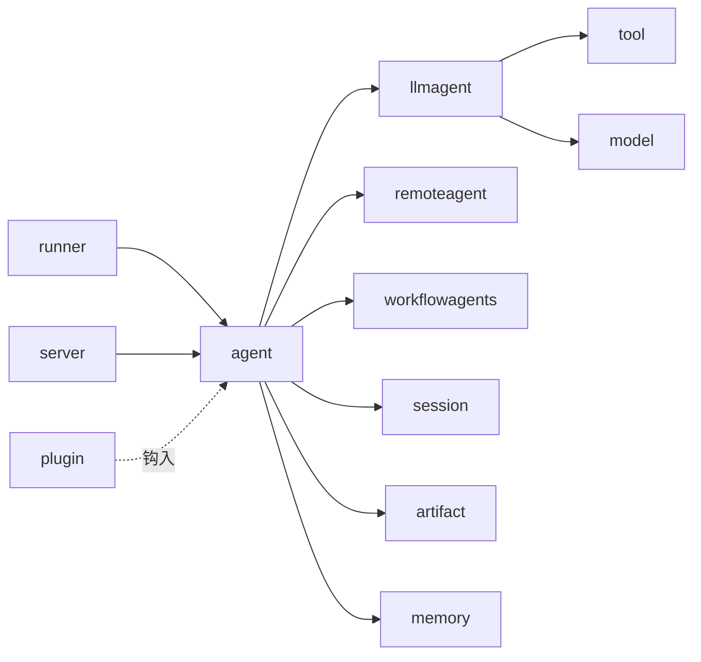
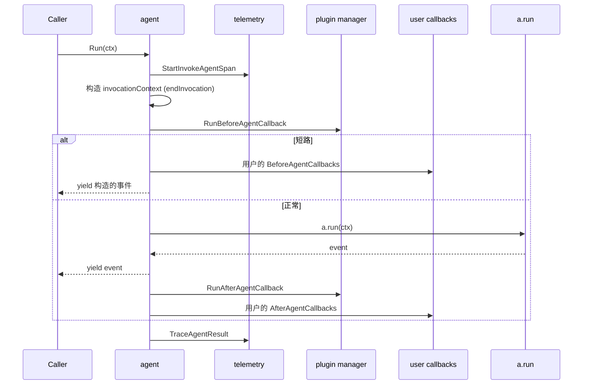
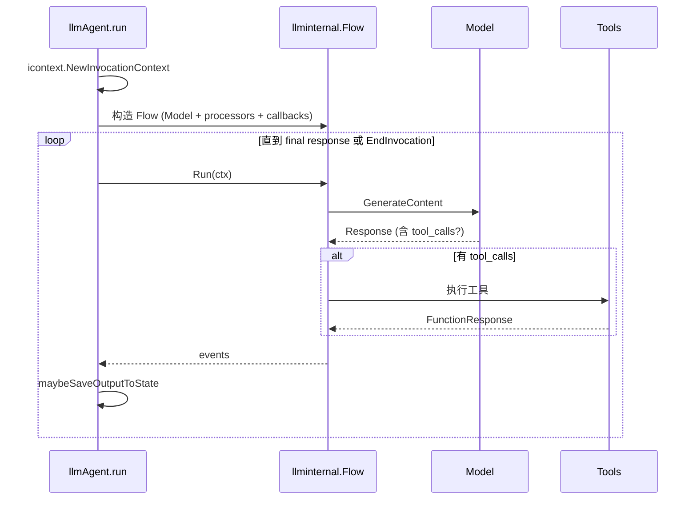
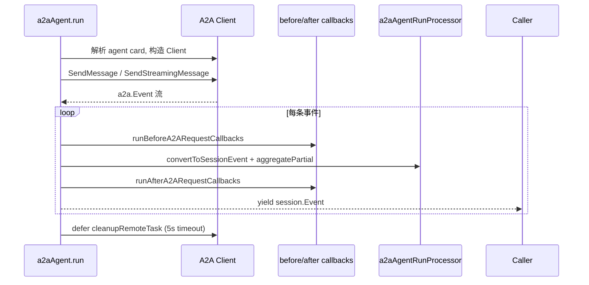
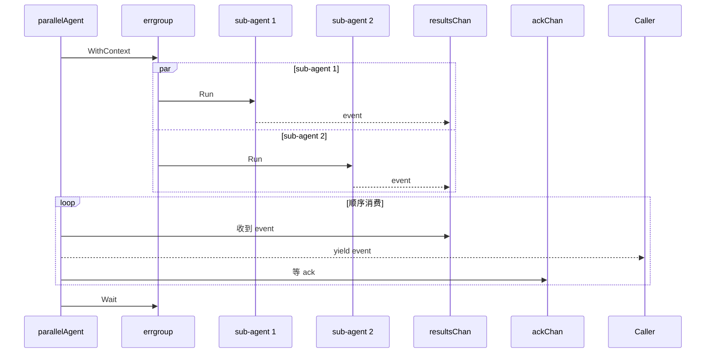

# agent 模块

> 模块路径：`agent/`
> 锁定 commit：`d06992e2b1ec2c9b95c6070e0fd12d50a43e4c99`
> 文档版本：v1（基于阅读笔记 `docs/architecture/.notes/agent.md`）

## 1. 定位与边界

`agent` 是 ADK 的"智能体核心抽象层"，定义了 `Agent` 基础接口、调用/回调上下文、运行配置、agent 加载器以及三类开箱即用的实现：LLM 智能体、远程 A2A 智能体、工作流编排智能体（顺序/并行/循环）。

子包分工：

| 子包 | 作用 |
|---|---|
| `agent/`（根） | 公共抽象：`Agent` 接口、`InvocationContext`/`CallbackContext`/`ToolContext`、`RunConfig`、`Loader`、`Live` 相关类型 |
| `agent/llmagent/` | 基于 LLM 的智能体（`llmagent.New`），所有调用 LLM 的 agent 都走这里 |
| `agent/remoteagent/` | A2A 远程智能体 v1 兼容层（`Deprecated`，转发到 v2） |
| `agent/remoteagent/v2/` | 远程智能体当前实现，基于 `a2a-go/v2`，支持 streaming、partial aggregation、task cleanup |
| `agent/workflowagents/loopagent/` | 循环执行子 agent；`Escalate` 事件可提前终止 |
| `agent/workflowagents/parallelagent/` | 并行执行子 agent；`errgroup` + channel 同步 |
| `agent/workflowagents/sequentialagent/` | 顺序执行子 agent；实现 `RunLive`，自动给 LLM 子 agent 注入 `task_completed` 工具 |



`runner` 把会话和消息传给 agent；`server/adka2a` 通过 agent 把 ADK 事件流转成 A2A 协议；`plugin` 通过回调钩子注入横切逻辑。`agent` **依赖** `session`/`artifact`/`memory`/`tool`/`model` 五个核心数据/能力面；**被** `runner`、`server`、`plugin`、所有 `examples/` 与 conformance 录制依赖。

公共契约 vs 内部实现：

- **公共契约**（用户应依赖）：`Agent` 接口、`InvocationContext`/`ReadonlyContext`/`CallbackContext`/`ToolContext`、`RunConfig`、`Loader`、`LiveSession`/`LiveRequest`，以及 `llmagent`/`remoteagent/v2`/`workflowagents` 三个子包的 `New` 构造函数。
- **内部实现**：`agent` 私有 struct（`agent/agent.go:139`）、`invocationContext`（`agent/agent.go:362`）、`callbackContext`（`agent/callback_context.go:101`）、`trackedArtifacts`（`agent/callback_context.go:243`）、`a2aAgentRunProcessor`，以及 `internal/agent`、`internal/llminternal`、`internal/context`、`internal/telemetry` 等。

## 2. 核心接口与类型

### 2.1 `Agent`

`agent/agent.go:43`：

```go
type Agent interface {
    Name() string
    Description() string
    Run(InvocationContext) iter.Seq2[*session.Event, error]
    SubAgents() []Agent
    FindAgent(name string) Agent
    FindSubAgent(name string) Agent
    internal() *agent
}
```

`Agent` 是所有 ADK agent 必须实现的"窄接口"。`Run` 返回 Go 1.23+ 的 `iter.Seq2`（懒迭代），调用方在循环里消费 `(event, err)` 时返回 `false` 即可让 agent 立即停止产生事件。注释明确指出未来版本可能放开自定义实现；当前阶段推荐使用 `agent.New` 或各子包构造函数。`internal()` 私有方法用于阻止外部直接实现接口。

### 2.2 `InvocationContext` 与上下文三层

`agent/context.go:62`：

```go
type InvocationContext interface {
    context.Context
    Agent() Agent
    Artifacts() Artifacts
    Memory() Memory
    Session() session.Session
    Branch() string
    UserContent() *genai.Content
    RunConfig() RunConfig
    EndInvocation()
    Ended() bool
    WithContext(ctx context.Context) InvocationContext
}
```

一个 invocation 包含若干 agent call，每个 agent call 又包含若干 step（一次 LLM 调用 + 一组 tool 调用）。`InvocationContext` 是整个调用栈共享的"调用上下文"。

上下文继承关系（`agent/context.go:108` / `:125` / `:136`）：`ReadonlyContext` → `CallbackContext`（新增 `Artifacts()` 与可写 `State()`）→ `ToolContext`（新增 `FunctionCallID` / `Actions` / `SearchMemory` / `RequestConfirmation`）。

`ToolContext` 是 HITL 确认流程入口；`RequestConfirmation` 会写入 `actions.RequestedToolConfirmations` 并设 `SkipSummarization`，让 LLM 循环暂停等待用户。

### 2.3 `Artifacts` / `Memory` / 回调 / `Loader` / `RunConfig` / Live

| 类型 | 关键方法 | 位置 |
|---|---|---|
| `Artifacts` | `Save`/`Load`/`LoadVersion`/`List` | `agent/agent.go:111` |
| `Memory` | `Add`/`Search` | `agent/agent.go:120` |
| `BeforeAgentCallback` / `AfterAgentCallback` | 返回非 nil 时短路 `Run` | `agent/agent.go:129` / `:137` |
| `Loader` | `LoadAgent(name)`；`NewSingleLoader` / `NewMultiLoader` | `agent/loader.go:22` / `:43` / `:70` |
| `RunConfig` | `StreamingMode`（`None` / `SSE`）+ `SaveInputBlobsAsArtifacts` | `agent/run_config.go:18` / `:29` |
| `LiveSession` / `LiveRequest` / `LiveRunConfig` | 双向流抽象；由 `llmagent.RunLive` 与 `sequentialagent.RunLive` 实现 | `agent/live.go:22` / `:28` / `:38` |

`callbackContext` 通过 `trackedArtifacts` 装饰器在保存时自动写入 `ArtifactDelta`（`agent/callback_context.go:243`），让回调产生的变更反映到事件里。`runBeforeAgentCallbacks`（`agent/agent.go:247`）与 `runAfterAgentCallbacks`（`agent/agent.go:306`）先跑 plugin manager 钩子，再跑用户回调。

### 2.4 子包关键类型

- **`llmagent.LLMAgent`**（`agent/llmagent/llmagent.go:340`）：聚合 `Model`/`Tools`/`Instruction`/`OutputKey`/`InputSchema`/`OutputSchema`/多组回调；运行时复用 `llminternal.Flow`。
- **`remoteagent/v2.A2AConfig`**（`agent/remoteagent/v2/a2a_agent.go:88`）：配置 agent card 源、消息 converter、A2A 客户端工厂、请求/响应回调、task cleanup 回调。
- **`loopagent.loopAgent`**（`loopagent/agent.go:71`）/ **`parallelagent.run`**（`parallelagent/agent.go:67`）/ **`sequentialAgent`**（`sequentialagent/agent.go:76`）：三种工作流 agent 各自实现 `Run`。

## 3. 关键数据结构

| 类型 | 位置 | 关键字段 / 备注 |
|---|---|---|
| `agent`（私有） | `agent/agent.go:139` | `name`/`description`/`subAgents`/`before/afterAgentCallbacks`/`run` + 嵌入 `agentinternal.State`（标 `TypeCustomAgent`）；是子包用 `agentinternal.Reveal` 改写 `AgentType` 的基类 |
| `invocationContext`（私有） | `agent/agent.go:362` | 嵌入 `context.Context`；携带 `Agent`/`Artifacts`/`Memory`/`Session`/`invocationID`/`branch`/`userContent`/`runConfig`/`endInvocation` |
| `callbackContext` | `agent/callback_context.go:101` | 同时实现 `CallbackContext` 与 `ToolContext`；靠 `NewToolContext` 时是否传 `functionCallID` 决定是否启用 tool 字段 |
| `callbackContextState` | `agent/callback_context.go:217` | 写操作路由到 `actions.StateDelta`，读操作先看 delta 再看 session state——实现"读最新、写不影响已下发事件" |
| `trackedArtifacts` | `agent/callback_context.go:243` | 装饰器：`Save` 成功后把 `(name → version)` 写入 `actions.ArtifactDelta` |
| `a2aAgentRunProcessor` | `remoteagent/v2/a2a_agent_run_processor.go:40` | `config`/`partConverter`/`request`/`aggregations`（`artifactID → 累积内容`）/`aggregationOrder`；streaming 期间合并 partial 事件，terminal / 快照时输出非 partial 聚合 |
| `result`（并行 agent） | `parallelagent/agent.go:160` | `event/err/ackChan`：每 sub-agent 推一个 event，runner 处理完后回 ack 再推下一个，实现 backpressure |
| `sequentialLiveSession` | `sequentialagent/agent.go:91` | `sync.Mutex` + 当前活跃子 live session；外部 `Send/Close` 始终落在当前活跃子 agent |

## 4. 关键流程

### 4.1 单个 agent 调用的执行循环

入口：`(*agent).Run(ctx)`（`agent/agent.go:162`）。



看图指引：
- 关注**两个回调层**：plugin manager 钩子先跑，用户回调后跑。
- `yield` 是双向：调用方返回 `false` 即可让 agent 提前终止，但 agent 不会回滚已 yield 的事件。
- `EndInvocation()` 仅设标记；`Run` 循环需在每个迭代检查 `ctx.Ended()`（`agent/agent.go:181-191`）。

### 4.2 LLM agent 一次 step

入口：`(*llmAgent).run(ctx)`（`llmagent/llmagent.go:361`）。



看图指引：
- `llminternal.Flow` 是 LLM 循环的真正驱动器；`llmagent` 只把它包装成 `Agent.Run` 形式。
- `maybeSaveOutputToState` 只在**作者是本 agent**、**event 非 partial**、**`OutputKey` 非空**、**有内容**时，把所有非 `Thought` 文本拼接写入 `event.Actions.StateDelta[OutputKey]`。
- `IncludeContents = none`（`llmagent/llmagent.go:333-338`）会切断历史内容注入。

### 4.3 A2A 远程 agent streaming

入口：`a2aAgent.run`（`remoteagent/v2/a2a_agent.go:199`）。



看图指引：
- streaming 期间产出 partial event，由 `a2aAgentRunProcessor.aggregatePartial`（`remoteagent/v2/a2a_agent_run_processor.go:133-148`）合并；只在收到 `Task` 快照或 terminal `TaskStatusUpdateEvent` 时输出非 partial 聚合。
- `cleanupRemoteTask` 仅在 task 未到 terminal 状态时调用 `CancelTask`；`Message` 事件不会触发 cleanup（`remoteagent/v2/a2a_agent.go:314-316`）。

### 4.4 工作流 agent 编排（parallel）

入口：`parallelagent.run`（`parallelagent/agent.go:67`）。



看图指引：
- 每个 sub-agent 在独立 goroutine 跑（`errgroup.WithContext`），**真并行收益在 LLM/tool 阶段**。
- event 序列化仍是单线程：`resultsChan + ackChan` 实现 backpressure。
- `yield` 返回 `false` 时 `break` 事件循环，并通过 `defer close(doneChan)` 通知 sub-agent 退出（`parallelagent/agent.go:112-127`）；错误传播给 `errgroup`。

## 5. 扩展点

### 5.1 自定义 agent

`agent.New(cfg Config)`（`agent/agent.go:55`）接受一个 `Run` 闭包，可插入任意业务逻辑。完整示例参见 [`02-extension-points.md` §2 写一个自定义 Agent](../02-extension-points.md#2-写一个自定义-agent)。

### 5.2 回调钩子

| 层级 | 钩子 | 位置 |
|---|---|---|
| Agent 级 | `BeforeAgentCallbacks` / `AfterAgentCallbacks` | `agent/agent.go:97` / `:106` |
| LLM 级 | `Before/After/OnModelCallbacks` | `agent/llmagent/llmagent.go:176-187` |
| Tool 级 | `Before/After/OnToolCallbacks` | `agent/llmagent/llmagent.go:264-275` |
| A2A 级 | `Before/AfterRequestCallbacks`、`Converter`、`A2APartConverter`、`GenAIPartConverter` | `agent/remoteagent/v2/a2a_agent.go:108-140` |

### 5.3 本模块特有扩展

- **HITL 确认**：`CallbackContext.RequestConfirmation`（`agent/callback_context.go:196`）。
- **Live 扩展**：`llmagent.RunLive`（`llmagent/llmagent.go:396`）+ `sequentialagent.RunLive`（`sequentialagent/agent.go:125`）可重新实现 `LiveSession`；任何 sub-agent 若不实现 `RunLive`，在 sequential live 中直接 yield error。
- **指令模板**：`InstructionProvider`（`llmagent/llmagent.go:490`）允许动态生成 instruction，**不自动注入占位符**。
- **IncludeContents**：`llmagent.IncludeContents` 取值 `none` / `default`（`llmagent/llmagent.go:333-338`）。
- **Loader 扩展**：`NewMultiLoader`（`agent/loader.go:70`）可挂载到 runner 作为 agent 工厂。

## 6. 错误处理

本模块**不**定义专门 error 类型；失败以 `fmt.Errorf("...: %w", err)` 包装或直接返回底层 error。

典型失败模式：

| 场景 | 位置 | 错误模式 |
|---|---|---|
| 子 agent 同名 | `agent/agent.go:59` | `sub-agent %q appears more than once` |
| 多个 root agent 重名 | `agent/loader.go:76` | `NewMultiLoader` 返回错误 |
| 用户 callback 返回 error | `agent/agent.go:258` / `:275` / `:316` / `:333` | `failed to run ... callback: %w` |
| `llmagent.New` 失败 | `agent/llmagent/llmagent.go:105` / `:120` | 包装 `agent.New` 或 `agentinternal.Reveal` 错误 |
| `remoteagent.NewA2A`（v1） | `agent/remoteagent/a2a_agent.go:132` / `:179` | 缺 `AgentCard`/`AgentCardSource`；`MessageSendConfig` 转换失败 |
| `remoteagent/v2.NewA2A` | `agent/remoteagent/v2/a2a_agent.go:158` / `:186` | 缺 `AgentCard`/`AgentCardProvider`；类型断言失败 |
| `parallelagent.run` | `agent/workflowagents/parallelagent/agent.go:95` | `failed to run sub-agent %q: %w` |
| `sequentialagent.RunLive` | `agent/workflowagents/sequentialagent/agent.go:173` | sub-agent 不支持 `RunLive`，yield error 并终止 |
| `SearchMemory` 未配置 | `agent/callback_context.go:180` | `memory service is not set` |
| `RequestConfirmation` 缺 ID | `agent/callback_context.go:198` | `error function call id not set when requesting confirmation for tool` |

处理建议：
- 在 runner / server 层捕获 callback 错误并转成用户可读消息；callback error 会中断整个 `Run` 流。
- A2A 错误应保留原始 a2a 错误（`%w`），方便上层做协议层错误码匹配。
- `RequestConfirmation` 的两个常见错（缺 `functionCallID`、`SkipSummarization` 未设）应在工具实现时就自检。

## 7. 并发与性能考量

### 7.1 goroutine / 锁

- **`parallelagent.run`** 用 `errgroup.WithContext` + 独立 goroutine 跑每个 sub-agent（`parallelagent/agent.go:71-100`），通过 `resultsChan + ackChan` 串行回推 event，提供 backpressure。
- **`sequentialagent.sequentialLiveSession`** 用 `sync.Mutex` 保护 `activeSess / closed`（`sequentialagent/agent.go:91-123`），让 `Send/Close` 总落在当前活跃子 agent。
- 主 `agent` 不维护可变共享状态；`invocationContext.endInvocation` 是单 goroutine 标记。

### 7.2 性能注意

- **`a2aAgentRunProcessor.updateAggregation`**（`remoteagent/v2/a2a_agent_run_processor.go:133-148`）合并 partial text 时按"前一个 part 也是同 Thought 类型的 text"做 `+=` 拼接，避免产生过碎 part，减少下游序列化与事件体积。
- **`parallelagent`** 的 ack 机制意味着一次只有一个 sub-agent 推下一个 event，并行收益主要在 sub-agent 内部 LLM/tool 阶段，event 序列化仍是单线程。
- **`trackedArtifacts.Save`**（`agent/callback_context.go:257`）当前**没有锁**，多个工具并发写同一 artifact 时版本号可能不是最新。源码注释里标注为已知缺口，调用方需自行保证并发安全。
- **Telemetry 性能影响**：`StartInvokeAgentSpan` + `WrapYield`（`agent/agent.go:164-171`）把每次事件上报到 OpenTelemetry；大量 partial event 会产生相应 span attribute 写入。生产环境可按需关闭或采样。

## 8. 依赖与被依赖

```mermaid
graph TB
    subgraph 外部
        genai["google.golang.org/genai"]
        uuid["github.com/google/uuid"]
        otel["go.opentelemetry.io/otel/trace"]
        a2ago["github.com/a2aproject/a2a-go/v2"]
    end
    subgraph ADK 内部依赖
        artifact["artifact"]
        memory["memory"]
        model["model"]
        session["session"]
        agentinternal["internal/agent"]
        icontext["internal/context"]
        llminternal["internal/llminternal"]
        telemetry["internal/telemetry"]
        pluginctx["internal/plugininternal/plugincontext"]
        adka2a["server/adka2a, /v2"]
    end
    subgraph ADK 上游（被依赖）
        runner["runner"]
        server["server/adkrest, /adka2a, /agentengine"]
        plugin["plugin/*"]
        config["internal/configurable"]
        examples["examples/*"]
    end
    agent --> genai
    agent --> uuid
    agent --> otel
    agent --> artifact
    agent --> memory
    agent --> model
    agent --> session
    agent --> agentinternal
    agent --> icontext
    agent --> llminternal
    agent --> telemetry
    agent --> pluginctx
    agent --> adka2a
    remoteagent_v2 --> a2ago
    runner --> agent
    server --> agent
    plugin -. 钩入 .-> agent
    examples --> agent
    config --> agent
```

关键上游：`runner`、`server`、`plugin`、`internal/configurable`、所有 `examples/` 演示。
关键下游：`artifact`、`memory`、`model`、`session`、`internal/agent`、`internal/context`、`internal/llminternal`、`internal/telemetry`、`internal/plugininternal/plugincontext`、`server/adka2a`/`v2`。

## 9. 测试与可观察性

### 9.1 测试文件位置

| 文件 | 覆盖范围 |
|---|---|
| `agent/agent_test.go` | `Before/AfterAgentCallback` short-circuit；`EndInvocation` 提前/延后结束；`WithContext`；`FindAgent` 嵌套解析 |
| `agent/loader_test.go` | single / multi loader |
| `agent/llmagent/llmagent_test.go`（1195 行）+ `state_agent_test.go`（719 行）+ `dynamic_events_test.go` + `llmagent_saveoutput_test.go` | 通过 `testdata/*.httprr` 录制/回放 LLM HTTP 流量，覆盖 flow、callbacks、state、outputKey、includeContents |
| `agent/workflowagents/{loop,parallel,sequential}agent/agent_test.go` | 三种工作流的 run、事件顺序、backpressure、RunLive、task_completed 注入 |
| `agent/remoteagent/v2/a2a_agent_test.go`（1437 行）+ `a2a_e2e_test.go`（1276 行）+ `a2a_agent_run_processor_test.go` + `utils_test.go` | A2A 协议事件聚合、streaming vs non-streaming、part 转换、错误处理、cleanup |
| `agent/remoteagent/a2a_agent_compat_test.go` | v1 兼容层适配到 v2 的回归测试 |

### 9.2 Telemetry 埋点

- `agent/agent.go:164`：`telemetry.StartInvokeAgentSpan` 启动 "invoke agent" span，span 名带 `a.Name()`，`session.ID()` 和 `invocationID` 作为属性。
- `agent/agent.go:165-170`：`telemetry.WrapYield` 包装 yield，使每个 `(event, err)` 退出后自动调用 `TraceAgentResult`，把响应/错误写回 span。
- 其余 span 来自子模块（`llminternal.Flow`、`remoteagent/v2` 内部 converter 等）。

### 9.3 集成测试入口

`agent/remoteagent/v2/a2a_e2e_test.go` 启动本地 A2A server + client 做端到端测试；`agent/llmagent/` 下的 `*_test.go` 通过 `httprr` 录制真实 LLM HTTP 流量，无需联网即可回放。

## 10. 延伸阅读

- 端到端流程：
  - [F1 单轮对话](../01-core-flows.md#f1-单轮对话)：runner 入口到 `agent.Run` 的整体路径。
  - [F2 工具调用](../01-core-flows.md#f2-工具调用)：`llminternal.Flow` 如何消费 `tool_calls`。
  - [F3 多 Agent 协作](../01-core-flows.md#f3-多-agent-协作)：`workflowagents` 三种的编排差异。
  - [F5 Live 双向流](../01-core-flows.md#f5-live-双向流)：`RunLive` 与普通 `Run` 的本质差异。
- 扩展点：
  - [02 §2 写一个自定义 Agent](../02-extension-points.md#2-写一个自定义-agent)：`agent.New` 的标准用法。
  - [02 §7 写一个 Plugin](../02-extension-points.md#7-写一个-plugin)：回调钩子的串联执行规则。
- 同包内其他模块：
  - [02 model](./02-model.md)：`llmagent` 依赖的 `model.LLM` 接口。
  - [03 tool](./03-tool.md)：`llminternal.Flow` 执行的 `tool.Tool` 接口。
  - [08 plugin](./08-plugin.md)：plugin 钩子如何切入 agent 回调链。
- 顶层架构：
  - [00 overview §3 核心抽象一览](../00-overview.md#3-核心抽象一览)：`agent.Agent` 在四大抽象中的位置。