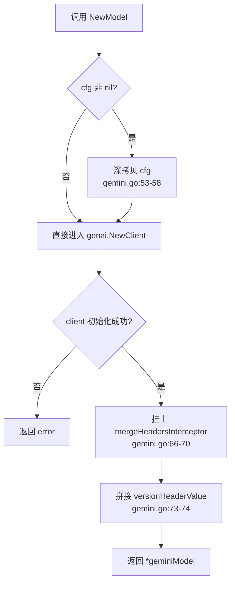
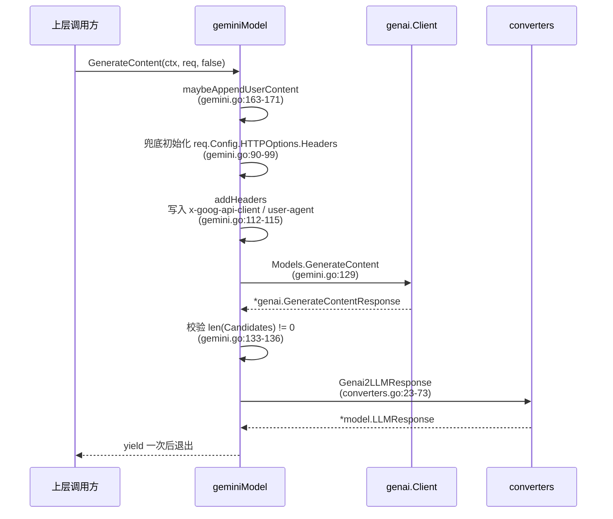
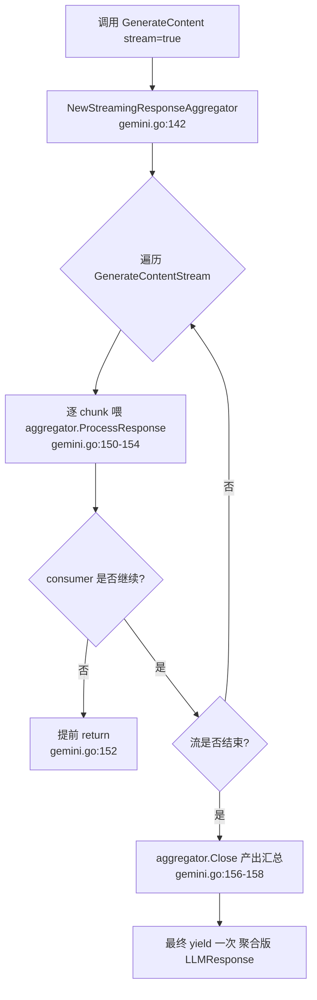
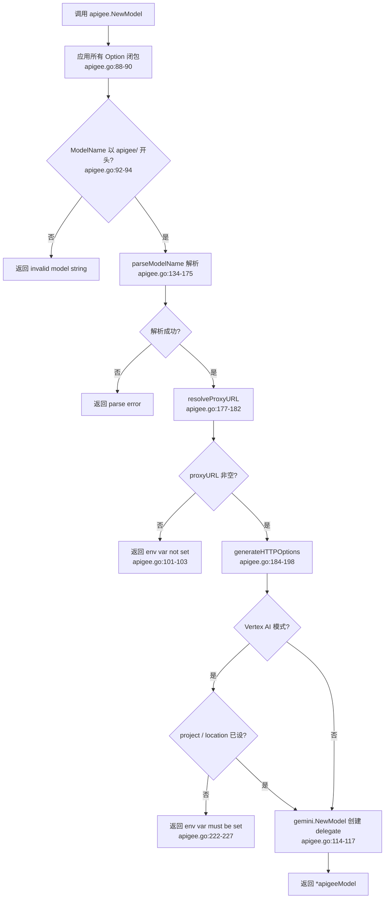

# model 模块

> 基于 commit `d06992e2b1ec2c9b95c6070e0fd12d50a43e4c99` 编写。

## 1. 定位与边界

**一句话定位**：`model` 是 ADK 的"模型后端抽象层"——通过 `LLM` 接口统一封装不同 LLM 提供方（Gemini API、Vertex AI、Apigee 代理），向上层（`agent/llmagent`、`runner`、`tool`、`plugin`）屏蔽具体 SDK 与 HTTP 细节，仅暴露"请求/响应/流式迭代"的稳定协议。

**子包清单**：

| 子包 | 路径 | 职责 |
|------|------|------|
| `model`（根） | `model/llm.go` | 定义 `LLM` 接口、`LLMRequest`、`LLMResponse` 等中立数据结构 |
| `model/gemini` | `model/gemini/gemini.go` | `LLM` 的 Google Gemini API / Vertex AI 实现，基于 `google.golang.org/genai` SDK |
| `model/apigee` | `model/apigee/apigee.go` | 通过 Apigee 代理调用 Gemini 的实现，解析 `apigee/...` 形式的模型名并委托给 `gemini` 子包 |

根包没有 `doc.go`，包级注释直接写在 `model/llm.go:15`。

**在整体架构中的位置**：本模块位于调用链末端——`agent/llmagent` 持有 `model.LLM` 引用，所有出向 token 流经本模块出口；上游依赖 `model` 的模块列表参见 §8。

**公共契约 vs 内部实现**：

- **公共契约（可被外部 import）**：`model.LLM`、`LLMRequest`、`LLMResponse`、`gemini.NewModel`、`apigee.NewModel`。
- **内部实现（仅供 `gemini` 使用）**：`internal/llminternal/converters`、`internal/llminternal/googlellm`、`internal/llminternal/stream_aggregator`——这些包处于 `internal/`，外部使用者无法导入。
- **私有细节**：`mergeHeadersInterceptor`（`model/gemini/gemini.go:175`）、`modelInfo`（`model/apigee/apigee.go:39`）、`maybeAppendUserContent` 等均为非导出。

---

## 2. 核心接口与类型

### 2.1 `LLM` 接口

`model/llm.go:26-29`：

```go
type LLM interface {
    Name() string
    GenerateContent(ctx context.Context, req *LLMRequest, stream bool) iter.Seq2[*LLMResponse, error]
}
```

极简契约：只暴露"模型名 + 生成内容（含流式）"两个能力。返回值采用 Go 1.23 起的 `iter.Seq2`，把同步与流式统一成"惰性迭代器"——上层用 `for ... range` 即可消费，**无需区分 channel 或 callback**。`stream=false` 时迭代器只 `yield` 一次（参见 `model/gemini/gemini.go:105-108`）；`stream=true` 时迭代器多次 `yield`（每 chunk 一次 + 最后聚合版一次）。

### 2.2 `LLMRequest` 结构

`model/llm.go:32-38`：

```go
type LLMRequest struct {
    Model    string
    Contents []*genai.Content
    Config   *genai.GenerateContentConfig

    Tools map[string]any `json:"-"`
}
```

设计意图：直接复用 `google.golang.org/genai` 的 `Content` 与 `GenerateContentConfig` 作为底层 wire-format，避免重复定义 DTO。`Tools` 单独成字段是因为其类型与 genai 内部 tool 表示不一一对应，并通过 `json:"-"` 显式排除序列化（表示 ADK 内部用，不参与序列化/反序列化）。`Model` 字段在运行时可被 `BeforeModelCallback` 改写，覆盖构造时的模型名（见 `model/gemini/gemini.go:120-125` 的 `modelName()`）。

### 2.3 `LLMResponse` 结构

`model/llm.go:42-68`：核心字段如下表所示，关键控制位为 `Partial` / `TurnComplete` / `Interrupted` 三者配合表达"流式中段 / 候选已完成 / 用户中断"三种状态。`ErrorCode` / `ErrorMessage` 描述业务级错误（`SAFETY` / `RECITATION` / prompt block），让上层不必总返回 `error`——便于"错误也是响应"的下游处理。

### 2.4 `geminiModel` 结构

`model/gemini/gemini.go:36-40`：

```go
type geminiModel struct {
    client             *genai.Client
    name               string
    versionHeaderValue string
}
```

`versionHeaderValue`（如 `google-adk/<ver> gl-go/<goVer>`）在 `NewModel` 内**一次性**拼好（`model/gemini/gemini.go:73-74`），避免每请求 `fmt.Sprintf`。`geminiModel` 同时实现 `googlellm.GoogleLLM` 嵌入式接口，由编译期断言 `var _ googlellm.GoogleLLM = &geminiModel{}`（`model/gemini/gemini.go:203`）保证。

### 2.5 `apigeeModel` 结构

`model/apigee/apigee.go:45-48`：

```go
type apigeeModel struct {
    delegate model.LLM
    name     string
}
```

纯粹的代理/适配器模式——自身不直接调用 HTTP，只负责"解析模型名 + 装配 HTTPOptions + 委派"。`delegate` 字段持有 `gemini.NewModel` 返回的实例。

### 2.6 `apigee.Config` 与 `Option`

`model/apigee/apigee.go:51-56` 承载 `ModelName` / `ProxyURL` / `CustomHeaders` / `HTTPClient` 四个字段；`Option` 闭包（`model/apigee/apigee.go:59`）是 functional options 模式的承载。三个具体 Option：`WithProxyURL`、`WithCustomHeaders`、`WithHTTPClient`（注释明确"测试专用"，见 `model/apigee/apigee.go:75`）。

---

## 3. 关键数据结构

### 3.1 `LLMResponse` 关键字段

| 字段 | 类型 | 含义 |
|------|------|------|
| `Content` | `*genai.Content` | 候选生成内容 |
| `CitationMetadata` | `*genai.CitationMetadata` | 引用来源（RAG 场景） |
| `GroundingMetadata` | `*genai.GroundingMetadata` | 检索增强元数据 |
| `UsageMetadata` | `*genai.GenerateContentResponseUsageMetadata` | token 计费信息 |
| `Partial` | `bool` | 流式中段标记 |
| `TurnComplete` | `bool` | 候选是否给出非空 `FinishReason` |
| `Interrupted` | `bool` | bidi 流被用户中断 |
| `SessionResumptionHandle` | `string` | bidi/live 会话恢复句柄 |
| `ErrorCode` / `ErrorMessage` | `string` | 业务级失败（如 `SAFETY` / `RECITATION`） |
| `FinishReason` | `genai.FinishReason` | 与 `ErrorCode` 同步写入 |
| `AvgLogprobs` | `float64` | 平均 log-prob（采样相关） |

**生命周期注意**：`Partial` 仅流式使用，`TurnComplete` 表示"该候选已给出 `FinishReason`"——两者语义不对称，避免混用。

### 3.2 `geminiModel` / `apigeeModel` 字段

| 类型 | 字段 | 含义 |
|------|------|------|
| `geminiModel`（`model/gemini/gemini.go:36`） | `client` | genai 客户端 |
| `geminiModel` | `name` | 构造时指定的模型名（默认值） |
| `geminiModel` | `versionHeaderValue` | 构造期固化版本头 |
| `apigeeModel`（`model/apigee/apigee.go:45`） | `delegate` | 委派的 `model.LLM`（实际为 `*geminiModel`） |
| `apigeeModel` | `name` | 原始 `apigee/...` 字符串 |
| `apigee.Config`（`model/apigee/apigee.go:51`） | `HTTPClient` | 明确为测试桩（`model/apigee/apigee.go:55`） |
| `apigee.modelInfo`（`model/apigee/apigee.go:39`） | `modelID` / `apiVersion` / `isVertexAI` | `parseModelName` 解析结果三元组 |

`mergeHeadersInterceptor`（`model/gemini/gemini.go:175`）的 `base http.RoundTripper` 字段为可空——为 nil 时走 `http.DefaultTransport`。

---

## 4. 关键流程

### 4.1 创建 Gemini 模型

入口：`gemini.NewModel(ctx, modelName, cfg)`（`model/gemini/gemini.go:49`）。



看图指引：关注"深拷贝"和"挂拦截器"两步——前者保证调用方与 ADK 不共享可变状态（`http.Client.Transport`），后者避免 `x-goog-api-client` 与 `user-agent` 在多 SDK 共存时被重复设置（`model/gemini/gemini.go:179-190`）。

### 4.2 同步生成内容

入口：`geminiModel.GenerateContent(ctx, req, stream=false)`（`model/gemini/gemini.go:88`）。当 `stream=false` 时进入 `generate` 路径（`model/gemini/gemini.go:105-108`）：



看图指引：`maybeAppendUserContent` 是兜底逻辑——内容为空时补"按系统指令处理"，最后一条非 user 时追加"继续处理"。`addHeaders` 把版本头写入 `HTTPOptions.Headers`，确保每次请求都带 `google-adk/<version> gl-go/<goVer>`。

### 4.3 流式生成内容

入口：`geminiModel.GenerateContent(ctx, req, stream=true)`（`model/gemini/gemini.go:101-103`），分支进入 `generateStream`（`model/gemini/gemini.go:141-160`）。



看图指引：`aggregator` 持有可变状态（`currentTextBuffer` / `currentFunctionArgs`），但 `generateStream` 每次调用都新建一次（`model/gemini/gemini.go:142`），因此**不**存在跨调用的状态共享问题——这是 ADK 流式聚合器的安全保证。消费者随时 `return`，`for ... range` 终止即可。

### 4.4 创建 Apigee 模型

入口：`apigee.NewModel(ctx, modelName, opts...)`（`model/apigee/apigee.go:84`）。



看图指引：`parseModelName` 是 apigee 模块的字符串协议层，支持 5 种形态：`apigee/<id>` / `apigee/<v>/<id>` / `apigee/vertex_ai/<id>` / `apigee/gemini/<v>/<id>` / `apigee/vertex_ai/<v>/<id>`。Vertex AI 模式下强校验 `GOOGLE_CLOUD_PROJECT` / `GOOGLE_CLOUD_LOCATION`（`apigee.go:222-227`），否则立即失败。

### 4.5 Apigee GenerateContent 委派

入口：`apigeeModel.GenerateContent(...)`（`model/apigee/apigee.go:130-132`），实现是单行透传：

```go
return m.delegate.GenerateContent(ctx, req, stream)
```

所有实际的 HTTP/SDK 调用、版本头写入、流式聚合都走 `geminiModel`——`apigeeModel` 只是"按模型名装配好 HTTPOptions 后再包一层"。

---

## 5. 扩展点

- **`model.LLM` 接口本身**：任何想接入新模型（OpenAI、Anthropic、自研等）只需实现 `Name()` + `GenerateContent(...)` 两个方法。详见 [02-extension-points.md §4 接入自定义 Model](../02-extension-points.md#4-接入自定义-model)。
- **`googlellm.GoogleLLM` 嵌入式接口**（位于 `internal/llminternal/googlellm/variant.go`，`googlellm` 子包提供 `GetGoogleLLMVariant()` 方法）：让 `agent/llmagent` 区分 Vertex AI / Gemini API 走不同输出 schema 路径（`NeedsOutputSchemaProcessor`）。`geminiModel` 已在 `model/gemini/gemini.go:203` 通过编译期断言实现该接口。
- **`apigee.Option` 模式**（`model/apigee/apigee.go:59`）：新增配置只需追加一个 `WithXxx` 闭包，不破坏既有调用方。
- **`apigee.parseModelName`**（`model/apigee/apigee.go:134-175`）：是字符串协议层，新增命名空间只需扩展 `components` 长度分支。
- **`genai.ClientConfig`**：透传给 `gemini.NewModel`（`model/apigee/apigee.go:114`），理论上可挂载任何 `genai` 客户端选项（如 `APIKey`、`Backend`、`HTTPOptions`）。

---

## 6. 错误处理

- **未定义独立的错误类型**——`LLM` 接口用 `error` 透传 genai SDK 错误；`LLMResponse.ErrorCode` / `ErrorMessage` 描述**业务级**失败（如 `SAFETY` / `RECITATION` / prompt block），`FinishReason` 也会同步写入。
- **典型失败模式**（基于源码 + 测试）：
  1. 模型名不以 `apigee/` 开头 → `fmt.Errorf("invalid model string: %s", cfg.ModelName)`（`model/apigee/apigee.go:92-94`）
  2. `apigee` 模式下未设置 `APIGEE_PROXY_URL` → `model/apigee/apigee.go:101-103`
  3. Vertex AI 模式下缺 `GOOGLE_CLOUD_PROJECT` / `GOOGLE_CLOUD_LOCATION` → `model/apigee/apigee.go:222-227`
  4. `generate` 收到 `len(resp.Candidates) == 0` → `fmt.Errorf("empty response")`（`model/gemini/gemini.go:133-136`，源码注释带"shouldn't happen?"）
  5. genai 错误被包裹为 `fmt.Errorf("failed to call model: %w", err)`（`model/gemini/gemini.go:129-132`）
- `converters.Genai2LLMResponse`（`internal/llminternal/converters/converters.go:23-73`）在三类输入下分别产出"内容响应 / 错误响应 / 空 content 但有 usage 的兜底响应"——针对 Vertex AI 上 gemini-3 早期空 entry 做了特殊处理。

---

## 7. 并发与性能考量

- **无 goroutine / 无锁**——`LLM` 实现都是被动响应迭代器，消费方控制节奏。
- **流式聚合器 `streamingResponseAggregator` 持有可变状态**（位于 `internal/llminternal`）：`currentTextBuffer`、`currentFunctionArgs` 等——但每个 `geminiModel.generateStream` 调用都 `NewStreamingResponseAggregator` 新建一次（`model/gemini/gemini.go:142`），因此可安全并发。
- **版本头一次性计算**：`model/gemini/gemini.go:73-74` 把 `google-adk/<ver> gl-go/<goVer>` 拼好后存进 `versionHeaderValue`，避免每次请求的 `fmt.Sprintf` 开销。
- **HTTP 客户端深拷贝**：`gemini.NewModel` 主动 `cfgCopy := *cfg; clientCopy := *cfg.HTTPClient`（`model/gemini/gemini.go:53-58`）防止调用方与 ADK 互相污染 `Transport` 字段。
- **可优化点**：apigee 模型每次都新建 `genai.Client`；若同一进程需要多个 apigee 模型，未提供 client 复用 API——这是当前实现的已知限制。

---

## 8. 依赖与被依赖

```mermaid
graph LR
    subgraph model[model 模块]
        M_root[model]
        M_gem[model/gemini]
        M_api[model/apigee]
    end

    M_api --> M_gem
    M_api --> M_root
    M_gem --> M_root

    subgraph 上游（依赖 model）
        U_agent[agent/llmagent]
        U_runner[runner]
        U_tool[tool/*]
        U_plugin[plugin/*]
        U_session[session/*]
        U_server[server/*]
        U_telemetry[internal/telemetry]
    end

    U_agent --> M_root
    U_runner --> M_gem
    U_tool --> M_root
    U_plugin --> M_root
    U_session --> M_root
    U_server --> M_root
    U_telemetry --> M_root
```

主要上游消费者（基于源码 import 统计）：核心框架 `agent/agent.go` / `agent/llmagent/llmagent.go` / `runner/runner.go` / `tool/tool.go` / `internal/llminternal/*`；可观察性 `internal/telemetry/telemetry.go` / `plugin/loggingplugin`；会话 `session/session.go` / `session/database/storage_session.go` / `session/vertexai/vertexai_client.go`；服务端 `server/adkrest/...` / `server/adka2a/v2/...`；测试工具 `internal/testutil/test_agent_runner.go`（含 `MockModel`）。

`model/gemini` 在仓库内部有约 20 处直接 import，集中在 `examples/` 与少量 agent 测试（`agent/workflowagents/parallelagent/agent_test.go` 等）。`model/apigee` 在仓库内部**没有**任何非测试 import 记录（截至 commit `d06992e2`），意味着它是"为外部用户准备"的扩展接入点。

---

## 9. 测试与可观察性

### 9.1 测试文件

| 文件 | 测试对象 | 手法 |
|------|----------|------|
| `model/llm_test.go`（244 行） | `converters.Genai2LLMResponse` | 9 个表驱动用例覆盖 logprobs / citation / 错误码 / 无候选 / 部分内容等场景（`model/llm_test.go:65-208`） |
| `model/gemini/gemini_test.go`（342 行） | `gemini.NewModel` 行为 | `httprr` 回放（4 个 `.httprr` 文件在 `testdata/`）+ `headerInterceptor` / `roundTripFunc` 桩（`model/gemini/gemini_test.go:329-342`）。覆盖：基本生成、流式生成、Vertex 开关下的遥测头、request-time `Model` 字段覆盖构造时 `name`、`NewModel` 不污染入参 `http.Client` |
| `model/apigee/apigee_test.go`（294 行） | `apigee.NewModel` + 委派 | 用 `roundTripFunc` 替换 `http.Client.Transport`（`model/apigee/apigee_test.go:35-47`）。覆盖 5 种合法 + 5 种非法 model 名解析、custom headers、缺失 proxy URL、Vertex 缺 project/location、完整 `GenerateContent` 端到端 |

### 9.2 Telemetry 埋点

- `model` 模块本身**不直接**写 telemetry span。
- 遥测头由 `geminiModel.addHeaders` 在每次请求时写入（`model/gemini/gemini.go:112-115`），`x-goog-api-client` 与 `user-agent` 均带 `google-adk/<version> gl-go/<goVer>`。
- 上层调用方（`internal/telemetry/telemetry.go`）创建 `generate_content <modelName>` span，记录 `FinishReason`、input/output token 计数、cache read 计数、reasoning token 计数。

---

## 10. 延伸阅读

- [README.md](../README.md) — 文档入口与三条阅读路径
- [00-overview.md](../00-overview.md) — 顶层架构中关于"核心抽象一览"的章节
- [01-core-flows.md §F1 单轮对话](../01-core-flows.md) — `Runner → Agent → Model` 的端到端调用链
- [01-core-flows.md §F2 工具调用](../01-core-flows.md) — Model 返回 `tool_calls` 后的回流路径
- [01-core-flows.md §F5 Live 双向流](../01-core-flows.md) — `SessionResumptionHandle` / `Interrupted` 的实际触发场景
- [02-extension-points.md §4 接入自定义 Model](../02-extension-points.md) — 自实现 `LLM` 接口的代码骨架与协议适配说明
- [03-modules/11-internal.md §llminternal](./11-internal.md) — 流式聚合器 / converters / googlellm 等内部子包的角色