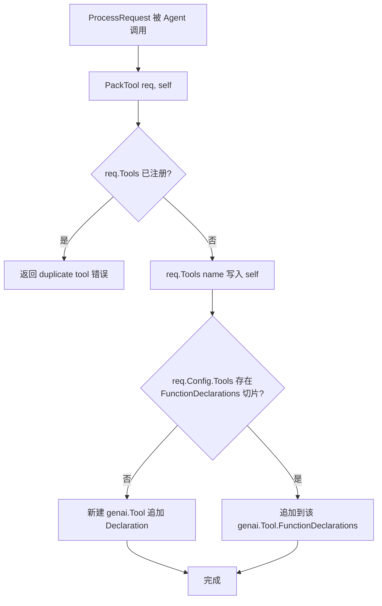
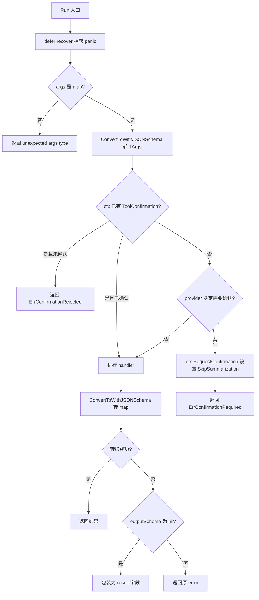
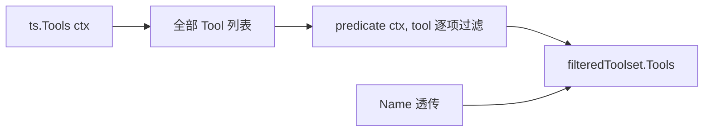
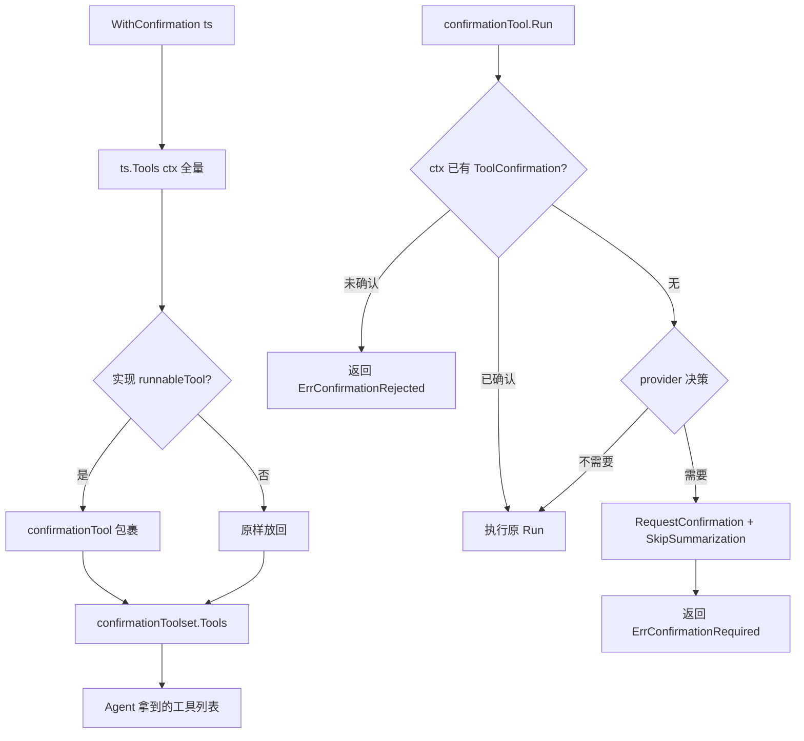
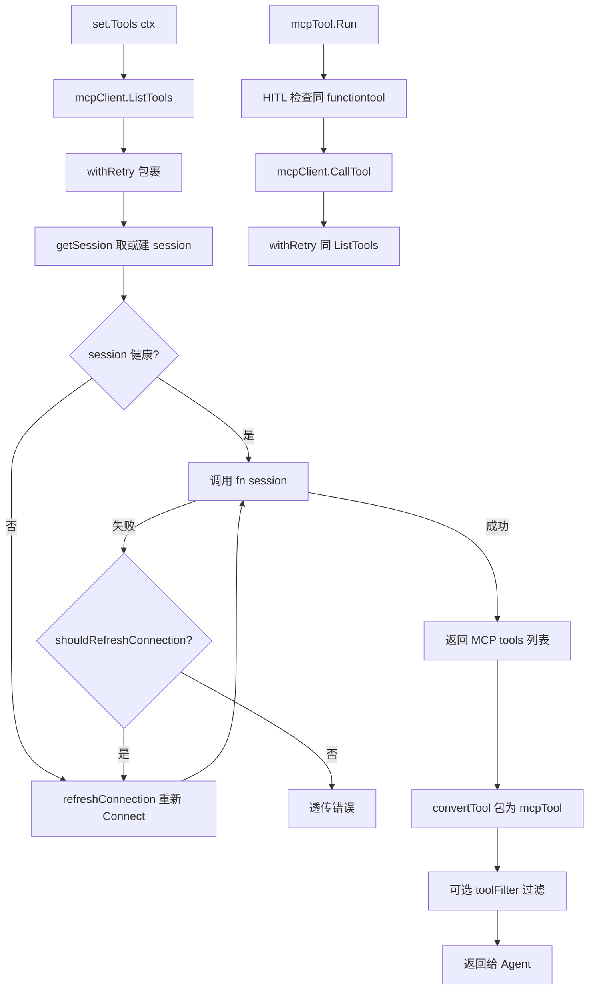
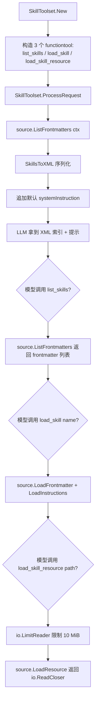
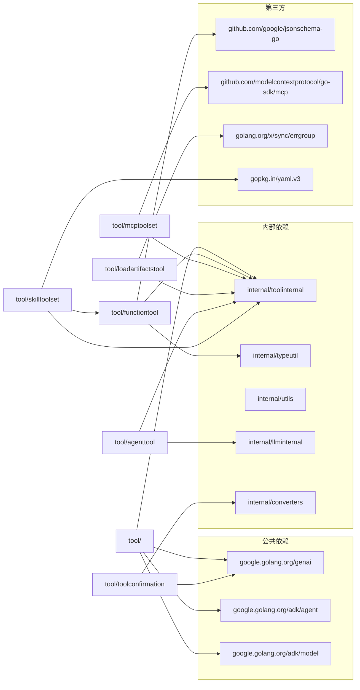
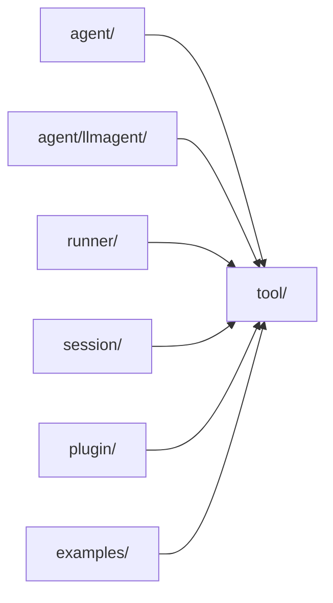

# tool 模块

> 模块编号：03
> 对应源码目录：`tool/`
> 适用读者：希望实现自定义工具、理解 HITL 装饰器、阅读 MCP / Skill 子包的工程师

## 1. 定位与边界

**一句话定位**：`tool` 包是 ADK 中"工具（Tool / Toolset）"的契约层，定义 agent 可调用能力单元的统一接口、内置工具集合、Human-in-the-Loop 确认流以及 schema 反射机制；下游子包以"实现 `tool.Tool` + `Declaration() + ProcessRequest() + Run()`"的方式插入。

### 1.1 子包清单

| 子包 | 关键入口 | 职责 |
|---|---|---|
| `tool/`（根） | `Tool` / `Toolset` / `WithConfirmation` | 公共接口、装饰器、HITL 协议 |
| `agenttool/` | `New(agent, cfg)` | 把另一个 `agent.Agent` 包装为可调用工具 |
| `exampletool/` | `New(examples)` | few-shot 示例注入到 system instruction |
| `exitlooptool/` | `New()` | 循环 agent 用的 `exit_loop` 工具 |
| `functiontool/` | `New[TA, TR](cfg, fn)` | 基于反射/JSON-Schema 的通用函数包装 |
| `functiontool/` | `NewStreaming[TA](cfg, fn)` | 流式输出函数工具 |
| `geminitool/` | `New(name, desc, *genai.Tool)` | 把 `*genai.Tool` 适配为 ADK Tool |
| `loadartifactstool/` | `New()` | 列出/加载 artifact |
| `loadmemorytool/` | `New()` | 模型显式触发的 memory 检索 |
| `mcptoolset/` | `New(cfg)` | MCP 协议桥 + 自动重连 |
| `preloadmemorytool/` | `New()` | 每次 LLM 请求前自动注入 memory |
| `skilltoolset/` | `New(ctx, cfg)` | Agent Skills（SKILL.md 文件夹） |
| `skilltoolset/skill/` | `Source` 接口 + 4 个实现 | 技能来源抽象 |
| `toolconfirmation/` | `ToolConfirmation` / `OriginalCallFrom` | HITL 状态对象与解码 helper |

### 1.2 依赖关系

- **依赖**：`google.golang.org/genai`（核心 schema 类型）、`agent`（`ReadonlyContext` / `ToolContext`）、`model`（`LLMRequest`）、`internal/toolinternal`（内部附加接口）、`internal/typeutil`、`internal/utils`、`internal/llminternal`（agenttool）、`internal/converters`（toolconfirmation）。
- **第三方**：`github.com/google/jsonschema-go/jsonschema`（schema 反射）、`github.com/modelcontextprotocol/go-sdk/mcp`（MCP 协议）、`golang.org/x/sync/errgroup`（artifact 并发加载）、`gopkg.in/yaml.v3`（Frontmatter 解析）。
- **被谁依赖**：`agent`（`agent/context.go`、`agent/callback_context.go`）、`llmagent`（间接）、`plugin/functioncallmodifier`、`plugin/loggingplugin`、`plugin/retryandreflect`、`session`、大量 `examples/*` 子项目、Workflow agents 测试。

### 1.3 公共契约 vs 内部实现

- **公共契约**：`tool.Tool`、`tool.Toolset`、`tool.Predicate`、`tool.AllowedToolsPredicate`、`tool.FilterToolset`、`tool.ConfirmationProvider`、`tool.WithConfirmation`、两个 sentinel error（`ErrConfirmationRequired` / `ErrConfirmationRejected`）、`toolconfirmation.ToolConfirmation` / `FunctionCallName` / `OriginalCallFrom`。
- **内部实现**：
  - `tool.runnableTool`（`tool/tool.go:189`）未导出，作为 HITL 装饰器的目标检测；
  - `internal/toolinternal.FunctionTool` / `StreamingFunctionTool` / `RequestProcessor`（`internal/toolinternal/tool.go:28-42`）作为"附加接口"放在 `internal/`，避免污染公共 `tool.Tool` 表面；
  - `internal/toolinternal/toolutils.PackTool`（`internal/toolinternal/toolutils/toolutils.go:35`）负责把单个 tool 的 `Declaration` 注入到 `LLMRequest`。

## 2. 核心接口与类型

### 2.1 `Tool` — 最小工具契约

```go
// tool/tool.go:38
type Tool interface {
    Name() string
    Description() string
    IsLongRunning() bool
}
```

`Tool` 只关心"身份 + 说明"，不关心执行。所有可被 LLM 调用的能力的最薄抽象。如果只实现 `Tool` + `Declaration()`，则工具能被 LLM 识别（schema 注入）但不会被实际调用；额外实现 `Run` 才成为"可执行"工具。

### 2.2 `Toolset` — 工具集合

```go
// tool/tool.go:57
type Toolset interface {
    Name() string
    Tools(ctx agent.ReadonlyContext) ([]Tool, error)
}
```

把多个 `Tool` 聚合为一个可被 agent 加载的单元；`Tools()` 接收 `ReadonlyContext` 以支持按调用态做动态过滤（例如多租户场景按用户角色裁剪工具列表）。

### 2.3 `Predicate` / `AllowedToolsPredicate` / `FilterToolset`

```go
// tool/tool.go:67 / 76 / 89
type Predicate func(ctx agent.ReadonlyContext, tool Tool) bool

func AllowedToolsPredicate(allowedTools []string) Predicate
func FilterToolset(toolset Toolset, predicate Predicate) Toolset
```

把"按名字白名单"等通用策略从具体 Toolset 中解耦。`StringPredicate` 已被 Deprecated（`tool/tool.go:71`），新代码统一使用 `AllowedToolsPredicate`。

### 2.4 `ConfirmationProvider` / `WithConfirmation`

```go
// tool/tool.go:134 / 143
type ConfirmationProvider func(toolName string, toolInput any) bool

func WithConfirmation(ts Toolset, requireConfirmation bool, provider ConfirmationProvider) Toolset
```

把 HITL 行为做成 Toolset 装饰器。注意：`WithConfirmation` 只对实现内部 `runnableTool`（即同时实现 `Declaration()` + `Run()`）的成员工具生效，动态 `provider` 优先级高于静态标志 `requireConfirmation`。

### 2.5 内部 `runnableTool`

```go
// tool/tool.go:189
type runnableTool interface {
    Tool
    Declaration() *genai.FunctionDeclaration
    Run(ctx agent.ToolContext, args any) (result map[string]any, err error)
}
```

标记一个 tool 是"可真正被 LLM 调用"的；对未实现该接口的 tool，`WithConfirmation` 会原样放行（`tool/tool.go:165-176`）。

### 2.6 内部附加接口（`internal/toolinternal`）

```go
// internal/toolinternal/tool.go:28-42
type FunctionTool interface {
    tool.Tool
    Declaration() *genai.FunctionDeclaration
    Run(ctx agent.ToolContext, args any) (map[string]any, error)
}

type StreamingFunctionTool interface {
    tool.Tool
    Declaration() *genai.FunctionDeclaration
    RunStream(ctx agent.ToolContext, args any) iter.Seq2[string, error]
}

type RequestProcessor interface {
    ProcessRequest(ctx agent.ToolContext, req *model.LLMRequest) error
}
```

把这套"附加接口"放在 `internal` 包，避免污染公共 `tool.Tool` 表面。`agenttool`、`functiontool`、`loadartifactstool`、`loadmemorytool`、`mcptoolset`、`geminitool` 都通过实现这些接口完成 LLM 端 schema 注入与执行。

### 2.7 `skill.Source`

```go
// tool/skilltoolset/skill/source.go:41
type Source interface {
    ListFrontmatters(ctx) ([]*Frontmatter, error)
    ListResources(ctx, name, subpath) ([]string, error)
    LoadFrontmatter(ctx, name) (*Frontmatter, error)
    LoadInstructions(ctx, name) (string, error)
    LoadResource(ctx, name, resourcePath) (io.ReadCloser, error)
}
```

把"技能文件的物理来源"抽象为 `Source`，自带 `fileSystemSource`（`tool/skilltoolset/skill/filesystem_source.go`）、`mergedSource`（`merged_source.go`）、`frontmatterPreloadSource`（`frontmatter_preload.go`）、`completePreloadSource`（`complete_preload.go`）四种实现。

### 2.8 `toolconfirmation.ToolConfirmation`

```go
// tool/toolconfirmation/tool_confirmation.go:46 / 50
const FunctionCallName = "adk_request_confirmation"

type ToolConfirmation struct {
    Hint      string `json:"hint"`
    Confirmed bool   `json:"confirmed"`
    Payload   any    `json:"payload"`
}
```

HITL 状态对象。`FunctionCallName` 是模型在确认流中"伪 function call"的标准名；`OriginalCallFrom`（`tool/toolconfirmation/tool_confirmation.go:86`）用于从模型返回的伪 call 中拆出真实工具调用。

## 3. 关键数据结构

### 3.1 `tool.Config`（functiontool）

位置：`tool/functiontool/function.go:37`

| 字段 | 用途 |
|---|---|
| `Name` / `Description` | 工具身份 |
| `InputSchema` / `OutputSchema` | 显式 JSON-Schema；为空时由反射推断 |
| `IsLongRunning` | 长时运行工具标记 |
| `RequireConfirmation` | 静态 HITL 开关 |
| `RequireConfirmationProvider any` | 动态 HITL 决策函数（实际签名 `func(TArgs) bool`） |

### 3.2 `functionTool[TArgs, TResults]`

位置：`tool/functiontool/function.go:123`

字段：`cfg`、`inputSchema *jsonschema.Resolved`、`outputSchema *jsonschema.Resolved`、`handler Func[TArgs, TResults]`、`requireConfirmation`、`requireConfirmationProvider func(TArgs) bool`。

泛型保证入参/出参与 schema 一一对应。

### 3.3 `streamingFunctionTool[TArgs]`

位置：`tool/functiontool/streaming_function.go:73`

与 3.2 类似但只保留入参 schema，`handler` 是 `StreamingFunc[TArgs] func(agent.ToolContext, TArgs) iter.Seq2[string, error]`。通过 Go 1.23 的 `iter.Seq2` 把 `RunStream` 暴露为拉序列。

### 3.4 装饰器内部结构

| 类型 | 位置 | 字段 |
|---|---|---|
| `filteredToolset` | `tool/tool.go:103` | `toolset`, `predicate` |
| `confirmationToolset` | `tool/tool.go:151` | `toolset`, `requireConfirmation`, `provider` |
| `confirmationTool` | `tool/tool.go:183` | `runnableTool`, `requireConfirmation`, `provider` |
| `mcpTool` | `tool/mcptoolset/tool.go:59` | `name`, `description`, `funcDeclaration`, `mcpClient`, `requireConfirmation`, `provider` |
| `set`（mcptoolset） | `tool/mcptoolset/set.go:88` | `mcpClient`, `toolFilter`, `requireConfirmation`, `provider` |
| `connectionRefresher` | `tool/mcptoolset/client.go:39` | `client`, `transport`, `mu`, `session` |

### 3.5 `agentTool`

位置：`tool/agenttool/agent_tool.go:40`

字段：`agent agent.Agent`、`skipSummarization bool`。把子 agent 当成工具调用：调用时 `runner.New` 启动子会话，把文本/JSON 输出回传为 `map[string]any`。

### 3.6 `SkillToolset` + `Config` + `skill.Frontmatter`

位置：`tool/skilltoolset/toolset.go:57`、`toolset.go:48`、`tool/skilltoolset/skill/frontmatter.go:37`

- `SkillToolset{ name, tools, source, systemInstruction }`：`tools` 固定为 3 个 `functiontool`（list/load/load_skill_resource）。
- `Config{ Source skill.Source, Name, SystemInstruction }`。
- `Frontmatter{ Name, Description, License, Compatibility, Metadata, AllowedTools }`（YAML 标签）。

把"SKILL.md 文件夹"封装为 3 个工具 + 一段 system instruction。

### 3.7 `completePreloadSkillData`

位置：`tool/skilltoolset/skill/complete_preload.go:30`

字段：`frontmatter`、`instructions`、`resources map[string][]byte`、`sortedResourcePaths []string`。

把每个 skill 全量预读到内存后的缓存行，用 `slices.Sort`+`slices.BinarySearch` 加速 `ListResources(prefix)`。

### 3.8 单参小工具

`exampleTool`（`tool/exampletool/tool.go:39`）、`artifactsTool`（`tool/loadartifactstool/load_artifacts_tool.go:36`）、`loadMemoryTool`（`tool/loadmemorytool/tool.go:36`）、`preloadMemoryTool`（`tool/preloadmemorytool/tool.go:44`）字段都很小：`name string + description string`，无配置；各自有独立的硬编码参数 schema。

### 3.9 生命周期 / 状态机

`tool` 模块本身没有"生命周期"——`Tool` / `Toolset` 都是无状态对象。但有两个内部状态机值得注意：

- **HITL 状态机**（在 `confirmationTool.Run` 中，`tool/tool.go:203-225`）：`未确认 → 询问（RequestConfirmation + SkipSummarization） → 用户回复（ToolConfirmation 注入到 ctx） → 确认则执行 / 拒绝则返回 ErrConfirmationRejected`。
- **MCP 连接重连**（在 `connectionRefresher.withRetry`，`tool/mcptoolset/client.go:114`）：`首次连接 → 失败则 refreshConnection → 验证 session 存活 → 复用 session 失败则重连`。具体由 `shouldRefreshConnection`（`client.go:139`）把 `mcp.ErrConnectionClosed / ErrSessionMissing / io.EOF / io.ErrClosedPipe` 视作可重连。

## 4. 关键流程

### 4.1 PackTool — 把工具注册到 LLM 请求

入口：任何实现 `Declaration() *genai.FunctionDeclaration` 的工具在 `ProcessRequest(ctx, req)` 中调用 `toolutils.PackTool(req, self)`，例如 `functionTool.ProcessRequest`（`tool/functiontool/function.go:155`）、`agentTool.ProcessRequest`（`tool/agenttool/agent_tool.go:254`）、`mcpTool.ProcessRequest`（`tool/mcptoolset/tool.go:86`）、`artifactsTool.ProcessRequest`（`tool/loadartifactstool/load_artifacts_tool.go:120`）、`loadMemoryTool.ProcessRequest`（`tool/loadmemorytool/tool.go:112`）。



看图指引：`PackTool` 的关键不变量是"`req.Tools` 按 name 去重 + 所有 function declaration 合并到同一个 `genai.Tool` 中"；这是 ADK 与 Gemini API 之间的 schema 桥。任何重复注册都会在该步失败（`internal/toolinternal/toolutils/toolutils.go:42-44`），调用方应通过 `Predicate`/`FilterToolset` 提前过滤。

### 4.2 函数工具执行（含 HITL）

入口：`functionTool.Run(ctx, args)`（`tool/functiontool/function.go:185`）。



看图指引：注意 `recover()` 兜住 handler 内部 panic（`function.go:187-191`），把 stack 一并返回。HITL 决策顺序是"`ctx` 已有 confirmation → 静态 `requireConfirmation` → 动态 `provider`"；provider 优先级最高。`ErrConfirmationRequired` / `ErrConfirmationRejected` 由上层 `runner` 解析为 HITL 事件。

### 4.3 FilterToolset 装饰

入口：`tool.FilterToolset(ts, predicate)`（`tool/tool.go:89`）。



看图指引：`FilterToolset` 是无状态装饰：每次 `Tools()` 重新调用 `ts.Tools(ctx)`，再用 `predicate` 过滤；不修改原 Toolset，`Name()` 透传（`tool/tool.go:108-110`）。

### 4.4 WithConfirmation 装饰（HITL 注入）

入口：`tool.WithConfirmation(ts, require, provider)`（`tool/tool.go:143`）。



看图指引：`WithConfirmation` 的关键行为是"只对实现 `runnableTool` 的成员注入 HITL"；不可执行工具（例如 `geminitool` 的 `geminiTool`，它只有 `Declaration` 没有 `Run`）原样保留。注意 `mcptoolset` 装饰过的 tool 也会再被 `WithConfirmation` 包装——HITL 顺序会影响行为，先 `WithConfirmation` 再 `mcptoolset.New` 等价于"先包 HITL 再加载 MCP"。

### 4.5 MCP 工具集（自动重连）

入口：`mcptoolset.New(cfg)`（`tool/mcptoolset/set.go:49`）。



看图指引：MCP 子包是"长连接 + 自动重连"的代表性实现。`connectionRefresher` 用 `sync.Mutex` 保护 session（`client.go:43`），`getSession` / `refreshConnection` 串行化；`refreshConnection` 会先 `Ping` 验证（`client.go:172`），避免多个 goroutine 同时重连。重连后必须 `cursor=""` 重新分页（MCP 规范不允许跨会话 cursor，大工具集下可能放大开销，见 §7）。

### 4.6 Skill Toolset — 三工具 + 一次注入

入口：`skilltoolset.New(ctx, cfg)`（`tool/skilltoolset/toolset.go:65`）。



看图指引：Skill 子包暴露的"SKILL.md 文件夹"被压成 3 个 function tool + 一段 system instruction，模型可以走"列出 → 加载 → 取资源"三步完成探索。默认 system instruction 强制模型先 `load_skill`；如果用户覆盖 `SystemInstruction` 字段（`toolset.go:48`），需要自己保留该约束。

## 5. 扩展点

> 与通用扩展点表对照详见 [02-extension-points.md §3 工具扩展](../02-extension-points.md#3-工具扩展)。本节只列 `tool` 模块特有的扩展方式。

| 扩展面 | 接口 / 装饰器 | 位置 |
|---|---|---|
| 自定义 Tool | `tool.Tool` + `Declaration() + Run()` | `tool/tool.go:38` |
| 自定义 Toolset | `tool.Toolset` | `tool/tool.go:57` |
| 工具过滤 | `Predicate` + `FilterToolset` | `tool/tool.go:67,89` |
| HITL 注入 | `WithConfirmation` | `tool/tool.go:143` |
| 逐工具 HITL | `functiontool.Config.RequireConfirmation/Provider` | `tool/functiontool/function.go:54,67` |
| 技能来源 | `skill.Source` | `tool/skilltoolset/skill/source.go:41` |
| 技能预读策略 | `WithFrontmatterPreloadSource` / `WithCompletePreloadSource` | `tool/skilltoolset/skill/{frontmatter_preload,complete_preload}.go` |
| MCP 客户端 | `MCPClient` 接口 | `tool/mcptoolset/client.go:31` |
| MCP 传输 | `mcp.Transport` 字段 | `tool/mcptoolset/config` |
| HITL 协议重写 | `toolconfirmation.OriginalCallFrom` | `tool/toolconfirmation/tool_confirmation.go:86` |

### 5.1 自定义 Tool 骨架

```go
// 1. 实现 tool.Tool + Declaration
type myTool struct{}
func (t *myTool) Name() string { return "my_tool" }
func (t *myTool) Description() string { return "..." }
func (t *myTool) IsLongRunning() bool { return false }
func (t *myTool) Declaration() *genai.FunctionDeclaration { /* ... */ }

// 2. 若要 LLM 真正调用，再实现 Run
func (t *myTool) Run(ctx agent.ToolContext, args any) (map[string]any, error) { /* ... */ }

// 3. 若要 schema 注入，实现 ProcessRequest
func (t *myTool) ProcessRequest(ctx agent.ToolContext, req *model.LLMRequest) error {
    return toolutils.PackTool(req, t)
}
```

## 6. 错误处理

| 错误 | 位置 | 触发条件 | 上层处理建议 |
|---|---|---|---|
| `ErrInvalidArgument` | `tool/functiontool/function.go:75` | `functiontool.New` 入参类型非 struct/map 指针 | 构造期失败，修正泛型参数 |
| `ErrConfirmationRequired` | `tool/tool.go:32` | HITL 流程需要用户确认 | runner 解析为确认事件，阻塞执行 |
| `ErrConfirmationRejected` | `tool/tool.go:35` | 用户拒绝执行 | 走"拒绝"分支，跳过 handler |
| `duplicate tool` | `internal/toolinternal/toolutils/toolutils.go:43` | `PackTool` 时 name 冲突 | 用 `FilterToolset` 去重 |
| skill 错误集 | `tool/skilltoolset/skill/source.go:24-31` | `ErrInvalidSkillName / ErrInvalidFrontmatter / ErrSkillNotFound / ErrDuplicateSkill / ErrInvalidResourcePath / ErrResourceNotFound` | `mergedSource` 显式 `errors.Is` 它们做"未找到→继续下一 source"逻辑 |
| handler panic | `tool/functiontool/function.go:187-191` | 用户函数 panic | `recover()` 兜住并附 stack |
| MCP 可重连错误 | `tool/mcptoolset/client.go:48` | `mcp.ErrConnectionClosed / ErrSessionMissing / io.EOF / io.ErrClosedPipe` | 走 `refreshConnection` 自动恢复 |
| 其他 MCP 错误 | — | — | 直接透传给上层 |
| `unexpected args type` | `tool/functiontool/function.go:195` | `args` 不是 `map[string]any` | 检查调用方传参 |
| 子 agent 错误 | `tool/agenttool/agent_tool.go:210-211` | `agentTool.Run` 内部 `ErrorCode/ErrorMessage` | 转普通 error 返回 |

## 7. 并发与性能考量

### 7.1 锁 / 全局状态

- `connectionRefresher` 用 `sync.Mutex` 保护 session（`tool/mcptoolset/client.go:43`）；`getSession` / `refreshConnection` 串行化；`refreshConnection` 会先 `Ping` 验证（`client.go:172`），避免多个 goroutine 同时重连。
- `frontmatterPreloadSource` / `completePreloadSource` 用 `sync.RWMutex`（`tool/skilltoolset/skill/frontmatter_preload.go:27`、`tool/skilltoolset/skill/complete_preload.go:42`），`reload` 时短暂持写锁；读路径完全在锁内。
- `loadartifactstool.processLoadArtifactsFunctionCall` 用 `errgroup` 并发加载多个 artifact，受 `ctx` 取消控制（`tool/loadartifactstool/load_artifacts_tool.go:185-198`）。
- `tool` 模块本身**无全局状态**；`Tool` / `Toolset` 都设计为无状态对象，多个 goroutine 可安全并发调用同一实例。

### 7.2 性能瓶颈与调优点

- `functiontool.New` 启动时反射生成 `jsonschema.Resolved`（`tool/functiontool/function.go:267`），工具很多时构造期偏重；可缓存 `functionTool` 实例或显式提供 `InputSchema` / `OutputSchema` 跳过反射。
- `agentTool` 每次调用都会 `runner.New` + 创建子 session（`tool/agenttool/agent_tool.go:170-198`），开销较大；不适合高频调用。
- `mcptoolset.ListTools` 在重连后必须 `cursor=""` 重新分页（MCP 规范不允许跨会话 cursor），大工具集下可能放大开销（`tool/mcptoolset/client.go:90-99`）。
- `completePreloadSource` 把所有资源读入内存，10 MiB 单文件上限（`tool/skilltoolset/skill/complete_preload.go:28`），技能库大时内存压力高；可改用 `frontmatterPreloadSource`（仅元数据）按访问模式权衡。
- `completePreloadSource.ListResources` 用 `slices.Sort`+`slices.BinarySearch` 加速 `ListResources` 前缀查询（`tool/skilltoolset/skill/complete_preload.go:127`）。

## 8. 依赖与被依赖



看图指引：`tool` 模块对外依赖主要分三类——`genai` schema 类型、`agent`/`model` 公共契约、`internal/*` 工具方法。第三方依赖与具体子包绑定（jsonschema 跟着 functiontool，mcp 跟着 mcptoolset）。所有 tool 子包都实现 `internal/toolinternal` 的附加接口；这是 ADK 在不污染公共 `tool.Tool` 表面的前提下"统一 LLM 注入"的内部约定。



看图指引：`tool` 模块是 agent / runner / plugin / examples 的共同依赖。`agent` 通过 `agent/context.go`、`agent/callback_context.go` 引用 `tool.ToolContext`；`runner` 通过 `ProcessRequest` 触发所有 tool 的 schema 注入；`plugin/functioncallmodifier` 可改写 tool 调用的入参出参。

## 9. 测试与可观察性

### 9.1 测试文件位置

| 测试文件 | 行数（约） | 覆盖范围 |
|---|---|---|
| `tool/tool_test.go` | 226 | `Tool`/`Toolset`/`Predicate`/`FilterToolset`/`WithConfirmation` |
| `tool/context_test.go` | 109 | `NewToolContext` 兼容 wrapper |
| `tool/functiontool/function_test.go` | 922 | schema 反射、HITL 静态/动态、panic 恢复 |
| `tool/functiontool/long_running_function_test.go` | — | 长时运行 + 流式 |
| `tool/agenttool/agent_tool_test.go` | — | 子 agent 包装、状态拷贝 |
| `tool/loadartifactstool/load_artifacts_tool_test.go` | — | errgroup 并发加载 |
| `tool/mcptoolset/set_test.go` | 740 | 协议重连、toolFilter、HITL 注入 |
| `tool/skilltoolset/toolset_test.go` | — | 3 个工具 + skill 注入 |
| `tool/skilltoolset/internal/skilltool/tools_test.go` | — | list/load/load_resource |
| `tool/skilltoolset/skill/*_test.go` | — | mergedSource / fileSystemSource / preload |

### 9.2 测试数据

- `tool/mcptoolset/testdata/`：MCP JSON-RPC 录制样本，用于协议层回放测试。
- `tool/functiontool/testdata/`：函数工具的 schema 样本。

### 9.3 可观察性

`tool` 模块本身不直接发 telemetry；埋点集中在 `agent` 与 `runner` 层（例如 `examples/telemetry` 演示）。`tool_call` span 由 `runner` / `agent` 在调用 `ProcessRequest` 与 `Run` 的前后生成。`agent.tool` / `agent.tool_call` 等 OTel 属性由 runner 负责填充；`tool` 子包不主动发射 span。

## 10. 延伸阅读

- 工具调用端到端流程：[01-core-flows.md §F2 工具调用](../01-core-flows.md#f2-工具调用)
- HITL 在 runner 中的状态机：[01-core-flows.md §F2 工具调用](../01-core-flows.md#f2-工具调用)
- 通用扩展点 — 工具扩展：[02-extension-points.md §3 工具扩展](../02-extension-points.md#3-工具扩展)
- 通用扩展点 — Toolset 动态过滤：[02-extension-points.md §3.3 Toolset 动态过滤](../02-extension-points.md#33-toolset-动态过滤)
- MCP 协议背景：[02-extension-points.md §6 MCP 集成](../02-extension-points.md#6-mcp-集成)
- 附录术语表 — `Tool` / `Toolset` / `runnableTool`：[04-appendix.md §A.1 术语表](../04-appendix.md#a1-术语表)
