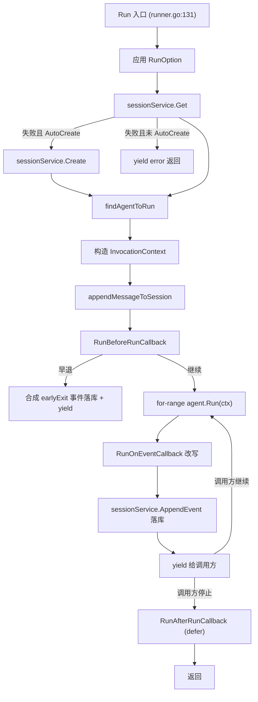
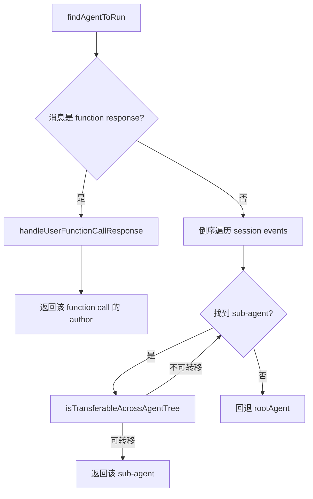
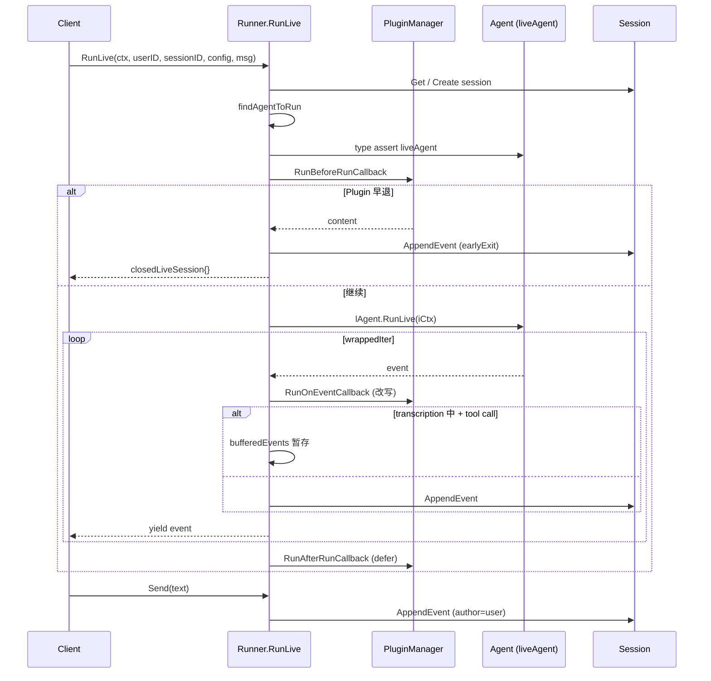
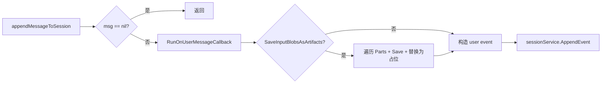
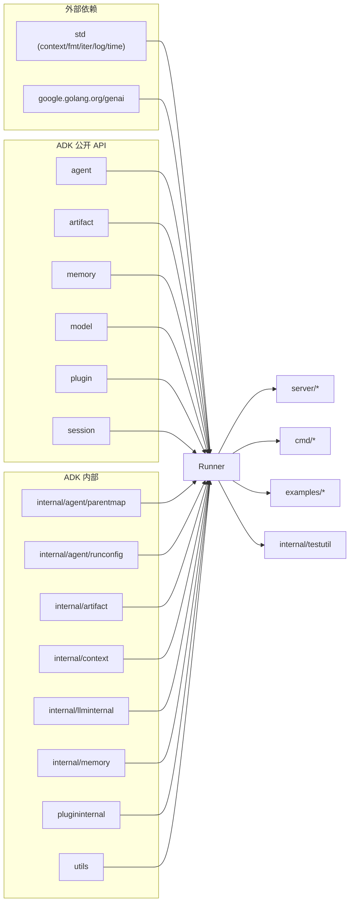

# runner 模块

> 锁定 commit：`d06992e2b1ec2c9b95c6070e0fd12d50a43e4c99`

## 1. 定位与边界

### 一句话定位
`runner` 包是 ADK 的"会话级"运行时门面：把一次用户输入（`Run`）或一段实时双向流（`RunLive`）装配成正确的 agent 调用上下文，按路由规则决定本次执行的 agent，把产生的 event 序列落库到 session / artifact 服务，并串联起 plugin 的全部回调钩子。

### 子包结构
本模块是单包模块，无子目录。源文件清单如下：

| 文件 | 角色 |
|---|---|
| `runner/runner.go`（678 行） | 主文件：`Config`、`PluginConfig`、`RunOption`、`Runner` 类型及其 `Run` / `RunLive` 方法 |
| `runner/runner_test.go`（449 行） | `findAgentToRun`、`isTransferableAcrossAgentTree`、`SaveInputBlobsAsArtifacts`、`AutoCreateSession` 四个测试 |
| `runner/live_runner_test.go`（301 行） | `RunLive` 三个测试：Callbacks、EarlyExit、ChronologicalBuffering |

包级注释见 `runner/runner.go:15`：`Package runner provides a runtime for ADK agents.`

### 在整体架构中的位置
Runner 是 ADK 的"调度总入口"。所有 server / cmd 层的请求最终都会落到 `runner.Runner.Run` 或 `runner.Runner.RunLive`；反过来，几乎所有非 trivial 的测试也通过 `internal/testutil/test_agent_runner.go` 走 Runner。详细依赖关系见 §8。

### 公共契约 vs 内部实现
- **公共契约**：`Runner`、`Config`、`PluginConfig`、`RunOption`、函数式选项 `WithStateDelta`、`New` 构造函数、`Run` / `RunLive` 方法签名。
- **内部实现**：`liveAgent` 接口（仅用于类型断言）、`runnerLiveSession`、`closedLiveSession`、`bufferedEvents`、`findAgentToRun`、`appendMessageToSession`、`handleUserFunctionCallResponse` 等。

## 2. 核心接口与类型

### Runner（核心类型）
定义位置：`runner/runner.go:116-126`。这是包内唯一的对外核心类型，仅暴露 `Run` 和 `RunLive` 两个公开方法，所有依赖（session / artifact / memory / plugin）通过构造函数一次性注入。

```go
// runner/runner.go:116-126
type Runner struct {
    appName           string
    rootAgent         agent.Agent
    sessionService    session.Service
    artifactService   artifact.Service
    memoryService     memory.Service
    parents           parentmap.Map
    pluginManager     *plugininternal.PluginManager
    autoCreateSession bool
}
```

`Runner` 的设计意图是"无状态的可重复调用者"：所有可变状态都在闭包或 ctx 中按次生成，调用方可以放心地在多个 goroutine 中并发启动多次 `Run`，每次都拿到独立的迭代器。

### Config / PluginConfig
`Config`（`runner/runner.go:44-58`）是构造 Runner 的配置载体：必填 `Agent` 和 `SessionService`，可选 `ArtifactService`、`MemoryService`、`PluginConfig`、`AutoCreateSession`、`AppName`。`PluginConfig`（`runner/runner.go:60-63`）只装 `Plugins []*plugin.Plugin` 与 `CloseTimeout time.Duration`，透传给内部 `plugininternal.NewPluginManager`。

### RunOption / WithStateDelta
`RunOption` / `runOptions`（`runner/runner.go:65-69`）是函数式选项模式，目前只承载 `stateDelta map[string]any`，对应 `WithStateDelta`（`runner/runner.go:72-76`）。该 delta 会附着到 user 事件上（`runner/runner.go:580-582`），是"一次性"会话状态补丁。后续追加 `RunOption` 只需新增 setter，`Run` / `RunLive` 在入口自动接收（`runner/runner.go:136-139, 329-332`）。

### liveAgent（内部小接口）
定义位置：`runner/runner.go:270-272`。仅 `RunLive` 用作类型断言，要求目标 agent 实现 `RunLive` 才能跑 Live。这是 agent 自定义 Live 能力的钩子。

### runnerLiveSession / closedLiveSession
`runnerLiveSession`（`runner/runner.go:274-280`）实现 `agent.LiveSession`，包装底层 live session；额外在 `Send` 中把客户端文本内容回写 session（`runner/runner.go:282-312`）。`closedLiveSession`（`runner/runner.go:318-326`）是 EarlyExit 场景下返回的"假" live session，所有 `Send` 返回 `"session is closed"` 错误，用于告诉客户端"agent 已被 plugin 终止"。

### 复用类型
`session.NewEvent` / `model.LLMResponse` 来自 session / model 包的复用类型，被 runner 用于构造 user 事件和 earlyExit 事件（`runner/runner.go:220-228, 409-413`）。

## 3. 关键数据结构

### Runner 字段含义表

| 字段 | 含义 |
|---|---|
| `appName` | 调用方提供的多租户应用名，用于所有 session / artifact 请求的命名空间 |
| `rootAgent` | 会话入口 agent，作为 `findAgentToRun` 回退目标 |
| `sessionService` | 必选后端服务，所有 session 读写都走它 |
| `artifactService` | 可选；为 nil 时所有 InlineData 走 `SaveInputBlobsAsArtifacts` 临时落盘路径失效 |
| `memoryService` | 可选；为 nil 时 `agent.Memory` 不可用 |
| `parents parentmap.Map` | 在 `New` 中由 root agent 一次性建立（`runner/runner.go:88-91`），后续随 `parentmap.ToContext` 注入 ctx，供 agent 在调用时反查父链 |
| `pluginManager *plugininternal.PluginManager` | 统一管理所有 plugin 的生命周期与回调派发 |
| `autoCreateSession bool` | 决定 `sessionService.Get` 失败时是否自动 `Create` |

### runOptions（`runner/runner.go:67-69`）
只装 `stateDelta`，由 `WithStateDelta` 写入（`runner/runner.go:72-76`）。本质是一次会话状态的"补丁式"增量，在 `appendMessageToSession` 时被合到 user 事件的 `Actions.StateDelta` 上。

### runnerLiveSession（`runner/runner.go:275-280`）
持有 `sess`（底层 live session）、`r`（runner）、`iCtx`（已构造的 InvocationContext）、`storedSession`（已落库的 Session），用于在 `Send` 时把客户端文本直接追加到 session 历史。这是 Live 模式特有的副作用。

### bufferedEvents（`runner/runner.go:435`）
`RunLive` 包装迭代器中的局部缓冲：当 transcription 仍在进行但出现了 function call / response 时先暂存，transcription 收尾后再按时间顺序补发，避免破坏历史时序。

## 4. 关键流程

### 4.1 一次性 Run（Run）
入口 `(*Runner).Run`（`runner/runner.go:131`），返回 `iter.Seq2[*session.Event, error]`：

1. 应用所有 `RunOption`（`runner/runner.go:136-139`）。
2. `sessionService.Get` 拿 `storedSession`；失败时按 `autoCreateSession` 决定是否 `Create`（`runner/runner.go:142-164`）。
3. `findAgentToRun` 决定本次实际执行的 agent（`runner/runner.go:166-170`）。
4. 依次把 `parentmap`、`runconfig`、`pluginManager` 注入 `ctx`（`runner/runner.go:172-176`）。
5. 若配置了 `artifactService` / `memoryService`，构造对应的 `agent.Artifacts` / `agent.Memory` 实现（`runner/runner.go:178-196`）。
6. 用 `icontext.NewInvocationContext` 构造 `InvocationContext`（`runner/runner.go:198-205`）。
7. `appendMessageToSession`（`runner/runner.go:533-588`）：plugin 拦截用户消息、可选 `SaveInputBlobsAsArtifacts` 把 inline blob 存为 artifact 并改写 msg、最终把 user event 写 session。
8. 注册 `defer pluginManager.RunAfterRunCallback`（`runner/runner.go:212-216`）。
9. 调 `pluginManager.RunBeforeRunCallback`；若早退则合成一个 author=user 的 earlyExit 事件落库后 yield 一次即返回（`runner/runner.go:218-232`）。
10. 主循环 `for event, err := range agentToRun.Run(ctx)`（`runner/runner.go:234-266`）：对每个非 partial 事件，先经 `pluginManager.RunOnEventCallback` 改写，再 `sessionService.AppendEvent` 落库。



**看图指引**：流程的关键岔路在 `findAgentToRun` 和 `RunBeforeRunCallback`。前者决定路由到哪个 agent，后者决定是否走 EarlyExit。`RunAfterRunCallback` 是 `defer`，**只在调用方把迭代器消费完时才触发**——这是 Go 1.23 `iter.Seq2` 的 lazy 语义决定的，与 Python 版 adk-python 不完全一致。

### 4.2 findAgentToRun（决定落到哪个 agent）
入口 `(*Runner).findAgentToRun`（`runner/runner.go:592`）：

1. 若当前用户消息是 function response，先调 `handleUserFunctionCallResponse`（`runner/runner.go:593-599`，实现在 `runner/runner.go:627-650`）找到对应 function call 的 event，其 author 即本次目标 sub-agent。
2. 否则倒序遍历 session events，跳过 user 事件，用 `rootAgent.FindAgent(event.Author)` 找 sub-agent，并经 `isTransferableAcrossAgentTree` 检查父链上每节点都没设置 `DisallowTransferToParent`（`runner/runner.go:601-619`，实现在 `runner/runner.go:653-666`）。
3. 都失败时回退到 `rootAgent`（`runner/runner.go:622`）。



**看图指引**：路由优先级为：function response → 倒序命中可转移 agent → 兜底 rootAgent。**注意**：当 user 是 function response 时只看一次 history 找到匹配 ID 的 function call，**不会再走"可转移"判定**——这点容易与普通轮次混淆。

### 4.3 RunLive（实时双向流）
入口 `(*Runner).RunLive`（`runner/runner.go:328`）：

1. 解析 `runOptions`（`runner/runner.go:329-332`）。
2. 拿到 / 创建 session（`runner/runner.go:334-355`）。
3. `findAgentToRun(storedSession, nil)`（`runner/runner.go:358`）。
4. 类型断言 `agentToRun.(liveAgent)`，否则返回 `"agent does not support Live Run"`（`runner/runner.go:363-366`）。
5. 注入 ctx（parentmap、runconfig 强制 `StreamingModeBidi`、`Live` 配置、pluginManager）（`runner/runner.go:368-373`）。
6. 装配 artifacts / memory 与 `iCtx`（`runner/runner.go:375-401`）。
7. 调 `pluginManager.RunBeforeRunCallback`：返回内容时合成 earlyExit 事件落库并返回 `closedLiveSession{}`（`runner/runner.go:403-423`）。
8. 调用 `lAgent.RunLive(iCtx)` 拿到 `agentSess`、`innerIter`（`runner/runner.go:425-428`）。
9. 包装 `wrappedIter`（`runner/runner.go:430-523`）做三件事：`defer pluginManager.RunAfterRunCallback`（`runner/runner.go:431-433`）、经 `RunOnEventCallback` 改写 event、**Chronological buffering**（`runner/runner.go:461-478` 缓冲、`runner/runner.go:480-507` flush）。
10. 返回 `&runnerLiveSession{...}` 与 `wrappedIter`（`runner/runner.go:525-530`）。
11. `Send` 收到非 function response 的客户端文本时，也直接写一个 author=user 的 event 到 session（`runner/runner.go:289-309`）。



**看图指引**：注意三个关键差异：(1) RunLive 强制 `StreamingModeBidi`，与 Run 的请求-响应模式不同；(2) earlyExit 事件的 `Author` 设为 agent 名称，而 `Run` 中是 `"user"`——两路语义不同；(3) `iCtx` 在 `runner/runner.go:395` 重新声明，覆盖了外层 `ctx`，不要把它和 Run 入口的 ctx 当成同一个变量。

### 4.4 appendMessageToSession（Run 前的"准备 + 落库"）
入口 `(*Runner).appendMessageToSession`（`runner/runner.go:533`）：

1. `nil` msg 直接返回（`runner/runner.go:534-536`）。
2. `pluginManager.RunOnUserMessageCallback` 可改写 msg，并按需用新 user content 重建 InvocationContext（`runner/runner.go:537-555`）。
3. `SaveInputBlobsAsArtifacts` 为 true 时遍历 `msg.Parts`，对每个 `InlineData` 调用 `artifacts.Save` 存为 `artifact_<invocationID>_<i>`，并把该 part 替换为文本占位（`runner/runner.go:557-572`）。
4. 构造 author=user、Content=msg、可选 StateDelta 的 event，`sessionService.AppendEvent` 落库（`runner/runner.go:574-587`）。



**看图指引**：这是 Run 入口里唯一一处"plugin 改写 message"的钩子。`SaveInputBlobsAsArtifacts` 把 `*genai.Content` 中的 `InlineData` 重写为文本占位，等于把二进制数据搬到 artifact 后端，避免在 session 历史里塞大块 blob。

## 5. 扩展点

| 扩展点 | 实现位置 | 说明 |
|---|---|---|
| `Config.PluginConfig` | `runner/runner.go:60-63` | 允许插入任意 `*plugin.Plugin`，通过 `plugininternal.PluginManager` 派发 4 类钩子 |
| `RunOption` | `runner/runner.go:65-69` | 当前唯一的"每次调用"扩展点，目前只暴露 `WithStateDelta`；新增只需追加 setter |
| `liveAgent` 接口 | `runner/runner.go:270-272` | agent 自定义 RunLive 能力的钩子；任何 `Agent` 只要实现该方法即可在 `RunLive` 中被识别 |
| `Config.Agent` | `runner/runner.go:44-58` | 接受任意 `agent.Agent`，root agent 可携带子 agent 树，由 `parentmap.New` 一次性建立 |

四个 Plugin 钩子时机（在 Runner 中的触发点）：

| 时机 | 触发位置 |
|---|---|
| `BeforeRunCallback` | `runner/runner.go:218` |
| `AfterRunCallback` | `runner/runner.go:212-216`（`defer`） |
| `OnEventCallback` | `runner/runner.go:243-249, 446-453`（仅对非 partial 事件） |
| `OnUserMessageCallback` | `runner/runner.go:537-555` |

更系统的扩展面说明参见 [`02-extension-points.md`](../02-extension-points.md) 第 7 节（Plugin）与第 2 节（自定义 Agent）。

## 6. 错误处理

Runner 没有自定义错误类型，全部用 `fmt.Errorf` 包装。典型失败模式如下：

| 失败模式 | 触发位置 | 错误信息 |
|---|---|---|
| `Agent == nil` | `runner/runner.go:80-86` | `"root agent is required"` |
| `SessionService == nil` | `runner/runner.go:80-86` | `"session service is required"` |
| `sessionService.Get` 失败且未启用 `AutoCreateSession` | `runner/runner.go:147-151` | 透传原始错误 |
| `sessionService.Create` 失败 | `runner/runner.go:157-160` | 透传原始错误 |
| `sessionService.AppendEvent` 失败 | `runner/runner.go:225-228, 257-260, 414-417, 484-489, 495-499, 511-515` | `"failed to add event to session: %w"` |
| `RunLive.Send` 落库失败 | `runner/runner.go:305-307` | `"failed to add user event to session: %w"` |
| `RunOnUserMessageCallback` 失败 | `runner/runner.go:539-541` | `"error running on run user message callback : %w"` |
| `RunOnEventCallback` 失败 | `runner/runner.go:243-249, 446-453` | yield 一个 `nil, err` |
| `parentmap.New` 失败 | `runner/runner.go:88-91` | `"failed to create agent tree: %w"` |
| `liveAgent` 未实现 | `runner/runner.go:365` | `"agent does not support Live Run"` |
| EarlyExit 后 `closedLiveSession.Send` | `runner/runner.go:320-322` | `"session is closed"` |

**处理建议**：客户端应当区分"plugin 早退"（预期行为，事件正常 yield）和"AppendEvent 写入失败"（基础设施异常，需要重试或告警）；前者通常应当把事件序列消费到底，后者需要立即终止迭代器。

## 7. 并发与性能考量

### 锁与全局状态
- **没有显式锁、没有 goroutine**。`Runner` 本身线程安全假设由调用方保证。
- `Run` / `RunLive` 都是普通同步函数，通过 Go 1.23 的 `iter.Seq2` 把执行权以 lazy pull-based 迭代的方式交给调用方（`runner/runner.go:131, 328`）。
- **全局状态**：仅在 `findAgentToRun` / `handleUserFunctionCallResponse` 中使用 `log.Printf` 打印 unknown agent / function call（`runner/runner.go:598, 612`），没有其它全局可写状态。

### 已知性能瓶颈 / 调优点
- `findAgentToRun` 倒序遍历 session events 直到命中可转移 agent（`runner/runner.go:601-619`），session 越长命中越慢；不过 `isTransferableAcrossAgentTree` 一次就会失败早退。
- `RunLive` 的 chronological buffer（`runner/runner.go:435-505`）只对 transcription 期间出现 tool call 才会堆积事件，最坏情况受 transcription 长度限制。
- `appendMessageToSession` 会对每个 InlineData part 走一次 `artifacts.Save`，大文件多时同步串行（`runner/runner.go:557-572`）。

### 缓存
唯一被缓存的是 `parentmap.Map`，在 `New` 时一次构建（`runner/runner.go:88-91`），随 `parentmap.ToContext` 注入 ctx，避免每次调用重建。

### TODO 提示
`runner/runner.go:132-134` 留有两个未实现：校验 `cfg` 与 agent 的兼容性、对接 tracer；这部分后续可能引入 OTel / 性能采样。

## 8. 依赖与被依赖

### 导入（`runner/runner.go:18-41`）
- **标准库**：`context`、`fmt`、`iter`、`log`、`time`
- **外部**：`google.golang.org/genai`（用于 `*genai.Content`）
- **ADK 内部**（公开 API）：`agent`、`artifact`、`memory`、`model`、`plugin`、`session`
- **ADK 内部**（internal）：`internal/agent/parentmap`、`internal/agent/runconfig`、`internal/artifact`（包装为 `agent.Artifacts`）、`internal/context`（构造 `InvocationContext`）、`internal/llminternal`、`internal/memory`（包装为 `agent.Memory`）、`plugininternal`、`utils`

### 被依赖（grep `google.golang.org/adk/runner` 结果）
- `cmd/launcher/console/console.go`、`cmd/launcher/web/a2a/a2a.go`、`cmd/internal/adkcli/main.go`
- `server/adka2a/executor.go`、`server/adka2a/v2/executor.go`
- `server/adkrest/handler.go`、`server/adkrest/controllers/runtime.go`、`server/adkrest/controllers/triggers/eventarc.go`
- `server/agentengine/controllers/method/stream_query.go`
- `plugin/plugin_manager_test.go`、`plugin/functioncallmodifier/integration_test.go`
- `agent/workflowagents/*/agent_test.go`、`agent/llmagent/state_agent_test.go`、`agent/remoteagent/*`
- `internal/llminternal/*_test.go`、`internal/testutil/test_agent_runner.go`
- `examples/bidi/*`、`examples/toolconfirmation/main.go`、`examples/a2a/main.go`、`examples/agentengine/main.go`、`examples/tools/loadartifacts/main.go`、`examples/tools/loadmemory/main.go`



**看图指引**：Runner 是典型的"上层门面"——它依赖大量 ADK 内部包来组合能力，但本身被几乎所有 server / cmd / example 直接使用。`internal/testutil/test_agent_runner.go` 几乎是所有模块测试的"标准入口"，意味着 Runner 是 ADK 端到端行为的"事实标准"。

## 9. 测试与可观察性

### 测试文件位置
- `runner/runner_test.go`
  - `TestRunner_findAgentToRun`（4 个表驱动用例，验证 rootAgent 路由规则）
  - `Test_isTransferrableAcrossAgentTree`（3 个用例，覆盖 `DisallowTransferToParent` 与非 LLM agent）
  - `TestRunner_SaveInputBlobsAsArtifacts`（端到端验证 artifact 落盘与 msg 改写）
  - `TestRunner_AutoCreateSession`（4 用例覆盖 autoCreate 开关）
- `runner/live_runner_test.go`
  - `TestRunner_RunLive_Callbacks`（验证 before/after callback 时机）
  - `TestRunner_RunLive_EarlyExit`（验证 plugin 早退路径）
  - `TestRunner_RunLive_ChronologicalBuffering`（验证 transcription + tool call 顺序）

`mockLiveAgent` / `dummyLiveSession` 是测试 fixture。

### Telemetry / Tracing
`runner/runner.go:134` 显式 `// TODO: setup tracer.`，当前 Runner 不打任何 span / trace。`tracer` 的注入位置在 `Run` 函数体里（还没实现）。

### 日志
只有 `log.Printf` 两种（`runner/runner.go:598, 612`），分别记录 "Function call from an unknown agent" 与 "Event from an unknown agent"，用于排查 agent tree 失配。

### 共享测试入口
跨模块的 `internal/testutil/test_agent_runner.go` 提供 `NewTestAgentRunner` / `NewTestAgentRunnerWithPluginManager`，封装 `runner.New` + 后续 `Run` 调用，绝大多数 agent 内部测试都通过它跑端到端（`internal/testutil/test_agent_runner.go:40, 94, 103, 122`）。

## 10. 延伸阅读

- 端到端流程：[`01-core-flows.md`](../01-core-flows.md) 中 **F1 单轮对话**（`Runner.Run` 主线）、**F4 长会话与 Session 持久化**（Runner ↔ session 协作）、**F5 Live 双向流**（`Runner.RunLive`）。
- 扩展面：[`02-extension-points.md`](../02-extension-points.md) 第 2 节"写一个自定义 Agent"（与 `Config.Agent` 对接）、第 7 节"写一个 Plugin"（与 `PluginConfig` 对接）。
- 同模块定位：[`03-modules/01-agent.md`](./01-agent.md)（Agent 接口的"被调用方"视角）、[`03-modules/05-session.md`](./05-session.md)（Session 服务的"被依赖方"视角）、[`03-modules/08-plugin.md`](./08-plugin.md)（Plugin 钩子的"被消费方"视角）。
- 附录：[`04-appendix.md`](../04-appendix.md) 的术语表（A.1）解释了"Runner / Run / RunLive / findAgentToRun / AppendEvent"等术语。