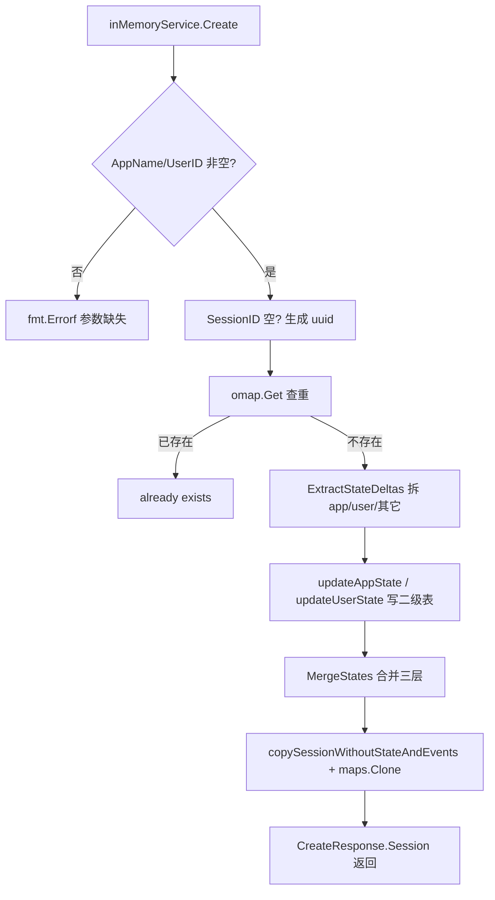
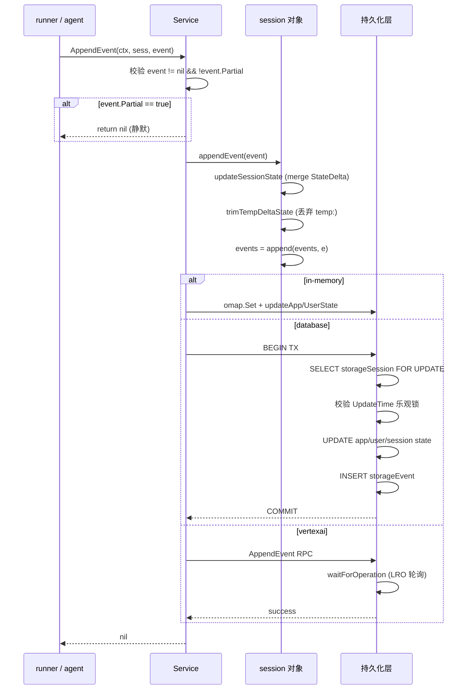
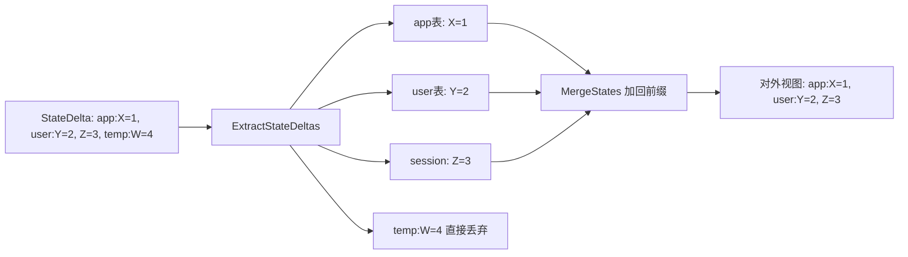
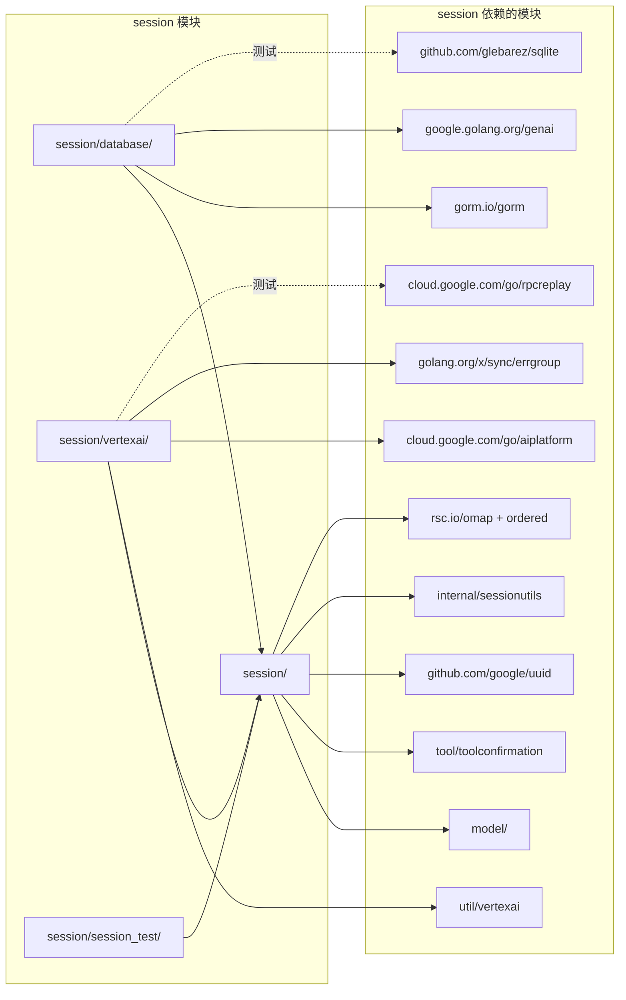

# 05 · session 模块

> 锁定 commit: `d06992e2b1ec2c9b95c6070e0fd12d50a43e4c99`
> 模块路径: `session/`（含子包 `database/`、`vertexai/`、`session_test/`）

## 1. 定位与边界

`session` 包是 ADK 的"会话与状态"层——定义一次 agent↔user 交互中所有可被持久化、可被回放的内存结构（`Session` / `State` / `Events` / `Event`），并对外提供 `Service` 抽象以支持 in-memory、关系型数据库 (GORM)、Vertex AI Agent Engine 三种可替换存储后端。

子包分工：

| 子包 | 负责什么 |
| --- | --- |
| `session/`（根包） | 公共接口（`Session` / `Service` / `State` / `Events` / `Event`） + InMemory 实现 + 关键前缀常量 |
| `session/database/` | 基于 GORM 的关系型数据库实现，支持 Postgres / MySQL / Spanner / SQLite；自带 `stateMap` / `dynamicJSON` 自定义列类型 |
| `session/vertexai/` | 基于 Vertex AI Agent Engine ReasoningEngine 的 gRPC 远程实现，使用 LRO 异步等待 |
| `session/session_test/` | 跨实现的 conformance 测试套件——`RunServiceTests` 暴露 `Snapshot` 与 `SuiteOptions`，所有后端跑同一套用例 |

整体位置：依赖 `model.LLMResponse`（`session/session.go:24`）、`tool/toolconfirmation`（`session/session.go:25`）、`internal/sessionutils`（`session/inmemory.go:32`）；被 `agent` / `runner` / `internal/llminternal` / `memory` / `server/adkrest` / `server/adka2a` / `plugin` / `cmd/launcher` 反向引用。

公共契约 vs 内部实现：

- **公共契约**：`Session` / `Service` / `State` / `ReadonlyState` / `Events` / `Event` / `EventActions` / `KeyPrefixApp` / `KeyPrefixUser` / `KeyPrefixTemp` / `ErrStateKeyNotExist` / `NewEvent` / `Event.IsFinalResponse()` 全部位于根包 `session/`，是稳定 API。
- **内部实现**：根包内的 `inMemoryService` / `session` / `id`（`session/inmemory.go:39`、`session/inmemory.go:305`、`session/inmemory.go:299`）；子包内的 `databaseService` / `localSession` / `storageSession` / `vertexAiService` / `vertexAiClient`。这些不应该被外部直接 import。

## 2. 核心接口与类型

### 2.1 `Service` —— 统一存储抽象

```go
// session/service.go:25
type Service interface {
    Create(context.Context, *CreateRequest) (*CreateResponse, error)
    Get(context.Context, *GetRequest) (*GetResponse, error)
    List(context.Context, *ListRequest) (*ListResponse, error)
    Delete(context.Context, *DeleteRequest) error
    // AppendEvent is used to append an event to a session, and remove temporary state keys from the event.
    AppendEvent(context.Context, Session, *Event) error
}
```

五个方法构成最小契约。`AppendEvent` 兼具"事件追加"与"临时状态清理"双重语义——`Service` 实现必须在写入前过滤掉 `temp:` 前缀键。所有方法都接收 `*XxxRequest` 是为了将来加字段不破坏调用方签名（与 `02-extension-points.md §5` 一致）。

### 2.2 `Session` / `State` / `ReadonlyState` / `Events`

```go
// session/session.go:32
type Session interface {
    ID() string
    AppName() string
    UserID() string
    State() State
    Events() Events
    LastUpdateTime() time.Time
}
```

`Session` 是一段对话全部可观测数据的句柄。`State` / `ReadonlyState` 是通用 K-V 存储：

```go
// session/session.go:51
type State interface {
    Get(string) (any, error)            // 缺失返回 ErrStateKeyNotExist
    Set(string, any) error
    All() iter.Seq2[string, any]        // Go 1.23 迭代器，调用方应自行加锁
}
// session/session.go:67
type ReadonlyState interface {
    Get(string) (any, error)
    All() iter.Seq2[string, any]
}
```

`Events` 强调"有序可回放"语义：

```go
// session/session.go:79
type Events interface {
    All() iter.Seq[*Event]
    Len() int
    At(i int) *Event     // 越界返回 nil 而非 panic（session/inmemory.go:381-386）
}
```

### 2.3 `Event` / `EventActions` —— 消息与控制动作

```go
// session/session.go:92
type Event struct {
    model.LLMResponse                       // 内嵌：Content/Partial/TurnComplete/ErrorCode/...
    ID        string
    Timestamp time.Time
    InvocationID string
    Branch    string                        // agent_1.agent_2.agent_3 形式
    Author    string
    Actions   EventActions
    LongRunningToolIDs []string
}
// session/session.go:143
type EventActions struct {
    StateDelta                 map[string]any
    ArtifactDelta              map[string]int64
    RequestedToolConfirmations map[string]toolconfirmation.ToolConfirmation
    SkipSummarization          bool
    TransferToAgent            string
    Escalate                   bool
}
```

`Event` 是"单次消息 / 工具调用"的完整快照，内嵌 `model.LLMResponse` 复用 LLM 协议层；`EventActions` 描述事件对会话的副作用，是状态机推进的载体。

`Event.IsFinalResponse()`（`session/session.go:124`）的判定：

```go
func (e *Event) IsFinalResponse() bool {
    if (e.Actions.SkipSummarization) || len(e.LongRunningToolIDs) > 0 {
        return true
    }
    return !hasFunctionCalls(&e.LLMResponse) && !hasFunctionResponses(&e.LLMResponse) &&
        !e.LLMResponse.Partial && !hasTrailingCodeExecutionResult(&e.LLMResponse)
}
```

`runner` 据此决定是否把本事件视作"本轮终结"。

### 2.4 关键前缀常量与错误

```go
// session/session.go:163-176
const (
    KeyPrefixApp  string = "app:"   // 跨 user / 跨 session 共享
    KeyPrefixTemp string = "temp:"  // 当前 invocation 结束即丢弃
    KeyPrefixUser string = "user:"  // 跨 session、user 内共享
)
// session/session.go:179
var ErrStateKeyNotExist = errors.New("state key does not exist")
```

这三个前缀是公共 API。`internal/sessionutils` 内另有一份同义常量（`internal/sessionutils/utils.go:9-13`），属于 internal 实现细节，外部用户**不应**直接 import。

## 3. 关键数据结构

| 结构 | 位置 | 字段含义 |
| --- | --- | --- |
| `id` | `session/inmemory.go:299` | 三元组 `appName / userID / sessionID`；用 `ordered.Encode` 序列化为定长字典序键，便于 `omap.Map` 范围扫描 |
| `inMemoryService` | `session/inmemory.go:39` | `mu sync.RWMutex` + `sessions omap.Map`（按 ID 排序的有序 map）+ `userState` / `appState` 两张二级表 |
| `session`（根包私有） | `session/inmemory.go:305` | 内部 `Session` 实现；自带 `mu` 保护 `events` / `state` / `updatedAt` |
| `events []*Event` | `session/inmemory.go:365` | 用 `iter.Seq` 暴露，复制时只复制切片头 |
| `state` | `session/inmemory.go:388` | K-V 视图；`All()` 复制 map 后释放锁，避免持锁迭代 |
| `localSession` (database) | `session/database/session.go:29` | 与 in-memory 几乎逐字段相同的"本地缓存"；TODO 注释期望合并到 sessioninternal |
| `storageSession` | `session/database/storage_session.go:29` | 持久化表行；`AppName/UserID/ID` 复合主键；`State stateMap` + `Events []storageEvent` Has-Many |
| `storageEvent` | `session/database/storage_session.go:70` | 单事件行；`Actions []byte`（整体 JSON 化）+ 多个 `dynamicJSON` 列存 LLM 响应的可选部分 |
| `storageAppState` / `storageUserState` | `session/database/storage_session.go:289`、`301` | 全局与用户级 state 表；按 app / user 维度拆分持久化 |
| `vertexAiClient` | `session/vertexai/vertexai_client.go:41` | 包装 `aiplatform.SessionClient` + `vertexaiutil.AgentEngineData` 元数据 |
| `vertexAiService` | `session/vertexai/vertexai.go:28` | 实现 `Service`；`Get` 中用 `errgroup` 并发取 session + events |

**生命周期与状态机**：

`Event` 没有显式状态字段，但通过 `IsFinalResponse()` 隐式区分"中间事件"和"终结事件"。`runner` 在 F1 流程中按"非 partial → AppendEvent → 是否终结"三步推进；`EventActions.SkipSummarization` 与 `LongRunningToolIDs` 可以让"看起来是中间帧"的事件被视作最终帧，跳过 LLM 总结步骤。

`Session` 的生命周期由 `Service` 五方法共同推进：`Create` → `Get` / `List` → `AppendEvent*` → `Delete`。In-memory 用 `omap.Map` 字典序排列，使 `List` 可走 O(log n + k) 的 `Scan(lo, hi)` 区间扫（`session/inmemory.go:160`）。

## 4. 关键流程

### 4.1 `Create` 流程（in-memory）

入口 `inMemoryService.Create` @ `session/inmemory.go:46`：

1. 校验 `AppName/UserID` 非空；`SessionID` 空则用 `uuid.NewString()` 填充
2. 用 `omap.Map.Get` 查重，已存在返回 `"session X already exists"`
3. `sessionutils.ExtractStateDeltas` 把 `req.State` 按 `app:` / `user:` / 其它拆三份
4. `updateAppState` / `updateUserState` 写二级表，`MergeStates` 合并后赋给 session
5. 返回深拷贝后的 `*session`（防外部改写）作为 `CreateResponse.Session`



看图指引：流程核心是"三层命名空间拆分 → 二级表写入 → 合并成对外视图"。`copySessionWithoutStateAndEvents` + `maps.Clone` 是双层防护——前者复制 ID 元数据，后者把 state 浅克隆以阻断外部 `Set` 影响（注意：值是 `any` 浅克隆，深层对象仍共享）。

### 4.2 `AppendEvent` 流程（三种实现公共部分）

`Service.AppendEvent` 是最复杂的方法，三种实现都遵循同一"必清 temp"合同：

1. 拒绝 `event.Partial == true`（`session/inmemory.go:204`、`session/database/service.go:327`、`session/vertexai/vertexai.go:130`）
2. 调内部 `appendEvent`：先 `updateSessionState`（merge StateDelta 到 session.state），再 `trimTempDeltaState` 滤掉 `temp:` 前缀键，最后 append 到 `events` 数组
3. 持久化层各自完成：in-memory 更新 omap + app/user 二级表；database 跑 GORM 事务；vertexai 调 `AppendEvent` RPC + 写本地缓存

DB 实现特别点：会在事务内比对 `storageSess.UpdateTime.UnixMicro()` 与本地 `updatedAt`，**防止 stale 写入**（`session/database/service.go:374-382`）。事件 `Timestamp` 也会被 `Truncate(time.Microsecond)` 避免不同 DB 精度差异（`session/database/service.go:332`）。



看图指引：三实现的"分叉"集中在"持久化层"方框，**前面所有步骤在三个后端都完全相同**——这是公共契约的强约束。database 多了"乐观锁"步骤以防止并发 stale 写入；vertexai 多了"轮询 LRO"以应对 Agent Engine 的异步语义。

### 4.3 `List` 流程（in-memory）

入口 `inMemoryService.List` @ `session/inmemory.go:141`：

1. 校验 `AppName` 非空；`UserID` 可选
2. 计算 lo/hi：`id.Encode()` 把三元组字典序编码，lo 为 `(appName, userID, "")`；hi 在 `userID` 为空时为 `(appName + "\x00", "", "")`，否则为 `(appName, userID + "\x00", "")`
3. `omap.Map.Scan(lo, hi)` 区间扫
4. 对每个 `storedSession` 复制外壳 + 合并三层 state

```mermaid
flowchart LR
    A[List] --> B[lo = id&#40;appName,userID&#41;.Encode&#40;&#41;]
    B --> C{userID 空?}
    C -- 是 --> D[hi = id&#40;appName+'\\x00'&#41;.Encode&#40;&#41;]
    C -- 否 --> E[hi = id&#40;appName,userID+'\\x00'&#41;.Encode&#40;&#41;]
    D --> F[omap.Scan lo,hi]
    E --> F
    F --> G[逐个 copySession + mergeStates]
    G --> H[ListResponse.Sessions]
```



看图要点：lo/hi 通过追加 `"\x00"` 实现字典序上下界；这是 `ordered.Encode` 的"定长字符串"特性使然。`Scan(lo, hi)` 复杂度为 O(log n + k)，k 为命中数量。

### 4.4 state 命名空间拆分（共享子流程）

`sessionutils.ExtractStateDeltas`（`internal/sessionutils/utils.go:26`）是状态拆分的唯一来源：把 `app:` 写到 app 表、`user:` 写到 user 表、其余写到 session 内；`temp:` 直接丢弃。`MergeStates` 反向操作，给 app/user 状态加回前缀，与 session 状态合并成对外视图。



看图指引：`temp:` 是这一拆分最关键的设计点——临时变量天然不会污染持久化层，runner / agent 完全可以把"中间计算"塞进 `Actions.StateDelta["temp:foo"]` 而无需清理。

## 5. 扩展点

`02-extension-points.md §5` 已对"如何写自定义后端"做了完整描述。本模块特有的扩展点：

- **替换存储后端**：实现 `Service` 五方法即可。最简模板是 `inMemoryService`（`session/inmemory.go:39`）。
- **自定义 state / events 视图**：`State` / `Events` 是接口，可被装饰（例如加入压缩、加密、自定义索引）。
- **GORM Dialector**：`database.NewSessionService` 接受任意 `gorm.Dialector`，已支持 postgres / mysql / spanner / sqlite（在 `gorm_datatypes.go` 中按方言返回 `JSONB / LONGTEXT / STRING(MAX)`）。
- **Vertex AI 资源命名**：`getReasoningEngineID`（`session/vertexai/vertexai_client.go:420`）接受三种输入：直接 numeric ID、完整 `projects/.../reasoningEngines/N` 路径、或事先在 `VertexAIServiceConfig.ReasoningEngine` 配置好。
- **Tool 端运行长任务标识**：`Event.LongRunningToolIDs` 字段可由 agent 调用方填充，配合 `IsFinalResponse()` 跳过 summarization。
- **动作控制**：`EventActions.TransferToAgent` / `Escalate` / `SkipSummarization` 是 agent 流程控制的钩子（`session/session.go:143-160`）。
- **Test harness**：`session_test.RunServiceTests`（`session/session_test/service_suite.go:76`）+ `SuiteOptions` 让任何新后端可零成本接入"行为契约"测试集。

## 6. 错误处理

| 错误类型 | 位置 | 含义 / 处理 |
| --- | --- | --- |
| `ErrStateKeyNotExist` | `session/session.go:179` | 状态键缺失的统一哨兵；调用方应 `errors.Is(err, session.ErrStateKeyNotExist)` 判断 |
| 参数校验错误 | 各 `Service` 方法 | 全部先做 `app_name/user_id/session_id` 非空检查，返回 `fmt.Errorf("... are required, got ...: %q", ...)` |
| 重复创建 | `session/inmemory.go:67` | `inMemoryService.Create` 返回 `"session X already exists"`；`database.Create` 抛 GORM 唯一约束错误；`vertexai.Create` **拒绝**用户给 `SessionID`（`session/vertexai/vertexai.go:60`） |
| 找不到 | `session/inmemory.go:112` / `session/database/service.go` | in-memory 返回 `"session %+v not found"`；database 把 `gorm.ErrRecordNotFound` 包装后返回（**注意**：不像 in-memory，这里不区分"业务不存在"与"系统错误"） |
| stale 写入 | `session/database/service.go:374` | `database.applyEvent` 用 `UpdateTime` 做乐观锁；冲突返回 `"stale session error: ..."` |
| LRO 超时 | `session/vertexai/vertexai_client.go:116` | 最多 10 次重试，baseDelay 1s / maxDelay 5s；超过返回 `"LRO '%s' timed out after %d retries"` |
| LRO 阶段映射 panic 防护 | `session/vertexai/vertexai_client.go:375` | `sessionIDByOperationName` 对 Vertex 返回的 `/sessions/X/operations/Y` 长名做严格切片校验，避免越界 panic |

**典型失败模式与处理建议**：

1. **partial event 被 AppendEvent 静默丢弃**：调用方应当保证只在"事件已落地"时调用；流式中间帧应交给 runner 内部缓冲。
2. **state.All() 在大 state 上分配成本高**：因为是 `maps.Clone` 复制整个 map，state 较大时可考虑自己缓存。
3. **database 时间精度截断**：用户传入纳秒时间戳会被悄悄裁到微秒（`session/database/service.go:332`），跨时钟源写入时心里要有数。
4. **vertexai 拒绝自定义 SessionID**：`session/vertexai/vertexai.go:60` 显式拒绝非空 `req.SessionID`，需要时改用 in-memory 或 database。

## 7. 并发与性能考量

**锁策略**：

- in-memory 用 `sync.RWMutex`（`session/inmemory.go:40`）：顶层 `inMemoryService.mu` 保护 `sessions` / `appState` / `userState`；每个 `session` 内还有独立 `sync.RWMutex`（`session/inmemory.go:309`），让不同 session 的事件写入可并行。
- `state.All()` 先 `RLock` → `maps.Clone` → 释放锁 → 再迭代（`session/inmemory.go:405-418`），避免持锁遍历。
- `Events()` 返回的 `events` 类型不持锁，调用方需要时自己加 `session.mu.RLock()`。

**并发优化**：

- `omap.Map` 有序 + `Scan(lo, hi)` 范围查询使得 List 在 in-memory 后端是 O(log n + k) 而不是 O(n)（`session/inmemory.go:160`）。
- `vertexai.Get` 用 `errgroup` 并发拉取 session 详情与 events 列表（`session/vertexai/vertexai.go:75-103`）。
- GORM `PrepareStmt: true` 在 `session/database/service_test.go:38` 等使用例里开启，可缓存 prepared statement。
- DB 写入单事务：`database.Create` / `AppendEvent` 都用 `s.db.WithContext(ctx).Transaction(...)` 包住 app/user/session 多表更新（`session/database/service.go:97`、`session/database/service.go:360`）。

**已知瓶颈**：

- in-memory 端所有读返回的 events 都是新切片（`make + append`），长会话 + `NumRecentEvents` 过滤时分配可观。
- DB 端 `Get` 用 `timestamp DESC` + `LIMIT` 倒着取再翻转，依赖 SQL 层支持 `ORDER BY ... LIMIT` 优化器下推。
- `vertexai.waitForOperation`（`session/vertexai/vertexai_client.go:116`）用 `getSession` 轮询 LRO 而非真正的 LRO wait——`// TODO replace with LRO wait when it's fixed` 注释明确指出这是临时方案，未来行为可能变化。

**全局状态**：

`inMemoryService` 是单实例对象，不维护全局注册表；多后端并存由调用方在 `runner.New` 时选择。

## 8. 依赖与被依赖



看图指引：根包是"被反向引用最多"的核心；`session_test` 引用根包做 conformance，所有后端都跑它。

**被反向引用（按层次分组）**：

- **核心执行/上下文**：`agent/agent.go`、`agent/context.go`、`agent/callback_context.go`、`internal/context/invocation_context.go`、`internal/context/readonly_context.go`、`internal/context/callback_context.go`
- **LLM 流程**：`internal/llminternal/*` 共 15+ 个文件（`base_flow.go`、`functions.go`、`agent_transfer.go`、`contents_processor.go`、`instruction_processor.go`、`identity_request_processor.go`、`request_confirmation_processor.go`、`tools_processor.go`、`outputschema_processor.go`、`basic_processor.go`、`file_uploads_processor.go`、`audio_cache_manager.go`、`other_processors.go` 等）
- **memory**：`memory/service.go`、`memory/inmemory.go`、`memory/vertexai/*`、`internal/memory/memory.go`
- **server / launcher**：`cmd/launcher/launcher.go`、`cmd/launcher/console/console.go`、`cmd/launcher/web/web.go`、`cmd/launcher/web/a2a/*`、`server/adka2a/executor.go`、`server/adka2a/conversions.go`、`server/adka2a/v2/*`、`server/adkrest/handler.go`
- **plugin / telemetry**：`plugin/plugin.go`、`plugin/loggingplugin/logging_plugin.go`、`plugin/functioncallmodifier/*`、`internal/plugininternal/plugin_manager.go`、`internal/telemetry/telemetry.go`
- **配置/回放**：`internal/configurable/conformance/replayplugin/*`、`internal/configurable/conformance/recordplugin/*`、`internal/configurable/conformance/callbacks.go`
- **示例**：几乎所有 `examples/**/main.go` 都导入

## 9. 测试与可观察性

### 9.1 测试文件位置

- `session/inmemory_test.go` —— InMemory 单元 + 并发 + 死锁回归。`Test_inMemoryService_CreateConcurrentAccess` 16 协程 / 32 次竞争写；`TestInMemorySession_AppendEvent_Deadlock` 防止 `updateSessionState` 重复加锁。
- `session/database/service_test.go` —— DB 后端跑同一 `RunServiceTests` 套件 + AutoMigrate + 用 `WHERE true` 清理避免 Spanner DELETE 限制。
- `session/vertexai/service_test.go` + `vertexai_test.go` —— 用 `cloud.google.com/go/rpcreplay` 录制/回放 RPC，零网络依赖；`testdata/` 下有 30 个 `.replay` 文件。
- `session/session_test/service_suite.go` —— 共享的 `RunServiceTests` + `Snapshot` + `SuiteOptions`，约 600 行覆盖 Create / Get / List / Delete / AppendEvent / StateManagement 六大分组。

### 9.2 Telemetry 埋点

session 包自身**没有**直接打 span / metric；`Event` 作为数据载体被 `internal/telemetry/telemetry.go` 引用：

- `ResponseEvent *session.Event`（`internal/telemetry/telemetry.go:81, 160`）—— 把 Event 作为 span 属性透传给 OTel。
- `TraceMergedToolCallsResult(span, fnResponseEvent, err)`（`internal/telemetry/telemetry.go:244`）—— 工具调用合并后的追踪钩子。

要在自己的后端上挂埋点，应当在 `AppendEvent` 入口处把 event 透传给 OTel SDK；公共契约里没有强制。

### 9.3 集成测试入口

写新后端时，调用 `session_test.RunServiceTests(t, myService, session_test.SuiteOptions{...})`（`session/session_test/service_suite.go:76`）即可。`Snapshot` 字段让你以 JSON 比对代替逐字段断言。

## 10. 延伸阅读

- 端到端流程（F1 单轮对话 / F4 长会话持久化）：[01-core-flows.md](../01-core-flows.md)
- 顶层鸟瞰与抽象清单：[00-overview.md](../00-overview.md)
- 自定义 Session 后端契约（必读）：[02-extension-points.md §5](./../02-extension-points.md#5-接入自定义-session-backend)
- agent / runner 模块对 `Event` 的消费方式：[03-modules/01-agent.md](./01-agent.md)、[03-modules/04-runner.md](./04-runner.md)
- 与 LLM 协议共享 `Event` 字段：[03-modules/02-model.md](./02-model.md)
- plugin 透传 `Event` 钩子：[03-modules/08-plugin.md](./08-plugin.md)
- 术语表与文件索引：[04-appendix.md](../04-appendix.md)
