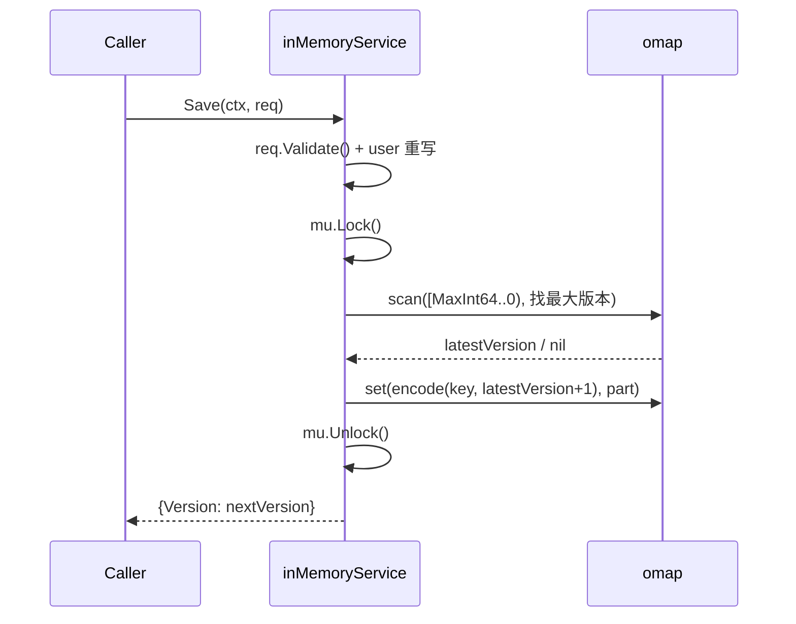
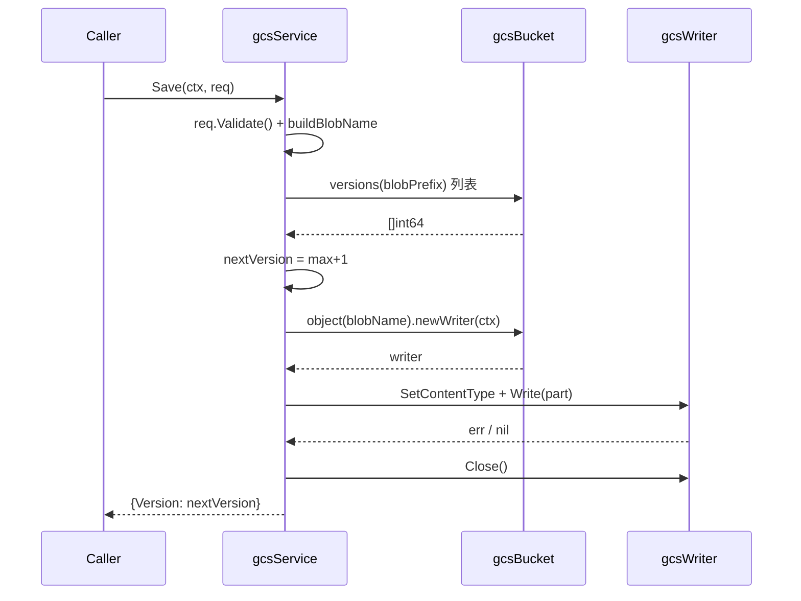
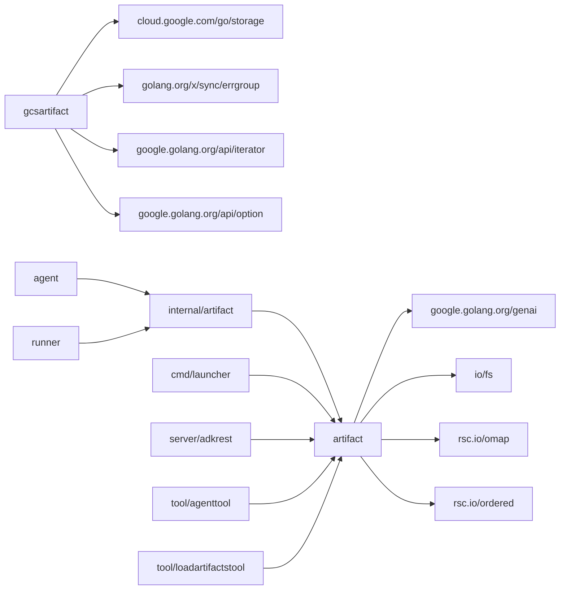

# artifact 模块

> 本章基于 commit `d06992e2b1ec2c9b95c6070e0fd12d50a43e4c99` 编写。模块代码位于 `/home/wu/oneone/adk/artifact/`（含子包 `gcsartifact`）以及 `/home/wu/oneone/adk/internal/artifact/`（高层 wrapper）。

## 1. 定位与边界

`artifact` 包是 ADK 的工件（artifact）存储抽象层：在 `Service` 接口下管理按 `appName / userID / sessionID / fileName / version` 五元组寻址的内容 blob，并提供两种开箱即用实现——进程内的 `InMemoryService`（基于有序 map）和 Google Cloud Storage 的 `gcsartifact.NewService`。

边界与依赖位置：

- 包内公共契约：`artifact.Service` 接口（`artifact/service.go:31-47`）、`Save/Load/Delete/List/Versions/GetArtifactVersion` 6 个 DTO 集合、参数校验、内存实现工厂 `InMemoryService()`。
- GCS 后端实现：子包 `artifact/gcsartifact/`，对外只暴露 `NewService(ctx, bucketName, opts...)` 工厂；包内 5 个 `gcsClient/gcsBucket/gcsObject/gcsObjectIterator/gcsWriter` 接口（`artifact/gcsartifact/gcs_client.go:26-54`）是私有抽象，仅供测试注入 mock。
- 高层便捷封装：`internal/artifact/artifacts.go:27-71` 的 `Artifacts{ Service, AppName, UserID, SessionID }` 把三元组固化，runner 默认注入它。
- 装饰层：`agent/callback_context.go:241-261` 的 `trackedArtifacts` 把 `Save` 的 `Version` 写入 `EventActions.ArtifactDelta`，影响事件回放与事件流订阅。

哪些是"公共契约"：所有 `Service` 方法、6 个 Request/Response 类型、`ArtifactVersion`、`InMemoryService()`、`gcsartifact.NewService`、`internal/artifact.Artifacts`。哪些是"内部实现"：包级小写的 `inMemoryService`、`artifactKey`、`userScopedArtifactKey`、GCS 子包的全部 wrapper 与 fake 替身。

## 2. 核心接口与类型

`Service`（`artifact/service.go:31-47`）定义了 6 个方法的最小可用 CRUD+版本集合：

```go
type Service interface {
    Save(ctx, *SaveRequest) (*SaveResponse, error)
    Load(ctx, *LoadRequest) (*LoadResponse, error)
    Delete(ctx, *DeleteRequest) error
    List(ctx, *ListRequest) (*ListResponse, error)
    Versions(ctx, *VersionsRequest) (*VersionsResponse, error)
    GetArtifactVersion(ctx, *GetArtifactVersionRequest) (*GetArtifactVersionResponse, error)
}
```

设计要点：所有方法都接收显式 `*XxxRequest` 结构，便于扩展字段；`Delete` 文档明确"删除不存在不算错误"（`artifact/service.go:167-172`）；`GetArtifactVersion` 是元数据通道（`CanonicalURI` / `MimeType` / `CreateTime`），与 `Load`（拉内容）解耦。

请求/响应 DTO 全部位于 `artifact/service.go`，关键类型与行号：

| 类型 | 行 | 关键约定 |
|---|---|---|
| `SaveRequest` / `SaveResponse` | 56-66 / 122-124 | `Part *genai.Part` 必填；`Version` 缺省时服务端自增 |
| `LoadRequest` / `LoadResponse` | 127-132 / 161-164 | `Version == 0` 表示"最新版本" |
| `DeleteRequest` | 167-172 | `Version == 0` 表示"删除该文件名下的所有版本" |
| `ListRequest` / `ListResponse` | 201-203 / 225-227 | 按 session 维度返回文件名；user 命名空间合并返回 |
| `VersionsRequest` / `VersionsResponse` | 230-232 / 261-263 | 返回该五元组下所有版本号 |
| `GetArtifactVersionRequest` / `GetArtifactVersionResponse` | 275-280 / 309-311 | 返回 `*ArtifactVersion` 元数据 |
| `ArtifactVersion` | 266-272 | 含 `Version` / `CanonicalURI` / `CustomMetadata` / `CreateTime` / `MimeType` |

校验逻辑以 `Validate() error` 方法下沉到每个 Request 上（不在接口里），保持接口干净。所有 Request 的 `Validate()` 共同约束：`AppName/UserID/SessionID/FileName` 非空；`Part.Text` 与 `Part.InlineData` 至少一个非空；`FileName` 不允许 `/` 或 `\`（`artifact/service.go:99-110` 等多处校验点）。这种约束是业务级断言而非格式 schema。

## 3. 关键数据结构

| Struct | 位置 | 字段含义 |
|---|---|---|
| `inMemoryService` | `artifact/inmemory.go:36-40` | `mu sync.RWMutex` 守护整张表；`artifacts omap.Map[string, *genai.Part]` 是 `rsc.io/omap` 提供的有序 map（按键的字典序迭代），键是 `artifactKey.Encode()` 的字符串 |
| `artifactKey` | `artifact/inmemory.go:56-62` | `(AppName, UserID, SessionID, FileName, Version)` 五元组；`Encode/Decode` 用 `rsc.io/ordered` 生成可比较字节序列，Version 用 `ordered.Rev` 反向，配合 `math.MaxInt64..0` 区间扫描"取最大版本" |
| `userScopedArtifactKey` | `artifact/inmemory.go:54` | 常量字符串 `"user"`；把 `user:` 前缀文件统一落到伪 session 下，保持接口一致 |
| `gcsService` | `artifact/gcsartifact/service.go:43-47` | 持有 `bucketName string` + `storageClient gcsClient` + `bucket gcsBucket`；`storageClient` 字段不直接被方法调用，仅保留便于测试构造 fake |
| `ArtifactVersion` | `artifact/service.go:266-272` | 元数据快照；`CanonicalURI` 优先用 GCS 的 `MediaLink`，否则回退 `gs://<bucket>/<blob>` |
| `SaveRequest.Part` | `artifact/service.go:58-60` | `*genai.Part`；可以是 `Text` 或 `InlineData`（带 `MIMEType` / `Data`） |
| `fakeClient/fakeBucket/fakeObject/fakeWriter/fakeObjectIterator` | `artifact/gcsartifact/gcs_test.go:54-196` | 测试替身；`fakeObject` 自带 `deleted bool` + 内存 `data []byte` + `contentType` 模拟 GCS 状态机 |

GCS 对象布局（`artifact/gcsartifact/service.go:71-76`）：普通文件路径模板 `{appName}/{userID}/{sessionID}/{fileName}/{version}`；user 文件路径模板 `{appName}/{userID}/user/{fileName}/{version}`。运维侧 IAM 与生命周期策略都应按此布局配置。

## 4. 关键流程

### 4.1 内存版 `Save`：锁内自增版本号



看图指引：所有"读旧版本号 + 写新版本号"两步在同一个 `mu.Lock()` 内完成（`artifact/inmemory.go:142-163`），并发 `Save` 同一文件因此被串行化；user 命名空间重写发生在加锁前，确保 key 的 session 维度始终一致。

### 4.2 GCS 版 `Save`：先列版本号再写对象



看图指引：源码注释（`artifact/gcsartifact/service.go:104-105`）显式承认 GCS 没有跨多对象事务，因此多消费者并发写同一文件可能拿到同一 `nextVersion`；close 错误通过命名返回值 + `defer` 仅在 `err == nil` 时覆盖（`artifact/gcsartifact/service.go:118-122`），避免掩盖业务错误。

## 5. 扩展点

实现 `artifact.Service` 接口是接入自定义后端的唯一途径：6 个方法体量小，只要后端支持按 key 寻址 + 版本号自增即可接入。`gcsartifact` 是官方参考实现；典型的其他选项包括 S3、Azure Blob、本地文件系统等。具体路径与方法清单见 [`../02-extension-points.md`](../02-extension-points.md)。

高层装饰层 `agent.Artifacts`（`agent/agent.go:111-116`）也是扩展面：可仿造 `trackedArtifacts`（`agent/callback_context.go:241-261`）实现审计日志、限流、加密、A/B 路由等。注意 `Save` 的 `Version` 会被装饰器自动写入 `EventActions.ArtifactDelta`，自定义实现若替换装饰层需保留此语义以保证事件回放。

GCS 子包的 `gcsClient` 等接口（`artifact/gcsartifact/gcs_client.go:26-54`）仅供测试 mock 注入，**不是稳定 API**；生产环境统一通过 `gcsartifact.NewService(ctx, bucketName, opts...)` 构造。

## 6. 错误处理与并发

**错误约定**：所有实现对 `Load / Delete / Versions / GetArtifactVersion` 命中"未找到"时都返回 `fmt.Errorf("...: %w", fs.ErrNotExist)`（内存：`artifact/inmemory.go:212/219/283/311`；GCS：`artifact/gcsartifact/service.go:203/339/354/379`）。调用方应统一用 `errors.Is(err, fs.ErrNotExist)` 判断，不要字符串匹配。校验错误形如 `"invalid xxx request: missing required fields: ..."`，服务层再包一层 `"request validation failed: %w"`。

**并发与持久化**：`InMemoryService` 受 `sync.RWMutex`（`artifact/inmemory.go:37`）保护，读用 `RLock`、写用 `Lock`；底层 `rsc.io/omap` 是红黑树，支持 `Scan(lo, hi)` 区间迭代，`find` / `Versions` 都通过扫描拿到全部匹配。内存版是 **进程内单例**，重启即丢，仅适合单测与本地开发；生产必须走 GCS。GCS 版无本地状态，`Delete`（`artifact/gcsartifact/service.go:165-181`）用 `errgroup` 并发删多版本对象，但 `Save` 没有跨多对象事务保护，源码已显式声明并发 `Save` 同一文件可能版本号冲突。`Load` 把整个对象一次性 `io.ReadAll` 到内存，无流式 `Part` API，大文件会驻留内存。

潜在陷阱：`user:` 前缀文件请求里即便带真实 `sessionID`，存储层也会忽略并使用伪 session——这是设计而非错误，但容易让调用方误以为 session 隔离；GCS `Delete(Version=0)` 会先 `versions()` 全量扫描前缀，版本数巨大时是性能瓶颈；`ArtifactVersion.CreateTime` 是 `float64` Unix 秒，精度只到秒。

## 7. 依赖与被依赖



看图指引：`artifact` 是 ADK 二级核心包，被 `agent`、`runner`、`server/adkrest`、`cmd/launcher`、多个 tool 子包普遍消费；反向引用全部通过高层 wrapper `internal/artifact.Artifacts` 完成，少数（如 REST 控制器、launcher）直接使用 `artifact.Service`。`gcsartifact` 仅把 `cloud.google.com/go/storage` 包了一层并加了 `errgroup` 并发，不引入新的领域依赖。

## 8. 测试与可观察性

一致性测试套件 `internal/artifact/tests/service_suite.go`（411 行）覆盖常规、空服务、user 命名空间三组场景；两个工厂分别喂入：

- `artifact/inmemory_test.go:25-28` —— `func(t) (artifact.Service, error) { return artifact.InMemoryService(), nil }`，输出 `TestInMemoryArtifactService`。
- `artifact/gcsartifact/gcs_test.go:35-43` —— `newGCSArtifactServiceForTesting` → `newFakeClient()` 绕过真 GCS，输出 `TestGCSArtifactService`。

补充测试：`artifact/artifact_key_test.go` 覆盖 `artifactKey` 往返；`artifact/request_validation_test.go`（447 行）覆盖 6 个 Request 的 `Validate()` 边界（含 `/` 与 `\` 分隔符）；`artifact/gcsartifact/gcs_test.go`（204 行）含完整的 `fakeClient/Bucket/Object/Writer/Iterator` 替身实现。

可观察性：本模块**不涉及任何 telemetry / metrics / tracing 埋点**（`artifact/` 下 `grep "telemetry|tracer|metric|span|otel"` 命中为 0）；错误路径仅靠 Go 标准 `error` 透传，调用方需自行加观测。

## 9. 延伸阅读

- 端到端流程：单轮对话与工具调用中 artifact 的访问路径见 [`../01-core-flows.md#f1`](../01-core-flows.md)。
- 扩展机制：自定义后端实现、装饰器扩展位置见 [`../02-extension-points.md`](../02-extension-points.md)。
- 顶层定位：`artifact` 在整体模块依赖图中的位置见 [`../00-overview.md`](../00-overview.md)。
- 术语与文件索引：`Service` / `ArtifactVersion` / `user namespace` 等术语定义见 [`../04-appendix.md`](../04-appendix.md)。
- 子项目深读占位：artifact 模块深读将由后续子项目产出，链接待补。