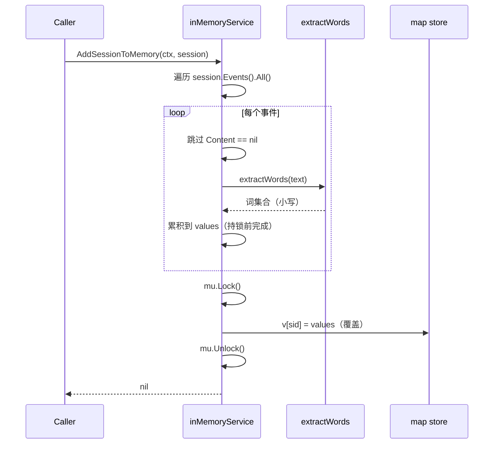
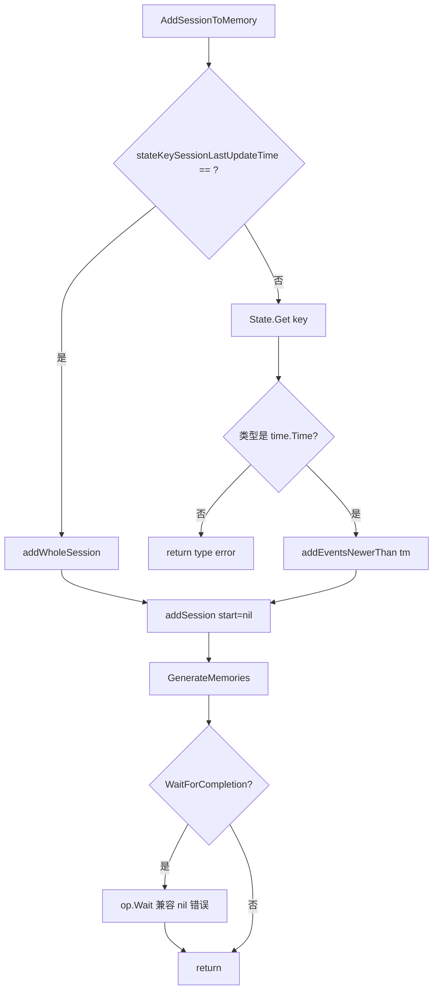
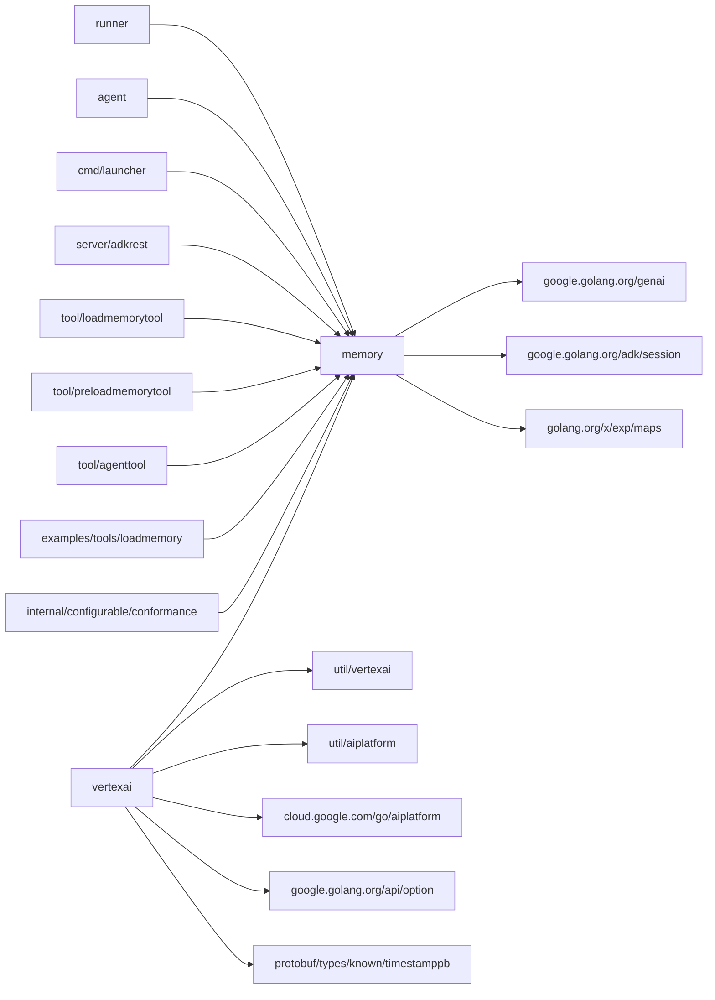

# memory 模块

> 本章基于 commit `d06992e2b1ec2c9b95c6070e0fd12d50a43e4c99` 编写。模块代码位于 `/home/wu/oneone/adk/memory/`（含子包 `vertexai`）。

## 1. 定位与边界

`memory` 包是 ADK 中"长期知识（long-term knowledge）"的抽象层，定义把 `session.Session` 摄入为可检索记忆、并以关键词或向量方式搜索记忆的统一接口；内置进程内的 `InMemoryService` 与基于 Vertex AI MemoryBank 的远端实现。

边界与依赖位置：

- 公共契约：`memory.Service` 接口（`memory/service.go:31-39`）、`Entry`、`SearchRequest`/`SearchResponse`、参数工厂 `InMemoryService()`（`memory/inmemory.go:30-34`）。
- 进程内实现：根包 `memory/inmemory.go`，三级 map 索引 + 预计算词集合的关键词检索。
- 远端实现：子包 `memory/vertexai/`，委托 `aiplatform.MemoryBankClient`（`memory/vertexai/vertexai_client.go:35-40`）调用 `GenerateMemories` / `RetrieveMemories` 完成摄入与检索。
- 工具封装：`tool/loadmemorytool` 与 `tool/preloadmemorytool` 把"按用户查询记忆"暴露为 LLM 可调用的工具，复用同一 `Service` 接口。
- 入口装配：`cmd/launcher/launcher.go:61` 的 `MemoryService` 字段、`runner.Config.MemoryService`（`runner/runner.go:37, 53, 106, 121`）共同决定运行时 `Service` 实例。

公共契约是 `Service` 接口与三种 DTO；包级小写的 `inMemoryService`、`key`、`value`、`extractWords`、`checkMapsIntersect` 都是不可定制的实现细节。

## 2. 核心接口与类型

`Service`（`memory/service.go:31-39`）仅有两个方法，是整个 ADK 中"长期记忆"行为的契约面：

```go
type Service interface {
    AddSessionToMemory(ctx context.Context, s session.Session) error
    SearchMemory(ctx context.Context, req *SearchRequest) (*SearchResponse, error)
}
```

设计要点：`AddSessionToMemory` 文档明确"同一 session 可被多次摄入"（`memory/service.go:32-34`）；`SearchMemory` 在无命中时返回 `Empty slice`（`memory/service.go:37`）。`Service` 没有 `Close` / `Flush` 等生命周期方法——远端实现内部持有 gRPC client `Close` 由用户负责。

配套 DTO（均位于 `memory/service.go`）：

| 类型 | 行 | 关键字段 / 约束 |
|---|---|---|
| `SearchRequest` | 42-46 | `Query` / `UserID` / `AppName` 三字段，无可选过滤 |
| `SearchResponse` | 49-51 | `Memories []Entry`；返回 `nil` 表示"无结果"但实现也可能返回 `[]` |
| `Entry` | 54-66 | `ID` / `Content *genai.Content` / `Author` / `Timestamp time.Time` / `CustomMetadata`；`Timestamp` 是事件发生时间而非入库时间（`memory/service.go:61-62`） |

远端实现的工厂与配置：

- `vertexai.NewService`（`memory/vertexai/vertexai.go:46-58`）构造 `*vertexAIService`，内部委托 `newVertexAIClient`（`memory/vertexai/vertexai_client.go:47-61`）完成认证。
- `vertexai.ServiceConfig`（`memory/vertexai/vertexai.go:35-43`）嵌入 `vertexaiutil.AgentEngineData`，并提供增量同步键 `StateKeySessionLastUpdateTime` 与阻塞标志 `WaitForCompletion`。

## 3. 关键数据结构

| Struct | 位置 | 字段含义 |
|---|---|---|
| `inMemoryService` | `memory/inmemory.go:54-57` | `mu sync.RWMutex` 保护并发；`store map[key]map[sessionID][]value` 三级索引——一级按 `(appName, userID)` 分区，二级按 `sessionID` 划分，三级为该 session 内的事件值数组 |
| `key` | `memory/inmemory.go:36-38` | `(appName, userID)` 复合键，起到多租户隔离 |
| `sessionID` | `memory/inmemory.go:40` | `string` 的命名类型别名，仅为 map 键名清晰 |
| `value` | `memory/inmemory.go:42-51` | 内部记忆值；`words map[string]struct{}` 是预计算的小写词集合（按空格分词），供 `SearchMemory` 快速判断词集交集；`id` 与原始 `session.Event.ID` 一致 |
| `vertexAIService` | `memory/vertexai/vertexai.go:28-31` | 远端实现主体；仅持有 `client *vertexAIClient` 与 `stateKeySessionLastUpdateTime` |
| `vertexAIClient` | `memory/vertexai/vertexai_client.go:35-40` | 封装 `*aiplatform.MemoryBankClient` + `*vertexaiutil.AgentEngineData`，缓存 `parent`（资源路径）以减少每次请求的字符串拼接 |

`Entry` 字段语义（`memory/service.go:54-66`）：`ID` 透传事件 ID；`Content` 是 `*genai.Content`（含 `Parts`）；`Author` 透传事件作者；`Timestamp` 是事件发生时间；`CustomMetadata` 透传事件级自定义元数据。VertexAI 实现的 `Entry` 特殊：仅填 `Content`（`memory/vertexai/vertexai_client.go:128-130`），`ID/Author/Timestamp/CustomMetadata` 留零值。

## 4. 关键流程

### 4.1 InMemoryService 摄入：覆盖式更新



看图指引：词集合预计算在持锁前完成（`memory/inmemory.go:67-87`），仅在最终写入 store 时才加锁（`memory/inmemory.go:95-106`），降低锁粒度；同一 session 多次摄入以"最后一次为准"，没有追加语义——已被覆盖的 `*genai.Content` 不会被 GC 直到下次覆盖。

### 4.2 VertexAI 摄入：全量 vs 增量同步



看图指引：分流点在 `memory/vertexai/vertexai.go:65`，增量模式要求消费者在 `BeforeRunCallback` 中维护 `time.Time`（`memory/vertexai/vertexai.go:80-83` 显式做类型断言）；`op.Wait` 阶段显式吞掉 `unsupported result type <nil>: <nil>`（`memory/vertexai/vertexai_client.go:95-98`），作为对底层 SDK 当前行为的工作兼容。

## 5. 扩展点

任何自定义长期记忆后端只需实现 `memory.Service` 两个方法，ADK 上层（`runner`、工具、`agent`）全部依赖该接口。可在 `cmd/launcher/launcher.go:61` 的 `MemoryService` 字段中注入；REST 控制器层（`server/adkrest/handler.go:28`）同样按接口消费。完整骨架与注册路径见 [`../02-extension-points.md`](../02-extension-points.md)。

远端实现 `vertexai.ServiceConfig` 通过嵌入 `vertexaiutil.AgentEngineData` 暴露 `Project` / `Location` / `AgentEngineID`（`memory/vertexai/vertexai.go:35-43`），并允许外部设置增量同步的 session state 键。

工具层是另一类扩展：`tool/loadmemorytool` 与 `tool/preloadmemorytool` 把"按用户查询记忆"暴露给 LLM，可围绕同一 `Service` 接口增加更多检索工具。

`extractWords` 与 `checkMapsIntersect`（`memory/inmemory.go:143-173`）为 unexported，检索算法本身对调用方不可定制；如需向量 / BM25 等需要替换整个 `Service` 实现。

## 6. 错误处理与并发

**错误约定**：根包 `memory` 不定义自己的 error 类型或 sentinel；`InMemoryService` 的两个方法在当前实现中始终返回 `nil` error，不会因 ctx 取消、并发冲突或空内容失败。`vertexai.NewService` 通过 `fmt.Errorf("...: %w", err)` 包装底层错误（`memory/vertexai/vertexai.go:52`）；`AddSessionToMemory` 典型失败点：状态键值不是 `time.Time`（`memory/vertexai/vertexai.go:80-83`）、`GenerateMemories` 调用失败、`op.Wait` 返回非已知错误；`SearchMemory` 失败模式：远端 `RetrieveMemories` 调用错误（`memory/vertexai/vertexai_client.go:119-121`），该路径不会做工作兼容吞噬。上层消费方应通过 `errors.Is/As` 识别。

**并发与性能**：`inMemoryService.mu` 使用 `sync.RWMutex`（`memory/inmemory.go:55`），写持写锁、读持读锁，写入期间检索会被串行化。检索复杂度为 O(总事件数) 的词集比较；`checkMapsIntersect` 在比较前会交换使较小 map 作为外层循环，O(min(|m1|, |m2|))（`memory/inmemory.go:143-160`）。已知瓶颈：`InMemoryService` 全文未被压缩或裁剪，长期运行下内存随事件数线性增长；`SearchMemory` 没有读锁外的去重/排序，结果顺序与 map 迭代顺序相关，测试中通过 `sortMemories` 转换器按时间戳排序（`memory/inmemory_test.go:175-180`）。模块内无显式 goroutine、无全局可变状态；`InMemoryService()` 每次返回新实例。

## 7. 依赖与被依赖



看图指引：`memory` 是叶子包，仅依赖 `session` 与 `genai`；`vertexai` 子包是远端实现的唯一选项，本地无任何其他 backend。被依赖面集中在 `runner`、`agent`、CLI 启动器、REST 控制器与三个 memory 类工具，符合"长期记忆"在 ADK 中的横向贯穿地位。

## 8. 测试与可观察性

`memory/inmemory_test.go` 是核心测试文件，`Test_inMemoryService_SearchMemory` 表驱动覆盖"能找到事件"、"不同 appName/user 隔离"、"无匹配"、"空 store"等场景；通过 `testSession` 桩实现 `session.Session` 接口（`memory/inmemory_test.go:175-180`）。远端 `vertexai` 子包**未提供**单元测试，仅有 `var _ memory.Service = &vertexAIService{}` 编译期断言（`memory/vertexai/vertexai.go:60`）；端到端验证靠 `tool/loadmemorytool/tool_test.go`、`tool/preloadmemorytool/tool_test.go` 等工具层测试。

可观察性：本模块源码中**未出现**对 `internal/telemetry`、`tracer`、`span`、`metric` 的引用，也未使用 `slog`；可观察性靠上层（`runner` / `callback_context`）注入，本模块本身无埋点。

## 9. 延伸阅读

- 端到端流程：长期记忆的摄入与检索在 [`../01-core-flows.md#f1`](../01-core-flows.md) 单轮对话与 F2 工具调用中的旁路调用。
- 扩展机制：自定义 `Service` 实现骨架见 [`../02-extension-points.md`](../02-extension-points.md)。
- 顶层定位：`memory` 在整体模块依赖图中的位置见 [`../00-overview.md`](../00-overview.md)。
- 术语与文件索引：`Service` / `Entry` / `Long-term Memory` 等术语定义见 [`../04-appendix.md`](../04-appendix.md)。
- 子项目深读占位：memory 模块深读将由后续子项目产出，链接待补。
