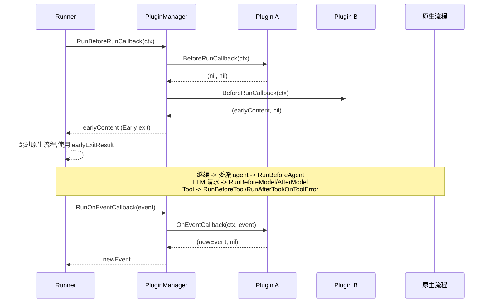
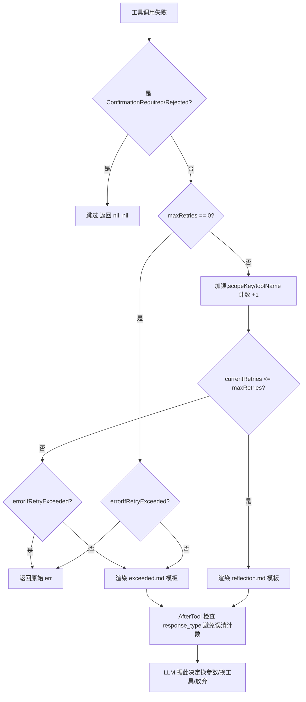
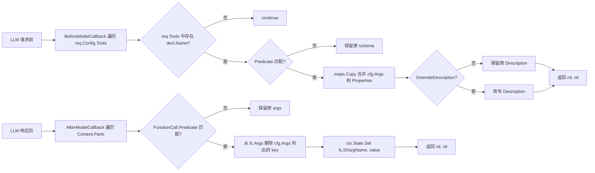
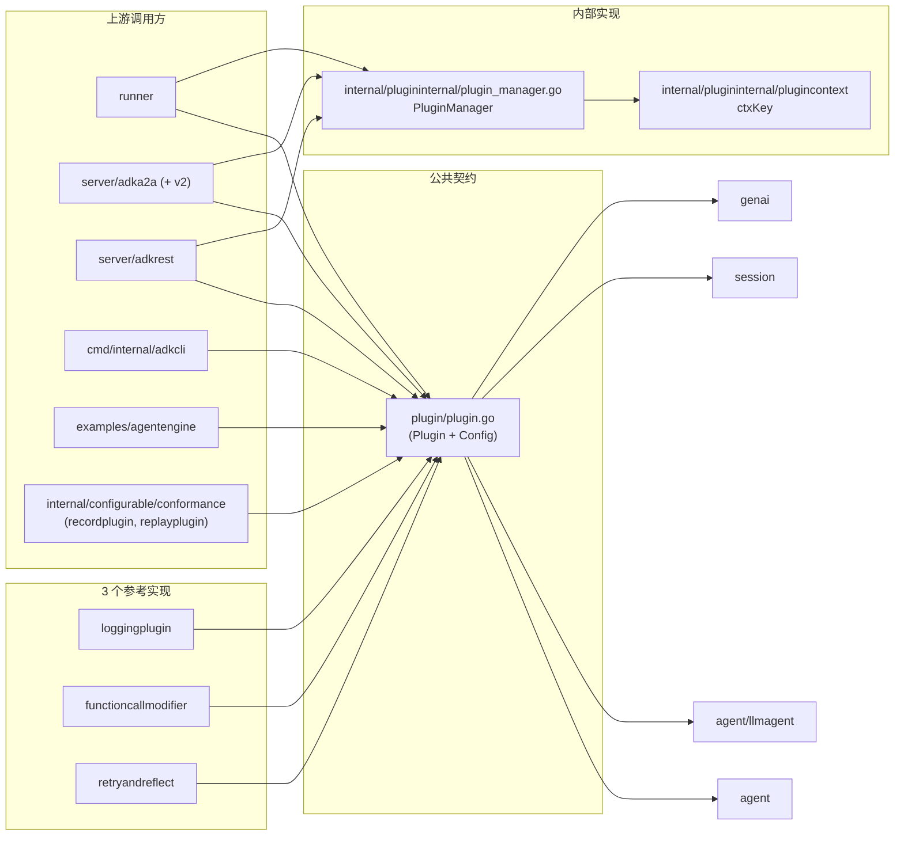

# plugin 模块

> 本章面向"想接入自定义横切逻辑（日志、审计、参数注入、错误自愈）或理解 ADK 可插拔回调机制"的工程师。
> 基于 commit `d06992e2b1ec2c9b95c6070e0fd12d50a43e4c99`。

## 1. 定位与边界

### 一句话定位

`plugin` 包是 ADK 的"可插拔横切关注点"机制：定义统一的回调协议（覆盖 user / run / agent / model / tool 五层生命周期），由 `internal/plugininternal.PluginManager` 在 Runner / A2A executor / AdkREST 三个执行入口统一调度；模块同时内置 3 个示例 plugin（`loggingplugin` / `functioncallmodifier` / `retryandreflect`）作为最佳实践参考。

### 子包与职责

| 子目录 | 作用 | 是否被生产代码 import |
|---|---|---|
| `plugin/` | 公共契约：`Plugin`、`Config`、11 个回调类型 | 是（runner / adka2a / adkrest） |
| `functioncallmodifier/` | 示例 plugin：`BeforeModel` 注入 schema，`AfterModel` 抽取到 session state | 否（仅作参考） |
| `loggingplugin/` | 示例 plugin：把 5 层回调全部用 ANSI 灰色打印到 stdout | 否（仅作参考） |
| `retryandreflect/` | 示例 plugin：自愈式工具错误恢复（Python 端的 Go 复刻） | 否（仅作参考） |

### 在整体架构中的位置

- **依赖**：`genai`（数据类型）、`agent` 与 `agent/llmagent`（callback 类型）、`session`（`Event`）。本包不直接依赖 `runner` / `tool` / `model`，是"协议层"包。
- **被依赖**：`runner.Runner`（主驱动者，`runner/runner.go:39, 61, 93`）、`server/adka2a/executor.go` 与 `server/adka2a/v2/*`、`server/adkrest`、以及 `cmd/internal/adkcli` 和 `examples/agentengine`。
- **真正的调度者**：`internal/plugininternal.PluginManager`（[plugin_manager.go:38](file:///home/wu/oneone/adk/internal/plugininternal/plugin_manager.go#L38)）—— 它在 `runner` 启动时构造，runner 主循环按钩子时机调用它的 `RunXxx` 方法。`internal/plugininternal/plugincontext.PluginManagerCtxKey`（[context.go:19](file:///home/wu/oneone/adk/internal/plugininternal/plugincontext/context.go#L19)）是 runner 把 manager 塞进 `context.Context` 的唯一 ctxKey，深层 agent / tool 可通过它反查。

### 公共契约 vs 内部实现

- **公共契约**（用户应 import）：`google.golang.org/adk/plugin` —— `Plugin` / `Config` / 4 个 plugin 私有回调类型（`OnUserMessageCallback` / `BeforeRunCallback` / `AfterRunCallback` / `OnEventCallback`），详见 [plugin/plugin.go:26-167](file:///home/wu/oneone/adk/plugin/plugin.go#L26)。
- **内部实现**（禁止外部依赖）：`google.golang.org/adk/internal/plugininternal` —— `PluginManager` 是 runner / adka2a / adkrest 共同调用的调度器；`plugincontext` 提供 ctxKey。该子包按 Go module 约定"internal"路径不能被外部 import。
- **参考实现**（可 import，但非核心执行路径）：`loggingplugin` / `functioncallmodifier` / `retryandreflect` 是"用 plugin 包写出来长什么样"的三个示范。grep 结果显示生产代码未直接 import 它们。

## 2. 核心接口与类型

### Config —— 一次性注入所有可选回调

`plugin/plugin.go:26` 定义的"配置体"模式，让用户用 struct literal 一次性配置 11 个回调而无需维护 builder：

```go
// plugin/plugin.go:26
type Config struct {
    Name string

    OnUserMessageCallback OnUserMessageCallback
    OnEventCallback       OnEventCallback

    BeforeRunCallback BeforeRunCallback
    AfterRunCallback  AfterRunCallback

    BeforeAgentCallback agent.BeforeAgentCallback
    AfterAgentCallback  agent.AfterAgentCallback

    BeforeModelCallback  llmagent.BeforeModelCallback
    AfterModelCallback   llmagent.AfterModelCallback
    OnModelErrorCallback llmagent.OnModelErrorCallback

    BeforeToolCallback  llmagent.BeforeToolCallback
    AfterToolCallback   llmagent.AfterToolCallback
    OnToolErrorCallback llmagent.OnToolErrorCallback

    CloseFunc func() error
}
```

每个字段独立可选；`CloseFunc` 留空时构造器自动填上 no-op（[plugin.go:69-72](file:///home/wu/oneone/adk/plugin/plugin.go#L69)），保证 `Plugin.Close()` 永不 panic。

### Plugin —— 不可变容器

`plugin/plugin.go:78` 的 `Plugin` struct 是一次性冻结的数据结构：所有字段都是 unexported，外部只能通过同名访问器（`OnUserMessageCallback()` 等）按需读取。这是一种"构造后即不可变"的设计。

```go
// plugin/plugin.go:78
type Plugin struct {
    name string
    onUserMessageCallback OnUserMessageCallback
    onEventCallback       OnEventCallback
    beforeRunCallback     BeforeRunCallback
    afterRunCallback      AfterRunCallback
    beforeAgentCallback   agent.BeforeAgentCallback
    afterAgentCallback    agent.AfterAgentCallback
    beforeModelCallback   llmagent.BeforeModelCallback
    afterModelCallback    llmagent.AfterModelCallback
    onModelErrorCallback  llmagent.OnModelErrorCallback
    beforeToolCallback    llmagent.BeforeToolCallback
    afterToolCallback     llmagent.AfterToolCallback
    onToolErrorCallback   llmagent.OnToolErrorCallback
    closeFunc             func() error
}
```

两个公开方法 `Name() string`（[plugin.go:102](file:///home/wu/oneone/adk/plugin/plugin.go#L102)）与 `Close() error`（[plugin.go:107](file:///home/wu/oneone/adk/plugin/plugin.go#L107)）。修改一个 plugin 行为的唯一方式是 `Close` + 重新 `plugin.New`。

### plugin 私有回调类型（4 个）

`plugin/plugin.go:161`-`167` 定义了 4 个 plugin 专属回调类型，复用 `agent` 与 `agent/llmagent` 包的同名类型确保签名一致：

```go
// plugin/plugin.go:161
type OnUserMessageCallback func(agent.InvocationContext, *genai.Content) (*genai.Content, error)
type BeforeRunCallback    func(agent.InvocationContext) (*genai.Content, error)
type AfterRunCallback     func(agent.InvocationContext)
type OnEventCallback      func(agent.InvocationContext, *session.Event) (*session.Event, error)
```

### 复用 agent / llmagent 的 4+3+3 类回调

- `agent.BeforeAgentCallback` / `agent.AfterAgentCallback`（[plugin.go:36-37](file:///home/wu/oneone/adk/plugin/plugin.go#L36)）—— 复用 `agent` 包的回调类型。
- `llmagent.BeforeModelCallback` / `llmagent.AfterModelCallback` / `llmagent.OnModelErrorCallback`（[plugin.go:39-41](file:///home/wu/oneone/adk/plugin/plugin.go#L39)）—— 复用 `agent/llmagent` 包的回调类型。
- `llmagent.BeforeToolCallback` / `llmagent.AfterToolCallback` / `llmagent.OnToolErrorCallback`（[plugin.go:43-45](file:///home/wu/oneone/adk/plugin/plugin.go#L43)）—— 同样复用 `agent/llmagent`。

这意味着任何能传给 `llmagent.New(...)` 的回调也能直接挂到 plugin。

## 3. 关键数据结构

### Plugin（plugin.go:78）

纯数据 + 闭包容器。字段都是单元素（不像 Python 端支持 callback list），一次构造决定该 plugin 的全部行为。`closeFunc` 在构造时默认填充（[plugin.go:69](file:///home/wu/oneone/adk/plugin/plugin.go#L69)），是 panic-safe 设计。

### Config（plugin.go:26）

扁平化"配置-对象"模式：11 个字段全可选，调用方按需填。典型用法见 `loggingplugin/logging_plugin.go:49-63` 与 `functioncallmodifier/plugin.go:37-42`。

### PluginManager（plugin_manager.go:38）

runner 端的实际驱动者：

```go
// internal/plugininternal/plugin_manager.go:38
type PluginManager struct {
    plugins      []*plugin.Plugin
    closeTimeout time.Duration
}
```

按注册顺序遍历所有 plugin，对每个 callback 依次调用；任意一个 plugin 一旦返回非空结果（非 nil `*genai.Content` / `*session.Event` / `*model.LLMResponse` / `map[string]any`）或非 nil 错误就 early-return（[plugin_manager.go:84-86, 100-103, ...](file:///home/wu/oneone/adk/internal/plugininternal/plugin_manager.go#L84)），是经典的"短路链式回调"实现。

### retryAndReflect.scopedFailureCounters（retryandreflect/plugin.go:66）

`map[scopeKey]map[toolName]int` 双重嵌套：

| 层级 | key 类型 | 含义 |
|---|---|---|
| 外层 | `string`（scope key） | `Invocation` 模式下是 `ctx.InvocationID()`；`Global` 模式下是常量 `globalScopeKey`（[plugin.go:48](file:///home/wu/oneone/adk/plugin/retryandreflect/plugin.go#L48)） |
| 内层 | `string`（tool 名） | 该作用域内该 tool 的失败次数 |

`resetFailuresForTool` 在 tool 成功时清空对应 entry，scope map 为空时连同外层 key 一起删（[retryandreflect/plugin.go:195-200](file:///home/wu/oneone/adk/plugin/retryandreflect/plugin.go#L195)）。

### templateData（retryandreflect/plugin.go:216）

模板渲染上下文，包含 `ToolName / ErrorDetails / ArgsSummary / RetryCount / MaxRetries` 5 字段；被两个 `//go:embed` 进来的 `.md` 模板共用（`reflection.md` 用于重试中，`exceeded.md` 用于超过上限）。

### plugincontext.PluginManagerCtxKey（internal/plugininternal/plugincontext/context.go:19）

把 `*PluginManager` 塞进 `context.Context` 的 ctxKey，runner 通过 `ToContext` 注入（[plugin_manager.go:286-288](file:///home/wu/oneone/adk/internal/plugininternal/plugin_manager.go#L286)），让深层 agent / tool 也能拿到 manager。

## 4. 关键流程

### 流程 1：plugin 构造与注册

入口：用户调用 `loggingplugin.New(name)` / `functioncallmodifier.NewPlugin(cfg)` / `retryandreflect.New(opts...)`，均返回 `*plugin.Plugin`。所有内置 plugin 都是薄壳，把自己的方法实现塞到 `plugin.Config{...}` 字段，然后 `return plugin.New(cfg)`（[logging_plugin.go:49](file:///home/wu/oneone/adk/plugin/loggingplugin/logging_plugin.go#L49)、[functioncallmodifier/plugin.go:37](file:///home/wu/oneone/adk/plugin/functioncallmodifier/plugin.go#L37)、[retryandreflect/plugin.go:112](file:///home/wu/oneone/adk/plugin/retryandreflect/plugin.go#L112)）。

```mermaid
sequenceDiagram
    participant U as User
    participant P as plugin.New
    participant Cfg as Config
    participant PM as PluginManager
    participant R as runner.New

    U->>Cfg: 填 OnUserMessage/BeforeTool...
    U->>P: plugin.New(cfg)
    P->>P: 拷贝字段;CloseFunc 为 nil 时补 no-op
    P-->>U: *Plugin
    U->>R: runner.New(... Plugins=[...])
    R->>PM: plugininternal.NewPluginManager(cfg)
    PM->>PM: for p in cfg.Plugins: registerPlugin(p)
    PM->>PM: 按 Name() 去重
    PM-->>R: *PluginManager
```

> **看图指引**：`plugin.New` 自身永不返回 error（签名仍写 `(*Plugin, error)` 是为了与 `llmagent.New` 对齐 + 给 `MustNew` 留位置）；runner 在 `runner.New` 阶段把所有 plugin 喂给 `plugininternal.NewPluginManager`（[runner/runner.go:93](file:///home/wu/oneone/adk/runner/runner.go#L93)），`registerPlugin` 会按 `Name()` 去重（[plugin_manager.go:62-72](file:///home/wu/oneone/adk/internal/plugininternal/plugin_manager.go#L62)）。

### 流程 2：plugin 回调链触发（Runner.Run → PluginManager.RunXxx）



> **看图指引**：按 plugin 注册顺序 `for _, plugin := range pm.plugins` 调用对应 callback；一旦某个 plugin 返回非空内容就立刻停止（"Early exit"），参见 [plugin_manager.go:76-89](file:///home/wu/oneone/adk/internal/plugininternal/plugin_manager.go#L76) 等。runner 据此决定是使用 `earlyExitResult` 跳过原生流程（[runner/runner.go:218, 404](file:///home/wu/oneone/adk/runner/runner.go#L218)）还是继续走默认 agent / tool 逻辑。

### 流程 3：retryandreflect 工具错误自愈



> **看图指引**：`OnToolErrorCallback` 先于 `AfterToolCallback` 触发（见 [runner/runner.go](file:///home/wu/oneone/adk/runner/runner.go) 中执行顺序），且 `retryandreflect` 在 `AfterTool` 里检查 `result["response_type"]` 来避免把"反射式回复"误判为"成功"而清空计数（[retryandreflect/plugin.go:128-141](file:///home/wu/oneone/adk/plugin/retryandreflect/plugin.go#L128)）。这是与 Python 端语义完全一致的关键设计点。

### 流程 4：functioncallmodifier 参数抽取



> **看图指引**：`BeforeModel` 必须返回 `nil, nil`（而不是空 `*model.LLMResponse{}`），否则会让 runner 误以为模型"已经被处理过"（参见 [functioncallmodifier/plugin.go:87, 118](file:///home/wu/oneone/adk/plugin/functioncallmodifier/plugin.go#L87)）。这是常见踩坑点。`maps.Copy` 是浅拷贝，复制的是 schema 指针，零序列化开销（[plugin.go:79-80](file:///home/wu/oneone/adk/plugin/functioncallmodifier/plugin.go#L79)）。

### 流程 5：plugin 关闭

Runner 生命周期结束时 `pluginManager.Close()`（[plugin_manager.go:273-284](file:///home/wu/oneone/adk/internal/plugininternal/plugin_manager.go#L273)）：依次调用每个 plugin 的 `Close()`，把任何错误包成 `fmt.Errorf("error closing plugin '%s': %w", ...)` 累积，返回 `nil` 或汇总错误 `failed to close plugins: [...]`。因为 `closeFunc` 在构造时已经默认填充（[plugin.go:69-72](file:///home/wu/oneone/adk/plugin/plugin.go#L69)），单个 plugin 不会 panic；但建议 plugin 实现方自行 `recover()` 以避免一个 plugin 的 panic 中断整个 manager。

## 5. 扩展点

### 写一个自定义 plugin（公共契约）

```go
myPlugin := plugin.MustNew(plugin.Config{
    Name:                 "MyPlugin",
    BeforeModelCallback:  func(ctx agent.CallbackContext, req *model.LLMRequest) (*model.LLMResponse, error) {
        // 修改 req 或返回 (response, nil) 短路
        return nil, nil
    },
    AfterToolCallback:    func(ctx agent.ToolContext, t tool.Tool, args, result map[string]any, err error) (map[string]any, error) {
        return nil, nil
    },
    // 任意其它 9 个回调
    CloseFunc:            func() error { /* 释放资源 */ return nil },
})

runner.New(runner.Config{
    AppName: "app",
    Agent:   myAgent,
    Plugins: [] *plugin.Plugin{myPlugin},
})
```

完整骨架与"自定义 plugin 的 7 个步骤"见 [02-extension-points.md §7](./../02-extension-points.md#7-写一个-plugin)。

### 复用 agent / llmagent 既有回调类型

4 个 agent / model / tool 类回调直接复用 `agent` 与 `agent/llmagent` 子包定义的同名类型（[plugin.go:36-45](file:///home/wu/oneone/adk/plugin/plugin.go#L36)），意味着任何能传给 `llmagent.New(...)` 的回调也能直接挂到 plugin。

### PluginManager 的 early-exit 语义（稳定契约）

所有 `Run*` 方法的"首个非空结果短路"行为是稳定契约（[plugin_manager.go:84-86](file:///home/wu/oneone/adk/internal/plugininternal/plugin_manager.go#L84) 等），可用于做"用 plugin 替换默认行为"的副作用；不会因为增加 plugin 而改变既有 plugin 顺序。

### retryandreflect 的函数式选项

`PluginOption` 函数式选项（`WithMaxRetries / WithErrorIfRetryExceeded / WithTrackingScope`，[retryandreflect/plugin.go:73-93](file:///home/wu/oneone/adk/plugin/retryandreflect/plugin.go#L73)）是扩展点，可以照此模式继续加 `WithReflectionTemplate` 之类的定制。

### 模板替换

`reflection.md` 与 `exceeded.md` 是 `//go:embed` 进来的（[retryandreflect/plugin.go:38, 42](file:///home/wu/oneone/adk/plugin/retryandreflect/plugin.go#L38)），业务方如需完全控制提示词可拷贝整个子包并改 embed 文件。

### scope 拓展

`TrackingScope` 当前只定义了 `Invocation / Global` 两种（[retryandreflect/plugin.go:54-59](file:///home/wu/oneone/adk/plugin/retryandreflect/plugin.go#L54)），但 `scopeKey` 完全可以基于 `ctx.UserID()` / `ctx.Session().ID()` 等自定义。

## 6. 错误处理

### 本模块定义的错误返回

| 位置 | 行为 |
|---|---|
| `plugin.New` | 永不返回 error；签名仍写 `(*Plugin, error)` 是为与 `llmagent.New` 对齐 + 留 `MustNew` 位置（[plugin.go:50](file:///home/wu/oneone/adk/plugin/plugin.go#L50)） |
| `retryandreflect.New` | `maxRetries < 0` 时返回 `fmt.Errorf("maxRetries must be a non-negative integer")`（[plugin.go:108-110](file:///home/wu/oneone/adk/plugin/retryandreflect/plugin.go#L108)）—— 本模块少有的显式错误返回 |
| `functioncallmodifier.afterModelCallback` | `ctx.State().Set` 失败时返回 `fmt.Errorf("failed to set state: %w", err)`（[functioncallmodifier/plugin.go:112-114](file:///home/wu/oneone/adk/plugin/functioncallmodifier/plugin.go#L112)） |
| `PluginManager.Close` | 聚合所有 plugin 的 close 错误为 `failed to close plugins: [...]`（[plugin_manager.go:280-282](file:///home/wu/oneone/adk/internal/plugininternal/plugin_manager.go#L280)） |

### 典型失败模式

- **plugin 返回 err**：PluginManager 短路语义——任意 plugin 返回 err 会立即终止整个调用链并把 err 透传给 runner（[plugin_manager.go:81-83, 97-99, ...](file:///home/wu/oneone/adk/internal/plugininternal/plugin_manager.go#L81)）。这与 Python 端"忽略 plugin 错误"的默认行为不同，是 Go 端的强契约。
- **HITL 错误被静默跳过**：`retryandreflect.handleToolError` 跳过 `tool.ErrConfirmationRequired` / `tool.ErrConfirmationRejected`（[retryandreflect/plugin.go:149](file:///home/wu/oneone/adk/plugin/retryandreflect/plugin.go#L149)），避免对 HITL 流程产生副作用。
- **模板执行失败**：`retryandreflect.createToolReflectionResponse` / `createToolRetryExceedMsg` 走 `text/template`；执行失败时直接返回 `nil`（[retryandreflect/plugin.go:239-240, 264-265](file:///home/wu/oneone/adk/plugin/retryandreflect/plugin.go#L239)），可能导致 LLM 收到空响应——调用方应在生产环境用结构化日志监控 nil 返回。

### 处理建议

1. plugin 内部尽量把 panic 转成 err 返回（或自己 `recover()`），不要让单个 plugin 崩溃整个 manager。
2. 利用 `runner.PluginConfig` 顺序——后注册的 plugin 排在链尾，先注册者优先触发；想"覆盖默认行为"应把 plugin 注册得最晚。
3. 写 plugin 测试时模仿 [plugin/plugin_manager_test.go](file:///home/wu/oneone/adk/plugin/plugin_manager_test.go) 的"链式行为"用例（878 行），覆盖短路、对称执行顺序。

## 7. 并发与性能考量

### 并发模型

- **`PluginManager` 不持锁**：`registerPlugin` / 各 `Run*` 都不是并发安全的（[plugin_manager.go:62, 76](file:///home/wu/oneone/adk/internal/plugininternal/plugin_manager.go#L62)），需要在 runner 启动前完成所有 `registerPlugin`；调用期只读遍历 `pm.plugins`，天然支持并发。
- **`retryandreflect` 显式加锁**：`retryAndReflect.mu sync.Mutex` 保护 `scopedFailureCounters`（[retryandreflect/plugin.go:62, 161-162, 193-194](file:///home/wu/oneone/adk/plugin/retryandreflect/plugin.go#L62)）；`scopeKey` 在 `Invocation` 模式下是 `ctx.InvocationID()`，并发 invocation 不会互相干扰；`Global` 模式下共享一份 counter，是有意的"全局节流"语义。

### 性能瓶颈与调优点

| 关注点 | 当前实现 | 调优建议 |
|---|---|---|
| `loggingplugin` 全部 `fmt.Printf` 到 stdout | 无缓冲/异步日志（[logging_plugin.go:30-36](file:///home/wu/oneone/adk/plugin/loggingplugin/logging_plugin.go#L30)） | 生产 hot path 慎用；可用 `slog` 替代 |
| `functioncallmodifier` schema 合并 | `maps.Copy` 浅拷贝，零序列化开销（[plugin.go:79](file:///home/wu/oneone/adk/plugin/functioncallmodifier/plugin.go#L79)）；`BeforeModel` 每次 LLM 请求遍历所有 tools | 工具数量大时可加缓存 |
| `retryandreflect` 模板执行 | 每次失败/超过上限执行一次 `text/template`（[plugin.go:236-238, 261-263](file:///home/wu/oneone/adk/plugin/retryandreflect/plugin.go#L236)） | 模板在包级变量解析一次（[plugin.go:40, 44](file:///home/wu/oneone/adk/plugin/retryandreflect/plugin.go#L40)），运行期无重复解析开销 |
| `scopedFailureCounters` 内存增长 | `Global` 模式下理论上累积 tool 维度的计数（虽然 `resetFailuresForTool` 会清空），但不会主动释放 scope key | 多租户长跑场景下需要外部清理 |

## 8. 依赖与被依赖



> **看图指引**：本模块的"双层结构"清晰可见——`plugin/plugin.go` 是稳定的对外契约，`internal/plugininternal` 是 runner / server 共同调用的内部调度器；3 个参考子包互相不依赖（无 `import` 关系），是"平行示例"。`internal/configurable/conformance` 用 `plugin.Plugin` 包装录制 / 回放插件，是测试基础设施。

## 9. 测试与可观察性

### 测试文件位置

| 文件 | 行数 | 覆盖范围 |
|---|---|---|
| `plugin/plugin_test.go` | 98 | `TestNew` 覆盖 Config 字段映射 + `CloseFunc` nil 安全 |
| `plugin/plugin_manager_test.go` | 878 | 跨多个 test case 覆盖 `PluginManager.RunXxx` 的链式行为、early-exit、对称执行顺序（`TestCallTool` 起在 `:50`） |
| `plugin/functioncallmodifier/plugin_test.go` | 399 | 单元测试 `BeforeModel` / `AfterModel` 的 schema 合并与 state 抽取逻辑 |
| `plugin/functioncallmodifier/integration_test.go` | 236 | 端到端 `httprr` 回放测试，使用 `gemini-2.5-flash` + 真 `runner.Run`，验证 `skill_id` / `rationale` 被实际写入 session state |
| `plugin/functioncallmodifier/testdata/` | 3 份 `*.httprr` | HTTP 录制文件（配合 `go test -httprecord=...` 生成） |
| `plugin/retryandreflect/plugin_test.go` | 239 | 覆盖 `maxRetries` / `errorIfRetryExceeded` / `scope` 三种 option、计数重置、`onToolError` → `afterTool` 的反射响应识别 |
| `plugin/loggingplugin/` | 无测试文件 | 仅 `logging_plugin.go`；当前作为"开发模板"定位 |

### 集成测试入口

- 端到端：`plugin/functioncallmodifier/integration_test.go` 提供了"plugin → runner → LLM → session state 写入"的完整链路验证。
- A2A + plugin：`server/adka2a/executor.go` + `runner/live_runner_test.go` 提供了 plugin 在 A2A 入口的集成示例。
- REST + plugin：`server/adkrest/controllers/runtime_test.go` 提供了 plugin 在 REST 入口的集成示例。

### Telemetry 埋点

本模块没有显式的 metrics / trace 埋点；`loggingplugin` 的 stdout 打印是"穷人版"可观察性，但属于业务输出而非 OTel span。诊断信息：`loggingplugin` 的 `onUserMessage / beforeRun / onEvent / beforeModel / afterModel` 都会打印 `InvocationID / SessionID / UserID / Agent Name` 等关键标识（[logging_plugin.go:121-281](file:///home/wu/oneone/adk/plugin/loggingplugin/logging_plugin.go#L121)），足以在没有 OTel 的环境里做串联分析。

### 一致性记录器

`internal/configurable/conformance/{recordplugin,replayplugin}` 是 ADK 自身的 plugin（在本目录外），用于录制 / 回放完整 invocation 流，是测试基础设施而非业务 telemetry。

## 10. 延伸阅读

- 端到端流程：[01-core-flows.md §F1 单轮对话](./../01-core-flows.md#f1-单轮对话)、[§F2 工具调用](./../01-core-flows.md#f2-工具调用)（理解 `BeforeTool` / `AfterTool` / `OnToolError` 在主循环中的触发点）。
- 扩展点：[02-extension-points.md §7 写一个 Plugin](./../02-extension-points.md#7-写一个-plugin)（完整的自定义 plugin 步骤与代码骨架）。
- 关联模块：
  - [03-modules/01-agent.md](./01-agent.md) —— `BeforeAgentCallback` / `AfterAgentCallback` 复用自 `agent` 包的定义。
  - [03-modules/04-runner.md](./04-runner.md) —— runner 是 plugin 调度的真正驱动者（`PluginConfig` 字段、12 个 `RunXxx` 调用点）。
  - [03-modules/11-internal.md](./11-internal.md) —— `internal/plugininternal` 的内部结构（`PluginManager` + `plugincontext`）。
- 上层使用：[03-modules/10-server.md](./10-server.md) —— adka2a / adkrest 如何复用同一套 plugin 协议。
