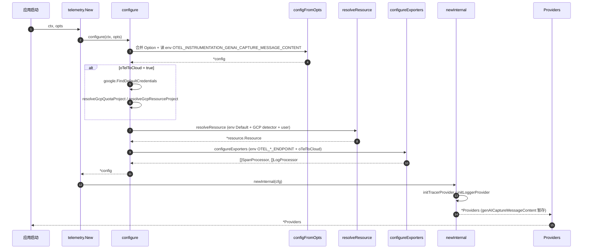
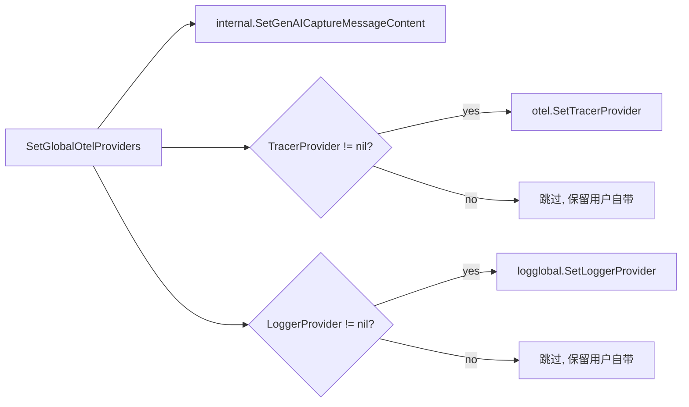
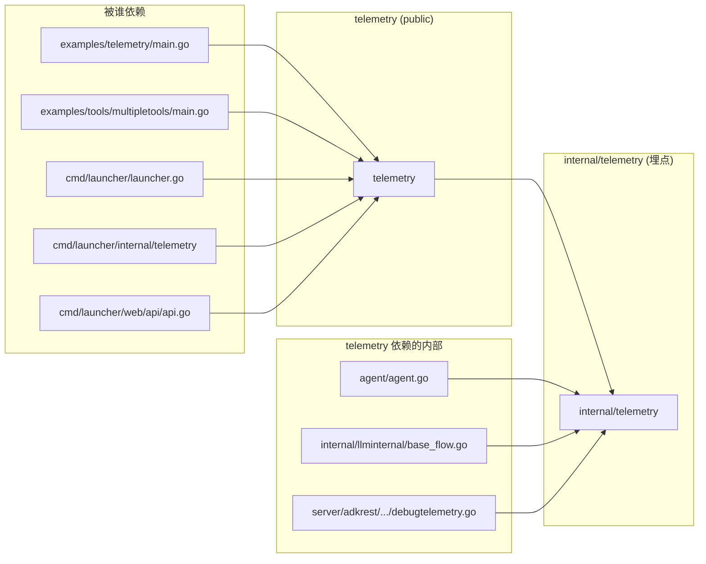

# telemetry 模块

## 1. 定位与边界

`telemetry` 是 ADK 对 OpenTelemetry (OTel) 的一站式**装配入口**：负责把 trace 与 log 两种 OTel SDK 装配好（可选挂上 GCP Cloud Trace 导出器），并把 Provider 注入 OTel 全局注册表，让所有 ADK 内部 instrumentation 拿到正确的 `Tracer` / `Logger`。

模块由两个**同名不同物**的包协作完成，二者必须明确区分：

| 包路径 | 角色 | 典型 API |
| --- | --- | --- |
| `google.golang.org/adk/telemetry` | 公开包，**装配**：创建/配置/销毁 OTel Provider | `New`（[`telemetry/telemetry.go:118`](../../../../telemetry/telemetry.go)）、`Providers.SetGlobalOtelProviders`（[`telemetry/telemetry.go:56`](../../../../telemetry/telemetry.go)）、`Providers.Shutdown`（[`telemetry/telemetry.go:40`](../../../../telemetry/telemetry.go)） |
| `google.golang.org/adk/internal/telemetry` | 内部包，**埋点**：在 Agent / Model / Tool 路径上产生 span 与日志事件 | `StartInvokeAgentSpan`、`StartGenerateContentSpan`、`StartExecuteToolSpan`、`LogRequest`、`LogResponse`，头部明确写着 attributes 尚未稳定 |

公开包是"出口"，内部包是"入口"；二者串联形成"装配 → 注入全局 → ADK 内部埋点"闭环。

> 注意：`internal/telemetry` 受 Go `internal/` 路径机制保护，外部无法 import；本模块文档**只深入公开包**，内部包仅作指针性指引。

## 2. 核心接口与类型

公开包对外暴露的 API 非常克制，只有 1 个 struct + 1 个 functional-option 接口 + 3 个核心方法：

| 名称 | 定义位置 | 签名 / 形态 | 角色 |
| --- | --- | --- | --- |
| `Providers` | [`telemetry/telemetry.go:31`](../../../../telemetry/telemetry.go) | `struct { TracerProvider, LoggerProvider, genAICaptureMessageContent }` | 包装 OTel SDK 实例，提供 `Shutdown` 与 `SetGlobalOtelProviders` 生命周期入口 |
| `Option` | [`telemetry/config.go:61`](../../../../telemetry/config.go) | `interface { apply(*config) error }` | functional options 模式，配置项；每个 `WithXxx` 返回实现该接口的 `optionFunc`（[`telemetry/config.go:65`](../../../../telemetry/config.go)） |
| `New` | [`telemetry/telemetry.go:118`](../../../../telemetry/telemetry.go) | `func New(ctx context.Context, opts ...Option) (*Providers, error)` | 包级入口，合并 Option → `configure`（[`telemetry/setup_otel.go:34`](../../../../telemetry/setup_otel.go)）→ `newInternal`（[`telemetry/setup_otel.go:87`](../../../../telemetry/setup_otel.go)） |
| `SetGlobalOtelProviders` | [`telemetry/telemetry.go:56`](../../../../telemetry/telemetry.go) | `func (t *Providers) SetGlobalOtelProviders()` | 把 Provider 写入 OTel 全局，并通过 `internal.SetGenAICaptureMessageContent` 同步"是否记录 LLM 消息原文"开关 |
| `Shutdown` | [`telemetry/telemetry.go:40`](../../../../telemetry/telemetry.go) | `func (t *Providers) Shutdown(ctx context.Context) error` | 顺序关闭 TracerProvider / LoggerProvider，错误用 `errors.Join` 合并 |

> 设计意图：把 OTel 复杂的"Exporter / Processor / Resource / Provider"分层结构收口到一个 `Providers` struct，对外只暴露"装配 / 注册 / 关闭"三件套，配置通过 functional options 注入。

最小用法（取自 godoc 示例 [`telemetry/telemetry.go:73-115`](../../../../telemetry/telemetry.go)）：

```go
ctx := context.Background()
res, _ := resource.New(ctx, resource.WithAttributes(
    semconv.ServiceNameKey.String("my-service"),
))
tp, err := telemetry.New(ctx,
    telemetry.WithOtelToCloud(true),
    telemetry.WithResource(res),
)
if err != nil { log.Fatal(err) }
defer func() {
    shutdownCtx, cancel := context.WithTimeout(context.Background(), 10*time.Second)
    defer cancel()
    tp.Shutdown(shutdownCtx)
}()
tp.SetGlobalOtelProviders()
```

## 3. 关键数据结构

| 类型 / 字段 | 位置 | 含义 |
| --- | --- | --- |
| `Providers.TracerProvider` | [`telemetry/telemetry.go:34`](../../../../telemetry/telemetry.go) | `*sdktrace.TracerProvider`，可被 OTel 全局 API 消费；为 nil 时 `SetGlobalOtelProviders` 不会覆盖，避免污染用户自带的 Provider |
| `Providers.LoggerProvider` | [`telemetry/telemetry.go:36`](../../../../telemetry/telemetry.go) | `*sdklog.LoggerProvider`，同上 |
| `Providers.genAICaptureMessageContent` | [`telemetry/telemetry.go:32`](../../../../telemetry/telemetry.go) | 私有 bool，标记是否记录 LLM 消息原文；通过 `SetGlobalOtelProviders` 同步到 `internal/telemetry` 的 `atomic.Bool`（[`internal/telemetry/logger.go:33`](../../../../internal/telemetry/logger.go)） |
| `config.oTelToCloud` | [`telemetry/config.go:27`](../../../../telemetry/config.go) | 是否导出到 GCP（Cloud Trace） |
| `config.gcpResourceProject` / `gcpQuotaProject` | [`telemetry/config.go:35`](../../../../telemetry/config.go)、`:39` | GCP 资源属性 `gcp.project_id` 与 quota 项目（OTel 端点配额） |
| `config.spanProcessors` / `logProcessors` | [`telemetry/config.go:48`](../../../../telemetry/config.go)、`:51` | 用户追加的 OTel Processor 列表 |
| `config.tracerProvider` / `loggerProvider` | [`telemetry/config.go:54`](../../../../telemetry/config.go)、`:57` | 整体替换的 Provider；在 `initTracerProvider`（[`telemetry/setup_otel.go:211`](../../../../telemetry/setup_otel.go)）/ `initLoggerProvider`（[`telemetry/setup_otel.go:229`](../../../../telemetry/setup_otel.go)）里短路返回，**此时 processor 列表被忽略** |
| `config.resource` | [`telemetry/config.go:45`](../../../../telemetry/config.go) | 用户提供的 OTel Resource；`resolveResource`（[`telemetry/setup_otel.go:140`](../../../../telemetry/setup_otel.go)）把它与 `resource.Default()` + GCP detector 合并，用户值最后覆盖 |

## 4. 关键流程

### 4.1 装配入口：`New`



看图指引：图中关键 hop 是 **(2)→(3) 读 env** 与 **(6)→(7) 三层 Resource 合并**——前者决定 LLM 消息是否脱敏，后者保证 `OTEL_SERVICE_NAME` / `gcp.project_id` / 用户自定义属性按"后写覆盖"的顺序生效。`newInternal` 末尾保留 `genAICaptureMessageContent` 在 struct 上，等 `SetGlobalOtelProviders` 时才同步给埋点层。

### 4.2 全局注册：`SetGlobalOtelProviders`



看图指引：此方法是"装配 → 埋点"的**唯一同步点**。若只构造 `Providers` 而忘记调用此方法，`internal/telemetry` 的 `tracer` / `otelLogger`（在 `init` 时通过 `otel.GetTracerProvider()` 抓取，见 [`internal/telemetry/telemetry.go:54`](../../../../internal/telemetry/telemetry.go)）将拿到 OTel 默认 noop Provider，业务 span / log 全部消失。**启动顺序必须保证：先 `SetGlobalOtelProviders`，再触发任何业务代码**。

## 5. 扩展点

| 扩展类型 | 入口 | 行为 |
| --- | --- | --- |
| 自定义 SpanProcessor | `WithSpanProcessors(p ...sdktrace.SpanProcessor)` [`telemetry/config.go:112`](../../../../telemetry/config.go) | 追加到 OTel 默认列表，与 `BatchSpanProcessor`(OTLP) 并存 |
| 自定义 LogRecordProcessor | `WithLogRecordProcessors(p ...sdklog.Processor)` [`telemetry/config.go:120`](../../../../telemetry/config.go) | 同上，针对日志 |
| 整体替换 TracerProvider | `WithTracerProvider(tp *sdktrace.TracerProvider)` [`telemetry/config.go:128`](../../../../telemetry/config.go) | 短路返回；**传入的 `WithSpanProcessors` 全部被静默忽略**（[`telemetry/setup_otel.go:213`](../../../../telemetry/setup_otel.go)） |
| 整体替换 LoggerProvider | `WithLoggerProvider(lp *sdklog.LoggerProvider)` [`telemetry/config.go:136`](../../../../telemetry/config.go) | 同上 |
| 注入自定义 OTel Resource | `WithResource(r *resource.Resource)` [`telemetry/config.go:96`](../../../../telemetry/config.go) | 与 `resource.Default()` / GCP detector 合并，用户值最后覆盖 |
| 凭证覆盖 | `WithGoogleCredentials(c *google.Credentials)` [`telemetry/config.go:104`](../../../../telemetry/config.go) | 跳过 `google.FindDefaultCredentials`；测试场景常用 |
| 是否记录消息原文 | `WithGenAICaptureMessageContent(capture bool)` [`telemetry/config.go:144`](../../../../telemetry/config.go) | 通过 `SetGlobalOtelProviders` 写入 `atomic.Bool`；关闭时 `LogRequest` / `LogResponse` 返回 `<elided>`（[`internal/telemetry/logger.go:45`](../../../../internal/telemetry/logger.go)） |
| 是否导出到 GCP | `WithOtelToCloud(value bool)` [`telemetry/config.go:72`](../../../../telemetry/config.go) | 同时影响 ADC 加载、项目解析、GCP detector、Cloud Trace exporter |

> 警示：若同时传入 `WithTracerProvider(tp)` 与 `WithSpanProcessors(...)`，后者**静默失效**（见 [`telemetry/setup_otel.go:213`](../../../../telemetry/setup_otel.go)）。需要"自定义 Provider + 自定义 Processor"时，请直接在外层 `*sdktrace.TracerProvider` 构造时把 Processor 加进 `sdktrace.WithSpanProcessor(...)`，不要两条路径混用。
>
> 尚未实现：`MeterProvider` 入口在 [`telemetry/setup_otel.go:91`](../../../../telemetry/setup_otel.go) 处标记为待办（对应 issue #479），当前 metrics 不可用。

通用扩展机制（Plugin / 自定义 Agent / Tool / Model）参见 [02-extension-points.md](../02-extension-points.md)；telemetry 模块的扩展方式是"通过 Option 注入 OTel 标准组件"，不涉及 ADK 自身抽象。

## 6. 错误处理与并发

**错误处理**：本模块无自定义 error 类型，全部 `fmt.Errorf("...: %w", err)` 包装。错误源按顺序为：(1) `configFromOpts` option 失败 [`telemetry/setup_otel.go:81`](../../../../telemetry/setup_otel.go) → (2) `oTelToCloud=true` 时 ADC 拉取失败 [`telemetry/setup_otel.go:45`](../../../../telemetry/setup_otel.go) → (3) quota / resource project 解析失败 [`telemetry/setup_otel.go:50`](../../../../telemetry/setup_otel.go)、`:55`，错误提示 "telemetry.googleapis.com requires setting the X project" → (4) `resolveResource` 中 `resource.New` / `resource.Merge` 失败 [`telemetry/setup_otel.go:155`](../../../../telemetry/setup_otel.go)、`:160`、`:165` → (5) `configureExporters` 中 OTLP HTTP / GCP exporter 创建失败 [`telemetry/setup_otel.go:183`](../../../../telemetry/setup_otel.go)、`:192`、`:201`。`Providers.Shutdown` 不 panic，多个错误 `errors.Join` 累积（[`telemetry/telemetry.go:44`](../../../../telemetry/telemetry.go)、`:49`）。OTLP endpoint 不可达时 exporter 创建不会立即失败，真正失败发生在批处理 flush 阶段。

**并发**：本模块装配阶段**无 goroutine、无锁**，假设用户遵循"启动时配置、运行时只读"模式。唯一并发敏感点：`internal/telemetry/logger.go:33` 用 `atomic.Bool` 维护 `genAICaptureMessageContent`，`LogRequest` / `LogResponse` 中并发读取，写只在 `SetGlobalOtelProviders` 期间发生；`SetGlobalOtelProviders` 之后才能安全触发业务路径，**但允许读侧在写之前先以 `false` 默认值运行**。性能瓶颈不在装配阶段，而在 `LogRequest` 每次都 JSON 序列化 LLM 请求（[`internal/telemetry/logger.go:180`](../../../../internal/telemetry/logger.go)）；`genAICaptureMessageContent=false` 时直接返回 `<elided>` 字符串、跳过序列化（[`internal/telemetry/logger.go:150`](../../../../internal/telemetry/logger.go)）。

## 7. 依赖与被依赖



看图指引：公开 `telemetry` 是"出口"，被 `cmd/launcher/*` 与 `examples/*` 入口消费；`internal/telemetry` 是埋点"入口"，被 `agent` / `internal/llminternal` / `server/adkrest` 三处使用——前者负责"装配与注入全局"，后者负责"在业务路径上打点"，二者通过 `SetGlobalOtelProviders` 单点同步。

外部 OTel 依赖（按字母序）：`go.opentelemetry.io/otel`、其 `log/global`、`sdk/log`、`sdk/trace`、`attribute`、`exporters/otlp/otlplog/otlploghttp`、`exporters/otlp/otlptrace/otlptracehttp`、`sdk/resource`；GCP 资源探测 `go.opentelemetry.io/contrib/detectors/gcp`；Google 凭据 `golang.org/x/oauth2{,/google}`。详见 [`telemetry/telemetry.go:18-28`](../../../../telemetry/telemetry.go)、[`telemetry/config.go:18-23`](../../../../telemetry/config.go)、[`telemetry/setup_otel.go:17-32`](../../../../telemetry/setup_otel.go)。

## 8. 测试与可观察性

- **测试文件**：[`telemetry/telemetry_test.go`](../../../../telemetry/telemetry_test.go)（555 行）。核心用例：
  - `TestTelemetrySmoke`（`:37`）端到端冒烟，用 `tracetest.NewInMemoryExporter` + 自定义 `inMemoryLogExporter`（`:435`）验证 span 与日志带正确的 `gcp.project_id` / `service.name` / `service.version`。
  - `TestTelemetryCustomProvider`（`:128`）验证 `WithTracerProvider` 整体替换，传入的 `WithSpanProcessors` 必须产生 0 调用。
  - `TestTelemetryCustomLoggerProvider`（`:176`）同上。
  - `TestResolveResourceProject`（`:239`）table-driven 覆盖 options > credentials > env > 错误 的解析顺序。
  - `TestResolveQuotaProject`（`:333`）覆盖 "otelToCloud disabled 时不强求" 的语义。
  - `TestConfigureExporters`（`:453`）覆盖 6 种环境变量 + `oTelToCloud` 组合。
- **内部包测试**：[`internal/telemetry/telemetry_test.go`](../../../../internal/telemetry/telemetry_test.go)（399 行）、[`internal/telemetry/logger_test.go`](../../../../internal/telemetry/logger_test.go)（639 行）、[`internal/telemetry/converters_test.go`](../../../../internal/telemetry/converters_test.go)（103 行）。
- **集成示例**：[`examples/telemetry/main.go`](../../../../examples/telemetry/main.go) 是可运行的演示。
- **本模块可观察的环境变量**（装配阶段读取）：`OTEL_INSTRUMENTATION_GENAI_CAPTURE_MESSAGE_CONTENT`（消息原文开关 [`telemetry/setup_otel.go:76`](../../../../telemetry/setup_otel.go)）、`OTEL_EXPORTER_OTLP_ENDPOINT` / `OTEL_EXPORTER_OTLP_TRACES_ENDPOINT` / `OTEL_EXPORTER_OTLP_LOGS_ENDPOINT`（OTLP 导出目标 [`telemetry/setup_otel.go:177`](../../../../telemetry/setup_otel.go)、`:179`、`:197`）、`GOOGLE_CLOUD_PROJECT`（GCP 项目兜底 [`telemetry/setup_otel.go:128`](../../../../telemetry/setup_otel.go)）、`OTEL_SERVICE_NAME` / `OTEL_RESOURCE_ATTRIBUTES`（[`telemetry/setup_otel.go:141`](../../../../telemetry/setup_otel.go)）。

## 9. 延伸阅读

- 端到端 LLM 调用与 span / log 注入的完整时序：[01-core-flows.md F1 单轮对话](../01-core-flows.md#f1-单轮对话)、[01-core-flows.md F2 工具调用](../01-core-flows.md#f2-工具调用)
- Agent 侧如何消费 `internal/telemetry` 的埋点：[03-modules/01-agent.md](./01-agent.md)
- Runner 如何在调用链路上触发 span：[03-modules/04-runner.md](./04-runner.md)
- 自定义 Provider / Processor / Resource 的扩展机制：[02-extension-points.md §1 总览：可扩展面](../02-extension-points.md#1-总览可扩展面)
- `internal/telemetry` 内部埋点的"指针性"说明：[02-extension-points.md §9 扩展的"边界"与禁忌](../02-extension-points.md#9-扩展的边界与禁忌)
- 顶层对 OTel 的依赖位置鸟瞰：[00-overview.md §8 错误处理与可观测性总览](../00-overview.md#8-错误处理与可观测性总览)
- 术语表（含 OTel / Tracer / Resource / Span / BatchProcessor 等）：[04-appendix.md A.1 术语表](../04-appendix.md#a1-术语表)
