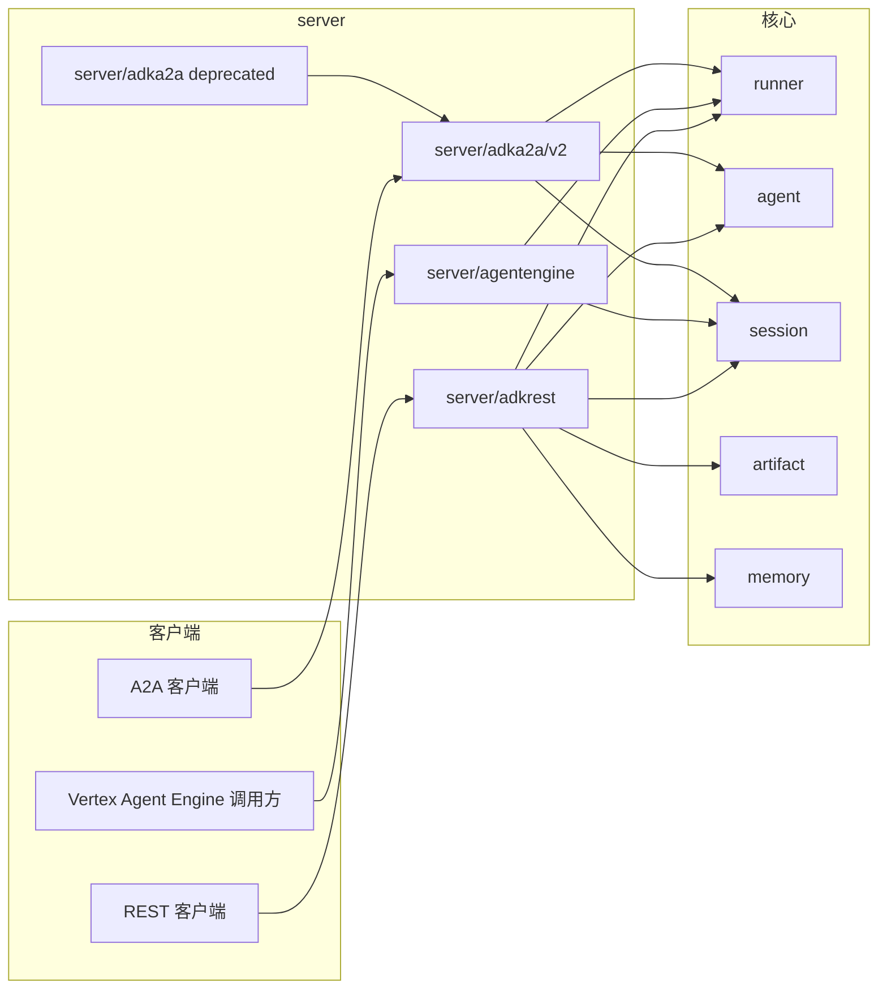
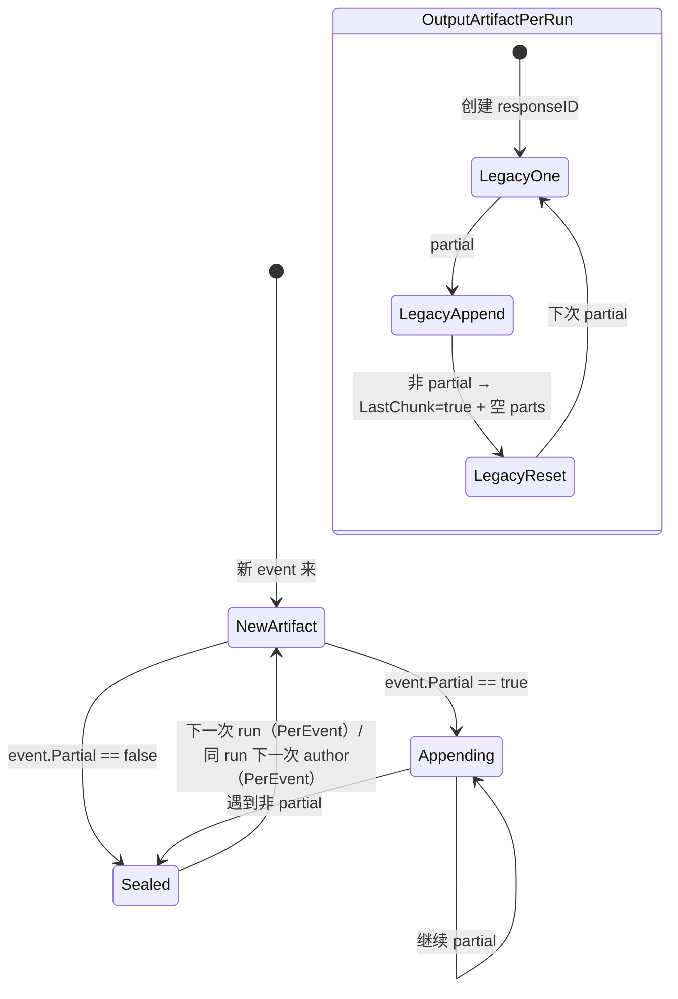
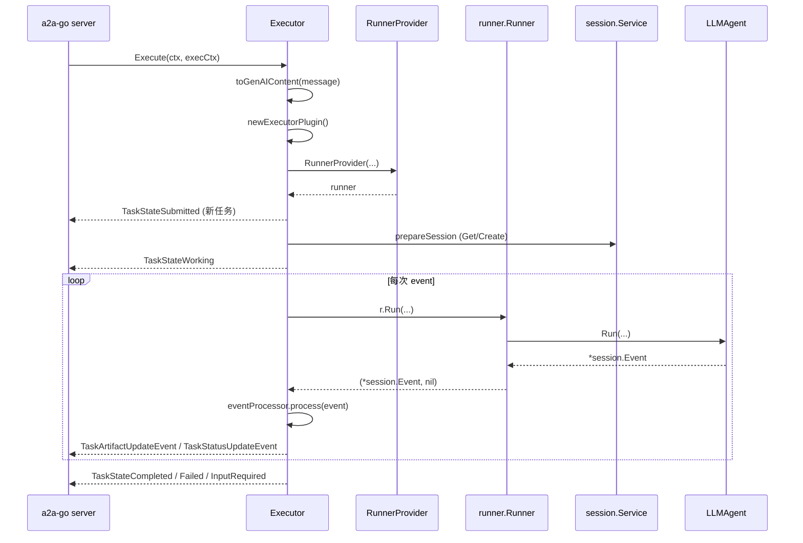
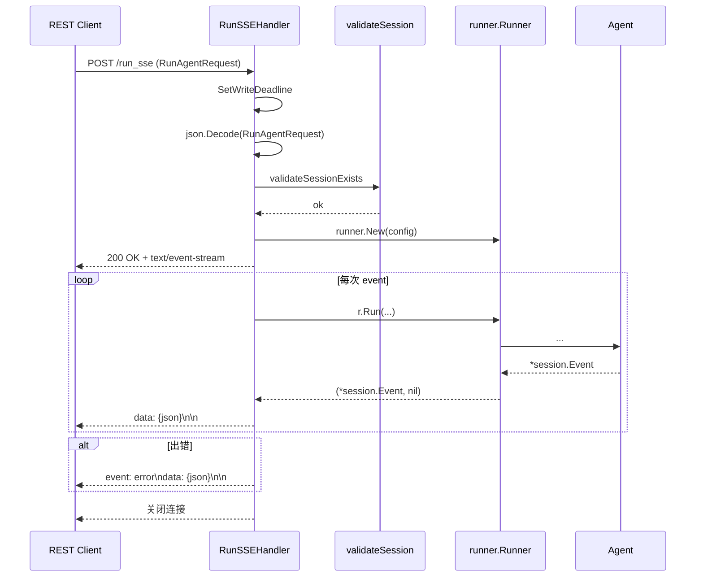
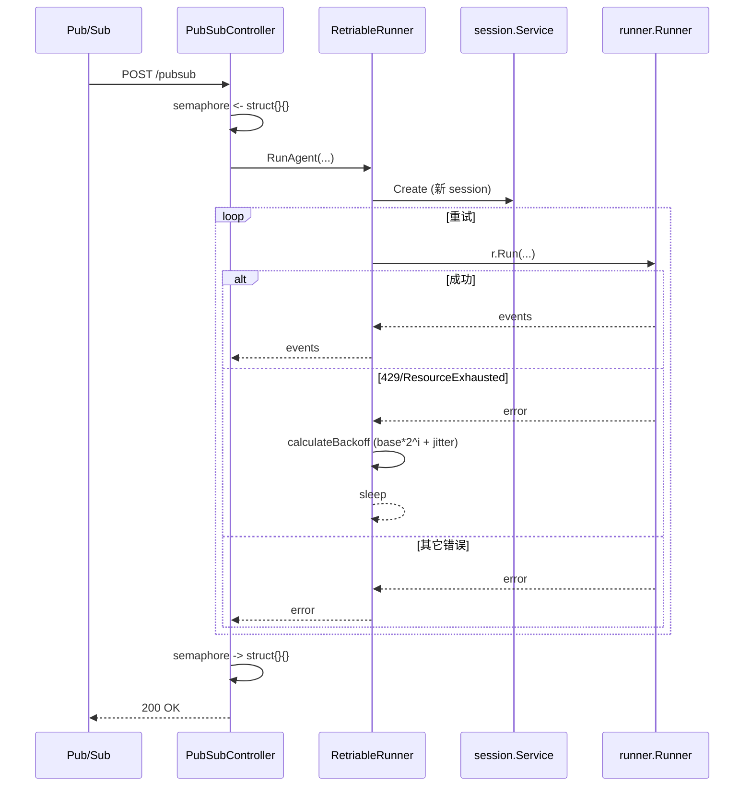

# server 模块

> 模块路径：`server/`
> 锁定 commit：`d06992e2b1ec2c9b95c6070e0fd12d50a43e4c99`
> 文档版本：v1（基于阅读笔记 `docs/architecture/.notes/server.md`）

## 1. 定位与边界

`server` 包为 ADK 智能体提供三类对外协议服务：A2A 协议适配（`adka2a`，让 ADK agent 接入 A2A 协议生态）、REST/HTTP 通用接口（`adkrest`，包含 sessions / runtime / artifacts / apps / debug / triggers 等资源子集）、以及 Vertex AI Agent Engine 部署形态的 RPC 网关（`agentengine`，把 a2a 风格的 `class_method` 方法路由为 Vertex AI 推理引擎协议）。包级 `doc.go` 明确写明"Package server hosts protocol implementations to expose and serve ADK agents"。

子包分工：

| 子包 | 作用 | 状态 |
|---|---|---|
| `server/adka2a/` | 旧版 A2A executor 兼容层，所有函数通过 `a2av0` 在 v1↔v2 a2a-go 数据类型之间做转换，内部委托给 `v2` | **Deprecated**（`server/adka2a/executor.go:17`） |
| `server/adka2a/v2/` | 当前主版本 A2A 适配器。实现 `a2asrv.AgentExecutor`，把 `a2a.Message` 转 `*genai.Content`、把 `*session.Event` 转 `a2a.TaskArtifactUpdateEvent` / `a2a.TaskStatusUpdateEvent`。还提供 parts / agent card / events / metadata / input-required / artifact / executor-plugin 等子文件 | 当前主版本 |
| `server/adkrest/` | 基于 `gorilla/mux` 的 HTTP REST 服务。入口 `NewServer(ServerConfig)` 拼装六大子路由（sessions / runtime / apps / debug / artifacts / eval），公开 `ServeHTTP`、`SpanProcessor`、`LogProcessor` | 公共契约（experimental） |
| `server/adkrest/controllers/` | 各资源 HTTP handler，包含 `runtime.go`（Run/RunSSE/RunLive）、`sessions.go`、`apps.go`、`artifacts.go`、`debug.go`、`errors.go`、`handlers.go`，以及 `triggers/` 子包处理 Pub/Sub 与 Eventarc 触发器 | 公开包（`handlers.go:23` 注释 `TODO: Move to an internal package`） |
| `server/adkrest/internal/` | REST 内部实现。`routers/` 定义 route 列表（`Route` + `Router` 接口）；`models/` 是 REST DTO（`Session`、`Event`、`RunAgentRequest` 等）；`services/` 提供 `DebugTelemetry`（OpenTelemetry 内存导出 + LRU trace 缓存）和 `agentgraphgenerator`（基于 gographviz 渲染 agent 调用图） | 内部实现 |
| `server/agentengine/` | Vertex AI Agent Engine 形态的 `http.Handler` 工厂。`NewHandler` 用一份 `*launcher.Config` 构建非流式 / 流式两套 controller，挂在 `/reasoning_engine` 和 `/stream_reasoning_engine` 路径上 | 公共契约 |
| `server/agentengine/controllers/method/` | 每个 a2a 风格的 "class method"（`async_create_session` / `async_get_session` / `async_list_sessions` / `async_delete_session` / `async_stream_query`）对应一个 `MethodHandler` 实现，统一通过 `Name()` + `Handle()` + `Metadata()` 暴露 | 公共契约 |
| `server/agentengine/internal/` | routers、snake_case 编码 helper（`convertSnake` + `EmitJSON`）和入参 / 出参 model | 内部实现 |

在整体架构中的位置：



> 看图指引：三个 server 子包分别对应"通用 HTTP 协议"、"标准化 A2A 协议"、"Vertex AI 部署协议"。它们都把外部协议事件转换成统一的 `runner.Runner.Run` 调用，最终都依赖 `agent` / `session` / `runner` 这些核心抽象。`adka2a`（v1 兼容层）是唯一一条只做协议转换、不直接调 runner 的路径——它全部委托给 `adka2a/v2`。

公共契约 vs 内部实现：

- **公共契约**（用户应依赖）：`adkrest.NewServer` + `ServerConfig`（`server/adkrest/handler.go:63`）、`Server.SpanProcessor` / `Server.LogProcessor`、`adka2a/v2.NewExecutor` + `ExecutorConfig`（`server/adka2a/v2/executor.go:95`）、`adka2a/v2.BuildAgentSkills`（`server/adka2a/v2/agent_card.go:33`）、`agentengine.NewHandler`（`server/agentengine/handler.go:39`）、`MethodHandler` 接口（`server/agentengine/controllers/method/method.go:27`）。
- **内部实现**：`server/adkrest/internal/*`（routers、models、services、fakes）、`server/agentengine/internal/*`（routers、models、helper）、`server/adka2a`（根目录 deprecated 兼容壳）、`server/adkrest/controllers/`（目前仍在公开路径，未来计划移入 internal）。

## 2. 核心接口与类型

### 2.1 `adka2a/v2.Executor` —— A2A executor 主入口

```go
// server/adka2a/v2/executor.go:149
type Executor struct {
    config ExecutorConfig
}

// NewExecutor creates an initialized [Executor] instance.
func NewExecutor(config ExecutorConfig) *Executor {
    if config.RunnerProvider == nil {
        config.RunnerProvider = newDefaultRunnerProvider(config.RunnerConfig)
    }
    return &Executor{config: config}
}

func (e *Executor) Execute(ctx context.Context, execCtx *a2asrv.ExecutorContext) iter.Seq2[a2a.Event, error]
func (e *Executor) Cancel(ctx context.Context, execCtx *a2asrv.ExecutorContext) error
func (e *Executor) Cleanup(ctx context.Context, execCtx *a2asrv.ExecutorContext) error
```

`Executor` 是 `a2a-go` 协议要求实现的 `AgentExecutor` 接口的核心实现。它把 ADK 的 `runner.Runner.Run` 迭代器适配成 a2a-go 要求的 `iter.Seq2[a2a.Event, error]`。`Execute` 内部用 `executorPlugin` 在 `BeforeRunCallback` 中捕获 session 句柄，让回调代码可通过 `ExecutorContext` 拿到 `Events()` / `ReadonlyState()`。`Cleanup` 用于 A2A `input-required` 子任务被取消时递归通知子 agent。

### 2.2 `adka2a/v2.ExecutorConfig` —— 一次性配置

```go
// server/adka2a/v2/executor.go:95
type ExecutorConfig struct {
    RunnerConfig    runner.Config
    RunnerProvider  RunnerProvider
    RunConfig       agent.RunConfig
    BeforeExecuteCallback BeforeExecuteCallback
    AfterEventCallback    AfterEventCallback
    AfterExecuteCallback  AfterExecuteCallback
    A2APartConverter      func(a2a.Part) (*genai.Content, bool)
    GenAIPartConverter    func(*genai.Content) ([]a2a.Part, bool)
    OutputMode            OutputMode
    A2AExecutionCleanupCallback func(context.Context, *a2asrv.ExecutorContext, []a2a.AgentCard, error)
}
```

它把 A2A executor 的所有可调参数聚成一个 struct：runner 工厂、4 个生命周期回调、2 个 part 序列化器、artifact 输出模式、清理回调。`OutputMode` 是 `OutputArtifactPerRun`（默认，每个 run 一个 artifact）与 `OutputArtifactPerEvent`（每个非 partial event 一个 artifact，partial 增量 append）二选一（`server/adka2a/v2/executor.go:60`）。

### 2.3 `adkrest.Server` —— REST 服务主体

```go
// server/adkrest/handler.go:78
type Server struct {
    router         *mux.Router
    telemetryStore *services.DebugTelemetry
}

type ServerConfig struct {
    SessionService  session.Service
    MemoryService   memory.Service
    AgentLoader     agent.Loader
    ArtifactService artifact.Service
    SSEWriteTimeout time.Duration
    PluginConfig    runner.PluginConfig
    DebugConfig     DebugTelemetryConfig
}

type DebugTelemetryConfig struct {
    TraceCapacity int
}

func NewServer(cfg ServerConfig) (*Server, error)
func (s *Server) ServeHTTP(w http.ResponseWriter, r *http.Request)
func (s *Server) SpanProcessor() trace.SpanProcessor
func (s *Server) LogProcessor() log.LogProcessor
```

`Server` 把 `mux.Router` 与 `DebugTelemetry` 聚合起来，构造时初始化 debug telemetry、5 个业务子路由 + 1 个 eval 占位子路由。`ServerConfig` 一次性注入所有底层 service，避免后续运行时再传；`DebugConfig.TraceCapacity` 控制 LRU 默认 10_000 条上限（`server/adkrest/internal/services/debugtelemetry.go:37`）。

### 2.4 `agentengine` 的 `MethodHandler` —— RPC 协议扩展点

```go
// server/agentengine/controllers/method/method.go:27
type MethodHandler interface {
    Name() string
    Handle(ctx context.Context, rw http.ResponseWriter, payload []byte) error
    Metadata() (*structpb.Struct, error)
}
```

`MethodHandler` 是 Agent Engine 部署协议的扩展面：每个 a2a 风格的 "class method" 都实现这三个方法。`Name()` 是 RPC endpoint 名（同时是 map key），`Handle` 拿到原始 `payload` 自行 unmarshal + 写回，`Metadata()` 给 Vertex AI 部署时声明 capability 用。`AgentEngineAPIController` 构造时强制 `Name()` 唯一（`server/agentengine/controllers/agent_engine.go:32`），重复即返回错误。

### 2.5 `triggers.RetriableRunner` —— 触发器重试包装

```go
// server/adkrest/controllers/triggers/triggers.go:38
type RetriableRunner struct {
    sessionService  session.Service
    agentLoader     agent.Loader
    memoryService   memory.Service
    artifactService artifact.Service
    pluginConfig    runner.PluginConfig
    triggerConfig   TriggerConfig
}

func (r *RetriableRunner) RunAgent(ctx context.Context, appName, userID, messageContent string) ([]*session.Event, error)
```

`RetriableRunner` 把"创建 session → 调 runner"封装为一个有重试的复合操作。它被 `PubSubController` 与 `EventarcController` 共享，且其 `NewPubSubController` / `NewEventarcController` 都内嵌一个 `chan struct{}` 信号量做并发限流（容量 = `TriggerConfig.MaxConcurrentRuns`）。**注意**：该 runner 本身在每次重试时都创建一个新 session（"each retry = new session"，`triggers.go:47`），重试不重用 session 状态。

## 3. 关键数据结构

| 类型 | 路径 | 关键字段 | 用途 |
|---|---|---|---|
| `Executor` | `server/adka2a/v2/executor.go:149` | `config ExecutorConfig` | A2A executor 主对象，无运行时状态 |
| `ExecutorConfig` | `server/adka2a/v2/executor.go:95` | `RunnerConfig` / `RunnerProvider` / 4 回调 / 2 part 转换器 / `OutputMode` | A2A 全量配置 |
| `OutputMode` | `server/adka2a/v2/executor.go:60` | `OutputArtifactPerRun` / `OutputArtifactPerEvent` | 控制 artifact 切分粒度 |
| `invocationMeta` | `server/adka2a/v2/metadata.go:53` | `userID` / `sessionID` / `agentName` / `reqCtx` / `eventMeta`（`adk_*` 前缀键） | 一次执行期间共享的元数据 |
| `executorPlugin` | `server/adka2a/v2/executor_plugin.go:25` | `invocationSession` | 拦截 `BeforeRunCallback` 缓存 session 句柄 |
| `eventProcessor` | `server/adka2a/v2/processor.go:35` | `terminalActions` / `failedEvent` / `inputRequiredProcessor.event` | 把单个 `session.Event` 转为 a2a 事件 |
| `artifactMaker` | `server/adka2a/v2/task_artifact.go:26` | `lastAgentPartialArtifact map[string]a2a.ArtifactID` | `OutputArtifactPerEvent` 模式下的 artifact 维护 |
| `legacyArtifactMaker` | `server/adka2a/v2/task_artifact.go:70` | `responseID` / `partialResponseID` | `OutputArtifactPerRun` 模式；partial 用空 data part + `LastChunk=true` 复位 |
| `Server` | `server/adkrest/handler.go:78` | `router` / `telemetryStore` | REST 入口 |
| `ServerConfig` | `server/adkrest/handler.go:63` | 7 个 service + SSE 写超时 + LRU 容量 | REST 全量配置 |
| `RuntimeAPIController` | `server/adkrest/controllers/runtime.go:37` | `sseTimeout` / `sessionService` / `memoryService` / `artifactService` / `agentLoader` / `pluginConfig` / `autoCreateSession` | Run / RunSSE / RunLive 三入口共用 |
| `spanStore` | `server/adkrest/internal/services/debugtelemetry.go:128` | `mu sync.RWMutex` + 4 张索引（trace / span / session / event） + `*lru.Cache` | Debug 内存 trace 缓存 |
| `PubSubController` | `server/adkrest/controllers/triggers/pubsub.go:33` | `runner *RetriableRunner` / `semaphore chan struct{}` | Pub/Sub 触发器控制器 |
| `EventarcController` | `server/adkrest/controllers/triggers/eventarc.go:34` | `runner *RetriableRunner` / `semaphore chan struct{}` | Eventarc 触发器控制器 |
| `TriggerConfig` | `server/adkrest/controllers/triggers/config.go:20` | `MaxConcurrentRuns` / `MaxRetries` / `BaseDelay` | 触发器并发与重试参数 |
| `AgentEngineAPIController` | `server/agentengine/controllers/agent_engine.go:32` | `handlers map[string]method.MethodHandler` / `service session.Service` / `maxPayloadSize` / `sseTimeout` | Agent Engine RPC 网关 |
| `MethodHandler` | `server/agentengine/controllers/method/method.go:27` | 三方法接口 | 扩展点 |
| `Query` / `StreamQueryRequest` / `CreateSessionRequest` | `server/agentengine/internal/models/*.go` | `ClassMethod` / `Input` / `Output` | DTO 形态对齐 Vertex AI `aiplatform` 推理引擎 |
| `EmitJSON` | `server/agentengine/internal/helper/emit_json.go:47` | `ConvertSnake` + `json.Encoder` + `flush` | snake_case 输出 + flush |

artifact 输出状态机（按 `OutputMode` 分两路）：



> 看图指引：`OutputArtifactPerEvent`（默认）下，artifact 切分以"非 partial event"为边界，每个 author 独立维护一个 `lastAgentPartialArtifact` 表。`OutputArtifactPerRun`（legacy）下，同一 run 只对应一个 artifact，partial 事件以 `metadataPartialKey: true` 标记，结束时用"空 data part + `LastChunk=true`"复位 artifact 状态——这是给已存在的 A2A 客户端做向后兼容用的，新接入推荐用 `OutputArtifactPerEvent`。

## 4. 关键流程

### 4.1 A2A `Execute` 主循环

入口在 `server/adka2a/v2/executor.go:161`。流程：

1. 校验 `execCtx.Message != nil`，否则直接 `(nil, err)`。
2. `toGenAIContent` 把 `a2a.Message` 转 `*genai.Content`。
3. `newExecutorPlugin` 注册 `BeforeRunCallback`，把 `agent.InvocationContext.Session()` 缓存到 `invocationSession`。
4. 调 `RunnerProvider` 拿 runner；触发 `BeforeExecuteCallback`（如设置）。
5. `HandleInputRequired`（`server/adka2a/v2/input_required.go:152`）校验上一轮 input-required 的 function call 是否都有响应。
6. 若无 `StoredTask` 发出 `NewSubmittedTask`。
7. `prepareSession`（Get → 不存在则 Create）。
8. 发 `TaskStateWorking`，按 `OutputMode` 选 `artifactMaker` / `legacyArtifactMaker`。
9. 迭代 `r.Run(...)`，每个 event → `eventProcessor` → a2a 事件 yield。
10. 最终 `writeFinalTaskStatus` 发 completed / failed / input-required。



> 看图指引：每个 A2A Execute 是一份独立 goroutine，无共享可变状态。`executorPlugin.invocationSession` 的写入在 `BeforeRunCallback` 内完成（`executor_plugin.go:25`），从而让回调代码在后续可以拿到 session 句柄。终态事件由 `writeFinalTaskStatus` 统一收敛（`executor.go:373`），调用方看到迭代器返回首个 `(nil, err)` 即可终止。

### 4.2 REST Run + SSE 流程

入口在 `server/adkrest/controllers/runtime.go:99` 的 `RunSSEHandler`。流程：

1. `http.NewResponseController(rw).SetWriteDeadline(sseTimeout)` 设置写超时。
2. 解 `RunAgentRequest`（`server/adkrest/internal/models/runtime.go:23`）。
3. `validateSessionExists` 校验 session；不存在返回 404。
4. `getRunner` 调 `runner.New`（每次请求新建，未缓存）。
5. 写 SSE 头（`Content-Type: text/event-stream`）+ `Flush`。
6. 迭代 `r.Run` 输出 `data: <json>\n\n`。
7. 出错调 `flashErrorEvent`（`runtime.go:171`）以 `event: error` 写出（不关闭连接），让客户端能拿到错误信息。



> 看图指引：SSE 流中**不**走 `NewErrorHandler` 改 HTTP 状态（header 已发），改用 `flashErrorEvent` 发送 `event: error` 帧；这是 SSE 协议本身的限制。任何 SSE handler 实现都应记住"header 已发就只能写 data frame"。

### 4.3 Agent Engine method dispatch

入口在 `server/agentengine/handler.go:39` 的 `NewHandler`。`NewHandler` 把 `*launcher.Config` 注入两份 controllers（流式 + 非流式），分别挂 `/reasoning_engine` 和 `/stream_reasoning_engine`。请求体先 `io.LimitReader(req.Body, maxPayloadSize)` 限大小 → `json.Unmarshal` 到 `Query{ClassMethod, Input}` → `handleQuery` 查 `handlers[classMethod]` → `MethodHandler.Handle(ctx, rw, payload)`。

```mermaid
flowchart TD
    A[POST /reasoning_engine] --> B[io.LimitReader 限大小]
    B --> C[json.Unmarshal → Query]
    C --> D{handlers[ClassMethod]}
    D -- 命中 --> E[MethodHandler.Handle]
    D -- 未命中 --> F[404 / 错误]
    E --> G[json.Unmarshal payload]
    G --> H[调 session/service 等]
    H --> I[EmitJSON 写回]
    I --> J[Flush]

    K[POST /stream_reasoning_engine] --> L[SSE 头]
    L --> M[MethodHandler.Handle]
    M --> N[EmitJSONError 错误帧]
```

> 看图指引：流式路径下 SSE header 已发，错误必须走 `helper.EmitJSONError`（`server/agentengine/controllers/method/stream_query.go:96` 注释明确写："from this moment on we must not return error. Instead, it should be handled by using helper.EmitJSONError"）。`maxPayloadSize` 限的是请求体大小，与 SSE `sseTimeout`（写超时）配合形成完整限流。

### 4.4 Triggers (Pub/Sub / Eventarc) 重试

入口在 `server/adkrest/controllers/triggers/triggers.go:47` 的 `RetriableRunner.RunAgent`。流程：

1. 创建新 session（"each retry = new session"）。
2. 调 `runAgentWithRetry`（`triggers.go:87`）。
3. `isResourceExhausted` 嗅探 `429` 或 `ResourceExhausted` 字符串 → 触发指数退避。
4. `calculateBackoff` = `base * 2^i + 0~50% jitter`。
5. 超过 `MaxRetries` 返回错误让上游 Pub/Sub/Eventarc 重试。



> 看图指引：信号量（`chan struct{}`）与退避重试是正交的两层限流——信号量限并发运行数，退避限 LLM 后端的瞬时压力。Eventarc 控制器额外区分 structured (`application/cloudevents+json`) 与 binary (`ce-*` headers) 两种 CloudEvents 模式（`eventarc.go`）。

## 5. 扩展点

本节对 [02-extension-points.md §8 暴露为自定义 Server](../02-extension-points.md#8-暴露为自定义-server) 做模块层细化。

### 5.1 A2A 端扩展点

- **`RunnerProvider`**（`server/adka2a/v2/executor.go:81`）—— 替换默认 runner 创建逻辑。`newDefaultRunnerProvider`（`server/adka2a/v2/executor.go:430`）默认调用 `runner.New` 并把 `executorPlugin` 装到 `PluginConfig.Plugins` 上。用户实现自己的 provider 时**必须**保留 `executorPlugin` 注入，否则 `ExecutorContext` 内的 `Events()` / `ReadonlyState()` 拿不到 session。
- **4 个生命周期回调**（`server/adka2a/v2/executor.go:37-57`）—— `BeforeExecuteCallback` / `AfterEventCallback` / `AfterExecuteCallback` / `A2AExecutionCleanupCallback`。`BeforeExecuteCallback` 返回 error 即中止 Execute；`AfterEventCallback` 拿到 a2a 事件后可丰富 metadata 或返回 error 中止；`A2AExecutionCleanupCallback` 在 `Cleanup` 路径被调用，缺省时 `log.Warn`。
- **`A2APartConverter` / `GenAIPartConverter`**（`server/adka2a/v2/executor.go:49-54`）—— 自定义 part 序列化。返回 `(_, false)` 表示丢弃该 part。
- **`OutputMode`**（`server/adka2a/v2/executor.go:60-70`）—— 通过 `eventToArtifactTransform`（`server/adka2a/v2/task_artifact.go:38,88`）扩展 artifact 行为；如需新策略可实现 `eventToArtifactTransform` 接口。
- **`BuildAgentSkills`**（`server/adka2a/v2/agent_card.go:33`）—— agent card 的 skills 列表生成入口；doc 没说可注入，但通过实现新的 `iagent.Agent` / `llminternal.Agent` 可自动扩展。

### 5.2 REST 端扩展点

- **`ServerConfig`**（`server/adkrest/handler.go:63`）—— 注入所有 service；`DebugConfig.TraceCapacity` 调 LRU 容量。
- **`routers.Router`**（`server/adkrest/internal/routers/routers.go:36`）—— `Routes() Routes` 模式可注册新子路由；`EvalAPIRouter` 是占位实现（`eval.go:23`），所有路径都返回 501。
- **`controllers.NewErrorHandler`**（`server/adkrest/controllers/handlers.go:43`）—— 任何 `func(http.ResponseWriter, *http.Request) error` 都可被包成标准错误返回。
- **`triggers.PubSubController` / `EventarcController`**（`server/adkrest/controllers/triggers/pubsub.go:33` / `eventarc.go:34`）—— 通过构造函数注入并发上限和重试参数 `TriggerConfig`（`server/adkrest/controllers/triggers/config.go:20`）。
- **`DebugTelemetryConfig.TraceCapacity`**（`server/adkrest/handler.go:73`）—— 调整 debug trace 内存 LRU 容量（默认 10_000）。

### 5.3 Agent Engine 端扩展点

- **`MethodHandler`**（`server/agentengine/controllers/method/method.go:27`）—— 三方法接口；新建方法只需实现并加入 `listNonStreamHandlers` / `listStreamHandlers`（`server/agentengine/handler.go`）。
- **`AgentEngineAPIController` 强制 `Name()` 唯一**（`server/agentengine/controllers/agent_engine.go:32`）—— 命名就是 RPC endpoint 名。
- **`helper.ConvertSnake`**（`server/agentengine/internal/helper/encode.go:30`）—— 通过 `pathToName` hook 可定制字段名映射；基于 reflect + json tag 的 snake_case 转换。

## 6. 错误处理

### 6.1 A2A 端

- executor 内所有错误通过 yield `(nil, err)` 透传；失败语义被 `writeFinalTaskStatus` 收敛为 `TaskStateFailed` / `TaskStateInputRequired` 终态事件（`server/adka2a/v2/executor.go:373`）。调用方在迭代器里看到首个 `(nil, err)` 即终止。
- `errorFromResponse`（`server/adka2a/v2/processor.go:187`）把 `model.LLMResponse.ErrorCode/ErrorMessage` 包装为 error；`toTaskFailedUpdateEvent`（`processor.go:178`）把 error 注入 `Message.Parts` 并加 `metadataIsErrMessageKey=true` 标记。

### 6.2 REST 端

- `statusError`（`server/adkrest/controllers/errors.go:17`）—— 自定义 `error` 类型，带 `Code int` 字段。`NewErrorHandler` 探测该类型决定 HTTP status。
- 解码错误一律 `http.StatusBadRequest`；`sessionService.Get` / `runner.New` 失败 → `http.StatusInternalServerError`（或 `StatusNotFound` 当 Get 失败）。
- SSE 流中（`runtime.go:99`）不走 `NewErrorHandler`，直接 `http.Error` + `flashErrorEvent` + `log.Printf`；这是因为 header 已经发出不能再换 status。

### 6.3 Triggers 端

- `respondError` / `respondSuccess`（`server/adkrest/controllers/triggers/triggers.go:120-128`）统一以 `models.TriggerResponse{Status: ...}` 写回；PubSub 默认 userID `pubsub-caller`、Eventarc 默认 `eventarc-caller`。

### 6.4 Agent Engine 端

- `method.Handle` 内部 `json.Unmarshal` / `session.X` 失败都包成 `fmt.Errorf("... failed: %v", err)` 透传；在 `streamQueryHandler` 中 "from this moment on we must not return error. Instead, it should be handled by using helper.EmitJSONError"（`stream_query.go:96`）—— 即 SSE header 已发后只能 `EmitJSONError`，不能再用 HTTP status。

### 6.5 典型失败模式

- A2A 长 function call 未匹配响应 → `makeInputMissingErrorMessage` 报 `no input provided for function call ID %q`（`server/adka2a/v2/input_required.go:245`）。
- A2A subagent 取消失败 → `errors.Join(failures...)` 聚合并 `log.Warn`（`server/adka2a/v2/executor.go:266`）。
- REST `validateSessionExists` 失败 → 404（`server/adkrest/controllers/runtime.go:196`）。
- PubSub 重试用尽 → 把 `runErr` 返回给上游触发器（`server/adkrest/controllers/triggers/triggers.go:117`）。
- Debug API `EventSpanHandler` 找不到匹配 op 的 span → 404 `"event not found: %s"`（`server/adkrest/controllers/debug.go:69`）。

## 7. 并发与性能考量

### 7.1 并发模型

- A2A：每个 `Execute` 是独立 goroutine，`Executor` 字段只读 `config`，无共享可变状态。`executorPlugin.invocationSession` 写入是 per-execute 的（plugin 在 `NewExecutor` 创建，但被 `BeforeRunCallback` 写入）。`cancelChildInputRequiredTasks` 当前**仍是串行**（`server/adka2a/v2/executor.go:311` 有 `TODO(yarolegovich): run in parallel (how to limit?)`），高频场景需自限流。
- REST `RuntimeAPIController.RunLiveHandler`（`server/adkrest/controllers/runtime.go:247`）显式起 1 个 read goroutine 读 WebSocket，主 goroutine 写；任一关闭都 `liveSession.Close()`。
- `DebugTelemetry.spanStore`（`server/adkrest/internal/services/debugtelemetry.go:128`）：`sync.RWMutex` 保护 4 张表；`getSpansByEventID` 走 `RLock` + `slices.Clone` 防 race；`recordsByTraceID` 用 `hashicorp/golang-lru/v2` 容量限速，默认 10_000 traces。
- REST triggers：用 `chan struct{}` 信号量限制 `MaxConcurrentRuns`。

### 7.2 性能调优点

- `RuntimeAPIController` 每次请求都 `runner.New`（`server/adkrest/controllers/runtime.go:214`），高频场景下会重复注入 plugin / 解析 config，缺缓存。
- `convertSnake`（`server/agentengine/internal/helper/encode.go:42`）用 reflect 递归；流式接口下每个 event 都会走一遍。
- `StreamReasoningEngineAPIRouter` 路径：每个请求再 new runner（`server/agentengine/controllers/method/stream_query.go:194`），无连接级 runner 复用。

## 8. 依赖与被依赖

```mermaid
graph TB
    subgraph 上游 / 依赖
        runner[runner]
        agent[agent]
        session[session]
        artifact[artifact]
        memory[memory]
        model[model]
        plugin[plugin]
        telemetry[telemetry]
        a2aGo[a2a-go v1+v2]
        mux[gorilla/mux]
        ws[gorilla/websocket]
        gographviz[awalterschulze/gographviz]
        mapstructure[mitchellh/mapstructure]
        lru[hashicorp/golang-lru/v2]
        otel[go.opentelemetry.io/otel]
        genai[google.golang.org/genai]
        structpb[protobuf types/known/structpb]
    end

    subgraph server
        adka2a[v2 + 兼容层]
        adkrest[REST]
        agentengine[Agent Engine]
    end

    adka2a --> a2aGo
    adka2a --> runner
    adka2a --> agent
    adka2a --> session

    adkrest --> mux
    adkrest --> ws
    adkrest --> gographviz
    adkrest --> mapstructure
    adkrest --> lru
    adkrest --> otel
    adkrest --> runner
    adkrest --> agent
    adkrest --> session
    adkrest --> artifact
    adkrest --> memory
    adkrest --> plugin

    agentengine --> structpb
    agentengine --> runner
    agentengine --> session
    agentengine --> genai
```



被哪些模块导入：

- `cmd/launcher/web/api/api.go` 导入 `adkrest`（`NewServer`）。
- `cmd/launcher/web/a2a/a2a.go` 导入 `adka2a/v2`（`BuildAgentSkills` + `NewExecutor`）。
- `cmd/launcher/web/agentengine/agentengine.go` 导入 `agentengine`（`NewHandler`）。
- `cmd/launcher/web/triggers/eventarc/eventarc.go` 导入 `adkrest/controllers/triggers`。
- `cmd/adkgo/internal/deploy/agentengine/agentengine.go` 导入 `agentengine`（`ListClassMethods`）。
- `agent/remoteagent/a2a_agent.go` 与 `agent/remoteagent/v2/a2a_agent.go` 用 `ToSessionEventWithParts` / `EventToMessage`（`adka2a` / `adka2a/v2`）做 client 侧事件互转。
- `examples/{rest,a2a,bidi,bidi/streamingtool,bidi/sequential}` 直接示例调用。

> 注意：`adkrest/controllers` 和 `adkrest/internal/*` 当前是公开包（`controllers/handlers.go:23` 注释 "TODO: Move to an internal package"），未来可能改路径；引用时尽量走 `adkrest` 顶层入口。

## 9. 测试与可观察性

### 9.1 测试文件位置

- A2A v2 单测：`server/adka2a/v2/{parts_test.go,events_test.go,executor_test.go,metadata_test.go,processor_test.go,agent_card_test.go}` —— 全量覆盖 parts、事件、metadata、agent card 等纯函数。
- REST 集成测试：`server/adkrest/controllers/{sessions_test.go,runtime_test.go,debug_test.go}`，使用 `testsessionservice` fake。
- 触发器测试：`server/adkrest/controllers/triggers/{pubsub_test.go,eventarc_test.go}`。
- REST 内部测试：`server/adkrest/internal/services/agentgraphgenerator_test.go` (692 行) + `debugtelemetry_test.go` (474 行) —— 较厚。
- 共享 fake：`server/adkrest/internal/fakes/testsessionservice.go`。
- Agent Engine 测试：`server/agentengine/controllers/method/stream_query_test.go` + `server/agentengine/internal/helper/encode_test.go`。

### 9.2 Telemetry 埋点

- `server/adkrest/internal/services/debugtelemetry.go` 暴露 `SpanProcessor()` / `LogProcessor()`（`debugtelemetry.go:67-75`），是 `sdktrace.NewSimpleSpanProcessor(d.store)` 的薄包装；用户注册到自己的 TracerProvider/LoggerProvider 即可让 `/debug/trace` 抓到数据。
- A2A 端用 `github.com/a2aproject/a2a-go/log`（`server/adka2a/v2/executor.go:26` 之类）记录错误；不入 OTel。
- REST `runtime.go` 用 `log.Printf`（标准 log 包），不接 OTel。
- Agent Engine `agent_engine.go:60-72` 用 `log.Println` 打印方法清单；错误同样 `log.Printf`。
- `triggers/triggers.go:131` 用 `strings.Contains(err.Error(), "429" || "ResourceExhausted")` 字符串嗅探判定 rate-limit，没有专门的 metric。
- LRU 容量默认 10_000（`debugtelemetry.go:37`）由 `DebugTelemetryConfig.TraceCapacity` 调；无显式命中指标。
- span / log 注入约定：debug 包只关心 op name `execute_tool` 和 `generate_content`（`server/adkrest/controllers/debug.go:59`），其它 span 会被 `EventSpanHandler` 过滤掉。

### 9.3 集成测试入口

- `cmd/launcher/web/{api,a2a,agentengine,triggers/eventarc}` —— 启动各 server 的命令行入口。
- `cmd/adkgo/internal/deploy/agentengine/agentengine.go` —— 部署 Agent Engine 时调用 `ListClassMethods`（`server/agentengine/handler.go:100`）作为能力发现。

## 10. 延伸阅读

- [01-core-flows.md F1 单轮对话](../01-core-flows.md#f1-单轮对话) —— Runner.Run 的端到端路径。
- [01-core-flows.md F5 Live 双向流](../01-core-flows.md#f5-live-双向流) —— `RunLive` 在 server 层的暴露方式（A2A 与 REST 都有）。
- [02-extension-points.md §8 暴露为自定义 Server](../02-extension-points.md#8-暴露为自定义-server) —— 三个 server 子包的选择与扩展指南。
- [00-overview.md §2 模块全景图](../00-overview.md#2-模块全景图) —— server 在 11 个顶层模块中的位置。
- [03-modules/04-runner.md](./04-runner.md) —— server 三层协议最终都收敛到 `runner.Runner.Run`。
- [03-modules/05-session.md](./05-session.md) —— REST 与 Agent Engine 的 session 后端选择。
- [04-appendix.md A.2 关键文件索引](../04-appendix.md#a2-关键文件索引) —— 本模块 30+ 个源文件的快速索引。
