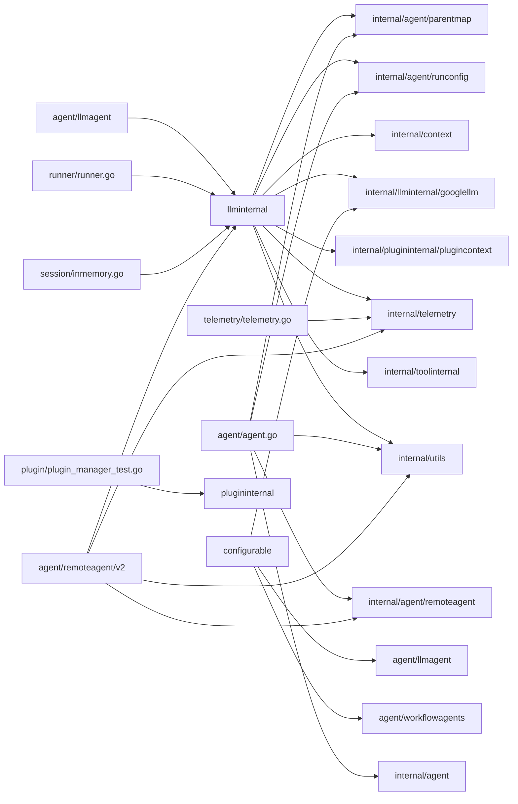

# internal 模块（附录式）

> 本章基于 commit `d06992e2b1ec2c9b95c6070e0fd12d50a43e4c99` 编写。代码位于 `/home/wu/oneone/adk/internal/`。

## 1. 定位与边界

`internal/` 收纳 ADK-Go **被同 module 内公共包依赖、但不向用户公开**的实现细节：跨包共享的状态/上下文/回调/工具/telemetry 支撑层、YAML 与配置加载、A2A 与 LLM 内部流转，以及测试公用脚手架。它是 `agent`、`runner`、`model`、`tool`、`session`、`plugin`、`telemetry`、`server` 等公共 API 背后的"内部引擎室"。

边界约束：依据 Go 私有命名空间规则，外部仓库无法 `import google.golang.org/adk/internal/...`；仅 `google.golang.org/adk` 同 module 的非 internal 包可见（本 module 共 69 个非 internal 文件引用了 internal 子包）。换言之，internal 包是"被显式允许的跨公共包调用"，但**不是稳定 API**——任何升级都可能改签名。文档以"理解实现"为目的，不应以"依赖内部包"为生产实现路径。

## 2. 子包清单与职责

`internal/` 顶层无 `doc.go`，按职责分为 18 个子目录（外加 `style_test.go` 这一个 repo-wide 的 Apache 2.0 头检查器）：

| 子包 | 关键文件 | 一句话职责 |
|---|---|---|
| `internal/agent` | `state.go:18,40`、`remoteagent/a2a_config.go:27,51`、`runconfig/run_config.go:31`、`parentmap/map.go:24,29` | `Reveal` 模式暴露 Agent 私有状态；A2A 远端配置；`StreamingMode` 传递；`parentmap` 构建单亲 + 名称唯一的父子图 |
| `internal/artifact` | `artifacts.go:27` | 高层 wrapper：把 `Service` 绑定到 `AppName/UserID/SessionID` |
| `internal/artifact/tests` | `service_suite.go` | 公共 artifact service 兼容性测试套件 |
| `internal/cli/util` | `oscmd.go`、`flagset_helpers.go`、`text_helpers.go` | CLI 子命令日志着色、`flag.FlagSet` 文档化、文本居中 |
| `internal/configurable` | `configurable.go:96,164`、`configurable_utils.go:51,286` | YAML agent 工厂 + 4 张 `registry` map；`FromConfig` 入口；conformance 子树提供回放/录制插件 |
| `internal/context` | `invocation_context.go:27,52,116`、`callback_context.go:25`、`readonly_context.go:26` | 私有 `InvocationContext`（含 `EndInvocation` / `LiveSessionResumptionHandle`），`WithContext` 不可变克隆 |
| `internal/converters` | `map_structure.go` | JSON marshal/unmarshal 版的 `ToMapStructure`/`FromMapStructure`，避免 genai 缺 tag |
| `internal/httprr` | `rr.go:45` | HTTP record/replay 框架（源自 `golang.org/x/oscar`），用于 gemini 端到端录制 |
| `internal/llminternal` | `base_flow.go:62,134,528,1012`、`agent.go:30,58`、`instruction_processor.go:41` | LLM 一次轮询"管道"：`Flow` + 13 个 `RequestProcessor`/`ResponseProcessor` + 6 类回调 + `Reveal`；`liveSessionImpl` 跟踪 streaming tool；`InstructionsRequestProcessor` 注入 `{var}`/`{artifact.file}` 占位 |
| `internal/llminternal/converters` | `converters.go:60` | A2A 风格 `genai.GenerateContentResponse` → `model.LLMResponse` 转换；注释承认 gemini-3 SSE 偶发空 entry |
| `internal/llminternal/googlellm` | `variant.go:39,50,71`、`live_connection.go` | 后端识别（Vertex vs GeminiAPI），仅在 Gemini 2.5 及以下 + Gemini API + 有工具时插入 set_model_response |
| `internal/memory` | `memory.go` | `memory.Service` 的轻量包装 |
| `internal/plugininternal` | `plugin_manager.go:38,44,76,93,222,239,256,273,286` | 13 类 `RunXxxCallback`，依次执行已注册插件的回调（任一返回非 nil 即短路），`ToContext` 注入 ctx |
| `internal/plugininternal/plugincontext` | — | `PluginManagerCtxKey` ctx key |
| `internal/sessionutils` | `utils.go:22` | 状态 delta 拆分/合并（`appPrefix`/`userPrefix`/`tempPrefix` 三个常量） |
| `internal/telemetry` | `telemetry.go:54,67,99,148,165,239,244,259`、`logger.go:33,56,69` | OTel tracer + 日志桥（OTel semconv v1.36.0）：`StartInvokeAgentSpan`/`StartGenerateContentSpan`/`StartExecuteToolSpan`；`LogRequest`/`LogResponse` 发 `gen_ai.*` event；`genAICaptureMessageContent atomic.Bool` 切换明文/脱敏 |
| `internal/testutil` | `test_agent_runner.go`、`genai.go:64` | `TestAgentRunner` + `MockModel` + `CollectEvents/CollectParts/CollectTextParts` + gemini record/replay 工厂 |
| `internal/toolinternal` | `tool.go:28,42` | 扩展 `tool.Tool` 的内部接口：`Declaration`/`Run`/`RunStream`/`ProcessRequest`（让 LLM 工具在 preprocess 阶段贡献请求字段） |
| `internal/toolinternal/toolutils` | `toolutils.go` | `PackTool` 工具 |
| `internal/typeutil` | `convert.go` | JSON-schema 验证 + 泛型转换 `ConvertToWithJSONSchema` |
| `internal/utils` | `utils.go:30,135`、`schema_utils.go:30` | `genai.Content` 上的 `FunctionCalls`/`FunctionResponses`/`TextParts`；`afFunctionCallIDPrefix = "adk-"` 注入 ID；`AppendInstructions` 拼接 SystemInstruction；`ValidateMapOnSchema`/`ValidateOutputSchema` |
| `internal/version` | `version.go` | 硬编码字符串 `Version = "1.2.0"`，注入 OTel instrumentation version |

## 3. 核心接口与类型

由于 internal 包对外不公开，本节列出**最值得理解的内部模式**——这些是其他模块的"工作底座"。

`Reveal` 模式是 ADK 暴露 Agent 私有字段的惯用句式。它由两个互相配对的接口/导出函数组成：

- `internal/agent.Agent`（`internal/agent/state.go:18-20`）—— 包外不可见接口 `internal() *State`。
- `internal/agent.Reveal(a Agent) *State`（`internal/agent/state.go:40`）—— 把任意 Agent 内部的 `State` 暴露给本包 processor 使用。

`internal/llminternal` 中存在完全同构的副本（`internal/llminternal/agent.go:26,58`），仅作用域限定为 LLMAgent；`internal()` 方法只被 `Reveal` 调用，外部包若想读这些字段应走公共 API。

`parentmap.Map`（`internal/agent/parentmap/map.go:24,29`）—— `map[string]agent.Agent`，由 `New(root)` 在 DFS 遍历时构建：强制"单亲"（同一子 Agent 不可被两个父 Agent 持有）+ "根名不复用"（子节点名不能与根重名）。校验失败返回 `fmt.Errorf`（`map.go:38,41`）。`ToContext`/`FromContext`（`map.go:70,74`）让 `InstructionsRequestProcessor` 找到 root（`instruction_processor.go:48-53`）。

`llminternal.Flow`（`internal/llminternal/base_flow.go:62-74`）—— LLM 一次轮询的"管道"：`Model`/`Tools`/`RequestProcessors`/`ResponseProcessors` 切片 + 6 类模型/工具回调切片。`DefaultRequestProcessors`/`DefaultResponseProcessors`（`base_flow.go:77-99`）共 13 个 processor 顺序敏感：`basicRequestProcessor` → `toolProcessor` → `authPreprocessor` → `RequestConfirmationRequestProcessor` → `instructionsRequestProcessor` → `identityRequestProcessor` → `ContentsRequestProcessor` → `nlPlanningRequestProcessor` → `codeExecutionRequestProcessor` → `outputSchemaRequestProcessor` → `AgentTransferRequestProcessor` → `removeDisplayNameIfExists`。

`plugininternal.PluginManager`（`internal/plugininternal/plugin_manager.go:38-41,44,76,93,222,239,256,273,286`）—— 13 个 `RunXxxCallback`（`OnUserMessage` / `Before/AfterRun` / `OnEvent` / `Before/AfterAgent` / `Before/After/OnToolError` / `Before/After/OnModelError`），按注册顺序遍历，任一回调返回非 nil 立即短路。`ToContext` 把 manager 塞到 ctx（`plugin_manager.go:286`）；`llminternal` 通过 `pluginManagerFromContext`（`base_flow.go:1361`）取出。

`liveSessionImpl`（`internal/llminternal/base_flow.go:134-142`）—— 双向流会话对象，含 `inputCh`/`outputCh`/`done`/`closeOnce sync.Once`/`audioMgr *AudioCacheManager`/`mu sync.Mutex`/`activeTools map[string][]activeTask`。`activeTask = {callID, cancel context.CancelFunc}`，使 `stop_streaming` 函数调用能通过 `CancelAllStreamingTools`（`base_flow.go:174-186`）取消 streaming tool。

`remoteagent.A2AClient`/`A2AClientProvider`/`A2AServerConfig`（`internal/agent/remoteagent/a2a_config.go:27-58`）—— 把 `github.com/a2aproject/a2a-go/v2` 的 `a2aclient` 抽象为可被 `agent/remoteagent/v2` 注入的内部接口；用户可实现 `A2AClientProvider.CreateClient` 替换底层 SDK。

## 4. 关键数据结构

| Struct | 位置 | 字段含义 |
|---|---|---|
| `llminternal.State` | `internal/llminternal/agent.go:30-52` | LLMAgent 私有字段集合：`Model` / `Tools` / `Toolsets` / `IncludeContents` / `GenerateContentConfig` / `Instruction*` / `GlobalInstruction*` / `DisallowTransferToParent/Peers` / `InputSchema` / `OutputSchema` / `OutputKey` |
| `agent.State` | `internal/agent/state.go:22-25` | 任意 Agent 的 `AgentType + Config any` 二元组，`Type` 字符串常量 `TypeLLMAgent`/`TypeLoopAgent`/`TypeSequentialAgent`/`TypeParallelAgent`/`TypeCustomAgent`/`TypeRemoteAgent`（`state.go:30-35`） |
| `parentmap.Map` | `internal/agent/parentmap/map.go:24` | `map[string]agent.Agent`，子名 → 父 Agent；通过 ctx key `int` 常量（`map.go:82,84`）注入/取出 |
| `InvocationContextParams` | `internal/context/invocation_context.go:27-40` | 不可变参数包：`Artifacts`/`Memory`/`Session`/`Branch`/`Agent`/`UserContent`/`RunConfig`/`EndInvocation`/`InvocationID`/`LiveSessionResumptionHandle` |
| `InvocationContext` | `internal/context/invocation_context.go:52-56` | 嵌入 `context.Context` + `params InvocationContextParams`；`WithContext` 返回新对象（`invocation_context.go:110-114`）以保证可变性隔离 |
| `liveSessionImpl` | `internal/llminternal/base_flow.go:134-142` | 见上文；`audioMgr` 是 `*AudioCacheManager`（`audio_cache_manager.go:31`） |
| `responseWithEventID` | `internal/llminternal/base_flow.go:802,718` | 嵌入 `*model.LLMResponse` + `eventID string`；让回调链能在不重写响应的情况下挂载事件 ID |
| `streamingResponseAggregator` | `internal/llminternal/stream_aggregator.go:33` | 流式响应聚合状态：累计 `usageMetadata`/`groundingMetadata`/`citationMetadata`/`thoughtSignature`；按 `currentTextBuffer` + `currentTextIsThought` 拆分思维/正常文本；按 `currentFunctionName/ID/Args` + `PartialArgs` 用 JSONPath 写回到 `map[string]any` |
| `PluginManager` | `internal/plugininternal/plugin_manager.go:38-41` | `plugins []*plugin.Plugin` 切片 + `closeTimeout time.Duration` |
| `A2AServerConfig` | `internal/agent/remoteagent/a2a_config.go:51-58` | `AgentCard`（静态）或 `AgentCardProvider`（懒加载） + `ClientProvider` 工厂 |
| `RunConfig` | `internal/agent/runconfig/run_config.go:31-34` | `StreamingMode` 三种枚举（`none`/`sse`/`bidi`）+ `*agent.LiveRunConfig` |
| `configurable.registry` | `internal/configurable/configurable_utils.go:51` | 4 个全局 map + `registryMu sync.RWMutex`；`init()` 预注册 `LlmAgent`/`LoopAgent`/`ParallelAgent`/`SequentialAgent` + `exit_loop`/`google_search`/`url_context`/`google_maps_grounding`/`AgentTool`/`LongRunningFunctionTool`/`ExampleTool`/`McpToolset` 等工厂 |
| `telemetry` 私有 attribute key 集合 | `internal/telemetry/telemetry.go:45-51` | `gcpVertexAgentToolCallArgsName` / `gcpVertexAgentEventID` / `gcpVertexAgentToolResponseName` / `gcpVertexAgentInvocationID` / `genAIUsageCacheReadInputTokens` / `genAIUsageReasoningOutputTokens` |
| `genAICaptureMessageContent atomic.Bool` | `internal/telemetry/logger.go:33` | 全局开关：true 时记录 system/user 消息明文，否则输出 `<elided>` |
| `sessionutils` 前缀常量 | `internal/sessionutils/utils.go:22` | `appPrefix = "app:"`、`userPrefix = "user:"`、`tempPrefix = "temp:"`（与 Python 对齐） |
| `afFunctionCallIDPrefix` | `internal/utils/utils.go:30` | `adk-` 前缀；`RemoveClientFunctionCallID` 仅清除本框架加上的 ID |
| `InstructionProvider` | `internal/llminternal/agent.go:54` | 动态生成指令文本的函数签名 `func(ctx agent.ReadonlyContext) (string, error)` |
| `RequestConfirmationRequestProcessor` | `internal/llminternal/request_confirmation_processor.go:79,83,89,94` | 在 user 消息中无法解析 confirmation JSON 时直接 yield error |

## 5. 关键流程（精简）

`internal/llminternal` 内部的最关键子流程——`Flow.runOneStep`——是 ADK 整个 LLM 调用的"心跳"，把公共 API 中的"调一次 LLM"展开为 12 个 processor + 6 类回调的有序执行：

```mermaid
flowchart LR
    A[Flow.Run] --> B[runOneStep]
    B --> C[Model 校验 ErrModelNotConfigured]
    C --> D[preprocess: 12 个 DefaultRequestProcessors 顺序串联]
    D --> E[callLLM: BeforeModelCallback plugin→用户]
    E --> F[generateContent: StartGenerateContentSpan + LogRequest/LogResponse]
    F --> G[runAfterModelCallbacks / runOnModelErrorCallbacks]
    G --> H[postprocess: 2 个 DefaultResponseProcessors]
    H --> I{Content==nil 且 无 ErrorCode 且 未 Interrupted?}
    I -- 是 --> J[skip 跳过中间事件]
    I -- 否 --> K[finalizeModelResponseEvent 落事件]
    K --> L{TransferToAgent?}
    L -- 否 --> M[handleFunctionCalls: parallel go + WaitGroup]
    L -- 是 --> N[nextAgent.Run 让步]
    M --> O[mergeParallelFunctionResponseEvents 合并]
    O --> P[retriveStructuredModelResponse → yield final]
```

看图指引：核心在 `internal/llminternal/base_flow.go:528-654` 的 `runOneStep`，12 个 `DefaultRequestProcessors` 在 `base_flow.go:77-94` 顺序串联（`ContentsRequestProcessor` 紧跟 `instructionsRequestProcessor` 之后，因为前者会读 SystemInstruction）；`transfer_to_agent` 在 `postprocess` 阶段由 `agentToRun`（`base_flow.go:911,642`）让步给子 Agent，并注释 `TODO(hakim): figure out why this isn't handled by the runner`（`base_flow.go:638`）。`stop_streaming` 内建函数（`base_flow.go:1048-1056`）走 `liveSessionImpl.CancelAllStreamingTools` 路径，是 Live 模式下唯一的中断指令。

## 6. 扩展点

internal 包**不向用户公开扩展点**。`configurable.Register` / `RegisterToolFactory` / `RegisterToolsetFactory` / `RegisterCallback` 看似是扩展入口，但它们是 public 包 `agent/configurable`（若存在）通过 internal wrapper 调用的内部 API；用户应优先走公共 `configurable.RegisterXxx` 入口。详情见 [`../02-extension-points.md`](../02-extension-points.md)。

## 7. 错误处理与并发

**错误约定**：`internal/llminternal/base_flow.go:48` 定义唯一 sentinel `ErrModelNotConfigured`（`errors.New("model not configured; ensure Model is set in llmagent.Config")`），`runOneStep` 入口检查（`base_flow.go:530-533`）。`parentmap.New` 在父子冲突或名称重复时返回 `fmt.Errorf`（`internal/agent/parentmap/map.go:38,41`）。`newToolNotFoundError`（`internal/llminternal/base_flow.go:970`）输出 Python 风格诊断信息，列出可用工具 + 排查建议。`contents_processor.go:251,269,433-449,463` 对畸形 history（call/response ID 不匹配、空合并事件等）显式报错。`configurable_utils.go:244,257,267,277,319,329,346,360,366` 把所有注册/解析错误集中 `fmt.Errorf("%w", err)` 包装。`httprr.Open` 在 `testutil.genai.go:34` 用 `fmt.Errorf("httprr.Open(%q) failed: %w", ...)` 包装。

**并发模型**：

- `plugininternal.PluginManager` 无显式锁（`plugins` 切片在 `NewPluginManager` 时填充，之后只读，`plugin_manager.go:44-58`）。
- `configurable.registry` 用 `sync.RWMutex`（`configurable_utils.go:51`）保护 4 张 map。
- `liveSessionImpl`（`base_flow.go:140`）用 `sync.Mutex` 保护 `activeTools`，并用 `sync.Once` 做 `close` 单次保护。
- `AudioCacheManager`（`audio_cache_manager.go:32`）用 `sync.Mutex` 保护 `inputCache`/`outputCache`。
- `genAICaptureMessageContent`（`logger.go:33`）用 `atomic.Bool` 暴露开关。
- `handleFunctionCalls`（`base_flow.go:1029-1031`）对每个函数调用 `go func(i, fnCall)` 启动 N 个 worker 并 `WaitGroup` 同步；streaming tool 走独立 goroutine（`base_flow.go:1077-1099`）并由 `cancelledToolContext`（`base_flow.go:992-1006`）支持随时取消。

**已知坑**：

- `tools_processor.go:31-33` 注释 `if f.Tools != nil { return }`——`Tools` 字段只被填充一次，重复 Run 共享，并发执行多个 Run 会相互干扰。
- `base_flow.go:1319 mergeEventActions` 注释 `TODO add similar logic for state`——StateDelta 合并只对 map 嵌套递归做了一级。
- `base_flow.go:1011` 注释 `TODO: check feasibility of running tool.Run concurrently.` 仍未实现（并行是 fan-out 不限并发，若一次返回大量 tool call 可能 OOM）。
- `outputschema_processor.go:98` 的 `needOutputSchemaProcessor` 依赖"Gemini 2.5 及以下 + Gemini API + 有工具"三个条件同时满足，新版本 Gemini 升级到 3.x 时此 fallback 路径会被自动绕过。

## 8. 依赖与被依赖

看图指引：反向引用集中在 `agent`、`runner`、`session`、`plugin`、`server/adka2a/v2`、`cmd/launcher` 等公共包。`internal/llminternal` 是被引用最多的叶子（出现在 `runner.go`、`inmemory.go`、所有 `llmagent/workflowagents/remoteagent` 实现、`server/adka2a/v2`）。`internal/telemetry` 是公共 `telemetry` 包的 OTel 实现细节（`telemetry.go:54-58` 通过 `otel.GetTracerProvider()` 共享全局 tracer）。外部仓库无法 import 任何 internal 子包，这是 Go 私有命名空间强制保证的包边界。

## 9. 测试与可观察性

- 风格/版权检查：`internal/style_test.go`（`package internal_test`）在 `chdir ..` 后 walk 整个 repo，检查 `Copyright 2025..` Apache 2.0 头（支持 `-fix` 模式补全），白名单 `internal/jsonschema`、`internal/util`、`internal/httprr`、`vendor`。
- 各子包均有 `_test.go`：`internal/context/context_test.go`；`internal/llminternal/*_test.go`（agent_transfer / audio_cache_manager / base_flow / base_flow_telemetry / contents_processor / handle_function_calls_async / identity_request_processor / instruction_processor / outputschema_processor / parallel_function_call / request_confirmation_processor / stream_aggregator / streaming_tool / functions / clone / helpers）；`internal/memory/memory_test.go`；`internal/utils/{utils_test.go,schema_test.go}`；`internal/artifact/artifacts_test.go`；`internal/artifact/tests/service_suite.go`（公共 service 兼容性套件）；`internal/httprr/rr_test.go`；`internal/telemetry/{telemetry_test.go,logger_test.go,converters_test.go}`；`internal/configurable/conformance/{replayplugin,recordplugin}/*_test.go`。
- Telemetry 埋点（OTel semconv v1.36.0）位于 `internal/telemetry/telemetry.go`：`StartInvokeAgentSpan`（`telemetry.go:67`，span 名 `invoke_agent <name>`）、`StartGenerateContentSpan`（`telemetry.go:99`，`generate_content <model>`）、`StartExecuteToolSpan`（`telemetry.go:148`，`execute_tool <tool>`）；`TraceToolResult`（`telemetry.go:165`）/ `TraceMergedToolCallsResult`（`telemetry.go:244`）写 `gcp.vertex.agent.event_id` + `gen_ai.tool.call.id` + `gcp.vertex.agent.tool_response`。`LogRequest`（`logger.go:56`）/`LogResponse`（`logger.go:69`）发 `gen_ai.system.message`/`gen_ai.user.message`/`gen_ai.choice` event；logger 名称 `gcp.vertex.agent`，schema URL `semconv/v1.36.0`。`WrapYield`（`telemetry.go:223`）包装 `iter.Seq2` yield，span 在 yield 返回时关闭。`llminternal` 内的调用点：`base_flow.go:811 generateContent` 启动 span、`base_flow.go:1018` 并行 tool 启动 `execute_tool (merged)`、`base_flow.go:1034,1165` 每 tool 启动子 span、`base_flow.go:848` 流式 `LogResponse`、`base_flow.go:372` 记录 resumption handle。

## 10. 延伸阅读

- 端到端流程：LLM 调用的端到端时序在 [`../01-core-flows.md#f1`](../01-core-flows.md) 单轮对话、F2 工具调用、F5 Live 双向流；本节讲述的 `Flow.runOneStep` 是 F1/F2 的实现底座。
- 扩展机制：内部可注入面（plugin 回调、`RequestProcessors`、`configurable.Register`）的公共入口见 [`../02-extension-points.md`](../02-extension-points.md)。
- 顶层定位：internal 在整体模块依赖图中的位置见 [`../00-overview.md`](../00-overview.md)。
- 术语与文件索引：`Flow` / `Reveal` / `parentmap` / `PluginManager` / `httprr` 等术语定义见 [`../04-appendix.md`](../04-appendix.md)。
- 子项目深读占位：internal 子包深读将由后续子项目产出，链接待补。
