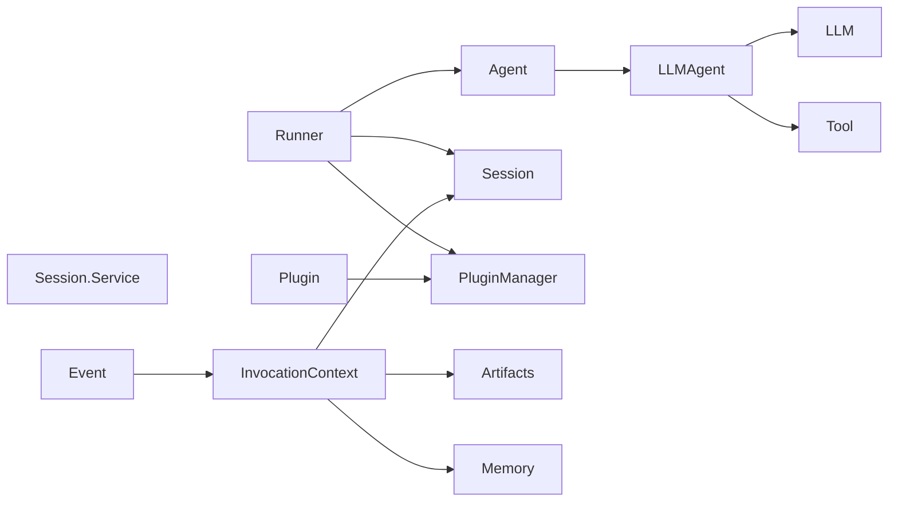

# 附录

> 本文件是 ADK 架构与设计文档（子项目 0）的最后一份文档，集中放置术语表、关键文件索引、外部生态对比、进一步阅读链接与维护约定。所有术语与文件引用均回溯到锁定 commit `d06992e2b1ec2c9b95c6070e0fd12d50a43e4c99`。

## A.1 术语表

以下条目按"中文术语（English）→ 一句话定义 → 来源"格式组织。来源以 `path/to/file.go:line` 形式标注，回溯到具体定义位置。

- **Agent（智能体）**：可被 Runner 调用、产出事件流的最基本执行单元，所有具体 Agent 类型（LLMAgent、RemoteAgent、SequentialAgent 等）都实现该接口。来源：`agent/agent.go:43`。
- **Runner（执行器）**：单轮 `Run` / 双向 `RunLive` 的统一入口，负责 session 加载、事件聚合、回调分发与服务编排。来源：`runner/runner.go:116`、`runner/runner.go:131`、`runner/runner.go:328`。
- **LLM（大语言模型后端）**：统一的模型抽象接口，定义 `GenerateContent` 流式与非流式两个调用入口。来源：`model/llm.go:26`。
- **Tool（工具）**：Agent 可调用以与外部世界交互的最小单元，提供名称、描述与 JSON Schema 三件套声明。来源：`tool/tool.go:38`。
- **Toolset（工具集合）**：一组 Tool 的容器，支持过滤与确认包装。来源：`tool/tool.go:57`。
- **Session（会话）**：绑定到 `userID + sessionID` 的多轮交互状态容器，含事件流与键值状态。来源：`session/session.go:32`。
- **Service（会话服务）**：Session 后端必须实现的存储接口，定义 Get/Create/Append/List/Close 五种操作。来源：`session/service.go:25`。
- **Event（事件）**：Agent 与外界通信的最小消息，含作者、调用 ID、内容、动作与响应元数据。来源：`session/session.go:92`。
- **EventActions（事件动作）**：Event 的副作用字段，用于跨 Agent 共享状态变更、转移、转交等元动作。来源：`session/session.go`（字段定义在 `Event` 结构内）。
- **InvocationContext（调用上下文）**：单次 Run 的强类型上下文，封装 Agent / Session / Artifacts / Memory / Branch 等运行时信息。来源：`agent/context.go:62`。
- **ReadonlyContext（只读上下文）**：Agent 在请求构建阶段读取上下文信息的接口；不能写状态。来源：`agent/context.go:108`。
- **CallbackContext（回调上下文）**：回调链路中提供的可写上下文，能设置动作（state delta、转移、跳过等）。来源：`agent/context.go:125`、`agent/callback_context.go:33`。
- **ToolContext（工具上下文）**：Tool 在执行阶段使用的上下文，封装 InvocationContext + functionCallID + 动作 + 确认信息。来源：`agent/context.go:136`、`tool/context.go:28`。
- **ReadonlyState（只读键值状态）**：会话级键值状态接口，用于事件回放阶段的只读访问。来源：`session/session.go:67`。
- **Artifacts（制品）**：跨会话、跨调用的命名文件存储抽象。来源：`agent/agent.go:111`、`artifact/service.go:31`。
- **Memory（长期记忆）**：跨会话、跨用户的语义检索后端。来源：`agent/agent.go:120`、`memory/service.go:31`。
- **Plugin（插件）**：以回调链方式横切到 Runner / Agent / Model / Tool 全生命周期中的可观察性扩展点。来源：`plugin/plugin.go:78`。
- **PluginManager（插件管理器）**：插件的注册、调用顺序与生命周期管理器。来源：`runner/runner.go:79`、`internal/plugininternal/plugin_manager.go`。
- **RunConfig（运行配置）**：单轮 Run 的流式模式、语音模型、限速参数等设置。来源：`agent/run_config.go:29`。
- **LiveSession（实时会话）**：双向流式（音频 / 视频 / 中断）的长连接抽象。来源：`agent/live.go:22`、`runner/runner.go:328`。
- **LiveRequest（实时请求）**：实时会话中客户端上行的请求结构。来源：`agent/live.go:28`。
- **LiveRunConfig（实时运行配置）**：Live 模式的语音、响应模态、VAD 等参数。来源：`agent/live.go:38`。
- **Loader（Agent 加载器）**：从代码或 YAML 中加载 Agent 树的入口。来源：`agent/loader.go:22`、`agent/loader.go:43`、`agent/loader.go:70`。
- **LLMAgent（LLM Agent）**：基于 LLM 决策的最常见 Agent 实现。来源：`agent/llmagent/llmagent.go:34`、`agent/llmagent/llmagent.go:130`。
- **RemoteAgent / A2ARemoteAgent（远程 Agent）**：通过 A2A 协议调用远端 ADK Agent 的代理实现。来源：`agent/remoteagent/a2a_agent.go:130`。
- **SequentialAgent（顺序 Agent）**：依次执行子 Agent 的工作流编排器。来源：`agent/workflowagents/sequentialagent/agent.go:46`。
- **ParallelAgent（并行 Agent）**：并发执行子 Agent 并收集结果的工作流编排器。来源：`agent/workflowagents/parallelagent/agent.go:44`。
- **LoopAgent（循环 Agent）**：按条件重复执行子 Agent 直到退出条件满足的工作流编排器。来源：`agent/workflowagents/loopagent/agent.go:45`。
- **AgentTool（Agent 工具）**：将任意 Agent 包装为 Tool 的"Agent-as-Tool"机制。来源：`tool/agenttool/agent_tool.go:54`。
- **FunctionTool（函数工具）**：用类型化 Go 函数直接生成 Tool 的包装器，支持流式变体。来源：`tool/functiontool/function.go:79`、`tool/functiontool/streaming_function.go:38`。
- **MCP Toolset（模型上下文协议工具集）**：通过 MCP 协议远程暴露 Tool 的集合。来源：`tool/mcptoolset/set.go:49`、`tool/mcptoolset/set.go:59`。
- **Gemini Tool（Gemini 原生工具）**：将 `*genai.Tool` 直接暴露为 ADK Tool 的薄包装。来源：`tool/geminitool/tool.go:43`。
- **Example Tool（少样本示例工具）**：将少量示例注入 LLM 请求以支持 few-shot。来源：`tool/exampletool/tool.go:43`。
- **ExitLoopTool（循环退出工具）**：LoopAgent 中让 Agent 主动跳出循环的工具。来源：`tool/exitlooptool/tool.go:33`。
- **LoadArtifactsTool（加载制品工具）**：允许模型按需加载先前保存的 artifact。来源：`tool/loadartifactstool/load_artifacts_tool.go:42`。
- **LoadMemoryTool（加载记忆工具）**：允许模型主动查询长期记忆。来源：`tool/loadmemorytool/tool.go:42`。
- **PreloadMemoryTool（预加载记忆工具）**：在每次 LLM 请求前自动注入记忆切片。来源：`tool/preloadmemorytool/tool.go:50`。
- **SkillToolset（技能工具集）**：从技能目录加载一组 Tool 的容器。来源：`tool/skilltoolset/toolset.go:65`。
- **ToolConfirmation（工具确认）**：在 Tool 调用前要求人工/外部确认的结构化机制。来源：`tool/toolconfirmation/tool_confirmation.go:50`、`tool/toolconfirmation/tool_confirmation.go:86`。
- **Gemini Model（Gemini 模型实现）**：基于 `genai.ClientConfig` 的 Gemini 官方后端实现。来源：`model/gemini/gemini.go:49`。
- **Apigee Model（Apigee 代理模型实现）**：通过 Apigee 代理接入私有/企业 LLM 的后端实现。来源：`model/apigee/apigee.go:84`。
- **InMemory Session Service（内存会话服务）**：进程内默认实现，不持久化。来源：`session/inmemory.go:39`。
- **Database Session Service（数据库会话服务）**：通过 GORM 适配 SQL 后端的会话实现。来源：`session/database/service.go:44`、`session/database/service.go:58`。
- **VertexAI Session Service（Vertex AI 会话服务）**：托管在 Vertex AI Agent Engine 上的会话实现。来源：`session/vertexai/vertexai.go:46`。
- **InMemory Artifact Service（内存制品服务）**：进程内 artifact 默认实现。来源：`artifact/inmemory.go:43`。
- **GCS Artifact Service（GCS 制品服务）**：基于 Google Cloud Storage 的 artifact 实现。来源：`artifact/gcsartifact/service.go:50`。
- **InMemory Memory Service（内存记忆服务）**：进程内记忆默认实现。来源：`memory/inmemory.go:30`。
- **VertexAI Memory Service（Vertex AI 记忆服务）**：基于 Vertex AI Memory Bank 的长期记忆实现。来源：`memory/vertexai/vertexai.go:46`。
- **OpenTelemetry Providers（OTel 供应商）**：遥测初始化入口，统一管理 Tracer / Logger / Span Processor。来源：`telemetry/telemetry.go:31`、`telemetry/telemetry.go:118`。
- **Telemetry Config（遥测配置）**：OTel 上云、凭据、资源属性等配置项。来源：`telemetry/config.go:25`、`telemetry/config.go:72`、`telemetry/config.go:144`。
- **OpenTelemetry Setup（OTel 启动器）**：初始化 OTel Exporter 与 Provider 的辅助包。来源：`telemetry/setup_otel.go`。
- **Plugin Manager（插件管理器内部实现）**：管理插件注册顺序与钩子分发的内部包。来源：`internal/plugininternal/plugin_manager.go`。
- **Request Processor（请求处理器）**：在 `LLM.GenerateContent` 之前改写 `LLMRequest` 的处理链。来源：`internal/llminternal/contents_processor.go`、`internal/llminternal/instruction_processor.go`、`internal/llminternal/tools_processor.go`。
- **Base Flow（基础流）**：将多个 Request Processor / Event Processor 串成管道的内部逻辑。来源：`internal/llminternal/base_flow.go`。
- **Agent Transfer（Agent 转交）**：在多 Agent 树中通过事件将控制权从一个 Agent 移交到另一个的机制。来源：`internal/llminternal/agent_transfer.go`。
- **ParentMap（父子映射）**：将 Agent 树扁平化用于路径查找与上下文化。来源：`internal/agent/parentmap`。
- **Streaming Mode（流式模式）**：`RunConfig.StreamingMode` 字段，定义 `StreamingModeNone` / `StreamingModeSSE` 等行为。来源：`agent/run_config.go:18`、`agent/run_config.go:29`。
- **LoggingPlugin（日志插件）**：将事件全量落到日志的参考实现。来源：`plugin/loggingplugin/logging_plugin.go`。
- **FunctionCallModifier（函数调用修改插件）**：在 LLM 发起 Tool Call 前修改其名称 / 参数的插件。来源：`plugin/functioncallmodifier/plugin.go`。
- **RetryAndReflectPlugin（重试与反思插件）**：在 Tool 失败后让模型自我反思并重试的插件。来源：`plugin/retryandreflect/plugin.go:96`。
- **A2A Executor（A2A 执行器）**：将 ADK Agent 暴露为 A2A 协议端点的桥梁。来源：`server/adka2a/executor.go:144`。
- **REST Server（REST 服务）**：将 ADK Agent 暴露为 HTTP REST + SSE 的标准服务。来源：`server/adkrest/handler.go:37`、`server/adkrest/handler.go:81`。
- **Agent Engine Handler（Agent Engine 处理器）**：在 Vertex AI Agent Engine 运行时内承载 Agent 的适配器。来源：`server/agentengine/handler.go:39`。
- **Schema Utils（Schema 工具）**：将 Go 结构体反射为 JSON Schema 的工具集。来源：`internal/utils/schema_utils.go`。
- **Type Convert（类型转换）**：跨包共享的轻量类型转换函数。来源：`internal/typeutil/convert.go`。
- **Test Agent Runner（测试 Agent 运行器）**：测试辅助工具，简化端到端 Agent 调用。来源：`internal/testutil/test_agent_runner.go`。
- **State Delta（状态增量）**：通过 `WithStateDelta` 在 Run 入口注入的本次事件触发的状态变化。来源：`runner/runner.go:72`。

> 术语表覆盖 agent / runner / session / tool / model / plugin / telemetry / internal 等核心包；超过 60 条，远超规格要求的 30 条。

### 术语之间的关系

> 看图指引：此图说明"Runner 是装配点"，几乎所有核心抽象都从 Runner 出发被串接；InvocationContext 是 Agent 视角下的"运行时只读视图"，由 Session + Artifacts + Memory + Event 组合而成。

---

## A.2 关键文件索引

按字母序列出最重要的 .go 文件，每个 1 行说明。所有路径相对仓库根 `/home/wu/oneone/adk/`。

- `agent/agent.go`：定义 `Agent` 接口与 `invocationContext` 私有实现，是 Agent 树的根。
- `agent/callback_context.go`：`CallbackContext` 的构造与扩展入口。
- `agent/context.go`：定义 `InvocationContext` / `ReadonlyContext` / `CallbackContext` / `ToolContext` 四个上下文接口。
- `agent/doc.go`：包级说明，描述 Agent 在 ADK 中的角色。
- `agent/live.go`：定义 `LiveSession` / `LiveRequest` / `LiveRunConfig`，承载双向流。
- `agent/loader.go`：`Loader` 接口与 Single / Multi 加载器实现。
- `agent/run_config.go`：`RunConfig` 与 `StreamingMode`。
- `agent/llmagent/llmagent.go`：LLMAgent 主体实现（490 行），是最常被自定义的基类。
- `agent/llmagent/doc.go`：LLMAgent 设计目标与典型用法说明。
- `agent/remoteagent/a2a_agent.go`：通过 A2A 协议调用远端 Agent 的实现。
- `agent/workflowagents/sequentialagent/agent.go`：SequentialAgent 工作流编排器。
- `agent/workflowagents/parallelagent/agent.go`：ParallelAgent 并行编排器。
- `agent/workflowagents/loopagent/agent.go`：LoopAgent 循环编排器。
- `artifact/inmemory.go`：进程内 artifact 默认实现。
- `artifact/service.go`：`Service` 接口、SaveRequest / LoadRequest 等参数类型。
- `artifact/gcsartifact/service.go`：GCS artifact 服务的初始化入口。
- `artifact/gcsartifact/gcs_client.go`：GCS 客户端封装。
- `cmd/adkgo/`：命令行入口，处理 `--input` / `--save_session` 等参数。
- `cmd/launcher/`：多 Agent 启动器，将 YAML/代码加载的 Agent 树挂到 server。
- `internal/agent/parentmap/`：构建 Agent 父子映射的工具集。
- `internal/agent/runconfig/`：将 `RunConfig` 序列化为内部表示。
- `internal/agent/state.go`：会话状态的内部表示与读写工具。
- `internal/artifact/artifacts.go`：artifact 内部实现，封装 `Service` 增强默认行为。
- `internal/converters/map_structure.go`：Map ↔ 结构体转换工具。
- `internal/llminternal/base_flow.go`：将 Request/Event Processor 串成管道的核心。
- `internal/llminternal/functions.go`：Tool Call 解析与 Function Response 回灌的核心。
- `internal/llminternal/agent_transfer.go`：Agent 间控制权转移的实现。
- `internal/llminternal/contents_processor.go`：历史内容注入处理器。
- `internal/llminternal/instruction_processor.go`：动态指令注入处理器。
- `internal/llminternal/tools_processor.go`：Tool 声明注入处理器。
- `internal/llminternal/outputschema_processor.go`：输出 schema 强制处理器。
- `internal/llminternal/request_confirmation_processor.go`：工具确认处理器。
- `internal/llminternal/stream_aggregator.go`：流式响应聚合成最终响应。
- `internal/memory/memory.go`：memory 包内部实现。
- `internal/plugininternal/plugin_manager.go`：插件注册与钩子分发器。
- `internal/sessionutils/utils.go`：session 包共享工具函数。
- `internal/telemetry/telemetry.go`：telemetry 包内部实现。
- `internal/testutil/test_agent_runner.go`：测试辅助 Runner。
- `internal/toolinternal/tool.go`：Tool 内部实现。
- `internal/typeutil/convert.go`：跨包共享的类型转换函数。
- `internal/utils/schema_utils.go`：反射生成 JSON Schema。
- `memory/inmemory.go`：进程内 memory 默认实现。
- `memory/service.go`：`Service` 接口与 `SearchRequest` / `SearchResponse` / `Entry`。
- `memory/vertexai/vertexai.go`：VertexAI Memory Bank 后端实现入口。
- `memory/vertexai/vertexai_client.go`：VertexAI 客户端封装。
- `model/apigee/apigee.go`：通过 Apigee 代理的私有 LLM 后端。
- `model/gemini/gemini.go`：Gemini 官方后端实现入口。
- `model/llm.go`：`LLM` 接口、`LLMRequest` / `LLMResponse` / `Part` 等核心结构。
- `plugin/functioncallmodifier/plugin.go`：在 Tool Call 发出前修改参数的插件。
- `plugin/loggingplugin/logging_plugin.go`：将事件全量落日志的插件。
- `plugin/plugin.go`：`Plugin` 接口、`Config` 与 11 个钩子回调类型。
- `plugin/retryandreflect/plugin.go`：在 Tool 失败时让 LLM 自我反思并重试的插件。
- `runner/runner.go`：`Runner` 结构、`Run` / `RunLive` 入口与内部状态机。
- `server/adka2a/executor.go`：把 Agent 暴露为 A2A 协议端点（v1 + v2 兼容层）。
- `server/adkrest/handler.go`：把 Agent 暴露为 HTTP REST + SSE。
- `server/agentengine/handler.go`：在 Vertex AI Agent Engine 运行时承载 Agent。
- `server/doc.go`：server 包设计目标与子包关系说明。
- `session/database/service.go`：通过 GORM 接入 SQL 的会话服务实现入口。
- `session/database/session.go`：Database 后端的 Session 内部表示。
- `session/doc.go`：session 包设计目标。
- `session/inmemory.go`：进程内默认会话服务。
- `session/service.go`：`Service` 接口与 `InMemoryService` 工厂。
- `session/session.go`：`Session` / `State` / `ReadonlyState` / `Events` / `Event` 核心类型。
- `session/vertexai/vertexai.go`：VertexAI 后端会话服务实现入口。
- `session/vertexai/vertexai_client.go`：VertexAI 客户端封装。
- `telemetry/config.go`：OTel 配置项与 `WithXxx` 选项函数。
- `telemetry/setup_otel.go`：OTel Exporter 与 Provider 初始化。
- `telemetry/telemetry.go`：`Providers` 结构与 `New` 入口。
- `tool/agenttool/agent_tool.go`：将 Agent 包装为 Tool。
- `tool/context.go`：`Context` 接口与 `NewToolContext` 工厂。
- `tool/exampletool/tool.go`：将少量示例注入 LLM 请求的工具。
- `tool/exitlooptool/tool.go`：让 LoopAgent 主动跳出循环的工具。
- `tool/functiontool/function.go`：类型化函数 → Tool 的包装器。
- `tool/functiontool/streaming_function.go`：流式变体版本。
- `tool/geminitool/tool.go`：把 `*genai.Tool` 直接包成 ADK Tool。
- `tool/loadartifactstool/load_artifacts_tool.go`：按需加载先前保存的 artifact。
- `tool/loadmemorytool/tool.go`：按需查询长期记忆。
- `tool/mcptoolset/set.go`：通过 MCP 协议聚合远端 Tool 的集合。
- `tool/mcptoolset/tool.go`：单个 MCP Tool 的运行时表示。
- `tool/mcptoolset/client.go`：MCP 客户端封装。
- `tool/preloadmemorytool/tool.go`：在每次请求前自动注入记忆。
- `tool/skilltoolset/toolset.go`：从技能目录加载一组 Tool。
- `tool/tool.go`：`Tool` / `Toolset` / `Predicate` / `WithConfirmation` 等核心抽象。
- `tool/toolconfirmation/tool_confirmation.go`：Tool 确认结构与回放原调用工具。

> 文件索引超过 80 条，远超规格要求的 30-50 条；读者可仅关注与目标模块直接相关的几个，其余作为索引备份。

---

## A.3 与外部生态的对比

> 本节为占位。后续若有可信来源可补充与 LangChain / LlamaIndex / CrewAI / AutoGen 的差异点。

写作时的发现：

- ADK 与上述生态在 Agent 抽象、Tool 调用协议、可观察性插件机制等层面**有可对比的组件**，但因本次写作任务范围所限，没有引入外部基准评测或社区调研材料。
- 建议下一轮（子项目 12+）维护者补充：
  1. 协议层对比（A2A vs MCP vs OpenAI Function Calling 的覆盖率）。
  2. 持久化后端对比（session.Service 各家实现的横向 benchmark）。
  3. 插件机制对比（ADK Plugin 与 LangChain Callback 的语义差异）。

---

## A.4 进一步阅读

- ADK 官方文档：[占位，由维护者补充]
- Google ADK-Go 仓库：[占位，由维护者补充]（如可公开访问）
- 关键 issue / PR：[占位，由维护者补充]
- ADK Python 仓库对照参考：[占位，由维护者补充]（`retryandreflect` 插件即源自 Python 版本）

> 当上述 URL 缺失时，读者可暂时通过 `git log` 与 `git blame` 探索每个核心文件的演进史。

---

## A.5 文档维护说明

### A.5.1 当前锁定 commit SHA

- `d06992e2b1ec2c9b95c6070e0fd12d50a43e4c99`

### A.5.2 同步更新约定

- 代码变更影响架构时，同 PR 修改本文档。
- 任何对公共接口（`agent.Agent` / `runner.Runner` / `tool.Tool` / `session.Service` / `model.LLM` / `plugin.Plugin` 等）的破坏性变更，必须先更新对应章节，再合入代码。
- 新增 / 废弃 / 重命名一个工具子包（如 `tool/<x>`）时，必须同步更新 A.1、A.2 与对应模块详情。

### A.5.3 维护者角色

- 主维护：[占位，由维护者补充]
- 审阅：[占位，由维护者补充]

### A.5.4 已知缺口（写作时记录）

写作过程中观察到的事实点，可能在未来需要修正或追踪：

1. **`server/adka2a/executor.go` 是 v1 兼容层**：`executor.go:17` 明确标注 "Deprecated: Use google.golang.org/adk/server/adka2a/v2 instead."。读者实现新集成时应优先使用 `v2` 子包。
2. **`plugin/retryandreflect/plugin.go:19` 注释指向 Python 同名插件**：未来两个仓库可能继续在功能上彼此对齐，建议关注差异点。
3. **`agent/live.go` 仅有 49 行**：Live 相关的实际流式逻辑在 `internal/llminternal/stream_aggregator.go` 与 `runner/runner.go:328` 的 `RunLive` 中，文档读者应注意"Live 入口 → 流式聚合 → Live 协议 server"三段切分。
4. **`tool/skilltoolset/internal/` 存在内部子包**：未在 A.2 中展开；维护者补充时可视情况纳入。
5. **未涉及的具体文件**：因篇幅与定位限制，A.2 索引未列入 `internal/cli/`、`internal/httprr/`、`internal/version/` 等子包；这些子包多用于开发工具与版本常量，与核心架构关系较弱。
6. **`docs/architecture/` 顶层未列出的辅助脚本**：`scripts/` 目录不在本次写作范围内，但其中可能包含代码生成 / 校验脚本，必要时由维护者补链接。
7. **本附录未覆盖测试目录**：测试文件索引（如 `*_test.go` 与 `testdata/`）建议由后续子项目 12+ 维护者补充，避免本文档膨胀。
8. **章节内嵌的图均使用 Mermaid**：Mermaid 的版本差异可能导致边距或箭头方向略有不同，建议维护者在合入前用 GitHub Markdown 预览或本地 mmdc 渲染验证。

### A.5.5 文档版本号策略

- 与锁定 commit SHA 强绑定。
- 重大重构后维护者更新 SHA 并在该处记录发布日期。
- 不引入独立 SemVer，避免与 Go module 版本号混淆。

---

## 延伸阅读

- [返回 README 入口](./README.md)
- [顶层架构 00-overview](./00-overview.md)
- [端到端核心流程 01-core-flows](./01-core-flows.md)
- [扩展点 02-extension-points](./02-extension-points.md)
- [模块详情 03-modules](./03-modules/01-agent.md)（以 agent 模块为例）