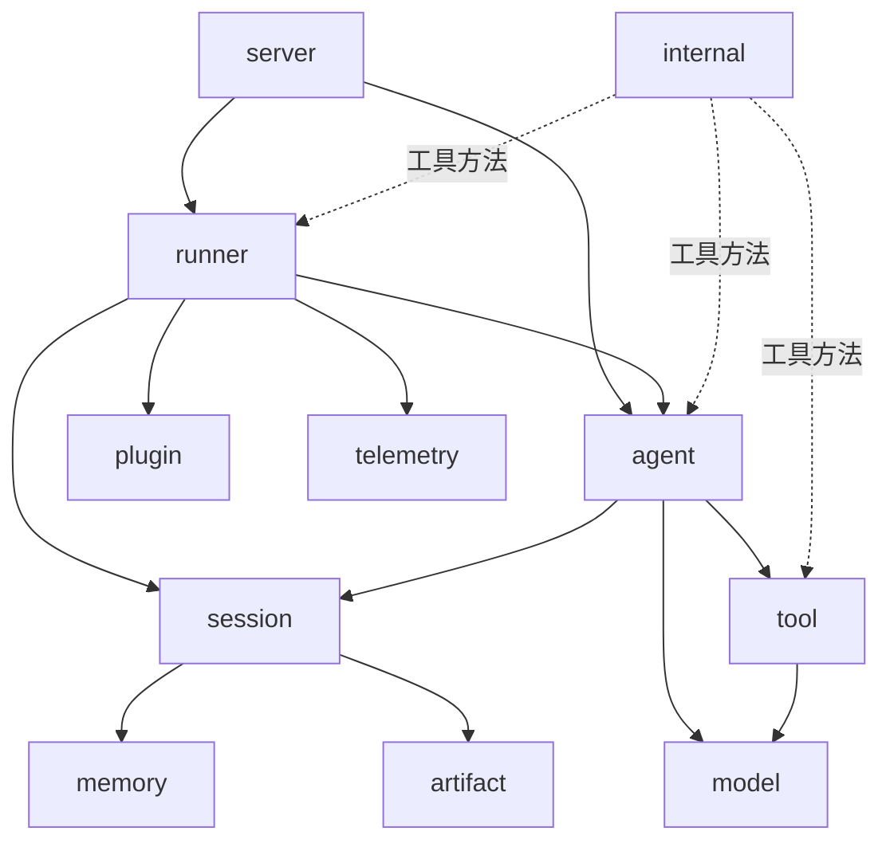

# ADK 架构与设计文档

本目录是 `google.golang.org/adk`（Agent Development Kit for Go）的架构与设计文档集合，面向贡献者、二次开发工程师与技术选型评估者三类读者。

## 一句话定位

ADK 是 Google 开源、Go 编写的"代码优先"智能体开发框架，把大模型、工具、多 Agent 协作、会话与可观测性组装成可生产化的运行时（详见 [00-overview.md](./00-overview.md) §1）。

## 30 秒速览

- ADK 是一个**模块化、可扩展、生产化**的 Agent 框架，11 个顶层包覆盖了从 LLM 接入到远程协议暴露的完整链路（`agent/`、`model/`、`tool/`、`runner/`、`session/`、`artifact/`、`memory/`、`plugin/`、`telemetry/`、`server/`、`internal/`）。
- 核心抽象只有四个：`agent.Agent`（`agent/agent.go:43`）、`runner.Runner`（`runner/runner.go:116`，入口 `Run` 见 `runner/runner.go:131`）、`tool.Tool`（`tool/tool.go:38`）、`session.Service`（`session/service.go:25`）——其余模块都围绕它们展开。
- 框架**模型无关、部署无关**：内置 Gemini 与 Apigee 两种 `model.LLM` 实现，内置 REST、A2A、Agent Engine 三种 server，可独立替换。
- 一次调用的"运行时上下文"由 `agent.InvocationContext`（`agent/context.go:62`）统一封装，把 Session、Memory、Artifacts、RunConfig、用户消息等一站式带到 Agent 内部。
- 所有跨模块流程（单轮对话、工具调用、多 Agent 协作、会话持久化、Live 双向流）都从 `runner.Runner.Run` 或 `runner.Runner.RunLive` 进入，由 `Runner`（`runner/runner.go:116`）统一调度。
- 扩展主要靠三件套：实现核心接口（Agent/Tool/Model/Session Service）、写 `plugin.Plugin`（`plugin/plugin.go`）钩子、把执行栈挂到自定义 server 上。

## 模块鸟瞰（一图）



> **看图指引**：从 `runner` 出发——它是面向用户/外部协议的唯一入口；`agent` 是行为核心，`tool` 与 `model` 是它能调用的两把"武器"；`session`/`artifact`/`memory` 是状态与持久化三件套；`plugin` 横切所有事件流；`telemetry` 横切所有可观测性；`server` 把 `runner` 包装成外部协议。`internal` 是虚线：它不导出公共 API，但为上述模块提供共享实现，扩展时不应直接依赖。

## 三条阅读路径

### 路径 A：我是新贡献者

1. [00-overview.md](./00-overview.md)（必读）—— 顶层架构、依赖关系、核心抽象一览
2. [01-core-flows.md](./01-core-flows.md) 中 **F1 单轮对话** 与 **F2 工具调用** —— 跑通一次最简请求
3. [03-modules/01-agent.md](./03-modules/01-agent.md) —— 智能体抽象、`LLMAgent`、回调链

### 路径 B：我要扩展 / 二次开发

1. [00-overview.md](./00-overview.md) —— 建立整体心智模型
2. [02-extension-points.md](./02-extension-points.md)（**必读**）—— 8 个扩展面 + 边界与禁忌
3. [01-core-flows.md](./01-core-flows.md) 中与你改动相关的流程（如改 Tool 看 F2，改 Session 看 F4）
4. [03-modules/](./03-modules/) 中对应模块（改 Agent 看 [01-agent.md](./03-modules/01-agent.md)，改 Model 看 [02-model.md](./03-modules/02-model.md)）

### 路径 C：我在做技术选型评估

1. [00-overview.md](./00-overview.md) §1 "项目目标与非目标" —— 看清 ADK 解决了什么、没解决什么
2. [00-overview.md](./00-overview.md) §4 "端到端数据流" —— 一次 Run 内部到底发生什么
3. [02-extension-points.md](./02-extension-points.md) §9 "扩展的边界与禁忌" —— 评估锁定风险与升级兼容性
4. [04-appendix.md](./04-appendix.md) §A.1 术语表 + §A.4 进一步阅读 —— 术语对齐与外部参考

## 文档地图

```
docs/architecture/
├── README.md                # ← 你正在读
├── 00-overview.md           # 顶层架构（模块依赖、核心抽象、数据流）
├── 01-core-flows.md         # 5 个端到端核心流程
├── 02-extension-points.md   # 8 个扩展面
├── 03-modules/
│   ├── 01-agent.md          # 智能体抽象 + llmagent/remoteagent/workflowagents
│   ├── 02-model.md          # LLM 接口 + gemini/apigee 实现
│   ├── 03-tool.md           # Tool 接口 + 11 个子工具
│   ├── 04-runner.md         # Runner 运行时
│   ├── 05-session.md        # Session 服务 + database/vertexai
│   ├── 06-artifact.md       # 工件服务 + gcsartifact
│   ├── 07-memory.md         # 长期记忆 + vertexai
│   ├── 08-plugin.md         # 插件机制 + 3 个参考实现
│   ├── 09-telemetry.md      # OpenTelemetry 集成
│   ├── 10-server.md         # adkrest/adka2a/agentengine
│   └── 11-internal.md       # internal 子包附录
└── 04-appendix.md           # 术语表、文件索引、维护说明
```

## 维护说明

- 本文档基于 commit `d06992e2b1ec2c9b95c6070e0fd12d50a43e4c99` 冻结，写入日期 2026-06-08。
- 代码变更影响架构时（新增/删除/重命名顶层包、改变 `Runner` 主流程、新增或废弃公共接口），请在同 PR 中同步修改对应章节，并在 commit 信息中加 `docs(architecture):` 前缀。
- 每章的"延伸阅读"指向具体的子文件；如果链接失效，先检查目标文件是否被重命名，再回退到 [04-appendix.md §A.2 关键文件索引](./04-appendix.md#a2-关键文件索引) 重新定位。
- 当前架构上未覆盖、需后续文档补充说明的点（如 `internal/` 各子包深读、Live 协议细节、第三方对比），统一登记在 [04-appendix.md §A.5](./04-appendix.md#a5-文档维护说明) 的"已知缺口"小节。

## 延伸阅读

- 顶层架构：[00-overview.md](./00-overview.md)
- 端到端流程：[01-core-flows.md](./01-core-flows.md)
- 扩展点：[02-extension-points.md](./02-extension-points.md)
- 附录（术语表 / 文件索引 / 维护）：[04-appendix.md](./04-appendix.md)
- 模块详情索引：[03-modules/](./03-modules/)
