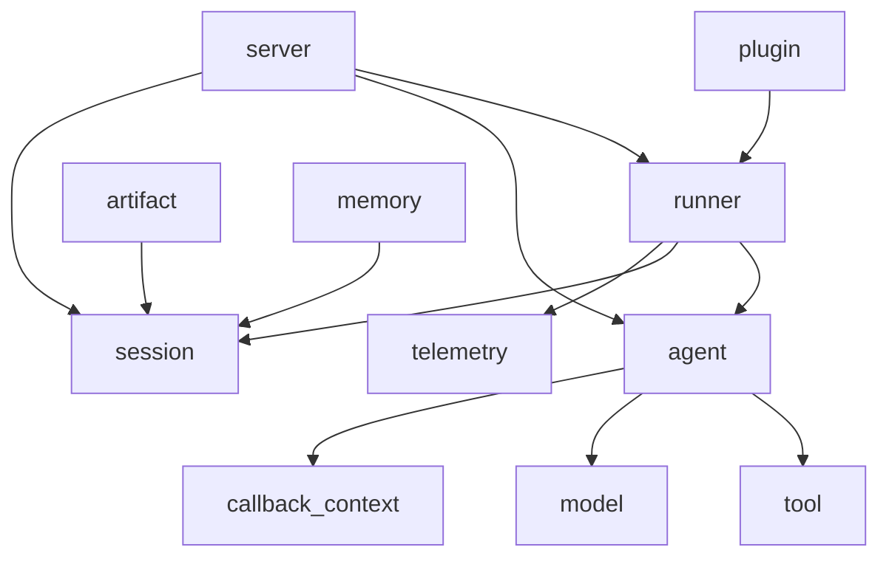
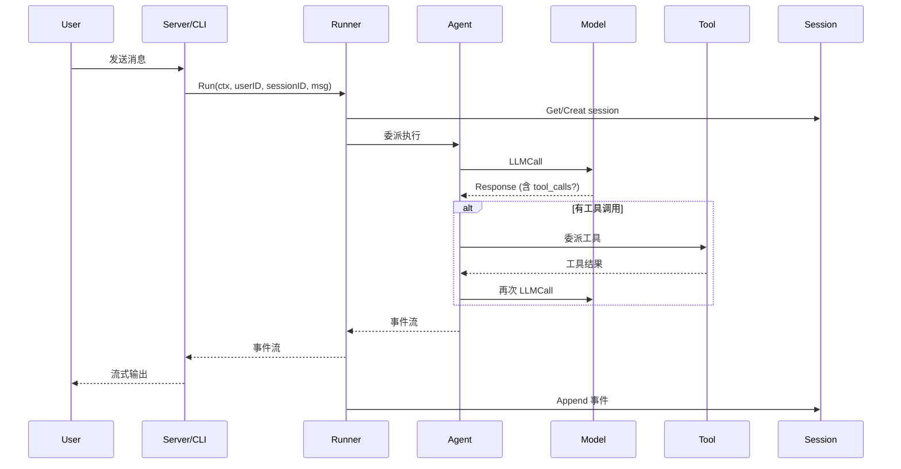

# ADK 架构与设计文档实现计划（子项目 0）

> **For agentic workers:** REQUIRED SUB-SKILL: Use superpowers:subagent-driven-development (recommended) or superpowers:executing-plans to implement this plan task-by-task. Steps use checkbox (`- [ ]`) syntax for tracking.

**Goal:** 在 `/home/wu/oneone/adk/docs/architecture/` 下交付一份中文架构与设计文档，覆盖 11 个顶层模块、5 个端到端流程、所有扩展点。

**Architecture:** 多文件 Markdown 目录结构，顶层 `README.md` 当索引；`00-overview.md` 给整体鸟瞰；`01-core-flows.md` 集中 5 个端到端流程；`02-extension-points.md` 讲扩展面；`03-modules/<n>-<name>.md` 11 个模块详情；`04-appendix.md` 附录。全文使用 Mermaid 图表，引用 Go 源文件用 `path:line` 形式。

**Tech Stack:** Markdown + Mermaid（图表）+ 简体中文（代码标识符、命令、路径保留原文）

**Spec:** `docs/superpowers/specs/2026-06-05-adk-architecture-design.md`
**锁定 commit:** `d06992e2b1ec2c9b95c6070e0fd12d50a43e4c99`

---

## 0. 阅读本计划前请先读完规格

每个写作任务都引用了规格的对应小节。在执行任何任务前，请打开规格文件并通读。

**文件结构（最终交付物）**：

```
docs/architecture/
├── README.md
├── 00-overview.md
├── 01-core-flows.md
├── 02-extension-points.md
├── 03-modules/
│   ├── 01-agent.md
│   ├── 02-model.md
│   ├── 03-tool.md
│   ├── 04-runner.md
│   ├── 05-session.md
│   ├── 06-artifact.md
│   ├── 07-memory.md
│   ├── 08-plugin.md
│   ├── 09-telemetry.md
│   ├── 10-server.md
│   └── 11-internal.md
└── 04-appendix.md
```

**通用写作规则（适用于所有写作任务）**：
- 全文使用简体中文，代码标识符、文件路径、命令保留英文
- 图表用 ```` ```mermaid ```` 代码块包裹
- 引用 Go 源文件用 `` `path/to/file.go:line` `` 形式（带行号）
- 每个 Mermaid 图后必须有 2-4 行"看图指引"文字
- 不要在文档中放置 TODO / TBD / 待补充（写到位为止）
- 每完成一个文件就 commit 一次（粒度 = 单文件）

---

## 阶段 0：设置

### Task 1: 创建目录结构

**Files:**
- Create: `docs/architecture/03-modules/`（目录）

- [ ] **Step 1: 创建子目录**

```bash
mkdir -p /home/wu/oneone/adk/docs/architecture/03-modules
```

- [ ] **Step 2: 验证目录已创建**

```bash
ls -la /home/wu/oneone/adk/docs/architecture/
```

期望输出：除 `03-modules/` 外没有其他文件，但已有 `README.md` 等的计划是正常的（本次任务不创建任何 .md 文件，只创建目录）。

- [ ] **Step 3: commit**

```bash
cd /home/wu/oneone/adk
git add docs/architecture/03-modules/.gitkeep 2>/dev/null || true
# 如果空目录无法 add，可跳过此 commit
```

期望：目录就位即可。如有 `.gitkeep` 之类需要就加，否则此步可标记 N/A。

---

## 阶段 1：源码阅读（11 个模块分批读）

> **重要：源码阅读是为后续写作准备事实底稿。建议在每个 `03-modules/<n>-<name>.md` 写作前先完成对应模块的阅读。**
>
> 阅读方法：对每个文件，先读 `doc.go`（如存在），再读顶级 types/interfaces 的定义，最后读最关键的 1-2 个 .go 文件全文。

### Task 2: 读取 `agent` 模块

**Files:**
- Read-only: `agent/agent.go`、`agent/agent_test.go`、`agent/callback_context.go`、`agent/context.go`、`agent/doc.go`、`agent/live.go`、`agent/loader.go`、`agent/loader_test.go`、`agent/run_config.go`、`agent/llmagent/*`、`agent/remoteagent/*`、`agent/workflowagents/*`

- [ ] **Step 1: 通读 `agent/doc.go` 与 `agent/agent.go`**

```bash
wc -l /home/wu/oneone/adk/agent/doc.go /home/wu/oneone/adk/agent/agent.go
head -100 /home/wu/oneone/adk/agent/agent.go
```

记录：
- `Agent` 接口的所有方法签名
- `Agent` 的设计目的（一句话）

- [ ] **Step 2: 通读 `agent/callback_context.go` 与 `agent/context.go`**

记录：
- `CallbackContext` 的字段
- `ReadonlyContext` 与 `CallbackContext` 的差异
- `tool.Context` 是否与 `agent.CallbackContext` 共享

- [ ] **Step 3: 通读 `agent/live.go`**

记录：
- Live API 的入口函数（`RunLive` 或类似）
- 与非 Live 流程的核心差异

- [ ] **Step 4: 通读 `agent/loader.go`**

记录：
- Agent 加载机制（YAML？代码？）
- 典型用法

- [ ] **Step 5: 列出 `agent/llmagent/` 下的所有文件**

```bash
ls -la /home/wu/oneone/adk/agent/llmagent/
```

记录每个子文件的角色（一行说明）。

- [ ] **Step 6: 列出 `agent/remoteagent/` 下的所有文件并通读核心文件**

```bash
ls -la /home/wu/oneone/adk/agent/remoteagent/
```

记录 RemoteAgent 的定位、调用协议。

- [ ] **Step 7: 列出 `agent/workflowagents/` 下的所有子目录与文件**

```bash
find /home/wu/oneone/adk/agent/workflowagents -maxdepth 2 -type f -name "*.go"
```

记录 3 个工作流 Agent（Sequential / Parallel / Loop）的关键 API。

- [ ] **Step 8: 整理阅读笔记**

将上述记录整理为一份内部笔记（仅做总结用，不 commit），为后续 Task 26 写 `03-modules/01-agent.md` 准备事实底稿。

### Task 3: 读取 `model` 模块

**Files:**
- Read-only: `model/llm.go`、`model/llm_test.go`、`model/apigee/*`、`model/gemini/*`

- [ ] **Step 1: 通读 `model/llm.go`**

```bash
wc -l /home/wu/oneone/adk/model/llm.go
head -150 /home/wu/oneone/adk/model/llm.go
```

记录：
- `LLM` 接口的所有方法签名
- `Request` / `Response` / `Part` 等核心结构

- [ ] **Step 2: 列出 `model/apigee/` 与 `model/gemini/` 下所有文件**

```bash
ls -la /home/wu/oneone/adk/model/apigee/ /home/wu/oneone/adk/model/gemini/
```

- [ ] **Step 3: 通读 `model/gemini/` 的核心文件（找含 `func New` 或核心 type 定义的文件）**

记录 Gemini 实现的入口与配置。

- [ ] **Step 4: 通读 `model/apigee/` 的核心文件**

记录 Apigee 实现的入口与适用场景。

- [ ] **Step 5: 整理阅读笔记**

### Task 4: 读取 `tool` 模块

**Files:**
- Read-only: `tool/tool.go`、`tool/tool_test.go`、`tool/context.go`、`tool/context_test.go`、所有 `tool/<sub>/*` 下的文件

- [ ] **Step 1: 通读 `tool/tool.go` 与 `tool/context.go`**

记录：
- `Tool` 接口签名
- `Context` 接口与 `CallbackContext` 的差异
- `Declaration`、`FunctionDeclaration` 等结构

- [ ] **Step 2: 列出 11 个 tool 子包的文件清单**

```bash
for d in /home/wu/oneone/adk/tool/*/; do
  echo "=== $d ==="
  ls -la "$d"
done
```

- [ ] **Step 3: 对每个子包读 `doc.go`（如有）或核心文件 1 个**

11 个子包：
- `agenttool/`
- `exampletool/`
- `exitlooptool/`
- `functiontool/`
- `geminitool/`
- `loadartifactstool/`
- `loadmemorytool/`
- `mcptoolset/`
- `preloadmemorytool/`
- `skilltoolset/`
- `toolconfirmation/`

每个子包记录 1-2 行：定位 + 关键 API。

- [ ] **Step 4: 整理阅读笔记**

### Task 5: 读取 `runner` 模块

**Files:**
- Read-only: `runner/runner.go`、`runner/runner_test.go`、`runner/live_runner_test.go`

- [ ] **Step 1: 通读 `runner/runner.go` 全文**

```bash
wc -l /home/wu/oneone/adk/runner/runner.go
```

记录：
- `Runner` struct 的所有字段
- `New()` 构造函数签名
- `Run()` / `RunLive()` 入口签名
- 内部状态机（如有）

- [ ] **Step 2: 通读 `runner_test.go` 头 100 行**

记录：典型用法（如何构造 Runner、调用 Run、断言结果）。

- [ ] **Step 3: 整理阅读笔记**

### Task 6: 读取 `session` 模块

**Files:**
- Read-only: `session/doc.go`、`session/service.go`、`session/session.go`、`session/inmemory.go`、`session/database/*`、`session/vertexai/*`

- [ ] **Step 1: 通读 `session/doc.go`**

记录：Session 包的设计目标（应有 1-2 段概述）。

- [ ] **Step 2: 通读 `session/session.go`**

记录：`Session`、`Event`、`EventActions` 等核心结构。

- [ ] **Step 3: 通读 `session/service.go`**

记录：`Service` 接口所有方法、`ListRequest` 等参数结构。

- [ ] **Step 4: 通读 `session/inmemory.go` 头 100 行**

记录：内存实现的初始化与典型路径。

- [ ] **Step 5: 列出 `session/database/` 与 `session/vertexai/` 的所有文件**

```bash
find /home/wu/oneone/adk/session/database /home/wu/oneone/adk/session/vertexai -type f -name "*.go" 2>/dev/null
```

- [ ] **Step 6: 整理阅读笔记**

### Task 7: 读取 `artifact` 模块

**Files:**
- Read-only: `artifact/service.go`、`artifact/inmemory.go`、`artifact/gcsartifact/*`

- [ ] **Step 1: 通读 `artifact/service.go`**

记录：`Service` 接口、`Key` 命名规则。

- [ ] **Step 2: 通读 `artifact/inmemory.go` 头 50 行**

记录：内存实现。

- [ ] **Step 3: 列出 `artifact/gcsartifact/` 下所有文件并通读核心文件**

```bash
ls -la /home/wu/oneone/adk/artifact/gcsartifact/
```

记录：GCS 实现的初始化、bucket 配置。

- [ ] **Step 4: 整理阅读笔记**

### Task 8: 读取 `memory` 模块

**Files:**
- Read-only: `memory/service.go`、`memory/inmemory.go`、`memory/vertexai/*`

- [ ] **Step 1: 通读 `memory/service.go`**

记录：`Service` 接口、`SearchRequest` 等。

- [ ] **Step 2: 通读 `memory/inmemory.go` 头 50 行**

- [ ] **Step 3: 列出 `memory/vertexai/` 下所有文件并通读核心文件**

```bash
ls -la /home/wu/oneone/adk/memory/vertexai/
```

- [ ] **Step 4: 整理阅读笔记**

### Task 9: 读取 `plugin` 模块

**Files:**
- Read-only: `plugin/plugin.go`、`plugin/plugin_test.go`、`plugin/plugin_manager_test.go`、`plugin/functioncallmodifier/*`、`plugin/loggingplugin/*`、`plugin/retryandreflect/*`

- [ ] **Step 1: 通读 `plugin/plugin.go` 全文**

```bash
wc -l /home/wu/oneone/adk/plugin/plugin.go
```

记录：
- `Plugin` 接口的所有方法（钩子列表）
- 每个钩子的 before/after 语义
- `PluginManager` 的注册与生命周期

- [ ] **Step 2: 列出 3 个参考实现的所有文件**

```bash
for d in /home/wu/oneone/adk/plugin/functioncallmodifier /home/wu/oneone/adk/plugin/loggingplugin /home/wu/oneone/adk/plugin/retryandreflect; do
  echo "=== $d ==="
  find "$d" -type f -name "*.go"
done
```

- [ ] **Step 3: 对每个参考实现通读核心 1-2 个文件**

记录：每个 Plugin 实现了哪些钩子、解决了什么问题。

- [ ] **Step 4: 整理阅读笔记**

### Task 10: 读取 `telemetry` 模块

**Files:**
- Read-only: `telemetry/config.go`、`telemetry/setup_otel.go`、`telemetry/telemetry.go`、`telemetry/telemetry_test.go`

- [ ] **Step 1: 通读 `telemetry/telemetry.go` 全文**

记录：核心 span / event 类型。

- [ ] **Step 2: 通读 `telemetry/config.go`**

记录：配置项。

- [ ] **Step 3: 通读 `telemetry/setup_otel.go`**

记录：OpenTelemetry 初始化流程。

- [ ] **Step 4: 整理阅读笔记**

### Task 11: 读取 `server` 模块

**Files:**
- Read-only: `server/doc.go`、`server/adka2a/*`、`server/adkrest/*`、`server/agentengine/*`

- [ ] **Step 1: 通读 `server/doc.go`**

- [ ] **Step 2: 列出 3 个子包的文件清单**

```bash
for d in /home/wu/oneone/adk/server/adka2a /home/wu/oneone/adk/server/adkrest /home/wu/oneone/adk/server/agentengine; do
  echo "=== $d ==="
  find "$d" -maxdepth 2 -type f -name "*.go" 2>/dev/null
done
```

- [ ] **Step 3: 对每个子包通读核心 1-2 个文件**

记录：
- `adkrest` 的协议（HTTP REST？路由？）
- `adka2a` 的协议（A2A 协议相关）
- `agentengine` 的定位（与 Vertex AI Agent Engine 的集成？）

- [ ] **Step 4: 整理阅读笔记**

### Task 12: 读取 `internal` 子包

**Files:**
- Read-only: `internal/**`（约 30+ 个 .go 文件）

- [ ] **Step 1: 列出所有 internal 子包**

```bash
ls -la /home/wu/oneone/adk/internal/
```

- [ ] **Step 2: 对每个子包只读 `doc.go`（如存在）与包级 README**

记录：每个子包 1 行说明。

- [ ] **Step 3: 整理阅读笔记**

预期：本任务产出的笔记较粗，作为 `03-modules/11-internal.md` 附录式文档的事实底稿。

### Task 13: 读取 `examples/` 找最佳代码片段

**Files:**
- Read-only: `examples/**`

- [ ] **Step 1: 列出 examples 目录结构**

```bash
ls -la /home/wu/oneone/adk/examples/
```

- [ ] **Step 2: 找最短的"Hello Agent"示例**

```bash
find /home/wu/oneone/adk/examples -name "main.go" -exec wc -l {} \; | sort -n | head -5
```

- [ ] **Step 3: 通读最短示例**

记录：它用到了哪些核心抽象（在后续 README/00-overview 中要引用）。

- [ ] **Step 4: 找含工具调用、多 Agent、Session 持久化的示例各 1 个**

每个示例记录 1-2 行定位。

- [ ] **Step 5: 整理阅读笔记**

---

## 阶段 2：顶层文档写作（5 个文件）

> 写作顺序建议：先写 README（再小的也不早于 00-overview，因为 README 要引用它），但实际上 04-appendix 应该在所有模块文档之前写完，这样其他文档可以引用附录术语表。
>
> **调整后的写作顺序**：04-appendix → 00-overview → 01-core-flows → 02-extension-points → README（最后写，因为 README 是入口索引）

### Task 14: 写 `04-appendix.md`

**Files:**
- Create: `docs/architecture/04-appendix.md`

**参考：** 规格 §3.6

- [ ] **Step 1: 写 A.1 术语表**

中文列表，每条格式：

```markdown
- **<术语>**（English）：<一句话定义>。来源：`<file:line>`。
```

至少 30 个术语，来源 agent / runner / session / tool / model / plugin 等核心包。

- [ ] **Step 2: 写 A.2 关键文件索引**

按字母序列出 30-50 个 .go 文件，每个 1 行：

```markdown
- `<path>`：<一句话说明它在做什么>
```

- [ ] **Step 3: 写 A.3 外部生态对比（占位即可）**

```markdown
## A.3 与外部生态的对比

> 本节为占位。后续若有可信来源可补充与 LangChain / LlamaIndex / CrewAI / AutoGen 的差异点。
```

- [ ] **Step 4: 写 A.4 进一步阅读**

```markdown
## A.4 进一步阅读

- ADK 官方文档：[URL]
- Google ADK-Go 仓库：[URL]（如可公开访问）
- 关键 issue / PR：[占位，由维护者补充]
```

- [ ] **Step 5: 写 A.5 文档维护说明**

包含：
- 当前锁定 commit SHA
- 同步更新约定（"代码变更影响架构时，同 PR 修改本文档"）
- 维护者角色（占位）
- 已知缺口（基于本次写作发现的事实点）

- [ ] **Step 6: 验证文件可正常渲染**

```bash
ls -la /home/wu/oneone/adk/docs/architecture/04-appendix.md
wc -l /home/wu/oneone/adk/docs/architecture/04-appendix.md
```

期望：文件存在，行数 100-200 之间。

- [ ] **Step 7: commit**

```bash
cd /home/wu/oneone/adk
git add docs/architecture/04-appendix.md
git commit -m "docs(architecture): add 04-appendix (glossary, file index, maintenance)"
```

### Task 15: 写 `00-overview.md`

**Files:**
- Create: `docs/architecture/00-overview.md`

**参考：** 规格 §3.2

- [ ] **Step 1: 写 §1 项目目标与非目标**

格式：

```markdown
## 1. 项目目标与非目标

### 目标
- [目标 1]
- [目标 2]

### 非目标
- [非目标 1]
```

根据 `README.md` 和 `CONTRIBUTING.md` 内容提炼。

- [ ] **Step 2: 写 §2 模块全景图**

两个 Mermaid 图。

第一个（11 个顶层模块依赖图）：



> **重要：** 上方 Mermaid 是**示意**，写作时必须用 `grep` 验证 import 关系后再画：
> ```bash
> cd /home/wu/oneone/adk
> for m in agent runner tool model session artifact memory plugin telemetry server; do
>   echo "=== $m imports ==="
>   grep -h "google.golang.org/adk/" "$m"/*.go 2>/dev/null | grep -v "google.golang.org/adk/$m" | sort -u
> done
> ```

第二个图（关键子模块）类似。

- [ ] **Step 3: 写 §3 核心抽象一览**

四个最关键类型，每段 2-4 行：

```markdown
### agent.Agent
[接口定义位置、关键方法、设计意图]

### runner.Runner
[同上]

### tool.Tool
[同上]

### session.Session / session.Service
[同上]
```

- [ ] **Step 4: 写 §4 端到端数据流（高层版）**

一个 Mermaid sequenceDiagram：



> **重要：** 上方时序图是**示意**，写作时根据 `runner/runner.go` 实际代码核对每个 hop。

- [ ] **Step 5: 写 §5 一段代码看完所有抽象**

从 `examples/` 选最短示例，10-30 行，逐行注释每个抽象的角色。代码块带 `path:line` 引用。

- [ ] **Step 6: 写 §6 依赖与包边界**

Mermaid 依赖图 + 一段"包边界规矩"说明（哪些模块禁止导入哪些模块）。

- [ ] **Step 7: 写 §7 并发模型**

2-3 段说明：哪些操作并发、哪些串行、是否有全局状态。

- [ ] **Step 8: 写 §8 错误处理与可观测性总览**

1-2 段。

- [ ] **Step 9: 写 §9 设计模式与架构风格**

列举模式：组合优于继承、接口隔离、依赖注入、回调链、策略模式、观察者。

- [ ] **Step 10: 验证文件**

```bash
wc -l /home/wu/oneone/adk/docs/architecture/00-overview.md
```

期望：200-400 行。

- [ ] **Step 11: commit**

```bash
cd /home/wu/oneone/adk
git add docs/architecture/00-overview.md
git commit -m "docs(architecture): add 00-overview (top-level architecture)"
```

### Task 16: 写 `01-core-flows.md`

**Files:**
- Create: `docs/architecture/01-core-flows.md`

**参考：** 规格 §3.3

- [ ] **Step 1: 写文档引言 + 流程总览**

```markdown
# 端到端核心流程

本文档覆盖 ADK 的 5 个最关键端到端流程。每个流程以"场景 → 时序图 → 步骤详解 → 状态变化 → 错误路径 → 延伸阅读"结构组织。

| 编号 | 流程 | 入口 |
|---|---|---|
| F1 | 单轮对话 | `runner.Runner.Run` |
| F2 | 工具调用 | F1 中 Model 返回 tool_calls |
| F3 | 多 Agent 协作 | 父 Agent 配置 sub_agents / agenttool |
| F4 | 长会话与 Session 持久化 | 多轮输入 / 从 SessionID 恢复 |
| F5 | Live 双向流 | `agent.RunLive` 系列 |
```

- [ ] **Step 2: 写 F1 单轮对话**

按规格中的统一模板。代码引用从 `runner/runner.go`、`agent/llmagent/` 找。

- [ ] **Step 3: 写 F2 工具调用**

按规格。注意标注"是 F1 的子流程"。

- [ ] **Step 4: 写 F3 多 Agent 协作**

包含 workflowagents 三种（Sequential / Parallel / Loop）的差异说明。

- [ ] **Step 5: 写 F4 长会话与 Session 持久化**

包含 inmemory / database / vertexai 三种后端的差异。

- [ ] **Step 6: 写 F5 Live 双向流**

包含与 F1 的对比、server 中 Live 的暴露方式。

- [ ] **Step 7: 验证文件**

```bash
wc -l /home/wu/oneone/adk/docs/architecture/01-core-flows.md
```

期望：500-900 行（5 个流程，每个 100-180 行）。

- [ ] **Step 8: commit**

```bash
cd /home/wu/oneone/adk
git add docs/architecture/01-core-flows.md
git commit -m "docs(architecture): add 01-core-flows (5 end-to-end flows)"
```

### Task 17: 写 `02-extension-points.md`

**Files:**
- Create: `docs/architecture/02-extension-points.md`

**参考：** 规格 §3.4

- [ ] **Step 1: 写 §1 总览：可扩展面**

Mermaid 图（8 个扩展面）+ 1 行说明每个面。

- [ ] **Step 2: 写 §2-§8 各个扩展点**

每个扩展点章节包含：核心接口代码片段 + 自定义实现的代码骨架 + 路径引用。

- [ ] **Step 3: 写 §9 扩展的"边界"与禁忌**

```markdown
## 9. 扩展的"边界"与禁忌

### 9.1 不应被覆盖的代码
- `internal/` 子包：内部实现，可能随时变更
- 私有方法（下划线开头）

### 9.2 升级兼容性策略
- 公共接口的破坏性变更应走 deprecation 流程
- ...
```

- [ ] **Step 4: 验证文件**

```bash
wc -l /home/wu/oneone/adk/docs/architecture/02-extension-points.md
```

期望：300-500 行。

- [ ] **Step 5: commit**

```bash
cd /home/wu/oneone/adk
git add docs/architecture/02-extension-points.md
git commit -m "docs(architecture): add 02-extension-points (extension surfaces)"
```

### Task 18: 写 `README.md`（最后写，因为它是入口索引）

**Files:**
- Create: `docs/architecture/README.md`

**参考：** 规格 §3.1

- [ ] **Step 1: 写"一句话定位"和"30 秒速览"**

基于 `00-overview.md` §1 项目目标 提炼。

- [ ] **Step 2: 写"模块鸟瞰" Mermaid 图**

从 `00-overview.md` §2 复制并简化。

- [ ] **Step 3: 写"三条阅读路径"**

格式：

```markdown
### 路径 A：我是新贡献者
1. [00-overview.md](./00-overview.md)（必读）
2. [01-core-flows.md](./01-core-flows.md) 中 F1、F2
3. [03-modules/01-agent.md](./03-modules/01-agent.md)
```

- [ ] **Step 4: 写"文档地图"（目录树）**

```markdown
## 文档地图

```
docs/architecture/
├── README.md          # ← 你正在读
├── 00-overview.md
├── 01-core-flows.md
├── 02-extension-points.md
├── 03-modules/
│   ├── 01-agent.md
│   ├── ...
└── 04-appendix.md
```
```

- [ ] **Step 5: 写"维护说明"**

包含：锁定 commit SHA、"如何更新本文档"指引、当前版本号。

- [ ] **Step 6: 验证文件**

```bash
wc -l /home/wu/oneone/adk/docs/architecture/README.md
```

期望：80-150 行（它是入口，不应过长）。

- [ ] **Step 7: commit**

```bash
cd /home/wu/oneone/adk
git add docs/architecture/README.md
git commit -m "docs(architecture): add README (entry point + reading paths)"
```

---

## 阶段 3：模块详情写作（11 个文件）

> 共同规则：
> - Phase 1（5 个核心模块）按规格 §3.5 完整 10 节模板写
> - Phase 2+3（6 个）适当精简，可合并第 7-9 节
> - 每个文件完成后立即 commit

### Task 19: 写 `03-modules/01-agent.md`

**Files:**
- Create: `docs/architecture/03-modules/01-agent.md`

**参考：** 规格 §3.5 完整模板 + Task 2 阅读笔记

- [ ] **Step 1: §1 定位与边界**

写一句话定位 + 子包清单（llmagent / remoteagent / workflowagents）+ 依赖关系。

- [ ] **Step 2: §2 核心接口与类型**

```markdown
## 2. 核心接口与类型

### Agent
[从 agent/agent.go 提取接口定义，标注 file:line]

[设计意图 1-2 段]
```

包括：`Agent`、`LLMAgent`、workflowagents 中的 `SequentialAgent` / `ParallelAgent` / `LoopAgent`、`RemoteAgent`。

- [ ] **Step 3: §3 关键数据结构**

`CallbackContext`、`InvocationContext`、`ReadonlyContext`、`Event` 等。

- [ ] **Step 4: §4 关键流程**

2-3 个：Agent.Run 的内部状态机、Callback 链执行顺序、Workflow Agent 的编排。

- [ ] **Step 5: §5 扩展点**

引用 `02-extension-points.md` §2 写一个自定义 Agent。

- [ ] **Step 6: §6 错误处理**

`Agent` 接口方法可返回的错误类型。

- [ ] **Step 7: §7 并发与性能考量**

- [ ] **Step 8: §8 依赖与被依赖**

Mermaid graph。

- [ ] **Step 9: §9 测试与可观察性**

测试文件位置、telemetry 埋点位置。

- [ ] **Step 10: §10 延伸阅读**

引用 `01-core-flows.md` 中 F1、F3。

- [ ] **Step 11: 验证文件 + commit**

```bash
wc -l /home/wu/oneone/adk/docs/architecture/03-modules/01-agent.md
cd /home/wu/oneone/adk
git add docs/architecture/03-modules/01-agent.md
git commit -m "docs(architecture): add 03-modules/01-agent"
```

期望：200-350 行。

### Task 20: 写 `03-modules/02-model.md`

**Files:**
- Create: `docs/architecture/03-modules/02-model.md`

**参考：** 规格 §3.5 + Task 3 阅读笔记

- [ ] **Step 1-10:** 同 Task 19 模式，按 model 模块特性调整内容

要点：
- §2 核心接口 `LLM`、`Request`、`Response`、`Part`
- §3 `Content`、`FunctionCall`、`FunctionResponse` 等
- §4 关键流程：流式输出、tool calling、structured output
- §8 依赖：被 agent/tool 依赖；依赖 model/apigee、model/gemini

- [ ] **Step 11: 验证文件 + commit**

```bash
wc -l /home/wu/oneone/adk/docs/architecture/03-modules/02-model.md
cd /home/wu/oneone/adk
git add docs/architecture/03-modules/02-model.md
git commit -m "docs(architecture): add 03-modules/02-model"
```

期望：150-300 行。

### Task 21: 写 `03-modules/03-tool.md`

**Files:**
- Create: `docs/architecture/03-modules/03-tool.md`

**参考：** 规格 §3.5 + Task 4 阅读笔记

- [ ] **Step 1-10:** 同 Task 19 模式

要点：
- §2 核心接口 `Tool`、`Declaration`
- §3 11 个子工具的核心数据结构
- §4 关键流程：tool 调用的解析、结果回灌、tool confirmation
- §5 3 种实现路径
- §8 11 个子工具的依赖与定位（可用表格）

- [ ] **Step 11: 验证文件 + commit**

```bash
wc -l /home/wu/oneone/adk/docs/architecture/03-modules/03-tool.md
cd /home/wu/oneone/adk
git add docs/architecture/03-modules/03-tool.md
git commit -m "docs(architecture): add 03-modules/03-tool"
```

期望：250-400 行（11 个子工具要讲清楚）。

### Task 22: 写 `03-modules/04-runner.md`

**Files:**
- Create: `docs/architecture/03-modules/04-runner.md`

**参考：** 规格 §3.5 + Task 5 阅读笔记

- [ ] **Step 1-10:** 同 Task 19 模式

要点：
- §2 `Runner` struct
- §3 `RunConfig`、`RunOptions`
- §4 关键流程：Run / RunLive 内部状态机
- §8 Runner 依赖：agent、session、telemetry、tool

- [ ] **Step 11: 验证文件 + commit**

```bash
wc -l /home/wu/oneone/adk/docs/architecture/03-modules/04-runner.md
cd /home/wu/oneone/adk
git add docs/architecture/03-modules/04-runner.md
git commit -m "docs(architecture): add 03-modules/04-runner"
```

期望：200-300 行。

### Task 23: 写 `03-modules/05-session.md`

**Files:**
- Create: `docs/architecture/03-modules/05-session.md`

**参考：** 规格 §3.5 + Task 6 阅读笔记

- [ ] **Step 1-10:** 同 Task 19 模式

要点：
- §2 `Service` 接口
- §3 `Session`、`Event`、`EventActions`
- §4 关键流程：Append、Get、List
- §5 扩展：实现自定义 Session Backend
- §8 多种 backend 对比

- [ ] **Step 11: 验证文件 + commit**

```bash
wc -l /home/wu/oneone/adk/docs/architecture/03-modules/05-session.md
cd /home/wu/oneone/adk
git add docs/architecture/03-modules/05-session.md
git commit -m "docs(architecture): add 03-modules/05-session"
```

期望：200-350 行。

### Task 24: 写 `03-modules/06-artifact.md`

**Files:**
- Create: `docs/architecture/03-modules/06-artifact.md`

**参考：** 规格 §3.5（精简版）+ Task 7 阅读笔记

- [ ] **Step 1-10:** 按精简模板

要点：
- §2 `Service` 接口
- §3 `Key` 命名规则
- §4 关键流程：Save、Load、List
- §8 两种 backend（inmemory、gcsartifact）

- [ ] **Step 11: 验证文件 + commit**

```bash
wc -l /home/wu/oneone/adk/docs/architecture/03-modules/06-artifact.md
cd /home/wu/oneone/adk
git add docs/architecture/03-modules/06-artifact.md
git commit -m "docs(architecture): add 03-modules/06-artifact"
```

期望：100-200 行。

### Task 25: 写 `03-modules/07-memory.md`

**Files:**
- Create: `docs/architecture/03-modules/07-memory.md`

**参考：** 规格 §3.5（精简版）+ Task 8 阅读笔记

- [ ] **Step 1-10:** 按精简模板

要点：
- §2 `Service` 接口、`SearchRequest`
- §4 关键流程：Search、Add
- §8 两种 backend（inmemory、vertexai）

- [ ] **Step 11: 验证文件 + commit**

```bash
wc -l /home/wu/oneone/adk/docs/architecture/03-modules/07-memory.md
cd /home/wu/oneone/adk
git add docs/architecture/03-modules/07-memory.md
git commit -m "docs(architecture): add 03-modules/07-memory"
```

期望：100-200 行。

### Task 26: 写 `03-modules/08-plugin.md`

**Files:**
- Create: `docs/architecture/03-modules/08-plugin.md`

**参考：** 规格 §3.5（完整版）+ Task 9 阅读笔记

- [ ] **Step 1-10:** 按完整模板

要点：
- §2 `Plugin` 接口的 13 个钩子
- §3 钩子的执行顺序与生命周期
- §4 关键流程：插件注册、事件传播
- §5 3 个参考实现（loggingplugin / functioncallmodifier / retryandreflect）
- §8 `PluginManager`

- [ ] **Step 11: 验证文件 + commit**

```bash
wc -l /home/wu/oneone/adk/docs/architecture/03-modules/08-plugin.md
cd /home/wu/oneone/adk
git add docs/architecture/03-modules/08-plugin.md
git commit -m "docs(architecture): add 03-modules/08-plugin"
```

期望：250-400 行。

### Task 27: 写 `03-modules/09-telemetry.md`

**Files:**
- Create: `docs/architecture/03-modules/09-telemetry.md`

**参考：** 规格 §3.5（精简版）+ Task 10 阅读笔记

- [ ] **Step 1-10:** 按精简模板

要点：
- §2 核心 span / event 类型
- §4 关键流程：OTel 初始化、trace 关联
- §8 与 OTel 的集成

- [ ] **Step 11: 验证文件 + commit**

```bash
wc -l /home/wu/oneone/adk/docs/architecture/03-modules/09-telemetry.md
cd /home/wu/oneone/adk
git add docs/architecture/03-modules/09-telemetry.md
git commit -m "docs(architecture): add 03-modules/09-telemetry"
```

期望：100-200 行。

### Task 28: 写 `03-modules/10-server.md`

**Files:**
- Create: `docs/architecture/03-modules/10-server.md`

**参考：** 规格 §3.5（完整版）+ Task 11 阅读笔记

- [ ] **Step 1-10:** 按完整模板

要点：
- §2 3 个子包的核心 API
- §3 协议细节（HTTP REST、A2A、Agent Engine）
- §4 关键流程：启动、路由、Live 流
- §5 扩展：实现自定义 server
- §8 三者的对比与选择指南

- [ ] **Step 11: 验证文件 + commit**

```bash
wc -l /home/wu/oneone/adk/docs/architecture/03-modules/10-server.md
cd /home/wu/oneone/adk
git add docs/architecture/03-modules/10-server.md
git commit -m "docs(architecture): add 03-modules/10-server"
```

期望：200-350 行。

### Task 29: 写 `03-modules/11-internal.md`

**Files:**
- Create: `docs/architecture/03-modules/11-internal.md`

**参考：** 规格 §3.5（附录式）+ Task 12 阅读笔记

- [ ] **Step 1-10:** 附录式精简

要点：
- §1 internal 包的定位与使用原则
- §2 子包清单（按目录分组）
- §3 每个子包 1 行说明（表格）
- 后续节可省略或简短带过

- [ ] **Step 11: 验证文件 + commit**

```bash
wc -l /home/wu/oneone/adk/docs/architecture/03-modules/11-internal.md
cd /home/wu/oneone/adk
git add docs/architecture/03-modules/11-internal.md
git commit -m "docs(architecture): add 03-modules/11-internal"
```

期望：80-150 行。

---

## 阶段 4：验证

### Task 30: 验证所有 Mermaid 图能渲染

**Files:** N/A（只读检查）

- [ ] **Step 1: 提取所有 Mermaid 块到临时文件**

```bash
cd /home/wu/oneone/adk
mkdir -p /tmp/mmd-check
for f in $(find docs/architecture -name "*.md"); do
  base=$(basename "$f" .md)
  awk '/^```mermaid$/,/^```$/' "$f" > "/tmp/mmd-check/$base.mmd"
done
ls -la /tmp/mmd-check/
```

- [ ] **Step 2: 用 mermaid CLI 验证（如已安装）**

```bash
which mmdc && mmdc -i /tmp/mmd-check/00-overview.mmd -o /tmp/mmd-check/00-overview.svg
```

期望：如果 mmdc 已安装，所有 .mmd 文件应成功转为 .svg，无错误。

- [ ] **Step 3: 手动目检每个 Mermaid 图**

对每个 Mermaid 图，确认：
- 节点命名一致
- 边方向正确
- 文字解读段落存在

- [ ] **Step 4: 修复发现的问题（每个文件一个独立 commit）**

```bash
cd /home/wu/oneone/adk
# 修哪个文件就 add 哪个
git add docs/architecture/<file>
git commit -m "fix(architecture): correct mermaid diagram in <file>"
```

### Task 31: 验证所有 `file:line` 引用真实存在

**Files:** N/A（只读检查 + 必要时修复）

- [ ] **Step 1: 提取所有 `path/to/file.go:line` 形式引用**

```bash
cd /home/wu/oneone/adk
grep -rhoE '[a-zA-Z_/.-]+\.go:[0-9]+' docs/architecture/ | sort -u > /tmp/file-refs.txt
wc -l /tmp/file-refs.txt
head /tmp/file-refs.txt
```

- [ ] **Step 2: 对每个引用，验证文件与行号真实存在**

```bash
cd /home/wu/oneone/adk
while IFS=: read -r file line; do
  if [ ! -f "$file" ]; then
    echo "MISSING FILE: $file"
  elif ! sed -n "${line}p" "$file" | grep -q .; then
    echo "EMPTY LINE: $file:$line"
  fi
done < /tmp/file-refs.txt
```

期望：无 MISSING FILE 输出；EMPTY LINE 数量在合理范围（可能因代码注释或空行造成）。

- [ ] **Step 3: 修复错误引用（每个文件一个独立 commit）**

如发现引用指向不存在的代码，先定位真实代码位置，修正引用，重新 commit。

### Task 32: 验证所有交叉引用（链接）有效

**Files:** N/A（只读检查 + 必要时修复）

- [ ] **Step 1: 提取所有 Markdown 链接**

```bash
cd /home/wu/oneone/adk
grep -rhoE '\]\([^)]+\.md[^)]*\)' docs/architecture/ | sed 's/^](//' | sed 's/)$//' | sort -u > /tmp/links.txt
cat /tmp/links.txt
```

- [ ] **Step 2: 验证每个链接指向的文件存在**

```bash
cd /home/wu/oneone/adk/docs/architecture
while IFS= read -r link; do
  # 跳过绝对 URL
  if [[ "$link" == http* ]]; then continue; fi
  if [ ! -f "$link" ]; then
    echo "BROKEN LINK: $link"
  fi
done < /tmp/links.txt
```

期望：无 BROKEN LINK。

- [ ] **Step 3: 修复错误链接**

### Task 33: 最终整体检查

**Files:** N/A

- [ ] **Step 1: 统计总行数与页数**

```bash
cd /home/wu/oneone/adk
find docs/architecture -name "*.md" -exec wc -l {} \; | sort -rn
echo "---"
find docs/architecture -name "*.md" -exec wc -l {} \; | awk '{sum+=$1} END {print "Total: " sum " lines"}'
```

期望：总行数在 1500-3000 之间（30-45 页 × 约 50-70 行/页）。

- [ ] **Step 2: 检查无占位符残留**

```bash
cd /home/wu/oneone/adk
grep -rn "TBD\|TODO\|FIXME\|XXX\|待补充\|待完善" docs/architecture/ 2>&1 | head -20
```

期望：仅在 04-appendix.md "已知缺口"小节有受控的 TODO 标记，其他位置无占位符。

- [ ] **Step 3: 检查所有 Mermaid 图都有图后解读**

```bash
cd /home/wu/oneone/adk
for f in $(find docs/architecture -name "*.md"); do
  # 数 mermaid 块数量
  mmd_count=$(grep -c '^```mermaid$' "$f")
  # 数"看图指引"或类似解读段落
  # 简化判断：紧跟 mermaid 块后 5 行内是否有非空文字
  echo "$f: $mmd_count mermaid blocks"
done
```

- [ ] **Step 4: 更新 04-appendix.md 的"已知缺口"小节**

把验证过程中发现的、与代码可能漂移的点记录到 04-appendix.md A.5 节。

- [ ] **Step 5: 最终 commit**

```bash
cd /home/wu/oneone/adk
git add docs/architecture/
git status --short
git commit -m "docs(architecture): final review pass, update known gaps in appendix" || echo "no changes"
```

- [ ] **Step 6: 输出完成摘要**

```bash
cd /home/wu/oneone/adk
echo "=== Final file tree ==="
find docs/architecture -type f | sort
echo ""
echo "=== Commit history ==="
git log --oneline -30
```

---

## 验收清单

完成后对照规格 §5 验收标准逐条检查：

- [ ] 完整性：15 个目标文件全部存在
- [ ] 准确性：所有 Mermaid 图、关键代码引用、数据流描述有效
- [ ] 可读性：30 秒速览能让新读者说"ADK 是什么"
- [ ] 可验证：所有 `file:line` 引用能跳转
- [ ] 图表质量：所有 Mermaid 图有文字解读
- [ ] 不重复：跨模块流程集中在 01-core-flows.md
- [ ] 维护友好：04-appendix.md 含维护说明

---

## 风险与回退

- **风险 1：源码量大，单次任务上下文超限**
  - 应对：Task 2-12 每任务只读 1 个模块的文件，避免一次读全部
- **风险 2：Mermaid 语法错误导致图不渲染**
  - 应对：Task 30 集中验证，发现问题分文件修复
- **风险 3：跨模块流程描述与代码不一致**
  - 应对：在 Task 16 写 01-core-flows.md 时，对每个 hop 都用 `grep` 在代码中找对应函数
- **风险 4：执行时间超长**
  - 应对：本计划设计为可分批执行。每个文件一个独立 commit，可随时中断/恢复。
