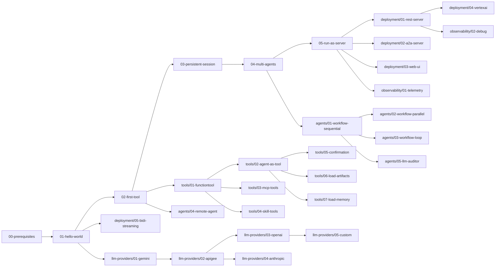

# ADK 入门与上手教程实现计划（子项目 12）

> **For agentic workers:** REQUIRED SUB-SKILL: Use superpowers:subagent-driven-development (recommended) or superpowers:executing-plans to implement this plan task-by-task. Steps use checkbox (`- [ ]`) syntax for tracking.

**Goal:** 在 `/home/wu/oneone/adk/docs/tutorials/` 下交付 31 个中文教程 Markdown 文件 + 2 个新 Go LLM 适配器示例（OpenAI/Anthropic 兼容），让零 LLM 经验的 Go 开发者 1 小时内跑通第一个 agent。

**Architecture:** 6 主题目录分层组织（入门层严格线性 5 步；其余目录内线性 + 跨目录可跳读）；每个教程遵循"概念 → 完整代码 → 逐段讲解 → 准备与运行 → 常见错误 → 延伸阅读"统一模板；与 `docs/architecture/` 互引，指向 `examples/` 中真实可运行代码；Mermaid 图代替截图。

**Tech Stack:** Markdown + Mermaid + 简体中文 + Go（2 个新 LLM 适配器）

**Spec:** `docs/superpowers/specs/2026-06-08-adk-tutorials-design.md`
**锁定 commit:** `d06992e2b1ec2c9b95c6070e0fd12d50a43e4c99`

---

## 0. 通用写作规则（所有任务遵守）

每完成一个文件立即 commit（粒度 = 单文件）。

教程统一模板见规格 §3，本计划各任务只写"任务特定指引"。

每个教程结尾的"延伸阅读"必须含：
- 1-2 个到 `docs/architecture/` 的具体章节链接
- 1 个到 `examples/<dir>/` 的源代码链接
- 1 个占位（"未来子项目深读"）

每完成一个文件验证：
- 文件存在，行数在 200-450 范围
- Mermaid 图语法闭合、节点 ID 唯一
- 5+ 个 `file:line` 引用真实（基于 spec 第 5 节验证方式）
- 跨目录链接目标存在
- 无 TODO/TBD 占位

---

## 阶段 A：基础设施

### Task 1: 创建 6 个主题子目录

**Files:**
- Create: 6 directories under `docs/tutorials/`

- [ ] **Step 1: 创建子目录**

```bash
cd /home/wu/oneone/adk
mkdir -p docs/tutorials/01-getting-started \
         docs/tutorials/02-tools \
         docs/tutorials/03-agents \
         docs/tutorials/04-deployment \
         docs/tutorials/05-llm-providers \
         docs/tutorials/06-observability
ls -la docs/tutorials/
```

期望：6 个子目录全部创建。

- [ ] **Step 2: 添加占位文件（如 git 需要）**

```bash
cd /home/wu/oneone/adk
touch docs/tutorials/01-getting-started/.gitkeep \
      docs/tutorials/02-tools/.gitkeep \
      docs/tutorials/03-agents/.gitkeep \
      docs/tutorials/04-deployment/.gitkeep \
      docs/tutorials/05-llm-providers/.gitkeep \
      docs/tutorials/06-observability/.gitkeep
```

- [ ] **Step 3: commit**

```bash
cd /home/wu/oneone/adk
git add docs/tutorials/
git -c user.name='wu' -c user.email='wu@local' commit -m "chore(tutorials): scaffold 6 topic subdirectories"
```

### Task 2: 写 `00-prerequisites.md`

**Files:**
- Create: `docs/tutorials/00-prerequisites.md`

**参考：** 规格 §4.1

- [ ] **Step 1: 写 §1-§2 环境要求与 Go 安装**

```markdown
# 前置条件

## 1. 环境要求

- **Go 1.25+**（ADK 使用 Go 1.25 的新特性）
- 操作系统：macOS / Linux / Windows
- 网络：能访问 Google API（部分示例需要 GOOGLE_API_KEY）

## 2. 安装 Go

### macOS（Homebrew）

\`\`\`bash
brew install go
go version  # 期望：go1.25 或更高
\`\`\`

### Linux

\`\`\`bash
# 方式 1：包管理器
sudo apt update && sudo apt install golang-go   # Debian/Ubuntu
sudo dnf install golang                          # Fedora

# 方式 2：官方安装包（推荐，可控版本）
wget https://go.dev/dl/go1.25.0.linux-amd64.tar.gz
sudo tar -C /usr/local -xzf go1.25.0.linux-amd64.tar.gz
export PATH=\$PATH:/usr/local/go/bin
go version
\`\`\`

### Windows

从 [go.dev/dl](https://go.dev/dl/) 下载 .msi 安装包，按向导安装。
```

- [ ] **Step 2: 写 §3 Google API Key**

```markdown
## 3. 获取 Google API Key

ADK 大多数示例使用 Gemini 模型。获取 API key：

1. 访问 [Google AI Studio](https://aistudio.google.com/apikey)
2. 点击 "Create API Key"
3. 复制生成的 key（以 `AIza` 开头）
4. 设置环境变量：

\`\`\`bash
export GOOGLE_API_KEY=AIzaSy...   # 替换为你的 key
\`\`\`

> **持久化**：把 `export GOOGLE_API_KEY=...` 加入 `~/.bashrc` / `~/.zshrc`。

### 验证

\`\`\`bash
echo \$GOOGLE_API_KEY   # 期望输出你的 key
\`\`\`
```

- [ ] **Step 3: 写 §4 Vertex AI 凭证**

```markdown
## 4. （可选）Vertex AI 凭证

以下教程需要 Vertex AI 而非 Gemini API：

- 04-deployment/04-vertexai-agent-engine
- 04-deployment/05-bidi-streaming 的某些路径
- 05-llm-providers/02-apigee-gateway

### 4.1 创建 GCP 项目

1. 访问 [Google Cloud Console](https://console.cloud.google.com/)
2. 新建项目（记录 PROJECT_ID）
3. 启用 [Vertex AI API](https://console.cloud.google.com/apis/library/aiplatform.googleapis.com)

### 4.2 创建服务账号

\`\`\`bash
gcloud iam service-accounts create adk-tutorial \\
  --description="ADK tutorial service account" \\
  --display-name="ADK Tutorial"

gcloud projects add-iam-policy-binding \$PROJECT_ID \\
  --member="serviceAccount:adk-tutorial@\$PROJECT_ID.iam.gserviceaccount.com" \\
  --role="roles/aiplatform.user"

gcloud iam service-accounts keys create ~/adk-key.json \\
  --iam-account=adk-tutorial@\$PROJECT_ID.iam.gserviceaccount.com
\`\`\`

### 4.3 设置环境变量

\`\`\`bash
export GOOGLE_APPLICATION_CREDENTIALS=~/adk-key.json
export GOOGLE_CLOUD_PROJECT=\$PROJECT_ID
export GOOGLE_CLOUD_REGION=us-central1
\`\`\`
```

- [ ] **Step 4: 写 §5-§6 克隆与验证**

```markdown
## 5. 克隆 ADK 仓库

\`\`\`bash
git clone https://github.com/google/adk-go.git
cd adk-go
go mod download
\`\`\`

## 6. 验证安装

\`\`\`bash
go version                              # 期望：go1.25+
go run ./examples/quickstart help       # 期望：列出命令行选项
\`\`\`

如果 `go run ./examples/quickstart help` 成功输出 help 文本，说明环境就绪。
```

- [ ] **Step 5: 验证文件**

```bash
wc -l /home/wu/oneone/adk/docs/tutorials/00-prerequisites.md
```

期望：200-300 行。

- [ ] **Step 6: commit**

```bash
cd /home/wu/oneone/adk
git add docs/tutorials/00-prerequisites.md
git commit -m "docs(tutorials): add 00-prerequisites (Go, API key, Vertex AI)"
```

### Task 3: 写顶层 `README.md`（含 Mermaid 依赖图）

**Files:**
- Create: `docs/tutorials/README.md`

**参考：** 规格 §4.8

- [ ] **Step 1: 写引言与适用读者**

```markdown
# ADK 入门与上手指南

本指南帮助 Go 开发者从零开始掌握 [google/adk-go](https://github.com/google/adk-go) —— Google 开源的 Agent Development Kit。

## 适用读者

- **A. Go 开发者，零 LLM 经验** —— 懂 Go，不懂 Agent / LLM。先看 [00-prerequisites.md](./00-prerequisites.md) 与 [01-getting-started/](./01-getting-started/) 全部 5 个教程
- **B. Go 开发者，已有 LLM 基础**（用过 LangChain / OpenAI API）—— 跳到 [01-getting-started/03-persistent-session.md](./01-getting-started/03-persistent-session.md) 与 [05-llm-providers/](./05-llm-providers/)
- **C. 偏产品/后端，Go 中等水平** —— 重点看 [01-getting-started/05-run-as-server.md](./01-getting-started/05-run-as-server.md) 与 [04-deployment/](./04-deployment/)
```

- [ ] **Step 2: 写推荐学习路径**

```markdown
## 推荐学习路径（首次）

1. 阅读 [00-prerequisites.md](./00-prerequisites.md)，确保环境就绪
2. 按顺序完成 [01-getting-started/](./01-getting-started/) 全部 5 个教程（严格线性）
3. 按需跳读：
   - 想了解工具系统 → [02-tools/](./02-tools/)
   - 想了解多 Agent 模式 → [03-agents/](./03-agents/)
   - 想部署到生产 → [04-deployment/](./04-deployment/)
   - 想接非 Gemini 模型 → [05-llm-providers/](./05-llm-providers/)
   - 想加可观测性 → [06-observability/](./06-observability/)

## 6 大主题

| 主题 | 目录 | 教程数 | 何时阅读 |
|---|---|---|---|
| 入门层 | [01-getting-started/](./01-getting-started/) | 5 | **首次必读，按顺序** |
| 工具系统 | [02-tools/](./02-tools/) | 7 | 想让 Agent 做事时 |
| Agent 模式 | [03-agents/](./03-agents/) | 5 | 想组合多个 Agent 时 |
| 部署形态 | [04-deployment/](./04-deployment/) | 5 | 想暴露为服务时 |
| LLM 供应商 | [05-llm-providers/](./05-llm-providers/) | 5 | 想换非 Gemini 模型时 |
| 可观测性 | [06-observability/](./06-observability/) | 2 | 想加 tracing/logging 时 |
```

- [ ] **Step 3: 写 Mermaid 教程依赖图**



> **看图指引**：箭头 A→B 表示"做 B 之前应先做 A"。入门层（蓝色节点）严格线性；其余节点按需跳读，但通常建议先掌握工具系统（02-tools）再做部署。

- [ ] **Step 4: 写常见问题与维护说明**

```markdown
## 常见问题

**Q：`go run ./examples/quickstart` 报 `missing GOOGLE_API_KEY`**
A：见 [00-prerequisites.md §3](./00-prerequisites.md#3-获取-google-api-key)

**Q：能从 macOS 跑 `04-deployment/04-vertexai-agent-engine` 吗？**
A：可以，但需 §4 的 Vertex AI 凭证；本地跑不通需部署到 GCP

**Q：怎么从其它 LLM（DeepSeek / Claude / Ollama）接入？**
A：见 [05-llm-providers/03-openai-compatible.md](./05-llm-providers/03-openai-compatible.md) 与 [04-anthropic.md](./05-llm-providers/04-anthropic.md)

**Q：教程与 examples/ 源码漂移了怎么办？**
A：报告 issue；本教程基于 commit `d06992e2b1ec2c9b95c6070e0fd12d50a43e4c99` 锁定

## 已知漂移风险

- 04-deployment/ 教程对 server 协议敏感，server 协议变更后可能需更新
- 05-llm-providers/03/04 依赖新增的 Go adapter，可能随官方 model.LLM 接口变更而需调整

## 维护说明

- 锁定 commit：`d06992e2b1ec2c9b95c6070e0fd12d50a43e4c99`
- 与姐妹文档 `docs/architecture/` 互引
- 教程代码精简版教学用；可运行完整版见 `examples/`
- 每个教程末尾的"延伸阅读"指明对应的架构文档章节
```

- [ ] **Step 5: 验证文件**

```bash
wc -l /home/wu/oneone/adk/docs/tutorials/README.md
grep -c "^\`\`\`mermaid$" /home/wu/oneone/adk/docs/tutorials/README.md
```

期望：100-150 行，1 个 Mermaid 块。

- [ ] **Step 6: commit**

```bash
cd /home/wu/oneone/adk
git add docs/tutorials/README.md
git commit -m "docs(tutorials): add README (entry + reading paths + dependency graph)"
```

---

## 阶段 B：入门层（5 个教程，严格线性，并行）

### Task 4: 写 `01-getting-started/01-hello-world.md`

**Files:**
- Create: `docs/tutorials/01-getting-started/01-hello-world.md`

**参考：** 规格 §4.2 + examples/quickstart/main.go

- [ ] **Step 1: 写"你将学到" + "前置条件" + "核心概念"**

```markdown
# 第一个 Agent：Hello World

## 你将学到
- 最小可运行的 ADK agent 长什么样
- `full.NewLauncher()` 是什么，为什么用它
- 如何用 console 模式跟 agent 交互

## 前置条件
- [x] 已完成 [00-prerequisites.md](../00-prerequisites.md)
- [x] 已设置 `GOOGLE_API_KEY`
- [x] 已 `git clone` ADK 仓库

## 核心概念

**Agent**：一个可调用的大模型 + 工具集 + 指令模板。ADK 中 `agent.Agent` 是接口，最常用实现是 `llmagent`。

**Launcher**：ADK 提供的"运行 agent"统一入口。`full.NewLauncher()` 支持 4 种运行模式：console / restapi / a2a / webui。

**Instruction**：给 agent 的"角色设定"提示词。
```

- [ ] **Step 2: 写"完整代码"节**

```markdown
## 完整代码

完整源码在 [examples/quickstart/main.go](../../../examples/quickstart/main.go)（约 60 行）：

\`\`\`go
// examples/quickstart/main.go
package main

import (
	"context"
	"log"
	"os"

	"google.golang.org/genai"
	"google.golang.org/adk/agent"
	"google.golang.org/adk/agent/llmagent"
	"google.golang.org/adk/cmd/launcher"
	"google.golang.org/adk/cmd/launcher/full"
	"google.golang.org/adk/model/gemini"
	"google.golang.org/adk/tool"
	"google.golang.org/adk/tool/geminitool"
)

func main() {
	ctx := context.Background()

	model, err := gemini.NewModel(ctx, "gemini-3.1-flash-lite", &genai.ClientConfig{
		APIKey: os.Getenv("GOOGLE_API_KEY"),
	})
	if err != nil {
		log.Fatalf("Failed to create model: %v", err)
	}

	a, err := llmagent.New(llmagent.Config{
		Name:        "weather_time_agent",
		Model:       model,
		Description: "Agent to answer questions about the time and weather in a city.",
		Instruction: "Your SOLE purpose is to answer questions about the current time and weather in a specific city. You MUST refuse to answer any questions unrelated to time or weather.",
		Tools: []tool.Tool{
			geminitool.GoogleSearch{},
		},
	})
	if err != nil {
		log.Fatalf("Failed to create agent: %v", err)
	}

	config := &launcher.Config{
		AgentLoader: agent.NewSingleLoader(a),
	}

	l := full.NewLauncher()
	if err = l.Execute(ctx, config, os.Args[1:]); err != nil {
		log.Fatalf("Run failed: %v\n\n%s", err, l.CommandLineSyntax())
	}
}
\`\`\`
```

- [ ] **Step 3: 写"代码逐段讲解"节（4 段）**

```markdown
## 代码逐段讲解

### 1. 创建 Model

\`\`\`go
model, err := gemini.NewModel(ctx, "gemini-3.1-flash-lite", &genai.ClientConfig{
	APIKey: os.Getenv("GOOGLE_API_KEY"),
})
\`\`\`

`model/gemini.NewModel` 创建一个 Gemini 模型实例（[model/gemini/gemini.go:36](../../../model/gemini/gemini.go)）。第二个参数是模型名（可换 `gemini-2.0-flash` 等）。API key 从环境变量读取。

### 2. 创建 Agent

\`\`\`go
a, err := llmagent.New(llmagent.Config{
	Name:        "weather_time_agent",
	Model:       model,
	Description: "...",
	Instruction: "...",
	Tools:       []tool.Tool{geminitool.GoogleSearch{}},
})
\`\`\`

`llmagent.New` 是最常用的 agent 工厂函数（[agent/llmagent/llmagent.go:340](../../../agent/llmagent/llmagent.go)）。`Tools` 列表是 agent 可调用的工具集合；这里 `GoogleSearch` 让 agent 能联网搜索。

### 3. 配置 Loader

\`\`\`go
config := &launcher.Config{
	AgentLoader: agent.NewSingleLoader(a),
}
\`\`\`

`agent.NewSingleLoader` 把单个 agent 包装成可加载器。launcher 需要 loader 来"加载" agent。

### 4. 启动 Launcher

\`\`\`go
l := full.NewLauncher()
l.Execute(ctx, config, os.Args[1:])
\`\`\`

`full.NewLauncher()` 返回支持 4 种模式的 launcher（[cmd/launcher/full/launcher.go](../../../cmd/launcher/full/launcher.go)）。`Execute` 解析 `os.Args[1:]` 决定模式。
```

- [ ] **Step 4: 写"准备与运行"节**

```markdown
## 准备与运行

### 步骤 1：确认 API key

\`\`\`bash
echo \$GOOGLE_API_KEY   # 应输出 AIza...
\`\`\`

### 步骤 2：运行

\`\`\`bash
cd /path/to/adk-go
go run ./examples/quickstart console
\`\`\`

### 步骤 3：交互测试

\`\`\`
User: What's the weather in Tokyo?
[agent 思考，调用 GoogleSearch，返回结果]
\`\`\`

按 `Ctrl-D` 退出。
```

- [ ] **Step 5: 写"常见错误" + "关键 API 小结" + "延伸阅读"**

```markdown
## 常见错误

- **`Failed to create model: missing GOOGLE_API_KEY`** —— 未设置环境变量，见 [00-prerequisites §3](../00-prerequisites.md#3-获取-google-api-key)
- **`llmagent.New: empty Name`** —— Name 字段必填，不能为空字符串
- **`tool list empty`** —— Tools 字段至少要有一个非 nil 元素

## 关键 API 小结

| API | 位置 | 作用 |
|---|---|---|
| `gemini.NewModel` | `model/gemini/` | 创建 Gemini 模型 |
| `llmagent.New` | `agent/llmagent/` | 创建 LLM Agent |
| `full.NewLauncher` | `cmd/launcher/full/` | 启动多模式 launcher |
| `agent.NewSingleLoader` | `agent/loader.go` | 包装单个 agent |

## 延伸阅读
- [架构文档：核心抽象](../../architecture/00-overview.md#3-核心抽象一览)
- [架构文档：F1 单轮对话](../../architecture/01-core-flows.md#f1单轮对话)
- [examples/quickstart/main.go](../../../examples/quickstart/main.go)
```

- [ ] **Step 6: 验证文件 + commit**

```bash
wc -l /home/wu/oneone/adk/docs/tutorials/01-getting-started/01-hello-world.md
cd /home/wu/oneone/adk
git add docs/tutorials/01-getting-started/01-hello-world.md
git commit -m "docs(tutorials): add 01-getting-started/01-hello-world"
```

期望：200-300 行。

### Task 5-8: 入门层其余 4 个教程

每个任务结构同 Task 4。**重点内容变化**：

**Task 5: `02-first-tool.md`**
- 对应 examples：`tools/multipletools/`
- 关键概念：Tool 接口、FunctionTool、GoogleSearch
- file:line 引用：`tool/tool.go:38`、`tool/functiontool/function.go:75`

**Task 6: `03-persistent-session.md`**
- 对应源码：`runner/runner.go` + `session/inmemory.go`
- 关键概念：Session、Event、AppendEvent、多轮对话
- 完整代码：自定义一个含 2 轮对话的 main.go（不直接复用 examples/）

**Task 7: `04-multi-agents.md`**
- 对应 examples：`workflowagents/sequential/`
- 关键概念：SubAgents、SequentialAgent
- file:line 引用：`agent/workflowagents/sequentialagent/agent.go`

**Task 8: `05-run-as-server.md`**
- 对应 examples：`rest/`
- 关键概念：REST API、HTTP server、SSE 流式
- file:line 引用：`server/adkrest/handler.go:46`、`server/adkrest/controllers/runtime.go:99`

每个任务完成后 commit。

---

## 阶段 C：5 个专题目录（每目录一个并行 workflow）

### Task 9: 02-tools/ 工作流（7 个教程）

**Files:**
- Create: `docs/tutorials/02-tools/01-functiontool.md`
- Create: `docs/tutorials/02-tools/02-agent-as-tool.md`
- Create: `docs/tutorials/02-tools/03-mcp-tools.md`
- Create: `docs/tutorials/02-tools/04-skill-tools.md`
- Create: `docs/tutorials/02-tools/05-confirmation.md`
- Create: `docs/tutorials/02-tools/06-load-artifacts.md`
- Create: `docs/tutorials/02-tools/07-load-memory.md`

**执行方式：** 派遣 7 个子代理并行写作，每个负责 1 个教程。

**每个教程的"任务特定指引"**：

| 教程 | 对应 examples/ | 关键 API 引用 |
|---|---|---|
| 01-functiontool | `tools/multipletools/` | `tool/functiontool/function.go:75/88/103-110` |
| 02-agent-as-tool | 源码 `tool/agenttool/` | `tool/agenttool/agent_tool.go` |
| 03-mcp-tools | `mcp/` | `tool/mcptoolset/set.go:31`、`tool/mcptoolset/client.go:39` |
| 04-skill-tools | `skills/` | `tool/skilltoolset/toolset.go`、`tool/skilltoolset/skill/source.go` |
| 05-confirmation | `toolconfirmation/` | `tool/toolconfirmation/confirmation.go` |
| 06-load-artifacts | `tools/loadartifacts/` | `tool/loadartifactstool/load_artifacts_tool.go:88` |
| 07-load-memory | `tools/loadmemory/` | `tool/loadmemorytool/load_memory_tool.go` |

每个教程末尾"延伸阅读"必须含：
- 1 个到 [架构文档 02-extension-points.md §3 写一个自定义 Tool](../../architecture/02-extension-points.md#3-写一个自定义-tool)
- 1 个 examples/ 源码链接

**期望行数：** 每个 250-400 行（7 个合计 ~2,100 行）

**Commit：** 每完成 1 个教程立即 commit。

### Task 10: 03-agents/ 工作流（5 个教程）

**Files:**
- Create: `docs/tutorials/03-agents/01-workflow-sequential.md`
- Create: `docs/tutorials/03-agents/02-workflow-parallel.md`
- Create: `docs/tutorials/03-agents/03-workflow-loop.md`
- Create: `docs/tutorials/03-agents/04-remote-agent.md`
- Create: `docs/tutorials/03-agents/05-llm-auditor.md`

**每个教程指引**：

| 教程 | 对应 examples/ | 关键 API 引用 |
|---|---|---|
| 01-workflow-sequential | `workflowagents/sequential/` | `agent/workflowagents/sequentialagent/agent.go` |
| 02-workflow-parallel | `workflowagents/parallel/` | `agent/workflowagents/parallelagent/agent.go` |
| 03-workflow-loop | `workflowagents/loop/` | `agent/workflowagents/loopagent/agent.go` |
| 04-remote-agent | `a2a/main.go` 客户端视角 | `agent/remoteagent/v2/a2a_agent.go:88` |
| 05-llm-auditor | `web/agents/llmauditor.go` | 复杂模式，参考源码 |

**执行方式：** 5 个子代理并行。

**期望行数：** 每个 250-400 行（5 个合计 ~1,500 行）

**Commit：** 每完成 1 个教程立即 commit。

### Task 11: 04-deployment/ 工作流（5 个教程）

**Files:**
- Create: `docs/tutorials/04-deployment/01-rest-server.md`
- Create: `docs/tutorials/04-deployment/02-a2a-server.md`
- Create: `docs/tutorials/04-deployment/03-web-ui.md`
- Create: `docs/tutorials/04-deployment/04-vertexai-agent-engine.md`
- Create: `docs/tutorials/04-deployment/05-bidi-streaming.md`

**每个教程指引**：

| 教程 | 对应 examples/ | 关键 API 引用 |
|---|---|---|
| 01-rest-server | `rest/` | `server/adkrest/handler.go:46`、`server/adkrest/controllers/runtime.go:99` |
| 02-a2a-server | `a2a/main.go` 服务端 | `server/adka2a/v2/executor.go:149` |
| 03-web-ui | `web/` | `cmd/launcher/web/api`、`web/main.go:39-50` |
| 04-vertexai-agent-engine | `agentengine/` + `vertexai/vertexengine/` | `server/agentengine/controllers/agentengine.go:32` |
| 05-bidi-streaming | `bidi/main.go` | `agent/live.go:22-28` |

**执行方式：** 5 个子代理并行。

**期望行数：** 每个 300-450 行（5 个合计 ~2,000 行）

**Commit：** 每完成 1 个教程立即 commit。

### Task 12: 05-llm-providers/ 工作流（5 个教程 + 2 个新 Go adapter）

**Files:**
- Create: `examples/openaiadapter/main.go`（新 Go 适配器）
- Create: `examples/anthropicadapter/main.go`（新 Go 适配器）
- Create: `docs/tutorials/05-llm-providers/01-gemini.md`
- Create: `docs/tutorials/05-llm-providers/02-apigee-gateway.md`
- Create: `docs/tutorials/05-llm-providers/03-openai-compatible.md`
- Create: `docs/tutorials/05-llm-providers/04-anthropic.md`
- Create: `docs/tutorials/05-llm-providers/05-custom-llm-adapter.md`

**新 Go 适配器设计**（每个约 80-150 行）：

**openaiadapter/main.go**：
- 构造 `openaiAdapter` struct（包 `model`），实现 `model.LLM` 接口
- `GenerateContent(ctx, req, cb)`：调 OpenAI Chat Completions API
- 配置：`OPENAI_API_KEY`、`OPENAI_BASE_URL`（可指向 DeepSeek/Moonshot/Ollama）
- 不实现 tool calling（v1 够用版）
- 不实现流式（v1 够用版，可后续扩展）

**anthropicadapter/main.go**：
- 类似上，调 Anthropic Messages API
- 配置：`ANTHROPIC_API_KEY`
- 适配 Claude 的 system 字段（ADK 把它放到 Instruction）

**执行方式：** 7 个子代理并行（2 个写 Go adapter + 5 个写教程）。

**期望行数：** 5 个教程合计 ~1,750 行；2 个 Go adapter 合计 ~240 行

**Commit：** 每完成 1 个文件立即 commit（commit message 前缀 `feat(openaiadapter):` 与 `docs(tutorials):` 区分）。

### Task 13: 06-observability/ 工作流（2 个教程）

**Files:**
- Create: `docs/tutorials/06-observability/01-telemetry.md`
- Create: `docs/tutorials/06-observability/02-debug-endpoint.md`

**每个教程指引**：

| 教程 | 对应 examples/ | 关键 API 引用 |
|---|---|---|
| 01-telemetry | `telemetry/` | `telemetry/setup_otel.go:23-30`、`telemetry/config.go:19-22` |
| 02-debug-endpoint | （基于 `adkrest/controllers/debug`） | `server/adkrest/controllers/debug.go:33-59` |

**执行方式：** 2 个子代理并行。

**期望行数：** 每个 200-300 行（2 个合计 ~500 行）

**Commit：** 每完成 1 个教程立即 commit。

---

## 阶段 D：验证

### Task 14: 验证所有 Mermaid 图能渲染

- [ ] **Step 1: 提取所有 Mermaid 块**

```bash
cd /home/wu/oneone/adk
mkdir -p /tmp/mmd-tutorial-check
for f in $(find docs/tutorials -name "*.md"); do
  base=$(echo "$f" | tr '/' '_')
  awk '/^```mermaid$/,/^```$/' "$f" > "/tmp/mmd-tutorial-check/$base.mmd"
done
ls /tmp/mmd-tutorial-check/ | wc -l
```

期望：~30 个 .mmd 文件。

- [ ] **Step 2: 用 mermaid CLI 验证（如可用）**

```bash
which mmdc && mmdc -i /tmp/mmd-tutorial-check/README.md.mmd -o /tmp/mmd-tutorial-check/README.md.svg
```

期望：如果 mmdc 可用，所有 .mmd 转 .svg 成功。

- [ ] **Step 3: 修复发现的 Mermaid 错误（每文件一个 commit）**

### Task 15: 验证所有 `file:line` 引用真实

- [ ] **Step 1: 抽取所有 `*.go:NNN` 形式引用**

```bash
cd /home/wu/oneone/adk
grep -rhoE '[a-zA-Z_/.-]+\.go:[0-9]+' docs/tutorials/ | sort -u > /tmp/tutorial-file-refs.txt
wc -l /tmp/tutorial-file-refs.txt
```

- [ ] **Step 2: 验证每个引用**

```bash
cd /home/wu/oneone/adk
while IFS=: read -r file line; do
  if [ ! -f "$file" ]; then
    echo "MISSING FILE: $file"
  elif ! sed -n "${line}p" "$file" | grep -q .; then
    echo "EMPTY LINE: $file:$line"
  fi
done < /tmp/tutorial-file-refs.txt
```

期望：无 MISSING FILE；EMPTY LINE 数量在合理范围。

- [ ] **Step 3: 修复错误引用**

### Task 16: 验证所有交叉链接有效

- [ ] **Step 1: 抽取所有 Markdown 链接**

```bash
cd /home/wu/oneone/adk
grep -rhoE '\]\(\.{1,3}/[^)]+\.md[^)]*\)' docs/tutorials/ | sed 's/^](//' | sed 's/)$//' | sort -u > /tmp/tutorial-links.txt
cat /tmp/tutorial-links.txt
```

- [ ] **Step 2: 验证每个相对链接**

```bash
cd /home/wu/oneone/adk/docs/tutorials
while IFS= read -r link; do
  # 解析相对路径
  abs_path=$(readlink -f "$link" 2>/dev/null)
  if [ ! -f "$abs_path" ]; then
    echo "BROKEN LINK (from $(pwd)): $link"
  fi
done < /tmp/tutorial-links.txt
```

期望：无 BROKEN LINK。

- [ ] **Step 3: 修复错误链接**

### Task 17: 验证 examples/ 引用编译

- [ ] **Step 1: 列出教程引用的所有 examples/ 子目录**

```bash
cd /home/wu/oneone/adk
grep -rhoE 'examples/[a-zA-Z0-9_-]+' docs/tutorials/ | sort -u > /tmp/tutorial-examples.txt
cat /tmp/tutorial-examples.txt
```

- [ ] **Step 2: 验证每个引用的 examples/ 子目录能 `go build`**

```bash
cd /home/wu/oneone/adk
for ex in $(cat /tmp/tutorial-examples.txt); do
  if [ -d "$ex" ]; then
    echo "=== $ex ==="
    cd "/home/wu/oneone/adk/$ex" 2>/dev/null && go build ./... 2>&1 | head -5
    cd /home/wu/oneone/adk
  else
    echo "MISSING: $ex"
  fi
done
```

期望：所有 examples/ 子目录能 `go build` 通过。

- [ ] **Step 3: 验证 2 个新 adapter 编译**

```bash
cd /home/wu/oneone/adk
go build ./examples/openaiadapter/...    # 期望：成功
go build ./examples/anthropicadapter/... # 期望：成功
```

- [ ] **Step 4: 修复编译错误**

### Task 18: 入门层 5 个实跑验证（`help` 子命令）

- [ ] **Step 1: 跑 5 个入门教程的 `help` 子命令**

```bash
cd /home/wu/oneone/adk
go run ./examples/quickstart help      # 期望：列出 console/a2a/restapi/webui 等
go run ./examples/tools/multipletools help 2>&1 | head -10
go run ./examples/workflowagents/sequential help 2>&1 | head -10
go run ./examples/rest help 2>&1 | head -10
```

期望：每个 help 子命令能跑通（无 GOOGLE_API_KEY 也能跑 help）。

- [ ] **Step 2: 记录任何不能 help 的示例，更新 README 的"已知漂移"小节**

### Task 19: 最终审查与 README 更新

- [ ] **Step 1: 统计总行数与文件数**

```bash
cd /home/wu/oneone/adk
echo "=== 教程文件 ==="
find docs/tutorials -name "*.md" -not -name "README.md" -not -name "00-prerequisites.md" | wc -l
echo "=== 总行数 ==="
find docs/tutorials -name "*.md" -exec wc -l {} \; | awk '{sum+=$1} END {print sum " lines"}'
echo "=== Mermaid 图 ==="
grep -rhoE "^\`\`\`mermaid$" docs/tutorials/ | wc -l
echo "=== file:line 引用 ==="
grep -rhoE '[a-zA-Z_/.-]+\.go:[0-9]+' docs/tutorials/ | wc -l
```

期望：~29 教程文件、~9,500 行、~30+ Mermaid 图、~150+ 引用。

- [ ] **Step 2: 检查占位符残留**

```bash
cd /home/wu/oneone/adk
grep -rn "TBD\|FIXME\|XXX" docs/tutorials/ 2>&1 | grep -v "GOOGLE_API_KEY\|API_KEY" | head -10
```

期望：仅 README 的"已知漂移风险"小节有受控标记，其他位置无占位。

- [ ] **Step 3: 更新 README 添加最终 commit 列表与已实现状态**

在 README.md 末尾加：

```markdown
## 已实现教程清单

- 01-getting-started: 5/5
- 02-tools: 7/7
- 03-agents: 5/5
- 04-deployment: 5/5
- 05-llm-providers: 5/5（含 examples/openaiadapter、examples/anthropicadapter）
- 06-observability: 2/2
- **合计：29/29**
```

- [ ] **Step 4: 最终 commit**

```bash
cd /home/wu/oneone/adk
git add docs/tutorials/ examples/openaiadapter/ examples/anthropicadapter/
git status --short
git -c user.name='wu' -c user.email='wu@local' commit -m "docs(tutorials): final review pass + LLM adapter scaffolds" || echo "no changes"
```

---

## 验收清单

- [ ] 31 个目标文件全部存在
- [ ] 入门层 5 个 `go run help` 实际可跑
- [ ] 所有 examples/ 引用 `go build` 通过
- [ ] 2 个新 LLM adapter `go build` 通过
- [ ] 所有 `file:line` 引用准确
- [ ] 所有跨文档链接有效
- [ ] 所有 Mermaid 图渲染正确
- [ ] 与 `docs/architecture/` 互引一致

---

## 风险与回退

| 风险 | 应对 |
|---|---|
| 教程代码与源码漂移 | 严格基于 commit 锁定；如发现漂移，记录到 README "已知漂移"小节 |
| 新写 2 个 adapter 工作量大 | 只做"够用"版本（OpenAI/Anthropic 各 ~120 行），不强求 streaming/tool calling 完美 |
| 无 API key 无法真跑 | 实跑仅 5 个入门教程的 `help` 命令；其余仅编译验证 |
| 跨目录链接维护 | 集中用相对路径 + 在 README 一次性生成依赖图 |
