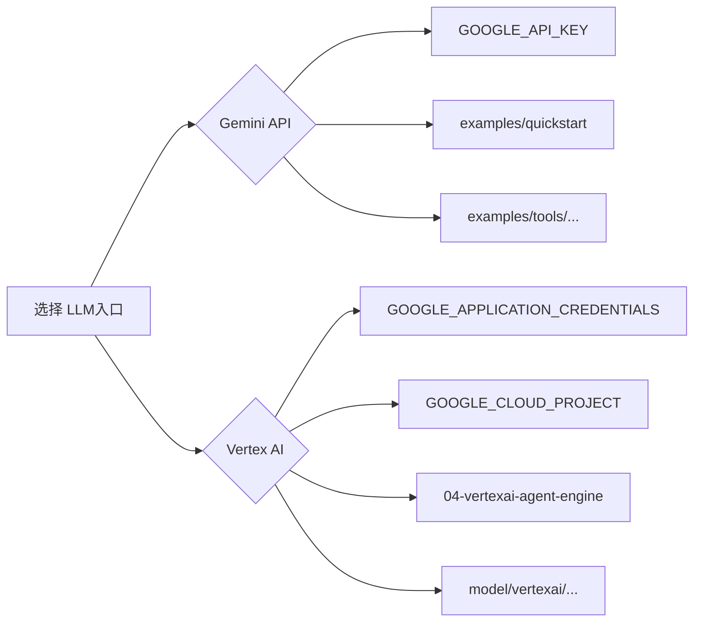
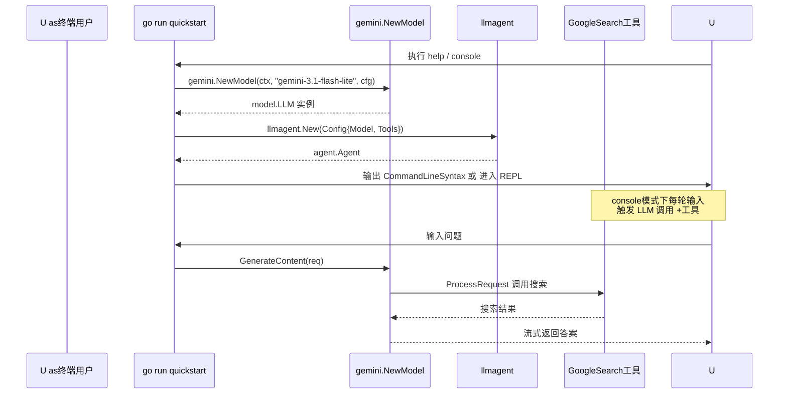

# 前置条件

> **锁定 commit**：`d06992e2b1ec2c9b95c6070e0fd12d50a43e4c99`
>
> 本教程基于上述 commit编写，与姐妹文档 [`docs/architecture/`](../architecture/)互引。开始前请确保读完本篇再进入 [`01-getting-started/`](./01-getting-started/)入门层。

本篇帮助你在15 分钟内把开发环境准备就绪。学完后你应当能：

- 在本地得到一个能 `go run` 的 ADK 工作区
-理解 `GOOGLE_API_KEY` 与 Vertex AI凭证的区别，按需选取其一
- 用 `go run ./examples/quickstart help` 自检环境

---

##1. 环境要求

|维度 | 要求 | 说明 |
|---|---|---|
| Go 版本 | **1.25.0+** | ADK `go.mod:3`声明 `go1.25.0`，使用 `iter` 包等新特性 |
|操作系统 | macOS / Linux / Windows | 三平台均可，示例以 macOS / Linux 命令为主 |
| 网络 | 可访问 `generativelanguage.googleapis.com` 或 `*.googleapis.com` |取决于选 Gemini API 还是 Vertex AI |
|磁盘 |至少500 MB |拉取 ADK仓库 + Go 模块缓存 |
|内存 |4 GB+ |跑 LLM 调用需要 |

> Go1.25 是2025 年8 月发布的稳定版。如果系统装的是1.24 或更早版本，下面 §2给出三个平台的升级指引。

---

##2. 安装 Go

###2.1 macOS（Homebrew）

```bash
brew install go
go version #期望：go1.25 或更高
```

如果已通过其它方式安装了旧版本，可叠加安装：

```bash
brew install --formula go@1.25
brew link --force go@1.25
```

###2.2 Linux

**方式 A：包管理器**

```bash
# Debian / Ubuntu
sudo apt update && sudo apt install -y golang-go

# Fedora / RHEL
sudo dnf install -y golang

# Arch
sudo pacman -S go
```

但发行版仓库的 Go经常落后，建议用方式 B。

**方式 B：官方 tarball（推荐，可控版本）**

```bash
wget https://go.dev/dl/go1.25.0.linux-amd64.tar.gz
sudo rm -rf /usr/local/go
sudo tar -C /usr/local -xzf go1.25.0.linux-amd64.tar.gz
export PATH=$PATH:/usr/local/go/bin
go version #期望：go1.25.0
```

把 `export PATH=$PATH:/usr/local/go/bin` 加入 `~/.bashrc` 或 `~/.zshrc`持久化。

###2.3 Windows

从 [go.dev/dl](https://go.dev/dl/) 下载 `go1.25.0.windows-amd64.msi`，按向导安装。

安装完成后**重启终端**，使 `go` 加入 `PATH`：

```powershell
go version #期望：go1.25.0
```

---

##3. 获取 Google API Key

ADK 大多数示例（`examples/quickstart/`、`examples/tools/multipletools/` 等）默认使用 **Gemini Developer API**，通过 `GOOGLE_API_KEY` 环境变量鉴权。

###3.1步骤

1.访问 [Google AI Studio](https://aistudio.google.com/apikey)
2. 点击 "Create API Key"
3. 选择或新建一个 GCP 项目
4.复制生成的 key（以 `AIza`开头）

###3.2 设置环境变量

```bash
# macOS / Linux（一次性）
export GOOGLE_API_KEY=AIzaSy... #替换为你的 key

#持久化
echo 'export GOOGLE_API_KEY=AIzaSy...' >> ~/.bashrc # bash
echo 'export GOOGLE_API_KEY=AIzaSy...' >> ~/.zshrc # zsh
```

```powershell
# Windows PowerShell
[System.Environment]::SetEnvironmentVariable("GOOGLE_API_KEY", "AIzaSy...", "User")
```

###3.3验证

```bash
echo $GOOGLE_API_KEY # macOS / Linux
echo $env:GOOGLE_API_KEY # Windows PowerShell
```

期望输出你的 key（以 `AIza`开头）。代码侧由 [`examples/quickstart/main.go:38`](../../examples/quickstart/main.go)读取后传给 [`model/gemini/gemini.go:49`](../../model/gemini/gemini.go) 的 `genai.ClientConfig.APIKey`字段。

---

##4. （可选）Vertex AI凭证

如果你要跑以下教程，需要 Vertex AI 服务账号凭证（不是 Gemini API key）：

- [`04-deployment/04-vertexai-agent-engine.md`](./04-deployment/04-vertexai-agent-engine.md)
- [`05-llm-providers/02-apigee-gateway.md`](./05-llm-providers/02-apigee-gateway.md)
- 部分 `model/vertexai`路径

跳过本节不影响入门层（`01-getting-started/`）。

###4.1 创建 GCP 项目

1.访问 [Google Cloud Console](https://console.cloud.google.com/)
2.顶部下拉框 → "New Project" →记录 `PROJECT_ID`
3. 在 [API Library](https://console.cloud.google.com/apis/library/aiplatform.googleapis.com)启用 **Vertex AI API**

###4.2 创建服务账号

```bash
#替换 $PROJECT_ID 为你的项目 ID
gcloud iam service-accounts create adk-tutorial \
 --description="ADK tutorial service account" \
 --display-name="ADK Tutorial"

gcloud projects add-iam-policy-binding $PROJECT_ID \
 --member="serviceAccount:adk-tutorial@$PROJECT_ID.iam.gserviceaccount.com" \
 --role="roles/aiplatform.user"

gcloud iam service-accounts keys create ~/adk-key.json \
 --iam-account=adk-tutorial@$PROJECT_ID.iam.gserviceaccount.com
```

###4.3 设置环境变量

```bash
export GOOGLE_APPLICATION_CREDENTIALS=~/adk-key.json
export GOOGLE_CLOUD_PROJECT=$PROJECT_ID
export GOOGLE_CLOUD_REGION=us-central1 # 或 asia-east1 / europe-west4 等
```

`GOOGLE_APPLICATION_CREDENTIALS`指向服务账号 key 文件路径；ADK 的 `model/vertexai` 实现通过 [Application Default Credentials](https://cloud.google.com/docs/authentication/application-default-credentials) 自动读取。

###4.4 Gemini API vs Vertex AI速查

|维度 | Gemini API | Vertex AI |
|---|---|---|
|入口 | `aistudio.google.com` | `console.cloud.google.com` |
|凭证 | `GOOGLE_API_KEY` | `GOOGLE_APPLICATION_CREDENTIALS` + `GOOGLE_CLOUD_PROJECT` |
| 模型工厂 | `model/gemini.NewModel` | `model/vertexai.NewModel` |
| 计费 | 按 token | 按 GCP 项目账单 |
|适用场景 |入门、原型 | 生产、Agent Engine部署 |



> **看图指引**：入门教程默认走 Gemini API（左分支）。一旦涉及部署到 Agent Engine 或使用 Apigee 网关，转到 Vertex AI（右分支）。两侧凭证**互不兼容**——切勿混用。

---

##5.克隆 ADK仓库

```bash
git clone https://github.com/google/adk-go.git
cd adk-go
git checkout d06992e2b1ec2c9b95c6070e0fd12d50a43e4c99 #锁定 commit
go mod download
```

> `go mod download` 会拉取所有依赖（约200+ 个模块），首次需要1-3 分钟。如果在中国大陆，可临时设置 `GOPROXY=https://goproxy.cn,direct`加速。

如果你已经在本地有 ADK仓库：

```bash
cd /path/to/adk-go
git fetch origin
git checkout d06992e2b1ec2c9b95c6070e0fd12d50a43e4c99
```

---

##6.验证安装

依次执行下列两条命令，全部成功才算环境就绪。

###6.1 Go 版本

```bash
go version #期望：go version go1.25.0 ... 或更高
```

###6.2 quickstart help（无 API key 也可跑）

```bash
go run ./examples/quickstart help
```

期望输出4 种运行模式说明（console / restapi / a2a / webui）。`help` 仅打印 `cmd/launcher/launcher.go:38` 的 `CommandLineSyntax()`字符串，不实际调用模型。

###6.3 （可选）真实对话

```bash
export GOOGLE_API_KEY=AIzaSy...
go run ./examples/quickstart console <<'EOF'
What is the weather in Beijing?
quit
EOF
```

期望看到 agent调用 [`tool/geminitool/google_search.go:28`](../../tool/geminitool/google_search.go:28) 的 `GoogleSearch`工具并返回结果。



> **看图指引**：左到右是启动与一次对话的调用链。`go run` → `gemini.NewModel`（见 `model/gemini/gemini.go:49`） → `llmagent.New`（见 `agent/llmagent/llmagent.go:34`） → `full.NewLauncher`（见 `cmd/launcher/full/full.go:31`）。help 子命令只走到第二步就返回。

---

##7.常见错误速查

|报错信息 |原因 |解决 |
|---|---|---|
| `go: command not found` | Go 未加入 PATH | 重启终端，或重新执行 `export PATH=$PATH:/usr/local/go/bin` |
| `go.mod requires go1.25.0 (running go1.24.x)` | Go 版本过低 | 按 §2重新安装1.25+ |
| `Failed to create model: missing GOOGLE_API_KEY` | 未设置 key | 见 §3.2 |
| `API key not valid` | key拼写错误或过期 |重新生成 key |
| `Permission denied: aiplatform.googleapis.com` | 服务账号缺 `aiplatform.user`角色 | 见 §4.2 |
| `module declarations violate constraint` | clone 后未 checkout锁定 commit | 见 §5 |

---

##8.关键 API 小结

| API /工具 |位置 |用途 |
|---|---|---|
| `gemini.NewModel` | `model/gemini/gemini.go:49` | 创建 Gemini 模型实例 |
| `llmagent.New` | `agent/llmagent/llmagent.go:34` |构造 LLM驱动的 Agent |
| `agent.NewSingleLoader` | `agent/loader.go:43` | 把单个 Agent 包成 Loader |
| `full.NewLauncher` | `cmd/launcher/full/full.go:31` |启动4模式 launcher |
| `launcher.Launcher.Execute` | `cmd/launcher/launcher.go:36` |解析命令行并执行 |
| `geminitool.GoogleSearch` | `tool/geminitool/google_search.go:28` | 内置联网搜索工具 |

---

##9. 下一步

环境就绪后，按以下顺序进入入门层（严格线性）：

1. [`01-getting-started/01-hello-world.md`](./01-getting-started/01-hello-world.md) ——最小 Agent
2. [`01-getting-started/02-first-tool.md`](./01-getting-started/02-first-tool.md) ——第一个自定义工具
3. [`01-getting-started/03-persistent-session.md`](./01-getting-started/03-persistent-session.md) —— 多轮对话
4. [`01-getting-started/04-multi-agents.md`](./01-getting-started/04-multi-agents.md) ——组合 Agent
5. [`01-getting-started/05-run-as-server.md`](./01-getting-started/05-run-as-server.md) —— REST 服务

>教程入口与依赖图见 [`README.md`](./README.md)。架构层面的解释见 [`docs/architecture/00-overview.md`](../architecture/00-overview.md)。
