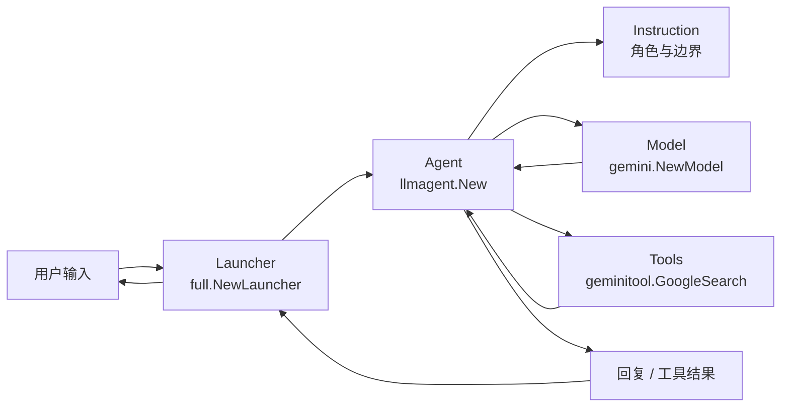

# 第一个 Agent：Hello World

> 本教程基于 [`examples/quickstart/main.go`](../../../examples/quickstart/main.go)。约 60 行代码，一个能联网搜天气与时间的 agent。

## 你将学到

- 最小可运行的 ADK agent 长什么样
- `full.NewLauncher()` 是什么，为什么用它
- 如何用 `console` 模式跟 agent 交互
- ADK 三大核心概念：**Agent**、**Launcher**、**Instruction**

## 前置条件

- [x] 已完成 [00-prerequisites.md](../00-prerequisites.md)
- [x] 已设置 `GOOGLE_API_KEY` 环境变量
- [x] 已 `git clone` ADK 仓库到本地
- [x] 本机可访问 `generativelanguage.googleapis.com`

## 核心概念

**Agent（智能体）** 是一个能自主决策的可调用对象：它绑定一个大语言模型（`Model`），持有一组可选工具（`Tools`），并通过 `Instruction` 描述自己的角色与边界。ADK 中 `agent.Agent` 是接口（[`agent/agent.go`](../../../agent/agent.go)），最常用实现是 `llmagent`——一个会"调 LLM 思考、必要时调工具、再把结果整理成回复"的智能体（`agent/llmagent/llmagent.go:34`）。

**Launcher（启动器）** 是 ADK 把"运行 agent"这件事标准化的统一入口。一个 launcher 实例能同时支持多种运行模式：本地终端对话（`console`）、REST API 服务（`restapi`）、A2A 协议暴露（`a2a`）、Web UI（`webui`）。`full.NewLauncher()` 把所有模式都注册进来，开发者用同一份代码既能本地调试又能上生产（`cmd/launcher/full/full.go:31`）。

**Instruction（指令）** 是给 agent 的"人设"提示词。它不是普通的 prompt，而是 agent 每次思考时都会看到的稳定设定，决定了 agent"愿不愿意做某事"、"用什么风格回答"。`quickstart` 示例里通过 `Instruction` 把 agent 严格限定为"只回答城市天气与时间"，并强制拒绝无关问题。

三者关系可以用下图表示：



**看图指引**：

- 入口 `Launcher` 解析命令行参数（`console` / `restapi` 等），把用户消息路由到根 `Agent`。
- `Agent` 内部按 `Instruction` 的设定，结合 `Model` 与 `Tools` 决定"自己回答"还是"调用工具"。
- 工具执行结果回到 `Agent`，再走一次模型，最终回复用户。

## 完整代码

完整源码在 [`examples/quickstart/main.go`](../../../examples/quickstart/main.go)，核心 60 行：

```go
// examples/quickstart/main.go
package main

import (
	"context"
	"log"
	"os"

	"google.golang.org/genai"

	"google.golang.org/adk/agent"
	"google.golang.org/adk/agent/llmagent"
	"google.golang.org/adk/cmd/launcher"
	"google.golang.org/adk/cmd/launcher/full"
	"google.golang.org/adk/model/gemini"
	"google.golang.org/adk/tool"
	"google.golang.org/adk/tool/geminitool"
)

func main() {
	ctx := context.Background()

	model, err := gemini.NewModel(ctx, "gemini-3.1-flash-lite", &genai.ClientConfig{
		APIKey: os.Getenv("GOOGLE_API_KEY"),
	})
	if err != nil {
		log.Fatalf("Failed to create model: %v", err)
	}

	a, err := llmagent.New(llmagent.Config{
		Name:        "weather_time_agent",
		Model:       model,
		Description: "Agent to answer questions about the time and weather in a city.",
		Instruction: "Your SOLE purpose is to answer questions about the current time and weather in a specific city. You MUST refuse to answer any questions unrelated to time or weather.",
		Tools: []tool.Tool{
			geminitool.GoogleSearch{},
		},
	})
	if err != nil {
		log.Fatalf("Failed to create agent: %v", err)
	}

	config := &launcher.Config{
		AgentLoader: agent.NewSingleLoader(a),
	}

	l := full.NewLauncher()
	if err = l.Execute(ctx, config, os.Args[1:]); err != nil {
		log.Fatalf("Run failed: %v\n\n%s", err, l.CommandLineSyntax())
	}
}
```

## 代码逐段讲解

### 1. 创建 Model

```go
model, err := gemini.NewModel(ctx, "gemini-3.1-flash-lite", &genai.ClientConfig{
	APIKey: os.Getenv("GOOGLE_API_KEY"),
})
```

`gemini.NewModel` 创建一个 Gemini 模型实例，签名在 [`model/gemini/gemini.go:49`](../../../model/gemini/gemini.go)。第二个参数是模型名（可换成 `gemini-2.5-flash` 等）。`APIKey` 从环境变量读取，**不要把 key 写进代码**。`genai.ClientConfig` 来自官方的 `google.golang.org/genai` SDK——ADK 在它之上做了一层薄封装。

### 2. 创建 Agent

```go
a, err := llmagent.New(llmagent.Config{
	Name:        "weather_time_agent",
	Model:       model,
	Description: "Agent to answer questions about the time and weather in a city.",
	Instruction: "Your SOLE purpose is to answer questions about the current time and weather in a specific city. You MUST refuse to answer any questions unrelated to time or weather.",
	Tools: []tool.Tool{
		geminitool.GoogleSearch{},
	},
})
```

`llmagent.New` 是最常用的 agent 工厂，定义在 [`agent/llmagent/llmagent.go:34`](../../../agent/llmagent/llmagent.go)。`Config` 关键字段：

- `Name`：agent 的唯一标识。后续 A2A / REST 调用都用这个名路由。
- `Model`：上一段创建的模型实例。
- `Description`：给"上层 agent 看到"的简短描述；多 agent 场景用于决定是否把任务转交给它。
- `Instruction`：核心"人设"提示词，必须写清**能做什么 + 不能做什么**。
- `Tools`：agent 可调用的工具列表；`geminitool.GoogleSearch{}` 让 agent 能联网搜实时信息。

### 3. 配置 Loader

```go
config := &launcher.Config{
	AgentLoader: agent.NewSingleLoader(a),
}
```

`agent.NewSingleLoader` 把单个 agent 包装成可加载器（[`agent/loader.go:43`](../../../agent/loader.go)）。launcher 需要 `Loader` 接口来"按名字加载 agent"——`Loader` 接口定义在同文件 [`agent/loader.go:22`](../../../agent/loader.go)。当程序里只有一个 agent 时用 `NewSingleLoader`；有多个 agent 时改用 `NewMultiLoader`（详见后续教程）。

### 4. 启动 Launcher

```go
l := full.NewLauncher()
if err = l.Execute(ctx, config, os.Args[1:]); err != nil {
	log.Fatalf("Run failed: %v\n\n%s", err, l.CommandLineSyntax())
}
```

`full.NewLauncher()` 返回支持 4 种模式的 launcher，定义在 [`cmd/launcher/full/full.go:31`](../../../cmd/launcher/full/full.go)。`Execute` 解析 `os.Args[1:]` 决定走 `console` 还是 `restapi` 等；执行失败时 `CommandLineSyntax()` 会打印完整用法，省去查文档的工夫。

## 准备与运行

### 步骤 1：确认 API key

```bash
echo $GOOGLE_API_KEY   # 应输出 AIza...
```

如果未设置，回到 [00-prerequisites.md §3](../00-prerequisites.md) 获取。

### 步骤 2：进入 quickstart 目录

```bash
cd /path/to/adk-go
ls examples/quickstart/main.go   # 确认文件存在
```

### 步骤 3：运行

```bash
go run ./examples/quickstart console
```

首次运行会下载依赖（`go.sum` 检查），约需 10-30 秒。出现 `User:` 提示符即表示成功。

### 步骤 4：测试输入

```
User: What's the weather in Tokyo?
[agent 思考，调用 GoogleSearch 工具，整理结果]
[weather_time_agent]: Currently in Tokyo it's around 22°C, partly cloudy...

User: Who wrote Hamlet?
[weather_time_agent]: I can only answer questions about time and weather in a city. ...
```

按 `Ctrl-D` 退出 console 模式。

## 常见错误

- **`Failed to create model: ... GOOGLE_API_KEY`** —— 环境变量未设置或拼写错误。`export GOOGLE_API_KEY=AIza...` 后重试。
- **`llmagent.New: empty Name`** —— `Config.Name` 字段必填且不能为空字符串。`Name` 是后续 REST / A2A 路由的依据。
- **`go run: cannot find main module`** —— 必须在仓库根目录运行，或显式 `cd examples/quickstart` 后 `go run .`。
- **`dial tcp: lookup generativelanguage.googleapis.com: no such host`** —— 网络受限环境需要配置代理或在 `genai.ClientConfig` 里设 `HTTPClient.Transport`。
- **`tool list empty`** —— 删掉 `Tools` 字段也能跑，但 agent 没有联网能力，本示例会无法回答"东京现在几度"这种实时问题。

## 关键 API 小结

| API | 位置 | 作用 |
|---|---|---|
| `gemini.NewModel` | [`model/gemini/gemini.go:49`](../../../model/gemini/gemini.go) | 创建 Gemini 模型实例（`model.LLM` 接口） |
| `llmagent.New` | [`agent/llmagent/llmagent.go:34`](../../../agent/llmagent/llmagent.go) | 工厂函数，构建一个能调 LLM 的 agent |
| `agent.NewSingleLoader` | [`agent/loader.go:43`](../../../agent/loader.go) | 把单个 agent 包装成 `Loader` |
| `full.NewLauncher` | [`cmd/launcher/full/full.go:31`](../../../cmd/launcher/full/full.go) | 返回支持 4 种模式的多功能 launcher |
| `launcher.Launcher.Execute` | `cmd/launcher/launcher.go` | 解析 `os.Args[1:]` 并启动对应模式 |

## 延伸阅读

- 架构文档：[核心抽象一览](../../architecture/00-overview.md#3-核心抽象一览) —— 看 `Agent` / `Runner` / `Session` / `Tool` 四个核心抽象的全局图
- 架构文档：[F1 单轮对话](../../architecture/01-core-flows.md#f1-单轮对话) —— 从 `User` 输入到 `Reply` 的完整时序
- 源码：[`examples/quickstart/main.go`](../../../examples/quickstart/main.go) —— 本教程讲解的 60 行可运行示例
- 源码：[`agent/llmagent/llmagent.go`](../../../agent/llmagent/llmagent.go) —— `llmagent` 的完整实现
- 下一教程：[02-first-tool.md](./02-first-tool.md) —— 给 agent 加多个工具
- 未来子项目深读占位：`llmagent` 内部的 callback 链与 instruction 拼接策略
