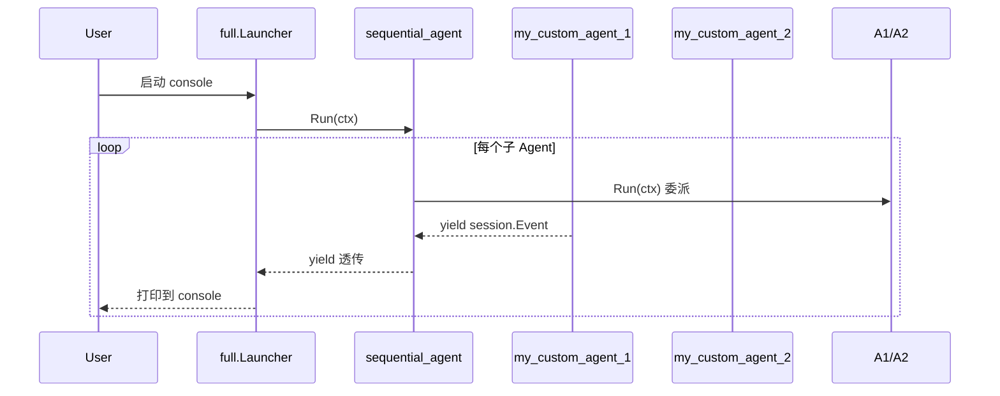

# 多 Agent 协作：父 Agent 委派给子 Agent

> 本教程基于 [examples/workflowagents/sequential/main.go](../../../examples/workflowagents/sequential/main.go)（约 95 行）。该示例展示如何把两个简单 agent 串成一个按顺序执行的 workflow。

## 你将学到

- 什么是 SubAgents，为什么父 Agent 能"委派"任务给子 Agent
- `workflowagents/sequentialagent` 如何按顺序调度一组子 Agent
- 如何用 `OutputKey` 把上一个 Agent 的输出写入 session state，让下游 Agent 共享数据
- 自定义非 LLM agent（`agent.Config.Run`）作为子 Agent
- 控制台模式下运行多 agent workflow 看到串行输出

## 前置条件

- [x] 已完成 [前一教程 03-persistent-session.md](./03-persistent-session.md)（如目录中尚无，请先跑通 01/02/03 教程）
- [x] 已设置 `GOOGLE_API_KEY`（见 [00-prerequisites](../00-prerequisites.md)）
- [x] 已 `git clone` ADK 仓库并 `go mod download`

## 核心概念

**SubAgent**：父 Agent 的"下属"。在 ADK 中通过 `agent.Config.SubAgents []agent.Agent` 字段声明（[agent/agent.go:89](
../../../agent/agent.go)）。父 Agent 决定把当前任务委派给哪一个子 Agent；同 session 的所有 Agent 共享同一份 state。

**Workflow Agent**：把多个 Agent 按固定策略编排执行的"父 Agent"。ADK 在 [agent/workflowagents/](
../../../agent/workflowagents/) 下提供三种：`sequentialagent`（顺序）、`parallelagent`（并发）、`loopagent`（循环）。它们本身也是 `agent.Agent`，可以挂到 LLM 上当父。

**OutputKey**：让一个 Agent 的"最终文本输出"自动写入 session state 的某个 key（[agent/llmagent/llmagent.go:282](
../../../agent/llmagent/llmagent.go)）。下游 Agent 可以通过 `Instruction` 里引用 `{key}` 模板读取到上一步的输出，从而实现"流水线"。

## 完整代码

完整源码在 [examples/workflowagents/sequential/main.go](../../../examples/workflowagents/sequential/main.go)：

```go
// examples/workflowagents/sequential/main.go
package main

import (
	"context"
	"fmt"
	"iter"
	"log"
	"os"

	"google.golang.org/genai"

	"google.golang.org/adk/agent"
	"google.golang.org/adk/agent/workflowagents/sequentialagent"
	"google.golang.org/adk/cmd/launcher"
	"google.golang.org/adk/cmd/launcher/full"
	"google.golang.org/adk/model"
	"google.golang.org/adk/session"
)

type myAgent struct{ id int }

func (a myAgent) Run(ctx agent.InvocationContext) iter.Seq2[*session.Event, error] {
	return func(yield func(*session.Event, error) bool) {
		yield(&session.Event{
			LLMResponse: model.LLMResponse{
				Content: &genai.Content{
					Parts: []*genai.Part{{Text: fmt.Sprintf("Hello from MyAgent id: %v!\n", a.id)}},
				},
			},
		}, nil)
	}
}

func main() {
	ctx := context.Background()

	myAgent1, _ := agent.New(agent.Config{
		Name:        "my_custom_agent_1",
		Description: "A custom agent that responds with a greeting.",
		Run:         myAgent{id: 1}.Run,
	})
	myAgent2, _ := agent.New(agent.Config{
		Name:        "my_custom_agent_2",
		Description: "A custom agent that responds with a greeting.",
		Run:         myAgent{id: 2}.Run,
	})

	sequentialAgent, _ := sequentialagent.New(sequentialagent.Config{
		AgentConfig: agent.Config{
			Name:        "sequential_agent",
			Description: "A sequential agent that runs sub-agents",
			SubAgents:   []agent.Agent{myAgent1, myAgent2},
		},
	})

	config := &launcher.Config{AgentLoader: agent.NewSingleLoader(sequentialAgent)}
	l := full.NewLauncher()
	if err := l.Execute(ctx, config, os.Args[1:]); err != nil {
		log.Fatalf("Run failed: %v\n\n%s", err, l.CommandLineSyntax())
	}
}
```

## 代码逐段讲解

### 1. 自定义非 LLM agent

```go
type myAgent struct{ id int }

func (a myAgent) Run(ctx agent.InvocationContext) iter.Seq2[*session.Event, error] {
	return func(yield func(*session.Event, error) bool) {
		yield(&session.Event{...}, nil)
	}
}
```

子 Agent 不一定需要 LLM。最简单的实现就是给 `agent.Config.Run` 字段提供一个函数（[agent/agent.go:98](
../../../agent/agent.go)），返回一个 `iter.Seq2` 拉序列。本例中 `myAgent{1}` 推一条固定问候文本。

### 2. 用 `agent.New` 构造子 Agent

```go
myAgent1, _ := agent.New(agent.Config{
	Name:        "my_custom_agent_1",
	Description: "A custom agent that responds with a greeting.",
	Run:         myAgent{id: 1}.Run,
})
```

`agent.New` 是所有 Agent 类型的"通用工厂"，参数是 `agent.Config`（[agent/agent.go:73](
../../../agent/agent.go)）。Description 字段在父委派语义里很关键——LLM 用它判断是否切到该 agent。

### 3. 用 `sequentialagent.New` 把子 Agent 串成 workflow

```go
sequentialAgent, _ := sequentialagent.New(sequentialagent.Config{
	AgentConfig: agent.Config{
		Name:        "sequential_agent",
		Description: "A sequential agent that runs sub-agents",
		SubAgents:   []agent.Agent{myAgent1, myAgent2},
	},
})
```

`sequentialagent.New` 接受一个 `Config{ AgentConfig agent.Config }`（[agent/workflowagents/sequentialagent/agent.go:46](
../../../agent/workflowagents/sequentialagent/agent.go)）。`SubAgents` 列表顺序就是执行顺序：先跑 myAgent1 再跑 myAgent2。

### 4. sequentialAgent.Run 的真实语义

```go
// agent/workflowagents/sequentialagent/agent.go:78
func (a *sequentialAgent) Run(ctx agent.InvocationContext) iter.Seq2[*session.Event, error] {
	return func(yield func(*session.Event, error) bool) {
		for _, subAgent := range ctx.Agent().SubAgents() {
			for event, err := range subAgent.Run(ctx) {
				if !yield(event, err) { return }
			}
		}
	}
}
```

它对每个子 Agent 调 `subAgent.Run(ctx)` 并把事件 `yield` 给上游（[agent/workflowagents/sequentialagent/agent.go:78-89](
../../../agent/workflowagents/sequentialagent/agent.go)）。**所有子 agent 共享同一 InvocationContext 与 session**，因此可通过 session state 串数据。

### 5. 启动与运行时委派



> **看图指引**：横向看"调用关系"，纵向看"时间推进"。sequential_agent 不会"决定"委派给谁——它只按 SubAgents 列表顺序串行调 `Run`。**真正 LLM-driven 的委派要用 `llmagent` 当父 Agent**（见常见错误 #2）。

### 6. 父 Agent 委派 vs 子 Agent 直接调用

```mermaid
graph TD
    A[User 输入] --> P[llmagent 父 Agent]
    P -->|LLM 决定委派| S1[SubAgent A]
    P -->|LLM 决定委派| S2[SubAgent B]
    S1 -->|写入 OutputKey| ST[session state]
    ST -->|模板 {key} 注入| P
    P -->|继续 LLM 推理| Z[最终回答]
```

> **看图指引**：本示例是固定顺序 workflow，不涉及 LLM 委派。如果父是 `llmagent` 且配置了 `SubAgents`，LLM 会根据 `Description` 自动选择委派，并通过 `Instruction` 模板读取子 Agent 的 `OutputKey` 输出（[agent/llmagent/llmagent.go:449-472](
../../../agent/llmagent/llmagent.go)）。

## 准备与运行

### 步骤 1：确认 API key

```bash
echo $GOOGLE_API_KEY   # 应输出 AIza...
```

### 步骤 2：编译并运行

```bash
cd /home/wu/oneone/adk
go run ./examples/workflowagents/sequential console
```

### 步骤 3：测试输入

```
User: hello
[my_custom_agent_1 输出] Hello from MyAgent id: 1!
[my_custom_agent_2 输出] Hello from MyAgent id: 2!
[sequential_agent 返回] user: hello
```

两个 agent 的 greeting 会按顺序出现在 console 中。

## 常见错误

- **`failed to create base agent`** —— `agent.New` 校验失败，通常是 `SubAgents` 里有重复 `Name` 或 nil（[agent/agent.go:57](
../../../agent/agent.go)）。检查两个 `my_custom_agent_1/2` 名字是否一致。
- **`sequential agent has no sub-agents`** —— 运行时 `RunLive` 检测到 `SubAgents` 为空（[agent/workflowagents/sequentialagent/agent.go:127](
../../../agent/workflowagents/sequentialagent/agent.go)）。本示例是 `Run` 路径不命中，只有 Live 模式才会报。
- **`LLM 没切到子 Agent`** —— 父是 `llmagent` 但子 agent 的 `Description` 太相似，LLM 无法区分。给每个子 Agent 写"一行独特能力描述"。
- **`OutputKey` 没生效** —— 必须确认作者匹配：`maybeSaveOutputToState` 只在 `event.Author == a.Name()` 时才保存（[agent/llmagent/llmagent.go:445](
../../../agent/llmagent/llmagent.go)）。
- **`SubAgents` 顺序错** —— sequentialagent **不并发**（[agent/workflowagents/sequentialagent/agent.go:80](
../../../agent/workflowagents/sequentialagent/agent.go)），顺序敏感；要并发请改用 `parallelagent`。

## 关键 API 小结

| API | 位置 | 作用 |
|---|---|---|
| `agent.Config.SubAgents` | `agent/agent.go:89` | 声明父 Agent 的子 Agent 列表 |
| `agent.New(cfg)` | `agent/agent.go` | 通用 Agent 工厂 |
| `agent.Config.Run` | `agent/agent.go:98` | 自定义 agent 行为函数 |
| `sequentialagent.New` | `agent/workflowagents/sequentialagent/agent.go:46` | 构造顺序执行父 Agent |
| `llmagent.Config.OutputKey` | `agent/llmagent/llmagent.go:282` | 把 agent 输出写入 session state |
| `llmAgent.maybeSaveOutputToState` | `agent/llmagent/llmagent.go:449` | OutputKey 落盘逻辑 |
| `llmAgent.RunLive` | `agent/llmagent/llmagent.go:396` | 父 agent 进入 Live 模式时委派 |

## 延伸阅读

- [架构文档：核心抽象一览（含 agent.Agent 签名）](../../architecture/00-overview.md#3-核心抽象一览)
- [架构文档：F3 多 Agent 协作（横向委派 vs 纵向嵌套）](../../architecture/01-core-flows.md#f3-多-agent-协作)
- [架构文档：agent 模块 §4.4 工作流 agent 编排](../../architecture/03-modules/01-agent.md#44-工作流-agent-编排parallel)
- [examples/workflowagents/sequential/main.go](../../../examples/workflowagents/sequential/main.go)
- 子项目深读占位：parallelagent / loopagent 的进阶教程见 [03-agents/](../03-agents/)