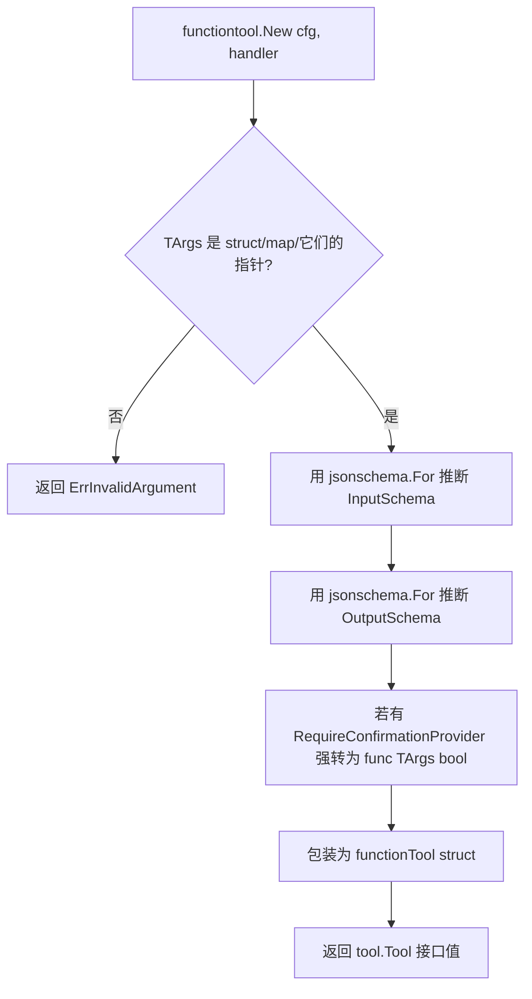

# FunctionTool：把任意 Go 函数变成 Tool

本教程基于 [examples/tools/multipletools/main.go](../../../examples/tools/multipletools/main.go)。它从那个示例中**抽出 `functiontool.New` 这一个概念**做深读：忽略示例里的多 agent 包装技巧，专注"如何把一个普通 Go 函数注册为 LLM 可调用的 tool"。如果想看完整的多工具协同示例，请回到入门教程 [01-getting-started/02-first-tool.md](../01-getting-started/02-first-tool.md)。

## 你将学到

- `tool.Tool` 接口的三个方法（`Name` / `Description` / `IsLongRunning`）以及它们对 LLM 的意义
- `functiontool.New` 这个泛型装饰器如何把 `func(ctx, Input) (Output, error)` 包装为 Tool
- 怎么用 Go struct 的 `json` tag 声明 tool 的输入输出 schema
- 哪些 handler 签名是合法的、哪些会在编译期 / 运行期被拒绝
- FunctionTool 在一次 LLM 调用中处于什么位置（声明、调度、结果回传）

## 前置条件

- [x] 已完成 [00-prerequisites.md](../00-prerequisites.md)
- [x] 已完成 [01-getting-started/02-first-tool.md](../01-getting-started/02-first-tool.md)
- [x] 已设置 `GOOGLE_API_KEY`
- [x] 熟悉 Go 泛型与 struct tag

## 核心概念

**Tool 是 ADK 里 LLM 唯一能"主动调用"的东西**。`tool.Tool` 是最顶层的接口（[tool/tool.go:38](../../../tool/tool.go)），它只规定三件事：名字、描述、是否长跑。ADK 把"如何把一次 LLM 的 `function_call` 调度到 Go 代码、再把结果回传给 LLM"这件事抽到了 [tool/tool.go:189-193](../../../tool/tool.go) 的 `runnableTool` 内部接口，外部用户不需要实现它。

**`functiontool` 提供"装饰器模式"**：用户写一个 `func(ctx agent.ToolContext, Input) (Output, error)`，`functiontool.New` 用 Go 反射推断 input/output 的 JSON Schema，包成实现 `runnableTool` 的私有结构体（[tool/functiontool/function.go:122-137](../../../tool/functiontool/function.go)）。Schema 自动从 Go struct 的 `json:"xxx"` tag 推导，命名遵循 camelCase（与 JSON 习惯一致）。

**整个调用链的入口在 ProcessRequest**：每次 LLM 请求前，ADK 调 `functionTool.ProcessRequest`（[tool/functiontool/function.go:155-157](../../../tool/functiontool/function.go)），通过 `toolutils.PackTool` 把 function declaration 注入请求体。LLM 据此知道"我有哪些 tool 可调、参数长什么样"。用户不需要手动管这个。

## 完整代码

下面是从 [examples/tools/multipletools/main.go](../../../examples/tools/multipletools/main.go) 截取、聚焦 FunctionTool 本身的片段（删去了 model/launcher/agenttool 等外围部分）：

```go
// 摘自 examples/tools/multipletools/main.go
import (
    "strings"

    "google.golang.org/adk/agent"
    "google.golang.org/adk/tool/functiontool"
)

// 1. 定义输入输出 struct（json tag 即 schema 字段名）
type Input struct {
    LineCount int `json:"lineCount"`
}
type Output struct {
    Poem string `json:"poem"`
}

// 2. 写 handler，签名必须严格匹配 func(ctx, Input) (Output, error)
handler := func(ctx agent.ToolContext, input Input) (Output, error) {
    return Output{
        Poem: strings.Repeat("A line of a poem,", input.LineCount) + "\n",
    }, nil
}

// 3. 用 functiontool.New 装饰成 tool.Tool
poemTool, err := functiontool.New(functiontool.Config{
    Name:        "poem",
    Description: "Returns poem",
}, handler)
if err != nil {
    log.Fatalf("Failed to create tool: %v", err)
}
```

源文件中以上片段出现在 [examples/tools/multipletools/main.go:65-82](../../../examples/tools/multipletools/main.go)（input/output struct + handler + `functiontool.New`）。其余的 model/agent 注册部分请回到完整示例。

## 代码逐段讲解

### 1. `tool.Tool` 接口的三个方法

```go
// tool/tool.go:38
type Tool interface {
    Name() string
    Description() string
    IsLongRunning() bool
}
```

**Name**：LLM 在 `function_call` 里写出的标识符。必须是合法标识符（字母/数字/下划线），最好用 snake_case 或 camelCase。本例的 `poem` 出现在 [examples/tools/multipletools/main.go:77](../../../examples/tools/multipletools/main.go)。

**Description**：决定 LLM **何时**调用此 tool。模糊的 description 会让 LLM 忽略它。`"Returns poem"` 短短三词，在多工具场景下够用；如果想更精准，可以写 `"Returns a short poem with a configurable number of lines."` 并在 Description 里提示输入参数语义。

**IsLongRunning**：标记该 tool 是否"先返回一个 ID、后台再慢慢跑"。返回 true 时 ADK 会在 description 末尾追加一段警告（[tool/functiontool/function.go:172-179](../../../tool/functiontool/function.go)），告诉 LLM 不要重复调用。本例 poem tool 是同步的，保持 false。

### 2. Input/Output struct 与 JSON tag

```go
// examples/tools/multipletools/main.go:65-70
type Input struct {
    LineCount int `json:"lineCount"`
}
type Output struct {
    Poem string `json:"poem"`
}
```

`functiontool.New` 用 [`jsonschema-go`](https://github.com/google/jsonschema-go) 的 `jsonschema.For[T]`（[tool/functiontool/function.go:267-277](../../../tool/functiontool/function.go)）从 Go 类型生成 JSON Schema。**Tag 决定 schema 字段名**——LLM 看不到 Go 字段名 `LineCount`，只看到 schema 里的 `lineCount`。`json:"-"` 字段会从 schema 中隐藏；没有 tag 的字段会沿用 Go 字段名（首字母小写），一般不是你想要的。

支持的 Go 类型与 JSON Schema 类型的对应大致是：`string`→string、`int`/`int64`/`float64`→integer/number、`bool`→boolean、`[]T`→array、`map[string]T`→object、嵌套 struct→object。指针会被自动解引用。

### 3. Handler 签名约束

```go
// examples/tools/multipletools/main.go:71-75
handler := func(ctx agent.ToolContext, input Input) (Output, error) {
    return Output{
        Poem: strings.Repeat("A line of a poem,", input.LineCount) + "\n",
    }, nil
}
```

`functiontool.New` 是**泛型函数** `func New[TArgs, TResults any](cfg Config, handler Func[TArgs, TResults]) (tool.Tool, error)`（[tool/functiontool/function.go:79](../../../tool/functiontool/function.go)），其中 `Func[TArgs, TResults] = func(agent.ToolContext, TArgs) (TResults, error)`（[tool/functiontool/function.go:72](../../../tool/functiontool/function.go)）。

签名规则：

| 位置 | 要求 |
|---|---|
| 第 1 个参数 | `agent.ToolContext`（拿到 session、artifact、callback 等能力）|
| 第 2 个参数 | 任意类型 `TArgs`（必须为 struct / map / 它们的指针，见 [tool/functiontool/function.go:88](../../../tool/functiontool/function.go)）|
| 第 1 个返回值 | 任意类型 `TResults` |
| 第 2 个返回值 | `error` |

**编译期保证**：`agent.ToolContext` 与 `error` 的位置是固定锚点，编译器会在你写错时立刻报错。**运行期检查**只有一处：[tool/functiontool/function.go:88](../../../tool/functiontool/function.go) 校验 `TArgs` 是 struct/map/指针，其余类型会返回 `ErrInvalidArgument`。

### 4. `functiontool.New` 的内部工作

```go
// tool/functiontool/function.go:79-120
func New[TArgs, TResults any](cfg Config, handler Func[TArgs, TResults]) (tool.Tool, error) {
    var zeroArgs TArgs
    argsType := reflect.TypeOf(zeroArgs)
    for argsType != nil && argsType.Kind() == reflect.Pointer {
        argsType = argsType.Elem()
    }
    if argsType == nil || (argsType.Kind() != reflect.Struct && argsType.Kind() != reflect.Map) {
        return nil, fmt.Errorf("input must be a struct or a map or a pointer to those types, but received: %v: %w", argsType, ErrInvalidArgument)
    }
    // ... 解析 schema、构造私有 functionTool 结构体并返回
}
```

逐步看：



> **看图指引**：从 `New` 进入后，先做 `TArgs` 类型的运行期校验（[tool/functiontool/function.go:88](../../../tool/functiontool/function.go)），不通过就立即报错；通过后并行解析 input/output 两个 JSON Schema，最后把 `cfg` 与 `handler` 一起封进不可导出的 `functionTool[TArgs, TResults]` 结构体。`RequireConfirmationProvider` 那条分支本教程不展开，下一节 [05-confirmation.md](./05-confirmation.md) 会细讲。

`functionTool` 实现了三个外部方法：`Name` / `Description` / `IsLongRunning` 直接转发 `cfg`；`Declaration` 把 schema 转成 `*genai.FunctionDeclaration` 喂给 LLM（[tool/functiontool/function.go:160-182](../../../tool/functiontool/function.go)）；`Run` 在 LLM 真正调到这里时被调用，做 `map → Input` 反序列化、调用 handler、把 `Output` 转回 `map[string]any` 回传（[tool/functiontool/function.go:185-247](../../../tool/functiontool/function.go)）。

### 5. `ProcessRequest`：把 tool 声明塞进 LLM 请求

```go
// tool/functiontool/function.go:155-157
func (f *functionTool[TArgs, TResults]) ProcessRequest(ctx agent.ToolContext, req *model.LLMRequest) error {
    return toolutils.PackTool(req, f)
}
```

每次 LLM 请求前，runner 遍历 agent 拥有的所有 tool 并调 `ProcessRequest`。`functionTool` 的实现只是把 `Declaration()` 包到 `req` 里。这是 `runnableTool` 内部接口的扩展方法（[tool/tool.go:189-193](../../../tool/tool.go)），用户**不需要手动调用**——只要把 `poemTool` 塞进 `llmagent.Config.Tools`，ADK 会自动在合适时机调它。

## 准备与运行

### 步骤 1：获取凭证

到 [Google AI Studio](https://aistudio.google.com/apikey) 申请一个 `GOOGLE_API_KEY`（以 `AIza` 开头）。详见 [00-prerequisites.md §3](../00-prerequisites.md)。

### 步骤 2：设置环境变量

```bash
export GOOGLE_API_KEY=AIza...你的key...
```

### 步骤 3：运行

```bash
cd /home/wu/oneone/adk
go run ./examples/tools/multipletools console
```

启动后进入交互式 console（`full` launcher 的子命令），你输入文本，agent 回复。

### 步骤 4：测试输入

```
User: Write me a 3-line poem.
[agent 判定应调用 poem_agent 子 agent，进而调用 poemTool，handler 返回 3 行诗]

User: Write a 5-line poem.
[同理，handler 返回 5 行]
```

注意：本示例里 `poemTool` 是被 `poem_agent` 持有的，**根 agent 通过 `agenttool` 间接触发**。这是因为 `genai` 库对"GoogleSearch + 自定义 tool"在同一 agent 内并存有限制（见 [examples/tools/multipletools/main.go:38-41](../../../examples/tools/multipletools/main.go) 的注释）。如果想直接看"自定义 tool 挂在根 agent 上"的更简单示例，可以参考入门教程 [01-getting-started/02-first-tool.md](../01-getting-started/02-first-tool.md) 末尾的简化版，或跑 `examples/quickstart`。

## 常见错误

- **handler 签名写错** —— 比如把 `error` 放在第一个返回值、或者把 `agent.ToolContext` 放在第二个参数。`functiontool.New` 是泛型函数，类型不匹配会直接编译失败
- **`TArgs` 是基本类型**（如 `func(ctx, int) (string, error)`）—— 编译能过，但 `New` 在 [tool/functiontool/function.go:88](../../../tool/functiontool/function.go) 会返回 `ErrInvalidArgument`。解决：包成 `struct { N int \`json:"n"\` }`
- **JSON tag 缺失或拼错** —— LLM 看到的 schema 字段名直接来自 tag；没有 tag 时会变成首字母小写的 Go 字段名，调用时容易对不上
- **Description 写得太泛**（如 `"Does stuff"`）—— LLM 不会主动调用。Description 是 LLM 决策的唯一文本线索，要写清"它做什么、什么时候该用"
- **在 handler 里访问 ctx 但忘了检查 nil** —— `agent.ToolContext` 由 ADK 注入，正常情况下非 nil；但单元测试直接调用时可能为 nil，做防御性判断更稳
- **handler panic 没有 recover** —— `functionTool.Run` 自带 panic recover（[tool/functiontool/function.go:187-191](../../../tool/functiontool/function.go)），会把 panic 转成 error 返回；自定义 `runnableTool` 时**没有这个保护**，需要自己写

## 关键 API 小结

| API | 位置 | 作用 |
|---|---|---|
| `tool.Tool` 接口 | [tool/tool.go:38](../../../tool/tool.go) | 所有 tool 必须实现 Name/Description/IsLongRunning |
| `tool.runnableTool` 内部接口 | [tool/tool.go:189](../../../tool/tool.go) | 在 Tool 之上加 Declaration + Run + ProcessRequest |
| `functiontool.New` | [tool/functiontool/function.go:79](../../../tool/functiontool/function.go) | 把 `func(ctx, Input) (Output, error)` 包成 `tool.Tool` |
| `functiontool.Func` 类型别名 | [tool/functiontool/function.go:72](../../../tool/functiontool/function.go) | `func(agent.ToolContext, TArgs) (TResults, error)` |
| `functiontool.Config` | [tool/functiontool/function.go:37](../../../tool/functiontool/function.go) | Name / Description / InputSchema / OutputSchema / IsLongRunning / RequireConfirmation\* |
| `functiontool.ErrInvalidArgument` | [tool/functiontool/function.go:75](../../../tool/functiontool/function.go) | `TArgs` 不是 struct/map/它们的指针时返回 |
| `functionTool.Declaration` | [tool/functiontool/function.go:160](../../../tool/functiontool/function.go) | 把 Go 类型 + schema 转成 `*genai.FunctionDeclaration` |
| `functionTool.Run` | [tool/functiontool/function.go:185](../../../tool/functiontool/function.go) | 实际执行 handler，做 map ↔ struct 转换，含 panic recover |
| `functionTool.ProcessRequest` | [tool/functiontool/function.go:155](../../../tool/functiontool/function.go) | 每次 LLM 请求前把 declaration 注入请求体 |
| `agent.ToolContext` | agent 包 | handler 拿到的 ctx，提供 session/artifact/callback 访问 |

## 延伸阅读

- [架构文档：tool 工具契约与 `tool.Tool` 接口](../../architecture/03-modules/03-tool.md)（占位章节，待 02-tools 系列完成后再补）
- [架构文档：扩展点 — 写一个自定义 Tool](../../architecture/02-extension-points.md)
- [架构文档：F2 工具调用端到端流程](../../architecture/01-core-flows.md) 的 F2 小节
- [examples/tools/multipletools/main.go](../../../examples/tools/multipletools/main.go) —— 本教程的源码
- [examples/quickstart](../../../examples/quickstart) —— 简化版：自定义 tool 挂在根 agent 上
- 姐妹教程：[02-agent-as-tool.md](./02-agent-as-tool.md)（把整个 agent 暴露为 tool）、[05-confirmation.md](./05-confirmation.md)（FunctionTool 的 `RequireConfirmation*` 字段）
- 子项目深读占位：`tool/functiontool/function.go`（待 02-tools 全部写完后单列）
