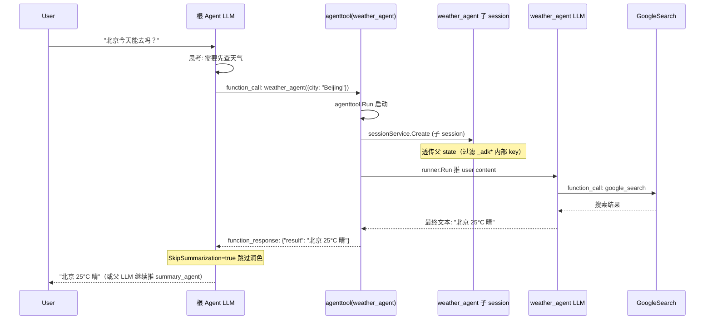
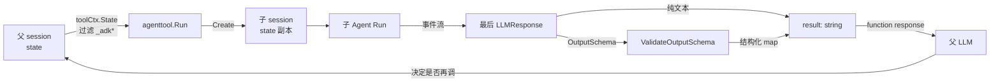

# Agent-as-Tool：把子 Agent 暴露为 Tool

> 本教程基于自定义代码（不基于 `examples/`）。我们从零写一个 `main.go`，演示如何用 [`tool/agenttool`](../../../tool/agenttool/) 把"专精子 Agent"包装成父 Agent 的可调用 Tool。

## 你将学到

- 什么是 Agent-as-Tool，为什么它和 `SubAgents` / workflow agents 不是同一回事
- `agenttool.New(agent, cfg)` 的签名、`Config` 字段（`SkipSummarization`）的语义
- 如何用 `llmagent.Config.InputSchema` / `OutputSchema` 把子 Agent 的输入输出变成强类型契约
- 子 Agent 内部如何拿到父 session 的 state（`toolCtx.State()` 透传机制）
- 父 Agent 在多 tool 场景下如何通过 description 路由到正确的子 Agent
- LLM 调用 agent tool 时的完整调用链与状态流

## 前置条件

- [x] 已完成 [01-getting-started/02-first-tool.md](../01-getting-started/02-first-tool.md)（理解 Tool 接口与 `functiontool`）
- [x] 已完成 [01-getting-started/04-multi-agents.md](../01-getting-started/04-multi-agents.md)（理解 SubAgents 委派语义）
- [x] 已设置 `GOOGLE_API_KEY`（见 [00-prerequisites.md](../00-prerequisites.md)）
- [x] 已 `git clone` ADK 仓库并 `go mod download`

## 核心概念

**Agent-as-Tool**：把一个完整的 `agent.Agent` 实例塞进 `tool.Tool` 槽位。父 Agent 在 LLM 看来，"调用这个 tool"等价于"触发子 Agent 的完整运行循环"——子 Agent 内部可以再串 LLM、再调自己的 tool、直到产出最终文本。`tool/agenttool/agent_tool.go:54` 的 `agenttool.New(agent, cfg)` 是入口。

**与 SubAgents 的差异**：

| 维度 | `SubAgents`（`agent.Config.SubAgents`） | `agenttool.New` |
|---|---|---|
| 触发方式 | LLM 根据 `Description` 决定"切到"哪个子 agent | LLM 把它当作一个 function call 调用 |
| 子 Agent 独立性 | 共用父 session | **独立子 session**（自动建） |
| 父子状态共享 | 完全共享 | 透传（`toolCtx.State().All()`，过滤 `_adk*` 内部 key） |
| 返回值 | 完整事件流回灌父 LLM | 字符串或 `OutputSchema` 解析后的 map |
| 典型场景 | workflow 编排、复杂委派 | 把"专精能力"封装成单一函数 |

简单说：**SubAgents 是"换人"，agenttool 是"外包任务然后拿回结果"**。

**Config.SkipSummarization**：当父 LLM 调用 agenttool 跑完子 Agent 拿到结果后，ADK 会把这段结果作为 function response 回喂给父 LLM，父 LLM 往往会"再总结一遍"（summarize）。设为 `true` 可跳过这一步，直接把子 Agent 的文本透传给用户（[tool/agenttool/agent_tool.go:46-50](../../../tool/agenttool/agent_tool.go)）。

## 完整代码

下面这段完整 `main.go` 复制保存到任意目录（如 `/tmp/agent-as-tool-demo/main.go`）即可运行。父 Agent 是"通用助手"，挂两个子 Agent：`weather_agent`（查天气，自带 `GoogleSearch`）和 `summary_agent`（强结构化输入输出，给定城市列表生成一句话出行建议）。

```go
// /tmp/agent-as-tool-demo/main.go
package main

import (
	"context"
	"log"
	"os"

	"google.golang.org/genai"

	"google.golang.org/adk/agent"
	"google.golang.org/adk/agent/llmagent"
	"google.golang.org/adk/cmd/launcher"
	"google.golang.org/adk/cmd/launcher/full"
	"google.golang.org/adk/model/gemini"
	"google.golang.org/adk/tool"
	"google.golang.org/adk/tool/agenttool"
	"google.golang.org/adk/tool/geminitool"
)

func main() {
	ctx := context.Background()

	// 共享同一个 Gemini 模型实例；不同子 Agent 复用
	model, err := gemini.NewModel(ctx, "gemini-2.5-flash", &genai.ClientConfig{
		APIKey: os.Getenv("GOOGLE_API_KEY"),
	})
	if err != nil {
		log.Fatalf("Failed to create model: %v", err)
	}

	// ── 子 Agent 1：天气查询（强类型 InputSchema）────────────────────
	// 没有 OutputSchema：返回纯文本，父 LLM 自由总结
	weatherAgent, err := llmagent.New(llmagent.Config{
		Name:        "weather_agent",
		Model:       model,
		Description: "查询某城市的实时天气。输入城市名，返回天气描述。",
		Instruction: "你是一个天气查询专家。用户给城市名，你就用 google_search 工具查天气并回答。",
		InputSchema: &genai.Schema{
			Type: "OBJECT",
			Properties: map[string]*genai.Schema{
				"city": {Type: "STRING", Description: "要查询天气的城市名，例如 'Beijing'"},
			},
			Required: []string{"city"},
		},
		Tools: []tool.Tool{
			geminitool.GoogleSearch{},
		},
	})
	if err != nil {
		log.Fatalf("Failed to create weather_agent: %v", err)
	}

	// ── 子 Agent 2：出行建议（强类型 Input + Output）─────────────────
	// 同时设置 InputSchema 和 OutputSchema：LLM 必须按 JSON Schema 输出
	summaryAgent, err := llmagent.New(llmagent.Config{
		Name:        "summary_agent",
		Model:       model,
		Description: "根据给定的一组天气信息，生成一句出行建议。",
		Instruction: "你是一个出行建议助手。读取输入的城市与天气，输出一句不超过 30 字的中文出行建议。",
		InputSchema: &genai.Schema{
			Type: "OBJECT",
			Properties: map[string]*genai.Schema{
				"city":        {Type: "STRING", Description: "城市名"},
				"weather":     {Type: "STRING", Description: "该城市的天气描述"},
			},
			Required: []string{"city", "weather"},
		},
		OutputSchema: &genai.Schema{
			Type: "OBJECT",
			Properties: map[string]*genai.Schema{
				"advice":   {Type: "STRING", Description: "中文出行建议"},
			},
			Required: []string{"advice"},
		},
	})
	if err != nil {
		log.Fatalf("Failed to create summary_agent: %v", err)
	}

	// ── 根 Agent：把上面两个子 Agent 暴露为 tool ─────────────────────
	rootAgent, err := llmagent.New(llmagent.Config{
		Name:        "travel_assistant",
		Model:       model,
		Description: "出行助手，能查天气并给出建议。",
		Instruction: "你可以调用两个工具：weather_agent 用于查天气，summary_agent 用于给出行建议。" +
			"用户问天气时直接调用 weather_agent；问'能不能去'或'要不要带伞'时，先查天气再调 summary_agent。",
		Tools: []tool.Tool{
			agenttool.New(weatherAgent, &agenttool.Config{
				SkipSummarization: true, // 天气结果直接给用户，不让父 LLM 改写
			}),
			agenttool.New(summaryAgent, nil), // nil = 默认配置
		},
	})
	if err != nil {
		log.Fatalf("Failed to create root_agent: %v", err)
	}

	config := &launcher.Config{AgentLoader: agent.NewSingleLoader(rootAgent)}
	l := full.NewLauncher()
	if err = l.Execute(ctx, config, os.Args[1:]); err != nil {
		log.Fatalf("Run failed: %v\n\n%s", err, l.CommandLineSyntax())
	}
}
```

## 代码逐段讲解

### 1. 子 Agent 1：带 `InputSchema`、无 `OutputSchema`

```go
weatherAgent, _ := llmagent.New(llmagent.Config{
    Name:        "weather_agent",
    InputSchema: &genai.Schema{
        Type: "OBJECT",
        Properties: map[string]*genai.Schema{
            "city": {Type: "STRING", Description: "..."},
        },
        Required: []string{"city"},
    },
    Tools: []tool.Tool{geminitool.GoogleSearch{}},
})
```

`InputSchema` 字段把子 Agent 当作 tool 时的"参数契约"显式声明（[agent/llmagent/llmagent.go:254](../../../agent/llmagent/llmagent.go)）。`agenttool` 会从这个 schema 生成 `genai.FunctionDeclaration.Parameters`（[tool/agenttool/agent_tool.go:86-115](../../../tool/agenttool/agent_tool.go)），让父 LLM 知道该传什么参数。

未设置 `OutputSchema` 时，子 Agent 返回**纯文本**——`agenttool` 把 LLM 最后一条文本拼起来，作为 `{"result": "..."}` 回传给父 LLM（[tool/agenttool/agent_tool.go:222-250](../../../tool/agenttool/agent_tool.go)）。

### 2. 子 Agent 2：同时带 `InputSchema` + `OutputSchema`

```go
OutputSchema: &genai.Schema{
    Type: "OBJECT",
    Properties: map[string]*genai.Schema{
        "advice": {Type: "STRING", Description: "..."},
    },
    Required: []string{"advice"},
},
```

设置 `OutputSchema` 时有两点关键变化：

1. 子 Agent 的 LLM **不能调用任何 tool**（[agent/llmagent/llmagent.go:259-263](../../../agent/llmagent/llmagent.go) 的注释明确说明）——它必须直接生成符合 schema 的 JSON。
2. `agenttool.Run` 会用 `utils.ValidateOutputSchema` 解析 LLM 输出文本为 `map[string]any`（[tool/agenttool/agent_tool.go:239-247](../../../tool/agenttool/agent_tool.go)），父 LLM 拿到的就是结构化字段，而不是字符串。

### 3. 关键 API：`agenttool.New(agent, cfg)`

```go
agenttool.New(weatherAgent, &agenttool.Config{
    SkipSummarization: true,
})
```

签名见 [tool/agenttool/agent_tool.go:54](../../../tool/agenttool/agent_tool.go)：

```go
func New(agent agent.Agent, cfg *Config) tool.Tool
```

- 第一个参数：任何 `agent.Agent`（`llmagent`、workflow agent、自定义 agent 都行）。
- 第二个参数：可选 `*Config`。传 `nil` 等价于 `&Config{}`（[tool/agenttool/agent_tool.go:55-60](../../../tool/agenttool/agent_tool.go)）。
- 返回值：实现 `tool.Tool` 接口的实例，可直接放进 `llmagent.Config.Tools`。

`SkipSummarization` 字段定义在 [tool/agenttool/agent_tool.go:46-50](../../../tool/agenttool/agent_tool.go)。当子 Agent 返回纯文本时，ADK 默认会让父 LLM 再"润色"一次（summary step）。若你希望子 Agent 输出**原样**给用户（如"当前北京 25°C 晴"），就把它设为 `true`，避免父 LLM 改写。

### 4. 根 Agent 把两个 agenttool 挂上

```go
Tools: []tool.Tool{
    agenttool.New(weatherAgent, &agenttool.Config{SkipSummarization: true}),
    agenttool.New(summaryAgent, nil),
},
```

父 Agent 的 `Tools` 列表里现在是两个 agenttool。对父 LLM 而言：

- 第一个 tool 的 `Name()` = `"weather_agent"`，`Description()` = 子 Agent 的 `Description`（[tool/agenttool/agent_tool.go:68-75](../../../tool/agenttool/agent_tool.go)），参数是 `{city: string}`。
- 第二个 tool 的 `Name()` = `"summary_agent"`，参数是 `{city, weather}`，返回结构化 `{advice}`。

父 LLM 看到这两个 function declaration 后，会按用户问题自动决定调哪个、调几次。

### 5. agenttool 内部：新建子 session 跑子 Agent



> **看图指引**：横向看"调用栈"，纵向看"时间推进"。重点观察**子 session 是 agenttool 内部自动建的**（[tool/agenttool/agent_tool.go:168-198](../../../tool/agenttool/agent_tool.go)），不污染父 session 事件历史；父 state 通过 `toolCtx.State().All()` 过滤 `_adk*` 前缀的内部 key 后复制到子 session（[tool/agenttool/agent_tool.go:182-189](../../../tool/agenttool/agent_tool.go)）。

### 6. 状态流总览



> **看图指引**：左到右是"数据流向"。父 state 不会被子 Agent 修改（子 session 是独立副本），这是与 `SubAgents` 共用 state 的关键区别。如果需要子 Agent 写回 state，应在子 Agent 内用 `OutputKey` 配合 callback 把数据回灌父 session。

## 准备与运行

### 步骤 1：保存代码

```bash
mkdir -p /tmp/agent-as-tool-demo
# 把上面"完整代码"段保存到 /tmp/agent-as-tool-demo/main.go
```

### 步骤 2：初始化 go module 并加依赖

```bash
cd /tmp/agent-as-tool-demo
go mod init demo
go get google.golang.org/adk@latest
go mod tidy
```

### 步骤 3：确认 API key

```bash
echo $GOOGLE_API_KEY   # 应输出 AIza...
```

### 步骤 4：运行

```bash
go run . console
```

### 步骤 5：测试输入

```
User: 北京今天天气怎么样？
[travel_assistant 看到 weather_agent 这个 tool，传入 {city: "Beijing"}，子 agent 用 GoogleSearch 查到天气]
[根 agent 直接把结果给用户：当前北京 25°C 晴]

User: 那我今天去北京出差要带伞吗？
[travel_assistant 调 weather_agent 查天气，拿到结果]
[再调 summary_agent，传入 {city, weather}，子 agent 按 OutputSchema 输出 {"advice": "..."}]
[最终回复: "北京 25°C 晴，无需带伞。"]
```

## 常见错误

- **`agenttool: argument validation failed for agent weather_agent: missing required field "city"`** —— 父 LLM 漏传 `InputSchema` 必填字段。检查子 Agent 的 `Required` 列表是否过严，或在子 Agent `Instruction` 中提示父 LLM。
- **`output validation failed for sub-agent summary_agent`** —— 子 Agent LLM 输出 JSON 不符合 `OutputSchema`（如 `"advice"` 拼成 `"Advice"`）。可以在 `Instruction` 中强调"严格按 JSON Schema 输出"。详见测试 [tool/agenttool/agent_tool_test.go:140-168](../../../tool/agenttool/agent_tool_test.go)。
- **子 Agent 用了 `Tools`，又设了 `OutputSchema`** —— 编译时不报错，但运行时报 "agent can only reply and cannot use any tools"（[agent/llmagent/llmagent.go:259-263](../../../agent/llmagent/llmagent.go)）。`OutputSchema` 模式下子 Agent 必须纯生成，不许调 tool。
- **父 LLM 不调 agenttool** —— 子 Agent 的 `Description` 写得太泛，LLM 不知道怎么触发。改成"动词开头 + 输入输出格式"，例如"查询某城市的实时天气，输入城市名，返回天气描述"。
- **`agenttool: nil agent`** —— `agenttool.New(nil, nil)` 会 panic。`tool/tool_test.go:80` 的合约测试会拦截。
- **子 session 拿不到父 state** —— 父 state 中带 `_adk` 前缀的内部 key 被 `agenttool` 主动过滤（[tool/agenttool/agent_tool.go:186](../../../tool/agenttool/agent_tool.go)），这是设计如此不是 bug；想透传自定义 key 时别用这个前缀。

## 关键 API 小结

| API | 位置 | 作用 |
|---|---|---|
| `agenttool.New(agent, cfg)` | `tool/agenttool/agent_tool.go:54` | 把 agent 包装成 `tool.Tool` |
| `agenttool.Config` | `tool/agenttool/agent_tool.go:46` | 可选配置（当前仅 `SkipSummarization`） |
| `agenttool.New().Name()` | `tool/agenttool/agent_tool.go:68` | 直接返回子 agent 的 `Name` |
| `agenttool.New().Declaration()` | `tool/agenttool/agent_tool.go:86` | 从子 agent `InputSchema` 生成 `genai.FunctionDeclaration` |
| `agenttool.New().Run()` | `tool/agenttool/agent_tool.go:121` | 创建子 session、跑子 agent、返回结果 |
| `llmagent.Config.InputSchema` | `agent/llmagent/llmagent.go:254` | 子 Agent 作为 tool 时的参数契约 |
| `llmagent.Config.OutputSchema` | `agent/llmagent/llmagent.go:259` | 子 Agent 返回结构化 JSON 的 schema |
| `utils.ValidateOutputSchema` | `internal/utils/` | 解析 LLM 文本输出为 `map[string]any` |
| `toolCtx.State().All()` | `agent/context.go` | 父 session state 读取入口（agenttool 透传时调用） |
| `runner.New` | `runner/runner.go` | agenttool 内部为子 agent 构造的 runner |

## 延伸阅读

- [架构文档：tool 工具契约](../../architecture/03-modules/03-tool.md)
- [架构文档：扩展点 §3 写一个自定义 Tool](../../architecture/02-extension-points.md#3-写一个自定义-tool)
- [架构文档：F3 多 Agent 协作（含 Agent-as-Tool 对比）](../../architecture/01-core-flows.md#f3-多-agent-协作)
- [架构文档：F2 工具调用流程](../../architecture/01-core-flows.md#f2工具调用)
- [examples/tools/multipletools/main.go](../../../examples/tools/multipletools/main.go) —— 同款思路：把不能共存的 tool 类型拆到不同子 agent
- [tool/agenttool/agent_tool_test.go](../../../tool/agenttool/agent_tool_test.go) —— `agenttool` 的官方合约测试，含 InputSchema/OutputSchema 校验示例
- 自定义 Tool 进阶（带 artifact / memory 访问）见 [02-tools/06-load-artifacts.md](./06-load-artifacts.md) 与 [02-tools/07-load-memory.md](./07-load-memory.md)
