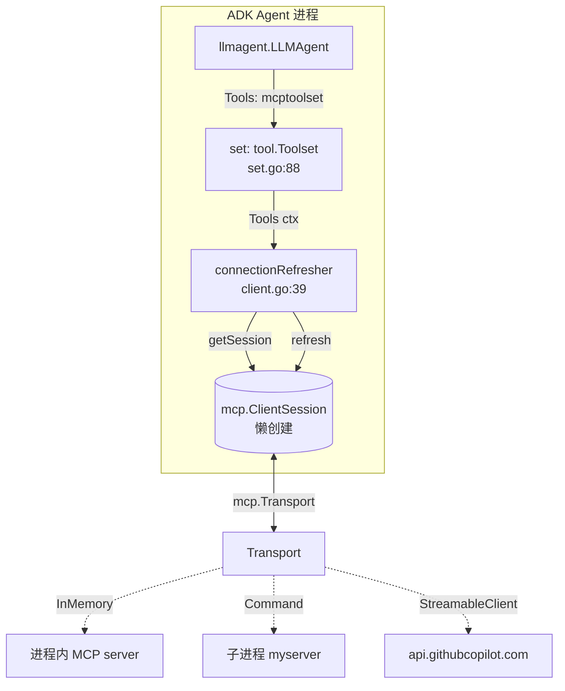

# MCP 工具：让 Agent 调用 Model Context Protocol 服务

> 本教程基于 [`examples/mcp/main.go`](../../../examples/mcp/main.go)。约 135 行，演示两种把外部 MCP 服务接入 ADK agent 的方式：进程内内存 MCP server（用于本地/测试）与 GitHub 官方远程 MCP server（用于真实业务场景）。

## 你将学到

- 什么是 **Model Context Protocol（MCP）**，以及它给 Agent 带来的好处
- `mcptoolset.New` 把一个 `mcp.Transport` 包装成 `tool.Toolset` 的过程
- 三种常见 `mcp.Transport` 的差异：`InMemoryTransports`、`CommandTransport`、`StreamableClientTransport`
- **Lazy 连接**与**自动重连**机制：MCP session 何时建立、断线后如何恢复
- 如何用 `mcp.AddTool` 把普通 Go 函数注册为 MCP server 上的工具
- 切换本地/远程模式的环境变量约定

## 前置条件

- [x] 已完成 [00-prerequisites.md](../00-prerequisites.md)
- [x] 已完成 [01-getting-started/02-first-tool.md](../01-getting-started/02-first-tool.md)（了解 `tool.Tool` 契约）
- [x] 已设置 `GOOGLE_API_KEY`（见 [00-prerequisites.md §3](../00-prerequisites.md)）
- [x] 已 `git clone` ADK 仓库并 `go mod download`（会自动拉 `github.com/modelcontextprotocol/go-sdk`）
- [x] 可选：已申请 [GitHub Personal Access Token](https://github.com/settings/tokens) 以测试 `AGENT_MODE=github`

## 核心概念

**Model Context Protocol（MCP）** 是一套让 LLM 与"工具/数据源"解耦的开放协议。工具作者按 MCP 规范把能力暴露为"远端服务"，Agent 客户端按 MCP 规范发现并调用它们。ADK 通过 [`tool/mcptoolset/`](../../../tool/mcptoolset/) 子包把这一协议翻译成 ADK 自己的 `tool.Toolset`（[tool/tool.go:57](../../../tool/tool.go)），让 LLM 透明地使用远端工具。

**Transport 抽象**：`mcp.Transport` 是 MCP 协议在 Go SDK 里的连接抽象，可以是进程内通道（`InMemoryTransports`，用于测试）、子进程 stdio（`CommandTransport`，用于本地 CLI 服务），也可以是 HTTP/SSE（`StreamableClientTransport`，用于云端 SaaS）。你提供什么 transport，ADK 就连到哪里——业务代码不需要知道"是本地进程还是 GitHub 服务器"。

**Lazy 连接**：[`tool/mcptoolset/set.go:31`](../../../tool/mcptoolset/set.go) 注释明确写道：*"MCP session is created lazily on the first request to LLM."*。`mcptoolset.New` 只是构造 `set` 结构体并保存 transport，**不会**立刻拨号/连接；只有当 agent 第一次需要工具列表（`ListTools`）或调用工具（`CallTool`）时，ADK 才会真正建立 session（[tool/mcptoolset/client.go:148](../../../tool/mcptoolset/client.go)）。这样构造期不会阻塞，启动失败时也不会"半连接"。

**自动重连**：[`tool/mcptoolset/client.go:39`](../../../tool/mcptoolset/client.go) 的 `connectionRefresher` 在底层 session 报 `mcp.ErrConnectionClosed` / `ErrSessionMissing` / `io.EOF` 等错误时（[tool/mcptoolset/client.go:48](../../../tool/mcptoolset/client.go)），先 `Ping` 一次确认 session 死了，再 `Close` 旧 session 然后重新 `Connect`，最后透明地把原调用重试一次（[tool/mcptoolset/client.go:114-135](../../../tool/mcptoolset/client.go)）。调用方完全感知不到重连过程。

下图为数据流与状态机的鸟瞰：



**看图指引**：

- `set` 构造时不连接；`Tools(ctx)` 被调用时才会通过 `connectionRefresher` 建立 session。
- 三种 transport 对应三种部署形态：测试、CLI 工具、云服务；业务代码只看到 `tool.Toolset`。
- `connectionRefresher` 是故障恢复点：session 死了就 `Ping → Close → Reconnect → 重试`，调用方无感。

## 完整代码

完整源码在 [`examples/mcp/main.go`](../../../examples/mcp/main.go)（约 135 行）。要点摘录（删去版权声明与长 import）：

```go
// examples/mcp/main.go
package main

import (
	"context"
	"fmt"
	"log"
	"os"
	"os/signal"
	"strings"

	"github.com/modelcontextprotocol/go-sdk/mcp"
	"golang.org/x/oauth2"
	"google.golang.org/genai"

	"google.golang.org/adk/agent"
	"google.golang.org/adk/agent/llmagent"
	"google.golang.org/adk/cmd/launcher"
	"google.golang.org/adk/cmd/launcher/full"
	"google.golang.org/adk/model/gemini"
	"google.golang.org/adk/tool"
	"google.golang.org/adk/tool/mcptoolset"
)

type Input struct {
	City string `json:"city" jsonschema:"city name"`
}

type Output struct {
	WeatherSummary string `json:"weather_summary" jsonschema:"weather summary in the given city"`
}

func GetWeather(ctx context.Context, req *mcp.CallToolRequest, input Input) (*mcp.CallToolResult, Output, error) {
	return nil, Output{
		WeatherSummary: fmt.Sprintf("Today in %q is sunny\n", input.City),
	}, nil
}

func localMCPTransport(ctx context.Context) mcp.Transport {
	clientTransport, serverTransport := mcp.NewInMemoryTransports()

	server := mcp.NewServer(&mcp.Implementation{Name: "weather_server", Version: "v1.0.0"}, nil)
	mcp.AddTool(server, &mcp.Tool{Name: "get_weather", Description: "returns weather in the given city"}, GetWeather)
	if _, err := server.Connect(ctx, serverTransport, nil); err != nil {
		log.Fatal(err)
	}
	return clientTransport
}

func githubMCPTransport(ctx context.Context) mcp.Transport {
	ts := oauth2.StaticTokenSource(
		&oauth2.Token{AccessToken: os.Getenv("GITHUB_PAT")},
	)
	return &mcp.StreamableClientTransport{
		Endpoint:   "https://api.githubcopilot.com/mcp/",
		HTTPClient: oauth2.NewClient(ctx, ts),
	}
}

func main() {
	ctx, stop := signal.NotifyContext(context.Background(), os.Interrupt)
	defer stop()

	model, err := gemini.NewModel(ctx, "gemini-3.1-flash-lite", &genai.ClientConfig{
		APIKey: os.Getenv("GOOGLE_API_KEY"),
	})
	if err != nil {
		log.Fatalf("Failed to create model: %v", err)
	}

	var transport mcp.Transport
	if strings.ToLower(os.Getenv("AGENT_MODE")) == "github" {
		transport = githubMCPTransport(ctx)
	} else {
		transport = localMCPTransport(ctx)
	}

	mcpToolSet, err := mcptoolset.New(mcptoolset.Config{
		Transport: transport,
	})
	if err != nil {
		log.Fatalf("Failed to create MCP tool set: %v", err)
	}

	a, err := llmagent.New(llmagent.Config{
		Name:        "helper_agent",
		Model:       model,
		Description: "Helper agent.",
		Instruction: "You are a helpful assistant that helps users with various tasks.",
		Toolsets: []tool.Toolset{
			mcpToolSet,
		},
	})
	if err != nil {
		log.Fatalf("Failed to create agent: %v", err)
	}

	config := &launcher.Config{AgentLoader: agent.NewSingleLoader(a)}
	l := full.NewLauncher()
	if err = l.Execute(ctx, config, os.Args[1:]); err != nil {
		log.Fatalf("Run failed: %v\n\n%s", err, l.CommandLineSyntax())
	}
}
```

## 代码逐段讲解

### 1. 定义 MCP 工具的输入/输出与处理函数

```go
type Input struct {
	City string `json:"city" jsonschema:"city name"`
}
type Output struct {
	WeatherSummary string `json:"weather_summary" jsonschema:"weather summary in the given city"`
}

func GetWeather(ctx context.Context, req *mcp.CallToolRequest, input Input) (*mcp.CallToolResult, Output, error) {
	return nil, Output{
		WeatherSummary: fmt.Sprintf("Today in %q is sunny\n", input.City),
	}, nil
}
```

MCP Go SDK 的工具签名是 `func(ctx, *mcp.CallToolRequest, Input) (*mcp.CallToolResult, Output, error)`：第二个返回值是结构化结果，SDK 会把它打包成 JSON 透传给 LLM。`jsonschema:"…"` 标签不是必需的，但加上后能在远端服务的工具声明里提供字段说明，提升 LLM 调用准确率。

### 2. 用 InMemoryTransports 启动一个进程内 MCP server

```go
func localMCPTransport(ctx context.Context) mcp.Transport {
	clientTransport, serverTransport := mcp.NewInMemoryTransports()

	server := mcp.NewServer(&mcp.Implementation{Name: "weather_server", Version: "v1.0.0"}, nil)
	mcp.AddTool(server, &mcp.Tool{Name: "get_weather", Description: "returns weather in the given city"}, GetWeather)
	if _, err := server.Connect(ctx, serverTransport, nil); err != nil {
		log.Fatal(err)
	}
	return clientTransport
}
```

`mcp.NewInMemoryTransports()` 返回一对 `Transport`：client 端给 ADK 用，server 端绑到一个 `mcp.Server`。`mcp.AddTool` 把 `GetWeather` 注册成名为 `get_weather` 的远端工具。`server.Connect` 之后 server 就在内存里"开跑"了。整个 setup 不需要任何网络端口——适合单元测试与本地 demo。

### 3. 用 StreamableClientTransport 连远端 MCP server

```go
func githubMCPTransport(ctx context.Context) mcp.Transport {
	ts := oauth2.StaticTokenSource(
		&oauth2.Token{AccessToken: os.Getenv("GITHUB_PAT")},
	)
	return &mcp.StreamableClientTransport{
		Endpoint:   "https://api.githubcopilot.com/mcp/",
		HTTPClient: oauth2.NewClient(ctx, ts),
	}
}
```

`mcp.StreamableClientTransport` 是 MCP 官方 HTTP/SSE 传输的实现。`HTTPClient` 字段让你塞任何 `*http.Client`——这里用 `oauth2.NewClient` 把 GitHub PAT 注入 `Authorization` 头。只要 MCP server 暴露标准 HTTP endpoint，零额外代码就能连上。

### 4. 根据环境变量切换 transport

```go
var transport mcp.Transport
if strings.ToLower(os.Getenv("AGENT_MODE")) == "github" {
	transport = githubMCPTransport(ctx)
} else {
	transport = localMCPTransport(ctx)
}
```

这是"开发用本地、线上接 SaaS"的常见模式。默认走 `localMCPTransport`（不需要任何外部凭证），把 `AGENT_MODE=github` 设上就改走 GitHub 官方 MCP server。

### 5. 包装成 Toolset 并喂给 agent

```go
mcpToolSet, err := mcptoolset.New(mcptoolset.Config{
	Transport: transport,
})

a, err := llmagent.New(llmagent.Config{
	Toolsets: []tool.Toolset{
		mcpToolSet,
	},
})
```

注意 `llmagent.Config` 有两个并列字段：`Tools []tool.Tool`（单个工具）和 `Toolsets []tool.Toolset`（工具集）。当 MCP server 暴露的工具数量动态、或者你想复用同一份 toolset 到多个 agent 时，**必须用 `Toolsets`**，因为 `Toolset.Tools(ctx)` 是个**方法**而非静态列表——LLM 每次发起新一轮对话时，ADK 都会调它拉取最新工具清单（[tool/mcptoolset/set.go:108-129](../../../tool/mcptoolset/set.go)）。

`mcptoolset.New` 此时**还没有**任何网络动作：它只是构造 `set{mcpClient: connectionRefresher{...}}`（[tool/mcptoolset/set.go:49-56](../../../tool/mcptoolset/set.go)），把 `transport` 字段塞进 `connectionRefresher`（[tool/mcptoolset/client.go:57-65](../../../tool/mcptoolset/client.go)）。

### 6. 启动 launcher

`full.NewLauncher().Execute(ctx, config, os.Args[1:])` 与 [01-hello-world.md](../01-getting-started/01-hello-world.md) 完全一致：在 `console` 模式下手输对话，在 `restapi` 模式下变成 HTTP 服务。第一轮 LLM 请求发出时，`connectionRefresher.getSession` 才会真正 `client.Connect(ctx, transport, nil)`（[tool/mcptoolset/client.go:156](../../../tool/mcptoolset/client.go)），这正是"懒连接"的入口。

## 准备与运行

### 步骤 1：确认 API key

```bash
echo $GOOGLE_API_KEY   # 应输出 AIza...
```

未设置时回到 [00-prerequisites.md §3](../00-prerequisites.md) 获取。

### 步骤 2：本地模式运行

```bash
cd /path/to/adk-go
go run ./examples/mcp console
```

成功时会进入交互式 console；你看到的工具列表里会有 `get_weather` 一项。

### 步骤 3：测试输入（本地模式）

```
User: What's the weather in Tokyo?
[agent 调用本地 MCP server 上的 get_weather 工具，返回 "Today in \"Tokyo\" is sunny"]
```

### 步骤 4：（可选）切到 GitHub MCP server

```bash
export GITHUB_PAT=ghp_xxxxxxxxxxxxxxxxxxxx
go run ./examples/mcp console
# 或一次性：AGENT_MODE=github go run ./examples/mcp console
```

期望：工具列表立刻变成 GitHub MCP server 暴露的几十个仓库/PR/Issue 相关工具。试着问：

```
User: List the most recent issues in the modelcontextprotocol/go-sdk repo.
```

## 常见错误

- **`failed to init MCP session`** —— transport 配错或远端不可达。`StreamableClientTransport` 拼错 endpoint（少了尾部 `/` 是常见坑）；`CommandTransport` 配的命令路径找不到。
- **`GITHUB_PAT` 未设置** —— `oauth2.StaticTokenSource` 拿到空字符串，GitHub 返回 401。`AGENT_MODE=github` 时**必须**先 `export GITHUB_PAT`。
- **`Toolsets` 与 `Tools` 混用导致一个被忽略** —— ADK 不会合并两份列表；要么全放 `Toolsets` 要么全放 `Tools`。
- **MCP server 重启后第一次调用卡顿** —— `connectionRefresher.refreshConnection` 在锁内做 `Ping → Close → Connect`（[tool/mcptoolset/client.go:165-188](../../../tool/mcptoolset/client.go)），最坏情况有一次 RTT。这是正常行为，不是 bug。
- **LLM 看不到 MCP 工具** —— 大概率 `mcp.AddTool` 时 `Description` 留空；tool 描述是 LLM 决定"调不调"的唯一线索，缺了就视而不见。
- **`no text content in tool response`** —— 你的 MCP 工具只返回了 image / audio content。`mcpTool.Run`（[tool/mcptoolset/tool.go:94-175](../../../tool/mcptoolset/tool.go)）当前只读 `mcp.TextContent`；想要富媒体需要扩展 `Run` 的结果解析。

## 关键 API 小结

| API | 位置 | 作用 |
|---|---|---|
| `mcptoolset.New` | [`tool/mcptoolset/set.go:49`](../../../tool/mcptoolset/set.go) | 构造 `tool.Toolset`，**不**立刻连 server |
| `mcptoolset.Config.Transport` | [`tool/mcptoolset/set.go:63`](../../../tool/mcptoolset/set.go) | 必填；`mcp.Transport` 实例 |
| `mcptoolset.Config.ToolFilter` | [`tool/mcptoolset/set.go:68`](../../../tool/mcptoolset/set.go) | 选填；`tool.Predicate` 过滤暴露给 LLM 的工具名 |
| `connectionRefresher.getSession` | [`tool/mcptoolset/client.go:148`](../../../tool/mcptoolset/client.go) | 懒连接：首次调用时 `mcp.Client.Connect` |
| `connectionRefresher.refreshConnection` | [`tool/mcptoolset/client.go:165`](../../../tool/mcptoolset/client.go) | 自动重连：`Ping → Close → Reconnect` |
| `refreshableErrors` | [`tool/mcptoolset/client.go:48`](../../../tool/mcptoolset/client.go) | 触发重连的错误白名单（`ErrConnectionClosed` 等） |
| `mcp.InMemoryTransports` | `github.com/modelcontextprotocol/go-sdk/mcp` | 进程内 transport 对，用于测试 |
| `mcp.CommandTransport` | `github.com/modelcontextprotocol/go-sdk/mcp` | stdio 子进程 transport，包装 CLI 工具 |
| `mcp.StreamableClientTransport` | `github.com/modelcontextprotocol/go-sdk/mcp` | HTTP/SSE transport，连接云端 MCP server |
| `llmagent.Config.Toolsets` | `agent/llmagent/llmagent.go` | 工具集字段；与 `Tools` 并列二选一 |
| `mcp.AddTool` | `github.com/modelcontextprotocol/go-sdk/mcp` | 把 Go 函数注册为 MCP server 上的远端工具 |

## 延伸阅读

- 架构文档：[tool 模块总览 — mcptoolset 子包](../../architecture/03-modules/03-tool.md#mcptoolset)
- 架构文档：[扩展点 — 接入外部协议 / MCP](../../architecture/02-extension-points.md#3-写一个自定义-tool)
- 架构文档：[F2 工具调用流程](../../architecture/01-core-flows.md#f2-工具调用)（看 LLM 怎么触发 `connectionRefresher.CallTool`）
- 源码：[`examples/mcp/main.go`](../../../examples/mcp/main.go) —— 本教程讲解的 135 行可运行示例
- 源码：[`tool/mcptoolset/set.go`](../../../tool/mcptoolset/set.go) —— `mcptoolset.New` 与 `set.Tools` 实现
- 源码：[`tool/mcptoolset/client.go`](../../../tool/mcptoolset/client.go) —— `connectionRefresher` 懒连接与重连逻辑
- 源码：[`tool/mcptoolset/tool.go`](../../../tool/mcptoolset/tool.go) —— MCP 工具 → ADK `tool.Tool` 的转换与执行
- 外部参考：[MCP 官方协议规范](https://modelcontextprotocol.io/) 与 [Go SDK 仓库](https://github.com/modelcontextprotocol/go-sdk)
- 未来子项目深读占位：MCP 多 server 联邦、`mcp.Tool.OutputSchema` 富媒体响应、OAuth 刷新令牌流
