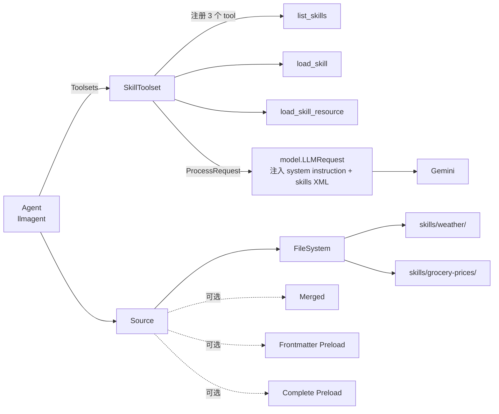

# Skill 工具：让 Agent 加载"技能包"

本教程基于 [`examples/skills/main.go`](../../../examples/skills/main.go)。该示例演示如何用 `skilltoolset` 把一组按目录组织的"技能包（skill）"暴露给 Agent —— Agent 在运行时按需 `load_skill` 读取技能说明，再按需 `load_skill_resource` 读附加资源，从而让 LLM 在不重新训练的前提下获得"领域剧本"与"领域数据"。

## 你将学到

- 什么是 Skill（技能包）：一个包含 `SKILL.md` 的目录，含 frontmatter 元数据 + Markdown 说明 + 可选 `references/` / `assets/` / `scripts/` 资源
- `skill.Source` 接口的 4 种实现：filesystem（直读磁盘）、merged（多源合并）、frontmatter preload（只缓存元数据）、complete preload（全量预热）
- `skilltoolset` 暴露给 Agent 的 3 个内置 tool：`list_skills` / `load_skill` / `load_skill_resource`
- `SKILL.md` 的 frontmatter 字段约束（`name` 必须等于目录名，1-64 字符，仅小写字母数字与连字符）
- 为什么需要 `WithCompletePreloadSource`：在并发场景下避免冷启动的多次磁盘 IO
- 资源访问的安全边界：`LoadResource` 强制路径必须落在 `references/`、`assets/`、`scripts/` 之下

## 前置条件

- [x] 已完成 [00-prerequisites.md](../00-prerequisites.md)
- [x] 已完成 [01-getting-started/02-first-tool.md](../01-getting-started/02-first-tool.md)
- [x] 已完成 [02-tools/01-functiontool.md](./01-functiontool.md)
- [x] 已设置 `GOOGLE_API_KEY`
- [x] 本地可访问 `generativelanguage.googleapis.com`

## 核心概念

**Skill（技能包）** 是一种"以文件系统为载体的领域增强包"。每一个 skill 是一个目录，里面**必须**有一份 `SKILL.md`（带 YAML frontmatter + Markdown 说明），可选带 `references/`、`assets/`、`scripts/` 三个子目录。frontmatter 的 `name` 字段必须**与目录名完全一致**（[tool/skilltoolset/skill/filesystem_source.go:223-226](../../../tool/skilltoolset/skill/filesystem_source.go)），`description` 写清"这个 skill 能做什么"，`name` 长度 1-64、只允许小写字母数字与连字符（[tool/skilltoolset/skill/frontmatter.go:111-127](../../../tool/skilltoolset/skill/frontmatter.go)）。

**`skill.Source` 是统一的"技能仓库"接口**（[tool/skilltoolset/skill/source.go:41-61](../../../tool/skilltoolset/skill/source.go)），定义 5 个方法：`ListFrontmatters` / `ListResources` / `LoadFrontmatter` / `LoadInstructions` / `LoadResource`。所有实现都必须是并发安全的，并应返回 `source.go:24-31` 定义的哨兵错误（`ErrInvalidSkillName` / `ErrSkillNotFound` / `ErrResourceNotFound` 等）。ADK 提供 4 种现成实现：

| 实现 | 工厂函数 | 何时用 |
|---|---|---|
| **FileSystem** | `skill.NewFileSystemSource(fs.FS)` | 单一目录、最简单 |
| **Merged** | `skill.NewMergedSource(src1, src2, …)` | 多个目录合并（按顺序查询） |
| **Frontmatter Preload** | `skill.WithFrontmatterPreloadSource(ctx, src)` | 只缓存元数据，资源走原 source |
| **Complete Preload** | `skill.WithCompletePreloadSource(ctx, src)` | 全部缓存到内存，最快但最占内存 |

**`skilltoolset` 把 Source 暴露成 3 个 tool**：每次 LLM 请求时，toolset 的 `ProcessRequest` 会把"可用 skill 列表（XML 形式）" + "如何使用 skill 的系统指令"注入到请求（[tool/skilltoolset/toolset.go:107-117](../../../tool/skilltoolset/toolset.go)），LLM 据此决定是否调用 `load_skill` / `load_skill_resource`。



**看图指引**：

- `SkillToolset` 同时实现 `tool.Toolset`（暴露 3 个 tool）与 `RequestProcessor`（向 LLM 请求注入"如何用 skill" + 当前可用 skill 清单）。
- `Source` 是 4 种实现的统一抽象；预热装饰器（frontmatter / complete preload）"包装"底层 source，不改变其语义。
- `FileSystem Source` 直接扫描传入 `fs.FS` 根目录的**直接子目录**，每个子目录即一个 skill；非 skill 目录会被静默忽略（[filesystem_source.go:55-79](../../../tool/skilltoolset/skill/filesystem_source.go)）。

## 完整代码

完整源码在 [`examples/skills/main.go`](../../../examples/skills/main.go)（约 88 行）。关键片段：

```go
// examples/skills/main.go
package main

import (
	"context"
	"log"
	"os"

	"google.golang.org/genai"

	"google.golang.org/adk/agent"
	"google.golang.org/adk/agent/llmagent"
	"google.golang.org/adk/cmd/launcher"
	"google.golang.org/adk/cmd/launcher/full"
	"google.golang.org/adk/model/gemini"
	"google.golang.org/adk/tool"
	"google.golang.org/adk/tool/skilltoolset"
	"google.golang.org/adk/tool/skilltoolset/skill"
)

func main() {
	ctx := context.Background()

	model, _ := gemini.NewModel(ctx, "gemini-3.1-flash-lite", &genai.ClientConfig{
		APIKey: os.Getenv("GOOGLE_API_KEY"),
	})

	// 1. 用文件系统作为 skill 仓库
	source := skill.NewFileSystemSource(os.DirFS("./skills"))

	// 2. 预热：把所有 skill 的元数据 + 说明 + 资源一次性读入内存
	source, _, err := skill.WithCompletePreloadSource(ctx, source)
	if err != nil {
		log.Fatalf("Failed to preload skills: %v", err)
	}

	// 3. 创建 SkillToolset
	skillToolset, err := skilltoolset.New(ctx, skilltoolset.Config{Source: source})
	if err != nil {
		log.Fatalf("Failed to create skill toolset: %v", err)
	}

	// 4. 把 toolset 挂到 Agent
	a, _ := llmagent.New(llmagent.Config{
		Name:        "skills_agent",
		Model:       model,
		Description: "Agent to demonstrate using skills.",
		Instruction: "You are a helpful assistant.",
		Toolsets:    []tool.Toolset{skillToolset},
	})

	config := &launcher.Config{AgentLoader: agent.NewSingleLoader(a)}
	l := full.NewLauncher()
	if err = l.Execute(ctx, config, os.Args[1:]); err != nil {
		log.Fatalf("Run failed: %v\n\n%s", err, l.CommandLineSyntax())
	}
}
```

`examples/skills/skills/` 下放了两个示例 skill：

```text
skills/
├── weather/
│   ├── SKILL.md                # name: weather, description: 检查各国天气
│   └── references/
│       ├── weather_pl.json
│       └── weather_us.json
└── grocery-prices/
    ├── SKILL.md                # name: grocery-prices, description: 含税杂货价
    └── assets/
        ├── prices_pl.json
        └── prices_us.json
```

## 代码逐段讲解

### 1. 选一个 Source 实现

```go
source := skill.NewFileSystemSource(os.DirFS("./skills"))
```

`os.DirFS("./skills")` 把本地目录转成 `fs.FS`（标准库接口），`NewFileSystemSource` 用它构造一个直接读磁盘的 Source（[tool/skilltoolset/skill/filesystem_source.go:44-46](../../../tool/skilltoolset/skill/filesystem_source.go)）。**重要约束**：传入的 `fs.FS` 的"直接子目录"是 skill；非 skill 目录（如存放 README 的目录）会被 `readSkill` 静默跳过（[filesystem_source.go:67-73](../../../tool/skilltoolset/skill/filesystem_source.go)）。这意味着你可以把"skill 目录"与"普通资源目录"放在同一层，FS Source 会自动忽略非 SKILL.md 的子目录。

### 2. 预热：WithCompletePreloadSource

```go
source, _, err := skill.WithCompletePreloadSource(ctx, source)
```

`WithCompletePreloadSource` 是一个"包装器"（[tool/skilltoolset/skill/complete_preload.go:57-63](../../../tool/skilltoolset/skill/complete_preload.go)）：它在构造时**同步遍历**底层 source 的所有 skill，把 `Frontmatter` + `Instructions` + **所有资源字节**（限制单个资源 ≤ 10MB，见 [complete_preload.go:28](../../../tool/skilltoolset/skill/complete_preload.go) 与 [complete_preload.go:178-185](../../../tool/skilltoolset/skill/complete_preload.go)）一次性读到内存并加锁保护。返回的 `reload` 回调可在运行时重新扫描（用于"热更新"），本示例忽略。

**何时用 preload**：toolset 启动后会被多 goroutine 并发调用 `LoadInstructions` / `LoadResource`；无预热的话每次都要走磁盘，重复 skill 时尤其慢。`WithFrontmatterPreloadSource`（[frontmatter_preload.go:37-43](../../../tool/skilltoolset/skill/frontmatter_preload.go)）是更轻量的版本 —— 只缓存 frontmatter，资源仍走底层 source，适合"资源很大、不常被读"的场景。

### 3. NewMergedSource：多源合并

```go
merged := skill.NewMergedSource(
    skill.NewFileSystemSource(os.DirFS("./skills/global")),
    skill.NewFileSystemSource(os.DirFS("./skills/local")),
)
```

`NewMergedSource` 把多个 Source 包成一个（[tool/skilltoolset/skill/merged_source.go:32-34](../../../tool/skilltoolset/skill/merged_source.go)）。**查询顺序就是构造顺序**：每个 `Load*` 方法会**依次**问每个 source，谁先返回非 `ErrSkillNotFound` 就用谁的结果（[merged_source.go:70-81](../../../tool/skilltoolset/skill/merged_source.go)）。`ListFrontmatters` 会**拼接**所有 source 的结果，**重复 skill 名会返回 `ErrDuplicateSkill`**（[merged_source.go:46-49](../../../tool/skilltoolset/skill/merged_source.go)）。常见用法是"全局共享 skill + 项目私有 skill 覆盖"。

### 4. 创建 SkillToolset

```go
skillToolset, err := skilltoolset.New(ctx, skilltoolset.Config{Source: source})
```

`skilltoolset.New` 在内部为 source 装配 3 个 tool（[tool/skilltoolset/toolset.go:77-88](../../../tool/skilltoolset/toolset.go)）：

- `list_skills`：列出所有 skill 的 frontmatter
- `load_skill`：读取指定 skill 的完整 Markdown 说明
- `load_skill_resource`：读取 skill 下的附加文件（限定 `references/` / `assets/` / `scripts/`）

`Config` 还有两个可选字段：`Name`（默认 `"SkillToolset"`）与 `SystemInstruction`（默认 [toolset.go:31-45](../../../tool/skilltoolset/toolset.go) 那一大段，告诉 LLM "何时用 skill、用什么 tool"）。

### 5. 把 toolset 挂到 Agent

```go
a, _ := llmagent.New(llmagent.Config{
    Toolsets: []tool.Toolset{skillToolset},
})
```

注意用的是 `Toolsets`（复数，`[]tool.Toolset`）而不是 `Tools`（`[]tool.Tool`）。`Toolset` 是一个"延迟展开"的容器 —— `Tools(ctx)` 在每次请求时返回工具列表（[tool/skilltoolset/toolset.go:102](../../../tool/skilltoolset/toolset.go)），并且 SkillToolset 还实现了 `RequestProcessor`，**在请求体里追加系统指令 + skill 清单 XML**（[toolset.go:107-117](../../../tool/skilltoolset/toolset.go)）。LLM 看到这些信息后才"知道有哪些 skill 可用、何时调用"。

## 准备与运行

### 步骤 1：确认 API key

```bash
echo $GOOGLE_API_KEY
```

### 步骤 2：进入示例目录（**必须**从此目录运行）

`examples/skills/main.go` 第 35-38 行注释明确警告：必须从 `examples/skills/` 运行，因为 `os.DirFS("./skills")` 是**相对路径**。

```bash
cd /path/to/adk-go/examples/skills
ls skills/             # 确认 weather/ 与 grocery-prices/ 都在
cat skills/weather/SKILL.md
```

### 步骤 3：运行

```bash
go run main.go console
```

首次运行会触发 `WithCompletePreloadSource` 的"全量预热"，把两个 skill 的所有 JSON 资源读进内存。出现 `User:` 提示符即表示成功。

### 步骤 4：测试输入

```
User: What countries do you know current prices for? List the countries.
[agent 调用 list_skills，看到 weather + grocery-prices]
[skills_agent]: I know prices for US and Poland.

User: Find the prices for each. Then re-organize these prices into a table.
[agent 调用 load_skill("grocery-prices") 读 Markdown 步骤]
[agent 调用 load_skill_resource 读 assets/prices_us.json 与 prices_pl.json]
[agent 按 SKILL.md 步骤：US 20% 税、PL 23% 税]
[skills_agent]: | Product | US | PL |
                | Milk    | 3.60 | 4.92 |
                ...
```

按 `Ctrl-D` 退出 console。

## 常见错误

- **`Failed to preload skills: ... ErrSkillNotFound`** —— 传入的 `fs.FS` 根目录下找不到任何含 `SKILL.md` 的子目录。检查 `os.DirFS("./skills")` 的相对路径是相对**当前工作目录**（不是相对源文件），必须 `cd examples/skills` 后再运行。
- **`invalid frontmatter: name must be between 1 and 64 characters`** —— SKILL.md 的 `name:` 字段缺失或超过 64 字符（[tool/skilltoolset/skill/frontmatter.go:111-113](../../../tool/skilltoolset/skill/frontmatter.go)）。frontmatter 也禁止以 `-` 开头/结尾、不能含 `--`、不能含大写字母。
- **`invalid skill name: name in SKILL.md ("X") does not match directory name ("Y")`** —— `frontmatter.Name` 必须**完全等于**父目录名（[tool/skilltoolset/skill/filesystem_source.go:223-226](../../../tool/skilltoolset/skill/filesystem_source.go)）。重命名目录后忘了同步 SKILL.md 就会触发。
- **`resource path must be within 'references/', 'assets/', or 'scripts/'`** —— `LoadResource` 强制 `resourcePath` 路径前缀必须是这三个白名单目录之一（[filesystem_source.go:121-123](../../../tool/skilltoolset/skill/filesystem_source.go)），这是反 path-traversal 的安全设计。把 README 放进 `references/` 而非根目录可解决。
- **`resource "X" exceeds 10485760 bytes limit`** —— `WithCompletePreloadSource` 把每个资源限到 10MB（[complete_preload.go:28](../../../tool/skilltoolset/skill/complete_preload.go)）。要么拆分资源、要么改用 `WithFrontmatterPreloadSource`（不预热资源）。
- **LLM 不调用 `load_skill`** —— 默认 system instruction 已经在 [toolset.go:31-45](../../../tool/skilltoolset/toolset.go) 强提示"如果 skill 看起来相关就**必须**调用 `load_skill`"。如果 LLM 仍然不调，检查 Agent 的 `Instruction` 是否与 skill 主题无关，或把 `Config.SystemInstruction` 显式改写得更激进。

## 关键 API 小结

| API | 位置 | 作用 |
|---|---|---|
| `skill.Source` | [`tool/skilltoolset/skill/source.go:41`](../../../tool/skilltoolset/skill/source.go) | skill 仓库统一接口（5 个方法） |
| `skill.NewFileSystemSource` | [`tool/skilltoolset/skill/filesystem_source.go:44`](../../../tool/skilltoolset/skill/filesystem_source.go) | 用 `fs.FS` 构造直读磁盘的 Source |
| `skill.NewMergedSource` | [`tool/skilltoolset/skill/merged_source.go:32`](../../../tool/skilltoolset/skill/merged_source.go) | 多个 Source 按顺序合并 |
| `skill.WithFrontmatterPreloadSource` | [`tool/skilltoolset/skill/frontmatter_preload.go:37`](../../../tool/skilltoolset/skill/frontmatter_preload.go) | 只缓存 frontmatter 的预热包装器 |
| `skill.WithCompletePreloadSource` | [`tool/skilltoolset/skill/complete_preload.go:57`](../../../tool/skilltoolset/skill/complete_preload.go) | 全量预热包装器（含资源字节） |
| `skill.Frontmatter` | [`tool/skilltoolset/skill/frontmatter.go:37`](../../../tool/skilltoolset/skill/frontmatter.go) | SKILL.md frontmatter 结构体（`name` / `description` / `license` 等） |
| `skilltoolset.New` | [`tool/skilltoolset/toolset.go:65`](../../../tool/skilltoolset/toolset.go) | 创建 SkillToolset（注册 3 个 tool） |
| `skilltoolset.Config` | [`tool/skilltoolset/toolset.go:48`](../../../tool/skilltoolset/toolset.go) | `Source` + 可选 `Name` / `SystemInstruction` |
| `SkillToolset.ProcessRequest` | [`tool/skilltoolset/toolset.go:107`](../../../tool/skilltoolset/toolset.go) | 注入 system instruction + skills XML 到 LLM 请求 |

## 延伸阅读

- 架构文档：[tool 工具契约](../../architecture/03-modules/03-tool.md) —— `Tool` / `Toolset` / `RequestProcessor` 三件套如何协作
- 架构文档：[扩展点：自定义 Source 实现](../../architecture/02-extension-points.md) —— 何时需要写自己的 Source（如读 S3 / 数据库）
- 源码：[`examples/skills/main.go`](../../../examples/skills/main.go) —— 本教程讲解的可运行示例
- 源码：[`tool/skilltoolset/`](../../../tool/skilltoolset/) —— 完整实现（含 `internal/skilltool` 的 list/load/loadResource 三个 tool 的具体声明）
- 下一教程：[05-confirmation.md](./05-confirmation.md) —— 给 tool 加"调用前需用户确认"的安全网
- 未来子项目深读占位：`WithCompletePreloadSource` 在大规模 skill 库下的内存占用与 `reload` 热更新策略
