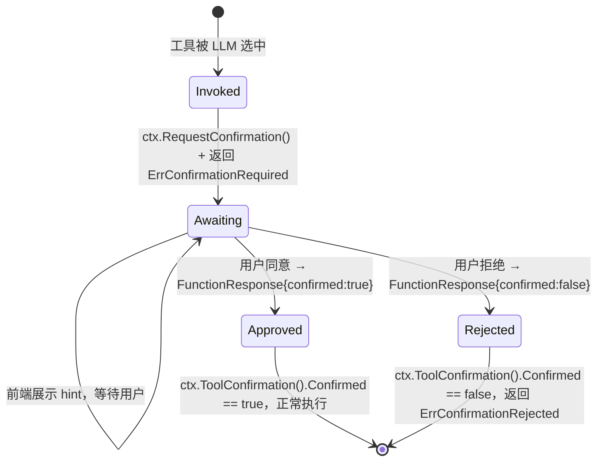
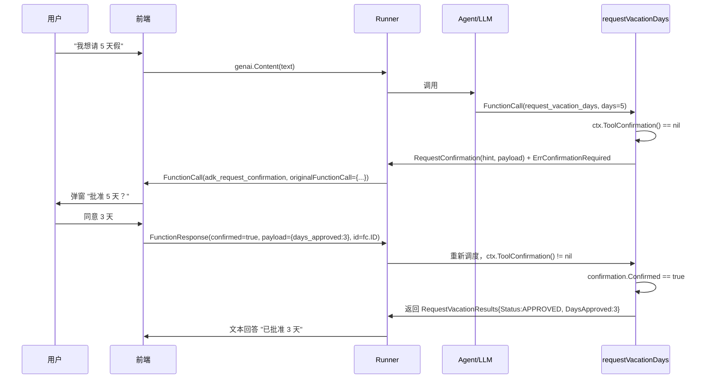

# Human-in-the-Loop：让用户确认高风险工具调用

> 本教程基于 `examples/toolconfirmation/main.go`（约 397 行）。它演示了最完整的 HITL 流程：在工具内部用 `ctx.ToolConfirmation()` 与 `ctx.RequestConfirmation()` 自行决定何时请求确认、如何读取用户决策、如何把决策回填到工具中。

## 你将学到
- 什么是 Human-in-the-Loop（HITL）—— 让"敏感工具调用"在执行前必须由人类拍板
- 确认状态机的三种状态：未请求、等待决策、已决策
- `ctx.ToolConfirmation()` / `ctx.RequestConfirmation()` 的用法
- 前端如何监听 `adk_request_confirmation` 特殊 FunctionCall 并回送 `FunctionResponse`
- `toolconfirmation.OriginalCallFrom` 如何从包装事件里挖出"原始工具调用"

## 前置条件
- [x] 已完成 [02-first-tool.md](../01-getting-started/02-first-tool.md)
- [x] 已完成 [04-multi-agents.md](../01-getting-started/04-multi-agents.md)
- [x] 已设置 `GOOGLE_API_KEY`
- [x] 了解 `functiontool.New` 的基本用法

## 核心概念

**HITL（Human-in-the-Loop）**：当工具具备"不可逆 / 涉及真实资金 / 删除数据"等副作用时，不能让 LLM 一声令下就执行，必须把决策权交回人类。ADK 把这种机制抽象为**确认状态机**：工具第一次被调用时，工具体里通过 `ctx.RequestConfirmation(hint, payload)` 把"待确认事件"挂到 `EventActions.RequestedToolConfirmations` 上并立即返回 `ErrConfirmationRequired`（见 [tool/tool.go:225](../../../tool/tool.go)）；客户端监听一个特殊 FunctionCall（名字恒为 `adk_request_confirmation`，见 [tool/toolconfirmation/tool_confirmation.go:46](../../../tool/toolconfirmation/tool_confirmation.go)），把用户的批准/驳回决策回填成 `FunctionResponse`；工具被 ADK 再次调度时，调用 `ctx.ToolConfirmation()` 拿到 `*toolconfirmation.ToolConfirmation`，通过 `Confirmed` 字段（[tool/toolconfirmation/tool_confirmation.go:59](../../../tool/toolconfirmation/tool_confirmation.go)）决定走"通过"还是"拒绝"分支。

ADK 同时提供三种粒度的"开 HITL"姿势，按控制力从弱到强排列：
1. **`functiontool.Config.RequireConfirmation = true`**（[tool/functiontool/function.go:54](../../../tool/functiontool/function.go)）—— 一刀切，工具每次调用都需确认
2. **`functiontool.Config.RequireConfirmationProvider = func(args) bool`**（[tool/functiontool/function.go:67](../../../tool/functiontool/function.go)）—— 按参数动态判断是否需确认
3. **`tool.WithConfirmation(toolset, ...)`**（[tool/tool.go:143](../../../tool/tool.go)）—— 装饰整个 toolset
4. **工具内部 `ctx.RequestConfirmation`**（最灵活，本教程使用）—— 工具体里写"如果某个条件成立就请求确认"



看图指引：从左到右是一个完整状态机。`Awaiting` 是核心等待态——ADK 不会再次执行工具，必须由前端把 `FunctionResponse` 注入到事件流。`Approved` / `Rejected` 是终态，由 `ToolConfirmation().Confirmed` 决定（[tool/tool.go:207-210](../../../tool/tool.go)）。"在 Awaiting 之前"还有一个关键岔路：工具可以用 `RequireConfirmationProvider` 按参数过滤（[tool/functiontool/function.go:103](../../../tool/functiontool/function.go)），避免"调一次确认一次"。

## 完整代码

完整源码在 [`examples/toolconfirmation/main.go`](../../../examples/toolconfirmation/main.go)。本教程只列出与 HITL 相关的核心段：

```go
// examples/toolconfirmation/main.go（节选）
package main

import (
	"bufio"
	"context"
	"encoding/json"
	"fmt"
	"log"
	"os"
	"strconv"
	"strings"

	"google.golang.org/adk/agent"
	"google.golang.org/adk/agent/llmagent"
	"google.golang.org/adk/model"
	"google.golang.org/adk/model/gemini"
	"google.golang.org/adk/runner"
	"google.golang.org/adk/session"
	"google.golang.org/adk/tool"
	"google.golang.org/adk/tool/functiontool"
	"google.golang.org/adk/tool/toolconfirmation"

	"google.golang.org/genai"
)

// 1. 输入：用户想请几天假
type RequestVacationArgs struct {
	Days   int    `json:"days"`
	UserID string `json:"user_id"`
}

// 2. 确认回执：用户最终批准的天数（可能少于请求天数）
type ConfirmationPayload struct {
	DaysApproved int `json:"days_approved"`
}

// 3. 工具的初次返回：仅返回一个工单 ID
type RequestVacationResults struct {
	Status       string `json:"status"`
	DaysApproved int    `json:"days_approved"`
	RequestID    string `json:"request_id"`
}

// 4. 全局工单池：按 reqID 与 callID 双向索引
var (
	requestsByReqID  = make(map[string]*VacationRequest)
	requestsByCallID = make(map[string]*VacationRequest)
	requestCounter   = 0
)

// 5. 工具本体：第一次调用进入 PENDING 状态，第二次调用根据 Confirmed 走分支
func requestVacationDays(ctx agent.ToolContext, args RequestVacationArgs) (*RequestVacationResults, error) {
	if args.Days <= 0 {
		return nil, fmt.Errorf("invalid days to request %d", args.Days)
	}

	confirmation := ctx.ToolConfirmation()
	if confirmation == nil {
		// 第一次：尚无确认 → 挂起
		requestID := fmt.Sprintf("req-%d", requestCounter)
		requestCounter++
		req := &VacationRequest{
			ID:     requestID,
			UserID: args.UserID,
			Days:   args.Days,
			Status: "PENDING",
		}
		requestsByReqID[requestID] = req
		requestsByCallID[ctx.FunctionCallID()] = req

		err := ctx.RequestConfirmation(
			"Please approve or reject the tool call request_time_off() by responding with a FunctionResponse with an expected ToolConfirmation payload.",
			ConfirmationPayload{DaysApproved: 0},
		)
		if err != nil {
			return nil, err
		}
		return &RequestVacationResults{
			Status:    "Manager approval is required.",
			RequestID: requestID,
		}, nil
	}

	// 第二次：拿到用户决策
	req, ok := requestsByCallID[ctx.FunctionCallID()]
	if !ok {
		return nil, fmt.Errorf("unable to get request")
	}
	req.Confirmation = confirmation
	if confirmation.Confirmed {
		// 把 payload 反序列化成结构体，按批准天数落库
		var payload ConfirmationPayload
		jsonBytes, _ := json.Marshal(confirmation.Payload)
		_ = json.Unmarshal(jsonBytes, &payload)
		approvedDays := min(payload.DaysApproved, args.Days)
		req.Status = "APPROVED"
		req.DaysApproved = payload.DaysApproved
		return &RequestVacationResults{
			Status:       "The time off request is accepted.",
			DaysApproved: approvedDays,
			RequestID:    req.ID,
		}, nil
	}
	req.Status = "REJECTED"
	return &RequestVacationResults{
		Status:    "The time off request is rejected.",
		RequestID: req.ID,
	}, nil
}

// 6. 前端：监听特殊 FunctionCall 并回填 FunctionResponse
func runTurn(ctx context.Context, r *runner.Runner, sessionID string, content *genai.Content) {
	for event, err := range r.Run(ctx, userID, sessionID, content, agent.RunConfig{StreamingMode: agent.StreamingModeNone}) {
		if err != nil {
			fmt.Printf("\nAGENT_ERROR: %v\n", err)
			continue
		}
		printEventSummary(event)
		if event.Content != nil {
			for _, part := range event.Content.Parts {
				fc := part.FunctionCall
				if fc != nil && fc.Name == toolconfirmation.FunctionCallName {
					// 关键：这是 ADK 派发的"待确认"包装事件
					originalFunctionCall, err := toolconfirmation.OriginalCallFrom(fc)
					if err != nil {
						continue
					}
					req, ok := requestsByCallID[originalFunctionCall.ID]
					if !ok {
						continue
					}
					// 更新 callID：批准回执必须用同一个 ID
					req.CallID = fc.ID
				}
			}
		}
	}
}

// 7. 前端：根据用户输入构造 FunctionResponse，回灌给 runner
func processApproval(ctx context.Context, r *runner.Runner, sessionID, requestID string, approved bool, reader *bufio.Reader) {
	req, exists := requestsByReqID[requestID]
	if !exists || req.Status != "PENDING" {
		fmt.Printf("Request ID %s not found or not pending.\n", requestID)
		return
	}
	daysApproved := 0
	if approved {
		fmt.Printf("How many days to approve for %s (requested %d)? ", requestID, req.Days)
		daysInput, _ := reader.ReadString('\n')
		days, _ := strconv.Atoi(strings.TrimSpace(daysInput))
		daysApproved = days
	}
	payload := ConfirmationPayload{DaysApproved: daysApproved}
	funcResponse := &genai.FunctionResponse{
		Name: toolconfirmation.FunctionCallName, // 必须是 "adk_request_confirmation"
		ID:   req.CallID,                          // 必须与特殊 FunctionCall 的 ID 一致
		Response: map[string]any{
			"confirmed": approved,
			"payload":   payload,
		},
	}
	appResponse := &genai.Content{
		Role:  string(genai.RoleUser),
		Parts: []*genai.Part{{FunctionResponse: funcResponse}},
	}
	runTurn(ctx, r, sessionID, appResponse)
}
```

完整 397 行含 `main`、`createRequestVacationDaysAgent`、CLI 菜单、`runChatSession`、`runVacationSession` 等。本教程省略次要部分，请直接对照 `examples/toolconfirmation/main.go`。

## 代码逐段讲解

### 1. 定义输入/确认载荷/输出三件套

```go
type RequestVacationArgs struct {
	Days   int    `json:"days"`
	UserID string `json:"user_id"`
}
type ConfirmationPayload struct {
	DaysApproved int `json:"days_approved"`
}
type RequestVacationResults struct {
	Status       string `json:"status"`
	DaysApproved int    `json:"days_approved"`
	RequestID    string `json:"request_id"`
}
```

工具的"确认载荷"是应用层私有的——它不是 ADK 内置类型，而是你自己定义的 struct。在工具第一次调用时通过 `ctx.RequestConfirmation("hint", ConfirmationPayload{...})` 透传（[examples/toolconfirmation/main.go:152-156](../../../examples/toolconfirmation/main.go)），在前端构造 `FunctionResponse` 时再次回填。这样设计的妙处是：**用户批准时可以携带额外信息**（如"只批 3 天"），而不是简单的"是/否"二选一。

### 2. 工具体的"两次调用"逻辑

```go
confirmation := ctx.ToolConfirmation()
if confirmation == nil {
    // 分支 A：第一次调用，挂起等待
    err := ctx.RequestConfirmation("Please approve ...", ConfirmationPayload{DaysApproved: 0})
    ...
    return &RequestVacationResults{Status: "Manager approval is required.", RequestID: requestID}, nil
}
// 分支 B：拿到用户决策，走 APPROVED / REJECTED
```

这是 HITL 工具的"通用范式"：**工具体本身是幂等的，会被 ADK 调度两次**。第一次 `ctx.ToolConfirmation()` 返回 `nil`（[agent/context.go:164](../../../agent/context.go)），说明还没拿到用户决策，此时 `ctx.RequestConfirmation`（[agent/context.go:189](../../../agent/context.go)）登记一个待办并返回一个"工单已开"的轻量结果；第二次 `ctx.ToolConfirmation()` 不为 `nil`，通过 `confirmation.Confirmed`（[tool/toolconfirmation/tool_confirmation.go:59](../../../tool/toolconfirmation/tool_confirmation.go)）判断分支。`ctx.FunctionCallID()` 在两次调用之间保持稳定（[agent/context.go:141](../../../agent/context.go)），因此可以用它作 key 反查工单（[examples/toolconfirmation/main.go:150, 167](../../../examples/toolconfirmation/main.go)）。

### 3. 监听 `adk_request_confirmation` 特殊事件

```go
if fc != nil && fc.Name == toolconfirmation.FunctionCallName {
    originalFunctionCall, err := toolconfirmation.OriginalCallFrom(fc)
    ...
    req.CallID = fc.ID
}
```

当工具调用 `ctx.RequestConfirmation` 后，ADK 不会真的把原工具跑完，而是**把"原工具调用"包成一个名字恒为 `adk_request_confirmation` 的特殊 FunctionCall** 抛给前端（[tool/toolconfirmation/tool_confirmation.go:46](../../../tool/toolconfirmation/tool_confirmation.go)）。前端要做的两件事：

1. 用 `toolconfirmation.OriginalCallFrom(fc)` 拆出原始 FunctionCall（[tool/toolconfirmation/tool_confirmation.go:86](../../../tool/toolconfirmation/tool_confirmation.go)）—— 用于"这是我刚刚请你批的那个 tool 吗？"的反查
2. 记下 `fc.ID` —— 等会儿回送 `FunctionResponse` 时必须用同一个 ID（[tool/toolconfirmation/tool_confirmation.go:40-41](../../../tool/toolconfirmation/tool_confirmation.go)）

### 4. 构造批准回执并回灌

```go
funcResponse := &genai.FunctionResponse{
    Name: toolconfirmation.FunctionCallName, // 必须 "adk_request_confirmation"
    ID:   req.CallID,
    Response: map[string]any{
        "confirmed": approved,
        "payload":   ConfirmationPayload{DaysApproved: daysApproved},
    },
}
appResponse := &genai.Content{
    Role:  string(genai.RoleUser),
    Parts: []*genai.Part{{FunctionResponse: funcResponse}},
}
runTurn(ctx, r, sessionID, appResponse)
```

`FunctionResponse` 是用户角色（`genai.RoleUser`），因为语义上"这是用户的决定"。ADK 看到 `Response["confirmed"] == true` 时，会**自动重新调度**那个原始工具，并把 `confirmation` 透传到 `ctx.ToolConfirmation()`（[tool/tool.go:207-210](../../../tool/tool.go)）；如果 `confirmed == false`，则返回 `ErrConfirmationRejected`（[tool/tool.go:209](../../../tool/tool.go)），工具体不会再次执行。回灌的 `payload` 字段会被 `json.Marshal` / `json.Unmarshal` 还原成结构体（[examples/toolconfirmation/main.go:173-180](../../../examples/toolconfirmation/main.go)），从而拿到"批准了几天"等业务字段。

### 5. 时序图：从用户提问到批准落库



看图指引：注意 A→T 的 FunctionCall 与 R→F 的 `adk_request_confirmation` 之间的"包装"关系——ADK 把原工具调用拦截并改名后抛给前端，**真正的工具 T 只在最后一步被重调度一次**。`F→R` 的 `FunctionResponse` 必须携带 `id=fc.ID` 才能与上游事件匹配上；这是 ADK 状态机的"接缝"。

## 准备与运行

### 步骤 1：确认 API key

```bash
echo $GOOGLE_API_KEY
```

### 步骤 2：进入示例目录

```bash
cd /path/to/adk-go
```

### 步骤 3：运行

```bash
go run ./examples/toolconfirmation
```

### 步骤 4：测试输入

进入"Vacation Request Mode"（菜单 2），按提示交互：

```
--- Menu ---
1: Chat with LLM
2: Manage Vacation Requests
3: Exit
Choose an option: 2

--- Vacation Request Mode ---
Commands: 'approve <ID>', 'reject <ID>'

Vacation Command: Request 5 days off for user user
[Agent 调用 request_vacationDays，工具进入 PENDING]
[前端打印 ID: req-0, Status: PENDING]

Vacation Command: approve req-0
How many days to approve for req-0 (requested 5)? 3
Approving 3 days for request req-0.
[前端构造 FunctionResponse，runner 重新调度工具]
[The time off request is accepted. Days approved: 3]
```

若想体验自动拒绝：

```
Vacation Command: reject req-0
Rejecting request req-0.
[The time off request is rejected.]
```

## 常见错误

- **`ctx.ToolConfirmation()` 永远返回 `nil`** —— 多半是忘了把 `payload` 写进 `RequestConfirmation` 的第二个参数，或前端回灌时 `FunctionResponse.Name` 写错（必须 `toolconfirmation.FunctionCallName`，不能写原工具名）
- **工具被无限重入** —— `FunctionResponse.ID` 与特殊 FunctionCall 的 ID 不一致，ADK 没法把"批准"挂回原工单
- **混淆 `RequireConfirmation` 与 `RequestConfirmation`** —— 前者是 `functiontool.Config` 的静态开关（[tool/functiontool/function.go:54](../../../tool/functiontool/function.go)），后者是工具运行期主动调用的 API（[agent/context.go:189](../../../agent/context.go)）；后者比前者更灵活，可以按业务条件（如"金额 > 1 万"）触发
- **`RequireConfirmationProvider` 签名不对** —— 它必须是 `func(TArgs) bool`，且 `TArgs` 与工具入参类型完全一致（[tool/functiontool/function.go:103-110](../../../tool/functiontool/function.go)），否则 `functiontool.New` 返回 error
- **在前端写"同步等待"逻辑** —— HITL 是异步的，工具第一次返回 PENDING 后**必须**由用户主动触发第二次执行；阻塞当前 goroutine 等用户输入会卡死 runner

## 关键 API 小结

| API | 位置 | 作用 |
|---|---|---|
| `ctx.ToolConfirmation()` | [agent/context.go:164](../../../agent/context.go) | 读取当前 HITL 决策对象 |
| `ctx.RequestConfirmation(hint, payload)` | [agent/context.go:189](../../../agent/context.go) | 工具体里主动触发 HITL 流程 |
| `toolconfirmation.ToolConfirmation` | [tool/toolconfirmation/tool_confirmation.go:50](../../../tool/toolconfirmation/tool_confirmation.go) | 决策对象，含 `Confirmed` / `Payload` / `Hint` |
| `toolconfirmation.FunctionCallName` | [tool/toolconfirmation/tool_confirmation.go:46](../../../tool/toolconfirmation/tool_confirmation.go) | 常量 `"adk_request_confirmation"` |
| `toolconfirmation.OriginalCallFrom` | [tool/toolconfirmation/tool_confirmation.go:86](../../../tool/toolconfirmation/tool_confirmation.go) | 从包装事件拆出原工具调用 |
| `tool.WithConfirmation` | [tool/tool.go:143](../../../tool/tool.go) | 装饰 toolset 统一开启 HITL |
| `functiontool.Config.RequireConfirmation` | [tool/functiontool/function.go:54](../../../tool/functiontool/function.go) | 工具级静态 HITL 开关 |
| `functiontool.Config.RequireConfirmationProvider` | [tool/functiontool/function.go:67](../../../tool/functiontool/function.go) | 工具级动态 HITL 开关 |
| `ErrConfirmationRequired` | [tool/tool.go:32](../../../tool/tool.go) | 工具第一次调用未拿到决策时返回 |
| `ErrConfirmationRejected` | [tool/tool.go:35](../../../tool/tool.go) | 用户拒绝时由 ADK 包装抛出 |

## 延伸阅读
- [架构文档：Tool 工具契约（WithConfirmation 装饰器）](../../architecture/03-modules/03-tool.md)
- [架构文档：F2 工具调用流程（含 HITL 状态机）](../../architecture/01-core-flows.md#f2工具调用)
- [examples/toolconfirmation/main.go](../../../examples/toolconfirmation/main.go)
- 子项目深读占位：`tool/toolconfirmation/` 与 `tool/tool.go` 的 `confirmationTool` 实现
