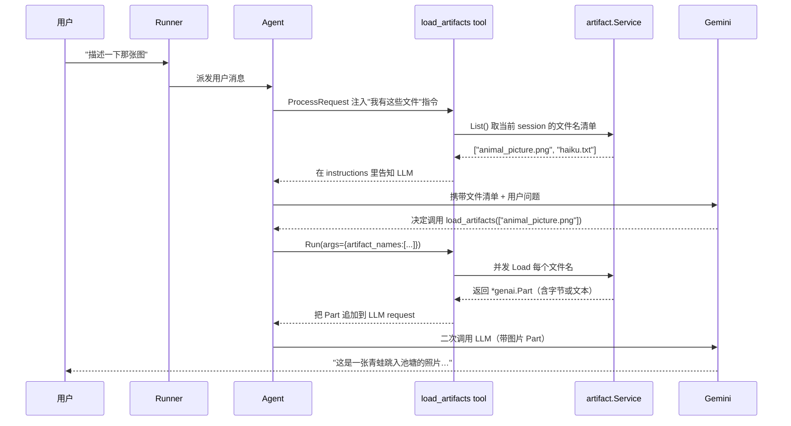

# Artifact 工具：让 Agent 读写文件产物

> 本教程基于 [`examples/tools/loadartifacts/main.go`](../../../examples/tools/loadartifacts/main.go)。它演示 ADK 中"Artifact"（文件产物）机制：先把图片 / 文本 / PDF 等二进制或文本数据存进 artifact service，再让 Agent 在用户提问时按需"加载"这些文件，模型就能直接看到并描述它们。

## 你将学到

- 什么是 Artifact（文件产物），它和 Session 状态、Memory 的区别
- `artifact.Service` 接口的 6 个方法（`Save` / `Load` / `List` / `Delete` / `Versions` / `GetArtifactVersion`）
- `loadartifactstool.New()` —— 一个内建 Tool，把"加载文件"暴露给 LLM
- Artifact 命名空间：`(AppName, UserID, SessionID, FileName)` 四元组唯一定位
- 何时用 `user:` 前缀让 artifact 跨 session 共享
- 如何在自定义 `functiontool` 中通过 `ctx.Artifacts()` 主动读写 artifact

## 前置条件

- [x] 已完成 [00-prerequisites.md](../00-prerequisites.md)
- [x] 已完成 [01-getting-started/03-persistent-session.md](../01-getting-started/03-persistent-session.md)
- [x] 已完成 [02-tools/01-functiontool.md](./01-functiontool.md)
- [x] 已设置 `GOOGLE_API_KEY`
- [x] 当前工作目录下有一张 `animal_picture.png`（示例代码用 `os.ReadFile` 读取它）

## 核心概念

**Artifact** 是 ADK 中与 Session 平行的"文件存储"维度（[artifact/service.go:15-20](../../../artifact/service.go)）。一条 artifact 记录由四元组 `(AppName, UserID, SessionID, FileName)` 唯一定位（[artifact/service.go:31-47](../../../artifact/service.go)），可附带 `Version` 字段实现版本管理。同一个 `FileName` 多次 `Save` 会得到递增的版本号（[artifact/inmemory.go:142](../../../artifact/inmemory.go)）。

**为什么需要 Artifact**：Session state 适合放"小而结构化"的键值对（字符串、布尔、数字），Memory 适合放"历史摘要"。但当 Agent 需要"看一张图"、"读一份 PDF"、或"输出一张饼图给用户"时，**字节流**或**多模态 Part** 才是合适的容器。Artifact 就是为这种"中等体积、二进制、多模态"的数据准备的。

**命名空间（namespace）**：四元组中的 `SessionID` 决定了 artifact 是"会话级"还是"用户级"。如果 `FileName` 以 `user:` 开头（[artifact/inmemory.go:48-50](../../../artifact/inmemory.go)），它会被存到 user namespace，对同一 `(AppName, UserID)` 下的所有 session 可见；否则就是 session 私有的。这点尤其重要：用户在 session A 上传的头像，session B 也能取到。

**`loadartifactstool`**：一个内建 Tool（[tool/loadartifactstool/load_artifacts_tool.go:42-47](../../../tool/loadartifactstool/load_artifacts_tool.go)），名字固定为 `load_artifacts`。它的设计哲学是"**工具在每次 LLM 请求时主动告诉模型'我们有哪些文件'**"（[load_artifacts_tool.go:120-128](../../../tool/loadartifactstool/load_artifacts_tool.go)），然后 LLM 看到用户问题后，自行决定调 `load_artifacts(artifact_names=[...])` 加载指定文件。Tool 内部会并发调用 `artifactService.Load` 拿到字节流（[load_artifacts_tool.go:185-202](../../../tool/loadartifactstool/load_artifacts_tool.go)），再以 `genai.Content` 形式拼回 LLM 的请求里。

下图展示了 artifact service 和 load_artifacts tool 的协作流程：



看图指引：

- 第 1 阶段（T→S 的 List）发生在每次 LLM 请求前，工具主动告知模型"仓库里有什么"；这是 `ProcessRequest` 的关键作用。
- 第 2 阶段（A→L 的二次调用）是 Gemini 的"多模态请求"——同一个请求里既有文本也有图片 Part。
- 图中没有画的另一步：当 Tool `Run` 完成后，`genai.Content` 会被 `append` 到 `req.Contents`（[load_artifacts_tool.go:204](../../../tool/loadartifactstool/load_artifacts_tool.go)），这是 LLM 看到图片内容的物理通道。

## 完整代码

完整源码在 [`examples/tools/loadartifacts/main.go`](../../../examples/tools/loadartifacts/main.go)（约 148 行）。本教程只列出关键片段，全文请按链接打开。

```go
// examples/tools/loadartifacts/main.go
package main

import (
    "bufio"
    "context"
    "fmt"
    "log"
    "os"

    "google.golang.org/genai"

    "google.golang.org/adk/agent"
    "google.golang.org/adk/agent/llmagent"
    "google.golang.org/adk/artifact"
    "google.golang.org/adk/model/gemini"
    "google.golang.org/adk/runner"
    "google.golang.org/adk/session"
    "google.golang.org/adk/tool"
    "google.golang.org/adk/tool/loadartifactstool"
)

func main() {
    ctx := context.Background()

    model, _ := gemini.NewModel(ctx, "gemini-3.1-flash-lite", &genai.ClientConfig{
        APIKey: os.Getenv("GOOGLE_API_KEY"),
    })

    llmagent, _ := llmagent.New(llmagent.Config{
        Name:        "artifact_describer",
        Model:       model,
        Description: "Agent to answer questions about artifacts.",
        Instruction: "When user asks about the artifact, load them and describe them.",
        Tools: []tool.Tool{
            loadartifactstool.New(),                          // [main.go:55]
        },
    })

    userID, appName := "test_user", "test_app"
    sessionService := session.InMemoryService()
    resp, _ := sessionService.Create(ctx, &session.CreateRequest{
        AppName: appName, UserID: userID,
    })
    session := resp.Session

    artifactService := artifact.InMemoryService()            // [main.go:74]

    // 写一张图
    imageBytes, _ := os.ReadFile("animal_picture.png")
    _, err := artifactService.Save(ctx, &artifact.SaveRequest{
        AppName:   appName,                                  // [main.go:82-88]
        UserID:    userID,
        SessionID: session.ID(),
        FileName:  "animal_picture.png",
        Part:      genai.NewPartFromBytes(imageBytes, "image/png"),
    })

    // 写一首诗
    _, err = artifactService.Save(ctx, &artifact.SaveRequest{
        AppName:   appName,
        UserID:    userID,
        SessionID: session.ID(),
        FileName:  "haiku.txt",                              // [main.go:97-102]
        Part: genai.NewPartFromText(
            "An old silent pond..." +
                "A frog jumps into the pond," +
                "splash! Silence again."),
    })

    r, _ := runner.New(runner.Config{                       // [main.go:107-112]
        AppName:         appName,
        Agent:           llmagent,
        SessionService:  sessionService,
        ArtifactService: artifactService,                    // 关键：注入 artifact service
    })

    reader := bufio.NewReader(os.Stdin)
    for {
        fmt.Print("\nUser -> ")
        userInput, _ := reader.ReadString('\n')
        userMsg := genai.NewContentFromText(userInput, genai.RoleUser)

        for event, err := range r.Run(ctx, userID, session.ID(), userMsg, agent.RunConfig{
            StreamingMode: agent.StreamingModeSSE,
        }) {
            // ... 打印 event.LLMResponse.Content.Parts
        }
    }
}
```

## 代码逐段讲解

### 1. 把 `loadartifactstool` 注册为 Agent 的 Tool

```go
Tools: []tool.Tool{
    loadartifactstool.New(),                          // [main.go:55]
},
```

`loadartifactstool.New()` 返回一个 `tool.Tool`（[load_artifacts_tool.go:42](../../../tool/loadartifactstool/load_artifacts_tool.go)），其 `Name()` 固定返回 `"load_artifacts"`（[load_artifacts_tool.go:44](../../../tool/loadartifactstool/load_artifacts_tool.go)）。这个 tool 不需要任何业务配置——artifact service 已经在 Runner 那一层注入，tool 内部通过 `ctx.Artifacts()` 拿到。

### 2. 准备 artifact service 与会话

```go
sessionService := session.InMemoryService()
resp, _ := sessionService.Create(ctx, &session.CreateRequest{
    AppName: appName, UserID: userID,
})
session := resp.Session
artifactService := artifact.InMemoryService()            // [main.go:74]
```

创建 session 与 artifact service 是两条独立的线。`artifact.InMemoryService()`（[artifact/inmemory.go:43](../../../artifact/inmemory.go)）返回一个进程内实现，仅用于开发与测试；生产环境可换 [`artifact/gcsartifact`](../../../artifact/gcsartifact/)（Google Cloud Storage 后端）或自实现 `artifact.Service` 接口。

### 3. 写两条 artifact

```go
_, err := artifactService.Save(ctx, &artifact.SaveRequest{
    AppName:   appName,
    UserID:    userID,
    SessionID: session.ID(),
    FileName:  "animal_picture.png",
    Part:      genai.NewPartFromBytes(imageBytes, "image/png"),    // [main.go:82-88]
})
```

`SaveRequest` 的四元组（[artifact/service.go:55-66](../../../artifact/service.go)）决定了 artifact 的存储位置。`Part` 是 `*genai.Part`，可以承载文本（`NewPartFromText`）、二进制（`NewPartFromBytes`）、文件 URI（`NewPartFromURI`）等多种形式。**注意**：`Validate` 方法（[artifact/service.go:81-112](../../../artifact/service.go)）会拒绝 `Part.Text == ""` 且 `Part.InlineData == nil` 的请求，也会拒绝 `FileName` 包含 `/` 或 `\` 的请求（[artifact/service.go:114-119](../../../artifact/service.go)）——这是为了避免任意路径穿越。

### 4. 跑通后再问 LLM

```go
r, _ := runner.New(runner.Config{
    AppName:         appName,
    Agent:           llmagent,
    SessionService:  sessionService,
    ArtifactService: artifactService,                    // [main.go:111]
})
```

`runner.Config.ArtifactService` 字段把 service 注入 Runner。Runner 在每次 LLM 调用前会创建一个 `invocationContext`，tool 可以通过 `ctx.Artifacts()`（[agent/agent.go:381](../../../agent/agent.go)）拿到它。`agent.Artifacts` 接口定义了 4 个方法（[agent/agent.go:109-115](../../../agent/agent.go)）：`Save` / `List` / `Load` / `LoadVersion`，省略了 `Delete` / `Versions` / `GetArtifactVersion`，因为这三个更适合直接在底层 service 上调用。

### 5. 在自定义 tool 中读写 artifact

如果你想在自己的 `functiontool` 里也写文件，签名要拿 `agent.ToolContext`，它继承了 `Artifacts()` 方法：

```go
handler := func(ctx agent.ToolContext, input Input) (Output, error) {
    part := genai.NewPartFromText("hello artifact")
    if _, err := ctx.Artifacts().Save(ctx, "user:greeting.txt", part); err != nil {
        return Output{}, err
    }
    return Output{Ok: true}, nil
}
```

文件名以 `user:` 开头时，artifact 会被存到 user namespace（[artifact/inmemory.go:48-50](../../../artifact/inmemory.go)），下次用户开新 session 也能 `Load` 到它。

## 准备与运行

### 步骤 1：获取凭证

```bash
echo $GOOGLE_API_KEY    # 必须已设置
```

### 步骤 2：准备测试图片

示例代码依赖一个 `animal_picture.png` 文件（[main.go:76](../../../examples/tools/loadartifacts/main.go)）。从仓库 examples 目录直接拷贝即可：

```bash
cd /home/wu/oneone/adk/examples/tools/loadartifacts
ls animal_picture.png   # 确认文件存在
```

### 步骤 3：运行

```bash
go run ./examples/tools/loadartifacts
```

### 步骤 4：测试输入

```
User -> describe animal_picture.png
Agent -> This is a photograph of a frog leaping into a still pond...

User -> recite haiku.txt
Agent -> "An old silent pond... A frog jumps into the pond, splash! Silence again."
```

第一条问题触发 `load_artifacts(["animal_picture.png"])`，模型看到图片后给出描述。第二条触发 `load_artifacts(["haiku.txt"])`，模型直接读出俳句。

## 常见错误

- **`loadartifactstool` 没有被 Agent 调用** —— Runner 未注入 `ArtifactService`（`runner.Config.ArtifactService` 为 nil），或 session 中根本没有 artifact 写入。`ProcessRequest` 在 `List` 返回空时会直接跳过（[load_artifacts_tool.go:135-137](../../../tool/loadartifactstool/load_artifacts_tool.go)）。
- **`Save` 报 `Part.InlineData or Part.Text has to be set`** —— `Part` 三个字段（Text / InlineData / FileData）至少要有一个。常见的错误是 `genai.NewPartFromBytes(nil, "image/png")`，`nil` 字节切片无法被 `Validate` 接受（[artifact/service.go:103-105](../../../artifact/service.go)）。
- **`Save` 报 `filename cannot contain path separators`** —— `FileName` 不能含 `/` 或 `\`（[artifact/service.go:114-119](../../../artifact/service.go)）。如需按目录组织，请用 `reports/2026/q1.pdf` → 改为 `reports-2026-q1.pdf` 或 `user:reports.2026.q1.pdf`。
- **多用户串数据** —— 忘了传 `userID`，所有用户写入到同一个 sessionID，导致 A 用户的图片被 B 看到。务必在四元组里同时带 `UserID` 和 `SessionID`。
- **版本号不符合预期** —— 同名 `Save` 默认产生递增版本（[artifact/inmemory.go:142](../../../artifact/inmemory.go)）；想覆盖特定版本需显式传 `req.Version`。
- **GCS 后端凭证缺失** —— 切到 `gcsartifact` 时未设置 `GOOGLE_APPLICATION_CREDENTIALS`，会 panic。

## 关键 API 小结

| API | 位置 | 作用 |
|---|---|---|
| `artifact.Service` | `artifact/service.go:31` | artifact 存储服务接口 |
| `artifact.InMemoryService` | `artifact/inmemory.go:43` | 进程内实现（开发/测试用） |
| `artifact.SaveRequest` | `artifact/service.go:55` | Save 请求结构，含四元组 + Part |
| `artifact.LoadRequest` | `artifact/service.go:127` | Load 请求结构 |
| `artifact.ListRequest` | `artifact/service.go:201` | List 请求结构 |
| `loadartifactstool.New` | `tool/loadartifactstool/load_artifacts_tool.go:42` | 创建 `load_artifacts` 工具 |
| `agent.Artifacts` | `agent/agent.go:111` | ToolContext 暴露的 4 方法接口 |
| `ctx.Artifacts()` | `agent/agent.go:381` | 从 invocationContext 取 artifact 句柄 |
| `runner.Config.ArtifactService` | `runner/runner.go`（Config struct） | 把 service 注入 Runner |

## 延伸阅读

- [架构文档：03-modules/06-artifact.md](../../architecture/03-modules/06-artifact.md) — artifact 模块详解、命名空间设计、版本管理
- [架构文档：01-core-flows.md F2 工具调用](../../architecture/01-core-flows.md#f2工具调用) — 工具注入 LLM 请求的内部机制
- [`examples/tools/loadartifacts/main.go`](../../../examples/tools/loadartifacts/main.go) — 完整可运行示例
- 子项目深读占位：`artifact/gcsartifact/` —— GCS 后端实现细节
