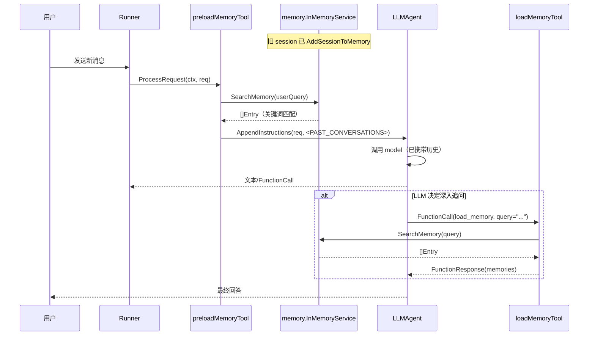
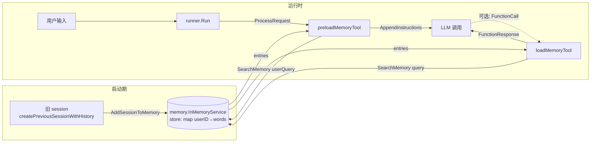

# Memory 工具：让 Agent 跨会话记忆

本教程基于 [examples/tools/loadmemory/main.go](../../../examples/tools/loadmemory/main.go)。它演示了 ADK 的"长期记忆"机制：用一个**预先存在**的旧 session 喂养 memory service，然后在**全新**的 session 里让 agent 自动/手动召回那些历史。

## 你将学到

- `memory.Service` 接口的语义：把"已经结束的会话"装进长期知识库，供后续任意 session 检索
- `loadmemorytool` —— LLM 主动调用的检索工具（按 `query` 关键词搜索）
- `preloadmemorytool` —— 每次 LLM 请求前**自动**运行的检索工具，把相关历史注入 system instructions
- `preload` 与 `load` 的差异：前者免费、零 token 决策成本；后者由 LLM 决定何时发起、需要额外 round-trip
- `memory.InMemoryService` 内部的"关键词交集"匹配逻辑（[memory/inmemory.go:143](../../../memory/inmemory.go)），以及为何它适合做演示、却不适合做生产检索
- `runner.Runner.Run` 链路上 memory 的两种注入时机

## 前置条件

- [x] 已完成 [00-prerequisites.md](../00-prerequisites.md)
- [x] 已完成 [01-getting-started/03-persistent-session.md](../01-getting-started/03-persistent-session.md)（理解 session 与 event）
- [x] 已设置 `GOOGLE_API_KEY`
- [x] 已了解 [02-tools/01-functiontool.md](./01-functiontool.md) 中 `tool.Tool` 的契约

## 核心概念

**Session 是短时上下文，Memory 是跨会话的长期知识**。一个 session 结束时，其事件流（`session.Events()`）可以被 `MemoryService.AddSessionToMemory` 提炼成可检索的"记忆条目"（[memory/service.go:31-39](../../../memory/service.go)）。新 session 开始后，agent 通过两个 memory 工具之一把这些旧知识找回来：`preloadmemorytool` 在 `ProcessRequest` 阶段用**当前用户输入**作为 query 自动搜索（[tool/preloadmemorytool/tool.go:74-98](../../../tool/preloadmemorytool/tool.go)），把命中的内容拼成 `<PAST_CONVERSATIONS>...</PAST_CONVERSATIONS>` 块塞进 system instructions；`loadmemorytool` 则把 `load_memory` 这个 function declaration 暴露给 LLM，由模型在需要时主动发起 `query` 调用（[tool/loadmemorytool/tool.go:65-80](../../../tool/loadmemorytool/tool.go)）。

**两者的取舍**：preload 是"无感的"，每轮都白白多花一些 input token，但 LLM 永远不必记得"我还有个检索工具"；load 是"按需的"，省 token，但需要 LLM 在 instruction 里被明确告知"必要时调用 load_memory"——这正是 [examples/tools/loadmemory/main.go:54-58](../../../examples/tools/loadmemory/main.go) 中 Instruction 写明的两段式提示。生产环境通常**两者并用**：preload 负责"开场白级"的常用上下文，load 负责"长尾"的精确追问。



**看图指引**：

- 左侧 `P`（preload）是**隐式**调用，由 runner 在每次 LLM 请求前自动触发，LLM 看不到它是一个 tool。
- 右侧 `T`（load）是**显式**调用，模型在 instruction 引导下自己写出 `FunctionCall`。
- 两者最终都落到同一个 `MemoryService.SearchMemory`，差异只在"谁来决定 query 是什么"——preload 用"当前用户输入"，load 用"LLM 提炼的 query"。

## 完整代码

完整源码在 [examples/tools/loadmemory/main.go](../../../examples/tools/loadmemory/main.go)（约 185 行）。核心骨架如下（删减了版权头、CLI 循环与大量雷同 import）：

```go
// examples/tools/loadmemory/main.go（节选）
package main

import (
    "context"
    "fmt"
    "log"
    "os"

    "google.golang.org/genai"

    "google.golang.org/adk/agent"
    "google.golang.org/adk/agent/llmagent"
    "google.golang.org/adk/memory"
    "google.golang.org/adk/model"
    "google.golang.org/adk/model/gemini"
    "google.golang.org/adk/runner"
    "google.golang.org/adk/session"
    "google.golang.org/adk/tool"
    "google.golang.org/adk/tool/loadmemorytool"
    "google.golang.org/adk/tool/preloadmemorytool"
)

func main() {
    ctx := context.Background()

    model, err := gemini.NewModel(ctx, "gemini-3.1-flash-lite", &genai.ClientConfig{
        APIKey: os.Getenv("GOOGLE_API_KEY"),
    })
    if err != nil {
        log.Fatalf("Failed to create model: %v", err)
    }

    llmAgent, err := llmagent.New(llmagent.Config{
        Name:        "memory_assistant",
        Model:       model,
        Description: "Agent that can recall information from memory.",
        Instruction: "You are a helpful assistant with access to memory. " +
            "Relevant memory may be preloaded automatically for each request. " +
            "If the preloaded context is not enough, use the load_memory tool " +
            "to search for additional relevant information. " +
            "If you find relevant memories, use them to provide informed responses.",
        Tools: []tool.Tool{
            preloadmemorytool.New(),
            loadmemorytool.New(),
        },
    })
    if err != nil {
        log.Fatalf("Failed to create agent: %v", err)
    }

    userID, appName := "test_user", "memory_app"
    sessionService := session.InMemoryService()
    memoryService := memory.InMemoryService()

    previousSession, err := createPreviousSessionWithHistory(ctx, sessionService, appName, userID)
    if err != nil {
        log.Fatalf("Failed to create previous session: %v", err)
    }

    if err := memoryService.AddSessionToMemory(ctx, previousSession); err != nil {
        log.Fatalf("Failed to add session to memory: %v", err)
    }

    resp, _ := sessionService.Create(ctx, &session.CreateRequest{
        AppName: appName, UserID: userID,
    })
    currentSession := resp.Session

    r, err := runner.New(runner.Config{
        AppName:        appName,
        Agent:          llmAgent,
        SessionService: sessionService,
        MemoryService:  memoryService,
    })
    if err != nil {
        log.Fatalf("Failed to create runner: %v", err)
    }

    // ... 进入 bufio 循环，把 userMsg 喂给 r.Run ...
}

// createPreviousSessionWithHistory 用一对 user/model 事件手工回填"东京之旅"对话。
func createPreviousSessionWithHistory(
    ctx context.Context,
    sessionService session.Service,
    appName, userID string,
) (session.Session, error) {
    resp, err := sessionService.Create(ctx, &session.CreateRequest{
        AppName: appName, UserID: userID,
    })
    if err != nil {
        return nil, fmt.Errorf("failed to create session: %w", err)
    }
    s := resp.Session

    events := []struct{ author, content string }{
        {"user", "I just got back from an amazing trip to Tokyo!"},
        {"model", "That sounds wonderful! Tokyo is such a vibrant city..."},
        {"user", "I visited the Senso-ji temple in Asakusa..."},
        // ... 6 对 user/model 事件
    }

    for _, e := range events {
        event := session.NewEvent("previous-session")
        event.Author = e.author
        event.LLMResponse = model.LLMResponse{
            Content: genai.NewContentFromText(e.content, genai.Role(e.author)),
        }
        if err := sessionService.AppendEvent(ctx, s, event); err != nil {
            return nil, fmt.Errorf("failed to append event: %w", err)
        }
    }
    return s, nil
}
```

完整 185 行包含一个 `bufio` 交互循环。详情请直接对照源文件。

## 代码逐段讲解

### 1. 构造 agent 时同时挂载 preload 与 load 两个 tool

```go
// examples/tools/loadmemory/main.go:59-62
Tools: []tool.Tool{
    preloadmemorytool.New(),
    loadmemorytool.New(),
},
```

两个 tool 的角色截然不同。`preloadmemorytool.New()` 返回的 `*preloadMemoryTool` 不实现 `Run`，**只实现 `ProcessRequest`**（[tool/preloadmemorytool/tool.go:74](../../../tool/preloadmemorytool/tool.go)）——这意味着 LLM 不会在 `function_call` 里看到它，它也不会出现在 tool declaration 列表里。runner 在每次打包 LLM 请求时**自动**调它的 `ProcessRequest`，先 `ctx.SearchMemory(ctx, userQuery)` 拿一批记忆条目，再用 `utils.AppendInstructions` 把 `<PAST_CONVERSATIONS>` 块追加到 system instructions（[tool/preloadmemorytool/tool.go:96](../../../tool/preloadmemorytool/tool.go)）。

相比之下，`loadmemorytool.New()` 实现完整的 `runnableTool`（[tool/loadmemorytool/tool.go:42-47](../../../tool/loadmemorytool/tool.go)）：既把 `load_memory` 这个 function declaration 喂给 LLM（[tool/loadmemorytool/tool.go:65-80](../../../tool/loadmemorytool/tool.go)），又在 LLM 真正调它时执行 `Run`（[tool/loadmemorytool/tool.go:83-108](../../../tool/loadmemorytool/tool.go)）。LLM 必须通过 system instruction 知道"这个 tool 存在"——这就是 Instruction 中第二句 `"If the preloaded context is not enough, use the load_memory tool..."` 的作用。

### 2. 准备一个"旧 session"作为记忆来源

```go
// examples/tools/loadmemory/main.go:142-184（节选）
events := []struct{ author, content string }{
    {"user", "I just got back from an amazing trip to Tokyo!"},
    {"model", "That sounds wonderful! Tokyo is such a vibrant city..."},
    // ...
}
for _, e := range events {
    event := session.NewEvent("previous-session")
    event.Author = e.author
    event.LLMResponse = model.LLMResponse{
        Content: genai.NewContentFromText(e.content, genai.Role(e.author)),
    }
    if err := sessionService.AppendEvent(ctx, s, event); err != nil {
        return nil, fmt.Errorf("failed to append event: %w", err)
    }
}
return s, nil
```

这一步模拟"agent 昨天和用户聊过"。`session.NewEvent(invocationID)` 构造一个空事件，再把 `Author`（`"user"` 或 `"model"`）和 `LLMResponse.Content`（`genai.Content`）填进去，然后 `AppendEvent` 落库。`event.LLMResponse.Content` 是 `memory` 真正读取的字段——见 [memory/inmemory.go:62-87](../../../memory/inmemory.go)：service 遍历 session 的所有事件，**只**挑 `event.LLMResponse.Content != nil` 且 `part.Text != ""` 的部分；其他元数据（如 tool_calls）会被静默丢弃。

### 3. 把旧 session 喂给 memory service

```go
// examples/tools/loadmemory/main.go:79-81
if err := memoryService.AddSessionToMemory(ctx, previousSession); err != nil {
    log.Fatalf("Failed to add session to memory: %v", err)
}
```

`AddSessionToMemory` 是 `memory.Service` 接口的"写入"方法（[memory/service.go:35](../../../memory/service.go)）。`InMemoryService` 的实现（[memory/inmemory.go:59-107](../../../memory/inmemory.go)）会**先**对每条事件文本做分词，得到 `words map[string]struct{}`（[memory/inmemory.go:67-74](../../../memory/inmemory.go)）——这步是检索加速的关键。然后它用 `(appName, userID)` 做 key、`session.ID()` 做 sub-key，把 `[]value` 存进双层 map（[memory/inmemory.go:90-105](../../../memory/inmemory.go)）。

**为什么用 `(appName, userID)` 做 key？** —— Memory 是**用户级**长期知识，跨 session 共享；不同 app 的 memory 互不可见（同一用户）。这与 `session.Service` 的隔离粒度一致。

### 4. 新建当前 session、装配 runner

```go
// examples/tools/loadmemory/main.go:87-105
resp, _ := sessionService.Create(ctx, &session.CreateRequest{
    AppName: appName, UserID: userID,
})
currentSession := resp.Session

r, err := runner.New(runner.Config{
    AppName:        appName,
    Agent:          llmAgent,
    SessionService: sessionService,
    MemoryService:  memoryService,
})
```

`MemoryService` 是 `runner.Config` 的可选项（[runner/runner.go:53](../../../runner/runner.go)）。**不传也能跑**，只是 `ctx.SearchMemory` 走到 [agent/callback_context.go:178-182](../../../agent/callback_context.go) 时会拿不到 `Memory()` 而失败——所以本教程必须显式注入。`runner.New` 把 `cfg.MemoryService` 存到内部字段（[runner/runner.go:106](../../../runner/runner.go)），后续每次 LLM 请求都会在事件上下文里把它暴露为 `ctx.Memory()`（[runner/runner.go:547](../../../runner/runner.go)）。

### 5. 时序图：旧 session → 写入 → 新 session 召回



**看图指引**：

- 启动期"一次写入"（左半）—— AddSessionToMemory 把旧 session 里的所有文本事件预分词。
- 运行时"按需读取"（右半）—— preload 是无感的自动钩子，load 是模型主动发起的 function call。
- 两个工具在检索时**走完全相同的代码路径**（`ctx.SearchMemory` → `MemoryService.SearchMemory` → 关键词交集匹配），区别只是 query 的来源。

## 准备与运行

### 步骤 1：获取凭证

到 [Google AI Studio](https://aistudio.google.com/apikey) 申请 `GOOGLE_API_KEY`（以 `AIza` 开头）。详见 [00-prerequisites.md §3](../00-prerequisites.md)。

### 步骤 2：设置环境变量

```bash
export GOOGLE_API_KEY=AIza...你的key...
```

### 步骤 3：运行

```bash
cd /home/wu/oneone/adk
go run ./examples/tools/loadmemory
```

启动后控制台打印：

```
Memory populated with previous conversation about a trip to Tokyo.
Memories will be preloaded automatically for each request.
Try asking: 'What do you remember about my trip?'
```

### 步骤 4：测试输入

```
User -> What do you remember about my trip?
Agent -> You went to Tokyo! You mentioned visiting Senso-ji temple in Asakusa, trying ramen in Shinjuku, sushi at Tsukiji, takoyaki in Shibuya, and going up the Tokyo Skytree where you saw Mount Fuji.
```

**解读**：第一句回答就含了"东京"以外的细节（新宿拉门、筑地寿司、晴空塔），说明 preload 阶段已经把这些历史**完整**塞进 system instructions，LLM 不需要再调 `load_memory`。试一个**改写过的** query 体验 load 工具：

```
User -> Did I have any seafood in Japan?
Agent -> [这里 LLM 会先看预加载的 <PAST_CONVERSATIONS>，再决定是否调 load_memory]
```

如果 preload 命中"Tsukiji"等词，LLM 直接答；如果没命中，会看到事件里多出一条 `load_memory` 的 function call 与对应的 function response。

## 常见错误

- **忘了在 `runner.Config` 里传 `MemoryService`** —— `ctx.SearchMemory` 会因 `Memory()` 为 `nil` 而 panic（[runner/runner.go:547](../../../runner/runner.go) 处的 dereference）。`preloadmemorytool.ProcessRequest` 拿到 error 后**整个请求**失败，LLM 不会得到任何回执
- **把 preload 当作"LLM 可调用的 tool"** —— 它不实现 `Run`，LLM 找不到它的 declaration，也不会主动调。Preload 是 runner 在 `ProcessRequest` 阶段注入上下文的"系统级钩子"
- **误用 `InMemoryService` 当生产检索** —— [memory/inmemory.go:143-160](../../../memory/inmemory.go) 的 `checkMapsIntersect` 做的只是**分词后的集合交集**，不做语义匹配、不做向量检索、不支持模糊词。"我昨天去了京都" 与 "I visited Kyoto yesterday" 因分词不共享词条就**搜不到**。生产用 `memory/vertexai` 或自实现 `Service` 接口
- **写错 `Event.LLMResponse.Content` 字段** —— `AddSessionToMemory` 只读 `event.LLMResponse.Content`（[memory/inmemory.go:62-87](../../../memory/inmemory.go)），不读 `event.Content`。如果你只填后者，memory 会**静默**跳过整条事件
- **把 load 和 preload 的 instruction 弄反** —— 如果 instruction 只说"用 load_memory"而不说"preload 会自动注入"，LLM 会忽略 preload 注入的内容；反之只说 preload 又不暴露 load，长尾问题答不上来。两句必须**同时写**
- **跨用户混用 memory** —— `InMemoryService` 的 store key 是 `(appName, userID)`（[memory/inmemory.go:36-38](../../../memory/inmemory.go)）。如果 `appName` / `userID` 拼错，会"建一个空库"看上去像检索不到

## 关键 API 小结

| API | 位置 | 作用 |
|---|---|---|
| `memory.Service` 接口 | [memory/service.go:31](../../../memory/service.go) | 长期记忆的抽象：AddSessionToMemory + SearchMemory |
| `memory.InMemoryService()` | [memory/inmemory.go:30](../../../memory/inmemory.go) | 进程内实现，仅关键词匹配，仅适合演示 |
| `memory.Entry` | [memory/service.go:54](../../../memory/service.go) | 单条记忆：ID / Content / Author / Timestamp / CustomMetadata |
| `memory.SearchRequest` | [memory/service.go:42](../../../memory/service.go) | 检索入参：Query / UserID / AppName |
| `memory.SearchResponse.Memories` | [memory/service.go:50](../../../memory/service.go) | 命中的 Entry 切片 |
| `preloadmemorytool.New()` | [tool/preloadmemorytool/tool.go:50](../../../tool/preloadmemorytool/tool.go) | 构造"自动注入"工具，无 Run |
| `preloadMemoryTool.ProcessRequest` | [tool/preloadmemorytool/tool.go:74](../../../tool/preloadmemorytool/tool.go) | 每次 LLM 请求前自动检索 + 拼装 `<PAST_CONVERSATIONS>` |
| `loadmemorytool.New()` | [tool/loadmemorytool/tool.go:42](../../../tool/loadmemorytool/tool.go) | 构造"按需检索"工具，含完整 declaration |
| `loadMemoryTool.Declaration` | [tool/loadmemorytool/tool.go:65](../../../tool/loadmemorytool/tool.go) | 把 `load_memory` 喂给 LLM，参数是 `query: string` |
| `loadMemoryTool.Run` | [tool/loadmemorytool/tool.go:83](../../../tool/loadmemorytool/tool.go) | 真正执行检索，返回 `map{"memories": []Entry}` |
| `ctx.SearchMemory(ctx, query)` | [agent/context.go:149](../../../agent/context.go) | 工具与 agent 拿 memory 的统一入口 |
| `runner.Config.MemoryService` | [runner/runner.go:53](../../../runner/runner.go) | 把 memory service 注入 runner |

## 延伸阅读

- [架构文档：Memory 模块（含 vertexai 后端）](../../architecture/03-modules/07-memory.md)
- [架构文档：F2 工具调用流程（含 memory 注入点）](../../architecture/01-core-flows.md#f2工具调用)
- [架构文档：扩展点 — 接入自定义 Memory Backend](../../architecture/02-extension-points.md)
- [examples/tools/loadmemory/main.go](../../../examples/tools/loadmemory/main.go) —— 本教程的源码
- 姐妹教程：[02-tools/01-functiontool.md](./01-functiontool.md)（理解 `tool.Tool` 契约）、[01-getting-started/03-persistent-session.md](../01-getting-started/03-persistent-session.md)（理解 session 与 event 的关系）
- 子项目深读占位：`tool/loadmemorytool/` 与 `tool/preloadmemorytool/`（待 02-tools 全部写完后单列）
