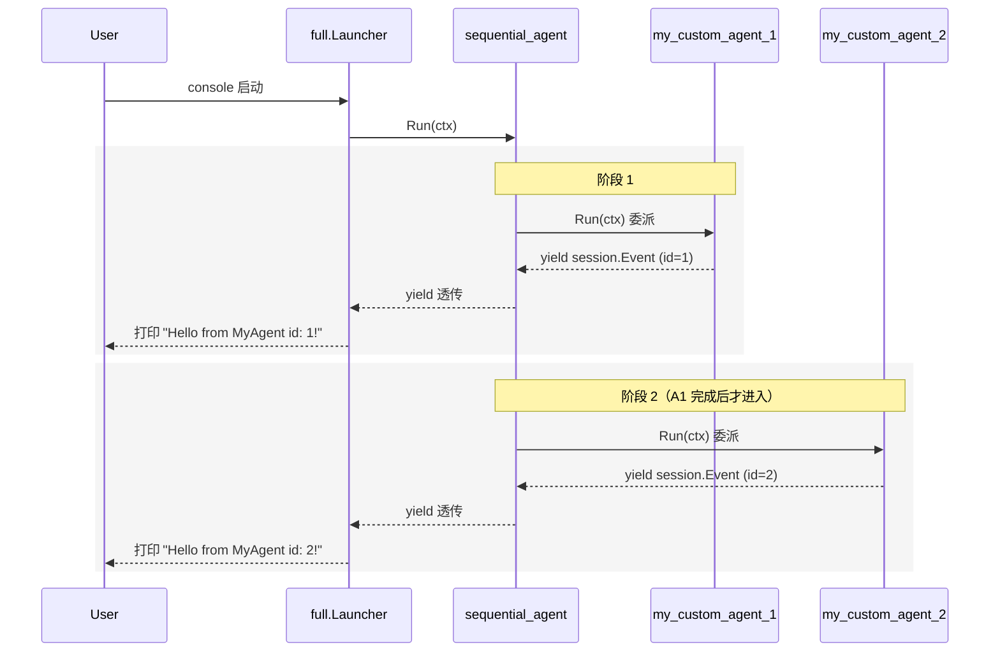

# Sequential Workflow：串行执行多个 Agent

> 本教程基于 [examples/workflowagents/sequential/main.go](../../../examples/workflowagents/sequential/main.go)（约 95 行）。该示例定义两个自定义非 LLM agent，并把它们串成一个严格按顺序执行的 workflow。

## 你将学到

- 什么是 workflow agent，以及 `sequentialagent` 在三类 workflow agent（sequential / parallel / loop）中扮演什么角色
- 如何用 `sequentialagent.New` 把一组子 Agent 按固定顺序串起来
- 如何用 `OutputKey` 把上游 Agent 的输出写入 session state，让下游 Agent 通过 `Instruction` 模板 `{key}` 读到
- 自定义非 LLM agent（`agent.Config.Run`）如何参与同一个 workflow
- 控制台模式下跑通串行 workflow，观察子 agent 输出与事件流

## 前置条件

- [x] 已完成 [01-getting-started/04-multi-agents.md](../01-getting-started/04-multi-agents.md)（理解 SubAgents 与父 Agent 委派）
- [x] 已设置 `GOOGLE_API_KEY`（见 [00-prerequisites](../00-prerequisites.md)）
- [x] 已 `git clone` ADK 仓库并 `go mod download`
- [x] 熟悉 `iter.Seq2` 拉序列语义（Go 1.23+）

## 核心概念

**Workflow Agent** 是 ADK 提供的"编排型父 Agent"——它本身不实现业务逻辑，只决定"什么时候让哪个子 Agent 跑"。在 [agent/workflowagents/](
../../../agent/workflowagents/) 下有三个：`sequentialagent`（顺序）、`parallelagent`（并发）、`loopagent`（循环）。它们都实现 `agent.Agent` 接口，所以可以继续被嵌套、挂到 LLM 父下当作子。

**SequentialAgent** 是其中最简单的一种：按 `SubAgents` 列表顺序逐个执行，每个子 Agent 跑完再跑下一个，**不并发、不条件分支、不循环**。实现见 [agent/workflowagents/sequentialagent/agent.go:78-89](../../../agent/workflowagents/sequentialagent/agent.go)——一个 for 循环包另一个 for 循环，把每个子 agent 的事件 `yield` 给上游。

**跨 Agent 共享状态**靠 session state。所有子 Agent 共享同一份 `InvocationContext` 与 session.Service（[agent/workflowagents/sequentialagent/agent.go:81](../../../agent/workflowagents/sequentialagent/agent.go)）。`llmagent` 的 `OutputKey`（[agent/llmagent/llmagent.go:282](../../../agent/llmagent/llmagent.go)）在子 Agent 推完事件后落盘到 `event.Actions.StateDelta[key]`，下游 Agent 在自己的 `Instruction` 里写 `{key}` 模板就能拿到——这是 sequential workflow 实现"流水线"的核心机制。

```mermaid
graph LR
    U[User] --> S[sequential_agent]
    S -->|顺序 1| A1[子 Agent A]
    S -->|顺序 2| A2[子 Agent B]
    S -->|顺序 3| A3[子 Agent C]
    A1 -->|写 OutputKey| ST[session state]
    ST -->|模板 {key}| A2
    A2 -->|写 OutputKey| ST
    ST -->|模板 {key}| A3
```

> **看图指引**：横向看"执行顺序"——A → B → C 严格串行；纵向看"状态流"——每个子 agent 写 state、下一个读 state。`sequentialagent` 本身**不修改 state**，只负责按序调度；写 state 的是 `llmagent.maybeSaveOutputToState`（[agent/llmagent/llmagent.go:441-474](../../../agent/llmagent/llmagent.go)）。

## 完整代码

完整源码在 [examples/workflowagents/sequential/main.go](../../../examples/workflowagents/sequential/main.go)：

```go
// examples/workflowagents/sequential/main.go
package main

import (
	"context"
	"fmt"
	"iter"
	"log"
	"os"

	"google.golang.org/genai"

	"google.golang.org/adk/agent"
	"google.golang.org/adk/agent/workflowagents/sequentialagent"
	"google.golang.org/adk/cmd/launcher"
	"google.golang.org/adk/cmd/launcher/full"
	"google.golang.org/adk/model"
	"google.golang.org/adk/session"
)

type myAgent struct {
	id int
}

func (a myAgent) Run(ctx agent.InvocationContext) iter.Seq2[*session.Event, error] {
	return func(yield func(*session.Event, error) bool) {
		yield(&session.Event{
			LLMResponse: model.LLMResponse{
				Content: &genai.Content{
					Parts: []*genai.Part{
						{
							Text: fmt.Sprintf("Hello from MyAgent id: %v!\n", a.id),
						},
					},
				},
			},
		}, nil)
	}
}

func main() {
	ctx := context.Background()

	myAgent1, err := agent.New(agent.Config{
		Name:        "my_custom_agent_1",
		Description: "A custom agent that responds with a greeting.",
		Run:         myAgent{id: 1}.Run,
	})
	if err != nil {
		log.Fatalf("Failed to create agent: %v", err)
	}

	myAgent2, err := agent.New(agent.Config{
		Name:        "my_custom_agent_2",
		Description: "A custom agent that responds with a greeting.",
		Run:         myAgent{id: 2}.Run,
	})
	if err != nil {
		log.Fatalf("Failed to create agent: %v", err)
	}

	sequentialAgent, err := sequentialagent.New(sequentialagent.Config{
		AgentConfig: agent.Config{
			Name:        "sequential_agent",
			Description: "A sequential agent that runs sub-agents",
			SubAgents:   []agent.Agent{myAgent1, myAgent2},
		},
	})
	if err != nil {
		log.Fatalf("Failed to create agent: %v", err)
	}

	config := &launcher.Config{
		AgentLoader: agent.NewSingleLoader(sequentialAgent),
	}

	l := full.NewLauncher()
	if err = l.Execute(ctx, config, os.Args[1:]); err != nil {
		log.Fatalf("Run failed: %v\n\n%s", err, l.CommandLineSyntax())
	}
}
```

## 代码逐段讲解

### 1. 自定义非 LLM agent

```go
// examples/workflowagents/sequential/main.go:35-53
type myAgent struct {
	id int
}

func (a myAgent) Run(ctx agent.InvocationContext) iter.Seq2[*session.Event, error] {
	return func(yield func(*session.Event, error) bool) {
		yield(&session.Event{
			LLMResponse: model.LLMResponse{
				Content: &genai.Content{
					Parts: []*genai.Part{
						{Text: fmt.Sprintf("Hello from MyAgent id: %v!\n", a.id)},
					},
				},
			},
		}, nil)
	}
}
```

子 Agent 不必非是 LLM。最简单的实现是给 `agent.Config.Run` 字段挂一个函数（[agent/agent.go:98](../../../agent/agent.go)），该函数返回 `iter.Seq2[*session.Event, error]`——一个 Go 1.23 的拉序列。本例中 `myAgent{1}` 推一条固定问候文本，框架依次 yield 给上游。`session.Event` 的 `Author` 字段未设置，框架会用 `ctx.Agent().Name()` 填充。

### 2. 用 `agent.New` 构造子 Agent

```go
// examples/workflowagents/sequential/main.go:58-65
myAgent1, err := agent.New(agent.Config{
	Name:        "my_custom_agent_1",
	Description: "A custom agent that responds with a greeting.",
	Run:         myAgent{id: 1}.Run,
})
if err != nil {
	log.Fatalf("Failed to create agent: %v", err)
}
```

`agent.New` 是所有 Agent 类型的"通用工厂"，参数是 `agent.Config`（[agent/agent.go:73](../../../agent/agent.go)）。本例 `Name` 必须全局唯一（`agent.New` 内部会校验 [agent/agent.go:57](../../../agent/agent.go)）。`Description` 在父 Agent **动态委派**场景里被 LLM 用作"是否切到我"的判断依据，但本例 `sequentialagent` 不会读这个字段——它只按列表顺序跑。

### 3. 用 `sequentialagent.New` 把子 Agent 串成 workflow

```go
// examples/workflowagents/sequential/main.go:76-85
sequentialAgent, err := sequentialagent.New(sequentialagent.Config{
	AgentConfig: agent.Config{
		Name:        "sequential_agent",
		Description: "A sequential agent that runs sub-agents",
		SubAgents:   []agent.Agent{myAgent1, myAgent2},
	},
})
```

`sequentialagent.New` 签名是 `func(cfg Config) (agent.Agent, error)`（[agent/workflowagents/sequentialagent/agent.go:46](../../../agent/workflowagents/sequentialagent/agent.go)），`Config{ AgentConfig agent.Config }` 嵌入一份 `agent.Config`（[agent/workflowagents/sequentialagent/agent.go:71-74](../../../agent/workflowagents/sequentialagent/agent.go)）。`SubAgents` 列表的顺序就是执行顺序：先 `myAgent1` 后 `myAgent2`。**注意**：`New` 函数会**覆盖** `cfg.AgentConfig.Run`（[agent/workflowagents/sequentialagent/agent.go:52](../../../agent/workflowagents/sequentialagent/agent.go)），如果你传了自定义 `Run` 进去会**报错**而不是默默忽略（[agent/workflowagents/sequentialagent/agent.go:47-49](../../../agent/workflowagents/sequentialagent/agent.go)）。

### 4. sequentialAgent.Run 的真实语义

```go
// agent/workflowagents/sequentialagent/agent.go:78-89
func (a *sequentialAgent) Run(ctx agent.InvocationContext) iter.Seq2[*session.Event, error] {
	return func(yield func(*session.Event, error) bool) {
		for _, subAgent := range ctx.Agent().SubAgents() {
			for event, err := range subAgent.Run(ctx) {
				// TODO: ensure consistency -- if there's an error, return and close iterator, verify everywhere in ADK.
				if !yield(event, err) {
					return
				}
			}
		}
	}
}
```

实现在 [agent/workflowagents/sequentialagent/agent.go:78-89](../../../agent/workflowagents/sequentialagent/agent.go)。两层 for 循环：外层按 `SubAgents` 顺序遍历，内层 pull 每个子 agent 的事件流。**关键**：所有子 agent 共享同一份 `ctx`（`InvocationContext`），所以共享 session、共享 state、共享 `Agent` 指针。这意味着：

- 子 agent A 写 `event.Actions.StateDelta["k"]` 之后，子 agent B 读 `ctx.Session().State()["k"]` 立刻能拿到
- 任何子 agent 都能调 `ctx.Agent().FindSubAgent("name")` 反向查兄弟节点
- 失败语义是"立刻返回并关闭 iterator"——**不会**回滚上游子 agent 的副作用（[agent/workflowagents/sequentialagent/agent.go:82](../../../agent/workflowagents/sequentialagent/agent.go) 注释中已标注这是 TODO）。

### 5. 启动与运行时事件流



> **看图指引**：横向看"调用对象"，纵向看"时间推进"。**第二个阶段必须等第一个阶段完成**——这是 sequential 与 parallel 的核心区别。`sequential_agent` 不会"决定"委派给谁，它只按 `SubAgents` 列表顺序串行调 `Run`。**LLM-driven 的动态委派**要靠 `llmagent` 当父 Agent，本示例没有。

### 6. 串数据：OutputKey 流水线模式

本示例的两个子 agent 都是非 LLM 自定义 agent，没演示 `OutputKey`。如果换成 `llmagent`，可以这样写：

```go
// 假设的子 agent A 与 B（用于演示 OutputKey 流水线）
agentA, _ := llmagent.New(llmagent.Config{
	AgentConfig: agent.Config{
		Name:      "writer",
		OutputKey: "draft",   // 写到这里
		Instruction: "Write a one-sentence story premise.",
	},
	Model: geminiModel,
})

agentB, _ := llmagent.New(llmagent.Config{
	AgentConfig: agent.Config{
		Name:      "editor",
		OutputKey: "final",
		Instruction: "Polish this premise into a vivid logline: {draft}",   // 读上面写的
	},
	Model: geminiModel,
})

sequentialagent.New(sequentialagent.Config{
	AgentConfig: agent.Config{
		Name:      "pipeline",
		SubAgents: []agent.Agent{agentA, agentB},
	},
})
```

机制在 [agent/llmagent/llmagent.go:441-474](../../../agent/llmagent/llmagent.go) 的 `maybeSaveOutputToState`：

1. 子 agent A 推完最后一条非 partial 事件后，框架调 `maybeSaveOutputToState`
2. 函数检查 `event.Author == a.Name()`（[agent/llmagent/llmagent.go:445](../../../agent/llmagent/llmagent.go)）——只有自己写的才存，避免串台
3. 把所有 text part 拼起来，写到 `event.Actions.StateDelta["draft"]`
4. Runner 提交时把 `StateDelta` 合并进 `session.State`
5. 子 agent B 收到 `ctx` 时，`ctx.Session().State()["draft"]` 已经可读
6. 框架在 B 调 LLM 前把 `Instruction` 里的 `{draft}` 模板替换成实际值

> 这条流水线只在 `Run` 模式下成立；`RunLive` 模式另有 `task_completed` 工具注入（[agent/workflowagents/sequentialagent/agent.go:137-163](../../../agent/workflowagents/sequentialagent/agent.go)）让 LLM 主动宣告"我跑完了"。

## 准备与运行

### 步骤 1：确认 API key

```bash
echo $GOOGLE_API_KEY   # 应输出 AIza...
```

本示例不调用 LLM（子 agent 是非 LLM 自定义 agent），`GOOGLE_API_KEY` 实际**不会**被使用，但 `full.Launcher` 的 `console` 子命令可能仍要求环境存在；建议按 [00-prerequisites](../00-prerequisites.md) 准备好。

### 步骤 2：编译并运行

```bash
cd /home/wu/oneone/adk
go run ./examples/workflowagents/sequential console
```

### 步骤 3：测试输入

```
User: hi
[my_custom_agent_1] Hello from MyAgent id: 1!
[my_custom_agent_2] Hello from MyAgent id: 2!
[sequential_agent] user: hi
```

两个 agent 的 greeting **一定**按 1 → 2 顺序出现；不会出现 2 先于 1。

## 常见错误

- **`LoopAgent doesn't allow custom Run implementations`** —— `sequentialagent.New` 不允许你再传 `agent.Config.Run`（[agent/workflowagents/sequentialagent/agent.go:47-49](../../../agent/workflowagents/sequentialagent/agent.go)），因为它要自己注入。子 Agent 的 `Run` 应该用 `agent.Config.SubAgents` 列表传入。
- **`failed to create base agent`** —— `agent.New` 校验失败：通常 `SubAgents` 里有重复 `Name` 或 nil 元素（[agent/agent.go:57](../../../agent/agent.go)）。检查 `my_custom_agent_1` / `my_custom_agent_2` 名字是否一致、子 agent 指针是否非 nil。
- **`sequential agent has no sub-agents`** —— `RunLive` 模式检测到 `SubAgents` 为空（[agent/workflowagents/sequentialagent/agent.go:128](../../../agent/workflowagents/sequentialagent/agent.go)）。本示例是 `Run` 路径不命中；如果你改成 Live 模式且没填 `SubAgents` 会触发。
- **`OutputKey` 没生效** —— 确认 author 匹配：`maybeSaveOutputToState` 只在 `event.Author == a.Name()` 时才存（[agent/llmagent/llmagent.go:445](../../../agent/llmagent/llmagent.go)），子 agent 名字与 `OutputKey` 配置所在的 agent 必须一致。
- **`SubAgents` 顺序写反** —— `sequentialagent` **不并发**（[agent/workflowagents/sequentialagent/agent.go:80](../../../agent/workflowagents/sequentialagent/agent.go)），顺序敏感；要并发请改用 `parallelagent`（见 [02-workflow-parallel.md](./02-workflow-parallel.md)）；要循环请改用 `loopagent`（见 [03-workflow-loop.md](./03-workflow-loop.md)）。

## 关键 API 小结

| API | 位置 | 作用 |
|---|---|---|
| `agent.Config.SubAgents` | `agent/agent.go:89` | 声明父 Agent 的子 Agent 列表 |
| `agent.Config.Run` | `agent/agent.go:98` | 自定义 agent 行为函数（返回 `iter.Seq2`） |
| `agent.New(cfg)` | `agent/agent.go:73` | 通用 Agent 工厂，校验 `Name` 唯一性 |
| `sequentialagent.New` | `agent/workflowagents/sequentialagent/agent.go:46` | 构造顺序执行父 Agent |
| `sequentialAgent.Run` | `agent/workflowagents/sequentialagent/agent.go:78` | 两层 for 循环按 `SubAgents` 顺序串行调度 |
| `sequentialAgent.RunLive` | `agent/workflowagents/sequentialagent/agent.go:125` | Live 模式下注入 `task_completed` 工具 |
| `llmagent.Config.OutputKey` | `agent/llmagent/llmagent.go:282` | 把 agent 输出写入 session state |
| `llmAgent.maybeSaveOutputToState` | `agent/llmagent/llmagent.go:441` | OutputKey 落盘逻辑（要求 `event.Author == a.Name()`） |
| `event.Actions.StateDelta` | `session` 包 | 框架在事件提交时合并进 `session.State` |

## 延伸阅读

- [架构文档：核心抽象一览（含 agent.Agent 签名）](../../architecture/00-overview.md#3-核心抽象一览)
- [架构文档：F3 多 Agent 协作（横向委派 vs 纵向嵌套）](../../architecture/01-core-flows.md#f3-多-agent-协作)
- [架构文档：agent 模块 §4.4 工作流 agent 编排](../../architecture/03-modules/01-agent.md#44-工作流-agent-编排parallel)
- [examples/workflowagents/sequential/main.go](../../../examples/workflowagents/sequential/main.go)
- 子项目深读：并发版见 [02-workflow-parallel.md](./02-workflow-parallel.md)，循环版见 [03-workflow-loop.md](./03-workflow-loop.md)
