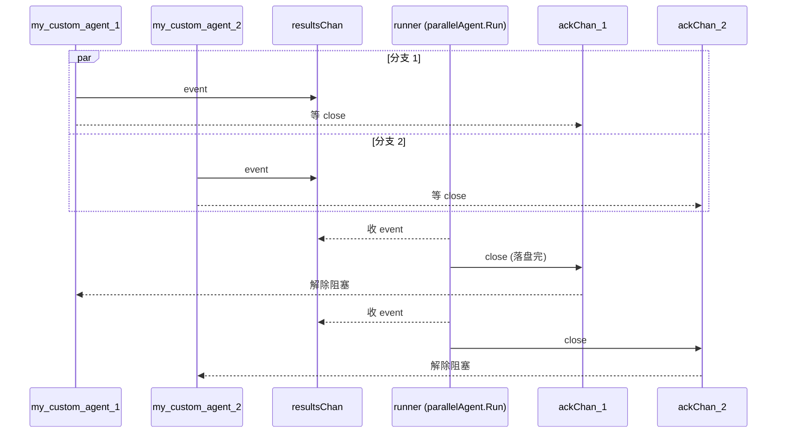

# Parallel Workflow：并行执行多个 Agent

> 本教程基于 [examples/workflowagents/parallel/main.go](../../../examples/workflowagents/parallel/main.go)（约 105 行）。该示例展示如何用 `parallelagent` 让多个子 Agent 并发跑，再用 runner 串起事件流。

## 你将学到

- `parallelagent` 的语义：每个子 Agent **在独立的 goroutine 中运行**，互不阻塞
- ACK 回压（backpressure）机制：runner 没收完事件前，子 Agent 不会推下一条
- 如何用 `Branch` 区分并行分支的来源，便于在日志/session 中追溯
- 自定义非 LLM agent（`agent.Config.Run`）作为并行分支
- 控制台模式下观察交错输出，体会"并发"行为

## 前置条件

- [x] 已完成 [前一教程 03-agents/01-workflow-sequential](./01-workflow-sequential.md)（如目录中尚无，请先看 [01-getting-started/04-multi-agents](../01-getting-started/04-multi-agents.md)）
- [x] 已设置 `GOOGLE_API_KEY`（见 [00-prerequisites](../00-prerequisites.md)）
- [x] 已 `git clone` ADK 仓库并 `go mod download`

## 核心概念

**ParallelAgent**：workflow agents 之一，把 `SubAgents` 列表里每个子 Agent 当作独立分支并发执行。核心实现位于 [agent/workflowagents/parallelagent/agent.go:67-128](../../../agent/workflowagents/parallelagent/agent.go)。它用 `golang.org/x/sync/errgroup` 启 goroutine，并把子 Agent 的事件汇总到一条 channel。

**ACK 回压（backpressure）**：并行分支推事件到 `resultsChan` 后，必须等 runner 在 `ackChan` 上 `close` 才能推下一条（[agent/workflowagents/parallelagent/agent.go:130-158](../../../agent/workflowagents/parallelagent/agent.go)）。这保证下游消费速度决定上游生产速度——不会因一个慢分支拖垮内存。

**Branch 字段**：每次构造子 InvocationContext 时，Branch 被设成 `parentBranch.<curAgent>.<subAgent>`（[agent/workflowagents/parallelagent/agent.go:77-80](../../../agent/workflowagents/parallelagent/agent.go)）。下游 session/事件日志靠它判断事件来自哪条并行分支。

## 完整代码

完整源码在 [examples/workflowagents/parallel/main.go](../../../examples/workflowagents/parallel/main.go)：

```go
// examples/workflowagents/parallel/main.go
package main

import (
	"context"
	"fmt"
	"iter"
	"log"
	rand "math/rand/v2"
	"os"
	"time"

	"google.golang.org/genai"

	"google.golang.org/adk/agent"
	"google.golang.org/adk/agent/workflowagents/parallelagent"
	"google.golang.org/adk/cmd/launcher"
	"google.golang.org/adk/cmd/launcher/full"
	"google.golang.org/adk/model"
	"google.golang.org/adk/session"
)

func main() {
	ctx := context.Background()

	subAgent1, err := agent.New(agent.Config{
		Name:        "my_custom_agent_1",
		Description: "A custom agent that responds with a greeting.",
		Run:         myAgent{id: 1}.Run,
	})
	if err != nil {
		log.Fatalf("Failed to create agent: %v", err)
	}

	subAgent2, err := agent.New(agent.Config{
		Name:        "my_custom_agent_2",
		Description: "A custom agent that responds with a greeting.",
		Run:         myAgent{id: 2}.Run,
	})
	if err != nil {
		log.Fatalf("Failed to create agent: %v", err)
	}

	parallelAgent, err := parallelagent.New(parallelagent.Config{
		AgentConfig: agent.Config{
			Name:        "parallel_agent",
			Description: "A parallel agent that runs sub-agents",
			SubAgents:   []agent.Agent{subAgent1, subAgent2},
		},
	})
	if err != nil {
		log.Fatalf("Failed to create agent: %v", err)
	}

	config := &launcher.Config{
		AgentLoader: agent.NewSingleLoader(parallelAgent),
	}

	l := full.NewLauncher()
	if err = l.Execute(ctx, config, os.Args[1:]); err != nil {
		log.Fatalf("Run failed: %v\n\n%s", err, l.CommandLineSyntax())
	}
}

type myAgent struct {
	id int
}

func (a myAgent) Run(ctx agent.InvocationContext) iter.Seq2[*session.Event, error] {
	return func(yield func(*session.Event, error) bool) {
		for range 3 {
			if !yield(&session.Event{
				LLMResponse: model.LLMResponse{
					Content: &genai.Content{
						Parts: []*genai.Part{
							{
								Text: fmt.Sprintf("Hello from MyAgent id: %v!\n", a.id),
							},
						},
					},
				},
			}, nil) {
				return
			}

			r := 1 + rand.IntN(5)
			time.Sleep(time.Duration(r) * time.Second)
		}
	}
}
```

## 代码逐段讲解

### 1. 自定义 agent：每次 yield 都随机 sleep

```go
// examples/workflowagents/parallel/main.go:79-104
type myAgent struct{ id int }

func (a myAgent) Run(ctx agent.InvocationContext) iter.Seq2[*session.Event, error] {
	return func(yield func(*session.Event, error) bool) {
		for range 3 {
			yield(&session.Event{...Text: fmt.Sprintf("Hello from MyAgent id: %v!\n", a.id)...}, nil)
			r := 1 + rand.IntN(5)
			time.Sleep(time.Duration(r) * time.Second)
		}
	}
}
```

每个子 Agent 会推 3 条 `Hello from MyAgent id: N!`，每次 yield 完 `sleep` 1~5 秒。这个 `sleep` 是关键——它让两个 agent 错开执行，console 输出明显"交错"，你才能看到并发效果。

### 2. 用 `parallelagent.New` 构造并发父 Agent

```go
// examples/workflowagents/parallel/main.go:58-67
parallelAgent, err := parallelagent.New(parallelagent.Config{
	AgentConfig: agent.Config{
		Name:        "parallel_agent",
		Description: "A parallel agent that runs sub-agents",
		SubAgents:   []agent.Agent{subAgent1, subAgent2},
	},
})
```

`parallelagent.New` 不允许自定义 `Run`（[agent/workflowagents/parallelagent/agent.go:45-47](../../../agent/workflowagents/parallelagent/agent.go)），它会自己注入并发调度逻辑。`SubAgents` 列表里 agent 的**顺序不影响执行顺序**——它们并行跑，先到先得。

### 3. parallelAgent.Run 的并发调度真相

```go
// agent/workflowagents/parallelagent/agent.go:67-100
errGroup, errGroupCtx := errgroup.WithContext(ctx)
resultsChan := make(chan result)
doneChan := make(chan bool)

for _, sa := range ctx.Agent().SubAgents() {
	branch := fmt.Sprintf("%s.%s", curAgent.Name(), sa.Name())
	if ctx.Branch() != "" {
		branch = fmt.Sprintf("%s.%s", ctx.Branch(), branch)
	}
	subAgent := sa
	errGroup.Go(func() error {
		subCtx := icontext.NewInvocationContext(errGroupCtx, ..., Branch: branch, Agent: subAgent, ...)
		return runSubAgent(subCtx, subAgent, resultsChan, doneChan)
	})
}
```

每个 `SubAgent` 都被丢进一个 goroutine——用 `errgroup.Go` 启（[agent/workflowagents/parallelagent/agent.go:82](../../../agent/workflowagents/parallelagent/agent.go)）。`subCtx` 是**独立的 `InvocationContext`**，带自己的 `Branch` 前缀（[agent/workflowagents/parallelagent/agent.go:77-80](../../../agent/workflowagents/parallelagent/agent.go)），这样事件能区分来自哪条并行分支。

### 4. ACK 回压：runner 不收，子 Agent 就不推

```go
// agent/workflowagents/parallelagent/agent.go:130-158
func runSubAgent(ctx agent.InvocationContext, agent agent.Agent, results chan<- result, done <-chan bool) error {
	for event, err := range agent.Run(ctx) {
		if err != nil { return err }
		ackChan := make(chan struct{})
		select {
		case <-done: return nil
		case <-ctx.Done(): return ctx.Err()
		case results <- result{event: event, ackChan: ackChan}:
			select {
			case <-ackChan:           // runner 收完事件
			case <-done: return nil
			case <-ctx.Done(): return ctx.Err()
			}
		}
	}
	return nil
}
```

子 Agent 推完一条 event 到 `resultsChan`，就**阻塞**在 `ackChan` 上（[agent/workflowagents/parallelagent/agent.go:148-154](../../../agent/workflowagents/parallelagent/agent.go)）。直到 runner 把这条 event `yield` 给上游、session 写盘完成后，runner 才 `close(ackChan)`，子 Agent 才能推下一条（[agent/workflowagents/parallelagent/agent.go:119-121](../../../agent/workflowagents/parallelagent/agent.go)）。



> **看图指引**：两条分支**同时**往 `resultsChan` 推，但 `resultsChan` 是无缓冲的——runner 没收完上一条，sender 就阻塞。ACK 机制让"子 Agent 的生产节奏"严格跟随"runner 的消费节奏"，避免内存里堆积未确认的事件。`doneChan` 负责广播"父 Agent 已退出"，让所有子 goroutine 干净退出（[agent/workflowagents/parallelagent/agent.go:113](../../../agent/workflowagents/parallelagent/agent.go)）。

### 5. 子 Agent 退出：errgroup.Wait + 收尾

```go
// agent/workflowagents/parallelagent/agent.go:102-110
go func() {
	if err := errGroup.Wait(); err != nil {
		select {
		case resultsChan <- result{err: err}:
		case <-doneChan:
		}
	}
	close(resultsChan)
}()
```

所有子 goroutine 跑完后 `errGroup.Wait()` 返回，单独一个 goroutine 负责 `close(resultsChan)`（[agent/workflowagents/parallelagent/agent.go:109](../../../agent/workflowagents/parallelagent/agent.go)）——这会终结 runner 的 `for res := range resultsChan` 循环（[agent/workflowagents/parallelagent/agent.go:115](../../../agent/workflowagents/parallelagent/agent.go)），整个 parallel workflow 才算真正结束。

## 准备与运行

### 步骤 1：确认 API key

```bash
echo $GOOGLE_API_KEY   # 应输出 AIza...
```

### 步骤 2：编译并运行

```bash
cd /home/wu/oneone/adk
go run ./examples/workflowagents/parallel console
```

### 步骤 3：测试输入

```
User: hi
[my_custom_agent_1 输出] Hello from MyAgent id: 1!
[my_custom_agent_2 输出] Hello from MyAgent id: 2!
[my_custom_agent_1 输出] Hello from MyAgent id: 1!
[my_custom_agent_2 输出] Hello from MyAgent id: 2!
...
```

注意输出**不一定按 id 1/2 严格交替**——两个 agent 都 sleep 随机秒，谁先醒来谁先 yield。但每个 agent 自己内部的 3 条 yield 一定**按顺序**推到 runner（受 ACK 串行化约束）。

## 常见错误

- **`ParallelAgent doesn't allow custom Run implementations`** —— 在 `Config.AgentConfig.Run` 传了自定义函数（[agent/workflowagents/parallelagent/agent.go:45-47](../../../agent/workflowagents/parallelagent/agent.go)）。要自定义就改用 `agent.New` + 自己写并发逻辑，或把自定义逻辑塞进子 Agent。
- **子 Agent 之间状态互相覆盖** —— 多个 goroutine 共享 `ctx.Session()`，写 state 时未加锁会 data race。如果子 Agent 需要写 state，要么串行写，要么用 `Branch` 区分后写不同 key。
- **输出顺序看起来"很奇怪"** —— 并发顺序由 sleep 时长决定，不是 SubAgents 列表顺序；要严格控制顺序请用 `sequentialagent`。
- **`event.Author` 全是 `parallel_agent`** —— 子 Agent 推上来的 event 沿用父 Agent 的 author。要按分支区分，看 `Branch` 字段而不是 `Author`。
- **子 Agent 死循环不退出** —— runner 端 `for res := range resultsChan` 会一直等 ACK 不会停。子 Agent 必须有明确的退出条件（如本例的 `for range 3`）。

## 关键 API 小结

| API | 位置 | 作用 |
|---|---|---|
| `parallelagent.New` | `agent/workflowagents/parallelagent/agent.go:44` | 构造并发执行的父 Agent |
| `parallelagent.Config` | `agent/workflowagents/parallelagent/agent.go:31` | 内部嵌套 `agent.Config` |
| `parallelAgent.run` | `agent/workflowagents/parallelagent/agent.go:67` | 内部 Run 实现：errgroup + resultsChan |
| `runSubAgent` | `agent/workflowagents/parallelagent/agent.go:130` | 单分支运行函数：实现 ACK 回压 |
| `result{event, ackChan}` | `agent/workflowagents/parallelagent/agent.go:160` | runner 与子 Agent 的同步原语 |
| `errgroup.WithContext` | `agent/workflowagents/parallelagent/agent.go:71` | 子 goroutine 错误传播 + ctx 级联取消 |
| `agent.Config.SubAgents` | `agent/agent.go:89` | 声明父 Agent 的子 Agent 列表 |

## 延伸阅读

- [架构文档：核心抽象一览（含 agent.Agent 签名）](../../architecture/00-overview.md#3-核心抽象一览)
- [架构文档：F3 多 Agent 协作（横向委派 vs 纵向嵌套）](../../architecture/01-core-flows.md#f3-多-agent-协作)
- [架构文档：agent 模块 §4.4 工作流 agent 编排（含 parallel 实现要点）](../../architecture/03-modules/01-agent.md#44-工作流-agent-编排parallel)
- [examples/workflowagents/parallel/main.go](../../../examples/workflowagents/parallel/main.go)
- 子项目深读占位：loopagent 的并发+循环嵌套模式见 [03-agents/03-workflow-loop](./03-workflow-loop.md)
