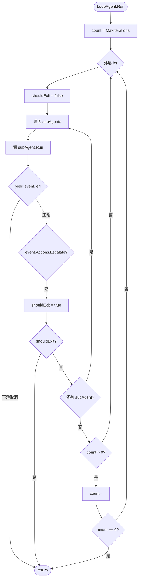

# Loop Workflow：循环执行 Agent 直到条件满足

本教程基于 [examples/workflowagents/loop/main.go](../../../examples/workflowagents/loop/main.go)。它从那个示例中**抽出 `loopagent` 这一个概念**做深读：忽略 `agent.New` / `customAgent` 等外壳代码，专注"如何让一组子 Agent 被反复执行直到满足退出条件"。如果想看更复杂的 pipeline 编排，请回到 [01-workflow-sequential.md](./01-workflow-sequential.md) 与 [02-workflow-parallel.md](./02-workflow-parallel.md)。

## 你将学到

- `loopagent` 与 `sequentialagent` / `parallelagent` 的本质区别：**带状态地重复执行**
- `loopagent.Config` 的两个字段：`AgentConfig` 和 `MaxIterations`，以及 `MaxIterations == 0` 的特殊语义
- LoopAgent 内部的循环结构：外层 for 循环 + 内层 sub-agent 顺序遍历
- 两种退出机制：次数上限 (`MaxIterations`) 和子 Agent 主动 escalate（`event.Actions.Escalate`）
- 自定义非 LLM agent（`agent.Config.Run`）作为子 Agent 时如何在 loop 里 yield 事件
- LoopAgent 本身不能挂自定义 `Run`，否则 `New` 会直接返回错误

## 前置条件

- [x] 已完成 [00-prerequisites.md](../00-prerequisites.md)
- [x] 已完成 [01-getting-started/04-multi-agents.md](../01-getting-started/04-multi-agents.md)
- [x] 已完成 [03-agents/01-workflow-sequential.md](./01-workflow-sequential.md) 和 [03-agents/02-workflow-parallel.md](./02-workflow-parallel.md)
- [x] 已设置 `GOOGLE_API_KEY`（见 [00-prerequisites](../00-prerequisites.md)）
- [x] 熟悉 Go 1.23+ 的 `iter.Seq2` 迭代器语法

## 核心概念

**LoopAgent 是"会重复"的 workflow agent**。`loopagent` 包提供了 `Config` 和 `New`（[agent/workflowagents/loopagent/agent.go:29-69](../../../agent/workflowagents/loopagent/agent.go)）。它和 `sequentialagent` / `parallelagent` 一样，本身也是一种 `agent.Agent`——可以被其他 agent 当作子 agent 嵌套，也可以挂到 LLM 上做父。

**`MaxIterations` 控制"最多跑几轮"**。当 `MaxIterations == 0` 时，LoopAgent 会"无限跑下去"，**直到某个子 agent 通过 `event.Actions.Escalate = true` 主动喊停**（[agent/workflowagents/loopagent/agent.go:33-35](../../../agent/workflowagents/loopagent/agent.go) 与 [agent/workflowagents/loopagent/agent.go:88-94](../../../agent/workflowagents/loopagent/agent.go)）。非零时，每跑完一轮就 `--count`，count 归零就退出（[agent/workflowagents/loopagent/agent.go:97-102](../../../agent/workflowagents/loopagent/agent.go)）。

**每一轮都按顺序串行执行所有 sub-agent**。和 `sequentialagent` 一样，sub-agents 数组按声明顺序逐个跑；但外层多套了一层 `for {}`，因此同样的子 agent 会被反复触发。这种"反复触发同一组 agent"的模式适合"代码评审→修改→再评审"或"翻译→润色→再润色"这类迭代改进场景（[agent/workflowagents/loopagent/agent.go:40-44](../../../agent/workflowagents/loopagent/agent.go) 的注释里直接举了 `revising code` 的例子）。

**退出机制有两条路径，互不冲突**：

| 路径 | 触发方 | 代码位置 |
|---|---|---|
| 迭代上限 | `MaxIterations` 计数归零 | [agent/workflowagents/loopagent/agent.go:97-102](../../../agent/workflowagents/loopagent/agent.go) |
| 主动 escalate | 任意 sub-agent 在 yield 出的 event 上设 `Actions.Escalate = true` | [agent/workflowagents/loopagent/agent.go:88-94](../../../agent/workflowagents/loopagent/agent.go) |

只要其中任意一条命中，LoopAgent 立即 `return`，**不再继续当前轮后续 sub-agent 也不开下一轮**。

## 完整代码

完整源码在 [examples/workflowagents/loop/main.go](../../../examples/workflowagents/loop/main.go)：

```go
// examples/workflowagents/loop/main.go
package main

import (
	"context"
	"iter"
	"log"
	"os"

	"google.golang.org/genai"

	"google.golang.org/adk/agent"
	"google.golang.org/adk/agent/workflowagents/loopagent"
	"google.golang.org/adk/cmd/launcher"
	"google.golang.org/adk/cmd/launcher/full"
	"google.golang.org/adk/model"
	"google.golang.org/adk/session"
)

func CustomAgentRun(ctx agent.InvocationContext) iter.Seq2[*session.Event, error] {
	return func(yield func(*session.Event, error) bool) {
		yield(&session.Event{
			LLMResponse: model.LLMResponse{
				Content: &genai.Content{
					Parts: []*genai.Part{
						{
							Text: "Hello from MyAgent!\n",
						},
					},
				},
			},
		}, nil)
	}
}

func main() {
	ctx := context.Background()

	customAgent, err := agent.New(agent.Config{
		Name:        "my_custom_agent",
		Description: "A custom agent that responds with a greeting.",
		Run:         CustomAgentRun,
	})
	if err != nil {
		log.Fatalf("Failed to create agent: %v", err)
	}

	loopAgent, err := loopagent.New(loopagent.Config{
		MaxIterations: 3,
		AgentConfig: agent.Config{
			Name:        "loop_agent",
			Description: "A loop agent that runs sub-agents",
			SubAgents:   []agent.Agent{customAgent},
		},
	})
	if err != nil {
		log.Fatalf("Failed to create agent: %v", err)
	}

	config := &launcher.Config{
		AgentLoader: agent.NewSingleLoader(loopAgent),
	}

	l := full.NewLauncher()
	if err = l.Execute(ctx, config, os.Args[1:]); err != nil {
		log.Fatalf("Run failed: %v\n\n%s", err, l.CommandLineSyntax())
	}
}
```

源文件总长 82 行（含版权头与空行），上述片段从 [examples/workflowagents/loop/main.go:16-82](../../../examples/workflowagents/loop/main.go) 截取。

## 代码逐段讲解

### 1. 子 Agent：自定义非 LLM agent

```go
// examples/workflowagents/loop/main.go:34-48
func CustomAgentRun(ctx agent.InvocationContext) iter.Seq2[*session.Event, error] {
	return func(yield func(*session.Event, error) bool) {
		yield(&session.Event{
			LLMResponse: model.LLMResponse{
				Content: &genai.Content{
					Parts: []*genai.Part{
						{
							Text: "Hello from MyAgent!\n",
						},
					},
				},
			},
		}, nil)
	}
}
```

这是一个**不依赖 LLM 的纯函数式 agent**：通过 `agent.Config.Run` 注入自定义 `Run` 函数（[examples/workflowagents/loop/main.go:56](../../../examples/workflowagents/loop/main.go)），每次被调用就 `yield` 一条带 `genai.Content` 的事件。`iter.Seq2[*session.Event, error]` 是 Go 1.23+ 的迭代器类型签名，ADK 内部用它把事件流从子 agent 一路冒泡到 runner。

注意这里**没有设置 `Actions.Escalate = true`**，所以这个 agent 不会主动让 loop 退出——loop 的退出完全靠 `MaxIterations == 3` 计数归零。这正好用来演示"无限循环可控"的最简模式。

### 2. LoopAgent 配置

```go
// examples/workflowagents/loop/main.go:62-69
loopAgent, err := loopagent.New(loopagent.Config{
	MaxIterations: 3,
	AgentConfig: agent.Config{
		Name:        "loop_agent",
		Description: "A loop agent that runs sub-agents",
		SubAgents:   []agent.Agent{customAgent},
	},
})
```

`loopagent.Config` 嵌入 `agent.Config` 作为 `AgentConfig`（[agent/workflowagents/loopagent/agent.go:28-36](../../../agent/workflowagents/loopagent/agent.go)），外加一个 `MaxIterations uint` 字段。这里 `MaxIterations: 3` 意味着整个 loop 最多跑 3 轮（不论中间 yield 多少 event）。

**关键约束**：`loopagent.New` 会在 [agent/workflowagents/loopagent/agent.go:46-48](../../../agent/workflowagents/loopagent/agent.go) 显式拒绝自定义 `Run`：

```go
if cfg.AgentConfig.Run != nil {
    return nil, fmt.Errorf("LoopAgent doesn't allow custom Run implementations")
}
```

这与 `sequentialagent` / `parallelagent` 的设计一致：loop 本身的循环逻辑由包内 `loopAgentImpl.Run`（[agent/workflowagents/loopagent/agent.go:75-105](../../../agent/workflowagents/loopagent/agent.go)）实现，**用户无权覆盖**。

### 3. 启动器与运行

```go
// examples/workflowagents/loop/main.go:74-81
config := &launcher.Config{
    AgentLoader: agent.NewSingleLoader(loopAgent),
}

l := full.NewLauncher()
if err = l.Execute(ctx, config, os.Args[1:]); err != nil {
    log.Fatalf("Run failed: %v\n\n%s", err, l.CommandLineSyntax())
}
```

和 [01-workflow-sequential.md](./01-workflow-sequential.md) 一样，这里用 `agent.NewSingleLoader(loopAgent)` 把 loop agent 作为根 agent，再用 `full.NewLauncher()` 暴露 console / web / api 等子命令。`os.Args[1:]` 把子命令（如 `console`）透传给 launcher。

### 4. LoopAgent 内部循环结构

理解 LoopAgent 行为的关键是 [agent/workflowagents/loopagent/agent.go:75-105](../../../agent/workflowagents/loopagent/agent.go) 的 30 行实现：

```go
// agent/workflowagents/loopagent/agent.go:75-105
func (a *loopAgent) Run(ctx agent.InvocationContext) iter.Seq2[*session.Event, error] {
    count := a.maxIterations

    return func(yield func(*session.Event, error) bool) {
        for {
            shouldExit := false
            for _, subAgent := range ctx.Agent().SubAgents() {
                for event, err := range subAgent.Run(ctx) {
                    if !yield(event, err) {
                        return
                    }
                    if event != nil && event.Actions.Escalate {
                        shouldExit = true
                    }
                }
                if shouldExit {
                    return
                }
            }

            if count > 0 {
                count--
                if count == 0 {
                    return
                }
            }
        }
    }
}
```

把它压平成一张流程图：



> **看图指引**：最外层是 `for {}` 死循环（[agent/workflowagents/loopagent/agent.go:79](../../../agent/workflowagents/loopagent/agent.go)）；中间层按 `SubAgents()` 顺序逐个 `Run`（[agent/workflowagents/loopagent/agent.go:81](../../../agent/workflowagents/loopagent/agent.go)），yield 出的 event 透传给上游；最内层 yield 退出和 escalate 都会"立即跳出整个 loop"。注意 `count == 0` 的判断在 `--` 之后（[agent/workflowagents/loopagent/agent.go:97-102](../../../agent/workflowagents/loopagent/agent.go)），所以 `MaxIterations: 3` 实际跑 3 整轮。

### 5. 两种退出机制对比

**（a）次数上限（被动）**：

```go
// agent/workflowagents/loopagent/agent.go:97-102
if count > 0 {
    count--
    if count == 0 {
        return
    }
}
```

把 `count` 想象成一个"剩余轮数"。`MaxIterations: 3` 一开始 count = 3，跑完第 1 轮后 count = 2，跑完第 2 轮后 count = 1，跑完第 3 轮后 count = 0 → return。**注意 0 不算"无限"，而是"算满 0 轮"**——这与 `MaxIterations == 0` 的语义不同（见下）。

**（b）主动 escalate（子 agent 决定）**：

```go
// agent/workflowagents/loopagent/agent.go:88-90
if event != nil && event.Actions.Escalate {
    shouldExit = true
}
```

子 agent 在 yield 的 event 上设 `Actions.Escalate = true`，loop 就会在当前 sub-agent 跑完后立即 `return`，**不再开下一轮**。这是**唯一**让 `MaxIterations == 0`（无限循环）能正常终止的方式。LLMAgent 在某些内置流程（如最终回答已就绪）会自动 escalate；自定义 agent 则需要自己在 yield 前显式赋值。

## 准备与运行

### 步骤 1：获取凭证

到 [Google AI Studio](https://aistudio.google.com/apikey) 申请一个 `GOOGLE_API_KEY`（以 `AIza` 开头）。详见 [00-prerequisites.md §3](../00-prerequisites.md)。

> 注：本示例因为 `CustomAgentRun` 不调用 LLM，理论上没有 `GOOGLE_API_KEY` 也能跑。但 launcher 仍会校验环境变量，建议照常设置以保持习惯。

### 步骤 2：设置环境变量

```bash
export GOOGLE_API_KEY=AIza...你的key...
```

### 步骤 3：运行

```bash
cd /home/wu/oneone/adk
go run ./examples/workflowagents/loop console
```

启动后进入交互式 console。你每次输入文本，loop agent 都会把 `my_custom_agent` 跑 3 轮；3 轮跑完后由 runner 把最后一条 event 的文本回传给你。

### 步骤 4：测试输入

```
User: hi
[agent loop 跑 3 轮，每轮都 yield 一条 "Hello from MyAgent!"，console 打印 3 次]
[最后一轮的输出作为 agent 的 reply 回给用户]
```

观察点：同一次输入触发了 3 次相同的事件流，证明 loop 真的在重跑。

## 常见错误

- **`loopagent.Config.AgentConfig.Run != nil`** —— `New` 在 [agent/workflowagents/loopagent/agent.go:46-48](../../../agent/workflowagents/loopagent/agent.go) 会返回 `LoopAgent doesn't allow custom Run implementations`。LoopAgent 的循环逻辑是固定的，不要试图"加自己的循环"
- **把 `MaxIterations: 0` 当成"跑一次"** —— 实际是"无限循环"，需要子 agent escalate 才能退出。新手最常踩的坑
- **把 `MaxIterations: 1` 当成"跑两次"** —— 实际是 1 整轮（`count` 从 1 → 0 后立即 return）。`N` 就是字面意义的"最多 N 轮"
- **在子 agent 里读 `event.Actions.Escalate` 试图"知道 loop 要停了"** —— 这是 runner 写、子 agent 读的方向；反过来子 agent 通过**写** `event.Actions.Escalate = true` 主动喊停
- **子 agent yield 抛错** —— yield 出的 `(event, err)` 中的 err 会被原样透传给上游（[agent/workflowagents/loopagent/agent.go:84](../../../agent/workflowagents/loopagent/agent.go)），loop 本身不会捕获。所以子 agent 的错误处理是你的责任
- **外层 yield 被取消时 (`!yield(event, err) == true`)** —— loop 会立即 `return`（[agent/workflowagents/loopagent/agent.go:84-86](../../../agent/workflowagents/loopagent/agent.go)），这是 runner 关闭 session 时的正常路径，不是错误

## 关键 API 小结

| API | 位置 | 作用 |
|---|---|---|
| `loopagent.Config` | [agent/workflowagents/loopagent/agent.go:29](../../../agent/workflowagents/loopagent/agent.go) | 嵌入 `agent.Config` + `MaxIterations uint` |
| `loopagent.New` | [agent/workflowagents/loopagent/agent.go:45](../../../agent/workflowagents/loopagent/agent.go) | 构造 LoopAgent，拒绝自定义 `Run` |
| `loopAgentImpl.Run` | [agent/workflowagents/loopagent/agent.go:75](../../../agent/workflowagents/loopagent/agent.go) | 内部循环实现（用户不能覆盖） |
| `MaxIterations == 0` 语义 | [agent/workflowagents/loopagent/agent.go:33-35](../../../agent/workflowagents/loopagent/agent.go) | 无限循环，仅靠 escalate 退出 |
| 退出机制：count 归零 | [agent/workflowagents/loopagent/agent.go:97-102](../../../agent/workflowagents/loopagent/agent.go) | 跑满 N 轮后退出 |
| 退出机制：Escalate | [agent/workflowagents/loopagent/agent.go:88-94](../../../agent/workflowagents/loopagent/agent.go) | 子 agent 主动喊停 |
| `event.Actions.Escalate` | session 包 | 事件级别的"升级 / 跳出"标志 |
| `agent.Agent.SubAgents()` | agent 包 | 返回该 agent 的所有 sub-agent |
| `agent.NewSingleLoader` | agent 包 | 把单个 agent 包成 loader，喂给 launcher |

## 延伸阅读

- [架构文档：agent 核心接口与 SubAgent 语义](../../architecture/03-modules/01-agent.md)
- [架构文档：核心流程 F1 — workflow agent 调度](../../architecture/01-core-flows.md)
- [examples/workflowagents/loop/main.go](../../../examples/workflowagents/loop/main.go) —— 本教程的源码
- [examples/workflowagents/sequential](../../../examples/workflowagents/sequential) —— 顺序执行的姊妹示例
- [examples/workflowagents/parallel](../../../examples/workflowagents/parallel) —— 并发执行的姊妹示例
- 姐妹教程：[01-workflow-sequential.md](./01-workflow-sequential.md)（顺序）、[02-workflow-parallel.md](./02-workflow-parallel.md)（并发）
- 子项目深读占位：`agent/workflowagents/loopagent/agent.go` 的 30 行 `Run` 实现（建议对照 sequential/parallel 的实现做横向比较）
