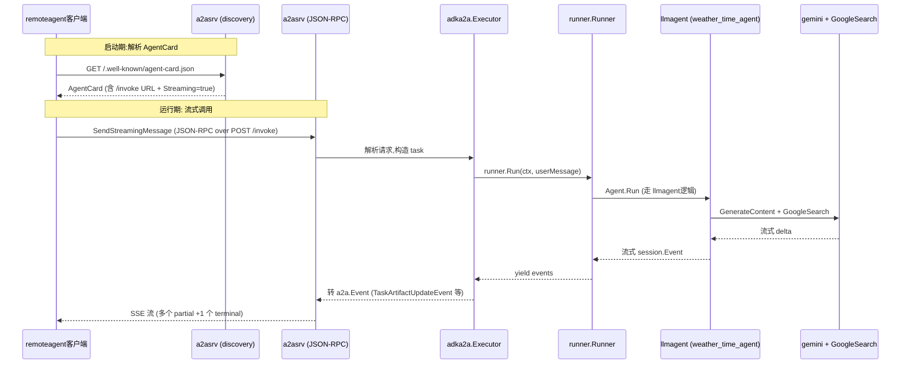

# Remote Agent：通过 A2A协议调用远程 Agent

> 本教程基于 [examples/a2a/main.go](../../../examples/a2a/main.go)（约140 行）。它在同一个 Go 二进制里同时启动一个 **A2A 服务端**（暴露一个 weather agent）和一个 **A2A客户端**（用 `remoteagent.NewA2A` 把远程 agent包装成本地可调用的 `agent.Agent`），然后通过 console / restapi 等模式与"远程" agent 对话。

## 你将学到

-什么是 A2A（Agent-To-Agent）协议，以及它与 ADK 自带 REST API 的差别
- 如何用 [`server/adka2a/v2`](../../../server/adka2a/v2/) 在 `net/http` 上暴露任意 agent 为 A2A 服务
- 如何用 [`agent/remoteagent/v2.NewA2A`](../../../agent/remoteagent/v2/a2a_agent.go:156) 把远程 agent 当作本地 `agent.Agent` 直接喂给 `runner.Runner`
-客户端 `partial`事件聚合机制：为什么 `aggregatePartial`总是先发零散 partial、再发一条"完整版"非 partial事件
- `AgentCardProvider` 与 `AgentCard` 二选一：如何声明远程 agent 的元数据 + 接口地址

## 前置条件

- [x] 已完成 [前一教程01-getting-started/05-run-as-server](./../01-getting-started/05-run-as-server.md)（熟悉把 agent暴露成 HTTP 服务）
- [x] 已设置 `GOOGLE_API_KEY`（见 [00-prerequisites](../00-prerequisites.md)）
- [x] 已 `git clone` ADK仓库并 `go mod download`
- [x] 本机127.0.0.1 的随机端口空闲（A2A server 用 `net.Listen("tcp", "127.0.0.1:0)` 自动挑）

##核心概念

**A2A（Agent-To-Agent）协议** 是 Google提出的、与语言无关的 agent 间通信协议。它定义了 `AgentCard`（agent 名片，含名字、技能、支持接口）、`SendMessage` / `SendStreamingMessage`（消息发送的两种模式）、`Task`（带状态的远程任务）等概念。ADK 同时实现 A2A 的客户端和服务端：服务端代码在 [`server/adka2a/v2`](../../../server/adka2a/v2/)，客户端代理代码在 [`agent/remoteagent/v2`](../../../agent/remoteagent/v2/)。

**RemoteAgent**：把远程 agent "伪装"成 ADK内部的 `agent.Agent`。它通过 [`remoteagent.NewA2A`](../../../agent/remoteagent/v2/a2a_agent.go:156)构造：内部把 `Run`替换成"解析 AgentCard →构造 A2A客户端 → SendMessage / SendStreamingMessage → 把 A2A事件转回 `session.Event`"的循环（[`agent/remoteagent/v2/a2a_agent.go:199`](../../../agent/remoteagent/v2/a2a_agent.go:199)）。从 `runner.Runner`视角看，调用 RemoteAgent 与调用 `llmagent` **没有差别**——只是事件流的来源变成了网络。

**Partial聚合**：A2A 流式响应里，远程 agent 可能发出多条 `LastChunk=false` 的增量 artifact事件。ADK客户端不在每条 partial 上都 `yield`一次（那样会让前端闪烁、重复渲染），而是在处理器 `aggregatePartial`（[`agent/remoteagent/v2/a2a_agent_run_processor.go:62`](../../../agent/remoteagent/v2/a2a_agent_run_processor.go)）里把它们累计起来，**只在收到最后一个 chunk（`LastChunk=true`）或 terminal status 时**额外发一条"非 partial 的完整版"事件（[`agent/remoteagent/v2/a2a_agent_run_processor.go:114`](../../../agent/remoteagent/v2/a2a_agent_run_processor.go)）。这样 UI 既能看到打字机效果（partial），又能拿到一条"完整可入库"的最终文本（非 partial）。

##完整代码

完整源码在 [examples/a2a/main.go](../../../examples/a2a/main.go)：

```go
// examples/a2a/main.go
package main

import (
	"context"
	"log"
	"net"
	"net/http"
	"net/url"
	"os"

	"github.com/a2aproject/a2a-go/v2/a2a"
	"github.com/a2aproject/a2a-go/v2/a2asrv"
	"google.golang.org/genai"

	"google.golang.org/adk/agent"
	"google.golang.org/adk/agent/llmagent"
	"google.golang.org/adk/agent/remoteagent/v2"
	"google.golang.org/adk/cmd/launcher"
	"google.golang.org/adk/cmd/launcher/full"
	"google.golang.org/adk/model/gemini"
	"google.golang.org/adk/runner"
	"google.golang.org/adk/server/adka2a/v2"
	"google.golang.org/adk/session"
	"google.golang.org/adk/tool"
	"google.golang.org/adk/tool/geminitool"
)

// newWeatherAgent creates a simple LLM-agent as in the quickstart example.
func newWeatherAgent(ctx context.Context) agent.Agent {
	model, err := gemini.NewModel(ctx, "gemini-3.1-flash-lite", &genai.ClientConfig{
		APIKey: os.Getenv("GOOGLE_API_KEY"),
	})
	if err != nil {
		log.Fatalf("Failed to create a model: %v", err)
	}

	agent, err := llmagent.New(llmagent.Config{
		Name: "weather_time_agent",
		Model: model,
		Description: "Agent to answer questions about the time and weather in a city.",
		Instruction: "I can answer your questions about the time and weather in a city.",
		Tools: []tool.Tool{geminitool.GoogleSearch{}},
	})
	if err != nil {
		log.Fatalf("Failed to create an agent: %v", err)
	}
	return agent
}

// startWeatherAgentServer starts an HTTP server which exposes a weather agent using A2A (Agent-To-Agent) protocol.
func startWeatherAgentServer() string {
	listener, err := net.Listen("tcp", "127.0.0.1:0")
	if err != nil {
		log.Fatalf("Failed to bind to a port: %v", err)
	}

	baseURL := &url.URL{Scheme: "http", Host: listener.Addr().String()}

	log.Printf("Starting A2A server on %s", baseURL.String())

	go func() {
		ctx := context.Background()
		agent := newWeatherAgent(ctx)

		agentPath := "/invoke"
		agentCard := &a2a.AgentCard{
			Name: agent.Name(),
			Description: agent.Description(),
			SupportedInterfaces: []*a2a.AgentInterface{
				{
					URL: baseURL.JoinPath(agentPath).String(),
					ProtocolBinding: a2a.TransportProtocolJSONRPC,
					ProtocolVersion: a2a.Version,
				},
			},
			Version: "1.0.0",
			DefaultInputModes: []string{"text/plain"},
			DefaultOutputModes: []string{"text/plain"},
			Skills: adka2a.BuildAgentSkills(agent),
			Capabilities: a2a.AgentCapabilities{Streaming: true},
		}

		mux := http.NewServeMux()
		mux.Handle(a2asrv.WellKnownAgentCardPath, a2asrv.NewStaticAgentCardHandler(agentCard))

		executor := adka2a.NewExecutor(adka2a.ExecutorConfig{
			RunnerConfig: runner.Config{
				AppName: agent.Name(),
				Agent: agent,
				SessionService: session.InMemoryService(),
			},
		})
		requestHandler := a2asrv.NewHandler(executor)
		mux.Handle(agentPath, a2asrv.NewJSONRPCHandler(requestHandler))

		err := http.Serve(listener, mux)

		log.Printf("A2A server stopped: %v", err)
	}()

	return baseURL.String()
}

func main() {
	ctx := context.Background()

	a2aServerAddress := startWeatherAgentServer()

	remoteAgent, err := remoteagent.NewA2A(remoteagent.A2AConfig{
		Name: "A2A Weather agent",
		AgentCardProvider: remoteagent.NewAgentCardProvider(a2aServerAddress),
	})
	if err != nil {
		log.Fatalf("Failed to create a remote agent: %v", err)
	}

	config := &launcher.Config{
		AgentLoader: agent.NewSingleLoader(remoteAgent),
	}

	l := full.NewLauncher()
	if err = l.Execute(ctx, config, os.Args[1:]); err != nil {
		log.Fatalf("Run failed: %v\n\n%s", err, l.CommandLineSyntax())
	}
}
```

## 代码逐段讲解

###1. 服务端 Agent：与 quickstart相同的 weather agent

```go
// examples/a2a/main.go:44-63
func newWeatherAgent(ctx context.Context) agent.Agent {
 model, _ := gemini.NewModel(ctx, "gemini-3.1-flash-lite", &genai.ClientConfig{APIKey: os.Getenv("GOOGLE_API_KEY")})
 agent, _ := llmagent.New(llmagent.Config{
 Name: "weather_time_agent",
 Model: model,
 Description: "Agent to answer questions about the time and weather in a city.",
 Instruction: "I can answer your questions about the time and weather in a city.",
 Tools: []tool.Tool{geminitool.GoogleSearch{}},
 })
 return agent
}
```

这一段你已经在 [01-getting-started/01-hello-world.md](../01-getting-started/01-hello-world.md) 与 [02-first-tool.md](../01-getting-started/02-first-tool.md)见过。它只是把一个 `llmagent` 包起来。注意 `Name` 是 `"weather_time_agent"`——这个字符串会出现在 A2A `AgentCard` 的 `Name`字段，也会成为 A2A客户端发现服务时返回的标识（[examples/a2a/main.go:83](../../../examples/a2a/main.go)）。

###2. 服务端：绑定随机端口 +启动 HTTP server

```go
// examples/a2a/main.go:67-117
listener, _ := net.Listen("tcp", "127.0.0.1:0")
baseURL := &url.URL{Scheme: "http", Host: listener.Addr().String()}

go func() {
 agent := newWeatherAgent(ctx)
 agentCard := &a2a.AgentCard{...}
 mux := http.NewServeMux()
 mux.Handle(a2asrv.WellKnownAgentCardPath, a2asrv.NewStaticAgentCardHandler(agentCard))
 executor := adka2a.NewExecutor(adka2a.ExecutorConfig{
 RunnerConfig: runner.Config{AppName: agent.Name(), Agent: agent, SessionService: session.InMemoryService()},
 })
 requestHandler := a2asrv.NewHandler(executor)
 mux.Handle("/invoke", a2asrv.NewJSONRPCHandler(requestHandler))
 http.Serve(listener, mux)
}()
return baseURL.String()
```

关键点：

- `net.Listen("tcp", "127.0.0.1:0")` 让 OS随机挑端口——避免 hardcode冲突，**同进程内的客户端可以直接拿到 `listener.Addr()`**（[examples/a2a/main.go:68-72](../../../examples/a2a/main.go)）。
- `a2asrv.WellKnownAgentCardPath` 是 A2A规范规定的"固定 URL"，客户端 GET 这个路径就能拿到 `AgentCard` JSON，不需要事先知道任何 endpoint（[examples/a2a/main.go:99](../../../examples/a2a/main.go)）。
- `adka2a.NewExecutor` 把 ADK 的 `runner.Runner` 包成 A2A `executor.Executor`；再套一层 `a2asrv.NewHandler` + `a2asrv.NewJSONRPCHandler` 处理 JSON-RPC2.0编码（[examples/a2a/main.go:101-109](../../../examples/a2a/main.go)）。
- `Capabilities: a2a.AgentCapabilities{Streaming: true}`告诉客户端"我支持 SSE 流式响应"——客户端会按 `SendStreamingMessage` 而不是 `SendMessage` 调用（[examples/a2a/main.go:95](../../../examples/a2a/main.go)）。



> **看图指引**：同一进程内**先启动 server，再启动 client**，client 通过 `WellKnownAgentCardPath`拿到地址，然后所有用户输入都走 JSON-RPC `SendStreamingMessage`。`agent/remoteagent/v2/a2a_agent.go:298`调 `sender.SendStreamingMessage(ctx, req)` 进入循环；每收到一条 `a2a.Event` 就走 `processEvent` → `convertToSessionEvent` → `aggregatePartial` → `yield`。

###3.客户端：构造 RemoteAgent 并交给 launcher

```go
// examples/a2a/main.go:122-139
a2aServerAddress := startWeatherAgentServer()

remoteAgent, _ := remoteagent.NewA2A(remoteagent.A2AConfig{
 Name: "A2A Weather agent",
 AgentCardProvider: remoteagent.NewAgentCardProvider(a2aServerAddress),
})

config := &launcher.Config{AgentLoader: agent.NewSingleLoader(remoteAgent)}
l := full.NewLauncher()
l.Execute(ctx, config, os.Args[1:])
```

关键点：

- `remoteagent.NewAgentCardProvider(url)` 返回一个 `AgentCardProvider` 函数——**每次调用**都会重新解析 AgentCard（[`agent/remoteagent/v2/a2a_agent.go:64`](../../../agent/remoteagent/v2/a2a_agent.go)）。这意味着你修改 `A2AConfig` 后**不需要重启**进程：下次对话会重新拉一次 card。
- `AgentCard` 与 `AgentCardProvider` **二选一**即可（[`agent/remoteagent/v2/a2a_agent.go:157-159`](../../../agent/remoteagent/v2/a2a_agent.go)）。给 URL 就用 `NewAgentCardProvider`；要复用本地已知的 card 结构体就传 `AgentCard:`字段。
- `remoteAgent` **是一个普通的 `agent.Agent`**——它被丢进 `agent.NewSingleLoader`，再交给 `full.NewLauncher.Execute`。后面你跑 `console`、`restapi`、`webui`任意模式，对它来说都和 `llmagent` 无差别。

###4. RemoteAgent内部：`a2a_agent.go:199` 的 Run 实现

```go
// agent/remoteagent/v2/a2a_agent.go:199-304
func (a *a2aAgent) run(ctx agent.InvocationContext, cfg A2AConfig) iter.Seq2[*session.Event, error] {
 return func(yield func(*session.Event, error) bool) {
 card, _ :=iremoteagent.ResolveAgentCard(ctx, a.serverConfig)
 sender, _ := cfg.ClientProvider(ctx, card)
 msg, _ := newMessage(ctx, cfg)
 req := &a2a.SendMessageRequest{Message: msg, Config: cfg.MessageSendConfig}
 // ...跑 before / after callback链后决定走 SendMessage 还是 SendStreamingMessage
 if ctx.RunConfig().StreamingMode == agent.StreamingModeNone {
 a2aEvent, a2aErr := sender.SendMessage(ctx, req)
 processEvent(a2aEvent, a2aErr)
 return
 }
 for a2aEvent, a2aErr := range sender.SendStreamingMessage(ctx, req) {
 processEvent(a2aEvent, a2aErr)
 }
 }
}
```

注意三点：

1. **每次 Run 都重新解析 card**（[a2a_agent.go:201](../../../agent/remoteagent/v2/a2a_agent.go)）。要缓存就把 `AgentCardProvider` 包一层带 TTL 的闭包。
2. **`StreamingModeNone`走 `SendMessage`，否则走 `SendStreamingMessage`**（[a2a_agent.go:292-302](../../../agent/remoteagent/v2/a2a_agent.go)）。`console`模式默认是 `StreamingModeSSE`，所以本例一定走 streaming 分支。
3. **退出时清理远端 task**：如果 Run 因 ctx取消或异常退出，且最后收到的不是 terminal event，defer 里会调 `cleanupRemoteTask` → 默认行为是给远程发 `CancelTask` 请求并设5s 超时（[a2a_agent.go:249-254](../../../agent/remoteagent/v2/a2a_agent.go) 与 [a2a_agent.go:306-344](../../../agent/remoteagent/v2/a2a_agent.go)）。

###5. Partial聚合：客户端"何时发完整版"事件

```go
// agent/remoteagent/v2/a2a_agent_run_processor.go:62-117
func (p *a2aAgentRunProcessor) aggregatePartial(ctx agent.InvocationContext, a2aEvent a2a.Event, event *session.Event) []*session.Event {
 // legacy OutputMode:跳过 partial标记，直接 yield
 if a2aEvent != nil && adka2a.IsPartialFlagSet(a2aEvent.Meta()) {
 return []*session.Event{event}
 }
 // terminal status: 把所有已聚合的事件"按顺序"先 yield，再 yield 当前 event
 if statusUpdate, ok := a2aEvent.(*a2a.TaskStatusUpdateEvent); ok && statusUpdate.Status.State.Terminal() {
 var events []*session.Event
 for _, aid := range p.aggregationOrder {
 if agg, ok := p.aggregations[aid]; ok {
 events = append(events, p.buildNonPartialAggregation(ctx, agg))
 }
 }
 return append(events, event)
 }
 // Task snapshot: 清空聚合（不再重复发）
 if _, ok := a2aEvent.(*a2a.Task); ok {
 p.aggregations = map[a2a.ArtifactID]*artifactAggregation{}
 p.aggregationOrder = nil
 return []*session.Event{event}
 }
 update, ok := a2aEvent.(*a2a.TaskArtifactUpdateEvent)
 if !ok { return []*session.Event{event} }
 // ... 非 append 时重置聚合; LastChunk=true 时同时 yield partial + 非 partial完整版
}
```

要点：

- **聚合 key 是 `a2a.ArtifactID`**（[a2a_agent_run_processor.go:46](../../../agent/remoteagent/v2/a2a_agent_run_processor.go)）。同一 artifact 的多个 chunk 在 `aggregations[aid]`累加。
- **`aggregationOrder` 是 LRU顺序**（[a2a_agent_run_processor.go:130-173](../../../agent/remoteagent/v2/a2a_agent_run_processor.go)）——terminal 时按"最近更新"顺序输出，确保 UI看到的最终态是最新的。
- **LastChunk=true 的双向 yield**（[a2a_agent_run_processor.go:114-117](../../../agent/remoteagent/v2/a2a_agent_run_processor.go)）：先发 partial（让 UI知道"打字结束"），紧接着发非 partial完整版（让持久化层可以一次性入库）。
- **相同 Thought类型的 text块会被合并**（[a2a_agent_run_processor.go:133-141](../../../agent/remoteagent/v2/a2a_agent_run_processor.go)）：避免把"我"和"我正在思考"切成4 个相邻 parts。

##准备与运行

###步骤1：确认 API key

```bash
echo $GOOGLE_API_KEY # 应输出 AIza...
```

未设置时回到 [00-prerequisites.md §3](../00-prerequisites.md)。

###步骤2：启动示例

```bash
cd /home/wu/oneone/adk
go run ./examples/a2a console
```

成功时日志大致是：

```
Starting A2A server on http://127.0.0.1:54321
User: What is the weather in Tokyo?
[weather_time_agent]: Currently in Tokyo ...
User: And the time?
[weather_time_agent]: The local time in Tokyo is ...
User: quit
```

注意：`http://127.0.0.1:54321` 中的端口每次启动都不同——它是 `net.Listen("tcp", "127.0.0.1:0")` 在 [examples/a2a/main.go:67](../../../examples/a2a/main.go)拿到的随机端口。

###步骤3：测试 restapi / webui模式

```bash
go run ./examples/a2a restapi --port=8081
go run ./examples/a2a webui --webui_address=8082
```

`full.NewLauncher` 的 `restapi` / `webui` 子 launcher 把 **RemoteAgent** 也当成本地 agent暴露给客户端。REST 请求最终转成 `SendStreamingMessage`走 A2A协议到内嵌 server，server 又转回本地 `runner.Runner`跑 weather agent——同一个进程可以"自调用"。

###步骤4：观察 partial事件

把 `Capabilities: a2a.AgentCapabilities{Streaming: true}`改成 `false`重新跑，console 只打印1 条"完整"回答而不是多条增量——印证 `aggregatePartial` 在 streaming vs 非 streaming两种模式下的行为差异。

##常见错误

- **`Failed to bind to a port`** —— `127.0.0.1:0`之外手动指定了已被占用的端口。改回 `:0` 或换一个空闲端口。
- **`failed to fetch an agent card:404`** —— `AgentCardProvider` URL写错或没接上 `/`。A2A规范要求 card路径是 `/.well-known/agent-card.json`（由 `a2asrv.WellKnownAgentCardPath` 常量定义，[examples/a2a/main.go:99](../../../examples/a2a/main.go)）。
- **`either AgentCard or AgentCardProvider must be provided`** ——两者都没传（[`agent/remoteagent/v2/a2a_agent.go:157-159`](../../../agent/remoteagent/v2/a2a_agent.go)）。二选一。
- **Server 返回了完整结果但 console看不到 partial增量** —— 服务端的 `Capabilities.Streaming` 被设为 `false`。改回 `true` 并重新启动。
- **客户端 ctx取消后远程 task 没被 cancel** —— `RemoteTaskCleanupCallback` 默认是给远端发 `CancelTask` 但带5s 超时（[`agent/remoteagent/v2/a2a_agent.go:338-340`](../../../agent/remoteagent/v2/a2a_agent.go)）。如果你要"软取消"（保留 task 给下次用），自定义 `RemoteTaskCleanupCallback` 并留空即可。
- **同一进程跑两个例子互相冲突** —— 两个例子都监听 `127.0.0.1:0` 的随机端口，不会冲突；但 `examples/a2a` 内嵌的 client只能连"自己刚启动的 server"。要跨进程，把 `AgentCardProvider` 的 URL改成实际监听的地址。

##关键 API 小结

| API |位置 |作用 |
|---|---|---|
| `remoteagent.NewA2A` | [`agent/remoteagent/v2/a2a_agent.go:156`](../../../agent/remoteagent/v2/a2a_agent.go) | 把远程 A2A agent 包成 ADK `agent.Agent` |
| `A2AConfig` | [`agent/remoteagent/v2/a2a_agent.go:88`](../../../agent/remoteagent/v2/a2a_agent.go) | RemoteAgent 配置：`Name` / `AgentCard` / `AgentCardProvider` / callback链 / Converter / `ClientProvider` |
| `NewAgentCardProvider` | [`agent/remoteagent/v2/a2a_agent.go:64`](../../../agent/remoteagent/v2/a2a_agent.go) | 从 URL 或文件构造 `AgentCardProvider`（每次 Run重新解析） |
| `a2aAgent.run` | [`agent/remoteagent/v2/a2a_agent.go:199`](../../../agent/remoteagent/v2/a2a_agent.go) | RemoteAgent 的 Run 实现：解析 card → Send(SendStream)Message → 转 `session.Event` |
| `aggregatePartial` | [`agent/remoteagent/v2/a2a_agent_run_processor.go:62`](../../../agent/remoteagent/v2/a2a_agent_run_processor.go) | 流式响应里聚合 partial，最后一条非 partial完整版 |
| `newRunProcessor` | [`agent/remoteagent/v2/a2a_agent_run_processor.go:51`](../../../agent/remoteagent/v2/a2a_agent_run_processor.go) |构造事件处理器，绑定 callback链 +聚合状态 |
| `cleanupRemoteTask` | [`agent/remoteagent/v2/a2a_agent.go:306`](../../../agent/remoteagent/v2/a2a_agent.go) | ctx取消 /异常退出时给远端发 CancelTask |
| `adka2a.NewExecutor` | [`server/adka2a/v2`](../../../server/adka2a/v2/) | 把 ADK `runner.Runner` 包成 A2A executor |
| `a2asrv.NewJSONRPCHandler` | `github.com/a2aproject/a2a-go/v2/a2asrv` | 把 executor挂到 `net/http`，按 JSON-RPC2.0编码 |
| `a2asrv.WellKnownAgentCardPath` | `github.com/a2aproject/a2a-go/v2/a2asrv` | A2A规范规定的 AgentCard固定路径 |
| `full.NewLauncher` | [`cmd/launcher/full/full.go`](../../../cmd/launcher/full/full.go) | 注册4模式 launcher（console / restapi / a2a / webui） |

##延伸阅读

-架构文档：[核心抽象一览（含 `agent.Agent`签名）](../../architecture/00-overview.md#3-核心抽象一览)
-架构文档：[F3 多 Agent协作（远程 agent 也走同一条 Run路径）](../../architecture/01-core-flows.md#f3-多-agent-协作)
-架构文档：[扩展点 —暴露为自定义 Server](../../architecture/02-extension-points.md#8-暴露为自定义-server)
-架构文档：[agent 模块 §远程 agent 与 A2A](../../architecture/03-modules/01-agent.md)
-源码：[examples/a2a/main.go](../../../examples/a2a/main.go) —— 本教程讲解的140 行可运行示例
-源码：[agent/remoteagent/v2/a2a_agent.go](../../../agent/remoteagent/v2/a2a_agent.go) —— RemoteAgent 主实现
-源码：[agent/remoteagent/v2/a2a_agent_run_processor.go](../../../agent/remoteagent/v2/a2a_agent_run_processor.go) —— partial聚合 + callback链
-未来子项目深读占位：A2A协议层的完整 message / task / artifact状态机
