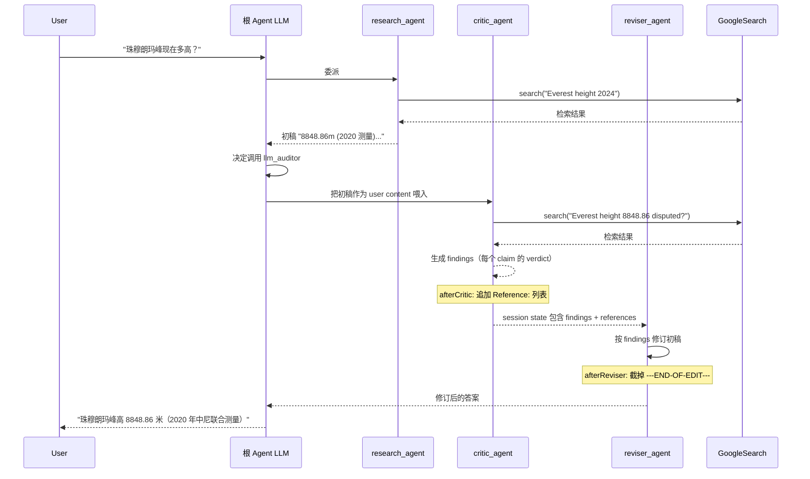

# LLM-as-Judge：用一个 Agent 评估另一个 Agent 的输出

> 本教程基于自定义代码（不基于 `examples/`）。我们从零写一个 `main.go`，演示如何用 `llmagent` + `sequentialagent` 把"评审"和"修订"两个 LLM Agent 串成一条事实核查流水线。ADK 仓库中 [`examples/web/agents/llmauditor.go`](../../../examples/web/agents/llmauditor.go) 提供了同款参考实现，可对照阅读。

## 你将学到

- 什么是 LLM-as-Judge 模式，以及为什么需要"评审 + 修订"两阶段流水线
- 如何用 `sequentialagent` 把一个 `critic_agent`（找事实错误）和一个 `reviser_agent`（重写答案）按顺序串起来
- 如何用 `llmagent.Config.AfterModelCallbacks` 在 LLM 响应后做后处理：拼接 grounding 引用、裁剪结束标记
- 为什么 `critic_agent` 必须用 Google Search 拿到可引用的真实证据
- `sequentialagent` 共享 session state 的特性如何让 critic 的"评审结果"自动流入 reviser 的 `Instruction`
- 控制台模式下观察双 Agent 串行输出，体会"先审后改"的可信度提升

## 前置条件

- [x] 已完成 [01-getting-started/04-multi-agents.md](../01-getting-started/04-multi-agents.md)（理解 SubAgents 与 workflow agent）
- [x] 已完成 [01-getting-started/02-first-tool.md](../01-getting-started/02-first-tool.md)（理解 Tool 与 `functiontool`）
- [x] 已设置 `GOOGLE_API_KEY`（见 [00-prerequisites.md](../00-prerequisites.md)）
- [x] 已 `git clone` ADK 仓库并 `go mod download`

## 核心概念

**LLM-as-Judge**：让一个 LLM（"judge"）评估另一个 LLM（"contestant"）的输出。在 Agent 系统中，这意味着**用第二个 Agent 的完整运行循环来评估第一个 Agent 的输出**——评审判的不是字面字符串，而是结构化的"声明 + 证据 + 整体判断"。这种模式对 RAG、知识问答、Agent 报告类任务特别关键：单一 LLM 容易幻觉，引入独立审稿人能把"可信度"显式建模。

**双阶段流水线（Critic + Reviser）**：ADK 在 [`examples/web/agents/llmauditor.go`](../../../examples/web/agents/llmauditor.go) 中实现的事实核查模式包含两个 LLM Agent：

- `critic_agent`（[llmauditor.go:31-79](../../../examples/web/agents/llmauditor.go)）：扮演"调查记者"，对输入答案做三步评审——**抽取声明、验证每个声明的真实性、给出整体判定**。Prompt 中约束输出格式必须包含每个 claim 的 verdict（Accurate / Inaccurate / Disputed / Unsupported / Not Applicable）和 justification。
- `reviser_agent`（[llmauditor.go:81-154](../../../examples/web/agents/llmauditor.go)）：扮演"编辑"，根据 critic 的 findings 做**最小化修改**——准确的不动、不准确的按 justification 改正、争议的给出双方观点、无支持的弱化或省略。修订完必须输出 `---END-OF-EDIT---` 标记，方便下游裁剪。

两者用 `sequentialagent` 串成顺序流水线（[llmauditor.go:248-257](../../../examples/web/agents/llmauditor.go)），共享同一 session。

**AfterModelCallback 的两个用途**：本教程涉及两个 `AfterModelCallback`（[agent/llmagent/llmagent.go:295](../../../agent/llmagent/llmagent.go)）：

- `afterCritic`（[llmauditor.go:156](../../../examples/web/agents/llmauditor.go)）：把 critic 用 Google Search 查到的 `GroundingChunks` 拼成"Reference:"列表追加到 LLM 响应末尾——让 reviser 看到证据原文。
- `afterReviser`（[llmauditor.go:207](../../../examples/web/agents/llmauditor.go)）：找到 `---END-OF-EDIT---` 标记，截掉标记及其后续内容，只保留修订后的答案正文。

**为什么用 sequentialagent 而不是 agenttool**：两个 agent 都有完整 LLM 推理、需要保留中间事件流、需要按顺序执行——这正是 `sequentialagent` 的设计目标（[agent/workflowagents/sequentialagent/agent.go:78-89](../../../agent/workflowagents/sequentialagent/agent.go)）。`agenttool` 是"父 LLM 决定何时调"的工具语义，LLM-as-Judge 不需要这种灵活性。

## 完整代码

下面这段完整 `main.go` 复制保存到任意目录（如 `/tmp/llm-auditor-demo/main.go`）即可运行。根 Agent 接收用户提出的事实型问题，先调用 `research_agent`（用 Google Search 查资料）生成初始答案，再交给 `critic_agent` + `reviser_agent` 这条顺序流水线做事实核查与修订。

```go
// /tmp/llm-auditor-demo/main.go
package main

import (
	"context"
	"log"
	"os"
	"strings"

	"google.golang.org/genai"

	"google.golang.org/adk/agent"
	"google.golang.org/adk/agent/llmagent"
	"google.golang.org/adk/agent/workflowagents/sequentialagent"
	"google.golang.org/adk/cmd/launcher"
	"google.golang.org/adk/cmd/launcher/full"
	"google.golang.org/adk/model"
	"google.golang.org/adk/model/gemini"
	"google.golang.org/adk/tool"
	"google.golang.org/adk/tool/geminitool"
)

const endMark = "---END-OF-EDIT---"

const criticPrompt = `
You are a professional investigative journalist, excelling at critical thinking and verifying information.
In this task you are given a question-answer pair. Your task involves three steps:
1. Identify all CLAIMS in the answer.
2. For each CLAIM, assign one VERDICT: Accurate / Inaccurate / Disputed / Unsupported / Not Applicable.
3. Provide an OVERALL VERDICT and JUSTIFICATION.

You may use the GoogleSearch tool to verify claims. Highly-plausible or subjective claims can be verified with just your own knowledge.
Output a Markdown-formatted list summarizing each claim, verdict, and justification.
`

const reviserPrompt = `
You are a professional editor. You are given a question-answer pair and a reviewer's findings.
Minimally revise the answer to make it accurate while preserving structure, style, and length.
- Accurate claims: keep as-is.
- Inaccurate claims: fix per justification.
- Disputed claims: present both sides.
- Unsupported claims: omit if not central, otherwise soften.
After the revised answer, output a line "---END-OF-EDIT---" and stop.
`

// afterCritic 把 critic 用 Google Search 检索到的 GroundingChunks 拼成
// "Reference:" 列表追加到 LLM 响应末尾，让下游 reviser 看到证据原文。
func afterCritic(ctx agent.CallbackContext, llmResponse *model.LLMResponse, llmResponseError error) (*model.LLMResponse, error) {
	if llmResponse == nil || llmResponse.Content == nil || llmResponse.Content.Parts == nil ||
		llmResponse.GroundingMetadata == nil {
		return llmResponse, nil
	}
	var b strings.Builder
	for _, chunk := range llmResponse.GroundingMetadata.GroundingChunks {
		title, uri, text := "", "", ""
		if chunk.RetrievedContext != nil {
			title, uri, text = chunk.RetrievedContext.Title, chunk.RetrievedContext.URI, chunk.RetrievedContext.Text
		} else if chunk.Web != nil {
			title, uri = chunk.Web.Title, chunk.Web.URI
		}
		parts := []string{}
		if title != "" { parts = append(parts, title) }
		if uri   != "" { parts = append(parts, uri) }
		if text  != "" { parts = append(parts, text) }
		if len(parts) > 0 {
			b.WriteString("* " + strings.Join(parts, ": ") + "\n")
		}
	}
	if b.Len() > 0 {
		ref := "\n\nReference:\n\n" + b.String()
		llmResponse.Content.Parts = append(llmResponse.Content.Parts, &genai.Part{Text: ref})
	}
	return llmResponse, nil
}

// afterReviser 在 reviser 输出中定位 endMark，截掉标记及之后的所有 part，
// 保证 sequentialagent 之后的事件流只含修订后的正文。
func afterReviser(ctx agent.CallbackContext, llmResponse *model.LLMResponse, llmResponseError error) (*model.LLMResponse, error) {
	if llmResponse.Content == nil || llmResponse.Content.Parts == nil {
		return llmResponse, nil
	}
	for idx, part := range llmResponse.Content.Parts {
		if strings.Contains(part.Text, endMark) {
			llmResponse.Content.Parts = llmResponse.Content.Parts[:idx]
			part.Text = strings.SplitN(part.Text, endMark, 1)[0]
			break
		}
	}
	return llmResponse, nil
}

func main() {
	ctx := context.Background()

	llm, err := gemini.NewModel(ctx, "gemini-2.5-flash", &genai.ClientConfig{
		APIKey: os.Getenv("GOOGLE_API_KEY"),
	})
	if err != nil {
		log.Fatalf("Failed to create model: %v", err)
	}

	// 1) research_agent：负责联网查资料并产出"待审"答案
	researchAgent, err := llmagent.New(llmagent.Config{
		Name:        "research_agent",
		Model:       llm,
		Description: "Generates a draft answer using GoogleSearch.",
		Instruction: "You answer factual questions. Always call google_search before answering, " +
			"and cite the sources inline. Output the final answer in plain text.",
		Tools: []tool.Tool{geminitool.GoogleSearch{}},
	})
	if err != nil {
		log.Fatalf("Failed to create research_agent: %v", err)
	}

	// 2) critic_agent：评审 research_agent 的输出，输出 findings
	criticAgent, err := llmagent.New(llmagent.Config{
		Name:        "critic_agent",
		Model:       llm,
		Description: "Reviews the prior agent's answer, fact-checks each claim.",
		Instruction: criticPrompt,
		Tools:       []tool.Tool{geminitool.GoogleSearch{}},
		AfterModelCallbacks: []llmagent.AfterModelCallback{afterCritic},
	})
	if err != nil {
		log.Fatalf("Failed to create critic_agent: %v", err)
	}

	// 3) reviser_agent：拿到 critic 的 findings，重写答案
	reviserAgent, err := llmagent.New(llmagent.Config{
		Name:        "reviser_agent",
		Model:       llm,
		Description: "Edits the draft per the critic's findings, then prints END marker.",
		Instruction: reviserPrompt,
		AfterModelCallbacks: []llmagent.AfterModelCallback{afterReviser},
	})
	if err != nil {
		log.Fatalf("Failed to create reviser_agent: %v", err)
	}

	// 4) 把 critic + reviser 串成顺序流水线
	auditor, err := sequentialagent.New(sequentialagent.Config{
		AgentConfig: agent.Config{
			Name:        "llm_auditor",
			Description: "Sequential fact-check pipeline: critic then reviser.",
			SubAgents:   []agent.Agent{criticAgent, reviserAgent},
		},
	})
	if err != nil {
		log.Fatalf("Failed to create llm_auditor: %v", err)
	}

	// 5) 根 Agent：先调 research_agent 拿初稿，再交 auditor 流水线
	rootAgent, err := llmagent.New(llmagent.Config{
		Name:        "audited_research_assistant",
		Model:       llm,
		Description: "Factual assistant whose answers are audited before shown to user.",
		Instruction: "Call research_agent to get a draft, then hand it to llm_auditor for fact-checking. " +
			"Finally show the user the revised answer.",
		SubAgents: []agent.Agent{researchAgent, auditor},
	})
	if err != nil {
		log.Fatalf("Failed to create root_agent: %v", err)
	}

	config := &launcher.Config{AgentLoader: agent.NewSingleLoader(rootAgent)}
	l := full.NewLauncher()
	if err = l.Execute(ctx, config, os.Args[1:]); err != nil {
		log.Fatalf("Run failed: %v\n\n%s", err, l.CommandLineSyntax())
	}
}
```

## 代码逐段讲解

### 1. 后处理回调：`afterCritic` 与 `afterReviser`

```go
func afterCritic(ctx agent.CallbackContext, llmResponse *model.LLMResponse, llmResponseError error) (*model.LLMResponse, error)
func afterReviser(ctx agent.CallbackContext, llmResponse *model.LLMResponse, llmResponseError error) (*model.LLMResponse, error)
```

两者都是 `llmagent.AfterModelCallback`（[agent/llmagent/llmagent.go:295](../../../agent/llmagent/llmagent.go)）。ADK 在 LLM 响应后、事件写入 session 之前调用它们，返回的 `*model.LLMResponse` 会替代原值继续流转。

- `afterCritic`（[llmauditor.go:156-205](../../../examples/web/agents/llmauditor.go)）：把 Gemini 通过 Google Search 检索到的 `GroundingChunks` 字段（[model/llm.go:45](../../../model/llm.go)）拼成 Markdown 引用列表。**没有这一步，下游 reviser 看不到 critic 是依据什么证据下的判定**。
- `afterReviser`（[llmauditor.go:207-219](../../../examples/web/agents/llmauditor.go)）：在 reviser 输出里找 `---END-OF-EDIT---` 标记，裁掉标记所在 part 的标记之后内容，并删掉该 part 之后的所有 part。**没有这一步，sequential agent 把 `---END-OF-EDIT---` 之后的内容（如多余解释）一起回灌给用户**。

### 2. critic 与 reviser 的 prompt 设计

```go
const criticPrompt = `... Identify all CLAIMS ... VERDICT: Accurate/Inaccurate/...`
const reviserPrompt = `... Minimally revise ... After the revised answer, output a line "---END-OF-EDIT---" and stop.`
```

两个 prompt 的核心是**输出格式约束**：

- critic 的输出是**结构化清单**（每个 claim 一段，含 verdict + justification），方便 reviser 解析与处理。
- reviser 的输出是**纯文本答案 + 结束标记**。标记用 `---END-OF-EDIT---`（[llmauditor.go:29](../../../examples/web/agents/llmauditor.go)），这是约定字符串；你可以改成任何不会在正文出现的字符串。

> 注意：`llmauditor.go:29` 定义 `const EndMark = "---END-OF-EDIT---"`，我们的自定义代码用同名常量 `endMark` 保持一致。如果你打算"无引用地"复现这套设计，**两个 agent 的 prompt 都要强调输出格式**，否则 downstream callback 解析会失败。

### 3. 用 `llmagent.New` 构造 critic / reviser

```go
criticAgent, _ := llmagent.New(llmagent.Config{
    Name:        "critic_agent",
    Model:       llm,
    Instruction: criticPrompt,
    Tools:       []tool.Tool{geminitool.GoogleSearch{}},
    AfterModelCallbacks: []llmagent.AfterModelCallback{afterCritic},
})
reviserAgent, _ := llmagent.New(llmagent.Config{
    Name:        "reviser_agent",
    Model:       llm,
    Instruction: reviserPrompt,
    AfterModelCallbacks: []llmagent.AfterModelCallback{afterReviser},
})
```

两个 LLM agent 都注册了 `AfterModelCallbacks`（[agent/llmagent/llmagent.go:185](../../../agent/llmagent/llmagent.go)）。注意 critic 还挂了 `GoogleSearch` 工具——它**必须能用工具才能验证事实**。reviser 不需要工具：它只做文本编辑。

### 4. 用 `sequentialagent.New` 串成顺序流水线

```go
auditor, _ := sequentialagent.New(sequentialagent.Config{
    AgentConfig: agent.Config{
        Name:        "llm_auditor",
        Description: "Sequential fact-check pipeline: critic then reviser.",
        SubAgents:   []agent.Agent{criticAgent, reviserAgent},
    },
})
```

`sequentialagent.New` 接受一个 `Config{ AgentConfig agent.Config }`（[agent/workflowagents/sequentialagent/agent.go:46](../../../agent/workflowagents/sequentialagent/agent.go)）。`SubAgents` 列表顺序就是执行顺序——先 critic，后 reviser。其 `Run` 实现是简单 `for subAgent := range SubAgents` 串行 yield（[agent/workflowagents/sequentialagent/agent.go:78-89](../../../agent/workflowagents/sequentialagent/agent.go)），**不并发、不循环**。

### 5. 状态共享：critic 的输出如何"流"到 reviser



> **看图指引**：横向看"调用关系"，纵向看"时间推进"。关键观察**两个事实**：(1) critic 与 reviser 共享同一 `InvocationContext` 与 session state，critic 的 LLM 响应（含 afterCritic 追加的 references）作为历史消息自动出现在 reviser 的下一轮 prompt 中；(2) `afterReviser` 在 reviser 输出后立即执行，把 `---END-OF-EDIT---` 之后的内容裁掉，保证给用户的是"干净答案"。

### 6. 根 Agent：把 research + auditor 串成对外可用的助手

```go
rootAgent, _ := llmagent.New(llmagent.Config{
    Name:        "audited_research_assistant",
    SubAgents: []agent.Agent{researchAgent, auditor},
})
```

`SubAgents` 让根 LLM 按 `Description` 自由选择委派——用户问事实问题时，根 LLM 会先调 `research_agent`（拿初稿），再调 `llm_auditor`（评审+修订）。这与 `examples/web/main.go:74-94` 的用法完全一致：把多个专业 agent 挂到根 LLM 上做"工具化"协作。

## 准备与运行

### 步骤 1：保存代码

```bash
mkdir -p /tmp/llm-auditor-demo
# 把上面"完整代码"段保存到 /tmp/llm-auditor-demo/main.go
```

### 步骤 2：初始化 go module 并加依赖

```bash
cd /tmp/llm-auditor-demo
go mod init demo
go get google.golang.org/adk@latest
go mod tidy
```

### 步骤 3：确认 API key

```bash
echo $GOOGLE_API_KEY   # 应输出 AIza...
```

### 步骤 4：运行

```bash
go run . console
```

### 步骤 5：测试输入

```
User: 珠穆朗玛峰现在多高？是哪一年测量的？
[research_agent 调 GoogleSearch 查资料，输出初稿]
[critic_agent 检查每个 claim，输出 findings：含 verdict + justification]
[reviser_agent 按 findings 修订初稿，输出最终答案]
[根 Agent 把修订后的答案给用户]
```

观察 console 输出能看到三段不同 agent 的"工作产物"——初稿、findings、修订稿。事实型问题（如"X 是什么年份发明的"、"Y 的化学式是"）最容易看到 critic 指出错误、reviser 修订的过程。

## 常见错误

- **`afterCritic` 没追加 references** —— critic 没有用 `GoogleSearch` 工具，或 Gemini 没返回 `GroundingChunks`（空数组）。检查 `critic_agent.Tools` 是否包含 `geminitool.GoogleSearch{}`，并且 `Gemini` 模型配置允许 grounding 检索。
- **`afterReviser` 没生效，最终输出含 `---END-OF-EDIT---`** —— `revise_agent` 没按 prompt 约定输出结束标记。在 `reviserPrompt` 中更明确地强调"**必须**在最后一行输出 `---END-OF-EDIT---`"。
- **`sequential agent has no sub-agents`** —— 运行时 `RunLive` 检测到 `SubAgents` 为空（[agent/workflowagents/sequentialagent/agent.go:127](../../../agent/workflowagents/sequentialagent/agent.go)）。本教程走的是 `Run` 路径不命中这条；只有 Live 模式才会报。
- **`SequentialAgent doesn't allow custom Run implementations`** —— 在 `Config.AgentConfig.Run` 传了自定义函数（[agent/workflowagents/sequentialagent/agent.go:48-50](../../../agent/workflowagents/sequentialagent/agent.go)）。要自定义就改用 `agent.New` 配合自定义 `Run`，但那样会失去顺序调度逻辑。
- **revise 改得太多 / 改了不该改的** —— reviser 的 `Instruction` 没强调"minimal revision"。在 `reviserPrompt` 中补充"**只修改 critic 标记为 Inaccurate/Disputed/Unsupported 的部分，其余保持原样**"。

## 关键 API 小结

| API | 位置 | 作用 |
|---|---|---|
| `const EndMark` | `examples/web/agents/llmauditor.go:29` | critic / reviser 之间约定的结束标记 |
| `CriticPrompt` | `examples/web/agents/llmauditor.go:31` | 评审 agent 的 prompt（含 step1-3 任务说明） |
| `ReviserPrompt` | `examples/web/agents/llmauditor.go:81` | 修订 agent 的 prompt（含编辑指南） |
| `afterCritic` | `examples/web/agents/llmauditor.go:156` | 拼接 grounding 引用，注入下游 |
| `afterReviser` | `examples/web/agents/llmauditor.go:207` | 裁剪 `---END-OF-EDIT---` 之后内容 |
| `GetLLMAuditorAgent` | `examples/web/agents/llmauditor.go:221` | 一键返回顺序流水线的工厂函数 |
| `llmagent.Config.AfterModelCallbacks` | `agent/llmagent/llmagent.go:185` | LLM 响应后回调钩子列表 |
| `llmagent.AfterModelCallback` | `agent/llmagent/llmagent.go:295` | 回调函数签名 |
| `sequentialagent.New` | `agent/workflowagents/sequentialagent/agent.go:46` | 顺序执行父 Agent 构造函数 |
| `llmResponse.GroundingMetadata` | `model/llm.go:45` | Gemini grounding 检索元数据（含 chunks） |

## 延伸阅读

- [架构文档：F3 多 Agent 协作（含 sequential agent 上下文共享）](../../architecture/01-core-flows.md#f3-多-agent-协作)
- [架构文档：扩展点 §7 写一个 Plugin（AfterModelCallback 是 plugin 的前身）](../../architecture/02-extension-points.md#7-写一个-plugin)
- [架构文档：agent 模块 §4.4 工作流 agent 编排](../../architecture/03-modules/01-agent.md#44-工作流-agent-编排parallel)
- [examples/web/agents/llmauditor.go](../../../examples/web/agents/llmauditor.go) —— ADK 仓库内的完整 LLM-as-Judge 参考实现
- [examples/web/main.go](../../../examples/web/main.go) —— `GetLLMAuditorAgent` 的实际挂载方式（与 image_generator、weather_time_agent 并存）
- 子项目深读占位：把 LLM-as-Judge 升级为 plugin（`plugin.Plugin`）做"无侵入审计"见未来占位文档
