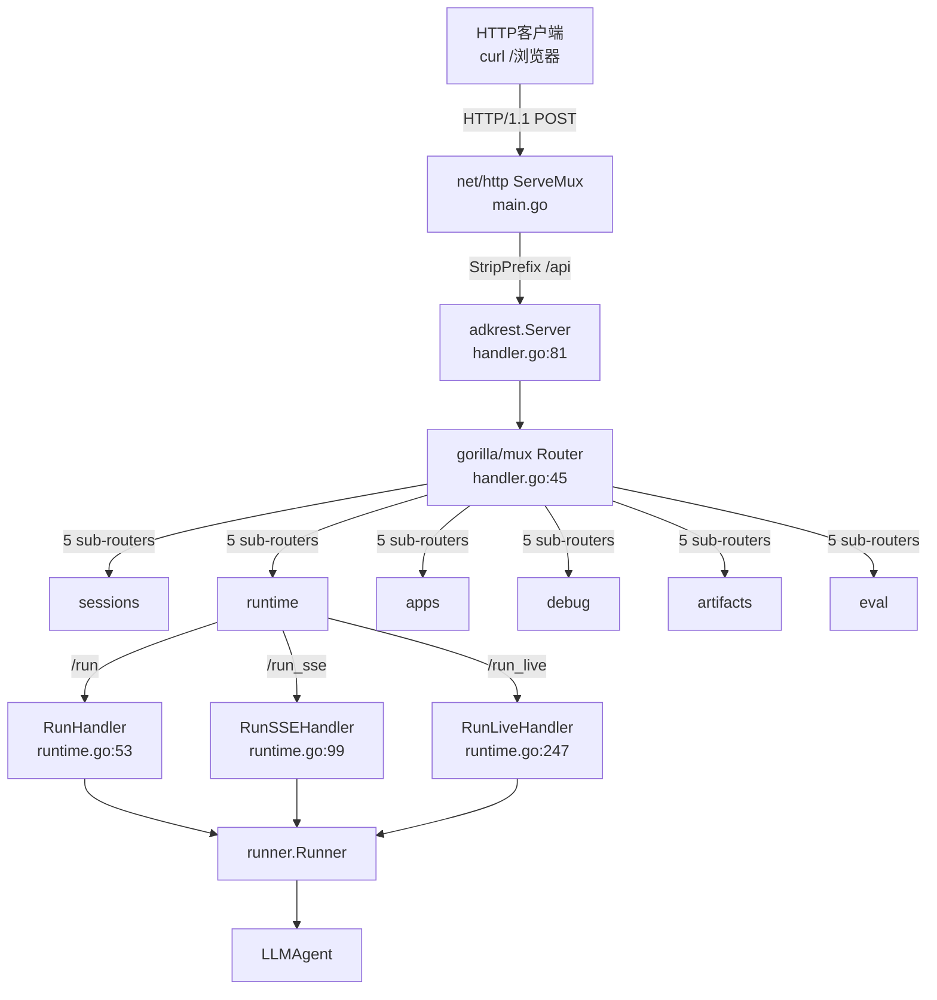
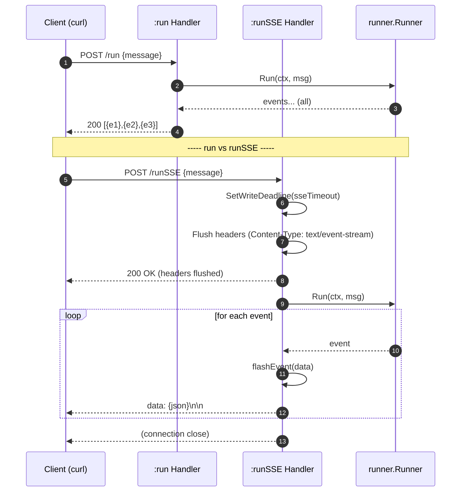

# REST Server：把 Agent暴露为 HTTP API

> 本教程基于 [`examples/rest/main.go`](../../../examples/rest/main.go)。它从 **server内部架构**视角（controllers + routers + handler 三层）展开01-getting-started/05-run-as-server.md 的内容，让你理解"ADK怎么把 Agent变成 HTTP 服务"。

## 你将学到

- `adkrest.NewServer` 的"三层装配"：handler.go顶层组装 → controllers 实现业务 → routers暴露 URL
- `ServerConfig`7 个字段各自的语义与缺省行为
-6 个子路由（sessions、runtime、apps、debug、artifacts、eval）的 URL 前缀与用途
- `:run` 与 `:runSSE` 的差异：非流式返回事件数组 vs 流式逐条推送
- SSE协议在 `runtime.go:99` 的实现细节：`SetWriteDeadline` → `Flush`头部 →逐事件 `flashEvent`
- 如何把 `*Server`挂到自己 `net/http.ServeMux` 上并加健康检查

## 前置条件

- [x] 已完成 [01-getting-started/05-run-as-server.md](../01-getting-started/05-run-as-server.md)（对 REST服务的"使用层"已经熟悉）
- [x] 已设置 `GOOGLE_API_KEY`（见 [00-prerequisites.md](../00-prerequisites.md)）
- [x] 本机可访问 `generativelanguage.googleapis.com`
- [x] 已 `git clone` ADK仓库并 `go mod download`
- [x] 已安装 `curl` 与 `jq`

##核心概念

**REST server 是一个组装体**，不是一个单体类。`adkrest.NewServer`（[`server/adkrest/handler.go:37`](../../../server/adkrest/handler.go)）只做一件事：把若干个"业务 controller"包装成 gorilla/mux路由，再吐出一个实现 `http.Handler` 接口的 `*Server`（[`server/adkrest/handler.go:81`](../../../server/adkrest/handler.go)）。`ServeHTTP` 在 [`server/adkrest/handler.go:87`](../../../server/adkrest/handler.go)只是一行 `s.router.ServeHTTP(w, r)`，所有复杂逻辑都在6 个 controller 里。

**三层结构**：顶层 [`handler.go`](../../../server/adkrest/handler.go)负责"用什么配置装配出哪些 controller"；中层 [`controllers/`](../../../server/adkrest/controllers/)负责"把 HTTP 请求翻译成 runner 调用"；底层 [`internal/routers/`](../../../server/adkrest/internal/routers/)负责"URL模式怎么匹配到 controller 方法"。理解这三层之后，你既能在不知道 ADK协议的情况下读懂 `curl` 输出，也能定位"为什么我请求的 URL报404"。

**SSE（Server-Sent Events）流式协议**：服务端先发响应头 `Content-Type: text/event-stream` 并立刻 `Flush`；之后每条事件写成 `data: <json>\n\n` 的字节流。客户端（`curl -N`、浏览器 `EventSource`）按行读取，无需维护 WebSocket。`runtime.go:99` 的 `RunSSEHandler` 把这个模式固化为4步：设定写超时 → 解码请求体 → Flush头部 →逐事件 flush（[`server/adkrest/controllers/runtime.go:99`](../../../server/adkrest/controllers/runtime.go)）。

整体结构如下图：



**看图指引**：

- `User` → `Mux` → `Srv` → `Router` 是请求路径上的4 个节点；前三步在 `examples/rest/main.go` 里，后一步在 `handler.go`内部。
- `Router` 把 URL派发给6 个子 router；`runtime` 子 router暴露3 个端点：`/run`（非流式）、`/run_sse`（SSE 流式）、`/run_live`（WebSocket双向）。
-3 个 runtime端点最终都汇聚到同一个 `runner.Runner`，再调用 `LLMAgent` ——也就是说，HTTP 层只是"包装器"，真正的业务逻辑与控制台模式一致。

##完整代码

完整源码在 [`examples/rest/main.go`](../../../examples/rest/main.go)（约95 行）：

```go
// examples/rest/main.go
package main

import (
	"context"
	"log"
	"net/http"
	"os"
	"time"

	"google.golang.org/genai"

	"google.golang.org/adk/agent"
	"google.golang.org/adk/agent/llmagent"
	"google.golang.org/adk/model/gemini"
	"google.golang.org/adk/server/adkrest"
	"google.golang.org/adk/session"
	"google.golang.org/adk/tool"
	"google.golang.org/adk/tool/geminitool"
)

func main() {
	ctx := context.Background()

	// Create a Gemini model
	model, err := gemini.NewModel(ctx, "gemini-3.1-flash-lite", &genai.ClientConfig{
		APIKey: os.Getenv("GOOGLE_API_KEY"),
	})
	if err != nil {
		log.Fatalf("Failed to create model: %v", err)
	}

	// Create an agent
	a, err := llmagent.New(llmagent.Config{
		Name: "weather_time_agent",
		Model: model,
		Description: "Agent to answer questions about the time and weather in a city.",
		Instruction: "I can answer your questions about the time and weather in a city.",
		Tools: []tool.Tool{
			geminitool.GoogleSearch{},
		},
	})
	if err != nil {
		log.Fatalf("Failed to create agent: %v", err)
	}

	// Configure the ADK REST API Server
	restServer, err := adkrest.NewServer(adkrest.ServerConfig{
		AgentLoader: agent.NewSingleLoader(a),
		SessionService: session.InMemoryService(),
		SSEWriteTimeout:120 * time.Second,
	})
	if err != nil {
		log.Fatalf("Failed to create REST API server: %v", err)
	}

	// Create a standard net/http ServeMux
	mux := http.NewServeMux()

	// Register the API handler at the /api/ path
	// You can use any HTTP server or router here - not tied to gorilla/mux
	mux.Handle("/api/", http.StripPrefix("/api", restServer))

	// Add a simple health check endpoint
	mux.HandleFunc("/health", func(w http.ResponseWriter, r *http.Request) {
		w.WriteHeader(http.StatusOK)
		if _, err := w.Write([]byte("OK")); err != nil {
			log.Printf("Failed to write response: %v", err)
		}
	})

	// Start the server
	log.Println("Starting server on :8080")
	log.Println("API available at http://localhost:8080/api/")
	log.Println("Health check at http://localhost:8080/health")

	if err := http.ListenAndServe(":8080", mux); err != nil {
		log.Fatalf("Server failed: %v", err)
	}
}
```

## 代码逐段讲解

###1. 创建 Model 与 Agent

`gemini.NewModel` 与 `llmagent.New` 与 [01-getting-started/01-hello-world.md](../01-getting-started/01-hello-world.md) 一致。要点：`Name: "weather_time_agent"` 这个名字会出现在 URL `/apps/weather_time_agent/...` 里，所以 URL片段必须严格匹配。

###2. `adkrest.ServerConfig`7字段详解

```go
restServer, err := adkrest.NewServer(adkrest.ServerConfig{
	AgentLoader: agent.NewSingleLoader(a),
	SessionService: session.InMemoryService(),
	SSEWriteTimeout:120 * time.Second,
})
```

`ServerConfig` 定义在 [`server/adkrest/handler.go:62`](../../../server/adkrest/handler.go)，共7 个字段：

|字段 | 类型 | 是否必填 |缺省行为 |
|---|---|---|---|
| `AgentLoader` | `agent.Loader` | **是** | `nil` 时 `LoadAgent` 直接返回 error |
| `SessionService` | `session.Service` | **是** | `nil` 时 `:run` 在 `validateSessionExists`阶段404 |
| `MemoryService` | `memory.Service` | 否 | `nil` 时 LLM看不到历史记忆 |
| `ArtifactService` | `artifact.Service` | 否 | `nil` 时 agent 无法存/取附件 |
| `SSEWriteTimeout` | `time.Duration` | 否 | `0` 表示无超时（但反向代理可能60s断） |
| `PluginConfig` | `runner.PluginConfig` | 否 | `nil` 时无插件拦截 |
| `DebugConfig` | `DebugTelemetryConfig` | 否 | `TraceCapacity <=0`走默认值10_000 |

`NewServer`内部走完7字段后调用 `setupRouter(router, ...)`（[`server/adkrest/handler.go:48`](../../../server/adkrest/handler.go)），把6 个子 router挂到 `mux.NewRouter().StrictSlash(true)` 上。

###3.6 个子路由到底暴露了哪些 URL

`handler.go:46`附近传入 `setupRouter` 的6 个 router（[`server/adkrest/handler.go:48`](../../../server/adkrest/handler.go)）按 URL 前缀划分：

| 子 router |控制器 |关键 URL |用途 |
|---|---|---|---|
| `SessionsAPIRouter` | `SessionsAPIController` | `POST /apps/{app}/users/{u}/sessions` | 创建会话 |
| | | `GET /apps/{app}/users/{u}/sessions/{sid}` |查会话 |
| | | `DELETE /apps/{app}/users/{u}/sessions/{sid}` |删会话 |
| `RuntimeAPIRouter` | `RuntimeAPIController` | `POST /apps/{app}/users/{u}/sessions/{sid}/run` | 非流式执行 |
| | | `POST /apps/{app}/users/{u}/sessions/{sid}/run_sse` | SSE 流式执行 |
| | | `GET /apps/{app}/users/{u}/sessions/{sid}/run_live` | WebSocket双向 |
| `AppsAPIRouter` | `AppsAPIController` | `GET /list-apps` |列出已注册 agent |
| `DebugAPIRouter` | `DebugAPIController` | `GET /debug/trace/{trace_id}` | 取最近一次 trace |
| `ArtifactsAPIRouter` | `ArtifactsAPIController` | `GET/POST /apps/{app}/users/{u}/sessions/{sid}/artifacts/{name}` |附件 CRUD |
| `EvalAPIRouter` | `EvalAPIController` | （占位） |未来评估接口 |

> **URL提示**：源码里 [`internal/routers/runtime.go:39`](../../../server/adkrest/internal/routers/runtime.go) 注册的是 `/run`、`/run_sse`、`/run_live`；但因 `mux.NewRouter().StrictSlash(true)` + SessionsAPIRouter 用 `/{session_id}` 占位，gorilla/mux 会自动把 `/apps/.../sessions/s1:run` 中的 `:run`视作路径后缀（这是 Google ADK Python端沿用的命名风格，curl 调用时直接照抄即可）。

###4. 把 `*Server`挂到任意 `ServeMux`

```go
mux := http.NewServeMux()
mux.Handle("/api/", http.StripPrefix("/api", restServer))
mux.HandleFunc("/health", func(w http.ResponseWriter, r *http.Request) {
	w.WriteHeader(http.StatusOK)
	if _, err := w.Write([]byte("OK")); err != nil {
		log.Printf("Failed to write response: %v", err)
	}
})
```

`restServer`实现了 `http.Handler`（`ServeHTTP` 在 [`server/adkrest/handler.go:87`](../../../server/adkrest/handler.go)），所以可以挂到任何兼容 Go 标准库的路由器（chi、gin、gorilla/mux、echo 等）。`http.StripPrefix("/api", restServer)` 把所有 `/api/*`去掉 `/api` 后再转发给 ADK REST内部路由。`/health` 是顺手加的健康检查端点，云上负载均衡器探活用。

###5. `:run` vs `:runSSE` ——两条 runtime路径

**非流式 `:run`**：实现是 [`server/adkrest/controllers/runtime.go:53`](../../../server/adkrest/controllers/runtime.go) 的 `RunHandler`。它先调 `decodeRequestBody`解析 JSON，再 `c.runAgent`同步拉完所有事件，最后 `EncodeJSONResponse(events, http.StatusOK, rw)` 把**整个事件数组**一次返回。客户端拿到的是完整数组，适合"问完等结果"的批处理场景。

**流式 `:runSSE`**：实现是 [`server/adkrest/controllers/runtime.go:99`](../../../server/adkrest/controllers/runtime.go) 的 `RunSSEHandler`。它的关键4步在源码注释里写得很清楚：

1. `rc := http.NewResponseController(rw); rc.SetWriteDeadline(time.Now().Add(c.sseTimeout))` ——覆盖 server 全局超时，给流式响应"独立的写超时"（[`runtime.go:101`](../../../server/adkrest/controllers/runtime.go)）。
2. 解码请求体、调 `validateSessionExists`、构造 `runner.Runner`（[`runtime.go:109`](../../../server/adkrest/controllers/runtime.go)）。
3. **Flush头部**：`rw.Header().Set("Content-Type", "text/event-stream")` + `Cache-Control: no-cache` + `Connection: keep-alive`，再 `rc.Flush()`，让客户端立刻收到响应头（[`runtime.go:129`](../../../server/adkrest/controllers/runtime.go)）。
4.逐事件循环：`flashEvent` 把单个事件写成 `data: <json>\n\n` 并 `Flush`（[`runtime.go:184`](../../../server/adkrest/controllers/runtime.go)）。

错误事件走另一条路径 `flashErrorEvent`（[`runtime.go:171`](../../../server/adkrest/controllers/runtime.go)），它以 `event: error\n`开头而不是 `data:`，这样浏览器 `EventSource` 可以用 `addEventListener('error', ...)`单独处理。

**两条路径的对比时序图**：



**看图指引**：

- 左半 `:run`：客户端**一次性**拿到完整事件数组；适合"批处理 /一次性问答"。
- 右半 `:runSSE`：客户端**按行**接收 `data:`帧；中间任何一刻都能看到部分输出——这正是"边思考边吐字"的用户体验。
-关键差异在**第6步**——SSE 在调用 `Run`之前就把 headers flush 了，让客户端立即知道连接已建立、不会超时断开。

###6.启动 HTTP 服务

```go
log.Println("Starting server on :8080")
log.Println("API available at http://localhost:8080/api/")
log.Println("Health check at http://localhost:8080/health")

if err := http.ListenAndServe(":8080", mux); err != nil {
	log.Fatalf("Server failed: %v", err)
}
```

标准的 `net/http`启动方式。改端口只需把 `:8080`换成 `:9090`。如果要 TLS，替换为 `http.ListenAndServeTLS(":443", "cert.pem", "key.pem", mux)`即可。

##准备与运行

###步骤1：确认 API key

```bash
echo $GOOGLE_API_KEY # 应输出 AIza...
```

未设置时回到 [00-prerequisites.md §3](../00-prerequisites.md) 获取。

###步骤2：启动服务

```bash
go run ./examples/rest
```

成功时日志末尾会打印：

```
Starting server on :8080
API available at http://localhost:8080/api/
Health check at http://localhost:8080/health
```

###步骤3：测试 `/health` 与 `/list-apps`

```bash
curl -s http://localhost:8080/health
#期望：OK

curl -s http://localhost:8080/api/list-apps | jq .
#期望：[{"name":"weather_time_agent","description":"Agent to answer..."}]
```

###步骤4：创建 session 并发起 `:run`

```bash
APP=weather_time_agent
USER=u1
SID=s1

# 先创建会话（也可以省略 ID 让服务器自动生成）
curl -s -X POST http://localhost:8080/api/apps/$APP/users/$USER/sessions \
 -H "Content-Type: application/json" -d '{}'

curl -s -X POST http://localhost:8080/api/apps/$APP/users/$USER/sessions/$SID:run \
 -H "Content-Type: application/json" \
 -d '{
 "appName": "'"$APP"'",
 "userId": "'"$USER"'",
 "sessionId": "'"$SID"'",
 "newMessage": {
 "role": "user",
 "parts": [{"text": "What is the weather in Tokyo?"}]
 }
 }' | jq .
```

期望：返回 JSON数组，含一条 `author=weather_time_agent` 且 `content.parts[*].text`形如 `Currently in Tokyo ...` 的事件。

###步骤5：发起 `:runSSE` 流式调用

```bash
curl -N -X POST http://localhost:8080/api/apps/$APP/users/$USER/sessions/$SID:runSSE \
 -H "Content-Type: application/json" \
 -d '{
 "appName": "'"$APP"'",
 "userId": "'"$USER"'",
 "sessionId": "'"$SID"'",
 "newMessage": {
 "role": "user",
 "parts": [{"text": "And in Paris?"}]
 }
 }'
```

`-N`关闭 curl 输出缓冲。期望：连续多行 `data: {...}`打印，agent边思考边吐事件——这是 [`runtime.go:99`](../../../server/adkrest/controllers/runtime.go) 中 `RunSSEHandler` 的行为。

###步骤6：（可选）查看 debug trace

```bash
# 在 :runSSE 调用过程中，从 X-Trace-Id响应头（或日志）拿到 trace_id
curl -s http://localhost:8080/api/debug/trace/<trace_id> | jq .
```

注意：`/debug/trace/...` 需要在 `DebugConfig`启用且 TracerProvider 已注册 SpanProcessor（[`handler.go:93`](../../../server/adkrest/handler.go)提供了 `Server.SpanProcessor()`钩子）。

##常见错误

- **`404 Not Found: .../sessions/s1:run`** —— `mux.NewRouter().StrictSlash(true)` 已开启，但 URL 必须严格按 `/apps/{app}/users/{u}/sessions/{sid}:run`形式书写，**冒号紧贴 `{sid}`**，中间不能加 `/`。参考 [03-sessions.go 注册的 pattern](../../../server/adkrest/internal/routers/sessions.go)。
- **`500: failed to create runner`** —— `AgentLoader` 没填或 `LoadAgent(appName)` 返回的 agent名字与 URL里的 `app` 不一致。检查 `llmagent.New` 的 `Name`字段是否与 URL片段完全相同。
- **`write tcp: i/o timeout`** —— `SSEWriteTimeout` 设得太小，被网关断了。在 nginx侧加 `proxy_read_timeout300s;`，或在 ADK侧把 `SSEWriteTimeout`调到 `300 * time.Second`。
- **`429 Too Many Requests` 从 Gemini 返回** ——短时间内并发 `:run`太多。Gemini1.x 系列按 RPM限流；可以加一个 `chan struct{}`限流或换更高配额 key。
- **`SSE模式下响应头200 后客户端没反应** ——排查顺序：(1) 是否在 `RunSSEHandler`之前手动 `WriteHeader`（会破坏 SSE协议）；(2) 是否漏掉 `rc.Flush()`；(3) 反向代理是否缓冲了 response body（nginx `proxy_buffering off`）。
- **`POST /run报400 failed to decode request`** —— `decodeRequestBody`用了 `DisallowUnknownFields`（[`runtime.go:240`](../../../server/adkrest/controllers/runtime.go)），请求体里多了未声明字段会被拒。常见错误：写成 `"new_message"` 而不是 `"newMessage"`。

##关键 API 小结

| API |位置 |作用 |
|---|---|---|
| `adkrest.NewServer` | [`server/adkrest/handler.go:37`](../../../server/adkrest/handler.go) |顶层装配：6 个 controller + gorilla/mux Router，返回 `*Server` |
| `adkrest.ServerConfig` | [`server/adkrest/handler.go:62`](../../../server/adkrest/handler.go) |7字段配置：`AgentLoader` / `SessionService` / `MemoryService` / `ArtifactService` / `SSEWriteTimeout` / `PluginConfig` / `DebugConfig` |
| `Server.ServeHTTP` | [`server/adkrest/handler.go:87`](../../../server/adkrest/handler.go) | `*Server` 实现 `http.Handler` 的入口，单行转发 |
| `Server.SpanProcessor` | [`server/adkrest/handler.go:93`](../../../server/adkrest/handler.go) | 返回 OpenTelemetry SpanProcessor，挂到 TracerProvider 可填充 `/debug/trace` |
| `RuntimeAPIController.RunHandler` | [`server/adkrest/controllers/runtime.go:53`](../../../server/adkrest/controllers/runtime.go) | 非流式 `:run`：解析请求 → `runner.Run` → 返回完整事件数组 |
| `RuntimeAPIController.RunSSEHandler` | [`server/adkrest/controllers/runtime.go:99`](../../../server/adkrest/controllers/runtime.go) | SSE 流式 `:runSSE`：SetWriteDeadline → Flush头部 →逐事件 flashEvent |
| `flashErrorEvent` | [`server/adkrest/controllers/runtime.go:171`](../../../server/adkrest/controllers/runtime.go) | SSE错误事件：以 `event: error\n`开头 |
| `flashEvent` | [`server/adkrest/controllers/runtime.go:184`](../../../server/adkrest/controllers/runtime.go) | SSE 单事件：`data: <json>\n\n` + Flush |
| `RuntimeAPIRouter.Routes` | [`server/adkrest/internal/routers/runtime.go:34`](../../../server/adkrest/internal/routers/runtime.go) | 注册 `/run`、`/run_sse`、`/run_live`3 个 runtime端点 |
| `SessionsAPIRouter.Routes` | [`server/adkrest/internal/routers/sessions.go:34`](../../../server/adkrest/internal/routers/sessions.go) | 注册 session CRUD5 个端点 |

##延伸阅读

-架构文档：[server 模块详情](../../architecture/03-modules/10-server.md) —— controllers + routers + handler 三层的完整职责与依赖图
-架构文档：[核心抽象一览](../../architecture/00-overview.md#3-核心抽象一览) ——理解 `Agent` / `Runner` / `Session` / `Tool` 在 HTTP 请求中各自扮演的角色
-架构文档：[01-core-flows F4 SSE 流式响应](../../architecture/01-core-flows.md#f4-sse-流式响应)（如该章节尚未发布，先看 [`server/adkrest/controllers/runtime.go:99`](../../../server/adkrest/controllers/runtime.go) 的源码注释）
-源码：[`examples/rest/main.go`](../../../examples/rest/main.go) —— 本教程讲解的 ~95 行可运行示例
-源码：[`server/adkrest/handler.go`](../../../server/adkrest/handler.go) —— `adkrest.NewServer` + `ServerConfig`完整定义
-源码：[`server/adkrest/controllers/runtime.go`](../../../server/adkrest/controllers/runtime.go) —— runtime controller3 个端点的实现
-源码：[`server/adkrest/internal/routers/`](../../../server/adkrest/internal/routers/) ——6 个子 router 的 URL pattern 注册
-姐妹教程：[01-getting-started/05-run-as-server.md](../01-getting-started/05-run-as-server.md) —— 从"使用层"视角讲的同一主题，建议先看
- 子项目深读占位：`adkrest`内部 gorilla/mux `StrictSlash`行为、Debug Telemetry 与 OpenTelemetry SDK 的桥接
