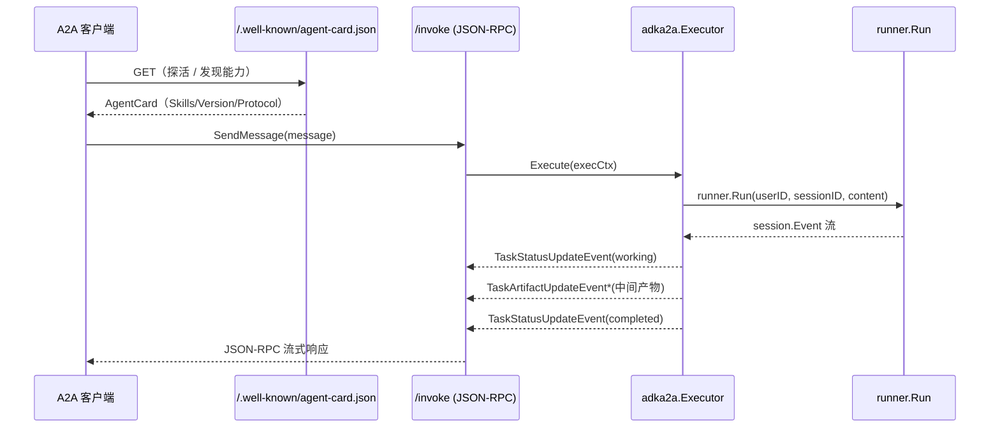

# A2A Server：把 Agent 暴露为 A2A 协议端点

> 本教程基于 [`examples/a2a/main.go`](../../../examples/a2a/main.go)。前一篇 [01-rest-server.md](./01-rest-server.md) 把 agent 暴露成了 REST API；这一篇展示另一种"暴露方式"——把 agent 暴露成 [A2A 协议](https://a2a.dev/)端点，让其他 agent（或别的进程里的客户端）通过标准 `agent-to-agent` JSON-RPC 接口来调用它。
>
> A2A（Agent-To-Agent）是 Google / a2a.dev 维护的开放协议，专门用来在不同主机、不同进程甚至不同语言之间做 agent 调用。和 REST 相比，A2A 天然支持 **Task 状态机**、**流式 artifact 推送**、**服务端推送取消**——这些都是为"长时间运行的智能体"专门设计的。

## 你将学到

- `adka2a` 包是什么：把 `agent.Agent` 接到 A2A `a2asrv.AgentExecutor` 接口的官方适配层
- `Executor.Execute` 如何把一个 A2A `SendMessage` 调成 `runner.Run`，并把每个 `session.Event` 转回 A2A `TaskArtifactUpdateEvent`
- `a2a.AgentCard`（"agent 名片"）：客户端拿它来发现 agent 能力、版本、传输协议
- 手工搭一个 `net/http` A2A 端点：`a2asrv.NewJSONRPCHandler` + `a2asrv.NewHandler` + `adka2a.NewExecutor`
- 用 `remoteagent.NewA2A` 当 A2A 客户端，再嵌入回 `full.NewLauncher` 跑一个 console loop——一个进程里既是 A2A server，又是 A2A client

## 前置条件

- [x] 已完成 [01-rest-server.md](./01-rest-server.md)（了解 ADK server 模式的大背景）
- [x] 已设置 `GOOGLE_API_KEY`（见 [00-prerequisites.md](../00-prerequisites.md)）
- [x] 本机可访问 `generativelanguage.googleapis.com`
- [x] 已 `git clone` ADK 仓库并 `go mod download`
- [x] 已安装 `curl` 与 `jq`

## 核心概念

**A2A 协议把"调用 agent"这件事抽象成一个 Task 状态机**：客户端发 `SendMessage`，服务端用 `TaskStatusUpdateEvent` 推送 `submitted → working → completed/failed/canceled/input-required` 等状态变化，用 `TaskArtifactUpdateEvent` 增量推送 artifact（也就是 agent 输出的中间产物）。这些事件通过 JSON-RPC 流式下发给客户端，客户端不需要轮询。和 REST 相比，A2A 把"协议层"做厚了，把"业务层"做薄了——这使得**任何语言**只要实现了 A2A 客户端都能调用 ADK agent。

**ADK 通过 `adka2a.NewExecutor` 把协议层和业务层连起来**。入口签名是 `adka2a.NewExecutor(ExecutorConfig)`（[`server/adka2a/v2/executor.go:154`](../../../server/adka2a/v2/executor.go)）。`Executor` 实现了 `a2asrv.AgentExecutor` 接口（[`server/adka2a/v2/executor.go:138`](../../../server/adka2a/v2/executor.go) 的 `var _ a2asrv.AgentExecutor = (*Executor)(nil)` 断言）。整个 `Execute` 方法（[`server/adka2a/v2/executor.go:161`](../../../server/adka2a/v2/executor.go)）的核心职责只有一句话：**把 A2A message 转换成 `*genai.Content`，喂给 `runner.Run`，再把每个 `session.Event` 翻成 A2A 事件推回客户端**。

**Agent Card** 是 A2A 的"服务发现"机制，定义在 [`server/adka2a/v2/agent_card.go:33`](../../../server/adka2a/v2/agent_card.go) 的 `BuildAgentSkills`。它是一段 JSON，挂在 `/.well-known/agent-card.json`（`a2asrv.WellKnownAgentCardPath`）下，客户端探活后就能拿到 agent 名字、描述、支持的传输协议（JSON-RPC / gRPC / HTTP+JSON）、是否支持流式、`Skills` 列表等元信息。

下图展示 A2A server 和 client 的整体协作关系：



**看图指引**：

- `/.well-known/agent-card.json` 是 A2A 协议规定的固定路径；客户端只需要"给我 agent 地址"，剩下的协议细节全部从 agent card 推断。
- `Execute` 内部用 [`server/adka2a/v2/executor.go:161`](../../../server/adka2a/v2/executor.go) 的 `Executor.Execute` 实现，**整个方法返回 `iter.Seq2[a2a.Event, error]`**——这是 Go 1.23+ 的迭代器签名，A2A 的流式推送本质是 `yield` 一个个 A2A 事件。
- 客户端拿到的"流"实际上由三类事件组成：`TaskStatusUpdateEvent`（状态变化）、`TaskArtifactUpdateEvent`（artifact 增量）、`Task`（首次提交的 task 实体）。

## 完整代码

完整源码在 [`examples/a2a/main.go`](../../../examples/a2a/main.go)（约 140 行）：

```go
// examples/a2a/main.go
package main

import (
	"context"
	"log"
	"net"
	"net/http"
	"net/url"
	"os"

	"github.com/a2aproject/a2a-go/v2/a2a"
	"github.com/a2aproject/a2a-go/v2/a2asrv"
	"google.golang.org/genai"

	"google.golang.org/adk/agent"
	"google.golang.org/adk/agent/llmagent"
	"google.golang.org/adk/agent/remoteagent/v2"
	"google.golang.org/adk/cmd/launcher"
	"google.golang.org/adk/cmd/launcher/full"
	"google.golang.org/adk/model/gemini"
	"google.golang.org/adk/runner"
	"google.golang.org/adk/server/adka2a/v2"
	"google.golang.org/adk/session"
	"google.golang.org/adk/tool"
	"google.golang.org/adk/tool/geminitool"
)

func newWeatherAgent(ctx context.Context) agent.Agent {
	model, err := gemini.NewModel(ctx, "gemini-3.1-flash-lite", &genai.ClientConfig{
		APIKey: os.Getenv("GOOGLE_API_KEY"),
	})
	if err != nil {
		log.Fatalf("Failed to create a model: %v", err)
	}

	agent, err := llmagent.New(llmagent.Config{
		Name:        "weather_time_agent",
		Model:       model,
		Description: "Agent to answer questions about the time and weather in a city.",
		Instruction: "I can answer your questions about the time and weather in a city.",
		Tools:       []tool.Tool{geminitool.GoogleSearch{}},
	})
	if err != nil {
		log.Fatalf("Failed to create an agent: %v", err)
	}
	return agent
}

func startWeatherAgentServer() string {
	listener, err := net.Listen("tcp", "127.0.0.1:0")
	if err != nil {
		log.Fatalf("Failed to bind to a port: %v", err)
	}

	baseURL := &url.URL{Scheme: "http", Host: listener.Addr().String()}

	log.Printf("Starting A2A server on %s", baseURL.String())

	go func() {
		ctx := context.Background()
		agent := newWeatherAgent(ctx)

		agentPath := "/invoke"
		agentCard := &a2a.AgentCard{
			Name:        agent.Name(),
			Description: agent.Description(),
			SupportedInterfaces: []*a2a.AgentInterface{
				{
					URL:             baseURL.JoinPath(agentPath).String(),
					ProtocolBinding: a2a.TransportProtocolJSONRPC,
					ProtocolVersion: a2a.Version,
				},
			},
			Version:            "1.0.0",
			DefaultInputModes:  []string{"text/plain"},
			DefaultOutputModes: []string{"text/plain"},
			Skills:             adka2a.BuildAgentSkills(agent),
			Capabilities:       a2a.AgentCapabilities{Streaming: true},
		}

		mux := http.NewServeMux()
		mux.Handle(a2asrv.WellKnownAgentCardPath, a2asrv.NewStaticAgentCardHandler(agentCard))

		executor := adka2a.NewExecutor(adka2a.ExecutorConfig{
			RunnerConfig: runner.Config{
				AppName:        agent.Name(),
				Agent:          agent,
				SessionService: session.InMemoryService(),
			},
		})
		requestHandler := a2asrv.NewHandler(executor)
		mux.Handle(agentPath, a2asrv.NewJSONRPCHandler(requestHandler))

		err := http.Serve(listener, mux)

		log.Printf("A2A server stopped: %v", err)
	}()

	return baseURL.String()
}

func main() {
	ctx := context.Background()

	a2aServerAddress := startWeatherAgentServer()

	remoteAgent, err := remoteagent.NewA2A(remoteagent.A2AConfig{
		Name:              "A2A Weather agent",
		AgentCardProvider: remoteagent.NewAgentCardProvider(a2aServerAddress),
	})
	if err != nil {
		log.Fatalf("Failed to create a remote agent: %v", err)
	}

	config := &launcher.Config{
		AgentLoader: agent.NewSingleLoader(remoteAgent),
	}

	l := full.NewLauncher()
	if err = l.Execute(ctx, config, os.Args[1:]); err != nil {
		log.Fatalf("Run failed: %v\n\n%s", err, l.CommandLineSyntax())
	}
}
```

## 代码逐段讲解

### 1. 创建底层 LLM Agent

`newWeatherAgent`（[`examples/a2a/main.go:44`](../../../examples/a2a/main.go)）和前面 [01-hello-world.md](../01-getting-started/01-hello-world.md) 一模一样：建模型、建 agent、挂 `geminitool.GoogleSearch{}` 让它能搜实时天气。要点：

- 这一步的产物是 `agent.Agent`——一个本地 LLM agent，**和 A2A 还没关系**。
- 这里的 `agent` 变量名被外层的 `agent` 包名遮蔽了，看的时候要分清楚：类型是 `agent.Agent`，变量也叫 `agent`。
- A2A 暴露层（`adka2a.Executor`）只关心"拿一个 `agent.Agent` 出来"，不关心它是 LLM agent、workflow agent 还是 remote agent——这正是 A2A 作为"协议层"的价值。

### 2. 启动 A2A Server（[`examples/a2a/main.go:66`](../../../examples/a2a/main.go)）

```go
listener, err := net.Listen("tcp", "127.0.0.1:0")
...
baseURL := &url.URL{Scheme: "http", Host: listener.Addr().String()}
```

注意 `net.Listen("tcp", "127.0.0.1:0")`——让 OS 随机分配端口。这样多个测试并发跑不会撞端口。`baseURL` 后面要塞进 agent card 的 `AgentInterface.URL` 里。

`go func() { ... }()` 把 server 跑在 goroutine 里，让 `startWeatherAgentServer` 能立刻返回 `baseURL.String()`，被 `main` 用来配客户端。

### 3. 构造 AgentCard（[`examples/a2a/main.go:81`](../../../examples/a2a/main.go)）

```go
agentCard := &a2a.AgentCard{
	Name:        agent.Name(),
	Description: agent.Description(),
	SupportedInterfaces: []*a2a.AgentInterface{
		{
			URL:             baseURL.JoinPath(agentPath).String(),
			ProtocolBinding: a2a.TransportProtocolJSONRPC,
			ProtocolVersion: a2a.Version,
		},
	},
	Version:            "1.0.0",
	DefaultInputModes:  []string{"text/plain"},
	DefaultOutputModes: []string{"text/plain"},
	Skills:             adka2a.BuildAgentSkills(agent),
	Capabilities:       a2a.AgentCapabilities{Streaming: true},
}
```

AgentCard 是 A2A 的"服务说明书"，字段含义：

- `Name` / `Description`：从底层 `agent.Agent` 直接拿，避免硬编码不一致。
- `SupportedInterfaces`：告诉客户端"我能用什么协议被调用"。这里只声明 JSON-RPC（`a2a.TransportProtocolJSONRPC`），URL 是 `http://127.0.0.1:<port>/invoke`。
- `Version`：自定义字符串。生产里通常跟代码版本号绑定。
- `DefaultInputModes` / `DefaultOutputModes`：MIME 数组，告诉客户端支持什么内容类型。纯文本 agent 写 `"text/plain"`。
- `Skills`：`adka2a.BuildAgentSkills(agent)`（[`server/adka2a/v2/agent_card.go:33`](../../../server/adka2a/v2/agent_card.go)）自动从 agent 描述与 sub-agent 列表推导出来——不用手填。
- `Capabilities.Streaming: true`：告诉客户端"我能流式输出"，客户端会用流式 RPC 模式而不是一次性 RPC。

### 4. 挂载 `/.well-known/agent-card.json`（[`examples/a2a/main.go:99`](../../../examples/a2a/main.go)）

```go
mux.Handle(a2asrv.WellKnownAgentCardPath, a2asrv.NewStaticAgentCardHandler(agentCard))
```

A2A 协议规定：客户端用一个"我知道的 URL"去找 agent 时，会先 `GET /.well-known/agent-card.json`。`a2asrv.NewStaticAgentCardHandler(agentCard)` 是个 `http.Handler`，每次请求都返回同一份 agent card。

### 5. 把 `Executor` 挂到 JSON-RPC handler（[`examples/a2a/main.go:101`](../../../examples/a2a/main.go)）

```go
executor := adka2a.NewExecutor(adka2a.ExecutorConfig{
    RunnerConfig: runner.Config{
        AppName:        agent.Name(),
        Agent:          agent,
        SessionService: session.InMemoryService(),
    },
})
requestHandler := a2asrv.NewHandler(executor)
mux.Handle(agentPath, a2asrv.NewJSONRPCHandler(requestHandler))
```

三层组装：

- `adka2a.NewExecutor` 构造协议适配器；只需要传一个 `runner.Config`（[`server/adka2a/v2/executor.go:154`](../../../server/adka2a/v2/executor.go)）。`Executor` 实现 `a2asrv.AgentExecutor` 接口（[`server/adka2a/v2/executor.go:138`](../../../server/adka2a/v2/executor.go)）。
- `a2asrv.NewHandler(executor)` 把 `AgentExecutor` 包成 `RequestHandler`——后者负责解析 JSON-RPC 请求、把方法名分派到 executor 的方法。
- `a2asrv.NewJSONRPCHandler(requestHandler)` 是最终的 `http.Handler`，把 `RequestHandler` 挂到 JSON-RPC over HTTP 协议上。

最终 `/invoke` 端点接收 `SendMessage` 等 JSON-RPC 方法调用，内部把请求交给 `Executor.Execute`（[`server/adka2a/v2/executor.go:161`](../../../server/adka2a/v2/executor.go)）。Execute 内部把 A2A message 翻成 `*genai.Content`（[`server/adka2a/v2/executor.go:168`](../../../server/adka2a/v2/executor.go)），调 `runner.Run`，再把每个 `session.Event` 通过 `eventProcessor.process` 转回 A2A 事件流。

### 6. main 里同时跑 client 和 console（[`examples/a2a/main.go:119`](../../../examples/a2a/main.go)）

```go
remoteAgent, err := remoteagent.NewA2A(remoteagent.A2AConfig{
    Name:              "A2A Weather agent",
    AgentCardProvider: remoteagent.NewAgentCardProvider(a2aServerAddress),
})
...
l := full.NewLauncher()
if err = l.Execute(ctx, config, os.Args[1:]); err != nil {
    log.Fatalf("Run failed: %v\n\n%s", err, l.CommandLineSyntax())
}
```

这一步是个有意思的"自包含"设计：

- `remoteagent.NewA2A`（[`agent/remoteagent/v2/a2a_agent.go:156`](../../../agent/remoteagent/v2/a2a_agent.go)）创建了一个 A2A **客户端**，但从外面看它就是一个普通的 `agent.Agent`——可以挂到任何 runner 上。
- `full.NewLauncher().Execute` 在 `os.Args[1:]` 里没传 `restapi` / `a2a` 子命令时，默认进 `console` 模式——也就是交互式聊天。
- 所以这个进程同时干三件事：开 A2A server 端口、用 A2A 客户端把请求转发过去、再用 console UI 让你输入聊天。最终效果是"和一个走 A2A 协议的远端 agent 聊天"。

## 准备与运行

### 步骤 1：确认 API key

```bash
echo $GOOGLE_API_KEY   # 应输出 AIza...
```

未设置时回到 [00-prerequisites.md §3](../00-prerequisites.md) 获取。

### 步骤 2：启动 A2A server 演示

```bash
go run ./examples/a2a
```

成功时日志末尾会打印：

```
Starting A2A server on http://127.0.0.1:xxxxx
```

之后会进入 console 模式。输入：

```
What is the weather in Tokyo?
```

期望：console 里先打印"通过 A2A 客户端发的 SendMessage"，然后远端 server 端 streaming 回 task artifact，最后打印 `Currently in Tokyo ...` 的回答。

### 步骤 3：直接探测 Agent Card

在另一个终端：

```bash
curl -s http://127.0.0.1:xxxxx/.well-known/agent-card.json | jq .
```

期望：拿到刚才 `a2a.AgentCard` 序列化后的 JSON，能看到 `name=weather_time_agent`、`skills` 列表、`capabilities.streaming=true`、`supportedInterfaces[*].protocolBinding=="jsonrpc"` 等字段。

### 步骤 4：手工发 JSON-RPC `SendMessage`

```bash
URL=http://127.0.0.1:xxxxx/invoke
curl -s -X POST $URL \
  -H "Content-Type: application/json" \
  -d '{
    "jsonrpc": "2.0",
    "id": "1",
    "method": "message/send",
    "params": {
      "message": {
        "role": "user",
        "parts": [{"kind": "text", "text": "What is the weather in Tokyo?"}],
        "messageId": "msg-1"
      }
    }
  }' | jq .
```

期望：返回 JSON-RPC 响应，里面有一个 `result.task` 字段，状态是 `completed`，并附带 `result.task.artifacts[*].parts[*].text` 是 `Currently in Tokyo ...` 的回答。

## 常见错误

- **`bind: address already in use`** —— 你把 `127.0.0.1:0` 改成了固定端口。改回 `:0` 让 OS 自动分配。
- **`failed to create a model`** —— `GOOGLE_API_KEY` 没设，或者没拉取 `go.mod` 同步依赖。回 [00-prerequisites.md](../00-prerequisites.md) 排查。
- **JSON-RPC 响应 `-32601 Method not found`** —— `method` 字段拼错。A2A 规定的方法是 `message/send`、`message/stream`、`tasks/get`、`tasks/cancel` 等，参见 [a2a.dev 协议规范](https://a2a.dev/)。
- **AgentCard 暴露在公网导致 `Skills` 泄露内部 agent 名** —— 生产部署务必给 `/.well-known/agent-card.json` 加鉴权或者放内网。A2A 默认是不带鉴权的明文 HTTP。
- **`Execute` 收到 nil message 但没有报错** —— [`server/adka2a/v2/executor.go:164`](../../../server/adka2a/v2/executor.go) 会 `yield(nil, fmt.Errorf("message not provided"))`；客户端日志要查 A2A server stderr 才能看到。
- **`Cleanup` 没被调用** —— 长连接断开后 A2A 客户端会触发 `Cleanup`，由 [`server/adka2a/v2/executor.go:249`](../../../server/adka2a/v2/executor.go) 实现，包含子任务取消等收尾逻辑。如果你自定义了 `A2AExecutionCleanupCallback` 一定要让原 chain 也跑完。

## 关键 API 小结

| API | 位置 | 作用 |
|---|---|---|
| `adka2a.NewExecutor` | [`server/adka2a/v2/executor.go:154`](../../../server/adka2a/v2/executor.go) | 构造 `*Executor`；`ExecutorConfig.RunnerConfig` 必填 |
| `Executor.Execute` | [`server/adka2a/v2/executor.go:161`](../../../server/adka2a/v2/executor.go) | 把 A2A message 翻成 `*genai.Content` 跑 `runner.Run`，再把 `session.Event` 流转回 A2A 事件 |
| `Executor.Cleanup` | [`server/adka2a/v2/executor.go:249`](../../../server/adka2a/v2/executor.go) | 收尾：取消子 agent task、调用用户 `A2AExecutionCleanupCallback` |
| `adka2a.BuildAgentSkills` | [`server/adka2a/v2/agent_card.go:33`](../../../server/adka2a/v2/agent_card.go) | 从 agent 自动推导 `[]a2a.AgentSkill`（包含 sub-agent skills） |
| `a2asrv.WellKnownAgentCardPath` | `a2asrv` 包常量 | `/.well-known/agent-card.json` 路径常量 |
| `a2asrv.NewStaticAgentCardHandler` | `a2asrv` 包 | 返回固定 `a2a.AgentCard` 的 `http.Handler` |
| `a2asrv.NewHandler` | `a2asrv` 包 | 把 `AgentExecutor` 包成 `RequestHandler` |
| `a2asrv.NewJSONRPCHandler` | `a2asrv` 包 | 把 `RequestHandler` 挂到 JSON-RPC over HTTP |
| `remoteagent.NewA2A` | [`agent/remoteagent/v2/a2a_agent.go:156`](../../../agent/remoteagent/v2/a2a_agent.go) | 构造一个"远程 A2A agent"作为 `agent.Agent` |
| `remoteagent.NewAgentCardProvider` | [`agent/remoteagent/v2/a2a_agent.go:64`](../../../agent/remoteagent/v2/a2a_agent.go) | 用 URL 自动解析 `a2a.AgentCard` 的 provider |

## 延伸阅读

- 架构文档：[核心抽象一览](../../architecture/00-overview.md#3-核心抽象一览) —— 理解 `Agent` / `Runner` / `Executor` 在 A2A 协议里各自扮演的角色
- 架构文档：[F5 Live 双向流](../../architecture/01-core-flows.md#f5-live-双向流) —— A2A 与 Live 长连接的协议关系
- 架构文档：[server 模块](../../architecture/03-modules/10-server.md) —— `adka2a` / `adkrest` / `agentengine` 三大 server 适配层总览
- 源码：[`examples/a2a/main.go`](../../../examples/a2a/main.go) —— 本教程讲解的 140 行可运行示例
- 源码：[`server/adka2a/v2/executor.go`](../../../server/adka2a/v2/executor.go) —— `Executor.Execute` / `Executor.Cleanup` 完整实现
- 源码：[`server/adka2a/v2/agent_card.go`](../../../server/adka2a/v2/agent_card.go) —— `BuildAgentSkills` 自动推导逻辑
- 源码：[`agent/remoteagent/v2/a2a_agent.go`](../../../agent/remoteagent/v2/a2a_agent.go) —— A2A 客户端 `NewA2A` 与 `NewAgentCardProvider` 实现
- 协议：[a2a.dev 官方规范](https://a2a.dev/) —— JSON-RPC 方法名、Task 状态机、流式协议
- 未来子项目深读占位：`adka2a` 的 `eventProcessor`、`inputRequired` 子任务取消链路、`a2a.AgentCapabilities` 各字段的语义