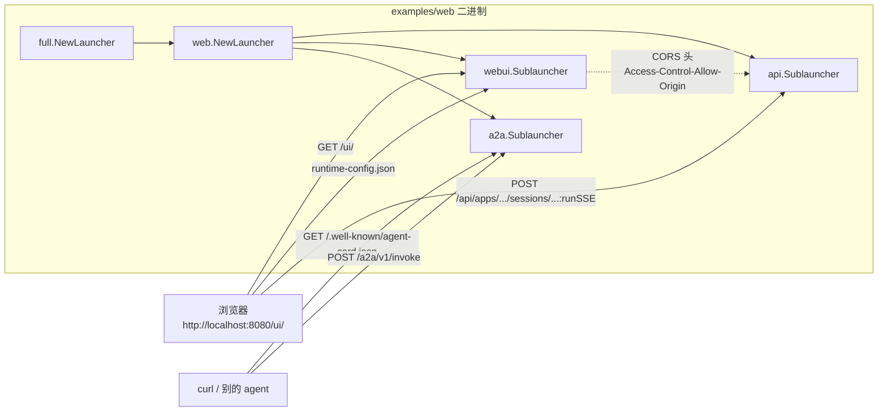

# Web UI：自带 React 前端的 Agent 调试器

> 本教程基于 [`examples/web/main.go`](../../../examples/web/main.go)。前两篇（[01-rest-server.md](./01-rest-server.md) 与 [02-a2a-server.md](./02-a2a-server.md)）把 agent 暴露成了可被 `curl` / 其他 agent 调用的服务接口。这一篇展示"另一种交付形态"：**在同一个二进制里既跑 REST API，又跑一个内嵌的 React 单页应用**——浏览器打开 `http://localhost:8080/ui/` 就能直接对话、调工具、看事件流，所有调试体验都不需要额外起前端项目。

## 你将学到

- `full.NewLauncher()` 里 `webui` 子 launcher 的角色：把 `distr/` 目录里的 React 静态资源以 `//go:embed` 形式塞进二进制
- `webui` 与 `api` 子 launcher **共享同一端口**：`/ui/*` 走 React 静态文件，`/api/*` 走 REST API
- `webui` 在运行时生成 `runtime-config.json`，告诉 React 前端"后端 API 在哪"——避免硬编码
- `api` 子 launcher 通过 CORS 中间件（`corsWithArgs`）放行来自 `webui_address` 的浏览器跨域请求
- 浏览器里能直接看到哪些能力：会话列表、事件流（流式 SSE）、artifact 列表（图片/文件可下载）
- 为什么 `examples/web` 还多了 `a2a` 子 launcher：WebUI 通过 A2A 协议做"前端 ↔ agent"的桥接（详见 [02-a2a-server.md](./02-a2a-server.md)）

## 前置条件

- [x] 已完成 [01-rest-server.md](./01-rest-server.md)（理解 ADK REST API 的端点形状）
- [x] 已完成 [02-a2a-server.md](./02-a2a-server.md)（理解 A2A 协议在本进程里的作用）
- [x] 已设置 `GOOGLE_API_KEY`（见 [00-prerequisites.md](../00-prerequisites.md)）
- [x] 本机可访问 `generativelanguage.googleapis.com`
- [x] 已 `git clone` ADK 仓库并 `go mod download`
- [x] 已安装 `curl`（仅用于本教程末尾的"端到端"验证；浏览器才是主战场）

## 核心概念

**Web UI 子 launcher 把 React 前端塞进 Go 二进制**。`cmd/launcher/web/webui/webui.go:86-87` 用 `//go:embed distr/*` 把构建产物（`distr/index.html`、`distr/chunk-*.js`、`distr/assets/...`）整体编译进二进制；启动时 `webui` 子 launcher 再用 `http.FileServer(http.FS(ui))`（`webui/webui.go:113`）把它们当静态资源挂到 `/ui/*` 路径上。这等于 **"前端不需要单独部署"**——`go run` / `go build` 一个命令，前端就跟着跑起来。

**前端和后端共享同一个 HTTP server**。`web.NewLauncher(...)`（[`cmd/launcher/web/web.go:229`](../../../cmd/launcher/web/web.go)）接受一组 `Sublauncher`（接口定义在 [`web.go:72`](../../../cmd/launcher/web/web.go)），由它创建 gorilla/mux 路由器（[`web.go:264`](../../../cmd/launcher/web/web.go) 的 `BuildBaseRouter`，内部在 `web.go:265` 调 `mux.NewRouter()`）并依次调用每个子 launcher 的 `SetupSubrouters`。所以 `api`、`webui`、`a2a` 三个子 launcher 实际**挂在同一个 `:8080` 端口**——`/api/*` 由 `api` 子 launcher 注册、`/ui/*` 由 `webui` 注册、`/.well-known/agent-card.json` 与 `/a2a/v1/*` 由 `a2a` 注册，互不冲突。

**CORS 桥**：浏览器从 `http://localhost:8080/ui/` 加载 React 前端后，会用 `XMLHttpRequest` 调 `http://localhost:8080/api/*`——这看起来是"同源"，但前端代码里访问的 `backendUrl` 由 `runtime-config.json` 提供，**真正跨域的情形**（比如前端跑在 `:5173`、后端在 `:8080`）就需要 CORS 头。`api/api.go:54-69` 的 `corsWithArgs` 正是为这种情况准备的，它的 `Access-Control-Allow-Origin` 由 `--webui_address` 指定（`api.go:142`）。

**`runtime-config.json` 协议**：`webui` 在启动时不读任何配置文件，而是在收到 `GET /ui/assets/config/runtime-config.json`（`webui/webui.go:99-102`）时**现场拼一个 JSON** 响应 `{"backendUrl":"http://localhost:8080/api"}`（`webui/webui.go:95-96`）。这样部署时不需要改前端构建产物，配置后端地址靠"启动参数"即可。

下图展示三个子 launcher 在同一进程里的协作关系：



**看图指引**：

- 三个子 launcher 共享一个 gorilla/mux 路由器，因此"前端请求"和"后端请求"在网络层面是同源同端口——CORS 中间件只在前后端拆部署时才必要。
- `runtime-config.json` 是前后端"解耦点"：前端用 `fetch('/assets/config/runtime-config.json')` 取后端地址，部署时改启动参数 `--api_server_address`（`webui/webui.go:121`）就能换后端，不需要重编前端。
- 浏览器走 `/api` REST + SSE 调用 agent；A2A 客户端走 `/a2a/v1/invoke` JSON-RPC——它们是**两条**独立通道，都由 `full.NewLauncher` 在同进程里提供。

## 完整代码

完整源码在 [`examples/web/main.go`](../../../examples/web/main.go)（约 114 行）。下面分成 3 段看：

```go
// examples/web/main.go（片段 1：构造 model + rootAgent + 多 agent loader）
model, err := gemini.NewModel(ctx, "gemini-3.1-flash-lite", &genai.ClientConfig{
    APIKey: apiKey,
})
// ...
rootAgent, _ := llmagent.New(llmagent.Config{
    Name:        "weather_time_agent",
    Model:       model,
    Description: "Agent to answer questions about the time and weather in a city.",
    Instruction: "I can answer your questions about the time and weather in a city.",
    Tools:       []tool.Tool{geminitool.GoogleSearch{}},
    AfterModelCallbacks: []llmagent.AfterModelCallback{saveReportfunc},
})

llmAuditor := agents.GetLLMAuditorAgent(ctx, model)
imageGeneratorAgent := agents.GetImageGeneratorAgent(ctx, model)

agentLoader, _ := agent.NewMultiLoader(rootAgent, llmAuditor, imageGeneratorAgent)
artifactservice := artifact.InMemoryService()
```

```go
// examples/web/main.go（片段 2：launcher.Config + A2A 拦截器）
config := &launcher.Config{
    ArtifactService: artifactservice,
    SessionService:  sessionService,
    AgentLoader:     agentLoader,
    A2AOptions: []a2asrv.RequestHandlerOption{
        a2asrv.WithCallInterceptors(&AuthInterceptor{}),
    },
}
```

```go
// examples/web/main.go（片段 3：full.NewLauncher + 启动）
l := full.NewLauncher()
if err = l.Execute(ctx, config, os.Args[1:]); err != nil {
    log.Fatalf("Run failed: %v\n\n%s", err, l.CommandLineSyntax())
}
```

完整 3 段拼起来就是 [`examples/web/main.go`](../../../examples/web/main.go) 全部源码——核心是 `full.NewLauncher()` 一行把 `console` + `webui` + `a2a` + `api` 4 种模式全部启用，命令参数决定跑哪种。

## 代码逐段讲解

### 1. 构造 3 个 agent + 多 agent loader

[`examples/web/main.go:67-86`](../../../examples/web/main.go) 创建了 3 个不同能力的 agent：

- `weather_time_agent`（`llmagent`，自带 `geminitool.GoogleSearch`，并配 `AfterModelCallback: saveReportfunc`——把模型输出顺手存进 artifact 服务）
- `llm_auditor`（由 [`examples/web/agents/llmauditor.go:221`](../../../examples/web/agents/llmauditor.go) 的 `GetLLMAuditorAgent` 返回，内部是 `critic_agent` + `reviser_agent` 的 `sequentialagent`，演示"先评审再修订"的多 agent 流程）
- `image_generator`（[`examples/web/agents/image_generator.go`](../../../examples/web/agents/image_generator.go) 演示 artifact 写入——调 `imagen-3.0-generate-002` 把图存进 artifact service，前端可直接看到/下载）

它们通过 `agent.NewMultiLoader(...)`（[`examples/web/main.go:90-94`](../../../examples/web/main.go)）注册到同一个进程里。`MultiLoader` 是 ADK 的"多 app 共享一个进程"的标准做法（[01-hello-world.md](../01-getting-started/01-hello-world.md) 用的是 `NewSingleLoader`，本质是 `MultiLoader` 的退化形式）。

`saveReportfunc`（[`examples/web/main.go:39-50`](../../../examples/web/main.go)）是值得注意的小细节：它通过 `agent.CallbackContext.Artifacts().Save` 把模型响应里**每一个 part**（包括 `text` 段落和未来的图片/文件）都落到 artifact 服务里。这样在 Web UI 的右栏就能直接看到 agent 这次运行产生的所有 artifact，不用额外写持久化代码。

### 2. `launcher.Config` 与 A2A 拦截器

[`examples/web/main.go:101-108`](../../../examples/web/main.go) 把 3 个 service（`ArtifactService` / `SessionService` / `AgentLoader`）装进 `launcher.Config`，并配 `A2AOptions`：

```go
A2AOptions: []a2asrv.RequestHandlerOption{
    a2asrv.WithCallInterceptors(&AuthInterceptor{}),
},
```

`AuthInterceptor`（类型定义在 [`examples/web/main.go:52-55`](../../../examples/web/main.go)，`Before` 方法在 `:57-61`）继承 `a2asrv.PassthroughCallInterceptor`，在 `Before` 钩子里把 `callCtx.User` 设成 `AuthenticatedUser("user", nil)`。这样做的原因是：**`webui` 与 `a2a` 子 launcher 共享同一个 `SessionService`**（都是 `session.InMemoryService()`，见 [`examples/web/main.go:73`](../../../examples/web/main.go)），前端经 A2A 调 agent 时必须给个非空 user，否则 session 创建会失败。**这套机制也让你能在自己项目里换成 OAuth / API key 校验**——`AuthInterceptor` 是你唯一需要替换的钩子。

### 3. `full.NewLauncher()` 启 4 种模式

[`cmd/launcher/full/full.go:32`](../../../cmd/launcher/full/full.go) 显式列出了 `full.NewLauncher` 注册的 6 个子 launcher：

```go
return universal.NewLauncher(console.NewLauncher(),
    web.NewLauncher(webui.NewLauncher(), a2a.NewLauncher(),
        pubsub.NewLauncher(), eventarc.NewLauncher(), api.NewLauncher()))
```

其中 `web.NewLauncher` 接受 5 个 web 子 launcher（[`cmd/launcher/web/web.go:229`](../../../cmd/launcher/web/web.go)），由它创建 gorilla/mux 路由器并分发请求。`examples/web` 默认启动参数是 `web` 关键字（[`examples/web/main.go:110-113`](../../../examples/web/main.go) 把 `os.Args[1:]` 透传给 `l.Execute`），所以下面这些子模式**全部**启用：

| 子 launcher | 关键字 | 注册路径 | 用途 |
|---|---|---|---|
| `console` | `console` | — | 本地交互式 REPL |
| `webui` | `webui` | `/ui/*`（`webui/webui.go:122`） | 浏览器 React 前端 |
| `api` | `api` | `/api/*`（[`api/api.go:105-106`](../../../cmd/launcher/web/api/api.go)） | REST API + SSE 流 |
| `a2a` | `a2a` | `/.well-known/agent-card.json` + `/a2a/v1/invoke` | A2A 协议端点 |
| `pubsub` | `pubsub` | `/pubsub/*` | 事件触发 |
| `eventarc` | `eventarc` | `/eventarc/*` | 事件触发 |

如果只想留 REST + A2A + WebUI 三个子集，命令行 `go run ./examples/web webui api a2a` 即可（参见 [`web.go:111-148`](../../../cmd/launcher/web/web.go) 的 `Parse` 方法——`web.NewLauncher` 会从 `os.Args` 里挑出"已声明关键字"并按顺序执行 `Parse`，未识别的关键字回退到上游；`web.go:163-165` 会在没有任何子 launcher 启用时显式报错列出可选项）。

## 准备与运行

### 步骤 1：获取凭证

```bash
export GOOGLE_API_KEY=AIza...   # 见 00-prerequisites.md §3
```

### 步骤 2：设置环境变量

`examples/web` 只需要 `GOOGLE_API_KEY`；如果想跑 `image_generator` 演示 artifact 流程，再加 `GOOGLE_CLOUD_PROJECT` 与 `GOOGLE_CLOUD_LOCATION`（见 [`examples/web/agents/image_generator.go:31-35`](../../../examples/web/agents/image_generator.go)）。

### 步骤 3：启动（默认开 4 种模式）

```bash
cd /home/wu/oneone/adk
go run ./examples/web
```

成功时日志末尾会打印：

```
Web servers starts on http://localhost:8080
       webui:  you can access API using http://localhost:8080/ui/
       api:  you can access API using http://localhost:8080/api
       api:      for instance: http://localhost:8080/api/list-apps
       a2a:  ...
```

这 3 行分别来自 `webui/webui.go:81`、`api/api.go:71-72`、`cmd/launcher/web/a2a/a2a.go` 的 `UserMessage` 实现——它们让你一眼知道"每个子模式挂在哪个 URL 前缀下"。

### 步骤 4：打开浏览器

浏览器访问 `http://localhost:8080/`——`webui/webui.go:104-107` 的根路径重定向到 `/ui/`，接着 React 应用启动时会先 `fetch('/ui/assets/config/runtime-config.json')`（`webui/webui.go:99-102`）拿到后端地址，然后开始用 SSE 跑 agent。

在 UI 里：

1. 左栏列出 `agentLoader` 里所有 app（`weather_time_agent` / `llm_auditor` / `image_generator`），点击切换。
2. 中栏是消息流：每条 SSE 事件以独立卡片渲染，能区分 `author` / `content.parts[*].text` / `function_call` / `function_response`。
3. 右栏是 artifact 列表：因为 `saveReportfunc` 在 `AfterModelCallback` 里把每条消息都写了 artifact，UI 端能直接看到"agent 这次产生了哪些文件/文本"。

### 步骤 5：用 curl 验证 REST 端点（可选）

```bash
APP=weather_time_agent
SID=s-$(date +%s)
curl -s -X POST http://localhost:8080/api/apps/$APP/users/u1/sessions \
  -H "Content-Type: application/json" -d '{}'

curl -N -X POST http://localhost:8080/api/apps/$APP/users/u1/sessions/$SID:runSSE \
  -H "Content-Type: application/json" \
  -d '{
    "appName": "'"$APP"'",
    "userId": "u1",
    "sessionId": "'"$SID"'",
    "newMessage": {"role":"user","parts":[{"text":"What's the weather in Tokyo?"}]}
  }'
```

期望：和 [01-rest-server.md](./01-rest-server.md) 的 `:runSSE` 行为一致——事件以 `data: {...}` 一行行连续打印。这证明 `webui` 与 `api` 子 launcher 共端口、共享 session 存储，**浏览器和 curl 调的是同一个 agent 进程**。

## 常见错误

- **访问 `:8080/` 看到 404** —— 你只启了 `api` 子 launcher，没启 `webui`。`webui/webui.go:104-107` 那个 `/` 重定向是 webui 子 launcher 注册的；少了它根路径没人管。补 `webui` 关键字即可：`go run ./examples/web webui api`。
- **前端报 `CORS error: No 'Access-Control-Allow-Origin' header`** —— 你把前端跑到了别的端口（典型 Vite `:5173`）。这是 `api/api.go:54-69` 的 CORS 头没匹配上，要么改前端让它走同源，要么启动时加 `--webui_address=localhost:5173`（`api.go:142`）。
- **前端能加载但跑 agent 时 404 `runtime-config.json`** —— 罕见，多半是改了 `--path_prefix` 但没改 `webui` 的 `pathPrefix` 默认值 `/ui/`（`webui/webui.go:122`），导致前端按 `/assets/...` 取配置落到别处。**保持 webui 子 launcher 的 `pathPrefix` 与 React 路由前缀一致**。
- **`sseWriteTimeout: connection reset` 在长会话里** —— agent 跑得久，前端连接被网关/反代掐了。`api/api.go` 默认 `sse-write-timeout=120s`（`api.go:144`），要么调大，要么在反代层同步加 `proxy_read_timeout`。
- **`no active sublaunchers found`** —— 你没在命令行给任何子 launcher 关键字。`web.NewLauncher` 在 [`web.go:163-165`](../../../cmd/launcher/web/web.go) 会显式报错列出所有可选项。补关键字：`go run ./examples/web webui api a2a`。
- **WebUI 能跑但前端用不了 `llm_auditor` / `image_generator`** —— 你把 [`examples/web/main.go:90-94`](../../../examples/web/main.go) 那段 `agent.NewMultiLoader` 漏了，loader 里只剩 `rootAgent`。检查 loader 构造是否传齐所有 agent。

## 关键 API 小结

| API | 位置 | 作用 |
|---|---|---|
| `full.NewLauncher` | [`cmd/launcher/full/full.go:32`](../../../cmd/launcher/full/full.go) | 注册 console + webui + api + a2a + pubsub + eventarc 6 种模式 |
| `web.NewLauncher` | [`cmd/launcher/web/web.go:229`](../../../cmd/launcher/web/web.go) | 创建 gorilla/mux 路由器并按命令行关键字启 5 个 web 子 launcher |
| `webui.NewLauncher` | [`cmd/launcher/web/webui/webui.go:117`](../../../cmd/launcher/web/webui/webui.go) | webui 子 launcher 工厂；返回挂 `/ui/*` 的 `http.FileServer` |
| `//go:embed distr/*` | [`cmd/launcher/web/webui/webui.go:86`](../../../cmd/launcher/web/webui/webui.go) | 把 React 构建产物编进二进制，启动时无需前端目录 |
| `runtime-config.json` | [`cmd/launcher/web/webui/webui.go:99-102`](../../../cmd/launcher/web/webui/webui.go) | webui 运行时生成的后端地址，**前端 `fetch` 它来知道 `backendUrl`** |
| `api.NewLauncher` | [`cmd/launcher/web/api/api.go:138`](../../../cmd/launcher/web/api/api.go) | api 子 launcher 工厂；返回 `adkrest.NewServer` 并包裹 CORS 中间件 |
| `corsWithArgs` | [`cmd/launcher/web/api/api.go:54-69`](../../../cmd/launcher/web/api/api.go) | 给 `Access-Control-Allow-Origin` 加白名单，默认 `localhost:8080` |
| `--webui_address` | [`cmd/launcher/web/api/api.go:142`](../../../cmd/launcher/web/api/api.go) | api 子 launcher 接收的"前端地址"参数 |
| `--api_server_address` | [`cmd/launcher/web/webui/webui.go:121`](../../../cmd/launcher/web/webui/webui.go) | webui 子 launcher 接收的"后端地址"参数 |
| `agent.NewMultiLoader` | `agent/loader.go` | 把多个 agent 暴露为"多 app"，URL `/apps/{name}/...` 中 `{name}` 任选其一 |
| `AuthInterceptor` | [`examples/web/main.go:52-61`](../../../examples/web/main.go) | `a2asrv.PassthroughCallInterceptor` 派生，把 `callCtx.User` 设为 `AuthenticatedUser` |
| `saveReportfunc` | [`examples/web/main.go:39-50`](../../../examples/web/main.go) | `llmagent.AfterModelCallback` 示例，把每个 part 存进 artifact 服务 |

## 延伸阅读

- 架构文档：[F2 部署与多协议入口](../../architecture/01-core-flows.md#f2-部署与多协议入口)（如该章节尚未发布，先看 [`cmd/launcher/full/full.go:32`](../../../cmd/launcher/full/full.go) 的子 launcher 注册表）
- 架构文档：[M3 嵌入式前端与 REST 后端的协作模式](../../architecture/02-extension-points.md#m3-嵌入式前端与-rest-后端的协作模式)（如该章节尚未发布，先看 [`cmd/launcher/web/webui/webui.go:86`](../../../cmd/launcher/web/webui/webui.go) 的 `//go:embed` + [`cmd/launcher/web/api/api.go:54`](../../../cmd/launcher/web/api/api.go) 的 CORS）
- 源码：[`examples/web/main.go`](../../../examples/web/main.go) —— 本教程讲解的 114 行可运行示例
- 源码：[`cmd/launcher/web/webui/webui.go`](../../../cmd/launcher/web/webui/webui.go) —— `webui` 子 launcher 完整实现（`//go:embed` + `http.FileServer`）
- 源码：[`cmd/launcher/web/api/api.go`](../../../cmd/launcher/web/api/api.go) —— `api` 子 launcher 完整实现（CORS + adkrest 挂载）
- 源码：[`cmd/launcher/web/web.go`](../../../cmd/launcher/web/web.go) —— `web.NewLauncher` 主路由器，按命令行关键字装配子 launcher
- 源码：[`cmd/launcher/full/full.go`](../../../cmd/launcher/full/full.go) —— `full.NewLauncher` 子 launcher 注册表
- 未来子项目深读占位：`webui/distr/` 内 React 应用的 `runtime-config.json` 消费链路；`AuthInterceptor` 替换为 OAuth/API key 的实战模式
