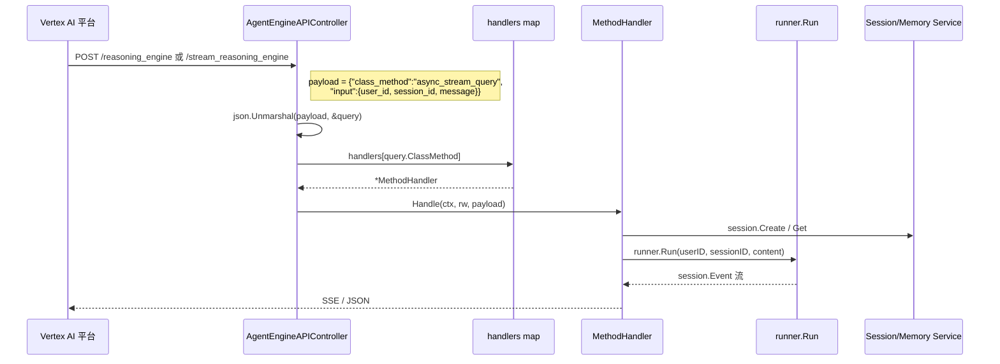

# Vertex AI Agent Engine：部署到 Google Cloud

> 本教程基于 [`examples/agentengine/main.go`](../../../examples/agentengine/main.go)。前两篇 [01-rest-server.md](./01-rest-server.md) 和 [02-a2a-server.md](./02-a2a-server.md) 展示的是"自托管"——你自己跑 HTTP server、想办法扩缩容、做会话持久化。这篇换一个完全不同的思路：把代码打包成容器、推到 **Vertex AI Agent Engine**（[Vertex AI Reasoning Engine](https://cloud.google.com/vertex-ai/generative-ai/docs/reasoning-engine/overview)），由 Google Cloud 负责拉起容器、扩缩容、暴露 HTTPS 端点、并提供托管的 Session / Memory 后端。
>
> Agent Engine 的核心是 `class_method` 路由：远端用 HTTP POST 打到 `/reasoning_engine`，payload 里有一个 `class_method` 字段（`async_create_session`、`async_stream_query` 等），ADK 内部用 `MethodHandler` 三方法接口把请求分派到具体的 handler。这是和 REST（按 HTTP path 分派）最大的区别。

## 你将学到

- `cmd/launcher/agentengine.NewLauncher`：把 ADK agent 跑成"可在 Agent Engine 上托管"的二进制入口
- `MethodHandler` 三方法接口（`Name` / `Handle` / `Metadata`），以及 `class_method` 路由机制
- `AgentEngineAPIController.Query`：单个 HTTP 端点 + `class_method` 字段实现"多方法多路由"的分派
- `session/vertexai` 和 `memory/vertexai`：托管的会话 / 长期记忆后端（不需要自己起数据库）
- 三个环境变量 `GOOGLE_CLOUD_PROJECT` / `GOOGLE_CLOUD_AGENT_ENGINE_LOCATION` / `GOOGLE_CLOUD_AGENT_ENGINE_ID` 的来源——由 Agent Engine 平台自动注入
- 用 `gcloud` 部署二进制、调用 `async_stream_query` 端到端测通

## 前置条件

- [x] 已完成 [01-rest-server.md](./01-rest-server.md)（了解 `launcher.Config`、`SessionService`、`AgentLoader` 的角色）
- [x] 已完成 [02-a2a-server.md](./02-a2a-server.md)（了解 ADK server 适配层的概念）
- [x] 已阅读 [00-prerequisites.md §6](../00-prerequisites.md)（GCP 项目与 SDK 基础）
- [x] 拥有 GCP 项目，并启用了 **Vertex AI API** 和 **Reasoning Engine API**
- [x] 本机已安装 `gcloud` CLI，并 `gcloud auth application-default login` 完成 ADC 认证
- [x] 已 `git clone` ADK 仓库并 `go mod download`
- [x] 已安装 `curl` 与 `jq`

## 核心概念

**Vertex AI Agent Engine**（过去叫 Reasoning Engine）是 Google Cloud 的"agent 托管"服务：用户上传一个容器镜像，平台负责拉起容器、做健康检查、按需扩缩容、暴露 HTTPS 端点。**关键是它把"agent 的 HTTP 协议"也标准化了**：所有部署上去的 agent 都用同一套 `class_method` 路由——HTTP 端点只有两个 `/reasoning_engine`（非流式）和 `/stream_reasoning_engine`（流式），区分方法靠 payload 里的 `class_method` 字段。

**`MethodHandler` 三方法接口**（[`server/agentengine/controllers/method/method.go:27`](../../../server/agentengine/controllers/method/method.go)）是 ADK 把"一种业务方法"封装成可注册单元的最小单位：

```go
type MethodHandler interface {
    Name() string                                                                            // 例如 "async_stream_query"
    Handle(ctx context.Context, rw http.ResponseWriter, payload []byte) error                // 处理请求
    Metadata() (*structpb.Struct, error)                                                     // 用于部署时的能力描述
}
```

`Name` 既是 `class_method` 字符串，也是 `Metadata` 注册到部署清单的 key。`Handle` 拿到的是 **原始字节流**（不解析），handler 内部自己 `json.Unmarshal`。`Metadata` 在 `ListClassMethods()`（[`server/agentengine/handler.go:100`](../../../server/agentengine/handler.go)）里被一次性读出，告知 Agent Engine 平台"我这个二进制支持哪些 method"。

**`AgentEngineAPIController` 是单端点多方法的调度核心**（[`server/agentengine/controllers/agent_engine.go:32`](../../../server/agentengine/controllers/agent_engine.go)）。核心结构：`map[string]method.MethodHandler`（`handlers` 字段，[`server/agentengine/controllers/agent_engine.go:33`](../../../server/agentengine/controllers/agent_engine.go)）+ `session.Service`。`Query` 方法（[`server/agentengine/controllers/agent_engine.go:52`](../../../server/agentengine/controllers/agent_engine.go)）做三件事：读 `payload` 解析 `models.Query.ClassMethod` → 调 `handleQuery`（[`server/agentengine/controllers/agent_engine.go:88`](../../../server/agentengine/controllers/agent_engine.go)）字典查表 → 找不到返回 `unrecognized class method`，找到就调 `handler.Handle(ctx, rw, payload)`。

下图展示完整分派流程：



**看图指引**：

- HTTP 端点只有两个：`/reasoning_engine`（非流式）和 `/stream_reasoning_engine`（SSE 流式）。所有"业务方法"都通过 `class_method` 字段复用同一条物理路径。
- `handlers` map 在 `NewAgentEngineAPIController` 里一次性构建（[`server/agentengine/controllers/agent_engine.go:40`](../../../server/agentengine/controllers/agent_engine.go)）；同名 handler 会 `duplicate method name` 报错，强制方法名唯一。
- 流式 handler 写完响应头后不能再返回 error——后续错误必须用 `helper.EmitJSONError` 当作普通事件写回响应体（[`server/agentengine/controllers/method/stream_query.go:78`](../../../server/agentengine/controllers/method/stream_query.go)）。

## 完整代码

完整源码在 [`examples/agentengine/main.go`](../../../examples/agentengine/main.go)（约 205 行）：

```go
// examples/agentengine/main.go（节选，完整版见链接源文件）
package main

import (
    "context"
    "fmt"
    "log"
    "math/rand/v2"
    "os"

    "google.golang.org/genai"

    "google.golang.org/adk/agent"
    "google.golang.org/adk/agent/llmagent"
    "google.golang.org/adk/cmd/launcher"
    "google.golang.org/adk/cmd/launcher/agentengine"
    vertexaiMem "google.golang.org/adk/memory/vertexai"
    "google.golang.org/adk/model/gemini"
    "google.golang.org/adk/plugin"
    "google.golang.org/adk/runner"
    "google.golang.org/adk/session/vertexai"
    "google.golang.org/adk/tool"
    "google.golang.org/adk/tool/functiontool"
    vertexaiutil "google.golang.org/adk/util/vertexai"
)

// Args defines the input structure for the memory search tool.
type Args struct {
    Query string `json:"query" jsonschema:"The query to search for in the memory."`
}

// Result defines the output structure for the memory search tool.
type Result struct {
    Results []string `json:"results"`
}

const (
    stateKeySessionLastUpdateTime = "sessionLastUpdateTime"
)

func memorySearchToolFunc(tctx agent.ToolContext, args Args) (Result, error) {
    searchResults, err := tctx.SearchMemory(tctx, args.Query)
    if err != nil {
        return Result{}, fmt.Errorf("failed memory search: %w", err)
    }
    var results []string
    for _, res := range searchResults.Memories {
        if res.Content != nil {
            for _, part := range res.Content.Parts {
                results = append(results, part.Text)
            }
        }
    }
    return Result{Results: results}, nil
}

func main() {
    ctx := context.Background()

    projectID := os.Getenv("GOOGLE_CLOUD_PROJECT")
    location := os.Getenv("GOOGLE_CLOUD_AGENT_ENGINE_LOCATION")
    agentEngineID := os.Getenv("GOOGLE_CLOUD_AGENT_ENGINE_ID")

    model, err := gemini.NewModel(ctx, "gemini-2.5-flash", &genai.ClientConfig{
        Backend:  genai.BackendVertexAI,
        Project:  projectID,
        Location: location,
    })
    if err != nil {
        log.Fatalf("Failed to create model: %v", err)
    }

    type Input struct {
        Min int `json:"min"`
        Max int `json:"max"`
    }
    type Output struct {
        Result int `json:"result"`
    }
    handler := func(ctx agent.ToolContext, input Input) (Output, error) {
        return Output{Result: input.Min + rand.IntN(input.Max-input.Min+1)}, nil
    }
    randomTool, err := functiontool.New(functiontool.Config{
        Name:        "random",
        Description: "Returns a random number between min and max",
    }, handler)
    if err != nil {
        log.Fatalf("Failed to create tool: %v", err)
    }

    memorySearchTool, err := functiontool.New(
        functiontool.Config{
            Name:        "search_past_conversations",
            Description: "Searches past conversations for relevant information.",
        },
        memorySearchToolFunc,
    )
    if err != nil {
        log.Fatalf("Failed to create tool: %v", err)
    }

    a, err := llmagent.New(llmagent.Config{
        Name:        "ae_agent",
        Model:       model,
        Description: "General helpful agent",
        Instruction: "You are a helpful agent, you should answer any questions you are given. Use 'random' tool to provide random numbers. Use search_past_conversations tool to get the facts about the user",
        Tools: []tool.Tool{
            randomTool,
            memorySearchTool,
        },
    })
    if err != nil {
        log.Fatalf("Failed to create agent: %v", err)
    }

    sessionService, err := vertexai.NewSessionService(
        ctx, vertexai.VertexAIServiceConfig{
            ProjectID:       projectID,
            Location:        location,
            ReasoningEngine: agentEngineID,
        })
    if err != nil {
        log.Fatalf("Failed to create session service: %v", err)
    }

    memService, err := vertexaiMem.NewService(ctx,
        &vertexaiMem.ServiceConfig{
            AgentEngineData: vertexaiutil.AgentEngineData{
                ProjectID:       projectID,
                Location:        location,
                ReasoningEngine: agentEngineID,
            },
            StateKeySessionLastUpdateTime: stateKeySessionLastUpdateTime,
        })
    if err != nil {
        log.Fatalf("Failed to create memory service: %v", err)
    }

    memPlugin, err := plugin.New(plugin.Config{
        Name: "Memory generator",
        BeforeRunCallback: func(ic agent.InvocationContext) (*genai.Content, error) {
            state := ic.Session().State()
            err := state.Set(stateKeySessionLastUpdateTime, ic.Session().LastUpdateTime())
            if err != nil {
                return nil, err
            }
            return nil, nil
        },
        AfterRunCallback: func(ic agent.InvocationContext) {
            m := ic.Memory()
            if m == nil {
                return
            }
            err := m.AddSessionToMemory(ic, ic.Session())
            if err != nil {
                log.Printf("ic.Memory().AddSessionToMemory failed: %v\n", err)
            }
        },
    })
    if err != nil {
        log.Fatalf("Failed to create plugin: %v", err)
    }

    config := &launcher.Config{
        SessionService: sessionService,
        AgentLoader:    agent.NewSingleLoader(a),
        MemoryService:  memService,
        PluginConfig: runner.PluginConfig{
            Plugins: []*plugin.Plugin{
                memPlugin,
            },
        },
    }

    l := agentengine.NewLauncher(agentEngineID)
    if err = l.Execute(ctx, config, os.Args[1:]); err != nil {
        log.Fatalf("Run failed: %v\n\n%s", err, l.CommandLineSyntax())
    }
}
```

## 代码逐段讲解

### 1. 读取平台注入的环境变量（[`examples/agentengine/main.go:80`](../../../examples/agentengine/main.go)）

```go
projectID := os.Getenv("GOOGLE_CLOUD_PROJECT")
location := os.Getenv("GOOGLE_CLOUD_AGENT_ENGINE_LOCATION")
agentEngineID := os.Getenv("GOOGLE_CLOUD_AGENT_ENGINE_ID")
```

这三个变量**不是手动设置的**——它们是 Agent Engine 平台在容器启动时自动注入的：`GOOGLE_CLOUD_PROJECT`（GCP 项目 ID）、`GOOGLE_CLOUD_AGENT_ENGINE_LOCATION`（region）、`GOOGLE_CLOUD_AGENT_ENGINE_ID`（本实例的 reasoning engine ID）。源码注释 [`examples/agentengine/main.go:79`](../../../examples/agentengine/main.go) 说得清楚："those values are provided by AgentEngine, visible after the deployment to the container"。本地测试时可以手动 export 这三个变量指向已部署的 reasoning engine。

### 2. 创建 Vertex AI 后端的 Gemini 模型（[`examples/agentengine/main.go:85`](../../../examples/agentengine/main.go)）

`Backend: genai.BackendVertexAI`（[`examples/agentengine/main.go:86`](../../../examples/agentengine/main.go)）告诉 genai SDK 用 Vertex AI 端点而不是 generativelanguage.googleapis.com。容器内部默认走 ADC 认证，**不再需要 `GOOGLE_API_KEY`**。

### 3. 两个工具：`random` 和 `search_past_conversations`（[`examples/agentengine/main.go:101`](../../../examples/agentengine/main.go)）

`random` 工具演示最简单的 `functiontool` 写法（[02-tools/01-functiontool.md](../02-tools/01-functiontool.md)）。`memorySearchToolFunc`（[`examples/agentengine/main.go:57`](../../../examples/agentengine/main.go)）演示一个新能力——`agent.ToolContext.SearchMemory` 是 ADK 注入到 tool 上下文的方法：LLM 说"查过去的对话"时，agent 会调这个函数，ADK 内部去调 `memory.Service.SearchMemory` 找匹配内容。Memory 后端是 Vertex AI 的 MemoryBank（[`memory/vertexai/vertexai.go:50`](../../../memory/vertexai/vertexai.go) 的 `NewService`），它会把过往的 session 自动向量化、存到 Reasoning Engine 关联的 memory bank 里。

### 4. 构造 Vertex AI Session / Memory Service（[`examples/agentengine/main.go:140`](../../../examples/agentengine/main.go) / [`examples/agentengine/main.go:150`](../../../examples/agentengine/main.go)）

```go
sessionService, _ := vertexai.NewSessionService(ctx, vertexai.VertexAIServiceConfig{
    ProjectID: projectID, Location: location, ReasoningEngine: agentEngineID,
})
memService, _ := vertexaiMem.NewService(ctx, &vertexaiMem.ServiceConfig{
    AgentEngineData: vertexaiutil.AgentEngineData{
        ProjectID: projectID, Location: location, ReasoningEngine: agentEngineID,
    },
    StateKeySessionLastUpdateTime: stateKeySessionLastUpdateTime,
})
```

`VertexAIServiceConfig`（[`session/vertexai/vertexai.go:46`](../../../session/vertexai/vertexai.go)）的 `ReasoningEngine` **就是 Agent Engine 实例本身**——session 存在这个 ID 对应的 ReasoningEngine 资源下。注意 [`session/vertexai/vertexai.go:62`](../../../session/vertexai/vertexai.go) 的 `Create` 强制 `req.SessionID == ""`——session ID 必须由平台生成。

`util/vertexai.AgentEngineData`（[`util/vertexai/agent_engine.go:23`](../../../util/vertexai/agent_engine.go)）是 ADK 复用的"三件套"数据载体，定义统一资源名 `projects/{p}/locations/{l}/reasoningEngines/{r}`（[`util/vertexai/agent_engine.go:32`](../../../util/vertexai/agent_engine.go) 的 `AgentEngineResource`），被 session / memory 两套 vertexai 后端共用。`StateKeySessionLastUpdateTime` 让 memory service 只写"上次同步时间之后"的新事件，避免每次都重写整个 session。

### 6. Memory Plugin：增量同步 session → memory（[`examples/agentengine/main.go:163`](../../../examples/agentengine/main.go)）

"双 callback" 模式：`BeforeRunCallback` 把"上次更新时间"记到 session state；`AfterRunCallback` 在本轮 run 结束后调 `Memory.AddSessionToMemory` 把新增事件送到 Vertex AI MemoryBank（向量化、存到关联的 reasoning engine）。这是把 ADK 的 [plugin 系统](../02-tools/07-load-memory.md) 当成"部署时钩子"用的典型范例。

### 7. 组装 launcher.Config + agentengine.Launcher（[`examples/agentengine/main.go:190`](../../../examples/agentengine/main.go)）

`agentengine.NewLauncher`（[`cmd/launcher/agentengine/agentengine.go:26`](../../../cmd/launcher/agentengine/agentengine.go)）返回一个**组合 launcher**——把 `web.NewLauncher(webagentengine.NewLauncher(agentEngineID))` 塞进 `universal.NewLauncher`。它是 [`web.NewLauncher`](../01-getting-started/05-run-as-server.md) 的特化版本：`NewHandler` 换成 `server/agentengine.NewHandler`，路由前缀改成 `/reasoning_engine` 和 `/stream_reasoning_engine`。Agent Engine 部署场景下通常不带 args，由 launcher 内部直接拉 HTTP server。

## 准备与运行

### 步骤 1：确认 ADC 认证

```bash
gcloud auth application-default login
gcloud config set project YOUR_PROJECT_ID
```

确保 Vertex AI API 和 Reasoning Engine API 已经在 GCP 项目里启用。

### 步骤 2：本地编译并跑通（可选）

```bash
export GOOGLE_CLOUD_PROJECT=your-project-id
export GOOGLE_CLOUD_AGENT_ENGINE_LOCATION=us-central1
export GOOGLE_CLOUD_AGENT_ENGINE_ID=local-test
go run ./examples/agentengine
```

成功时日志会列出 [`server/agentengine/handler.go:82`](../../../server/agentengine/handler.go) 注册的五个 `class_method`：`async_create_session` / `async_get_session` / `async_list_sessions` / `async_delete_session` / `async_stream_query`。

### 步骤 3：用 `gcloud` 部署到 Vertex AI Agent Engine

ADK 没有自带部署 CLI，主流做法：

1. `GOOS=linux GOARCH=amd64 go build` 编译成 Linux 二进制。
2. 写一个 `Dockerfile`（`gcr.io/distroless/static` 基础镜像 + COPY 二进制 + 监听 `:8080`）。
3. `gcloud builds submit --tag gcr.io/$PROJECT/ae-agent` 推到 Container Registry。
4. `gcloud ai reasoning-engines create` 指定容器镜像、env（注入上面三个变量）、region。

部署成功后平台暴露 HTTPS URL，路径分别对应 `/reasoning_engine` 和 `/stream_reasoning_engine`。

### 步骤 4：测试 `async_create_session`（非流式）

```bash
URL=https://us-central1-aiplatform.googleapis.com/v1/projects/$PROJECT/locations/us-central1/reasoningEngines/$ENGINE_ID

curl -s -X POST $URL:query \
  -H "Content-Type: application/json" \
  -H "Authorization: Bearer $(gcloud auth print-access-token)" \
  -d '{"class_method":"async_create_session","input":{}}'
```

返回里有 `output.session.id`，记下 `SESSION_ID`。

### 步骤 5：测试 `async_stream_query`（流式）

```bash
curl -N -X POST $URL:streamQuery \
  -H "Content-Type: application/json" \
  -H "Authorization: Bearer $(gcloud auth print-access-token)" \
  -d '{
    "class_method":"async_stream_query",
    "input":{"user_id":"u1","session_id":"'"$SESSION_ID"'","message":"Give me a random number between 1 and 10"}
  }'
```

期望：返回 JSONL 流，每行一个 `session.Event`，最后会有 `actions.tool_calls[*].name == "random"`。

### 步骤 6：测试 `search_past_conversations`

先跑几次 `async_stream_query` 让 agent 听到 "My favorite color is blue"。**开一个新 session** 后再问 "What's my favorite color?"——agent 调 `search_past_conversations`，从 MemoryBank 检索到旧 session 内容，答出 `blue`。

## 常见错误

- **`unrecognized class method: xxx`** —— [`server/agentengine/controllers/agent_engine.go:91`](../../../server/agentengine/controllers/agent_engine.go) 在 `handleQuery` 里查不到 method。检查 payload 的 `class_method` 拼写，必须是 `async_create_session` / `async_get_session` / `async_list_sessions` / `async_delete_session` / `async_stream_query` 之一。
- **`user-provided Session id is not supported for VertexAISessionService`** —— [`session/vertexai/vertexai.go:62`](../../../session/vertexai/vertexai.go) 强制 session ID 由平台生成。客户端不要在 `async_create_session` 的 input 里塞 `session_id`。
- **`duplicate method name: xxx`** —— [`server/agentengine/controllers/agent_engine.go:44`](../../../server/agentengine/controllers/agent_engine.go) 拒绝同名 method。你如果自己实现 `MethodHandler` 一定要保证 `Name()` 全局唯一。
- **流式响应半途中断 / 没有收到完整事件** —— [`server/agentengine/controllers/method/stream_query.go:78`](../../../server/agentengine/controllers/method/stream_query.go) 在写完响应头之后不再允许返回 error，所有错误必须用 `helper.EmitJSONError` 当作正常事件写回 body。如果你自己实现流式 handler 也遵守这个约定。
- **`failed to create memory service: newVertexAIClient failed`** —— `AgentEngineData` 三个字段错了或 ADC 没认证。检查 `GOOGLE_CLOUD_AGENT_ENGINE_ID` 是否指向已创建的 reasoning engine。
- **平台没注入环境变量** —— 部署时没让 Agent Engine 注入那三个变量，agent 起来后 `os.Getenv` 拿到空串。`gemini.NewModel` 不会立刻报错，但第一次 LLM 调用时一定 401。
- **MemoryBank 没有把 session 内容向量化** —— `memPlugin` 的 `AfterRunCallback` 还没跑完客户端就发新请求了。`vertexaiMem.ServiceConfig.WaitForCompletion: true`（[`memory/vertexai/vertexai.go:39`](../../../memory/vertexai/vertexai.go)）可同步等待。

## 关键 API 小结

| API | 位置 | 作用 |
|---|---|---|
| `agentengine.NewLauncher` | [`cmd/launcher/agentengine/agentengine.go:26`](../../../cmd/launcher/agentengine/agentengine.go) | 构造 Agent Engine 特化 launcher（`universal` + `web` 组合） |
| `MethodHandler` 接口 | [`server/agentengine/controllers/method/method.go:27`](../../../server/agentengine/controllers/method/method.go) | 三方法接口：`Name` / `Handle` / `Metadata` |
| `AgentEngineAPIController` | [`server/agentengine/controllers/agent_engine.go:32`](../../../server/agentengine/controllers/agent_engine.go) | 单端点多方法分派器 |
| `NewAgentEngineAPIController` | [`server/agentengine/controllers/agent_engine.go:40`](../../../server/agentengine/controllers/agent_engine.go) | 构造时校验 method 名称唯一 |
| `AgentEngineAPIController.Query` | [`server/agentengine/controllers/agent_engine.go:52`](../../../server/agentengine/controllers/agent_engine.go) | HTTP 入口：读 payload、解 `class_method`、调 handler |
| `handleQuery` | [`server/agentengine/controllers/agent_engine.go:88`](../../../server/agentengine/controllers/agent_engine.go) | 字典查表 + 调 `handler.Handle` |
| `models.Query` / `StreamQueryRequest` | [`server/agentengine/internal/models/query.go:20`](../../../server/agentengine/internal/models/query.go) / [`stream_query.go:18`](../../../server/agentengine/internal/models/stream_query.go) | 通用 / `async_stream_query` payload |
| `agentengine.NewHandler` / `ListClassMethods` | [`server/agentengine/handler.go:39`](../../../server/agentengine/handler.go) / [`server/agentengine/handler.go:100`](../../../server/agentengine/handler.go) | 组装 router；列出 method 元数据 |
| `vertexai.NewSessionService` | [`session/vertexai/vertexai.go:46`](../../../session/vertexai/vertexai.go) | Vertex AI ReasoningEngine 作为 session 后端 |
| `vertexaiMem.NewService` | [`memory/vertexai/vertexai.go:50`](../../../memory/vertexai/vertexai.go) | Vertex AI MemoryBank 作为长期记忆后端 |
| `vertexaiutil.AgentEngineData` | [`util/vertexai/agent_engine.go:23`](../../../util/vertexai/agent_engine.go) | 三件套数据载体 + 资源名格式化 |

## 延伸阅读

- 架构文档：[核心抽象一览](../../architecture/00-overview.md#3-核心抽象一览) —— `Agent` / `Runner` / `Plugin` 在云上部署时的角色
- 架构文档：[server 模块](../../architecture/03-modules/10-server.md) —— `adkrest` / `adka2a` / `agentengine` 三大 server 适配层
- 源码：[`examples/agentengine/main.go`](../../../examples/agentengine/main.go) —— 本教程讲解的 205 行示例
- 源码：[`server/agentengine/handler.go`](../../../server/agentengine/handler.go) —— `NewHandler` 与 `ListClassMethods` 组装入口
- 源码：[`server/agentengine/controllers/agent_engine.go`](../../../server/agentengine/controllers/agent_engine.go) —— `AgentEngineAPIController` 路由分派
- 源码：[`server/agentengine/controllers/method/method.go`](../../../server/agentengine/controllers/method/method.go) —— `MethodHandler` 三方法接口
- 文档：[Vertex AI Reasoning Engine 概览](https://cloud.google.com/vertex-ai/generative-ai/docs/reasoning-engine/overview)
- 未来子项目深读占位：自定义 `MethodHandler`、`Metadata()` 部署清单字段语义、双 router 设计