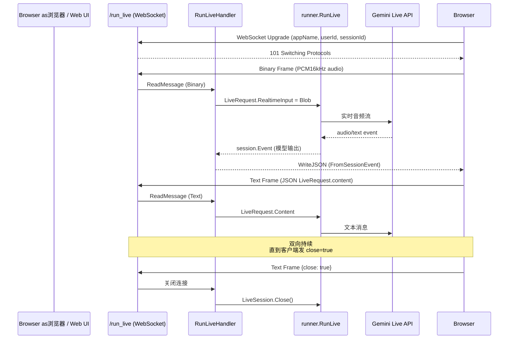

# Bidi Streaming：双向流式 WebSocket

> 本教程基于 [`examples/bidi/main.go`](../../../examples/bidi/main.go)。前面 [04-vertexai-agent-engine.md](./04-vertexai-agent-engine.md) 把 agent部署到 Vertex AI Agent Engine，本篇走另一条路：把 agent暴露成 **WebSocket端点**，让浏览器或客户端用 **双向流（bidirectional streaming）**实时互发音频 /文本 / 多模态数据，适合"实时语音助手"或"低延迟对话 UI"场景。
>
> 在 ADK Go 中，"双向流"对应一套和"单轮 `runner.Run`"完全不同的协议——`agent.LiveSession` + `agent.LiveRequest` + `agent.LiveRunConfig`，底层走 Gemini Live API（[`gemini-3.1-flash-live-preview`](../../../model/gemini) 模型）。[01-rest-server.md](./01-rest-server.md) 用的是一次性 `RunHandler`，[02-a2a-server.md](./02-a2a-server.md) 用的是 A2A JSON-RPC 流，本篇是第三种形态：**WebSocket + Live API**。

## 你将学到

- `agent.LiveSession` 接口（[`agent/live.go:22-28`](../../../agent/live.go)）和 `agent.LiveRequest` 结构——Live协议的"客户端到服务端"消息载体
- `agent.LiveRunConfig`（[`agent/live.go:37-49`](../../../agent/live.go)）的关键字段：`ResponseModalities` / `SpeechConfig` / `InputAudioTranscription` / `OutputAudioTranscription` / `RealtimeInputConfig`
- `RuntimeAPIController.RunLiveHandler`（[`server/adkrest/controllers/runtime.go:247`](../../../server/adkrest/controllers/runtime.go)）如何把 WebSocket升级 + Live Session收发循环串起来
- `controllers.NewRuntimeAPIController` 的7 个参数（[`server/adkrest/controllers/runtime.go:48`](../../../server/adkrest/controllers/runtime.go)），第7 个 `autoCreateSession`必须是 `true`——Live模式通常是新会话
-客户端通过 `/run_live?appName=...&userId=...&sessionId=...`升级 WebSocket，二进制帧是 PCM音频，文本帧是 JSON `models.LiveRequest`（[`server/adkrest/internal/models/runtime.go:60`](../../../server/adkrest/internal/models/runtime.go)）
- Live协议 vs SSE / WebSocket vs A2A 三种"流"的区别：协议层、流方向、典型延迟

## 前置条件

- [x] 已完成 [01-rest-server.md](./01-rest-server.md)（了解 `RuntimeAPIController` 是怎么暴露 REST + SSE 的）
- [x] 已完成 [01-getting-started/05-run-as-server.md](../01-getting-started/05-run-as-server.md)（知道 `gemini.NewModel` 的基本用法）
- [x] 已设置 `GOOGLE_API_KEY`（见 [00-prerequisites.md §3](../00-prerequisites.md)）
- [x] 已 `git clone` ADK仓库并 `go mod download`
- [x] 浏览器支持 Web Audio API（Chrome / Edge / Safari均可）

##核心概念

**"双向流式" =客户端和服务端都可以在同一条连接上独立、不间断地发数据**。它和 SSE（Server-Sent Events）有本质区别：SSE 是"服务端单向推流"，客户端发完一条消息后只能等响应；WebSocket双向流则可以一边推麦克风 PCM帧，一边收模型语音输出。Live API 的硬实时场景（语音对语音、视频帧、协同标注）几乎只能跑在双向流上。

ADK 把 Live协议的客户端消息抽象成 [`agent/live.go:27-35`](../../../agent/live.go) 的 `LiveRequest`——它有两个互斥字段：

- `RealtimeInput`（`any` 类型）：实际承载 `*genai.Blob`（音视频帧）、`*genai.ActivityStart` / `*genai.ActivityEnd`（开始/结束一段活动，比如一段语音）
- `Content`（`*genai.Content`）：标准多模态内容；当包含 `FunctionResponse` 时表示"对模型工具调用的回复"

模型配置封装在 [`agent/live.go:37-49`](../../../agent/live.go) 的 `LiveRunConfig`，最常用的三个字段是 `ResponseModalities`（决定回复是文本还是音频）、`InputAudioTranscription`（输入语音转写）和 `OutputAudioTranscription`（输出语音转写）——后者让 UI 既能播语音又能显示字幕。

`RuntimeAPIController.RunLiveHandler`（[`server/adkrest/controllers/runtime.go:247`](../../../server/adkrest/controllers/runtime.go)）是协议层，它把 WebSocket字节流翻译成 `LiveRequest`、把 `LiveSession` 输出翻译成 JSON事件流。客户端不需要自己实现 Live协议——只要遵循 ADK约定的 WebSocket消息格式即可：

- **二进制帧**：直接是 PCM音频数据，被映射成 `LiveRequest.RealtimeInput = *genai.Blob{MIMEType: "audio/pcm;rate=16000"}`（[`server/adkrest/controllers/runtime.go:330-339`](../../../server/adkrest/controllers/runtime.go)）
- **文本帧**：JSON序列化后的 `models.LiveRequest`（[`server/adkrest/internal/models/runtime.go:60`](../../../server/adkrest/internal/models/runtime.go)），包含 `content` / `blob` / `activityStart` / `activityEnd` / `close`

下图展示一次"用户说一句话 → 模型回语音 +字幕"完整数据流：



**看图指引**：

- **协议层**（`Ctrl`）只负责"翻译"：把 WebSocket 二进制帧翻成 `genai.Blob`，把 WebSocket文本帧翻成 `models.LiveRequest`，把 `session.Event`翻成 JSON。它不持有任何业务状态。
- **业务层**（`Runner` + `Gemini`）才是真正双向流的执行体。`Runner.RunLive` 返回 `(LiveSession, iter.Seq2[*session.Event, error], error)` 三元组——一个用于**上行**（`liveSession.Send(...)`），一个用于**下行**（`for event := range eventIter`）。两条流并行运转，互不阻塞。
- **客户端只看到两件事**：发帧（Binary 或 Text）、收 JSON `FromSessionEvent`。是否走 Live协议、是否转写音频、是否调工具——全部由服务端决定。客户端代码和"普通 WebSocket"无异。

##完整代码

完整源码在 [`examples/bidi/main.go`](../../../examples/bidi/main.go)（约105 行）：

```go
// examples/bidi/main.go
package main

import (
	"context"
	"fmt"
	"log"
	"net/http"
	"os"
	"path/filepath"
	"runtime"

	"google.golang.org/genai"

	"google.golang.org/adk/agent"
	"google.golang.org/adk/agent/llmagent"
	"google.golang.org/adk/model/gemini"
	"google.golang.org/adk/runner"
	"google.golang.org/adk/server/adkrest/controllers"
	"google.golang.org/adk/session"
	"google.golang.org/adk/tool"
	"google.golang.org/adk/tool/functiontool"
	"google.golang.org/adk/tool/geminitool"
)

func main() {
	log.SetOutput(os.Stdout)
	ctx := context.Background()

	model, err := gemini.NewModel(ctx, "gemini-3.1-flash-live-preview", &genai.ClientConfig{
		APIKey: os.Getenv("GOOGLE_API_KEY"),
	})
	if err != nil {
		log.Fatalf("Failed to create model: %v", err)
	}

	type EmptyArgs struct{}
	type MessageResult struct {
		Message string `json:"message"`
	}

	cameraTool, err := functiontool.New(functiontool.Config{
		Name: "camera_toggle",
		Description: "Turns the camera on or off.",
	}, func(ctx agent.ToolContext, args EmptyArgs) (MessageResult, error) {
		fmt.Println("Camera tool was called!")
		return MessageResult{Message: "Camera tool called successfully!"}, nil
	})
	if err != nil {
		log.Fatalf("Failed to create camera tool: %v", err)
	}

	a, err := llmagent.New(llmagent.Config{
		Name: "bidi-demo",
		Model: model,
		Description: "Agent optimized for real-time bidirectional streaming.",
		Instruction: "You are a real-time voice assistant.",
		Tools: []tool.Tool{
			geminitool.GoogleSearch{},
			cameraTool,
		},
	})
	if err != nil {
		log.Fatalf("Failed to create agent: %v", err)
	}

	// Create runner
	ss := session.InMemoryService()

	_, filename, _, ok := runtime.Caller(0)
	if !ok {
		log.Fatal("No caller information")
	}
	staticDir := filepath.Join(filepath.Dir(filename), "static")
	fs := http.FileServer(http.Dir(staticDir))
	http.Handle("/", fs)
	http.Handle("/static/", http.StripPrefix("/static/", fs))

	controller := controllers.NewRuntimeAPIController(ss, nil, agent.NewSingleLoader(a), nil,0, runner.PluginConfig{}, true)

	http.HandleFunc("/run_live", func(w http.ResponseWriter, req *http.Request) {
		err := controller.RunLiveHandler(w, req)
		if err != nil {
			log.Printf("RunLiveHandler failed: %v", err)
		}
	})

	fmt.Println("Serving UI on http://localhost:8081")
	log.Fatal(http.ListenAndServe(":8081", nil))
}
```

## 代码逐段讲解

###1.选 Live 模型（[`examples/bidi/main.go:44-49`](../../../examples/bidi/main.go)）

```go
model, err := gemini.NewModel(ctx, "gemini-3.1-flash-live-preview", &genai.ClientConfig{
 APIKey: os.Getenv("GOOGLE_API_KEY"),
})
```

Live协议**只能用 Live 系列模型**（`gemini-*-live-preview`命名），普通 `gemini-2.5-flash` 等不支持 Live API。原因：Live 模型在底层用 WebSocket 直接连 Gemini，而不是 HTTP一次性请求。`gemini-3.1-flash-live-preview` 是当前（2026-06）的最新 Live 模型。

###2. 注册自定义工具 `camera_toggle`（[`examples/bidi/main.go:51-65`](../../../examples/bidi/main.go)）

```go
type EmptyArgs struct{}
type MessageResult struct {
 Message string `json:"message"`
}

cameraTool, err := functiontool.New(functiontool.Config{
 Name: "camera_toggle",
 Description: "Turns the camera on or off.",
}, func(ctx agent.ToolContext, args EmptyArgs) (MessageResult, error) {
 fmt.Println("Camera tool was called!")
 return MessageResult{Message: "Camera tool called successfully!"}, nil
})
```

`functiontool.New` 的用法和普通工具完全一样（参见 [02-tools/01-functiontool.md](../02-tools/01-functiontool.md)）。但**在 Live模式下，工具调用是双向流的一部分**——模型看到 `camera_toggle` 可用，会在流式回复中途插入一个 function call 请求；`RunLiveHandler` 会把请求翻译成事件推给客户端，客户端再通过 `LiveRequest.Content` 带 `FunctionResponse`推回来。这是 Live协议的"工具回合"机制。

###3.装配 `bidi-demo` agent（[`examples/bidi/main.go:67-79`](../../../examples/bidi/main.go)）

```go
a, err := llmagent.New(llmagent.Config{
 Name: "bidi-demo",
 Model: model,
 Description: "Agent optimized for real-time bidirectional streaming.",
 Instruction: "You are a real-time voice assistant.",
 Tools: []tool.Tool{
 geminitool.GoogleSearch{},
 cameraTool,
 },
})
```

注意 `Instruction: "You are a real-time voice assistant."`——提示词明说"实时语音助手"，模型就会优先用 `ResponseModalities: Audio` 回复。普通 agent 的提示词写"回答用户问题"会被 Live模式误解。

###4.挂静态 UI 文件（[`examples/bidi/main.go:84-91`](../../../examples/bidi/main.go)）

```go
_, filename, _, ok := runtime.Caller(0)
if !ok {
 log.Fatal("No caller information")
}
staticDir := filepath.Join(filepath.Dir(filename), "static")
fs := http.FileServer(http.Dir(staticDir))
http.Handle("/", fs)
http.Handle("/static/", http.StripPrefix("/static/", fs))
```

`runtime.Caller(0)` 取当前 `main.go` 的绝对路径，再拼 `static/`目录。这是个常见的"同进程托管 UI静态文件"模式——`examples/bidi/static/` 里是浏览器端的聊天 UI（HTML + JS + Audio API）。这样整个 demo 只用一个进程、只占一个端口 `:8081`，UI 和 Live WS端点同源，避免 CORS。

###5.构造 `RuntimeAPIController`（[`examples/bidi/main.go:93`](../../../examples/bidi/main.go)）—— **关键一步**

```go
controller := controllers.NewRuntimeAPIController(ss, nil, agent.NewSingleLoader(a), nil,0, runner.PluginConfig{}, true)
```

构造签名在 [`server/adkrest/controllers/runtime.go:48`](../../../server/adkrest/controllers/runtime.go)：

```go
func NewRuntimeAPIController(sessionService session.Service, memoryService memory.Service, agentLoader agent.Loader, artifactService artifact.Service, sseTimeout time.Duration, pluginConfig runner.PluginConfig, autoCreateSession bool) *RuntimeAPIController
```

7 个参数逐个对应：

| # | 参数 | 本例取值 | 说明 |
|---|---|---|---|
|1 | `sessionService` | `ss := session.InMemoryService()` | 会话存储（[02-tools/06-load-artifacts.md](../02-tools/06-load-artifacts.md)提到过 InMemory 后端） |
|2 | `memoryService` | `nil` | 不需要 long-term memory（Live 是即时对话） |
|3 | `agentLoader` | `agent.NewSingleLoader(a)` | 单 agent加载器（和 [02-a2a-server.md](./02-a2a-server.md)一样） |
|4 | `artifactService` | `nil` | 不需要持久化二进制产物 |
|5 | `sseTimeout` | `0` | SSE 超时（这里不用 SSE，留0） |
|6 | `pluginConfig` | `runner.PluginConfig{}` | 空 plugin 配置 |
|7 | `autoCreateSession` | **`true`** | **关键**：Live模式下用户通常没有现成 session，必须 auto-create |

第7 个参数 `true` 是 bidi模式的**强制要求**。`RunLiveHandler`（[`server/adkrest/controllers/runtime.go:267-269`](../../../server/adkrest/controllers/runtime.go)）会校验 URL query 必须有 `appName`、`userId`、`sessionId`；如果 session 不存在，自动用 `r.RunLive`（[`runner/runner.go:328`](../../../runner/runner.go)）的 auto-create路径新建。

###6. 把 `/run_live`挂到 controller（[`examples/bidi/main.go:95-100`](../../../examples/bidi/main.go)）

```go
http.HandleFunc("/run_live", func(w http.ResponseWriter, req *http.Request) {
 err := controller.RunLiveHandler(w, req)
 if err != nil {
 log.Printf("RunLiveHandler failed: %v", err)
 }
})
```

这一步把 WebSocket升级 + Live Session收发逻辑全部转交给 `RunLiveHandler`。handler内部（[`server/adkrest/controllers/runtime.go:247-388`](../../../server/adkrest/controllers/runtime.go)）做了五件事：

1. `websocket.Upgrader.Upgrade`（line271）—— HTTP升级到 WebSocket
2. 从 query拿 `appName / userId / sessionId`（line253-269）
3. `r.RunLive`（line301）启动 Live Session，返回 `(LiveSession, eventIter, error)`——**上行通道 + 下行通道**
4. 起 goroutine读 WebSocket帧（line317-372）—— 二进制帧 → `Blob`，文本帧 → `LiveRequest`
5. 主循环 `for event := range eventIter`（line374-385）—— 把 `session.Event`序列化成 JSON推回客户端

注意 `eventIter` 是 `iter.Seq2[*session.Event, error]`——Go1.23+迭代器签名。每收到一个 event 就 `WriteJSON(models.FromSessionEvent(*event))`推一次。这是 ADK Go2026全面采用 iterator后的统一风格（参见 [01-core-flows.md](../../architecture/01-core-flows.md) F5）。

###7.启动 HTTP server（[`examples/bidi/main.go:102-103`](../../../examples/bidi/main.go)）

```go
fmt.Println("Serving UI on http://localhost:8081")
log.Fatal(http.ListenAndServe(":8081", nil))
```

监听 `:8081`。注意 `nil` mux——使用了 default mux，前面 `http.Handle("/", fs)` 和 `http.HandleFunc("/run_live", ...)` 都注册到了 default mux。

##准备与运行

###步骤1：确认 API key

```bash
echo $GOOGLE_API_KEY # 应输出 AIza...
```

未设置时回到 [00-prerequisites.md §3](../00-prerequisites.md) 获取。

###步骤2：启动 bidi演示

```bash
go run ./examples/bidi
```

成功时日志末尾会打印：

```
Serving UI on http://localhost:8081
```

###步骤3：浏览器交互

打开浏览器访问 [http://localhost:8081](http://localhost:8081)。页面会：

1. 请求麦克风权限（Live协议需要）
2. 建立 WebSocket 连接：`ws://localhost:8081/run_live?appName=bidi-demo&userId=local-user&sessionId=local-session`
3.录制麦克风音频，按 PCM16kHz编码成二进制帧发送
4.接收模型 JSON事件流，播放 `audio`字段、显示 `text` 转写字幕

**测试输入1：纯语音**

点击 UI 上的"按住说话"按钮，说一句中文。期望：模型几秒内回一段语音 +字幕。

**测试输入2：工具调用**

说"帮我搜索今天天气"。期望：模型调用 `GoogleSearch`（`geminitool.GoogleSearch{}` 在 agent 注册），返回搜索结果摘要。

**测试输入3：自定义工具**

说"打开摄像头"。期望：模型调用 `camera_toggle`（[`examples/bidi/main.go:56-62`](../../../examples/bidi/main.go)），服务端日志打印 `Camera tool was called!`，UI收到工具响应后继续对话。

###步骤4：用 curl手工测试 WebSocket

如果想绕过浏览器直接验证协议层：

```bash
# 安装 wscat（npm i -g wscat）
wscat -c "ws://localhost:8081/run_live?appName=bidi-demo&userId=u1&sessionId=s1"

# 在 wscat提示符下输入 JSON文本帧
> {"content":{"role":"user","parts":[{"text":"hello"}]}}
```

期望：服务端推回若干 JSON事件，至少包含 `{"author":"bidi-demo","content":{"role":"model","parts":[{"text":"..."}]}}`。

##常见错误

- **`failed to upgrade to websocket: request origin not allowed by Upgrader`** —— gorilla/websocket 默认拒绝跨域。生产部署必须显式配置 `Upgrader.CheckOrigin`（当前 [`server/adkrest/controllers/runtime.go:248`](../../../server/adkrest/controllers/runtime.go) 用默认值，本地 demo 不影响）。
- **`agent does not support Live Run`** —— 模型不是 Live 系列（用了 `gemini-2.5-flash`之类）。换成 `gemini-3.1-flash-live-preview`。
- **`appName, userId, and sessionId are required`** —— URL query漏参数。必须三段都齐：`?appName=...&userId=...&sessionId=...`。
- **`agent bidi-demo not found`** —— `NewSingleLoader(a)` 注册的 agent name 和 `appName` 不一致，或者没用 `autoCreateSession: true`。检查 [`examples/bidi/main.go:93`](../../../examples/bidi/main.go) 的最后一个参数。
- **WebSocket 连接秒断、日志 `WebSocket read error`** —— 通常是反向代理（nginx / cloudflare）缓冲了 WebSocket帧。需要配置代理支持 `Upgrade: websocket`。
- **语音没声音但字幕有** ——浏览器 Audio API 解码失败，常见原因是 UI 的 PCM采样率和 server 不一致。server端默认 `audio/pcm;rate=16000`（[`server/adkrest/controllers/runtime.go:333`](../../../server/adkrest/controllers/runtime.go)），前端需要按16kHz 解码。
- **`RunLive failed: model returned error`** —— Live 模型配额用完。Live API走和普通 API **不同** 的配额池，去 Google AI Studio 控制台检查 Live API配额。

##关键 API 小结

| API |位置 |作用 |
|---|---|---|
| `agent.LiveSession` | [`agent/live.go:22`](../../../agent/live.go) | Live 会话接口：`Send(LiveRequest) + Close()` |
| `agent.LiveRequest` | [`agent/live.go:28`](../../../agent/live.go) |客户端消息载体：`RealtimeInput`（Blob / ActivityStart / ActivityEnd）+ `Content`（含 FunctionResponse） |
| `agent.LiveRunConfig` | [`agent/live.go:37`](../../../agent/live.go) | Live 配置：`ResponseModalities` / `SpeechConfig` / `InputAudioTranscription` / `OutputAudioTranscription` / `RealtimeInputConfig` / `MaxLLMCalls` 等 |
| `Runner.RunLive` | [`runner/runner.go:328`](../../../runner/runner.go) |启动 Live 会话，返回 `(LiveSession, iter.Seq2[*session.Event, error], error)` 三元组 |
| `llmAgent.RunLive` | [`agent/llmagent/llmagent.go:396`](../../../agent/llmagent/llmagent.go) | LLM agent 实现 Live 接口，包装 `llminternal.Flow.RunLive` |
| `RuntimeAPIController.NewRuntimeAPIController` | [`server/adkrest/controllers/runtime.go:48`](../../../server/adkrest/controllers/runtime.go) |7参构造，第7 个 `autoCreateSession` 在 Live模式必须 `true` |
| `RuntimeAPIController.RunLiveHandler` | [`server/adkrest/controllers/runtime.go:247`](../../../server/adkrest/controllers/runtime.go) | 把 WebSocket升级 + Live收发循环串起来 |
| `models.LiveRequest` | [`server/adkrest/internal/models/runtime.go:60`](../../../server/adkrest/internal/models/runtime.go) | WebSocket文本帧 JSON 结构：`content` / `blob` / `activityStart` / `activityEnd` / `close` |
| `geminitool.GoogleSearch` | `model/gemini` | Live模式可用的内置工具 |

##延伸阅读

-架构文档：[F5 Live双向流](../../architecture/01-core-flows.md#f5-live-双向流) —— `LiveSession` / `LiveRequest` / `LiveRunConfig` 三件套的设计动机
-架构文档：[核心抽象一览](../../architecture/00-overview.md#3-核心抽象一览) —— `Agent` / `Runner` / `LiveSession` 在 bidi协议里各自扮演的角色
-架构文档：[server 模块](../../architecture/03-modules/10-server.md) —— `adka2a` / `adkrest` / `agentengine`三大 server适配层 + Live端点总览
-源码：[`examples/bidi/main.go`](../../../examples/bidi/main.go) —— 本教程讲解的105 行可运行示例
-源码：[`agent/live.go`](../../../agent/live.go) —— `LiveSession` / `LiveRequest` / `LiveRunConfig`三个核心结构体定义
-源码：[`runner/runner.go`](../../../runner/runner.go) —— `Runner.RunLive` 实现，验证 `autoCreateSession`路径
-源码：[`server/adkrest/controllers/runtime.go`](../../../server/adkrest/controllers/runtime.go) —— `RunLiveHandler` WebSocket升级 +收发循环全在 line247-388
-源码：[`server/adkrest/internal/models/runtime.go`](../../../server/adkrest/internal/models/runtime.go) —— `models.LiveRequest` JSON结构和 `FromSessionEvent`序列化器
-衍生示例：[`examples/bidi/streamingtool/main.go`](../../../examples/bidi/streamingtool/main.go) —— Live + 流式工具（按 `stop_streaming` 控制信号中止）
-衍生示例：[`examples/bidi/sequential/main.go`](../../../examples/bidi/sequential/main.go) —— Live + Sequential Agent（Idea Generator → Story Teller）
-未来子项目深读占位：`llminternal.Flow.RunLive` 的 `ResponseProcessors`链如何处理 Live event；`LiveRunConfig.SessionResumption` 的断线续传语义
