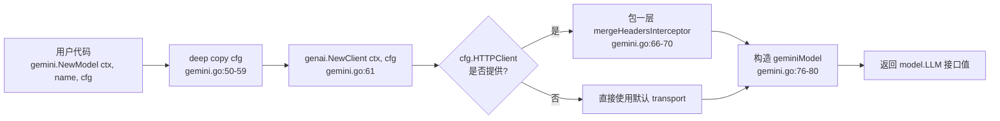

# Gemini：使用 Google Gemini 模型

> 本教程使用**自定义 `main.go`**（不基于 `examples/`），聚焦 `model/gemini` 包本身的 API 契约与运行链路。

## 你将学到

- ADK 的 `model.LLM` 接口与 `gemini` 适配器的对应关系
- `gemini.NewModel` 的三个入参：`ctx` / `modelName` / `*genai.ClientConfig`
- `model.LLMRequest` 中 `Model` 字段如何"覆盖"构造期设置的默认模型
- 同步 / 流式两种调用模式在 `gemini` 适配器内部的差异
- 选模型名（`gemini-2.5-flash` vs `gemini-3.1-flash-lite` 等）时的取舍

## 前置条件

- [x] 已完成 [00-prerequisites.md](../00-prerequisites.md)
- [x] 已完成 [01-getting-started/01-hello-world.md](../01-getting-started/01-hello-world.md) —— 看过 `gemini.NewModel` 怎么被 agent 使用
- [x] 已设置 `GOOGLE_API_KEY` 环境变量
- [x] 本机可访问 `generativelanguage.googleapis.com`

## 核心概念

**`model.LLM` 是 ADK 的"模型抽象接口"**，定义在 [`model/llm.go:26`](../../../model/llm.go)：只要实现 `Name()` 与 `GenerateContent(ctx, req, stream)` 两个方法，就能挂到任意 `llmagent` 上。`model/gemini` 子包是这个接口的"官方实现"——它在官方 Go SDK [`google.golang.org/genai`](https://pkg.go.dev/google.golang.org/genai) 之上做了一层薄封装，把 SDK 的 `*genai.Client` 包成 `model.LLM` 接口值。

**`geminiModel` 结构体**（[`model/gemini/gemini.go:36`](../../../model/gemini/gemini.go)）是该实现的私有类型，对外只暴露 `model.LLM` 接口：

```go
// model/gemini/gemini.go:36
type geminiModel struct {
    client             *genai.Client
    name               string
    versionHeaderValue string
}
```

三个字段各司其职：`client` 复用 genai SDK 提供的 HTTP 客户端（不用我们自己处理重试、连接池）；`name` 是构造时指定的默认模型名；`versionHeaderValue` 是 ADK 在每次请求加到 `x-goog-api-client` / `user-agent` 上的版本字符串，作用是让 Google 后端能统计 ADK 调用的占比。

**`genai.ClientConfig` 是入口**：`APIKey`、`Backend`、`HTTPClient` 等所有连接参数都从这里进。ADK 不自己重写 SDK 配置，而是"原样透传 + 补默认"。这意味着你学到的 `genai.ClientConfig` 知识，在 ADK 之外也能直接用——切换到 Vertex AI 后端、设置代理、加自定义 transport，都在一处配置。



**看图指引**：

- `gemini.NewModel` 的核心是三步：拷贝配置、初始化 SDK 客户端、装入私有结构体。
- 拷贝配置（`gemini.go:50-59`）是为了避免**改写调用方的 `cfg` 或底层 `http.Client`**——这是 Go HTTP 客户端并发安全的常见陷阱。
- `mergeHeadersInterceptor`（`gemini.go:175-190`）会在每次请求时把 `x-goog-api-client` / `user-agent` 这两个 header 用空格连接多次出现的值，避免 genai SDK 自身加的版本字符串被覆盖。

## 完整代码

> 教程使用**自定义 `main.go`**：每个教程都自带一个独立的可运行入口，便于裁剪到最小依赖。

```go
// docs/tutorials/05-llm-providers/01-gemini/main.go
package main

import (
	"context"
	"fmt"
	"log"
	"os"

	"google.golang.org/genai"

	"google.golang.org/adk/agent"
	"google.golang.org/adk/agent/llmagent"
	"google.golang.org/adk/cmd/launcher"
	"google.golang.org/adk/cmd/launcher/full"
	"google.golang.org/adk/model/gemini"
)

func main() {
	ctx := context.Background()

	// 1. 选模型名 —— 不同模型在成本 / 速度 / 能力上取舍不同
	const defaultModelName = "gemini-2.5-flash"

	model, err := gemini.NewModel(ctx, defaultModelName, &genai.ClientConfig{
		APIKey: os.Getenv("GOOGLE_API_KEY"),
	})
	if err != nil {
		log.Fatalf("Failed to create model: %v", err)
	}

	// 2. 把 model 挂到 llmagent
	a, err := llmagent.New(llmagent.Config{
		Name:        "echo_agent",
		Model:       model,
		Description: "Agent that briefly answers.",
		Instruction: "Answer in one short sentence. No tools.",
	})
	if err != nil {
		log.Fatalf("Failed to create agent: %v", err)
	}

	fmt.Printf("Using model: %s (Name() = %q)\n", defaultModelName, model.Name())

	config := &launcher.Config{AgentLoader: agent.NewSingleLoader(a)}
	l := full.NewLauncher()
	if err = l.Execute(ctx, config, os.Args[1:]); err != nil {
		log.Fatalf("Run failed: %v\n\n%s", err, l.CommandLineSyntax())
	}
}
```

> **代码与 `examples/quickstart/main.go` 的差异**：本教程不挂任何 `Tools`，刻意保留"裸模型"形态，让读者把注意力放在 `gemini.NewModel` 本身（而不是工具调用）。

## 代码逐段讲解

### 1. 选模型名

```go
const defaultModelName = "gemini-2.5-flash"
```

`modelName` 是 `gemini.NewModel` 的第二个参数（[`model/gemini/gemini.go:49`](../../../model/gemini/gemini.go)），**必须在调用时确认存在且可用**。常见可选值：

| 模型名 | 定位 | 备注 |
|---|---|---|
| `gemini-2.5-flash` | 速度优先 / 成本优先 | 本教程默认；2.5 代的稳定主力 |
| `gemini-2.5-pro` | 质量优先 | 长上下文、复杂推理更稳 |
| `gemini-2.5-flash-lite` | 极致低成本 | 简单 Q&A 场景 |
| `gemini-3.1-flash-lite` | 更新一代 lite | `examples/quickstart` 默认 |

> 模型名以字符串硬编码——ADK 不维护"模型名 → 能力"映射表，切换时直接换字符串。

### 2. 构造 `gemini.NewModel`

```go
model, err := gemini.NewModel(ctx, defaultModelName, &genai.ClientConfig{
    APIKey: os.Getenv("GOOGLE_API_KEY"),
})
```

签名见 [`model/gemini/gemini.go:49`](../../../model/gemini/gemini.go)：

```go
// model/gemini/gemini.go:49
func NewModel(ctx context.Context, modelName string, cfg *genai.ClientConfig) (model.LLM, error)
```

三件事：

1. `ctx` 用于初始化 `genai.Client`，**不会**影响后续请求的超时。后续每次 `GenerateContent` 调用都用调用方新传的 `ctx`。
2. `modelName` 是"默认模型"——`gemini.go:120-125` 的 `modelName(req)` 方法会先看 `req.Model` 是否被 `BeforeModelCallback` 覆写，没覆写才用构造时这个值。
3. `cfg` 决定连接：API key、Backend（`BackendGeminiAPI` / `BackendVertexAI`）、HTTP 客户端、自定义 transport 都在这里。

**`cfg` 可传 `nil`**：此时走 genai SDK 的默认行为（读 `GOOGLE_API_KEY` 环境变量等）。但本教程**显式传 `&genai.ClientConfig{APIKey: ...}`**，意图更清晰。

### 3. 跑一次同步请求（构造期验证）

```go
fmt.Printf("Using model: %s (Name() = %q)\n", defaultModelName, model.Name())
```

`Name()` 是 `model.LLM` 接口要求的两个方法之一（[`model/llm.go:27`](../../../model/llm.go)），在 gemini 适配器中直接返回构造时存的 `m.name`（[`model/gemini/gemini.go:83`](../../../model/gemini/gemini.go)）。打印 `Name()` 让我们确认 model 真的绑到了默认模型上——避免"传错字符串还以为跑对了"。

### 4. 挂到 `llmagent`

```go
a, _ := llmagent.New(llmagent.Config{
    Name:        "echo_agent",
    Model:       model,
    Instruction: "Answer in one short sentence. No tools.",
})
```

agent 拿到 model 后，每次 `runner.Run` 时都会把上下文塞进 `*model.LLMRequest` 调 `model.GenerateContent`。详见 [F1 单轮对话](../../architecture/01-core-flows.md#f1-单轮对话)（架构文档待补占位）。

### 5. 启动 console

```go
l := full.NewLauncher()
l.Execute(ctx, config, os.Args[1:])
```

`full` launcher 的 `console` 模式会逐轮读取 stdin、塞进新 `*model.LLMRequest`、调用 `model.GenerateContent(ctx, req, true)`（注意 `stream=true`）。gemini 适配器在流式路径走 [`model/gemini/gemini.go:141-160`](../../../model/gemini/gemini.go) 的 `generateStream`，内部用 `llminternal.NewStreamingResponseAggregator` 增量组装多个 `*genai.GenerateContentResponse` 为 `*model.LLMResponse`。

## 准备与运行

### 步骤 1：获取凭证

到 [Google AI Studio](https://aistudio.google.com/apikey) 申请 `GOOGLE_API_KEY`（以 `AIza` 开头）。详见 [00-prerequisites.md §3](../00-prerequisites.md#3-获取-google-api-key)。

### 步骤 2：设置环境变量

```bash
export GOOGLE_API_KEY=AIza...你的key...
```

### 步骤 3：保存并运行

把上面"完整代码"段保存为 `main.go`，放在任意空目录（不要放在 ADK 仓库根目录，避免 `go.mod` 冲突），并在同目录写一个最小 `go.mod`：

```bash
mkdir gemini-demo && cd gemini-demo
# 把上面的 main.go 粘到当前目录
cat > go.mod <<'EOF'
module example.com/gemini-demo

go 1.23
EOF

go mod edit -replace google.golang.org/adk=/home/wu/oneone/adk
go mod tidy
go run . console
```

首次 `go mod tidy` 会拉取 `google.golang.org/genai` 等依赖，约 10-30 秒。

### 步骤 4：测试输入

```
User: Hello.
[echo_agent]: Hi there.

User: What is 2+2?
[echo_agent]: Four.
```

按 `Ctrl-D` 退出 console 模式。

## 常见错误

- **`Failed to create model: ... GOOGLE_API_KEY`** —— `os.Getenv` 返回空字符串时 genai SDK 仍会接受，但首次请求会被远端以 `400 API key not valid` 拒掉。本教程在构造期打印 `Name()`，能让你**早于请求**确认 key 进入了 `ClientConfig`。
- **`failed to call model: ... NOT_FOUND`** —— 模型名拼错或该模型在你账号所在的 region 不可用。换成 `gemini-2.5-flash` 通用主力即可。
- **`empty response`** —— gemini 适配器在 `Candidates` 为空时返回这个错误（[`model/gemini/gemini.go:133-136`](../../../model/gemini/gemini.go)）。通常是请求被内容安全过滤后被 SDK 截断，检查 `Instruction` 是否触发了 safety 策略。
- **把 key 写进代码** —— 切勿。把 `APIKey: os.Getenv("GOOGLE_API_KEY")` 改成字面量等于把生产密钥交给 git。
- **同步/流式混用 `req.Config.HTTPOptions.Headers`** —— gemini 适配器在 `GenerateContent` 入口处会**覆写** `x-goog-api-client` 与 `user-agent`（[`model/gemini/gemini.go:96-99`](../../../model/gemini/gemini.go)），自定义时不要改这两个。

## 关键 API 小结

| API | 位置 | 作用 |
|---|---|---|
| `model.LLM` | [`model/llm.go:26`](../../../model/llm.go) | ADK 的"模型抽象接口" |
| `gemini.NewModel` | [`model/gemini/gemini.go:49`](../../../model/gemini/gemini.go) | 创建 Gemini 模型实例，返回 `model.LLM` |
| `geminiModel` | [`model/gemini/gemini.go:36`](../../../model/gemini/gemini.go) | gemini 适配器的私有实现结构体 |
| `geminiModel.GenerateContent` | [`model/gemini/gemini.go:88`](../../../model/gemini/gemini.go) | 单入口；根据 `stream` 派发到同步或流式 |
| `geminiModel.Name` | [`model/gemini/gemini.go:83`](../../../model/gemini/gemini.go) | 返回构造时指定的默认模型名 |
| `geminiModel.modelName` | [`model/gemini/gemini.go:120`](../../../model/gemini/gemini.go) | 优先 `req.Model`，回退到构造期值 |
| `genai.ClientConfig` | [`google.golang.org/genai`](https://pkg.go.dev/google.golang.org/genai) | SDK 提供的连接配置（APIKey / Backend / HTTPClient 等） |
| `mergeHeadersInterceptor` | [`model/gemini/gemini.go:175`](../../../model/gemini/gemini.go) | 自定义 `http.RoundTripper`，合并版本头 |

## 延伸阅读

- 架构文档：[顶层架构：model 模块](../../architecture/03-modules/02-model.md)（待补）—— 解释 `model.LLM` 接口的设计动机与各 provider 适配器关系
- 架构文档：[F1 单轮对话](../../architecture/01-core-flows.md#f1-单轮对话)（待补） —— 展示 `model.LLMRequest` 是怎么从 runner 走到 `GenerateContent` 的
- 源码：[`model/gemini/gemini.go`](../../../model/gemini/gemini.go) —— 本教程拆解的全部代码
- 源码：[`model/llm.go`](../../../model/llm.go) —— `model.LLM` 接口的最小定义
- 子项目深读占位：gemini 适配器的 `mergeHeadersInterceptor` 与 `maybeAppendUserContent`（前者是 SDK 集成层、后者是"无用户输入也能调"边界条件），将并入后续 `model` 模块深读文档
- 下一教程：[02-apigee.md](./02-apigee.md) —— 当你需要经过 Apigee 网关调用 Gemini 时
