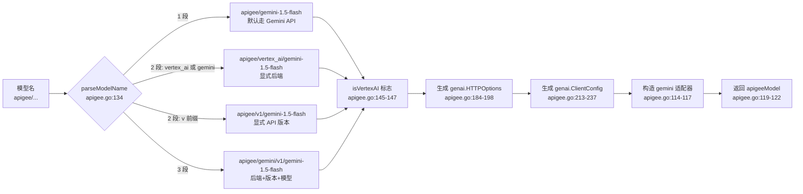

# Apigee Gateway：通过 Apigee 网关路由多种 LLM

> 本教程使用**自定义 `main.go`**（不基于 `examples/`），聚焦 `model/apigee` 适配器的模型名解析、网关配置与多后端路由。

## 你将学到

- `apigee.NewModel` 的"模型名 DSL"：`apigee/<backend>[/<version>]/<modelID>` 四种合法写法
- 通过 `APIGEE_PROXY_URL` 环境变量与 `WithProxyURL` 选项把请求路由到 Apigee 网关
- `apigee/` 前缀的语义：自动识别走 Gemini API 还是 Vertex AI
- `WithCustomHeaders` 在网关层注入鉴权 / 租户头的方法
- `apigeeModel` 是 `geminiModel` 的"代理壳"——真正的 SDK 调用仍走 `model/gemini`

## 前置条件

- [x] 已完成 [00-prerequisites.md](../00-prerequisites.md)
- [x] 已完成 [05-llm-providers/01-gemini.md](./01-gemini.md) —— 看过 `gemini.NewModel` 的入口签名
- [x] 已设置 `GOOGLE_API_KEY`（Gemini API 后端）或 `GOOGLE_CLOUD_PROJECT` + `GOOGLE_CLOUD_LOCATION`（Vertex AI 后端）
- [x] 已有 Apigee 网关代理 URL（无真实网关时可使用 `https://test.apigee.net` 做连通性测试）

## 核心概念

**`model/apigee` 适配器是 `model/gemini` 的"代理壳"**：它不直接调 Google 后端，而是把所有 HTTP 请求重定向到企业内 Apigee 网关，再由网关统一做认证、配额、审计、路由分发。`apigeeModel`（[`model/apigee/apigee.go:45`](../../../model/apigee/apigee.go)）只保存一个 `delegate model.LLM`（实际就是 `geminiModel`）与 `name` 字符串：

```go
// model/apigee/apigee.go:45
type apigeeModel struct {
    delegate model.LLM
    name     string
}
```

`GenerateContent` 直接转发到 `delegate`（[`model/apigee/apigee.go:130`](../../../model/apigee/apigee.go)）—— 所有 genai SDK 兼容的流式 / 工具调用行为都"继承"自 gemini 适配器。

**模型名 DSL 是适配器最关键的设计**：它用一个字符串同时表达"我要走 Apigee"+"我用什么后端"+"我用什么 API 版本"+"我要调哪个模型"。`parseModelName`（[`model/apigee/apigee.go:134`](../../../model/apigee/apigee.go)）把这四件事压进四种合法写法里，解析出一个 `modelInfo`（[`model/apigee/apigee.go:39`](../../../model/apigee/apigee.go)）：

```go
// model/apigee/apigee.go:39
type modelInfo struct {
    modelID    string
    apiVersion string
    isVertexAI bool
}
```



**看图指引**：

- `parseModelName` 不允许"两段都不属于已知关键字"的写法（[`model/apigee/apigee.go:170-172`](../../../model/apigee/apigee.go)），所以 `apigee/openai/v1/gpt` 会被立刻拒绝——这避免了网关被误配成 OpenAI 后端。
- `isVertexAI` 的判定优先级（[`model/apigee/apigee.go:145-147`](../../../model/apigee/apigee.go)）是"显式 `apigee/vertex_ai/...` > 显式 `apigee/gemini/...` > 环境变量 `GOOGLE_GENAI_USE_VERTEXAI` > 默认 Gemini API"——这与 `genai` SDK 的优先级一致。
- HTTP 头在 `generateHTTPOptions`（[`model/apigee/apigee.go:184`](../../../model/apigee/apigee.go)）里只复制用户传入的键值对，不会覆盖 gemini 适配器后续要加的 `x-goog-api-client` / `user-agent` 头。

## 完整代码

> 教程使用**自定义 `main.go`**：演示三种合法模型名 + 走 Apigee 网关的最简路径。

```go
// docs/tutorials/05-llm-providers/02-apigee-gateway/main.go
package main

import (
	"context"
	"fmt"
	"log"
	"net/http"
	"os"

	"google.golang.org/adk/agent"
	"google.golang.org/adk/agent/llmagent"
	"google.golang.org/adk/cmd/launcher"
	"google.golang.org/adk/cmd/launcher/full"
	"google.golang.org/adk/model/apigee"
)

func main() {
	ctx := context.Background()

	// 1. 选模型名 —— apigee/ 前缀 + 1~3 段路径都是合法写法
	//    1 段：apigee/<modelID>                -> 默认 Gemini API 后端
	//    2 段：apigee/vertex_ai/<modelID>      -> 显式 Vertex AI 后端
	//    2 段：apigee/<v1|v1beta>/<modelID>    -> 显式 API 版本
	//    3 段：apigee/<gemini|vertex_ai>/<v1>/<modelID>
	const defaultModelName = "apigee/gemini-1.5-flash"

	// 2. 构造 apigee 适配器 —— 走 Apigee 网关
	model, err := apigee.NewModel(ctx, defaultModelName,
		apigee.WithProxyURL(os.Getenv("APIGEE_PROXY_URL")),
		apigee.WithCustomHeaders(http.Header{
			"X-Apigee-Client": []string{"adk-tutorial"},
		}),
	)
	if err != nil {
		log.Fatalf("Failed to create apigee model: %v", err)
	}

	// 3. 挂到 llmagent
	a, err := llmagent.New(llmagent.Config{
		Name:        "apigee_agent",
		Model:       model,
		Description: "Agent that goes through Apigee gateway.",
		Instruction: "Answer in one short sentence. No tools.",
	})
	if err != nil {
		log.Fatalf("Failed to create agent: %v", err)
	}

	fmt.Printf("Using model: %s (Name() = %q)\n", defaultModelName, model.Name())

	config := &launcher.Config{AgentLoader: agent.NewSingleLoader(a)}
	l := full.NewLauncher()
	if err = l.Execute(ctx, config, os.Args[1:]); err != nil {
		log.Fatalf("Run failed: %v\n\n%s", err, l.CommandLineSyntax())
	}
}
```

> **代码与 `examples/` 的差异**：本教程不基于任何 `examples/.../main.go`——`examples/` 目录暂无 Apigee 演示，刻意保持"裸模型"形态便于看清 `apigee.NewModel` 本身。

## 代码逐段讲解

### 1. 模型名字符串的四种合法写法

```go
const defaultModelName = "apigee/gemini-1.5-flash"
```

`apigee.NewModel` 的第二个参数是 `modelName`（[`model/apigee/apigee.go:84`](../../../model/apigee/apigee.go)），必须以 `apigee/` 为前缀，否则 `parseModelName` 立刻返回 `invalid model string`（[`model/apigee/apigee.go:135-137`](../../../model/apigee/apigee.go)）。合法形态如下（来自 [`model/apigee/apigee_test.go:50-55`](../../../model/apigee/apigee_test.go)）：

| 写法 | 含义 |
|---|---|
| `apigee/gemini-1.5-flash` | 1 段：默认 Gemini API 后端，无显式 API 版本 |
| `apigee/v1/gemini-1.5-flash` | 2 段：`v1` 是 API 版本；后端看环境变量 |
| `apigee/vertex_ai/gemini-1.5-flash` | 2 段：显式 Vertex AI 后端 |
| `apigee/gemini/v1/gemini-1.5-flash` | 3 段：后端 + API 版本 + 模型 ID |
| `apigee/vertex_ai/v1beta/gemini-1.5-flash` | 3 段：Vertex AI + `v1beta` + 模型 |

注意 `apigee/openai/v1/gpt` 会被拒绝（[`model/apigee/apigee_test.go:97`](../../../model/apigee/apigee_test.go)）——目前只支持 `gemini` / `vertex_ai` 两种后端名，这是网关配置管控"白名单"的体现。

### 2. 用 `WithProxyURL` 指定 Apigee 网关

```go
model, err := apigee.NewModel(ctx, defaultModelName,
    apigee.WithProxyURL(os.Getenv("APIGEE_PROXY_URL")),
    apigee.WithCustomHeaders(http.Header{...}),
)
```

签名见 [`model/apigee/apigee.go:84`](../../../model/apigee/apigee.go)：

```go
// model/apigee/apigee.go:84
func NewModel(ctx context.Context, modelName string, opts ...Option) (*apigeeModel, error)
```

返回的 `*apigeeModel` 实现了 `model.LLM` 接口，调用方无需感知底层细节。`Option` 模式是 Go 配置惯用法——`WithProxyURL` / `WithCustomHeaders` / `WithHTTPClient` 三个选项（[`model/apigee/apigee.go:62`](../../../model/apigee/apigee.go) – [`model/apigee/apigee.go:80`](../../../model/apigee/apigee.go)）都是闭包形式的 setter，落到 `Config` 结构体（[`model/apigee/apigee.go:51`](../../../model/apigee/apigee.go)）。

`WithProxyURL` 会覆写从 `APIGEE_PROXY_URL` 环境变量读到的值；如果两者都为空，`resolveProxyURL` 之后 `NewModel` 会返回 `APIGEE_PROXY_URL environment variable not set`（[`model/apigee/apigee.go:101-103`](../../../model/apigee/apigee.go)）。

### 3. `WithCustomHeaders` 注入网关头

```go
apigee.WithCustomHeaders(http.Header{
    "X-Apigee-Client": []string{"adk-tutorial"},
})
```

`CustomHeaders` 在 `generateHTTPOptions` 里被复制到一个**新**的 `http.Header`（[`model/apigee/apigee.go:188-193`](../../../model/apigee/apigee.go)）——避免修改调用方传入的 map 引用。然后这些头被透传到 `genai.HTTPOptions.Headers`，最终由 gemini SDK 在每次 HTTP 请求时附加。常见用途：

- `Authorization: Bearer <token>` —— 网关层的额外令牌（不同于 Google API key）
- `X-Apigee-Client` —— 客户端标识，用于网关侧的流量分析
- `X-Tenant-Id` —— 多租户企业内部的租户隔离头

注意不要覆盖 `x-goog-api-client` 与 `user-agent`——gemini 适配器在 `GenerateContent` 入口会强制覆写这两个版本头。

### 4. 挂到 agent 并跑 console

```go
a, _ := llmagent.New(llmagent.Config{...})
config := &launcher.Config{AgentLoader: agent.NewSingleLoader(a)}
l := full.NewLauncher()
l.Execute(ctx, config, os.Args[1:])
```

这段与 [01-gemini.md](./01-gemini.md) 完全一致。差异在于 `Model` 字段是 `apigeeModel` 而非 `geminiModel`——runner 看到的只是 `model.LLM` 接口值。详见架构文档 [F1 单轮对话](../../architecture/01-core-flows.md#f1-单轮对话)。

## 准备与运行

### 步骤 1：获取 Apigee 代理 URL

向平台 / SRE 团队申请一个可路由到 Gemini 后端的 Apigee 代理 URL，形如：

```
https://<org>-<env>.apigee.net/google-genai/v1
```

无真实网关时，可用 `https://test.apigee.net` 做"构造期验证"——`apigee.NewModel` 不会发请求，只有在 `console` 模式输入第一句话时才会真正发起 HTTP 调用。

### 步骤 2：设置环境变量

```bash
export APIGEE_PROXY_URL=https://<your-org>.apigee.net/google-genai/v1
export GOOGLE_API_KEY=AIza...你的key...
```

如果走 Vertex AI 后端（模型名以 `apigee/vertex_ai/...` 开头），则需要：

```bash
export GOOGLE_CLOUD_PROJECT=my-gcp-project
export GOOGLE_CLOUD_LOCATION=us-central1
```

### 步骤 3：保存并运行

把上面"完整代码"段保存为 `main.go`，放在任意空目录，并在同目录写一个最小 `go.mod`：

```bash
mkdir apigee-demo && cd apigee-demo
# 把上面的 main.go 粘到当前目录
cat > go.mod <<'EOF'
module example.com/apigee-demo

go 1.23
EOF

go mod edit -replace google.golang.org/adk=/home/wu/oneone/adk
go mod tidy
go run . console
```

首次 `go mod tidy` 会拉取 `google.golang.org/genai` 等依赖，约 10-30 秒。

### 步骤 4：测试输入

```
User: Hello.
[apigee_agent]: Hi there.

User: Which backend are you using?
[apigee_agent]: Apigee gateway to Gemini.
```

按 `Ctrl-D` 退出 console 模式。

## 常见错误

- **`APIGEE_PROXY_URL environment variable not set`** —— 没有设环境变量也未传 `WithProxyURL`。`resolveProxyURL` 在两者皆空时返回空字符串，`NewModel` 立刻报错（[`model/apigee/apigee.go:101-103`](../../../model/apigee/apigee.go)）。
- **`invalid model string: gemini-2.5-flash`** —— 漏了 `apigee/` 前缀。`parseModelName` 会拒绝任何不以 `apigee/` 开头的字符串（[`model/apigee/apigee.go:135-137`](../../../model/apigee/apigee.go)）。
- **`invalid model string: apigee/openai/v1/gpt`** —— 不支持的后端名。当前只接受 `gemini` / `vertex_ai` 作为第一段（[`model/apigee/apigee.go:154`](../../../model/apigee/apigee.go)），其它名称会被拒。
- **`GOOGLE_CLOUD_PROJECT environment variable must be set`** —— 模型名指向 Vertex AI（`apigee/vertex_ai/...` 或 `GOOGLE_GENAI_USE_VERTEXAI=true`），但没设项目 ID。`generateClientConfig` 在 `isVertexAI=true` 时强制要求两个 GCP 环境变量（[`model/apigee/apigee.go:221-227`](../../../model/apigee/apigee.go)）。
- **网关返回 401** —— Apigee 网关要求额外的 Bearer token。改用 `WithCustomHeaders` 注入 `Authorization` 头；`GOOGLE_API_KEY` 是 Google 后端的 key，**不会**自动转发到网关。
- **自定义头被覆盖** —— 不要在 `CustomHeaders` 里塞 `x-goog-api-client` / `user-agent`，这两个头由 gemini 适配器后续强制覆写。

## 关键 API 小结

| API | 位置 | 作用 |
|---|---|---|
| `apigee.NewModel` | [`model/apigee/apigee.go:84`](../../../model/apigee/apigee.go) | 创建 Apigee 模型实例，返回 `model.LLM` 接口值 |
| `apigee.WithProxyURL` | [`model/apigee/apigee.go:62`](../../../model/apigee/apigee.go) | 设置 Apigee 代理 URL（覆写 `APIGEE_PROXY_URL`） |
| `apigee.WithCustomHeaders` | [`model/apigee/apigee.go:69`](../../../model/apigee/apigee.go) | 注入网关层自定义 HTTP 头 |
| `apigee.WithHTTPClient` | [`model/apigee/apigee.go:76`](../../../model/apigee/apigee.go) | 注入自定义 `*http.Client`（测试用） |
| `apigee.Config` | [`model/apigee/apigee.go:51`](../../../model/apigee/apigee.go) | 适配器配置结构体（ModelName / ProxyURL / CustomHeaders / HTTPClient） |
| `apigeeModel` | [`model/apigee/apigee.go:45`](../../../model/apigee/apigee.go) | 私有实现结构体，内部持有 `geminiModel` 代理 |
| `apigeeModel.GenerateContent` | [`model/apigee/apigee.go:130`](../../../model/apigee/apigee.go) | 单入口；纯转发到 `delegate.GenerateContent` |
| `parseModelName` | [`model/apigee/apigee.go:134`](../../../model/apigee/apigee.go) | 解析 1~3 段模型名，产出 `modelInfo` |
| `modelInfo` | [`model/apigee/apigee.go:39`](../../../model/apigee/apigee.go) | 内部解析结果（modelID / apiVersion / isVertexAI） |
| `backendType` | [`model/apigee/apigee.go:200`](../../../model/apigee/apigee.go) | 把 `isVertexAI` 映射成 `genai.BackendVertexAI` / `genai.BackendGeminiAPI` |
| `generateHTTPOptions` | [`model/apigee/apigee.go:184`](../../../model/apigee/apigee.go) | 组装 `*genai.HTTPOptions`（BaseURL / Headers / APIVersion） |

## 延伸阅读

- 架构文档：[顶层架构：model 模块](../../architecture/03-modules/02-model.md) —— 解释 `model.LLM` 接口的设计动机与各 provider 适配器关系
- 架构文档：[F1 单轮对话](../../architecture/01-core-flows.md#f1-单轮对话) —— 展示 `model.LLMRequest` 是怎么从 runner 走到 `GenerateContent` 的
- 源码：[`model/apigee/apigee.go`](../../../model/apigee/apigee.go) —— 本教程拆解的全部代码
- 源码：[`model/gemini/gemini.go`](../../../model/gemini/gemini.go) —— 实际承担 HTTP 调用的底层适配器
- 上一教程：[01-gemini.md](./01-gemini.md) —— 直接调 Gemini，不经过网关
