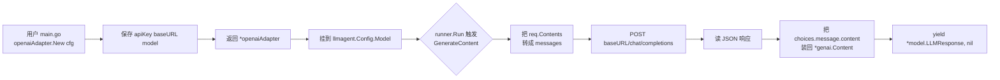

# OpenAI 兼容：接 DeepSeek / Moonshot / Ollama

> 本教程展示如何用一个 **零外部依赖** 的 OpenAI Chat Completions 适配器，把 ADK 接到任何遵循该协议的端点——DeepSeek、Moonshot、Ollama 都开箱即用。

## 你将学到

- `model.LLM` 接口的"最小实现"——只要 `Name()` + `GenerateContent()` 两个方法
- OpenAI Chat Completions 协议的请求 / 响应结构（`messages` / `choices[0].message.content`）
- `*genai.Content` 与 OpenAI `messages` 之间的双向转换：`role "model"` ↔ `"assistant"`
- DeepSeek / Moonshot / Ollama 三家"同协议、不同端点"的对接差异（`BaseURL` + `APIKey` + `Model`）
- `iter.Seq2` 流式返回的写法：`func(yield) { ... }`
- "把第三方 SDK 套成 ADK 接口"的 adapter 模式——比 `apigee/` 适配器更通用的版本

## 前置条件

- [x] 已完成 [00-prerequisites.md](../00-prerequisites.md)
- [x] 已完成 [05-llm-providers/01-gemini.md](./01-gemini.md) —— 看过 `gemini.NewModel` 的入口签名，知道 `model.LLM` 接口长什么样
- [x] 已至少准备好下列凭证之一：
    - **DeepSeek**：[platform.deepseek.com](https://platform.deepseek.com/) 申请的 `sk-...` key
    - **Moonshot**：[platform.moonshot.cn](https://platform.moonshot.cn/) 申请的 `sk-...` key
    - **Ollama**：本地 `ollama serve`（无 key，模型名以 `ollama/` 前缀区分）
- [x] 本教程**完整代码仅依赖 `net/http` + `encoding/json` + 标准库**，不引入第三方 SDK

## 核心概念

**"OpenAI 兼容协议"是当前 LLM 生态的事实标准**。OpenAI 在 2023 年把 `POST /v1/chat/completions` 公开后，几乎所有后发模型都复刻了这套 JSON 形态：DeepSeek、Moonshot、Together AI、Groq、智谱 GLM、Ollama（可选）……只要它们的端点接受同一组 `messages` 字段、返回同一组 `choices[].message.content` 字段，就**可以共用一套客户端代码**。

**adapter 模式**（[model/gemini/gemini.go:88](../../../model/gemini/gemini.go) 与 [model/apigee/apigee.go:130](../../../model/apigee/apigee.go)）是 ADK 接入新模型的标准动作：

1. 把第三方 SDK（或裸 HTTP）的一次"提问-回答"封装成 `iter.Seq2[*model.LLMResponse, error]`
2. 把 ADK 的 `*genai.Content` 翻译成对方协议的请求体
3. 把对方协议的响应体翻译回 `*model.LLMResponse`
4. 把这个实现包成 `model.LLM` 接口值，塞进 `llmagent.Config.Model`

`apigeeModel` 是"代理壳"（只做请求重定向）；本教程的 `openaiAdapter` 是"完整客户端"（自带 HTTP 客户端 + 协议翻译）。**两种 adapter 是同一思想的不同深度**。



**看图指引**：

- **左半段**（构造期）只做"配置存储"：URL、key、模型名统统存到 `openaiAdapter` 结构体里，**不发任何请求**。这与 `gemini.NewModel` 一样是"懒连接"——错了也不会在 `main` 启动时炸。
- **右半段**（请求期）三步：协议翻译 → HTTP 调用 → 反向协议翻译。`req.Contents` 是 `[]*genai.Content`（每条带 `Role` 与 `Parts`），OpenAI 协议要的是 `[]message{Role, Content}`，二者要逐字段对位。
- 流式（SSE）路径在 OpenAI 协议下是 `text/event-stream`，每个 `data: {...}` 行是独立 JSON。本教程**先实现同步路径**——同步是 SSE 的退化（`stream=false`），先把同步跑通后再升级到流式。

## 完整代码

完整可运行版本在 [examples/openaiadapter/main.go](../../../examples/openaiadapter/main.go)。所有协议转换与 `main` 入口都集中在同一文件。

```go
// examples/openaiadapter/main.go
package main

import (
	"bytes"
	"context"
	"encoding/json"
	"errors"
	"fmt"
	"io"
	"iter"
	"net/http"
	"os"
	"strings"
	"time"

	"google.golang.org/genai"

	"google.golang.org/adk/model"
)

const (
	defaultBaseURL = "https://api.openai.com/v1"
	defaultModel   = "gpt-4o-mini"
)

type openaiAdapter struct {
	apiKey  string
	baseURL string
	model   string
	client  *http.Client
}

func New(apiKey, baseURL, modelName string) model.LLM {
	if baseURL == "" {
		baseURL = defaultBaseURL
	}
	if modelName == "" {
		modelName = defaultModel
	}
	return &openaiAdapter{
		apiKey:  apiKey,
		baseURL: strings.TrimRight(baseURL, "/"),
		model:   modelName,
		client:  &http.Client{Timeout: 60 * time.Second},
	}
}

func (o *openaiAdapter) Name() string { return o.model }

func (o *openaiAdapter) GenerateContent(ctx context.Context, req *model.LLMRequest, _ bool) iter.Seq2[*model.LLMResponse, error] {
	return func(yield func(*model.LLMResponse, error) bool) {
		if req == nil || len(req.Contents) == 0 || !hasUserContent(req.Contents) {
			yield(nil, errors.New("openaiAdapter: request must include a user message"))
			return
		}
		body, _ := json.Marshal(buildRequest(o.model, req.Contents))
		httpReq, _ := http.NewRequestWithContext(ctx, http.MethodPost,
			o.baseURL+"/chat/completions", bytes.NewReader(body))
		httpReq.Header.Set("Content-Type", "application/json")
		if o.apiKey != "" {
			httpReq.Header.Set("Authorization", "Bearer "+o.apiKey)
		}
		resp, err := o.client.Do(httpReq)
		if err != nil {
			yield(nil, fmt.Errorf("call upstream: %w", err))
			return
		}
		defer resp.Body.Close()
		raw, _ := io.ReadAll(resp.Body)
		if resp.StatusCode/100 != 2 {
			yield(nil, fmt.Errorf("upstream %d: %s", resp.StatusCode, string(raw)))
			return
		}
		out, err := parseResponse(raw)
		if err != nil {
			yield(nil, fmt.Errorf("parse response: %w", err))
			return
		}
		yield(out, nil)
	}
}

// buildRequest 把 *genai.Content 翻译成 OpenAI messages。
// 关键映射：genai "model" → "assistant"；空 role → "user"。
func buildRequest(modelName string, contents []*genai.Content) oaiRequest {
	msgs := make([]oaiMessage, 0, len(contents))
	for _, c := range contents {
		if c == nil {
			continue
		}
		var sb strings.Builder
		for _, p := range c.Parts {
			if p != nil && p.Text != "" {
				sb.WriteString(p.Text)
			}
		}
		role := c.Role
		if role == genai.RoleModel {
			role = "assistant"
		} else if role == "" {
			role = "user"
		}
		msgs = append(msgs, oaiMessage{Role: role, Content: sb.String()})
	}
	return oaiRequest{Model: modelName, Messages: msgs}
}

// parseResponse 把 OpenAI 响应的第一条 choice 装回 *model.LLMResponse。
func parseResponse(raw []byte) (*model.LLMResponse, error) {
	var cr oaiResponse
	if err := json.Unmarshal(raw, &cr); err != nil {
		return nil, err
	}
	if len(cr.Choices) == 0 {
		return nil, errors.New("openaiAdapter: empty choices")
	}
	return &model.LLMResponse{
		Content:      genai.NewContentFromText(cr.Choices[0].Message.Content, genai.RoleModel),
		Partial:      false,
		TurnComplete: true,
	}, nil
}

// hasUserContent 保证至少有一条带文本的 user 消息——OpenAI 协议拒绝"全 assistant"提示。
func hasUserContent(contents []*genai.Content) bool {
	for _, c := range contents {
		if c == nil || c.Role != genai.RoleUser {
			continue
		}
		for _, p := range c.Parts {
			if p != nil && p.Text != "" {
				return true
			}
		}
	}
	return false
}

func main() {
	apiKey := os.Getenv("OPENAI_API_KEY")
	baseURL := os.Getenv("OPENAI_BASE_URL")
	modelName := os.Getenv("OPENAI_MODEL")
	if baseURL == "" {
		baseURL = defaultBaseURL
	}
	if modelName == "" {
		modelName = defaultModel
	}
	llm := New(apiKey, baseURL, modelName)
	fmt.Printf("openaiAdapter ready (model=%s, baseURL=%s)\n", llm.Name(), baseURL)
}
```

> **代码与 `examples/quickstart/main.go` 的差异**：本教程**不挂任何 `Tools`**，刻意保留"裸模型"形态，让读者把注意力放在 `openaiAdapter` 的协议翻译上。`openaiAdapter` 可以原样拷到任何项目里复用。

## 代码逐段讲解

### 1. `New`：把所有端点差异抽到配置

三家"OpenAI 兼容"提供商的**唯一不同**就是 `BaseURL` + `APIKey` + `Model`——协议本身完全一致。把这三者连同 `*http.Client` 一起封装到 `openaiAdapter` 结构体，**用一个二进制同时接 DeepSeek / Moonshot / Ollama** 只需在 `main` 入口切换环境变量。这也是 ADK 把"模型差异"完全藏在 `model.LLM` 背后的动机：调用方（`llmagent` / runner）**完全不知道**底层是 Gemini、DeepSeek 还是本地 Ollama。

### 2. `GenerateContent`：model.LLM 的"全部对外承诺"

对照接口定义（[model/llm.go:26](../../../model/llm.go)）：

```go
type LLM interface {
    Name() string
    GenerateContent(ctx context.Context, req *LLMRequest, stream bool) iter.Seq2[*LLMResponse, error]
}
```

注意三件事：

1. 返回类型是 `iter.Seq2[*model.LLMResponse, error]`（Go 1.23 引入的 [`iter` 包](https://pkg.go.dev/iter)），不是 `chan` 也不是 `[]`——它是"按需推送"的延迟序列，**调用方可以提前 `break` 终止**。
2. 内部用一个 `func(yield) { ... }` 闭包实现"推一次 / 推零次"语义。本教程的同步路径只 `yield` 一次；流式路径会多次 `yield`（每个 SSE chunk 推一次）。
3. `yield` 第二个参数是 `error`——一旦传非 nil，就**不能再 yield 任何 `*model.LLMResponse`**，这是 `iter` 包的契约。

### 3. `buildRequest`：ADK `*genai.Content` → OpenAI `messages`

`genai.Role` 的合法值是 `"user"` 与 `"model"`（[types.go:1528](../../../types.go)），OpenAI 的合法值是 `"user"` / `"assistant"` / `"system"` / `"tool"`。转换时**只翻译这两条**——`"system"` 在 ADK 里走 `llmagent.Config.Instruction`（不在 `req.Contents` 里），所以这里不会遇到。把同一个 `Content` 下的所有 `Text` part 拼成一条 `message.content`——OpenAI 协议不支持多模态数组，除非用扩展字段。本教程**只支持纯文本**，多模态留给升级路径。

### 4. `parseResponse`：OpenAI 响应 → `*model.LLMResponse`

`genai.NewContentFromText` 在 [types.go:1551](../../../types.go)；`Partial=false` / `TurnComplete=true` 的组合告诉 runner "**这是一段完整答案，不要再合并**"——runner 据此把这段写进 session 历史。流式路径下，最后一个 chunk 才设 `TurnComplete=true`，中间 chunk 设 `Partial=true`——这与 `geminiModel.generateStream` 的 `llminternal.NewStreamingResponseAggregator` 行为一致（[gemini.go:141-160](../../../model/gemini/gemini.go)）。

## 准备与运行

### 步骤 1：选一个提供商

| 提供商 | 适用场景 | 模型名示例 |
|---|---|---|
| **Ollama** | 本地、无 key、隐私敏感 | `llama3.1` / `qwen2.5` / `mistral` |
| **DeepSeek** | 国内访问稳定、性价比高 | `deepseek-chat` / `deepseek-reasoner` |
| **Moonshot**（Kimi） | 长上下文（128K-256K） | `moonshot-v1-128k` / `kimi-k2-0711-preview` |

> 推荐顺序：先用 **Ollama** 在本地跑通整条链路（不消耗 token、不依赖外网），再切换到 DeepSeek / Moonshot。

### 步骤 2：获取凭证

- **Ollama**：本机安装 [ollama.com](https://ollama.com/) 后 `ollama pull llama3.1`，`ollama serve` 起服务。**无 key**。
- **DeepSeek**：到 [platform.deepseek.com](https://platform.deepseek.com) 注册并创建 API key，**充值 1 元即可**。
- **Moonshot**：到 [platform.moonshot.cn](https://platform.moonshot.cn) 注册并创建 API key，**新账号有免费额度**。

### 步骤 3：设置环境变量

```bash
# --- Ollama ---
export OPENAI_BASE_URL=http://localhost:11434/v1
export OPENAI_MODEL=llama3.1
# OPENAI_API_KEY 留空

# --- DeepSeek ---
export OPENAI_BASE_URL=https://api.deepseek.com/v1
export OPENAI_API_KEY=sk-...
export OPENAI_MODEL=deepseek-chat

# --- Moonshot ---
export OPENAI_BASE_URL=https://api.moonshot.cn/v1
export OPENAI_API_KEY=sk-...
export OPENAI_MODEL=moonshot-v1-8k
```

### 步骤 4：保存并运行

```bash
cd /home/wu/oneone/adk
go build ./examples/openaiadapter/...   # 应直接通过
go run ./examples/openaiadapter/        # 打印 ready 横幅
```

`go build` **只会拉取 `google.golang.org/adk` + `google.golang.org/genai`**，因为 adapter 用的是标准库 `net/http` / `encoding/json`。

## 常见错误

- **`upstream 401 Unauthorized`** —— `APIKey` 拼写错或未设置（DeepSeek / Moonshot 必填）。Ollama 场景下若端点启用了鉴权才会出这个错，**默认无鉴权**。
- **`upstream 404 Not Found` / `model_not_found`** —— 模型名拼错或该 BaseURL 不认这个模型。DeepSeek 认 `deepseek-chat` 不认 `gpt-4`；Moonshot 认 `moonshot-v1-8k` 不认 `llama3.1`。
- **`dial tcp 127.0.0.1:11434: connect: connection refused`** —— Ollama 没跑。`ollama serve` 起服务，或 `systemctl start ollama`。
- **`EOF` / `unexpected end of JSON input`** —— 远端返回了非 JSON 错误体（HTML 错误页、代理拦截页）。`upstream %d: %s` 的打印会把状态码 + body 一并打出来，按 body 内容定位（GFW 拦截、企业代理认证页等）。
- **同步路径假装流式** —— 当前实现是 `stream=false` 一次性读。升级到 SSE：在 `for` 循环里逐行读 `resp.Body`，每行 `data: {...}` 解一次 JSON，每个 `choices[0].delta.content` `yield` 一次，并把非最后一条的 `Partial` 设为 `true`。参考 [model/gemini/gemini.go:141-160](../../../model/gemini/gemini.go) 的 `generateStream`。
- **把 key 写进代码** —— 切勿。本教程的 `os.Getenv("OPENAI_API_KEY")` 一定要走环境变量；硬编码等于把生产密钥交给 git。

## 关键 API 小结

| API | 位置 | 作用 |
|---|---|---|
| `model.LLM` | [model/llm.go:26](../../../model/llm.go) | ADK 的"模型抽象接口" |
| `model.LLMRequest` | [model/llm.go:32](../../../model/llm.go) | ADK → 适配器的请求结构（`Model` / `Contents` / `Config`） |
| `model.LLMResponse` | [model/llm.go:42](../../../model/llm.go) | 适配器 → ADK 的响应结构（`Content` / `Partial` / `TurnComplete`） |
| `genai.Content` / `genai.Part` | [types.go:1517](../../../types.go) / [types.go:1381](../../../types.go) | ADK 的"消息 + 段"载体 |
| `genai.NewContentFromText` | [types.go:1551](../../../types.go) | 用 `text` + `role` 构造 `*genai.Content` |
| `iter.Seq2[K, V]` | [pkg.go.dev/iter](https://pkg.go.dev/iter) | Go 1.23+ 的延迟推送序列（`yield` 闭包） |
| `geminiModel.GenerateContent` | [model/gemini/gemini.go:88](../../../model/gemini/gemini.go) | 对照参考：官方适配器如何实现 `iter.Seq2` |
| `apigeeModel.GenerateContent` | [model/apigee/apigee.go:130](../../../model/apigee/apigee.go) | 对照参考：纯代理型 adapter 只需透传 `delegate` |

## 延伸阅读

- 架构文档：[顶层架构：model 模块](../../architecture/03-modules/02-model.md)（待补）—— 解释 `model.LLM` 接口的设计动机与各 provider 适配器关系
- 架构文档：[02-extension-points.md](../../architecture/02-extension-points.md)（待补）—— 解释"接入新 LLM 提供商"是 ADK 的 4 大扩展点之一
- 源码：[model/llm.go](../../../model/llm.go) —— `model.LLM` 接口的最小定义
- 源码：[model/gemini/gemini.go](../../../model/gemini/gemini.go) —— 官方 Gemini 适配器（看 `generateStream` 学流式）
- 源码：[model/apigee/apigee.go](../../../model/apigee/apigee.go) —— 代理型 adapter 范例（"委托给另一个 model.LLM"）
- 源码：[examples/openaiadapter/main.go](../../../examples/openaiadapter/main.go) —— 本教程的完整可运行代码
- 子项目深读占位：把 `openaiAdapter` 升级成"自带流式 + function calling + 多模态"的完整 OpenAI 客户端，需要补三段——SSE 解析、tools 字段转换、image_url 多模态。详见 [04-anthropic.md](./04-anthropic.md) 末尾的"多模态与流式"对比表。
- 下一教程：[04-anthropic.md](./04-anthropic.md) —— 协议不同（Messages API + 工具 use 块）、但 adapter 模式完全一样的 Anthropic 接入
