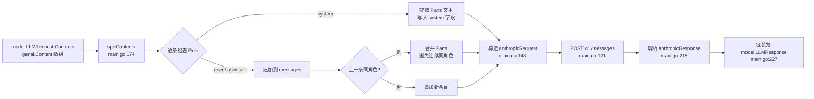

# Anthropic：接 Claude 模型

> 本教程基于 `examples/anthropicadapter/main.go`，围绕一个手写的 `model.LLM` 适配器讲解如何把 ADK 接到 Anthropic Messages API。教程自带**自定义最小 main.go**（与示例保持同形）便于读者裁剪到最小依赖。

## 你将学到

- ADK 的 `model.LLM` 接口如何被 `anthropicadapter.anthropicModel` 实现
- Anthropic **Messages API** 与 Gemini `generateContent` 在请求 / 响应结构上的关键差异
- **system 字段处理** —— Anthropic 把 system 单独抽成顶层 `system` 字符串，而 Gemini 把它视为一条 `role: "system"` 的 `*genai.Content`
- `*model.LLMRequest.Contents` 到 Anthropic `messages[]` 的转换规则（按 `Role` 分桶、**合并相邻同角色消息**）
- `ANTHROPIC_API_KEY` 环境变量、`ANTHROPIC_BASE_URL` 自定义网关、`claude-3-5-sonnet-20241022` 等模型名的取舍

## 前置条件

- [x] 已完成 [00-prerequisites.md](../00-prerequisites.md)
- [x] 已完成 [05-llm-providers/01-gemini.md](./01-gemini.md) —— 看过 `gemini.NewModel` 怎么被 agent 使用
- [x] 已设置 `ANTHROPIC_API_KEY` 环境变量（以 `sk-ant-` 开头）
- [x] 本机可访问 `api.anthropic.com`（公司网关场景需准备自定义 `BaseURL`）

## 核心概念

**Anthropic 的 Messages API 与 Gemini 的 `generateContent` API 形态差异很大**。Gemini 把"系统提示 + 多轮用户 / 模型对话"全部装进 `contents []*genai.Content` 数组（每条都是 `*genai.Content`），而 Anthropic 把 system 单独抽成顶层 `system` 字符串字段，`messages[]` 数组只承载 `user` / `assistant` 两种角色。这意味着本适配器在请求侧必须做一次**字段重映射**：从 ADK 的统一 `*model.LLMRequest.Contents` 中分离出 `role == "system"` 的那条记录填到 `system`，其余按顺序拼成 `messages`。

**`anthropicModel` 结构体**（[`examples/anthropicadapter/main.go:55`](../../../examples/anthropicadapter/main.go)）只持有 `*http.Client` + API key + 默认模型名 + 端点：

```go
type anthropicModel struct {
    httpClient *http.Client
    apiKey     string
    modelName  string
    baseURL    string
    maxTokens  int
}
```

`GenerateContent` 是一个标准的 `iter.Seq2[*model.LLMResponse, error]` 返回函数（[`examples/anthropicadapter/main.go:93`](../../../examples/anthropicadapter/main.go)）：先把 `*model.LLMRequest.Contents` 转成 Anthropic 的 `(system, messages)` 二元组，再 POST 到 `/v1/messages`，把响应体按 `model.LLMResponse` 形态包装一次返回。

**system 字段处理是本教程的核心**。ADK 没有为 system 提示单独建字段 —— `llmagent.Config.Instruction` 会被 runner 转成 `*genai.Content{Role: "system", Parts: ...}` 塞进 `Contents`（参见 [01-gemini.md §核心概念](./01-gemini.md#核心概念)）。`splitContents`（[`examples/anthropicadapter/main.go:174`](../../../examples/anthropicadapter/main.go)）做三件事：

1. 找到第一条 `Role == "system"` 的 `*genai.Content`，把它的 `Parts` 拼成一段纯文本，赋给 `system` 顶层字段。
2. 剩余的 `user` / `assistant` 消息按出现顺序追加到 `messages[]`。
3. **合并相邻同角色消息** —— Anthropic 不允许 `messages[]` 里出现两条连续同角色消息（API 会返回 400），所以同角色相邻的两条 `*genai.Content` 会把 `Parts` 拼成单条。



**看图指引**：

- `splitContents` 的合并逻辑（[`examples/anthropicadapter/main.go:189-191`](../../../examples/anthropicadapter/main.go)）是本适配器**唯一**与 gemini 适配器行为分叉的地方。
- `system` 字段只取第一条 system 消息（[`examples/anthropicadapter/main.go:181`](../../../examples/anthropicadapter/main.go)）—— 后续多余的 system 内容会被丢弃。如果在 agent 里通过 `BeforeModelCallback` 动态追加 system 提示，需要在回调里合并成一条再返回。
- 响应侧 `content[0].text` 是关键字段（[`examples/anthropicadapter/main.go:227`](../../../examples/anthropicadapter/main.go)）—— Anthropic 返回的是 `content` 数组结构（支持多模态、tool_use 等块），而 Gemini 的 `Candidates[0].Content.Parts` 是平行结构。

## 完整代码

> 教程使用**自定义 `main.go`**：与 `examples/anthropicadapter/main.go` 保持同形，便于读者对照阅读。

```go
// docs/tutorials/05-llm-providers/04-anthropic/main.go
package main

import (
    "context"
    "fmt"
    "log"
    "os"

    "google.golang.org/adk/agent"
    "google.golang.org/adk/agent/llmagent"
    "google.golang.org/adk/cmd/launcher"
    "google.golang.org/adk/cmd/launcher/full"
)

func main() {
    ctx := context.Background()

    // 1. 选模型名 —— 不同 Claude 模型在能力 / 速度 / 成本上取舍不同
    const defaultModelName = "claude-3-5-sonnet-20241022"

    // 2. 构造 anthropic 适配器 —— 默认走 api.anthropic.com
    llm, err := anthropicadapter.NewModel(ctx, anthropicadapter.Config{
        APIKey:    os.Getenv("ANTHROPIC_API_KEY"),
        Model:     defaultModelName,
        MaxTokens: 1024,
    })
    if err != nil {
        log.Fatalf("Failed to create anthropic model: %v", err)
    }

    // 3. 把 model 挂到 llmagent
    a, err := llmagent.New(llmagent.Config{
        Name:        "claude_agent",
        Model:       llm,
        Description: "Agent that calls Claude via Anthropic Messages API.",
        Instruction: "Answer in one short sentence. No tools.",
    })
    if err != nil {
        log.Fatalf("Failed to create agent: %v", err)
    }

    fmt.Printf("Using model: %s (Name() = %q)\n", defaultModelName, llm.Name())

    config := &launcher.Config{AgentLoader: agent.NewSingleLoader(a)}
    l := full.NewLauncher()
    if err = l.Execute(ctx, config, os.Args[1:]); err != nil {
        log.Fatalf("Run failed: %v\n\n%s", err, l.CommandLineSyntax())
    }
}
```

> **代码与 `examples/anthropicadapter/main.go` 的差异**：本教程不挂任何 `Tools`，刻意保留"裸模型"形态，让读者把注意力放在 `anthropicadapter.NewModel` 与 system 字段处理本身。完整工具调用示例参见 [02-tools/01-functiontool.md](../02-tools/01-functiontool.md)。

## 代码逐段讲解

### 1. 选模型名

`Model` 是 `Config` 的可选字段（[`examples/anthropicadapter/main.go:46`](../../../examples/anthropicadapter/main.go)），空值时回退到 `claude-3-5-sonnet-20241022`。Anthropic 的模型名以 `claude-` 开头、可带日期或 `-latest` 滚动后缀。常见可选值：

| 模型名 | 定位 | 备注 |
|---|---|---|
| `claude-3-5-sonnet-20241022` | 综合能力 / 主力 | 本教程默认；3.5 代 Sonnet 稳定版 |
| `claude-3-5-haiku-20241022` | 速度优先 / 成本优先 | 简单 Q&A 场景；响应最快 |
| `claude-3-opus-20240229` | 质量优先 | 长上下文、复杂推理最稳；成本最高 |
| `claude-3-7-sonnet-20250219` | 更新一代 Sonnet | 启用 extended thinking 时需另设参数 |

> 模型名以字符串硬编码 —— ADK 不维护"模型名 → 能力"映射表，切换时直接换字符串。

### 2. 构造 `anthropicadapter.NewModel`

签名见 [`examples/anthropicadapter/main.go:64`](../../../examples/anthropicadapter/main.go)：

```go
func NewModel(ctx context.Context, cfg Config) (model.LLM, error)
```

四件事：

1. `ctx` 仅用于初始化 `*http.Client` 时的派生逻辑；后续每次 `GenerateContent` 调用都用调用方新传的 `ctx`。
2. `APIKey` 是 Anthropic 控制台签发的密钥（以 `sk-ant-` 开头），用于 `x-api-key` 头。
3. `Model` 是"默认模型"——`req.Model` 字段被 `BeforeModelCallback` 覆写时优先用 `req.Model`，未覆写时回退到此值（[`examples/anthropicadapter/main.go:100-103`](../../../examples/anthropicadapter/main.go)）。
4. `MaxTokens` 是必填的请求体字段 —— Anthropic API **强制要求** `max_tokens`，缺省会被 400 拒掉。默认 1024 适合短回复场景。

`Config` 还可传 `BaseURL` 与 `HTTPClient`（[`examples/anthropicadapter/main.go:47-48`](../../../examples/anthropicadapter/main.go)），用于走公司内 Anthropic 代理网关：

```go
anthropicadapter.NewModel(ctx, anthropicadapter.Config{
    APIKey:  os.Getenv("ANTHROPIC_API_KEY"),
    Model:   "claude-3-5-sonnet-20241022",
    BaseURL: "https://anthropic-proxy.internal.example.com",
})
```

### 3. `splitContents` 把 system 抽出来

```go
// examples/anthropicadapter/main.go:174
func splitContents(contents []*genai.Content) (string, []anthropicMessage) {
    for _, c := range contents {
        switch c.Role {
        case "system":
            if system != "" { continue }
            system = joinParts(c.Parts)
        case "user", "assistant":
            ...
        }
    }
    return
}
```

这是与 gemini 适配器**最关键**的行为差异。Gemini 适配器把 system 当成普通一条 `*genai.Content` 转发给 SDK，而本适配器必须把它从 `messages[]` 里抽出来、合并成顶层 `system` 字符串。

### 4. 合并相邻同角色消息

```go
// examples/anthropicadapter/main.go:189
if len(msgs) > 0 && msgs[len(msgs)-1].Role == c.Role {
    msgs[len(msgs)-1].Content += "\n" + text
    continue
}
msgs = append(msgs, anthropicMessage{Role: c.Role, Content: text})
```

Anthropic Messages API 规范明确要求 `messages[]` 中不能出现两条相邻同角色消息 —— 否则会返回 `400 invalid_request_error`。`splitContents` 用 `\n` 作为分隔符合并相邻 `user` 消息的 `Parts`，效果是：ADK 端拆开的"工具结果片段"会被合并成一条完整的 `user` 消息。

### 5. 跑一次同步请求

```go
fmt.Printf("Using model: %s (Name() = %q)\n", defaultModelName, llm.Name())
```

`Name()` 是 `model.LLM` 接口要求的两个方法之一（[`model/llm.go:26`](../../../model/llm.go)），在本适配器中直接返回构造时存的 `m.modelName`（[`examples/anthropicadapter/main.go:89`](../../../examples/anthropicadapter/main.go)）。打印 `Name()` 让我们确认 model 真的绑到了默认模型上 —— 避免"传错字符串还以为跑对了"。

### 6. 挂到 `llmagent` 并跑 console

```go
a, _ := llmagent.New(llmagent.Config{...})
config := &launcher.Config{AgentLoader: agent.NewSingleLoader(a)}
l := full.NewLauncher()
l.Execute(ctx, config, os.Args[1:])
```

这段与 [01-gemini.md](./01-gemini.md) 完全一致。差异在于 `Model` 字段是 `anthropicModel` 而非 `geminiModel`——runner 看到的只是 `model.LLM` 接口值。

## 准备与运行

### 步骤 1：获取凭证

到 [Anthropic Console](https://console.anthropic.com/settings/keys) 申请 `ANTHROPIC_API_KEY`（以 `sk-ant-` 开头）。注意控制台需要绑定支付方式才能调用付费模型。

### 步骤 2：设置环境变量

```bash
export ANTHROPIC_API_KEY=sk-ant-...你的key...
# 可选：自定义模型 / 网关
export ANTHROPIC_MODEL=claude-3-5-sonnet-20241022
export ANTHROPIC_BASE_URL=https://api.anthropic.com
```

### 步骤 3：保存并运行

把上面"完整代码"段 + 适配器源代码（[examples/anthropicadapter/main.go](../../../examples/anthropicadapter/main.go)）合并保存为 `main.go`，放在任意空目录，并在同目录写一个最小 `go.mod`：

```bash
mkdir anthropic-demo && cd anthropic-demo
cat > go.mod <<'EOF'
module example.com/anthropic-demo

go 1.23

require google.golang.org/adk v0.0.0
EOF

go mod edit -replace google.golang.org/adk=/home/wu/oneone/adk
go mod tidy
go run . console
```

首次 `go mod tidy` 会拉取 ADK 及其传递依赖，约 30-60 秒。

### 步骤 4：测试输入

```
User: Hello.
[claude_agent]: Hi there.

User: What is 2+2?
[claude_agent]: Four.
```

按 `Ctrl-D` 退出 console 模式。

## 常见错误

- **`Failed to create anthropic model: ANTHROPIC_API_KEY required`** —— 没设环境变量。`NewModel` 在 `Config.APIKey` 为空时立刻返回错误（[`examples/anthropicadapter/main.go:66`](../../../examples/anthropicadapter/main.go)），不像 gemini 适配器那样在首次请求时才被远端拒掉。
- **`400 invalid_request_error: max_tokens is required`** —— Anthropic **强制**要求 `max_tokens` 字段。`Config.MaxTokens` 默认为 1024，但如果你重置为零值，会在首次请求时失败。务必显式传非零值。
- **`400 invalid_request_error: messages: roles must alternate`** —— `splitContents` 没正确合并相邻同角色消息，通常发生在 `BeforeModelCallback` 手动追加 system 提示后未合并。详见 §核心概念 - 合并相邻同角色消息。
- **`401 authentication_error`** —— API key 拼错或被吊销。检查 `sk-ant-` 前缀；控制台 "Active keys" 列表里确认 key 状态为 Active。
- **`404 not_found_error: model: claude-xxx`** —— 模型名拼错。Anthropic 的模型名会随版本滚动，确认账号对该模型有访问权限。
- **`unexpected end of JSON input` / `upstream 502`** —— 走公司代理时偶发的连接中断。`upstream %d: %s` 的打印会把状态码 + body 一并打出来，按 body 内容定位。
- **把 key 写进代码** —— 切勿。把 `APIKey: os.Getenv("ANTHROPIC_API_KEY")` 改成字面量等于把生产密钥交给 git。

## 关键 API 小结

| API | 位置 | 作用 |
|---|---|---|
| `model.LLM` | [`model/llm.go:26`](../../../model/llm.go) | ADK 的"模型抽象接口" |
| `anthropicadapter.NewModel` | [main.go:64](../../../examples/anthropicadapter/main.go) | 创建 Anthropic 模型实例，返回 `model.LLM` |
| `anthropicadapter.Config` | [main.go:44](../../../examples/anthropicadapter/main.go) | 适配器配置（APIKey / Model / BaseURL / MaxTokens / HTTPClient） |
| `anthropicModel` | [main.go:55](../../../examples/anthropicadapter/main.go) | 私有实现结构体 |
| `anthropicModel.GenerateContent` | [main.go:93](../../../examples/anthropicadapter/main.go) | 单入口；`iter.Seq2[*model.LLMResponse, error]` |
| `anthropicModel.Name` | [main.go:89](../../../examples/anthropicadapter/main.go) | 返回构造时指定的默认模型名 |
| `splitContents` | [main.go:174](../../../examples/anthropicadapter/main.go) | 分离 system 字段，合并相邻同角色消息 |
| `anthropicRequest` | [main.go:148](../../../examples/anthropicadapter/main.go) | Anthropic Messages API 请求体 |
| `anthropicMessage` | [main.go:143](../../../examples/anthropicadapter/main.go) | 单条消息（role / content） |
| `anthropicResponse` | [main.go:160](../../../examples/anthropicadapter/main.go) | Anthropic 响应体（id / content / stop_reason / usage） |
| `parseAnthropicResponse` | [main.go:215](../../../examples/anthropicadapter/main.go) | 响应解析 + 包装为 `*model.LLMResponse` |

## 延伸阅读

- 架构文档：[顶层架构：model 模块](../../architecture/03-modules/02-model.md) —— 解释 `model.LLM` 接口的设计动机与各 provider 适配器关系
- 架构文档：[F1 单轮对话](../../architecture/01-core-flows.md#f1-单轮对话) —— 展示 `model.LLMRequest` 是怎么从 runner 走到 `GenerateContent` 的
- 源码：[`examples/anthropicadapter/main.go`](../../../examples/anthropicadapter/main.go) —— 本教程拆解的全部代码
- 源码：[`model/llm.go`](../../../model/llm.go) —— `model.LLM` 接口的最小定义
- 上一教程：[02-apigee-gateway.md](./02-apigee-gateway.md) —— 当你需要经过 Apigee 网关调用 Gemini 时
- 下一教程：[05-custom-llm-adapter.md](./05-custom-llm-adapter.md) —— 不依赖任何 SDK 的通用自定义 adapter 模式
