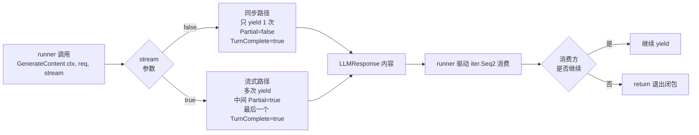

# 自定义 LLM：实现 model.LLM 接任意模型

> 本教程使用**自定义 `main.go`**（不基于 `examples/`），聚焦如何手写一个 `model.LLM` 实现——把任意后端（OpenAI、Anthropic、自建 HTTP 服务、纯本地 mock）接入 ADK。

## 你将学到

- `model.LLM` 接口的最小契约：`Name()` + `GenerateContent(ctx, req, stream)`（[`model/llm.go:26`](../../../model/llm.go)）
- `model.LLMRequest` / `model.LLMResponse` 字段语义：哪些是必填、哪些是流式专用（[`model/llm.go:32-38`](../../../model/llm.go) 与 [`model/llm.go:42-68`](../../../model/llm.go)）
- `iter.Seq2[*LLMResponse, error]` 流式返回的"惰性求值"协议：什么时候 `yield`、什么时候 `return`
- 同步 / 流式两种模式的最小实现差异——`stream=false` 时也要返回 `iter.Seq2`（"只发一个"也是合法的序列）
- 如何把"自实现模型"挂到 `llmagent` 上、并在 `console` 模式直接对话验证

## 前置条件

- [x] 已完成 [00-prerequisites.md](../00-prerequisites.md)
- [x] 已完成 [01-getting-started/01-hello-world.md](../01-getting-started/01-hello-world.md) —— 看过 `gemini.NewModel` 怎么被 agent 使用
- [x] 已完成 [05-llm-providers/01-gemini.md](./01-gemini.md) —— 理解 `model.LLM` 接口存在的意义
- [x] 本地 `go` 命令可执行（无外部网络依赖；本教程用一个**不联网的 mock 后端**演示契约）

## 核心概念

**`model.LLM` 是 ADK 唯一对外暴露的"模型接口"**，定义在 [`model/llm.go:26`](../../../model/llm.go)：

```go
// model/llm.go:26
type LLM interface {
    Name() string
    GenerateContent(ctx context.Context, req *LLMRequest, stream bool) iter.Seq2[*LLMResponse, error]
}
```

只要一个类型实现这两个方法，它**就**是 ADK 视角下的"模型"——`llmagent` 不区分它背后是 Gemini、OpenAI 还是你写的 echo mock。`gemini` 适配器只是这个接口的一种实现，你完全可以再写一种。

**`LLMRequest` 字段语义**（[`model/llm.go:32-38`](../../../model/llm.go)）：

| 字段 | 必填 | 含义 |
|---|---|---|
| `Model` | 否 | 临时覆盖构造时指定的模型名（`BeforeModelCallback` 改写模型时用） |
| `Contents` | 是 | 多轮对话消息列表；`gemini` 适配器在为空时会自动补一条用户消息 |
| `Config` | 否 | 生成参数（`Temperature` / `MaxOutputTokens` / `SystemInstruction` / `Tools` 等） |
| `Tools` | 否 | 工具名 → 工具配置的映射；JSON 序列化时被忽略（`json:"-"`） |

**`LLMResponse` 字段语义**（[`model/llm.go:42-68`](../../../model/llm.go)）：其中 `Content` 是消息主体（`Role` + `Parts`），`Partial` / `TurnComplete` 只在流式模式有意义——同步模式下**必须**保持 `Partial=false, TurnComplete=true`。`UsageMetadata` / `CitationMetadata` 等元数据可选，不填也不报错。

**`iter.Seq2` 协议**（Go 1.23 引入）：`GenerateContent` 必须返回一个惰性序列，runner 会**驱动**这个序列逐项消费。你的 `yield` 每次可以发一个 `*LLMResponse`（和/或一个 `error`），runner 端通过 `if !yield(...)` 检测"消费者已停止"。**这意味着你不能在 `GenerateContent` 里直接调 `client.Do()` 并 `return resp, err`——必须包成 `func(yield) { ... }` 闭包。**



**看图指引**：

- 同步模式与流式模式**必须都返回 `iter.Seq2`**——Go 1.23 引入的 `iter` 包不允许"零元素"和"闭包外 yield"两种非法形态。
- `runner` 在迭代器返回 `false` 时会停止消费（参考 [`model/gemini/gemini.go:150-153`](../../../model/gemini/gemini.go) 的 `if !yield(...) return` 写法）。你不需要在 `GenerateContent` 里做并发控制——单次调用对应一个序列、串行消费。
- `stream=false` 是"我只发一次"的语法糖；它**不是**"不要 yield"。如果只返回空序列，runner 会因为没收到任何事件而直接结束轮次。

## 完整代码

> 教程使用**自定义 `main.go`**：实现一个"echo + 时钟"自实现模型，演示同步与流式两种产出方式，**不依赖任何外部 LLM**。

```go
// docs/tutorials/05-llm-providers/05-custom-llm-adapter/main.go
package main

import (
	"context"
	"fmt"
	"iter"
	"log"
	"os"
	"strings"
	"time"

	"google.golang.org/genai"

	"google.golang.org/adk/agent"
	"google.golang.org/adk/agent/llmagent"
	"google.golang.org/adk/cmd/launcher"
	"google.golang.org/adk/cmd/launcher/full"
	"google.golang.org/adk/model"
)

// echoClockModel 是一个"伪 LLM"实现：把用户最后一条消息原样回显，
// 同时把当前时间拼到结果里。它实现 model.LLM 接口的全部两个方法。
type echoClockModel struct {
	name string
}

// Name 返回构造时设置的模型名，runner 用它做日志与可观测性埋点。
func (m *echoClockModel) Name() string { return m.name }

// GenerateContent 演示同步 / 流式两种产出的最小写法。
// stream=true 时按"前缀 → 主体 → 后缀"三段 yield；stream=false 时合并成一条。
func (m *echoClockModel) GenerateContent(ctx context.Context, req *model.LLMRequest, stream bool) iter.Seq2[*model.LLMResponse, error] {
	// 1. 提取最后一条用户文本（不强求；只是 echo 演示）
	last := lastUserText(req.Contents)

	// 2. 组装三段"流式"内容
	chunks := []string{
		fmt.Sprintf("Echo: %s\n", last),
		"Now: " + time.Now().Format(time.RFC3339) + "\n",
		"--- end ---",
	}

	if stream {
		return m.streamChunks(chunks)
	}
	return m.oneShot(chunks)
}

// streamChunks 逐字产出，每个 chunk 标记为 Partial=true；最后一条标记 TurnComplete=true。
func (m *echoClockModel) streamChunks(chunks []string) iter.Seq2[*model.LLMResponse, error] {
	return func(yield func(*model.LLMResponse, error) bool) {
		for i, c := range chunks {
			// 模拟一点点"流式"延迟，让 console 模式看得见效果
			time.Sleep(120 * time.Millisecond)

			resp := &model.LLMResponse{
				Content: &genai.Content{
					Role:  genai.RoleModel,
					Parts: []*genai.Part{genai.NewPartFromText(c)},
				},
				Partial:       i < len(chunks)-1, // 中间段是 partial
				TurnComplete:  i == len(chunks)-1, // 末段 TurnComplete
				ModelVersion:  m.name,
				FinishReason:  genai.FinishReasonStop,
			}
			if i == len(chunks)-1 {
				resp.UsageMetadata = &genai.GenerateContentResponseUsageMetadata{
					PromptTokenCount:     1,
					ResponseTokenCount:   int32(len(c)),
					TotalTokenCount:      1 + int32(len(c)),
				}
			}
			if !yield(resp, nil) {
				return // 消费方中止（用户在 console 里 Ctrl-C）
			}
		}
	}
}

// oneShot 把三段合并成单条非 partial 响应——同步路径的最小合法写法。
func (m *echoClockModel) oneShot(chunks []string) iter.Seq2[*model.LLMResponse, error] {
	return func(yield func(*model.LLMResponse, error) bool) {
		merged := strings.Join(chunks, "")
		resp := &model.LLMResponse{
			Content: &genai.Content{
				Role:  genai.RoleModel,
				Parts: []*genai.Part{genai.NewPartFromText(merged)},
			},
			Partial:       false, // 同步模式必须为 false
			TurnComplete:  true,  // 同步模式必须为 true
			ModelVersion:  m.name,
			FinishReason:  genai.FinishReasonStop,
			UsageMetadata: &genai.GenerateContentResponseUsageMetadata{
				PromptTokenCount:   1,
				ResponseTokenCount: int32(len(merged)),
				TotalTokenCount:    1 + int32(len(merged)),
			},
		}
		yield(resp, nil)
	}
}

// lastUserText 抽出最后一条用户消息的纯文本，演示怎么读 LLMRequest.Contents。
func lastUserText(contents []*genai.Content) string {
	for i := len(contents) - 1; i >= 0; i-- {
		c := contents[i]
		if c == nil || c.Role != genai.RoleUser {
			continue
		}
		var b strings.Builder
		for _, p := range c.Parts {
			if p == nil || p.Text == nil {
				continue
			}
			b.WriteString(*p.Text)
		}
		return b.String()
	}
	return ""
}

func main() {
	ctx := context.Background()

	// 1. 构造"自实现模型"——只要实现 model.LLM 即可，无须 import 任何具体 provider 包
	const customModelName = "echo-clock-1"
	m := &echoClockModel{name: customModelName}

	// 2. 把 model 挂到 llmagent；ADK 内部不区分 gemini / apigee / 自实现
	a, err := llmagent.New(llmagent.Config{
		Name:        "echo_clock_agent",
		Model:       m,
		Description: "Agent that echoes user input and reports current time.",
		Instruction: "Always answer in English. Keep responses under 3 lines.",
	})
	if err != nil {
		log.Fatalf("Failed to create agent: %v", err)
	}

	fmt.Printf("Using custom model: %s (Name() = %q)\n", customModelName, m.Name())

	config := &launcher.Config{AgentLoader: agent.NewSingleLoader(a)}
	l := full.NewLauncher()
	if err = l.Execute(ctx, config, os.Args[1:]); err != nil {
		log.Fatalf("Run failed: %v\n\n%s", err, l.CommandLineSyntax())
	}
}
```

> **代码与 `examples/quickstart/main.go` 的差异**：把 `gemini.NewModel(...)` 换成 `&echoClockModel{name: ...}`。**这是 ADK 设计的核心扩展点**——任何一个"能产出 `*model.LLMResponse` 的函数"都能挂到 `llmagent` 上。

## 代码逐段讲解

### 1. 定义实现类型

```go
type echoClockModel struct {
    name string
}
```

没有任何"必须嵌入的基类"——Go 的接口是**结构化**的，只要方法集匹配就算实现。你可以把它放在任何包里，也可以嵌进既有类型（典型场景：把 `*http.Client` 嵌入，对外暴露 `model.LLM`，对内继续用 http 客户端的所有方法）。

### 2. `Name() string`——模型名用于日志与可观测性

```go
func (m *echoClockModel) Name() string { return m.name }
```

`runner` 在以下场景会调 `Name()`：telemetry span 的属性、错误日志前缀、`BeforeModelCallback` 收到的 `ctx` 注入。**`name` 必须在构造时确认唯一且非空**——两个模型同名会让 telemetry 难以分辨。生产环境建议用"模型 id + 版本"格式（如 `gpt-4o-2024-08-06`），便于事后按版本回溯。

### 3. `GenerateContent`——单入口、双模式

```go
func (m *echoClockModel) GenerateContent(ctx context.Context, req *model.LLMRequest, stream bool) iter.Seq2[*model.LLMResponse, error] {
    last := lastUserText(req.Contents)
    chunks := []string{ /* ... */ }

    if stream {
        return m.streamChunks(chunks)
    }
    return m.oneShot(chunks)
}
```

`stream` 参数是 **adapter 自己的实现选择**——runner 不在乎你怎么实现，它只在乎返回的 `iter.Seq2` 是否合法。你完全可以"无视 `stream`，永远走流式路径"或"无视 `stream`，永远只 yield 一次"——前者会牺牲一些 console 模式的实时性，后者会牺牲流式 UI 的"打字机"效果。本教程演示**两种都实现**的对照。

**`ctx` 一定要传进闭包**：runner 在用户中断（`Ctrl-C`）时会 `cancel(ctx)`，你的 `GenerateContent` 实现如果发起了阻塞 IO（`http.Do` / `client.Call`），必须监听 `ctx.Done()`。本教程的 `time.Sleep` 是无 IO 的，**不**需要监听；但生产实现里务必加上：

```go
select {
case <-ctx.Done():
    yield(nil, ctx.Err())
    return
case resp := <-resultCh:
    /* ... */
}
```

### 4. 流式路径——逐段 yield + 终止条件

```go
for i, c := range chunks {
    resp := &model.LLMResponse{
        Content:       &genai.Content{Role: genai.RoleModel, Parts: []*genai.Part{genai.NewPartFromText(c)}},
        Partial:       i < len(chunks)-1,
        TurnComplete:  i == len(chunks)-1,
        ModelVersion:  m.name,
        FinishReason:  genai.FinishReasonStop,
    }
    if !yield(resp, nil) {
        return // 消费方中止
    }
}
```

`yield` 返回 `false` 表示**消费方已停止**（典型场景：用户在 console 中按了 `Ctrl-C`、或下游 channel 满了）。一旦 `yield` 失败，你**必须**立刻 `return`——继续 yield 的值会被丢弃，且 `iter.Seq2` 协议允许 runner 在 false 后**不再调用 yield**，此时再 `yield` 在 Go 1.23 的某些实现下会 panic。

**`FinishReason` 的取值**对应 `google.golang.org/genai` 的 `FinishReason` 枚举：`Stop`（自然结束）、`MaxTokens`（截断）、`Safety`（安全过滤）、`ToolCall`（要调工具）等。本教程用 `Stop` 演示"非工具调用场景的自然结束"。

### 5. 同步路径——"只发一个"的合法序列

```go
return func(yield func(*model.LLMResponse, error) bool) {
    resp := &model.LLMResponse{
        /* ... */
        Partial:       false, // 同步模式必须为 false
        TurnComplete:  true,  // 同步模式必须为 true
        /* ... */
    }
    yield(resp, nil)
}
```

同步模式有两个**硬约束**：

1. `Partial` 必须为 `false`——这是 runner 区分"完整回复"与"中间片段"的唯一字段。
2. `TurnComplete` 必须为 `true`——告诉 runner "本轮结束，可以进入下一轮"。

如果只 yield 一次但 `Partial=true, TurnComplete=false`，runner 会**一直等待**完整事件，导致轮次卡死。

### 6. 读 `req.Contents`——拿到多轮对话

```go
func lastUserText(contents []*genai.Content) string {
    for i := len(contents) - 1; i >= 0; i-- {
        c := contents[i]
        if c == nil || c.Role != genai.RoleUser {
            continue
        }
        /* ... */
    }
    return ""
}
```

`req.Contents` 是 `[]*genai.Content`，按对话顺序排列。每条 `Content` 包含 `Role`（`user` / `model` / `system` / `tool`）和 `Parts`（`[]*genai.Part`，可包含文本、图片、函数调用、函数返回等）。**一定要从后往前扫**——最新一条用户消息通常在末尾。

### 7. 挂到 `llmagent`——零差异

```go
a, err := llmagent.New(llmagent.Config{
    Name:        "echo_clock_agent",
    Model:       m, // *echoClockModel 满足 model.LLM 接口
    /* ... */
})
```

`llmagent.Config.Model` 字段类型是 `model.LLM`——只要你的 `*echoClockModel` 实现了该接口，编译就过。`runner` 内部不会做类型断言检查，所以"自实现"和"gemini 实现"走的是同一条代码路径。

## 准备与运行

### 步骤 1：准备代码

把上面"完整代码"段保存为 `main.go`，放在任意空目录（不要放在 ADK 仓库根目录，避免 `go.mod` 冲突）。

### 步骤 2：写最小 `go.mod`

```bash
mkdir custom-llm-demo && cd custom-llm-demo
# 把上面的 main.go 粘到当前目录
cat > go.mod <<'EOF'
module example.com/custom-llm-demo

go 1.23
EOF
```

### 步骤 3：拉取依赖并运行

```bash
go mod edit -replace google.golang.org/adk=/home/wu/oneone/adk
go mod tidy
go run . console
```

首次 `go mod tidy` 会拉取 `google.golang.org/genai` 等依赖，约 10-30 秒。**本教程不需要任何外部 API key 或环境变量**——`echoClockModel` 是纯本地实现。

### 步骤 4：测试输入

```
User: Hello.
[echo_clock_agent]: Echo: Hello.
Now: 2026-06-08T10:30:00+08:00
--- end ---

User: What model are you?
[echo_clock_agent]: Echo: What model are you?
Now: 2026-06-08T10:30:05+08:00
--- end ---
```

按 `Ctrl-D` 退出 console 模式。**注意三段之间的 ~120ms 间隔**——这是 `streamChunks` 里的 `time.Sleep` 制造的"打字机"效果。

## 常见错误

- **`if !yield(...)` 之后忘记 `return`** —— 继续迭代会把值丢进 runner 的"已停止"路径，Go 1.23 的 `iter` 包在某些 release 下会 `panic: range function continued iteration after function for loop body returned false`。**模式：每个 `yield` 调用后立刻 `if !yield { return }`**。
- **同步路径忘设 `Partial=false, TurnComplete=true`** —— runner 会一直等待"完整事件"而卡死。`model/gemini/gemini.go:105-108` 的同步路径示范了这一对的正确写法。
- **闭包内调外部 `err` 变量导致 `iter.Seq2` 不"纯"** —— Go 的 `iter.Seq2` 协议允许**多次**调用同一个序列。每次调用**都必须**从同一起点重新执行，否则第二次消费会拿到陈旧状态。本教程的实现**没有**这种坑，因为每次 `GenerateContent` 调用都返回**新的**闭包。
- **把 `ctx` 忘传给底层 IO** —— `runner` 在用户中断时会 `cancel(ctx)`，你的 HTTP/gRPC 调用必须监听 `ctx.Done()`，否则要等到底层超时。`http.NewRequestWithContext(ctx, ...)` 是最直接的写法。
- **在 `GenerateContent` 里读 `req.Config.SystemInstruction`** —— `req.Config` 是 `*genai.GenerateContentConfig`，`SystemInstruction` 字段类型是 `*genai.Content`，不是字符串。读它要先 `cfg.SystemInstruction.Parts[0].Text`——容易踩到 `nil` 解引用。
- **`req.Tools` 与 `req.Config.Tools` 混用** —— ADK 在内部把工具归一化到 `req.Tools map[string]any`（`json:"-"`，不参与序列化）；如果你用了官方 genai SDK 风格，**别**用 `req.Config.Tools`，那是 nil。

## 关键 API 小结

| API | 位置 | 作用 |
|---|---|---|
| `model.LLM` | [`model/llm.go:26`](../../../model/llm.go) | ADK 唯一对外暴露的"模型接口"；两方法：`Name` + `GenerateContent` |
| `model.LLMRequest` | [`model/llm.go:32`](../../../model/llm.go) | runner → adapter 的请求体；`Model` / `Contents` / `Config` / `Tools` |
| `model.LLMResponse` | [`model/llm.go:42`](../../../model/llm.go) | adapter → runner 的响应体；`Content` + 流式标志 + 元数据 |
| `LLMResponse.Partial` | [`model/llm.go:56`](../../../model/llm.go) | 流式片段标记；同步路径必须为 `false` |
| `LLMResponse.TurnComplete` | [`model/llm.go:59`](../../../model/llm.go) | 轮次结束标记；同步路径必须为 `true` |
| `iter.Seq2[*LLMResponse, error]` | Go 1.23 标准库 | `GenerateContent` 的返回类型；惰性 `yield` 协议 |
| `genai.NewPartFromText` | [`google.golang.org/genai`](https://pkg.go.dev/google.golang.org/genai) | 把字符串包成 `*genai.Part`（text 类型） |
| `genai.NewContentFromText` | [`google.golang.org/genai`](https://pkg.go.dev/google.golang.org/genai) | 把字符串 + role 包成 `*genai.Content` |
| `genai.FinishReasonStop` | [`google.golang.org/genai`](https://pkg.go.dev/google.golang.org/genai) | 自然结束；非工具调用场景的"标准终止" |
| `llmagent.Config.Model` | [`agent/llmagent/llmagent.go`](../../../agent/llmagent/llmagent.go) | 类型是 `model.LLM`；自实现模型直接挂上去 |

## 延伸阅读

- 架构文档：[顶层架构：model 模块](../../architecture/03-modules/02-model.md) —— 解释 `model.LLM` 接口的设计动机与各 provider 适配器关系
- 架构文档：[F1 单轮对话](../../architecture/01-core-flows.md#f1-单轮对话) —— 展示 `model.LLMRequest` 是怎么从 runner 走到 `GenerateContent` 的
- 源码：[`model/llm.go`](../../../model/llm.go) —— `model.LLM` 接口的最小定义（本教程逐行拆解）
- 源码：[`model/gemini/gemini.go`](../../../model/gemini/gemini.go) —— 官方适配器；可对照"流式 yield + 聚合"的两段实现（[`model/gemini/gemini.go:88-109`](../../../model/gemini/gemini.go)）
- 源码：[`internal/llminternal/stream_aggregator.go`](../../../internal/llminternal/stream_aggregator.go) —— runner 端怎么消费流式 `iter.Seq2`（生产实现可参考其 `ProcessResponse` 写法）
- 上一教程：[02-apigee-gateway.md](./02-apigee-gateway.md) —— 走 Apigee 网关调用 Gemini；展示"代理壳"式适配器
- 下一教程：暂无；建议补一篇"自实现 OpenAI 兼容适配器"作为本篇的实战延伸
