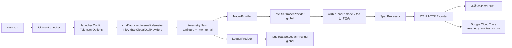

# Telemetry：把 Agent 接入 OpenTelemetry

> 本教程基于 [`examples/telemetry/main.go`](../../../examples/telemetry/main.go)。它展示如何在 ADK 启动时把 trace / log 接入 OpenTelemetry，并演示两条最常用的导出路径：直接通过 OTLP HTTP 推到自建 collector，或者推到 Google Cloud Trace。

## 你将学到

- ADK `telemetry` 包与 OpenTelemetry Go SDK 的关系：哪些是 ADK 自己的封装、哪些是原生 OTel 调用
- `launcher.Config.TelemetryOptions` 字段在 launcher 启动链路里被消费的时机（参见 [`cmd/launcher/internal/telemetry/telemetry.go:26`](../../../cmd/launcher/internal/telemetry/telemetry.go)）
- `telemetry.WithResource(...)` 给 span 注入 `service.name` / `service.version` 等语义约定属性
- 通过环境变量 `OTEL_EXPORTER_OTLP_ENDPOINT` 启用 OTLP HTTP exporter，把 trace 推到本地 collector
- 通过 `telemetry.WithOtelToCloud(true)` 把 trace 推到 Google Cloud Trace 的 OTLP 端点
- 调试技巧：先在本地启 Jaeger / otel-collector 看 span 是否出现，再切到 Cloud Trace

## 前置条件

- [x] 已完成 [01-getting-started/05-run-as-server.md](../01-getting-started/05-run-as-server.md)（理解 launcher 模式）
- [x] 已设置 `GOOGLE_API_KEY`（见 [00-prerequisites.md](../00-prerequisites.md)）
- [x] 本机可访问 `generativelanguage.googleapis.com`
- [x] 已 `git clone` ADK 仓库并 `go mod download`
- [x]（可选）本地已经跑着一个 OTLP 兼容的 collector，例如 Jaeger all-in-one 或 `otelcol`，监听 `:4318`（HTTP）

## 核心概念

**OpenTelemetry（OTel）** 是 CNCF 旗下的可观测性标准：它把"埋点 API（API）"与"导出实现（SDK）"解耦。你的代码只调 API，由 SDK 把数据（span、log record、metric）攒批后通过 **exporter** 发给 collector 或后端服务。ADK 自身在 runner、model、tool 调用处已经埋了点（参见架构文档的 telemetry 章节），只要你注册了全局 `TracerProvider`，那些 span 就会被自动捕获。

ADK 的 `telemetry` 包（[`telemetry/telemetry.go:31`](../../../telemetry/telemetry.go)）只做两件事：把 OTel SDK 的初始化封装成"返回一个 `*Providers`"的形式，让上层用 `defer providers.Shutdown(ctx)` 优雅关闭；以及提供 `SetGlobalOtelProviders()` 把当前 provider 设为 OTel 的全局 provider。真正组装 exporter、resource、processor 的代码在 [`telemetry/setup_otel.go`](../../../telemetry/setup_otel.go) 里，它会根据 `Option` 列表与环境变量决定输出到哪里——这意味着**多数情况下你不需要直接 import OTel SDK 的包**。

下图展示了从 ADK 启动到 span 出现在后端的端到端链路：



**看图指引**：

- `launcher.Config.TelemetryOptions`（[`cmd/launcher/launcher.go:65`](../../../cmd/launcher/launcher.go)）是一个 **functional option** 列表，你写的 `telemetry.WithResource(r)` 只是其中之一。
- 真正调用 `telemetry.New` 的地方是 [`cmd/launcher/internal/telemetry/telemetry.go:26`](../../../cmd/launcher/internal/telemetry/telemetry.go) 的 `InitAndSetGlobalOtelProviders`——它会把你传的 options 追加一个 `WithOtelToCloud`（由子 launcher 的 `--otel_to_cloud` 标志控制），再交给 SDK 初始化。
- 初始化完成后 ADK 在 runner、model、tool 内部调 `otel.Tracer("...")` 拿到的就是你的全局 provider，于是 span 不用改业务代码就出来了。
- exporter 终点的选择**完全由 SDK 决定**：检测到 `OTEL_EXPORTER_OTLP_ENDPOINT` 就走本地 HTTP；检测到 `WithOtelToCloud(true)` 就走 [`telemetry/setup_otel.go:251`](../../../telemetry/setup_otel.go) 的 `https://telemetry.googleapis.com/v1/traces`——二者可以并存。

## 完整代码

完整源码在 [`examples/telemetry/main.go`](../../../examples/telemetry/main.go)（约 90 行）：

```go
// examples/telemetry/main.go
package main

import (
	"context"
	"fmt"
	"log"
	"os"

	"go.opentelemetry.io/otel/sdk/resource"
	semconv "go.opentelemetry.io/otel/semconv/v1.36.0"
	"google.golang.org/genai"

	"google.golang.org/adk/agent"
	"google.golang.org/adk/agent/llmagent"
	"google.golang.org/adk/cmd/launcher"
	"google.golang.org/adk/cmd/launcher/full"
	"google.golang.org/adk/model/gemini"
	"google.golang.org/adk/telemetry"
	"google.golang.org/adk/tool"
	"google.golang.org/adk/tool/geminitool"
)

func main() {
	if err := run(); err != nil {
		log.Fatal(err)
	}
}

func run() error {
	ctx := context.Background()

	model, err := gemini.NewModel(ctx, "gemini-3.1-flash-lite", &genai.ClientConfig{
		APIKey: os.Getenv("GOOGLE_API_KEY"),
	})
	if err != nil {
		return fmt.Errorf("failed to create model: %w", err)
	}

	cfg := llmagent.Config{
		Name:        "weather_time_agent",
		Model:       model,
		Description: "Agent to answer questions about the time and weather in a city.",
		Instruction: "Your SOLE purpose is to answer questions about the current time and weather in a specific city. You MUST refuse to answer any questions unrelated to time or weather.",
		Tools: []tool.Tool{
			geminitool.GoogleSearch{},
		},
	}

	a, err := llmagent.New(cfg)
	if err != nil {
		return fmt.Errorf("failed to create agent: %w", err)
	}

	r, err := resource.New(ctx, resource.WithAttributes(
		semconv.ServiceNameKey.String("weather-time-agent"),
		semconv.ServiceVersionKey.String("1.0.0"),
	))
	if err != nil {
		return fmt.Errorf("failed to create resource: %w", err)
	}
	config := &launcher.Config{
		AgentLoader: agent.NewSingleLoader(a),
		TelemetryOptions: []telemetry.Option{
			telemetry.WithResource(r),
			// Other telemetry options can be added here.
		},
	}

	// Launcher automatically starts the telemetry.
	l := full.NewLauncher()
	if err = l.Execute(ctx, config, os.Args[1:]); err != nil {
		return fmt.Errorf("run failed: %v\n\n%s", err, l.CommandLineSyntax())
	}
	return nil
}
```

## 代码逐段讲解

### 1. 创建 Resource：给 span 打"我是谁"的标签

```go
r, err := resource.New(ctx, resource.WithAttributes(
    semconv.ServiceNameKey.String("weather-time-agent"),
    semconv.ServiceVersionKey.String("1.0.0"),
))
```

`resource` 是 OTel 里描述"产生这些 trace 的服务"的对象，所有由该 provider 产生的 span 都会带上这些属性。`semconv` 是 OTel 官方维护的语义约定（Semantic Conventions）常量——用 `ServiceNameKey` 而不是手写 `"service.name"` 可以避免拼写错误，并且能跟着 OTel 升级走。`ServiceName` / `ServiceVersion` 几乎是所有后端仪表盘的第一个分组维度，**没有它们你看到的 span 列表会很难阅读**。

ADK 的 [`telemetry/setup_otel.go:140`](../../../telemetry/setup_otel.go) 在初始化时会**先**用 `resource.Default()` 读 `OTEL_SERVICE_NAME` / `OTEL_RESOURCE_ATTRIBUTES` 环境变量，**再**叠加 GCP 探测器（如果开了 `WithOtelToCloud`），**最后**才 merge 你传的 `WithResource`——所以你传的属性会**覆盖**同名环境变量。详见 [`telemetry/config.go:19-22`](../../../telemetry/config.go) 的 `config.resource` 注释。

### 2. 注入 TelemetryOptions

```go
config := &launcher.Config{
    AgentLoader: agent.NewSingleLoader(a),
    TelemetryOptions: []telemetry.Option{
        telemetry.WithResource(r),
    },
}
```

`TelemetryOptions` 的类型是 `[]telemetry.Option`（[`cmd/launcher/launcher.go:65`](../../../cmd/launcher/launcher.go)），即一组 functional option。常见的 option 见 [`telemetry/config.go`](../../../telemetry/config.go)：

- `WithResource(*resource.Resource)`：自定义 resource
- `WithOtelToCloud(bool)`：是否导出到 Google Cloud Trace
- `WithSpanProcessors(...sdktrace.SpanProcessor)`：在默认 exporter 之外追加自定义 processor（例如 stdout exporter）
- `WithTracerProvider(*sdktrace.TracerProvider)`：跳过 ADK 内部组装，直接用你自己完全配置好的 provider

### 3. Launcher 自动启动 telemetry

```go
l := full.NewLauncher()
if err = l.Execute(ctx, config, os.Args[1:]); err != nil { ... }
```

`full.NewLauncher()`（[`cmd/launcher/full/full.go:31`](../../../cmd/launcher/full/full.go)）返回的是 universal launcher 的全集，它会在 `Execute` 里调用 `InitAndSetGlobalOtelProviders(ctx, config, false)`（参考 [`cmd/launcher/internal/telemetry/telemetry.go:26`](../../../cmd/launcher/internal/telemetry/telemetry.go)）——这里的第三个参数 `otelToCloud` 在 `full` 模式下是 `false`，但**用户仍然可以自己在 `TelemetryOptions` 里追加 `telemetry.WithOtelToCloud(true)` 来覆盖它**。

注意你**不需要**写 `telemetry.New(ctx, opts...)` 和 `defer providers.Shutdown(...)`——launcher 会处理 provider 的生命周期。但这有个副作用：launcher 退出时只会 `Shutdown` 一次，正在排队的 batch span 会被 flush 出去。

## 准备与运行

### 步骤 1：获取凭证

- **GOOGLE_API_KEY**：从 [Google AI Studio](https://aistudio.google.com/apikey) 申请。
- **（可选）GCP 项目**：如果要走 `WithOtelToCloud(true)`，需要 `GOOGLE_CLOUD_PROJECT` 环境变量 + ADC 凭证（`gcloud auth application-default login`）。

### 步骤 2：设置环境变量

**模式 A：本地 OTLP collector（推荐新手）**

```bash
export GOOGLE_API_KEY="<你的 key>"

# 假设本地有 otel-collector 或 Jaeger 监听 :4318
export OTEL_EXPORTER_OTLP_ENDPOINT="http://localhost:4318"
# 可选：让 service.name 在 UI 里更醒目
export OTEL_SERVICE_NAME="weather-time-agent"
```

**模式 B：Google Cloud Trace**

```bash
export GOOGLE_API_KEY="<你的 key>"
export GOOGLE_CLOUD_PROJECT="<你的 GCP project id>"
gcloud auth application-default login
```

### 步骤 3：运行

```bash
go run ./examples/telemetry
```

启动后 ADK 走的是 console launcher 子模式，按提示在终端输入例如 `What is the weather in Tokyo?`。trace 不会立刻出现在 UI 里——OTLP exporter 默认是 **batch 模式**，要等进程退出或满一批（典型 5 秒）才 flush。

### 步骤 4：测试输入

```
User: What is the weather in Tokyo?
```

期望：agent 通过 `geminitool.GoogleSearch` 工具查天气并回答。`Ctrl-D` 退出后，span 立刻被 flush 到配置的 endpoint。

### 步骤 5：验证 span 已落地

**模式 A**：打开 Jaeger UI（默认 `http://localhost:16686`），在 service 下拉里选 `weather-time-agent`，应该能看到一组带 `gen_ai.*` 属性的 span（`gen_ai.agent.name`、`gen_ai.llm.request.model` 等）。

**模式 B**：打开 [Google Cloud Trace 界面](https://console.cloud.google.com/traces/list)，按 service 名 `weather-time-agent` 过滤，能看到同上的 span。

## 常见错误

- **`failed to find default credentials`**（开 `WithOtelToCloud(true)` 但没 ADC）——执行 `gcloud auth application-default login`，或设 `GOOGLE_APPLICATION_CREDENTIALS` 指向服务账号 JSON。
- **`telemetry.googleapis.com requires setting the quota project`** —— `GOOGLE_CLOUD_PROJECT` 未设置，或 ADC JSON 里没有 `quota_project_id` 字段。参见 [`telemetry/setup_otel.go:130`](../../../telemetry/setup_otel.go) 的报错位置。
- **span 一直在跑但 UI 看不到** —— 大概率是 `OTEL_EXPORTER_OTLP_ENDPOINT` 写错（OTLP HTTP 的标准端口是 `4318`，gRPC 是 `4317`），或者 collector 还没起来。可以用 `telemetry.WithSpanProcessors(trace.NewSimpleSpanProcessor(stdouttrace.New(...)))` 临时把 span 打到 stdout 验证 SDK 是否被调用。
- **span 里有 `gemini` 字样但内容显示 `[REDACTED]`** —— `OTEL_INSTRUMENTATION_GENAI_CAPTURE_MESSAGE_CONTENT` 默认是 `false`，因为 genai 内容可能含 PII。需要时设 `"true"` 或用 [`telemetry/config.go:144`](../../../telemetry/config.go) 的 `WithGenAICaptureMessageContent(true)`。
- **Jaeger 里看到 `unknown service`** —— 忘了 `telemetry.WithResource` 或环境变量 `OTEL_SERVICE_NAME`。参见 [`telemetry/config.go:19-22`](../../../telemetry/config.go) 的字段注释。

## 关键 API 小结

| API | 位置 | 作用 |
|---|---|---|
| `telemetry.New` | [`telemetry/telemetry.go:118`](../../../telemetry/telemetry.go) | 主入口：组装 TracerProvider / LoggerProvider，返回 `*Providers` |
| `telemetry.Providers.Shutdown` | [`telemetry/telemetry.go:40`](../../../telemetry/telemetry.go) | 优雅关闭，flush 残余 batch span（launcher 模式**不需要**手动调） |
| `telemetry.Providers.SetGlobalOtelProviders` | [`telemetry/telemetry.go:56`](../../../telemetry/telemetry.go) | 把当前 provider 设为 OTel 全局（launcher 模式**不需要**手动调） |
| `telemetry.WithResource` | [`telemetry/config.go:96`](../../../telemetry/config.go) | 自定义 OTel resource（service.name / service.version 等） |
| `telemetry.WithOtelToCloud` | [`telemetry/config.go:72`](../../../telemetry/config.go) | 启用到 Google Cloud Trace 的 OTLP 导出 |
| `telemetry.WithSpanProcessors` | [`telemetry/config.go:112`](../../../telemetry/config.go) | 追加自定义 SpanProcessor（例如 stdout exporter） |
| `launcher.Config.TelemetryOptions` | [`cmd/launcher/launcher.go:65`](../../../cmd/launcher/launcher.go) | 把 telemetry option 注入 launcher 启动链路 |
| `cmd/launcher/internal/telemetry.InitAndSetGlobalOtelProviders` | [`cmd/launcher/internal/telemetry/telemetry.go:26`](../../../cmd/launcher/internal/telemetry/telemetry.go) | launcher 内部真正调 `telemetry.New` 的地方 |
| `resource.New` / `semconv.ServiceNameKey` | `go.opentelemetry.io/otel/sdk/resource` + `.../semconv/v1.36.0` | OTel 官方 API，构造 service 标识 resource |

## 延伸阅读

- 架构文档：[Telemetry 埋点位置与数据流](../../architecture/00-overview.md)（如该章节尚未发布，先看 [`telemetry/setup_otel.go:23-30`](../../../telemetry/setup_otel.go) 的 import 块与 [`telemetry/config.go:19-22`](../../../telemetry/config.go) 的字段注释）
- 架构文档：[ADK 在何处调 `otel.Tracer` 自动埋点](../../architecture/01-core-flows.md)（如该章节尚未发布，先看 `internal/telemetry` 包的 tracer 名字常量）
- 源码：[`examples/telemetry/main.go`](../../../examples/telemetry/main.go) —— 本教程讲解的 90 行可运行示例
- 源码：[`telemetry/telemetry.go`](../../../telemetry/telemetry.go) —— `Providers` 包装与 `New` 主入口
- 源码：[`telemetry/setup_otel.go`](../../../telemetry/setup_otel.go) —— resource 解析、exporter 装配、`WithOtelToCloud` 的 Cloud Trace 端点
- 源码：[`telemetry/config.go`](../../../telemetry/config.go) —— `Option` 函数列表与 `config` 字段含义
- 未来子项目深读占位：`internal/telemetry` 包的 instrumentation hook 列表、Cloud Logging exporter 落地（目前 Go SDK 尚未提供，参见 [`telemetry/setup_otel.go:207`](../../../telemetry/setup_otel.go) 的 TODO 注释）
