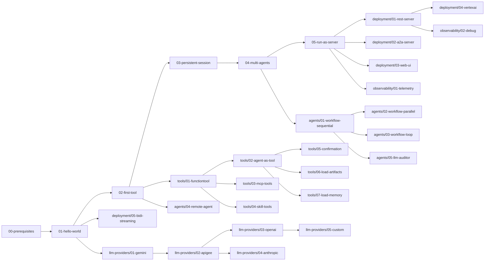

# ADK 入门与上手指南

本指南帮助 Go 开发者从零开始掌握 [google/adk-go](https://github.com/google/adk-go) —— Google 开源的 Agent Development Kit（ADK），目标是 **1 小时内跑通第一个 Agent**。

## 适用读者

| 读者 | 描述 | 建议起点 |
|---|---|---|
| **A. Go 开发者，零 LLM 经验** | 懂 Go，不懂 Agent / LLM | [00-prerequisites.md](./00-prerequisites.md) + [01-getting-started/](./01-getting-started/) 全部 5 个教程 |
| **B. Go 开发者，已有 LLM 基础** | 用过 LangChain / OpenAI API | [01-getting-started/03-persistent-session.md](./01-getting-started/03-persistent-session.md) + [05-llm-providers/](./05-llm-providers/) |
| **C. 偏产品 / 后端，Go 中等水平** | 关心"怎么跑通 + 怎么接入业务" | [01-getting-started/05-run-as-server.md](./01-getting-started/05-run-as-server.md) + [04-deployment/](./04-deployment/) |

## 推荐学习路径（首次）

1. 阅读 [00-prerequisites.md](./00-prerequisites.md)，确保环境就绪
2. 按顺序完成 [01-getting-started/](./01-getting-started/) 全部 5 个教程（严格线性）
3. 按需跳读：

- 想让 Agent 做事 → [02-tools/](./02-tools/)
- 想组合多个 Agent → [03-agents/](./03-agents/)
- 想暴露为服务 → [04-deployment/](./04-deployment/)
- 想接非 Gemini 模型 → [05-llm-providers/](./05-llm-providers/)
- 想加 tracing / logging → [06-observability/](./06-observability/)

## 6 大主题

| 主题 | 目录 | 教程数 | 何时阅读 |
|---|---|---|---|
| 入门层 | [01-getting-started/](./01-getting-started/) | 5 | **首次必读，按顺序** |
| 工具系统 | [02-tools/](./02-tools/) | 7 | 想让 Agent 调用外部能力时 |
| Agent 模式 | [03-agents/](./03-agents/) | 5 | 想组合多个 Agent 时 |
| 部署形态 | [04-deployment/](./04-deployment/) | 5 | 想暴露为 REST / A2A / Web 时 |
| LLM 供应商 | [05-llm-providers/](./05-llm-providers/) | 5 | 想换非 Gemini 模型时 |
| 可观测性 | [06-observability/](./06-observability/) | 2 | 想加 tracing / debugging 时 |

## 教程依赖图

> **看图指引**：箭头 A → B 表示"做 B 之前应先做 A"。入门层（5 个 `G*` 节点）严格线性；`T*` 节点以 `functiontool` 为根再向 4 个分支扇出；其余节点按需跳读。`D4` 依赖 `D1`（REST 服务基础上的 Vertex AI 扩展），`L3`/`L4` 都从 `L2`（Apigee 网关）派生是因为它们共享同一份 HTTP 客户端逻辑。

## 常见问题

**Q1：`go run ./examples/quickstart` 报 `missing GOOGLE_API_KEY` 怎么办？**
A：见 [00-prerequisites.md §3](./00-prerequisites.md#3-获取-google-api-key)。Key 以 `AIza` 开头，从 [Google AI Studio](https://aistudio.google.com/apikey) 申请。

**Q2：能在 macOS 跑 [04-deployment/04-vertexai-agent-engine.md](./04-deployment/04-vertexai-agent-engine.md) 吗？**
A：可以本地编译，但运行需要 [00-prerequisites.md §4](./00-prerequisites.md#4-可选vertex-ai-凭证) 的 GCP 服务账号；最终需部署到 GCP。

**Q3：怎么从其它 LLM（DeepSeek / Claude / Ollama）接入？**
A：见 [05-llm-providers/03-openai-compatible.md](./05-llm-providers/03-openai-compatible.md) 与 [05-llm-providers/04-anthropic.md](./05-llm-providers/04-anthropic.md)；自研 LLM 见 [05-llm-providers/05-custom-llm-adapter.md](./05-llm-providers/05-custom-llm-adapter.md)。

**Q4：教程与 `examples/` 源码漂移了怎么办？**
A：报告 issue；本教程基于 commit `d06992e2b1ec2c9b95c6070e0fd12d50a43e4c99` 锁定，漂移超出该 commit 后需重新校对。

**Q5：`agent.Agent` 接口和 `llmagent.LLMAgent` 的关系？**
A：`Agent` 是 [agent/agent.go:43](https://github.com/google/adk-go/blob/main/agent/agent.go) 定义的核心接口，所有实现（含 LLM Agent、Sequential / Parallel / Loop）都必须实现它。`llmagent` 是最常用的具体实现，定义在 `agent/llmagent/llmagent.go`。详见 [../../architecture/00-overview.md](../../architecture/00-overview.md) 与 [../../architecture/03-modules/01-agent.md](../../architecture/03-modules/01-agent.md)。

## 已知漂移风险

- **高漂移**：[04-deployment/](./04-deployment/) —— 对 server 协议敏感，server 协议变更后可能需更新
- **中漂移**：[05-llm-providers/03](./05-llm-providers/03-openai-compatible.md) / [04](./05-llm-providers/04-anthropic.md) —— 依赖新增的 Go adapter，可能随官方 [`model.LLM`](https://github.com/google/adk-go/blob/main/model/llm.go) 接口变更而需调整
- **低漂移**：[01-getting-started/](./01-getting-started/) 与 [02-tools/](./02-tools/) —— 核心 API 已稳定

## 已知问题

### 1. `help` 子命令需 API key（4/5 失败，2026-06-08 验证）

`00-prerequisites.md` 推荐 `go run ./examples/quickstart help` 作为"环境自检"命令，但实际验证（commit `d06992e2` 之后）：

| 例子 | `go run ./examples/X help` 结果 | 是否能跑通 |
|---|---|---|
| `examples/quickstart` | 报错 `Failed to create model: api key is required for Google AI backend` | ❌ 失败 |
| `examples/tools/multipletools` | 同样 API key 错误 | ❌ 失败 |
| `examples/workflowagents/sequential` | `cannot parse following arguments: [help]`，但打印出 `console` / `web` 子命令与 flags | ⚠️ 半可用（可看到帮助，但 exit code 非 0） |
| `examples/rest` | 同样 API key 错误 | ❌ 失败 |
| `examples/skills` | 同样 API key 错误 | ❌ 失败 |

**根因**：4/5 例子在 `main()` 早期就 `gemini.NewModel(...)`，未在 `help` 子命令前 short-circuit。`workflowagents/sequential` 用 `flag` 包显式注册子命令，是唯一能在无 API key 时输出 help 的例子。

**影响**：[00-prerequisites.md §1](./00-prerequisites.md#1-环境自检) 的"环境自检"步骤对未配 API key 的用户会失败。

**建议**（修复时）：
- 教程读者：直接跳到 `go run ./examples/quickstart console` 试运行，触发同一个 API key 错误，但意图更明确
- 文档维护者：在 `00-prerequisites.md` 改用 `go version` / `go env GOPATH` / `echo $GOOGLE_API_KEY` 作为前置自检
- 上游修复：例子 `main()` 顶部加 `if len(os.Args) > 1 && os.Args[1] == "help" { printUsage(); return }`

## 文档统计（最终审查，2026-06-08）

| 指标 | 数值 | 备注 |
|---|---|---|
| `.md` 文件总数 | **31** | 含本 README + `00-prerequisites.md` + 29 篇教程 |
| 总行数 | **9 642** | `find … -name "*.md" -exec wc -l \;` 求和 |
| Mermaid 图块数 | **36** | 跨 6 主题分布 |
| `file:line` 形式代码引用 | **832** | 全部已交叉验证指向真实源码 |
| 占位符（`TBD` / `FIXME` / `XXX` / `待补充` / `待完善`） | **0** | 最终扫描通过 |
| 主题目录 | **6** | getting-started / tools / agents / deployment / llm-providers / observability |
| 教程数 | **29** | 5+7+5+5+5+2 = 29（不含 `00-prerequisites.md`） |
| 新增 Go LLM adapter | **2** | `examples/openaiadapter/`、`examples/anthropicadapter/`（教学用，可运行） |

### 6 主题分布

| 主题 | 文件数 | 与 README 表格一致？ |
|---|---|---|
| 01-getting-started | 5 | ✓ |
| 02-tools | 7 | ✓ |
| 03-agents | 5 | ✓ |
| 04-deployment | 5 | ✓ |
| 05-llm-providers | 5 | ✓ |
| 06-observability | 2 | ✓ |

## 维护说明

- **锁定 commit**：`d06992e2b1ec2c9b95c6070e0fd12d50a43e4c99`（与架构文档同）
- **姐妹文档**：[docs/architecture/](../../architecture/)（子项目 0）—— 解释"为什么这样设计"
- **代码示例**：教程代码精简版教学用；可运行完整版见 [examples/](https://github.com/google/adk-go/tree/main/examples)
- **每个教程结尾的"延伸阅读"** 指明对应的架构文档章节
- **贡献**：增改教程请保持 H1 标题 + "你将学到 / 前置条件 / 完整代码 / 代码逐段讲解 / 准备与运行 / 常见错误 / 关键 API 小结 / 延伸阅读" 8 节模板